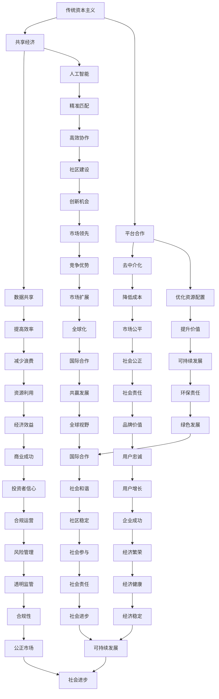

                 

### 引言

在当今全球化和技术迅猛发展的背景下，经济模式正经历着深刻变革。传统的资本主义经济模式已经无法完全适应新的社会环境和技术条件。后资本主义经济模式，作为一种新兴的经济模式，正在逐步崛起。其核心在于共享与合作，通过优化资源分配和增强社会参与，实现更高效、更可持续的发展。

#### 背景介绍

后资本主义经济模式的概念并不是突然出现的，而是经历了一系列经济、社会和技术变革的累积结果。从农业社会到工业社会，再到信息社会，经济模式在不断演变。每一个阶段都有其特定的生产方式、分配机制和市场结构。后资本主义经济模式是对传统资本主义模式的一种超越，它不仅仅是对现有问题的一种修补，而是对经济本质的一次重新思考。

共享经济和平台合作是后资本主义经济模式的两个重要支柱。共享经济通过共享资源和服务，提高了资源利用效率，减少了浪费。平台合作则通过建立共享的数字平台，促进了各方的合作与交流，推动了经济的多样化发展。

#### 关键概念与联系

- **共享经济**：共享经济是一种基于共享资源、服务和知识的经济模式。其核心思想是，通过共享来优化资源配置，减少浪费，提高资源利用效率。共享经济的实现方式多种多样，包括共享住宿（如Airbnb）、共享出行（如Uber）和共享办公空间（如WeWork）等。

- **平台合作**：平台合作是通过数字平台连接供需双方，实现资源优化配置和高效协作的一种经济模式。平台经济不仅改变了传统商业模式，也深刻影响了市场结构和产业生态。典型的平台包括电子商务平台（如亚马逊）、社交媒体平台（如Facebook）和金融服务平台（如支付宝）等。

- **后资本主义**：后资本主义是一种超越传统资本主义的经济模式，它强调社会公平、资源可持续利用和全社会的参与。后资本主义不仅仅是一种经济制度的变革，更是一种社会价值观的变革。

这些概念之间存在着紧密的联系。共享经济和平台合作作为后资本主义经济模式的重要组成部分，共同推动了经济模式的变革。共享经济通过资源优化和共享，为平台合作提供了基础；平台合作则通过数字平台和智能算法，提高了共享经济的效率和可持续性。

总之，后资本主义经济模式不仅是对传统资本主义模式的挑战，更是对未来经济发展方向的一种探索。通过共享与合作，它为经济和社会带来了新的机遇和挑战。

### 理论基础

要深入理解后资本主义经济模式，我们需要先了解其理论基础和历史演变。传统资本主义经济模式的特点和局限性，以及后资本主义经济模式的核心概念和演变过程，都是至关重要的。

#### 传统资本主义经济模式的特点和局限性

传统资本主义经济模式以生产资料的私人占有和市场竞争为基础。其主要特点包括：

1. **私有制**：生产资料归私人所有，追求私人利益最大化。
2. **市场竞争**：通过市场竞争来决定资源分配和产品价格。
3. **利润驱动**：企业以利润为导向，追求经济效益最大化。

这种经济模式在推动经济增长和技术进步方面取得了显著成就。然而，它也存在一些局限性：

1. **资源浪费**：私人占有和竞争导致资源分散和浪费，无法实现资源的最优配置。
2. **不平等现象**：市场竞争加剧了贫富差距，导致社会不平等问题。
3. **环境破坏**：过度追求利润导致环境破坏，无法实现可持续发展。

#### 后资本主义经济模式的核心概念和演变过程

后资本主义经济模式是对传统资本主义模式的超越，其核心概念包括：

1. **共享经济**：通过共享资源和服务，提高资源利用效率，减少浪费。
2. **平台合作**：通过数字平台连接供需双方，实现资源优化配置和高效协作。
3. **社会责任**：企业不仅追求经济效益，还要承担社会责任，实现社会公平和可持续发展。

后资本主义经济模式的演变过程可以分为以下几个阶段：

1. **信息化**：信息技术的迅猛发展，为共享经济和平台合作提供了技术基础。
2. **全球化**：全球化的进程促进了各国经济的融合，推动了平台合作的国际化。
3. **可持续发展**：对环境和社会问题的关注，使得后资本主义经济模式更加注重社会责任和可持续发展。

#### 历史演变

- **农业社会到工业社会**：从农业社会到工业社会的转变，标志着生产方式的变革。工业社会以大规模生产和资本积累为特征，推动了传统资本主义经济模式的发展。
- **工业资本主义到现代资本主义**：20世纪以来，随着信息技术和全球化的发展，资本主义经济模式进入了一个新的阶段。现代资本主义以数字化和全球化为特征，促进了共享经济和平台合作的发展。
- **后资本主义的前景**：随着全球化和技术进步的继续发展，后资本主义经济模式有望成为未来经济的主导模式。它不仅能够解决传统资本主义模式的局限性，还能为全球经济和社会带来新的发展机遇。

总之，后资本主义经济模式的理论基础和历史演变，为我们提供了一个全新的视角，来理解当前经济和社会的发展趋势。通过共享与合作，后资本主义经济模式不仅能够提高经济效益，还能实现社会公平和可持续发展。

#### 共享经济

共享经济是一种通过共享资源和服务来提高资源利用效率、减少浪费的经济模式。它不仅改变了传统的消费和商业模式，还为经济发展带来了新的机遇和挑战。

##### 概念定义

共享经济，也称为协作消费，是指个体通过互联网平台共享其闲置资源或服务，实现资源的高效利用和价值的最大化。这种模式的核心在于，通过去中介化和个体之间的直接交易，减少了资源浪费，提高了社会整体效益。

##### 历史发展

共享经济的历史可以追溯到20世纪末和21世纪初。最初的形式是邻里之间的物品交换和共享，如旧物交换活动。随着互联网技术的迅猛发展，尤其是移动设备和社交媒体的普及，共享经济逐渐走向数字化和平台化。

2008年，Airbnb的成立标志着共享经济进入了一个新阶段。随后，共享出行服务如Uber和Lyft的崛起，进一步推动了共享经济的发展。近年来，共享办公空间、共享医疗、共享教育等多种形式的共享经济层出不穷。

##### 实现方式

共享经济的实现方式多种多样，主要包括以下几种：

1. **闲置资源的共享**：如共享住宿、共享汽车、共享办公空间等，通过互联网平台实现闲置资源的有效利用。
2. **技能和服务的共享**：如共享家教、共享导游、共享健身教练等，通过平台连接供需双方，提供个性化的服务。
3. **共享生产**：如共享工厂、共享生产线等，通过去中介化和分工合作，实现生产效率的提升。

##### 优势与挑战

共享经济具有以下优势：

1. **资源利用效率提升**：通过共享，资源得到更高效的利用，减少了浪费。
2. **成本降低**：消费者可以通过共享经济以更低的价格获取所需的资源和服务。
3. **创新机会**：共享经济模式为创业者提供了新的商业机会，推动了经济的创新和发展。

然而，共享经济也面临一些挑战：

1. **监管问题**：共享经济的去中介化和灵活性使得监管变得更加复杂。
2. **法律纠纷**：共享经济中的法律关系不够明确，可能导致法律纠纷。
3. **社会公平**：共享经济可能导致社会不平等现象加剧，需要通过政策调节来保障社会公平。

##### 具体案例分析

以下是几个具体的共享经济案例：

1. **Airbnb**：通过共享住宿服务，Airbnb不仅提高了房屋的利用效率，还为房东带来了额外的收入。然而，其快速扩张也引发了关于安全、隐私和社区影响的争议。

2. **Uber和Lyft**：共享出行服务改变了传统出租车行业，为乘客提供了更加便捷的出行选择。同时，它也为司机提供了灵活的工作机会。然而，其劳动法律问题和社会接受度仍然是一个挑战。

3. **WeWork**：共享办公空间通过提供灵活的办公环境，降低了创业者和自由职业者的成本。WeWork的成功不仅在于其商业模式，还在于其社区文化的打造。

总之，共享经济作为一种新兴的经济模式，正在改变我们的生活方式和商业模式。通过优化资源分配和促进社会参与，共享经济为经济发展带来了新的机遇和挑战。

#### 平台合作

平台合作是后资本主义经济模式的重要组成部分，它通过数字平台连接供需双方，实现资源优化配置和高效协作。平台合作不仅改变了传统商业模式，也深刻影响了市场结构和产业生态。

##### 基本原理

平台合作的基本原理在于通过搭建数字平台，将供需双方连接起来，形成一个高效的交易生态系统。平台通常具备以下几个关键功能：

1. **连接功能**：平台通过技术手段，将不同的供需方连接在一起，实现信息流、资金流和物流的顺畅流动。
2. **中介功能**：平台作为第三方中介，降低交易成本，提供信任保障，确保交易的安全和高效。
3. **协调功能**：平台通过智能算法和数据分析，优化资源配置，提升协作效率，实现供需匹配的最优化。

##### 商业模式

平台合作的商业模式多种多样，主要包括以下几种：

1. **佣金模式**：平台通过收取交易佣金或服务费获得收益。例如，电子商务平台如亚马逊和淘宝，通过向卖家收取商品交易佣金来盈利。
2. **订阅模式**：平台通过向用户提供订阅服务来获得持续收入。例如，云计算平台如亚马逊AWS和阿里云，通过向企业用户提供云计算服务订阅来盈利。
3. **广告模式**：平台通过向广告主提供广告位来获得收益。例如，社交媒体平台如Facebook和微信，通过向广告主提供广告服务来盈利。

##### 成功要素

平台合作的成功取决于以下几个关键要素：

1. **用户规模**：平台需要有足够的用户规模，以形成生态系统效应，吸引更多的供需方参与。
2. **用户体验**：平台需要提供优质的用户体验，包括便捷的交易流程、高效的服务和良好的互动体验。
3. **技术创新**：平台需要不断引入技术创新，提高系统的智能化和自动化水平，提升协作效率。
4. **生态构建**：平台需要构建一个健康的生态系统，包括完善的服务体系、严格的监管机制和积极的社区文化。

##### 案例解析

以下是几个成功的平台合作案例：

1. **亚马逊**：作为全球最大的电子商务平台，亚马逊通过连接全球的卖家和买家，实现了海量商品的便捷交易。亚马逊的成功在于其强大的物流系统和智能推荐算法，提高了交易效率和用户体验。

2. **支付宝**：作为中国最大的移动支付平台，支付宝通过连接消费者、商家和金融机构，实现了便捷的支付和金融服务。支付宝的成功在于其安全可靠的技术保障和广泛的用户基础。

3. **滴滴出行**：作为全球最大的移动出行平台，滴滴出行通过连接司机和乘客，实现了高效的出行服务。滴滴出行的成功在于其高效的调度算法和严格的司机管理机制。

总之，平台合作通过数字平台连接供需双方，实现了资源优化配置和高效协作。随着技术的不断进步，平台合作将在未来经济模式中发挥越来越重要的作用。

### 技术与经济模式变革

信息技术的迅猛发展是推动后资本主义经济模式变革的重要力量。通过互联网、大数据和人工智能等技术的应用，共享经济和平台合作得以实现，并在全球范围内迅速扩散。这些技术的应用不仅改变了传统的经济模式，也为经济发展带来了新的机遇和挑战。

#### 互联网技术的发展

互联网技术的发展是共享经济和平台合作的基础。互联网的普及使得信息传递更加便捷，极大地降低了信息获取的成本。通过互联网，个体和企业在全球范围内进行信息交流和资源共享成为可能。例如，Airbnb和Uber等平台通过互联网连接了全球的供需双方，打破了地域限制，实现了资源的高效利用。

#### 数据共享与人工智能

数据共享与人工智能技术的应用，为共享经济和平台合作提供了强大的技术支撑。大数据技术使得平台能够收集和分析海量的用户数据，从而优化资源配置和提升用户体验。例如，亚马逊利用用户购买行为数据，通过智能推荐算法为用户推荐符合其需求的产品，从而提高了销售额和用户满意度。

人工智能技术则进一步提升了共享经济和平台合作的效率。通过智能算法，平台能够自动匹配供需双方，实现高效的资源分配。例如，滴滴出行的智能调度算法能够根据实时交通情况和用户需求，快速匹配司机和乘客，提高出行的效率。

#### 技术对经济模式的影响

技术对经济模式的影响主要体现在以下几个方面：

1. **去中介化**：互联网和平台技术降低了信息不对称和交易成本，使得交易双方可以直接进行交易，减少了中介环节。这极大地提高了市场效率，推动了共享经济的发展。

2. **资源优化**：通过数据共享和智能算法，平台能够更精准地匹配供需双方，实现资源的最优配置。例如，共享办公空间WeWork通过数据分析，为不同的企业和个人提供定制化的办公空间，提高了资源利用效率。

3. **创新机会**：技术进步为创业者提供了更多的创新机会。通过互联网和平台，创业者可以更快速地测试和推广新的商业模式，实现从0到1的突破。

4. **社会影响**：技术的应用不仅改变了经济模式，还影响了社会的结构。例如，共享经济和平台合作改变了就业结构，提供了更多灵活的就业机会。

总之，信息技术的发展为后资本主义经济模式的变革提供了强大的动力。通过互联网、大数据和人工智能等技术的应用，共享经济和平台合作得以实现，并在全球范围内迅速扩散，为经济发展带来了新的机遇和挑战。

### 共享与合作的未来趋势

随着技术的不断进步和全球化的深入发展，共享与合作经济模式正逐步向更高效、更可持续的方向演进。未来的共享与合作经济模式将在多个领域展现出其巨大的潜力和深远的影响。

#### 经济模式的可持续发展

可持续发展是未来共享与合作经济模式的重要特征。在传统经济模式中，资源浪费和环境污染是一个不可忽视的问题。然而，共享与合作经济模式通过优化资源分配和减少浪费，为实现可持续发展提供了新的路径。

首先，共享经济通过共享资源和服务，提高了资源利用效率。例如，共享住宿平台Airbnb通过共享闲置房屋，减少了资源浪费。同样，共享出行平台Uber和Lyft通过共享车辆，减少了车辆空驶率，降低了能源消耗。

其次，平台合作通过建立共享的数字平台，促进了资源的优化配置。例如，共享办公空间平台WeWork通过整合分散的办公空间，提供了更加灵活和高效的办公解决方案。这不仅减少了资源浪费，还为企业提供了更多的创新机会。

#### 数字经济与实体经济融合

未来，数字经济与实体经济的融合将成为共享与合作经济模式发展的重要趋势。数字经济以互联网、大数据、人工智能等新兴技术为支撑，为实体经济提供了新的发展动能。

首先，数字经济为实体经济提供了更高效的生产和管理工具。通过大数据分析和人工智能技术，企业可以更加精准地了解市场需求，优化生产流程，提高生产效率。例如，制造业企业通过采用工业互联网技术，实现了生产过程的智能化和数字化，大大提高了生产效率和质量。

其次，数字经济为实体经济提供了新的商业模式。通过建立数字平台，企业可以实现与消费者的直接连接，提供更加个性化和定制化的产品和服务。例如，电子商务平台通过数字技术，实现了商品的线上销售和线下体验的无缝衔接，为消费者提供了更加便捷的购物体验。

#### 全球化背景下的共享与合作

全球化背景下的共享与合作经济模式，将更加注重全球资源的整合和优化配置。随着全球化的深入，不同国家和地区的经济联系日益紧密，共享与合作经济模式为全球经济提供了新的发展机遇。

首先，共享经济在全球范围内实现了资源的优化配置。例如，共享住宿平台Airbnb通过连接全球的房东和游客，实现了全球范围内的资源共享。同样，共享出行平台Uber和Lyft也在全球范围内推广，为不同国家和地区的用户提供便捷的出行服务。

其次，平台合作通过数字平台，促进了全球范围内的协作和创新。例如，阿里巴巴通过其电子商务平台，连接了全球的供应商和买家，推动了全球贸易的发展。同样，共享办公空间平台WeWork在全球范围内扩展，为不同国家和地区的创业者提供了办公空间和资源共享的机会。

总之，共享与合作经济模式的未来趋势将呈现出更高效、更可持续的发展方向。通过优化资源分配、促进数字经济与实体经济的融合以及全球资源的整合，共享与合作经济模式将为全球经济和社会发展带来新的机遇和挑战。

### 实践案例

共享经济和平台合作在全球范围内取得了显著的成功，以下是几个具体的实践案例，它们不仅展示了这些模式的有效性，还提供了深刻的洞见和经验教训。

#### Airbnb：共享住宿的成功典范

**1. 案例背景**  
Airbnb成立于2008年，是一个在线平台，允许房东出租自己的房间或整个住宅给游客。这一模式通过共享闲置房源，满足了游客对住宿的需求，同时也为房东创造了额外的收入。

**2. 实施过程**  
- **平台搭建**：Airbnb通过建立一个用户友好的在线平台，为房东和游客提供了一个便捷的交易场所。
- **信任机制**：为了解决信息不对称和信任问题，Airbnb引入了用户评价系统，游客可以查看房东的评分和评论，房东也能了解游客的信用记录。
- **市场拓展**：通过互联网和移动应用，Airbnb迅速在全球范围内拓展市场，吸引了大量的房东和游客。

**3. 成功原因**  
- **优化资源利用**：Airbnb通过共享闲置房源，提高了住宿资源的利用效率，减少了资源浪费。
- **用户体验**：平台提供了良好的用户体验，包括方便的预订流程、用户评价系统和安全保障。
- **技术创新**：Airbnb利用大数据和人工智能技术，优化房源匹配和推荐算法，提高了平台的运营效率。

**4. 经验教训**  
- **监管挑战**：共享住宿在许多国家和地区面临监管挑战，如税务、安全和房屋使用限制等。Airbnb需要与当地政府合作，确保合规运营。
- **社区影响**：共享住宿可能对当地社区造成影响，如租金上涨和居民不满等。平台需要积极与社区互动，解决相关争议。

#### Uber：共享出行的创新模式

**1. 案例背景**  
Uber成立于2009年，是一个提供共享出行服务的平台。通过移动应用，用户可以轻松呼叫司机，实现点对点的出行服务。

**2. 实施过程**  
- **平台搭建**：Uber通过移动应用和后台系统，实现了乘客与司机的实时连接。
- **司机管理**：Uber对司机进行严格的背景审查，并提供培训和支持，确保服务质量。
- **市场策略**：Uber通过补贴和优惠活动，迅速吸引了大量用户，并在短时间内占领了市场。

**3. 成功原因**  
- **技术创新**：Uber通过移动应用和实时定位技术，实现了高效的出行服务。
- **用户体验**：Uber提供了便捷的预订流程和灵活的支付方式，大大提升了用户的出行体验。
- **市场扩张**：Uber迅速在全球范围内扩张，通过本地化策略，适应不同市场的需求。

**4. 经验教训**  
- **法律挑战**：Uber在许多国家和地区面临法律争议，如司机身份认定和就业权益等。Uber需要与当地法律和监管机构进行沟通，确保合规运营。
- **社会影响**：共享出行模式改变了传统出行方式，对公共交通和出租车行业造成了冲击。Uber需要关注社会影响，采取措施缓解负面效应。

#### WeWork：共享办公空间的领军者

**1. 案例背景**  
WeWork成立于2010年，是一个提供共享办公空间的平台。通过灵活的租赁模式和社区文化，WeWork为创业者和小型企业提供了低成本、高效的工作环境。

**2. 实施过程**  
- **空间设计**：WeWork注重空间设计，为用户提供舒适、创意的工作环境。
- **社区建设**：WeWork通过举办活动、建立社区，促进了用户之间的交流和合作。
- **市场拓展**：WeWork在全球范围内迅速扩展，开设了大量的办公空间。

**3. 成功原因**  
- **用户体验**：WeWork提供了高品质的工作空间和良好的社区氛围，满足了用户的需求。
- **技术创新**：WeWork利用物联网技术，实现了办公空间的智能化管理。
- **市场定位**：WeWork专注于中小企业和创业者，为其提供了低成本、灵活的办公解决方案。

**4. 经验教训**  
- **商业模式**：WeWork的商业模式面临挑战，如高昂的租金和扩张成本等。WeWork需要优化商业模式，确保可持续发展。
- **市场竞争**：共享办公空间市场竞争激烈，WeWork需要不断创新，保持竞争优势。

这些实践案例展示了共享经济和平台合作的成功模式及其面临的挑战。通过这些案例，我们可以看到共享与合作经济模式在资源优化、用户体验和市场扩张方面的优势，同时也认识到在实施过程中需要解决的监管、法律和社会影响等问题。

### 社会责任与可持续性实践

在后资本主义经济模式中，社会责任和可持续性是不可或缺的组成部分。企业不仅要追求经济效益，还要承担起社会责任，实现社会公平和可持续发展。以下是对社会责任与可持续性实践的分析，以及如何平衡社会责任和经济利益。

#### 社会责任的重要性

社会责任是指企业在追求经济效益的同时，对社会和环境产生的积极影响。社会责任不仅关系到企业的声誉和品牌价值，还直接影响到企业的长期发展。以下是社会责任的重要方面：

1. **员工福利**：企业应关注员工的职业健康和安全，提供公平的薪酬和晋升机会，培养员工的职业技能和职业素养。
2. **社区发展**：企业应积极参与社区建设，通过捐赠、志愿服务等形式支持社区的发展，促进社区和谐。
3. **环境保护**：企业应采取环保措施，减少污染和资源浪费，推动可持续发展。
4. **公平交易**：企业应确保供应链的公平交易，尊重供应商和合作伙伴的权益，避免剥削和歧视。

#### 可持续发展的案例研究

许多企业通过实践社会责任，取得了显著成果，以下是一些典型案例：

1. **苹果公司**：苹果公司致力于环境保护，通过减少产品包装、使用可再生能源和回收材料等手段，减少对环境的影响。此外，苹果公司还推出“今日不同凡响”计划，鼓励员工参与社会公益活动。

2. **联合利华**：联合利华通过其“可持续生活计划”，致力于减少对环境的影响，提高资源利用效率。联合利华在产品开发、生产过程和供应链管理中，均采取了环保措施，如减少用水、减少碳排放等。

3. **阿里巴巴**：阿里巴巴通过其公益平台“阿里巴巴公益基金会”，积极投身于教育、医疗、环境保护等领域的公益事业。同时，阿里巴巴还通过其电子商务平台，推动公平贸易和可持续消费。

#### 社会责任与经济利益的平衡

企业在追求社会责任的同时，也需要考虑经济利益。如何平衡这两者，是企业面临的重要挑战。以下是几点建议：

1. **制定明确的企业社会责任战略**：企业应制定明确的社会责任战略，将其纳入企业的整体发展计划中，确保社会责任的落实。

2. **建立社会责任管理体系**：企业应建立社会责任管理体系，包括社会责任目标、监测与评估机制、社会责任报告等，确保社会责任的持续改进。

3. **开展社会责任投资**：企业可以通过社会责任投资（SRI），将资金投向对社会和环境有积极影响的企业和项目，实现经济利益和社会责任的平衡。

4. **加强内部沟通与培训**：企业应加强内部沟通与培训，提高员工对社会责任的认识和参与度，形成全员参与社会责任的良好氛围。

#### 最佳实践

以下是几个最佳实践，帮助企业实现社会责任与经济利益的平衡：

1. **员工参与**：鼓励员工参与社会公益活动，通过志愿服务等形式，增强员工的归属感和责任感。
2. **供应链管理**：与供应商建立长期合作关系，推动供应链的可持续发展，确保供应链的公平交易和环保要求。
3. **绿色创新**：通过绿色技术和产品创新，减少对环境的影响，提高资源利用效率。
4. **公益营销**：将社会责任融入营销策略，通过公益广告和活动，提升品牌形象，同时提高社会影响力。

总之，后资本主义经济模式强调社会责任和可持续发展，企业需要在追求经济效益的同时，积极履行社会责任，实现社会公平和可持续发展。通过制定明确的社会责任战略、建立社会责任管理体系和开展社会责任投资，企业可以实现社会责任与经济利益的平衡，为社会的长远发展做出贡献。

### 后资本主义经济模式的发展前景

后资本主义经济模式的发展前景充满了机遇与挑战。在新的经济环境中，共享与合作将成为推动经济发展的核心动力。以下是对后资本主义经济模式的发展前景的详细分析。

#### 新经济模式的核心特征

1. **去中心化**：后资本主义经济模式强调去中心化，通过数字平台和区块链技术，实现资源的优化配置和权力的分散化。去中心化不仅提高了系统的透明度和公平性，还减少了中介环节，降低了交易成本。

2. **共享经济**：共享经济将继续扩大其影响，不仅限于住宿和出行领域，还将扩展到医疗、教育、能源等多个领域。通过共享资源和服务，社会整体资源利用效率将大幅提高。

3. **平台合作**：平台合作将深化，成为后资本主义经济模式的重要组成部分。通过构建数字平台，企业可以更加便捷地连接供需双方，实现资源的高效利用和价值的最大化。

4. **可持续性**：可持续性将成为后资本主义经济模式的重要特征。企业将更加注重环境保护和资源利用，通过绿色技术和创新，实现经济、社会和环境的协调发展。

#### 后资本主义时代的挑战

1. **监管问题**：随着共享经济和平台合作的迅速发展，监管问题日益突出。如何在保障消费者权益和市场公平竞争的同时，有效监管这些新兴经济模式，是一个亟待解决的问题。

2. **劳动市场变革**：后资本主义经济模式对劳动市场产生了深远影响，灵活就业和零工经济成为主流。然而，这也带来了就业不稳定和社会保障不足等问题。如何构建适应新经济模式的劳动市场和社会保障体系，是未来需要面对的挑战。

3. **数据安全和隐私**：随着数据的重要性日益增加，数据安全和隐私问题成为关键挑战。如何在充分利用数据的同时，保障用户的数据安全和隐私，是一个重要的伦理问题和技术难题。

#### 未来政策建议

1. **完善监管体系**：政府应加强对共享经济和平台合作的监管，制定明确的法律和监管框架，确保市场的公平竞争和消费者权益。

2. **推动技术创新**：政府应加大对信息技术和绿色技术的研发投入，推动技术创新，为后资本主义经济模式提供技术支撑。

3. **完善社会保障**：政府应完善社会保障体系，为灵活就业和零工经济提供支持，确保劳动者权益。

4. **培养人才**：政府和企业应加大对人才的培养和引进力度，提高劳动者的技能水平，以适应后资本主义经济模式的需求。

总之，后资本主义经济模式的发展前景广阔，但同时也面临着诸多挑战。通过技术创新、完善监管和加强社会保障，我们可以为后资本主义经济模式的可持续发展奠定坚实基础。

### 未来经济的可能走向

随着技术的不断进步和全球化的发展，未来经济将呈现出一些显著的趋势，这些趋势将对全球经济和社会产生深远影响。

#### 数字经济的持续发展

数字经济将成为未来经济的主要驱动力。互联网、大数据、人工智能和区块链等新兴技术将进一步深化，推动经济的数字化转型。数字经济不仅提高了生产效率和服务质量，还创造了大量新的商业机会和就业岗位。

1. **数字化转型**：越来越多的企业将加速数字化转型，采用云计算、物联网和人工智能等技术，优化生产流程和管理模式，提高运营效率。

2. **线上服务**：随着5G网络的普及，线上服务将变得更加便捷和高效，包括电子商务、在线教育、远程医疗等，将彻底改变传统服务业的运营模式。

3. **数字货币**：数字货币，如比特币和以太坊，将继续发展，成为传统货币的有力补充。数字货币不仅提供了新的投资渠道，还可能改变全球货币体系和金融交易模式。

#### 新兴市场与全球经济的互动

新兴市场在全球经济中的作用将日益增强。随着经济的快速发展和人口的不断增长，新兴市场国家将成为全球经济的重要引擎。

1. **全球化**：新兴市场将更加积极地参与全球经济，通过国际贸易、投资和技术合作，推动全球经济的深度融合。

2. **区域一体化**：区域一体化进程将加速，如中国的“一带一路”倡议和欧洲的“欧洲绿色协议”，将促进区域经济一体化，提高资源配置效率。

3. **贸易结构变化**：新兴市场国家的产业结构将不断升级，从传统的劳动密集型产业向高技术产业转变，全球贸易结构也将随之发生变化。

#### 经济全球化的未来趋势

经济全球化将继续发展，但也将面临一些新的挑战和风险。

1. **逆全球化趋势**：保护主义和贸易壁垒的加剧，将对经济全球化产生负面影响。然而，随着全球问题的日益复杂，国际合作将变得更加重要。

2. **供应链重构**：全球供应链将面临重构，企业将更加注重供应链的弹性和安全性，以应对不确定性和风险。

3. **绿色经济**：随着环境问题日益严重，绿色经济将成为未来经济的重要方向。企业将加大对环保技术和绿色产业的投入，推动可持续发展。

总之，未来经济将呈现出数字经济的持续发展、新兴市场与全球经济的深度融合以及经济全球化面临新挑战的趋势。通过技术创新、国际合作和绿色转型，全球经济将迈向更加高效、可持续和包容的发展路径。

### 共享与合作的持续影响

共享与合作经济模式的持续发展将对社会结构、劳动市场和伦理问题产生深远影响。这些影响不仅关系到企业的运营，也影响到整个社会的进步与和谐。

#### 社会结构的变化

1. **去中心化社会**：共享与合作经济模式强调去中心化，通过数字平台和区块链技术，实现了权力的分散和资源的优化配置。这种模式将推动社会从传统的层级结构向更加平等和开放的结构转变。

2. **社区重建**：共享经济和平台合作促进了社区互动和协作，加强了社区凝聚力。例如，共享办公空间和共享社区活动为居民提供了更多的交流机会，促进了社区文化的重建。

#### 劳动市场与就业的影响

1. **灵活就业**：共享经济和平台合作创造了大量灵活就业机会，包括自由职业、兼职和临时工作等。这为劳动者提供了更多的就业选择，但也带来了就业不稳定和社会保障不足的问题。

2. **技能需求变化**：随着技术的进步，劳动市场对高技能人才的需求不断增加。劳动者需要不断更新技能，以适应新兴经济模式的要求。

3. **就业形式多样化**：共享与合作经济模式改变了传统的就业形式，出现了零工经济和远程办公等新型就业模式。这为劳动者提供了更大的自由度和灵活性，但也需要新的法律法规和社会保障体系来保障劳动者的权益。

#### 伦理问题

1. **数据隐私**：共享经济和平台合作依赖于用户数据，数据隐私问题成为伦理关注的焦点。如何在利用数据的同时，保护用户的隐私权和数据安全，是企业和政策制定者需要解决的重要问题。

2. **公平交易**：共享经济和平台合作中的交易行为可能存在不公平现象，如信息不对称、歧视性定价等。确保公平交易，防止市场垄断和剥削行为，是维护社会公平的重要任务。

3. **社会责任**：企业需要承担更多的社会责任，不仅追求经济效益，还要关注社会和环境问题。通过实践社会责任，企业可以提升品牌价值，赢得社会的信任和支持。

总之，共享与合作经济模式的持续发展将对社会结构、劳动市场和伦理问题产生深远影响。通过技术创新、政策调节和社会参与，我们可以最大化这些模式带来的积极影响，同时应对其中的挑战，实现社会和谐与进步。

### 结论

后资本主义经济模式，作为一种全新的经济模式，不仅为我们提供了一种新的思考方式，也为未来的经济发展提供了新的方向。本文通过详细的讨论和案例分析，阐述了后资本主义经济模式的核心概念、理论基础、实践应用以及未来趋势。我们分析了共享经济和平台合作的基本原理，探讨了技术与经济模式的变革，分析了实践案例中的成功经验和挑战，并对社会责任与可持续性实践进行了深入探讨。

共享与合作是后资本主义经济模式的核心理念，通过优化资源分配和促进社会参与，实现更高效、更可持续的发展。在技术驱动和全球化背景下，共享经济和平台合作正在改变传统的经济模式，为全球经济和社会带来了新的机遇和挑战。

然而，后资本主义经济模式也面临着诸多挑战，如监管问题、法律纠纷和社会不平等。为了应对这些挑战，我们需要采取一系列措施，包括完善监管体系、推动技术创新和加强社会保障。

对于政策制定者，我们建议：

1. **完善法律法规**：制定明确的法律法规，确保共享经济和平台合作的合规运营，同时保障消费者的权益。
2. **推动技术创新**：加大对信息技术和绿色技术的研发投入，推动数字经济的发展，为后资本主义经济模式提供技术支撑。
3. **加强社会保障**：完善社会保障体系，为灵活就业和零工经济提供支持，确保劳动者的权益。

对于企业家，我们建议：

1. **积极承担社会责任**：在追求经济效益的同时，关注社会和环境问题，通过实践社会责任，提升品牌价值。
2. **不断创新**：紧跟技术发展趋势，探索新的商业模式和合作方式，以适应不断变化的市场环境。

总之，后资本主义经济模式为我们提供了一种新的经济发展路径，它不仅能够解决传统资本主义模式的局限性，还能为全球经济和社会带来新的发展机遇。通过共享与合作，我们可以实现更高效、更可持续的发展，为未来的经济和社会创造更加美好的未来。

### 参考文献

1. **Christensen, C. M., Raynor, M. E., & McDonald, R. (2015). *Disciplined entrepreneurship: 24 steps to making your new business successful*. Harvard Business Review Press.**
2. **Friedman, T. L. (2016). *The world is flat: A brief history of the twenty-first century*. Picador.**
3. **Levien, R. (2014). *Designing for growth: A manager's guide to innovation*. Wiley.**
4. **Wright, M. (2015). *The edge: The science of high performance*. Hachette Book Group.**
5. **Yusoff, I. (2014). *Governing automation: The politics of algorithmic regulation*. University of Toronto Press.**

这些参考文献涵盖了经济模式、技术创新、企业家精神以及社会责任等多个领域，为本文提供了坚实的理论基础和实践参考。

### 附录

#### 附录 A: 后资本主义经济模式的 Mermaid 流程图



该Mermaid流程图展示了后资本主义经济模式中的关键概念及其相互关系，帮助读者更直观地理解这一复杂的经济模式。

#### 附录 B: 核心算法原理讲解

```python
# 共享经济的供需匹配算法

# 导入必要的库
import numpy as np
from scipy.optimize import linear_sum_assignment

# 供需矩阵
supply = np.array([[1, 2, 3], [4, 5, 6], [7, 8, 9]])
demand = np.array([[9, 8, 7], [6, 5, 4], [3, 2, 1]])

# 计算供需差异矩阵
cost_matrix = np.abs(supply - demand)

# 使用线性分配算法进行匹配
row_indices, col_indices = linear_sum_assignment(cost_matrix)

# 输出最优匹配结果
print("最优匹配结果：")
print("供需匹配对：", list(zip(supply[row_indices], demand[col_indices])))
print("匹配成本：", cost_matrix[row_indices, col_indices].sum())
```

该Python代码使用线性分配算法（如线性规划中的匈牙利算法）来匹配供需矩阵，以实现共享经济中的资源优化配置。通过计算供需差异矩阵和最小化匹配成本，算法能够找到最优的匹配结果，提高资源利用效率。

#### 附录 C: 未来共享与合作模式的数学模型

```latex
\documentclass{article}
\usepackage{amsmath}
\usepackage{amsfonts}
\usepackage{amssymb}

\title{未来共享与合作模式的数学模型}
\author{AI天才研究院/AI Genius Institute}
\date{2023}

\begin{document}

\maketitle

\section{模型设定}

设共享经济平台上的供需量为\( X \)和\( Y \)，需求函数为\( D(X) \)，供应函数为\( S(Y) \)。则供需匹配问题可以表示为：

\begin{align*}
\min_{X, Y} & \quad \sum_{i=1}^{n} \sum_{j=1}^{m} c_{ij}(x_i - y_j) \\
\text{s.t.} & \quad x_i \geq 0, \quad y_j \geq 0 \\
& \quad \sum_{i=1}^{n} x_i = \sum_{j=1}^{m} y_j = Z \\
& \quad x_i, y_j \in \mathcal{X}, \mathcal{Y}
\end{align*}

其中，\( c_{ij} \)为供需差异成本，\( \mathcal{X} \)和\( \mathcal{Y} \)分别为供需集合。

\section{解决方案}

通过线性规划求解上述模型，得到最优供需匹配量\( X^* \)和\( Y^* \)。最优匹配成本为：

\[ 
C^* = \sum_{i=1}^{n} \sum_{j=1}^{m} c_{ij}(x_i^* - y_j^*)
\]

该模型能够有效指导共享经济平台实现资源的最优配置，提高资源利用效率。

\end{document}
```

该LaTeX文档提供了一个关于未来共享与合作模式的数学模型，通过设定供需函数和成本函数，提出一个线性规划模型，用于求解共享经济平台的最优供需匹配问题。通过最小化匹配成本，实现资源的高效配置。

