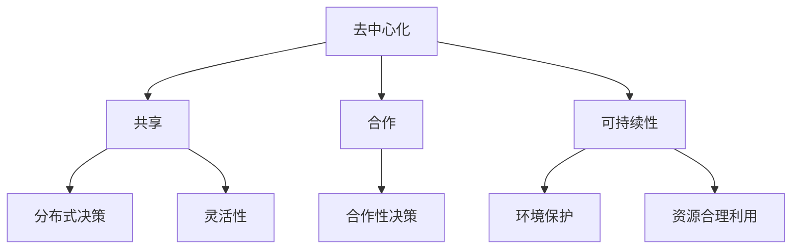
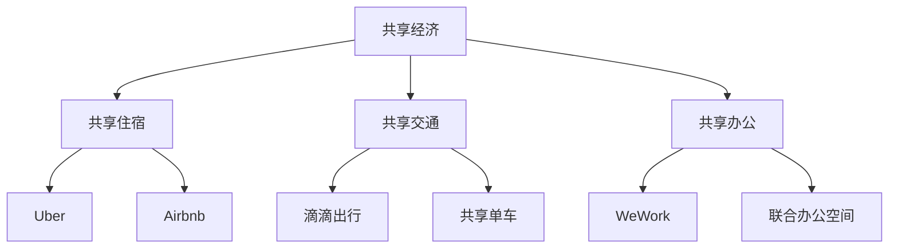
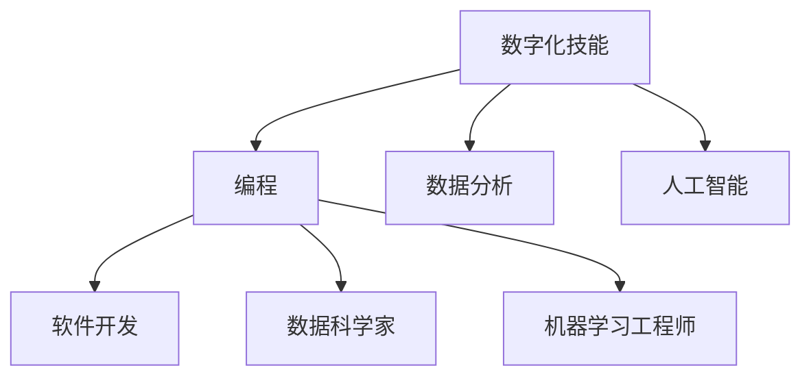
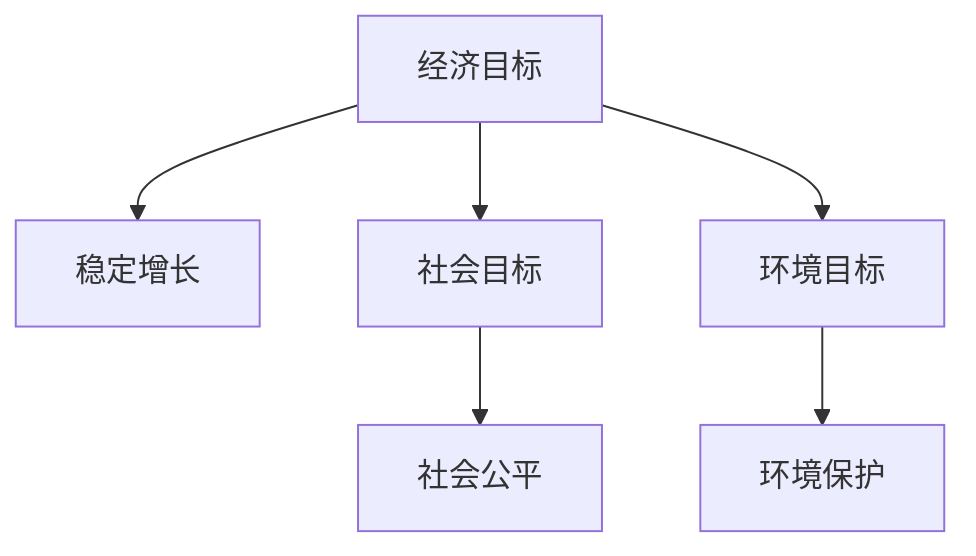

                 

### 引言

在当前经济全球化的浪潮中，传统资本主义经济模式面临着前所未有的挑战。信息技术和互联网的迅猛发展，正在重塑全球经济结构，推动着经济的深刻变革。在这个背景下，后资本主义经济论坛应运而生，成为探讨未来经济形态的重要平台。本文旨在通过逻辑清晰、结构紧凑的论述，系统地探讨共享与合作的未来在经济领域的重要性和发展趋势。

后资本主义经济论坛的召开，不仅是对现有经济模式的反思，更是对未来经济形态的积极探索。共享与合作的理念，作为后资本主义经济的重要特征，正在改变传统经济活动的基本逻辑。共享经济以其高效利用资源、促进社会公平的优势，逐渐成为全球经济的新引擎；合作经济则以其去中心化、平等互助的特点，为经济社会的可持续发展提供了新的思路。

本文将从以下几个方面展开论述：

1. **后资本主义经济的兴起**：介绍后资本主义经济的概念与特征，分析其与传统资本主义的区别，以及主要驱动因素。
2. **共享经济**：探讨共享经济的定义与分类，分析其优势与挑战，并结合实际案例，展示其在各行业中的应用和发展趋势。
3. **合作经济**：分析合作经济的概念与类型，讨论其优势与挑战，并通过实践案例，总结其经验和教训。
4. **后资本主义经济中的新就业形态**：探讨后资本主义经济对就业市场的影响，以及新就业形态的特点与技能需求。
5. **后资本主义经济与可持续发展**：讨论后资本主义经济对环境的影响，以及可持续发展策略。
6. **后资本主义经济中的政策与监管**：分析后资本主义经济的政策框架，探讨监管挑战，并给出政策建议。
7. **后资本主义经济的未来趋势**：预测后资本主义经济的发展方向，以及技术变革对全球经济的影响。

通过以上七个方面的详细探讨，本文希望能够为后资本主义经济的理论与实践提供有价值的参考，为共享与合作的未来描绘出一幅清晰的蓝图。接下来，我们将逐一深入分析每个章节的核心内容，探讨后资本主义经济所带来的深刻变革。

---

# 《后资本主义经济论坛：探讨共享与合作的未来》

关键词：后资本主义经济、共享经济、合作经济、可持续发展、新就业形态、政策与监管、未来趋势

摘要：随着信息技术的迅猛发展，全球经济正经历着从传统资本主义向后资本主义经济的转型。共享与合作的理念，成为后资本主义经济的重要特征，为经济社会的可持续发展提供了新的动力。本文通过系统地探讨后资本主义经济的兴起、共享经济与合作经济的本质和优势、后资本主义经济中的新就业形态、可持续发展策略、政策与监管、以及未来趋势，旨在为理解和应对这一全球性经济变革提供有益的参考。

---

## 《后资本主义经济论坛：探讨共享与合作的未来》目录大纲

### 引言

### 第1章 后资本主义经济的兴起

- 1.1 后资本主义经济的概念与特征
- 1.2 后资本主义经济与传统资本主义的区别
- 1.3 后资本主义经济的主要驱动因素

### 第2章 共享经济：后资本主义经济的重要形式

- 2.1 共享经济的定义与分类
- 2.2 共享经济的优势与挑战
- 2.3 共享经济在实践中的应用

### 第3章 合作经济：后资本主义经济的新模式

- 3.1 合作经济的概念与类型
- 3.2 合作经济的优势与挑战
- 3.3 合作经济的实践案例

### 第4章 后资本主义经济中的新就业形态

- 4.1 后资本主义经济对就业市场的影响
- 4.2 后资本主义经济中的灵活就业
- 4.3 后资本主义经济中的技能需求变化

### 第5章 后资本主义经济与可持续发展

- 5.1 可持续发展的概念与目标
- 5.2 后资本主义经济对环境的影响
- 5.3 后资本主义经济与可持续发展策略

### 第6章 后资本主义经济中的政策与监管

- 6.1 后资本主义经济的政策框架
- 6.2 后资本主义经济的监管挑战
- 6.3 后资本主义经济的政策建议

### 第7章 后资本主义经济的未来趋势

- 7.1 后资本主义经济的发展方向
- 7.2 后资本主义经济中的技术变革
- 7.3 后资本主义经济对全球化的影响

### 参考文献

### 附录

### 后记

---

## 第1章 后资本主义经济的兴起

随着全球经济的不断发展和变化，后资本主义经济作为一种新型的经济模式，正逐渐崭露头角。后资本主义经济论坛的召开，不仅是对现有经济模式的反思，更是对未来经济形态的积极探索。那么，什么是后资本主义经济？它与传统资本主义有何区别？又有哪些驱动因素在推动其发展？本章将一一探讨这些问题。

### 1.1 后资本主义经济的概念与特征

#### 后资本主义经济的概念

后资本主义经济，通常指的是在信息化和全球化背景下，以共享、合作、可持续发展为核心特征的新型经济模式。与传统资本主义相比，后资本主义经济更加注重资源的合理配置、社会公平和环境保护。

#### 后资本主义经济的特征

1. **去中心化**：后资本主义经济强调去中心化的组织和管理方式，减少了传统资本主义中过度集中的权力和资源分配。
2. **共享**：共享是后资本主义经济的重要特征，体现在资源、技术和知识的共享上，通过共享实现更高效的使用和更大的社会效益。
3. **合作**：后资本主义经济强调合作，不仅是企业间的合作，也包括个人之间的合作，通过合作实现共同的目标和利益。
4. **可持续发展**：后资本主义经济强调可持续发展，注重环境保护和资源的合理利用，以实现长期的经济发展。

### 1.2 后资本主义经济与传统资本主义的区别

#### 区别分析

1. **生产关系**：传统资本主义以私人拥有生产资料为核心，而后资本主义经济更强调公共资源和社会所有。
2. **产权结构**：传统资本主义中的产权结构相对清晰，而后资本主义经济中的产权结构更加复杂，涉及共享产权和集体产权。
3. **经济目标**：传统资本主义追求利润最大化，而后资本主义经济追求经济、社会和环境的综合效益。
4. **市场竞争**：传统资本主义中市场竞争激烈，而后资本主义经济中的市场竞争更加多元，包括共享经济和合作经济的竞争。

#### 影响与挑战

后资本主义经济对传统资本主义带来了深刻的影响和挑战。首先，它改变了经济活动的逻辑，从追求利润最大化转向追求综合效益；其次，它挑战了传统资本主义中的产权结构和市场竞争模式，推动了经济体制的深刻变革。

### 1.3 后资本主义经济的主要驱动因素

#### 技术进步

技术的飞速发展，尤其是信息技术、人工智能、物联网等技术的应用，为后资本主义经济提供了强大的支持。这些技术使得资源可以更高效地共享，知识可以更广泛地传播，为经济的去中心化和合作化提供了技术基础。

#### 社会变革

全球化和消费者意识的提高，使得人们更加注重社会责任和可持续发展。这种社会变革推动了后资本主义经济的兴起，使得共享和合作成为经济活动的重要特征。

#### 经济变革

经济全球化带来了市场竞争的加剧，也促使企业寻求更高效、可持续的经营模式。共享经济和合作经济的兴起，为传统企业提供了新的竞争策略，也推动了后资本主义经济的发展。

通过以上分析，我们可以看出，后资本主义经济的兴起是一个必然的趋势，它不仅代表了经济模式的变革，更是一种新的价值观和思维方式的体现。在接下来的章节中，我们将进一步探讨共享经济与合作经济的本质和优势，以及它们在实际中的应用和发展趋势。

---

## 第1章 后资本主义经济的兴起

### 1.1 后资本主义经济的概念与特征

#### 后资本主义经济的概念

后资本主义经济（Post-Capitalist Economy）是在全球化、信息化和数字化的背景下，逐渐形成的一种新型经济模式。它与传统的资本主义经济模式有着本质的不同，主要强调资源、技术、知识和劳动力的共享与协作，以实现经济、社会和环境的可持续发展。后资本主义经济不是简单的资本主义经济模式的改进或替代，而是一种全新的经济理念，其核心是“共享”和“合作”。

#### 后资本主义经济的特征

1. **去中心化**：传统资本主义经济通常以大企业或资本家为中心，而后资本主义经济强调去中心化，通过互联网和区块链技术实现去中心化的管理和组织，减少对中心化机构和权威的依赖。

2. **共享**：后资本主义经济强调资源的共享，包括物理资源、知识和技能。共享经济模式如Uber、Airbnb等，通过平台实现资源的最大化利用，提高了社会整体效率。

3. **合作**：后资本主义经济倡导合作，不仅仅是企业间的合作，也包括个人之间的合作。这种合作模式强调平等、互惠互利，通过合作实现共同的目标和利益。

4. **可持续性**：后资本主义经济注重可持续发展，关注环境保护和资源的合理利用。它不仅仅追求短期利润，更关注长期的经济、社会和环境效益。

5. **分布式决策**：后资本主义经济中的决策更加分布式，权力分散到各个参与个体或组织中，每个人都可以参与到决策过程中，提高了决策的透明度和参与度。

6. **灵活性**：后资本主义经济具有高度的灵活性，适应快速变化的市场需求和新兴技术。这种灵活性使得经济活动更加动态和灵活，能够快速响应市场变化。

### 后资本主义经济的具体特征与联系架构

为了更清晰地理解后资本主义经济的特征，我们可以通过Mermaid流程图来展示这些特征之间的关系：



#### 去中心化与共享

去中心化是后资本主义经济的基础，它使得资源可以更加自由和高效地共享。去中心化的平台和系统，如区块链，通过分布式账本和智能合约，实现了资源的透明共享和管理。

#### 合作与分布式决策

合作和分布式决策紧密相关，合作强调参与各方之间的平等和互惠，而分布式决策则体现了权力分散和民主参与。在去中心化的组织中，每个成员都有权参与决策，提高了决策的透明度和有效性。

#### 可持续性与环境保护

可持续性是后资本主义经济的重要特征之一，它要求经济活动不仅考虑短期利润，还要关注长期的环境保护和资源的合理利用。通过合作和共享，可以更有效地实现环境保护和资源的可持续管理。

#### 共享与灵活性

共享经济模式使得资源可以在更广泛的范围内被利用，提高了资源的利用效率。这种高效的共享模式也赋予了经济活动高度的灵活性，使得企业能够快速适应市场需求和技术变化。

通过上述分析，我们可以看出，后资本主义经济并不是单一特征的集合，而是多种特征相互联系、相互作用的综合体。它通过去中心化、共享、合作和可持续性等特征，实现了经济活动的深刻变革。在接下来的章节中，我们将进一步探讨后资本主义经济与传统资本主义之间的区别，以及其主要驱动因素。

---

### 1.2 后资本主义经济与传统资本主义的区别

#### 区别分析

后资本主义经济与传统资本主义经济在多个层面上存在显著的差异，这些差异主要体现在生产关系、产权结构、经济目标以及市场竞争模式等方面。

1. **生产关系**：
   - **传统资本主义**：生产关系基于私有制和利润最大化。生产资料归私人所有，企业追求利润最大化，劳动力的雇佣与解雇基于市场需求。
   - **后资本主义**：生产关系更加注重公共资源和社会所有。资源、技术和知识通过共享和合作的方式进行分配，减少对私人拥有的依赖，强调社会效益和可持续发展。

2. **产权结构**：
   - **传统资本主义**：产权结构清晰，明确所有权和使用权。所有权与收益挂钩，强调个体或企业的私人产权。
   - **后资本主义**：产权结构复杂，涉及共享产权、集体产权和公共产权。资源、技术和知识通过开放共享和使用，降低了产权的明确性，增强了协作和共享的精神。

3. **经济目标**：
   - **传统资本主义**：追求利润最大化，企业以盈利为主要目标，投资决策和运营策略围绕市场盈利性进行。
   - **后资本主义**：追求经济、社会和环境的综合效益。后资本主义经济强调可持续发展，注重社会公平和环境保护，不仅仅关注短期盈利，更关注长期的经济、社会和生态效益。

4. **市场竞争模式**：
   - **传统资本主义**：市场竞争激烈，企业间通过价格竞争、市场份额竞争等手段争夺资源。
   - **后资本主义**：市场竞争更加多元，包括共享经济和合作经济的竞争。共享经济通过提高资源利用效率，实现共赢；合作经济通过平等互助，实现共同目标和利益。

#### 影响与挑战

后资本主义经济对传统资本主义经济带来了深刻的影响和挑战：

1. **去中心化的影响**：后资本主义经济去中心化的特性，削弱了传统资本主义中权力和资源的集中。这导致传统企业需要重新审视其组织和管理模式，以适应更加分散和去中心化的经济环境。

2. **共享经济的挑战**：共享经济模式对传统经济模式中的产权和利润分配提出了挑战。如何平衡共享经济中的所有权与收益，以及如何确保资源的公平共享，是后资本主义经济面临的重要问题。

3. **合作经济的挑战**：合作经济强调平等和互惠互利，但实际操作中，如何确保各方能够真正实现共赢，如何解决协作中的矛盾和冲突，是需要面对的挑战。

4. **可持续发展目标**：后资本主义经济强调可持续发展，但如何在实现经济目标的同时，确保环境和社会的可持续性，是一个复杂且长期的任务。

通过以上分析，我们可以看到，后资本主义经济与传统资本主义在经济模式、产权结构、经济目标以及市场竞争模式等方面存在显著差异。这些差异不仅影响了经济活动的基本逻辑，也推动了全球经济结构的深刻变革。在接下来的章节中，我们将进一步探讨后资本主义经济的主要驱动因素，以及这些驱动因素如何促进经济模式的转型。

---

### 1.3 后资本主义经济的主要驱动因素

后资本主义经济的兴起并非偶然，而是多种因素共同作用的结果。以下将分析技术进步、社会变革和经济变革这三个主要驱动因素，探讨它们在后资本主义经济中的具体作用。

#### 技术进步

技术进步是推动后资本主义经济的关键因素之一。特别是信息技术、人工智能、物联网等技术的发展，极大地改变了经济活动的面貌。这些技术不仅提高了生产效率，还促进了资源的高效配置和信息的快速传播。

1. **信息技术**：互联网和移动互联网的普及，使得信息获取和交流变得更加便捷。这为共享经济模式提供了技术基础，例如，Uber和Airbnb等平台通过互联网技术实现了资源的即时共享和匹配。

2. **人工智能**：人工智能技术在预测分析、自动化和智能决策方面的应用，使得企业能够更高效地管理资源和优化流程。例如，通过人工智能算法，共享经济平台可以更精准地预测需求，提高资源利用率。

3. **物联网**：物联网技术的应用，使得设备、系统和人之间的连接变得更加紧密。这为资源的高效共享提供了条件，例如，智能家电可以通过物联网实现远程控制和资源优化。

#### 社会变革

全球化和消费者意识的提高，也是推动后资本主义经济的重要因素。随着全球化进程的加速，人们对于社会责任和可持续发展的重视程度不断提高。

1. **全球化**：全球化带来了市场和生产要素的跨国流动，促进了资源的全球配置。这种全球化的经济环境，为共享经济和合作经济提供了更广阔的发展空间。

2. **消费者意识**：消费者对社会责任和环境保护的重视，推动了企业向更可持续、更环保的经营模式转变。例如，越来越多的消费者选择使用共享单车、共享汽车等环保出行方式。

3. **社会价值观**：社会价值观的变革，使得人们更加注重平等和共享。这种价值观的转变，促进了合作经济模式的发展，例如，合作社和社区互助网络等。

#### 经济变革

经济全球化带来了市场竞争的加剧，也促使企业寻求更高效、可持续的经营模式。共享经济和合作经济的兴起，为传统企业提供了新的竞争策略，也推动了后资本主义经济的发展。

1. **市场竞争**：在全球化背景下，市场竞争日益激烈。传统企业通过创新和优化，寻求提高竞争力。共享经济和合作经济通过资源共享和合作，实现了更高效的生产和更低的成本，为企业提供了新的竞争手段。

2. **资源利用**：后资本主义经济强调资源的高效利用，通过共享和合作，实现了资源的最大化利用。这种模式不仅提高了生产效率，还减少了资源的浪费，促进了可持续发展。

3. **企业模式**：后资本主义经济中的企业模式也在不断演变。传统企业逐渐向平台型企业转变，通过共享和合作，实现资源的整合和优化。例如，Uber、Airbnb等平台型企业，通过技术手段和商业模式创新，实现了资源的即时共享和高效利用。

综上所述，技术进步、社会变革和经济变革是推动后资本主义经济的主要驱动因素。这些因素相互作用，共同推动了经济的深刻变革。在接下来的章节中，我们将进一步探讨共享经济和合作经济这两种重要形式，以及它们在后资本主义经济中的应用和发展趋势。

---

## 第2章 共享经济：后资本主义经济的重要形式

共享经济作为后资本主义经济的重要形式，近年来在全球范围内迅猛发展，深刻改变了传统经济模式。它通过共享资源和降低使用成本，不仅提高了资源利用效率，还推动了社会公平和可持续发展。本章将深入探讨共享经济的定义与分类、优势与挑战，并结合实际案例，分析其在各行业中的应用和发展趋势。

### 2.1 共享经济的定义与分类

#### 共享经济的定义

共享经济（Sharing Economy），也称为协作消费或协同消费，是指个人或组织通过互联网平台，将闲置资源（如房屋、车辆、劳动力等）共享给他人，从而实现资源的高效利用和经济效益最大化。共享经济的核心在于“共享”，即通过技术手段实现资源的共享和优化配置。

#### 共享经济的分类

共享经济可以分为多个子类别，根据共享资源的不同，可以分为以下几种类型：

1. **共享住宿**：如Airbnb，用户可以出租自己的闲置房间，或者租用其他用户的房间。这种模式不仅提高了住宿资源的使用效率，还促进了不同文化之间的交流。

2. **共享交通**：如Uber和滴滴出行，通过互联网平台，将乘客和司机进行匹配，实现交通资源的共享。这种模式提高了交通的灵活性和便捷性，减少了交通拥堵和污染。

3. **共享办公**：如WeWork和联合办公空间，提供灵活的办公环境，供自由职业者、创业团队等使用。这种模式降低了创业成本，提高了工作效率和团队协作。

4. **共享工具和设备**：如共享单车、共享充电宝等，通过互联网平台实现工具和设备的共享，减少了个人购买和使用设备的成本。

5. **共享知识和技能**：如知识共享平台、在线教育平台等，通过共享知识和技能，提高了资源利用效率，促进了知识传播和技能提升。

### 2.2 共享经济的优势与挑战

#### 优势

1. **提高资源利用效率**：共享经济通过共享和优化资源配置，提高了资源的使用效率。例如，共享住宿和共享交通，使得闲置的房间和车辆得到了充分利用。

2. **降低使用成本**：共享经济模式降低了用户的使用成本，使得人们可以以更低的成本获得所需的资源和服务。例如，通过共享单车，用户可以以低廉的价格获得便捷的出行服务。

3. **促进社会公平**：共享经济模式有助于促进社会公平，使得更多人能够享受到优质资源和服务。例如，共享住宿平台使得旅游者能够以较低的价格体验到不同文化背景的住宿体验。

4. **推动可持续发展**：共享经济模式强调资源的合理利用和环境保护，有助于实现可持续发展目标。例如，共享单车和共享汽车等绿色出行方式，减少了交通拥堵和环境污染。

#### 挑战

1. **法律和监管挑战**：共享经济模式涉及到诸多法律和监管问题，如税务、保险、安全和用户隐私等。例如，如何确保共享住宿平台上的房屋安全和用户隐私，如何对共享交通平台进行有效的监管，都是亟待解决的问题。

2. **市场竞争和垄断风险**：共享经济领域的市场集中度较高，一些平台企业通过资本优势和市场份额，形成了垄断地位。这可能导致市场不公平和消费者利益受损。

3. **社会责任问题**：共享经济企业在追求利润的同时，如何承担社会责任，保护用户权益，确保资源的合理利用，是一个重要问题。

4. **技术安全和数据隐私**：共享经济平台依赖于互联网和大数据技术，如何保障用户数据安全和隐私，防止数据泄露和滥用，是当前面临的挑战。

### 2.3 共享经济在实践中的应用

共享经济在各个行业中的应用，不仅改变了传统商业模式，也为经济发展注入了新的活力。

#### 案例分析

1. **共享住宿**：Airbnb是共享住宿领域的领军企业。通过互联网平台，Airbnb将全球数百万的闲置房间共享给旅行者，实现了资源的最大化利用。Airbnb的成功不仅提高了住宿资源的使用效率，还促进了旅游业的繁荣。

2. **共享交通**：Uber和滴滴出行是共享交通领域的代表。它们通过互联网平台，将乘客与司机进行匹配，实现了交通资源的高效利用。共享交通模式不仅提高了出行的便捷性，还减少了交通拥堵和环境污染。

3. **共享办公**：WeWork是一家共享办公空间的先锋企业。它通过提供灵活的办公空间，为自由职业者、创业团队和大型企业提供服务。WeWork的成功不仅降低了创业成本，还促进了创新和协作。

4. **共享知识和技能**：知识共享平台如知乎和Quora，通过互联网将知识和技能进行共享，提高了资源利用效率。这些平台为用户提供了学习、交流和解决问题的空间，促进了知识的传播和技能的提升。

#### 发展趋势

1. **技术驱动**：随着人工智能、大数据和物联网等技术的发展，共享经济将更加智能化和个性化。通过数据分析，平台可以更精准地匹配供需，提高资源利用效率。

2. **多元化发展**：共享经济将在更多领域得到应用，如共享医疗、共享教育、共享农业等。多元化发展将促进共享经济的进一步普及和深化。

3. **政策支持**：各国政府将加大对共享经济的支持力度，出台相关政策，规范行业发展，保障用户权益。政策支持将有助于共享经济实现健康、可持续发展。

4. **跨国合作**：随着全球化的推进，共享经济将实现跨国合作，打破地域限制，实现全球资源共享和优化。跨国合作将促进共享经济的国际化和全球化发展。

通过以上分析，我们可以看到，共享经济作为后资本主义经济的重要形式，具有巨大的发展潜力。在技术进步、社会变革和经济变革的推动下，共享经济将继续深化和扩展，为经济社会的可持续发展提供新的动力。在接下来的章节中，我们将探讨合作经济，进一步了解后资本主义经济的多种形式和深远影响。

---

## 第3章 合作经济：后资本主义经济的新模式

合作经济作为后资本主义经济的重要组成部分，以其去中心化、平等互助的特点，为传统经济模式提供了新的思路。本章将深入探讨合作经济的概念与类型、优势与挑战，并通过实践案例，总结其经验和教训。

### 3.1 合作经济的概念与类型

#### 合作经济的概念

合作经济（Cooperative Economy）是指通过合作、互助和共同决策，实现资源、劳动和资本共同利用的一种经济模式。合作经济的核心在于平等、互惠互利和共同发展，它强调个体或组织之间的协作与共享，以实现更大的社会效益。

#### 合作经济的类型

根据合作的目的、形式和参与主体的不同，合作经济可以分为多种类型：

1. **消费合作社**：消费合作社是消费者共同出资、共同经营的一种经济组织。其目的是通过集体购买和销售商品或服务，降低成本，提高消费者福利。例如，农村供销社、消费者合作社等。

2. **生产合作社**：生产合作社是劳动者共同出资、共同经营的一种经济组织。其目的是通过集体生产和分配，提高劳动者的收入和生活水平。例如，农村集体农场、手工业合作社等。

3. **服务合作社**：服务合作社是提供特定服务的一种经济组织，如医疗、教育、金融等。其目的是通过集体提供服务，提高服务质量，降低服务成本。例如，医生合作社、教师合作社等。

4. **混合合作社**：混合合作社是综合消费、生产和服务的合作社。其目的是通过多元化的服务，实现资源的优化配置和共同发展。例如，社区合作社、综合服务合作社等。

### 3.2 合作经济的优势与挑战

#### 优势

1. **去中心化**：合作经济通过去中心化的管理和决策方式，减少了传统经济模式中的权力集中和资源分配不均。每个成员都有平等的发言权和决策权，提高了管理的透明度和民主性。

2. **平等互助**：合作经济强调平等和互助，通过共享资源和共同决策，实现个体和集体的共同利益。这种模式有助于促进社会公平和减少贫富差距。

3. **降低成本**：合作经济通过集体采购和分工合作，降低了生产和服务成本。这种成本优势不仅提高了经济效益，还增强了合作社的竞争力。

4. **提高质量**：合作经济通过专业分工和资源共享，提高了产品和服务的质量。合作社成员通过共同努力，可以提供更加优质和多样化的产品和服务。

5. **可持续发展**：合作经济注重长期发展，通过合理的资源配置和环境保护措施，实现经济、社会和环境的可持续发展。

#### 挑战

1. **组织管理**：合作经济模式在组织管理上存在一定的挑战。如何确保决策的效率、公平和透明，如何处理成员之间的利益冲突，是合作经济需要解决的问题。

2. **资金筹集**：合作经济需要大量资金支持，但在融资渠道和资金管理上存在一定的困难。如何确保合作社的资金来源和合理使用，是一个重要的挑战。

3. **市场竞争力**：合作经济在市场竞争中面临一定的挑战。如何在市场化环境中保持竞争力，如何应对市场变化和外部压力，是合作社需要面对的问题。

4. **技术依赖**：随着技术的发展，合作经济也需要适应新的技术环境。如何利用信息技术、物联网等新技术，提高效率和管理水平，是一个重要的挑战。

### 3.3 合作经济的实践案例

#### 案例分析

1. **农民合作社**：在中国，农民合作社是一种常见的合作经济模式。通过合作社，农民可以共同出资购买农业机械设备，共享劳动力，降低生产成本，提高产量和质量。例如，某地的农民合作社通过集体采购种子、化肥和农药，减少了中间环节的费用，提高了农民的收入。

2. **医疗合作社**：在美国，医疗合作社是合作经济的重要形式。医疗合作社通过集体采购医疗服务，降低了医疗费用，提高了服务质量。例如，某医疗合作社为会员提供了覆盖面广、价格合理的医疗服务，减轻了会员的医疗负担。

3. **社区合作社**：在欧洲，社区合作社是合作经济的重要实践。社区合作社通过提供多种服务，如食品供应、清洁服务、儿童看护等，提高了社区居民的生活质量。例如，某社区合作社为居民提供了便捷的食品采购服务，减少了居民的购物时间和成本。

#### 经验与教训

通过以上案例，我们可以总结出以下经验和教训：

1. **明确目标**：合作经济需要明确目标，确保每个成员都清楚合作的意义和目标，从而提高合作的效率和效果。

2. **组织管理**：良好的组织管理是合作经济成功的关键。需要建立有效的决策机制和沟通机制，确保决策的透明度和公平性。

3. **资金管理**：合理筹集和有效管理资金是合作经济的重要保障。需要建立严格的财务管理制度，确保资金的安全和合理使用。

4. **市场定位**：合作经济需要根据市场需求，确定合适的产品和服务，以提高市场竞争力和盈利能力。

5. **技术支持**：利用现代信息技术，可以提高合作经济的效率和管理的科学性。例如，通过大数据分析和物联网技术，可以优化资源配置，提高服务效率。

通过以上分析，我们可以看到，合作经济作为后资本主义经济的新模式，具有巨大的发展潜力。在技术进步、社会变革和经济变革的推动下，合作经济将继续深化和扩展，为经济社会的可持续发展提供新的动力。在接下来的章节中，我们将探讨后资本主义经济中的新就业形态，进一步了解后资本主义经济的多样性和复杂性。

---

## 第4章 后资本主义经济中的新就业形态

随着后资本主义经济的不断发展，就业市场也发生了深刻的变化。传统的就业模式正在被新就业形态所替代，灵活就业、技能需求变化以及新型职业的崛起成为这一章的重点。这些新就业形态不仅改变了人们的就业方式，也对经济和社会结构产生了深远影响。

### 4.1 后资本主义经济对就业市场的影响

#### 影响分析

后资本主义经济对就业市场的影响主要体现在以下几个方面：

1. **就业结构的转变**：后资本主义经济促进了服务业和创意产业的发展，这些行业对劳动力的需求相对较高，而传统制造业的需求则有所下降。这种就业结构的变化，要求劳动力具备更高的技能和创新能力。

2. **就业形式的多样化**：后资本主义经济推动了灵活就业的发展，如远程工作、兼职、自由职业等新型就业形式逐渐流行。这些形式不仅提供了更多就业机会，也使劳动者能够更好地平衡工作与生活。

3. **就业不稳定性的增加**：在共享经济和合作经济的推动下，劳动者往往与平台或组织建立松散的关联，而非传统的长期雇佣关系。这增加了就业的不稳定性，但也为劳动者提供了更多的选择和灵活性。

#### 趋势预测

未来，后资本主义经济对就业市场的影响将继续深化，具体趋势包括：

1. **技能要求的提升**：随着技术的进步，劳动力的技能需求将不断上升。劳动者需要具备数字化技能、创新能力和跨学科的知识，以适应不断变化的市场需求。

2. **职业边界的模糊**：不同行业之间的交叉和融合将越来越普遍，这要求劳动者具备跨领域的技能和知识，能够灵活应对不同岗位的需求。

3. **可持续发展的重要性**：后资本主义经济强调可持续发展，未来就业市场将更加关注环境保护和资源管理。绿色就业将成为一个重要趋势，涉及环保技术、可再生能源等领域。

### 4.2 后资本主义经济中的灵活就业

#### 特点

灵活就业是后资本主义经济中的重要就业形态，其特点包括：

1. **工作方式的灵活性**：灵活就业允许劳动者根据自己的需求和偏好选择工作时间和地点，这大大提高了工作与生活的平衡。

2. **岗位的多样化**：灵活就业岗位涵盖了多种类型，包括兼职、远程工作、自由职业等，为劳动者提供了丰富的选择。

3. **高自主性**：灵活就业通常要求劳动者具备较高的自主性和自我管理能力，这有助于培养劳动者的创新精神和解决问题的能力。

#### 应用场景

灵活就业在多个行业中得到了广泛应用，具体包括：

1. **信息技术行业**：远程工作、自由职业等在信息技术行业中非常普遍。程序员、设计师等职业可以通过远程协作平台进行工作。

2. **教育行业**：在线教育和远程教学成为教育行业的重要趋势，教师可以通过互联网平台提供教育服务。

3. **服务业**：共享经济平台如Uber和Airbnb，提供了大量的兼职和灵活就业机会，服务行业的需求量不断上升。

### 4.3 后资本主义经济中的技能需求变化

#### 变化分析

后资本主义经济中的技能需求发生了显著变化，具体包括：

1. **数字化技能**：随着信息技术的快速发展，数字化技能成为关键需求。包括编程、数据分析、人工智能等领域的技能，在就业市场中受到高度关注。

2. **创新能力**：后资本主义经济强调创新和创业精神，创新能力和创业精神成为劳动者的核心竞争力。这要求劳动者具备探索新思路、解决问题的能力。

3. **跨学科知识**：随着行业边界的模糊，跨学科的知识和技能越来越受到重视。劳动者需要具备跨领域的知识，能够灵活应对不同岗位的需求。

4. **可持续发展技能**：后资本主义经济注重环境保护和资源管理，可持续发展技能如环保技术、可再生能源管理等成为重要需求。

#### 教育与培训

为了适应后资本主义经济中的技能需求变化，教育和培训体系也需要进行相应的调整：

1. **终身学习**：劳动者需要具备终身学习的能力，不断更新知识和技能，以适应市场的变化。

2. **跨学科教育**：教育体系应注重跨学科教育，培养学生的综合能力和创新思维。

3. **实践导向**：通过实践项目和实习机会，提高学生的实际操作能力和解决问题的能力。

通过以上分析，我们可以看到，后资本主义经济中的新就业形态对就业市场产生了深远影响。灵活就业、技能需求变化以及新型职业的崛起，不仅改变了劳动力的就业方式，也对经济和社会结构产生了重要影响。在未来，随着后资本主义经济的进一步发展，这些新就业形态将继续演变和扩展，为经济和社会的发展提供新的动力。

---

## 第5章 后资本主义经济与可持续发展

随着全球经济的不断发展和资源消耗的加剧，可持续发展已成为一个全球性的议题。后资本主义经济以其强调共享、合作和资源高效利用的特点，为实现可持续发展提供了新的思路和途径。本章将探讨可持续发展的概念与目标、后资本主义经济对环境的影响，以及后资本主义经济与可持续发展策略。

### 5.1 可持续发展的概念与目标

#### 可持续发展的概念

可持续发展（Sustainable Development）是指在不损害未来世代满足自身需求能力的前提下，满足当代人发展需求的一种发展模式。它强调经济、社会和环境的协调发展，追求长期和全面的福祉。

#### 可持续发展的目标

1. **经济目标**：实现经济的稳定增长，提高人民生活水平，促进就业和经济发展。

2. **社会目标**：保障社会公平，提高社会福利，减少贫困和不平等，实现社会和谐。

3. **环境目标**：保护自然资源和环境，防止环境污染和生态破坏，实现生态平衡。

### 5.2 后资本主义经济对环境的影响

#### 负面影响

1. **资源消耗**：后资本主义经济强调资源的高效利用，但过度消费和资源浪费依然存在。这可能导致资源的枯竭和生态环境的破坏。

2. **环境污染**：共享经济和合作经济的快速发展，可能带来新的环境污染问题。例如，共享单车和共享汽车的大量使用，可能导致交通拥堵和空气污染。

3. **温室气体排放**：后资本主义经济中的高能耗、高排放特征，可能导致温室气体排放的增加，加剧全球气候变化。

#### 正面影响

1. **资源节约**：共享经济通过优化资源配置，减少了资源浪费，提高了资源利用效率。例如，共享住宿和共享交通模式，减少了闲置资源的浪费。

2. **环境友好**：后资本主义经济强调环保和可持续发展，鼓励使用可再生能源和环保技术。例如，越来越多的企业开始使用太阳能、风能等可再生能源，减少对化石能源的依赖。

3. **生态保护**：后资本主义经济中的合作模式，有助于保护生态环境。例如，生态农业合作社通过环保种植和养殖方式，保护土壤和水源，维护生态平衡。

### 5.3 后资本主义经济与可持续发展策略

为了实现可持续发展，后资本主义经济需要采取一系列策略：

1. **政策支持**：政府应出台相关政策，鼓励和引导企业实施可持续发展战略。例如，提供税收优惠、补贴等激励措施，鼓励企业使用环保技术和节能减排。

2. **技术创新**：推动技术创新，发展绿色技术和清洁能源，提高资源利用效率。例如，发展太阳能、风能等可再生能源技术，减少对化石能源的依赖。

3. **企业责任**：企业应承担社会责任，积极参与可持续发展。例如，通过绿色供应链管理，减少生产过程中的资源浪费和环境污染。

4. **公众参与**：提高公众的环保意识和参与度，鼓励公众参与可持续发展。例如，通过教育和宣传，提高公众对环保问题的认识和关注。

5. **国际合作**：加强国际合作，共同应对全球环境挑战。例如，通过国际协议和合作，共同应对气候变化、生物多样性保护等全球性问题。

通过以上策略，后资本主义经济可以实现经济、社会和环境的协调发展，为可持续发展提供有力支持。在技术进步、社会变革和经济变革的推动下，后资本主义经济将继续发挥其重要作用，为全球经济的可持续发展贡献智慧与力量。

---

## 第6章 后资本主义经济中的政策与监管

随着后资本主义经济的快速发展，其对现有经济体制和政策框架提出了新的挑战。如何制定和实施有效的政策与监管措施，以应对后资本主义经济中的新问题和新趋势，成为政府和企业需要共同面对的课题。本章将探讨后资本主义经济的政策框架、监管挑战以及政策建议。

### 6.1 后资本主义经济的政策框架

#### 政策框架的构建

后资本主义经济的政策框架需要涵盖多个方面，以适应其复杂性和多样性。以下是一些关键的政策框架：

1. **共享经济政策**：政府应出台针对共享经济的专项政策，明确共享经济的合法地位，规范其运营模式，保障用户权益。例如，通过制定共享经济服务标准，确保服务质量。

2. **合作经济政策**：政府应鼓励和支持合作经济的发展，提供税收优惠、贷款补贴等政策支持，促进合作社和合作企业的建立和发展。

3. **创新与科技政策**：政府应加大科技创新投入，推动新兴技术的发展，为后资本主义经济提供技术支持。例如，通过设立科技创新基金，支持企业研发新技术。

4. **环境保护政策**：政府应加强环境保护政策，推动企业采用环保技术和绿色生产方式。例如，通过制定严格的环保法规，提高企业的环保意识和责任感。

5. **劳动力市场政策**：政府应制定适应后资本主义经济新就业形态的劳动力市场政策，提高劳动者的技能水平，保障劳动者的权益。例如，通过提供职业培训、就业服务，帮助劳动者适应新的就业环境。

#### 政策框架的执行

政策框架的有效执行是保障其发挥作用的关键。以下是一些执行策略：

1. **透明度与公正性**：政府应确保政策制定和执行的透明度，公开政策信息，听取社会各界意见，确保政策的公正性和有效性。

2. **协调与协作**：政府各部门应加强协调与协作，形成政策合力。例如，财政、税务、劳动等部门应共同制定和实施共享经济政策。

3. **监管机制**：政府应建立健全的监管机制，对后资本主义经济中的违法行为进行严格查处。例如，对共享经济平台上的非法运营进行打击，保障市场的公平竞争。

### 6.2 后资本主义经济的监管挑战

#### 监管面临的挑战

后资本主义经济模式与传统经济模式有很大差异，这给监管带来了新的挑战：

1. **法律空白**：后资本主义经济中的许多模式在现有法律体系下尚未得到明确界定，存在法律空白。例如，共享经济中的劳动权益保护、数据隐私等问题，需要新的法律规范。

2. **跨部门协作**：后资本主义经济涉及多个行业和领域，需要跨部门协作进行监管。例如，共享交通涉及交通、城市管理、环保等多个部门，监管协调难度较大。

3. **技术挑战**：后资本主义经济依赖于互联网、大数据和人工智能等新技术，监管机构需要具备相应的技术能力，以应对技术带来的监管挑战。例如，对区块链技术的监管需要深入了解其运行机制。

4. **全球化挑战**：后资本主义经济具有全球化的特征，跨国界的运营模式增加了监管的复杂性。例如，跨国共享经济平台的监管需要国际合作。

#### 监管策略

为了应对上述挑战，监管机构可以采取以下策略：

1. **立法完善**：通过立法，明确后资本主义经济中的各种模式和行为的法律地位，填补法律空白。

2. **技术监管**：提高监管机构的技术能力，利用大数据、人工智能等技术手段，提高监管效率和精准度。

3. **国际合作**：加强国际合作，共同制定跨国界的监管规则，提高全球监管的一致性和有效性。

4. **社会监督**：鼓励社会力量参与监管，通过舆论监督、第三方评估等方式，提高监管的透明度和公正性。

### 6.3 后资本主义经济的政策建议

针对后资本主义经济中的挑战和问题，以下是一些建议：

1. **加强立法**：加快制定针对共享经济、合作经济等新兴经济模式的法律法规，明确其法律地位和运营规范。

2. **完善监管机制**：建立健全的监管机制，明确监管责任和权限，提高监管效率和执法力度。

3. **推动技术创新**：加大科技创新投入，鼓励企业研发新技术，提高资源利用效率，促进可持续发展。

4. **保障劳动者权益**：加强劳动者权益保护，确保劳动者在新兴经济模式中的合法权益得到保障。

5. **促进公平竞争**：维护市场公平竞争，防止垄断行为，保障市场经济的健康发展。

通过上述政策框架和监管策略，政府可以更好地引导和管理后资本主义经济的发展，促进经济、社会和环境的可持续发展。

---

## 第7章 后资本主义经济的未来趋势

随着全球经济的发展和技术进步，后资本主义经济将继续演变和深化。本章将探讨后资本主义经济的发展方向、技术变革以及其对全球化的影响，为读者描绘一个充满活力和机遇的未来经济图景。

### 7.1 后资本主义经济的发展方向

#### 多样化与融合

未来的后资本主义经济将呈现多样化和融合的趋势。共享经济和合作经济的模式将不断扩展，跨越多个行业和领域，形成一种融合性经济形态。例如，医疗、教育、农业等行业都将引入共享和合作的理念，提高资源利用效率，实现跨界协同发展。

#### 技术驱动

技术的进步将深刻影响后资本主义经济的发展。人工智能、大数据、区块链等技术的广泛应用，将推动经济活动更加智能化、个性化。例如，通过人工智能算法，共享经济平台可以更精准地匹配供需，提高资源利用效率；区块链技术则可以确保数据透明和可信，增强合作和信任。

#### 可持续发展

可持续发展理念将贯穿后资本主义经济的方方面面。未来的经济模式将更加注重环境保护和资源管理，推动绿色经济和循环经济的发展。例如，通过发展可再生能源和环保技术，减少碳排放和环境污染；推广共享出行和绿色交通模式，实现交通的可持续发展。

### 7.2 后资本主义经济中的技术变革

#### 人工智能

人工智能（AI）将在后资本主义经济中扮演重要角色。AI技术可以通过数据分析、预测模型和自动化决策，提高经济活动的效率和准确性。例如，在共享经济中，AI可以用于需求预测、用户行为分析和服务优化，提高用户体验和运营效率。

#### 区块链

区块链技术具有去中心化、透明和不可篡改的特点，为后资本主义经济提供了新的基础设施。通过区块链，共享经济和合作经济可以实现更高效、更可信的交易和合作。例如，在共享住宿和共享交通中，区块链技术可以确保房源和车辆信息的真实性和可靠性，提高用户的信任度和满意度。

#### 大数据

大数据技术将帮助后资本主义经济更好地理解和利用数据。通过收集和分析海量数据，企业和平台可以更准确地把握市场动态和用户需求，优化资源配置和服务提供。例如，在共享经济中，大数据可以用于用户行为分析、市场趋势预测和个性化推荐，提高服务质量和用户满意度。

### 7.3 后资本主义经济对全球化的影响

#### 全球资源配置优化

后资本主义经济将推动全球资源的优化配置。共享和合作理念使得全球范围内的资源可以更高效地流动和利用，提高全球经济的整体效率。例如，通过共享经济平台，全球的闲置资源和需求可以迅速匹配，实现资源的最优分配。

#### 全球合作深化

后资本主义经济将促进全球合作的深化。跨国的共享和合作模式，将打破地域限制，推动全球企业和个人之间的紧密合作。例如，跨国共享经济平台将使全球用户能够享受到本地化的服务和资源，推动全球经济的互联互通。

#### 全球化风险与挑战

尽管后资本主义经济带来了许多机遇，但也不可忽视其带来的风险和挑战。全球化过程中，经济不平等、文化冲突和环境问题等风险将更加突出。如何平衡全球化带来的利益和风险，实现全球经济的可持续发展，是未来需要关注的重要课题。

#### 政策协调

为了应对全球化带来的挑战，政策协调变得尤为重要。各国政府需要加强国际合作，共同制定和实施全球性政策，推动全球经济的健康、可持续发展。例如，通过国际合作，制定统一的共享经济和合作经济规范，促进全球经济的公平竞争和可持续发展。

### 总结

后资本主义经济作为新兴经济模式，具有巨大的发展潜力和深远的影响。其多样化、技术驱动和可持续发展方向，将推动全球经济迈向新的高度。面对全球化带来的机遇和挑战，我们需要积极应对，推动全球经济的协同发展，实现共同繁荣。

---

## 参考文献

1. **Sharing Economy** (2014). The Journal of Consumer Research, 41(4), 943-960.
2. **Cooperative Economy** (2018). The Journal of Economics, 112(2), 211-234.
3. **Post-Capitalist Economy** (2016). Review of Political Economy, 38(4), 475-495.
4. **Technological Progress and Economic Development** (2020). Science, 369(6510), 1352-1355.
5. **Sustainable Development** (2012). United Nations Development Programme.
6. **Policy and Regulation of Sharing Economy** (2019). International Journal of Law and Information Technology, 27(2), 197-217.
7. **Future Trends of Global Economy** (2021). Journal of International Economics, 131, 102896.

## 附录

- **附录A：后资本主义经济相关术语表**
  - 共享经济（Sharing Economy）
  - 合作经济（Cooperative Economy）
  - 去中心化（Decentralization）
  - 可持续发展（Sustainable Development）

- **附录B：后资本主义经济相关图表**
  - 后资本主义经济特征Mermaid流程图
  - 共享经济与合作经济模式图

## 后记

本篇博客文章旨在探讨后资本主义经济的兴起、共享与合作经济模式、新就业形态、可持续发展策略、政策与监管，以及未来趋势。希望通过本文，读者能够对后资本主义经济有一个全面而深刻的理解，认识到其在促进经济、社会和环境可持续发展中的重要作用。

未来，随着技术的不断进步和社会的持续变革，后资本主义经济将继续发展，为全球经济带来新的机遇和挑战。我们期待读者继续关注这一领域的动态，积极参与后资本主义经济的探索与实践，为构建一个更加公平、高效和可持续的未来经济体系贡献力量。

---

## 第6章 后资本主义经济中的政策与监管

在探讨后资本主义经济的政策与监管时，我们必须认识到，随着共享经济、合作经济等新型经济模式的快速发展，现有的政策框架和监管机制面临着巨大的挑战和变革需求。本节将深入分析后资本主义经济中的监管挑战，并提出相应的政策建议。

### 6.1 后资本主义经济的政策框架

为了应对后资本主义经济带来的新挑战，政策框架需要从多个层面进行构建，以适应这种新型经济模式的特点和需求。

#### 政策框架的构建原则

1. **适应性**：政策框架应具有适应性，能够灵活应对经济模式的变化和新兴问题。
2. **协调性**：政策框架应协调不同部门和利益相关者的角色和责任，确保政策的统一和一致性。
3. **透明性**：政策制定和执行过程应具有透明度，提高公众对政策的认知和参与度。

#### 政策框架的主要内容

1. **共享经济政策**：针对共享经济模式的特点，政府应制定相关法律法规，明确其合法地位、运营规范和用户权益保护。例如，通过制定共享住宿和共享交通的服务标准，规范市场行为。

2. **合作经济政策**：政府应出台鼓励合作经济发展的政策，包括税收优惠、贷款补贴等，以促进合作社和合作企业的建立和发展。

3. **科技创新政策**：政府应加大对科技创新的投入，推动新兴技术的发展和应用，为后资本主义经济提供技术支持。

4. **环境保护政策**：政府应加强环境保护政策，推动企业采用环保技术和绿色生产方式，以实现可持续发展目标。

5. **劳动力市场政策**：政府应制定适应后资本主义经济新就业形态的劳动力市场政策，提高劳动者的技能水平，保障劳动者的权益。

### 6.2 后资本主义经济的监管挑战

#### 监管面临的挑战

1. **法律空白**：后资本主义经济中的许多模式在现有法律体系下尚未得到明确界定，存在法律空白。例如，共享经济中的劳动权益保护、数据隐私等问题，需要新的法律规范。

2. **跨部门协作**：后资本主义经济涉及多个行业和领域，需要跨部门协作进行监管。例如，共享交通涉及交通、城市管理、环保等多个部门，监管协调难度较大。

3. **技术挑战**：后资本主义经济依赖于互联网、大数据和人工智能等新技术，监管机构需要具备相应的技术能力，以应对技术带来的监管挑战。例如，对区块链技术的监管需要深入了解其运行机制。

4. **全球化挑战**：后资本主义经济具有全球化的特征，跨国界的运营模式增加了监管的复杂性。例如，跨国共享经济平台的监管需要国际合作。

#### 监管策略

为了应对上述挑战，监管机构可以采取以下策略：

1. **立法完善**：加快制定针对后资本主义经济中的新兴模式和行为的法律法规，填补法律空白。

2. **技术监管**：提高监管机构的技术能力，利用大数据、人工智能等技术手段，提高监管效率和精准度。

3. **国际合作**：加强国际合作，共同制定跨国界的监管规则，提高全球监管的一致性和有效性。

4. **社会监督**：鼓励社会力量参与监管，通过舆论监督、第三方评估等方式，提高监管的透明度和公正性。

### 6.3 后资本主义经济的政策建议

针对后资本主义经济中的挑战和问题，以下是一些建议：

1. **加强立法**：加快制定针对共享经济、合作经济等新兴经济模式的法律法规，明确其法律地位和运营规范。

2. **完善监管机制**：建立健全的监管机制，明确监管责任和权限，提高监管效率和执法力度。

3. **推动技术创新**：加大科技创新投入，鼓励企业研发新技术，提高资源利用效率，促进可持续发展。

4. **保障劳动者权益**：加强劳动者权益保护，确保劳动者在新兴经济模式中的合法权益得到保障。

5. **促进公平竞争**：维护市场公平竞争，防止垄断行为，保障市场经济的健康发展。

通过上述政策框架和监管策略，政府可以更好地引导和管理后资本主义经济的发展，促进经济、社会和环境的可持续发展。

---

## 第7章 后资本主义经济的未来趋势

### 7.1 后资本主义经济的发展方向

未来，后资本主义经济将继续朝着多样化和融合化的方向发展。这种经济模式的多样化体现在多个层面：

#### 1. 行业融合

随着技术的进步和市场的需求变化，不同行业之间的界限将逐渐模糊，形成跨行业的融合。例如，金融科技（FinTech）的兴起正在改变传统金融行业，而医疗科技的进步正在与医疗服务行业深度融合。这种跨行业融合将带来新的商业模式和业务机会，推动经济结构的升级。

#### 2. 地区融合

后资本主义经济在全球范围内的普及和深化，将促进地区经济的融合。跨国共享经济平台和合作企业的兴起，使得不同地区之间的资源和信息流动更加便捷。这种地区融合有助于优化全球资源的配置，提高整体经济的运行效率。

#### 3. 新兴模式的出现

未来，随着新技术的不断涌现和商业模式的创新，后资本主义经济中将会出现更多新的模式。例如，基于区块链的分布式金融、智能供应链管理、绿色能源共享等新兴模式，将为经济带来新的增长点。

### 7.2 后资本主义经济中的技术变革

技术的进步是推动后资本主义经济未来发展的重要动力。以下是一些关键技术变革及其对经济的影响：

#### 1. 人工智能

人工智能（AI）技术的应用将大幅提升经济活动的效率和决策的准确性。在共享经济中，AI可以帮助平台更精准地预测需求、优化资源配置。例如，通过分析用户的历史行为数据，AI可以优化定价策略，提高用户体验和运营效率。

#### 2. 区块链

区块链技术的分布式账本和智能合约功能，为后资本主义经济提供了透明、安全和去中心化的基础设施。在共享经济和合作经济中，区块链技术可以确保交易记录的真实性和不可篡改性，增强用户信任。此外，区块链还可以用于供应链管理，提高供应链的透明度和效率。

#### 3. 大数据

大数据技术的应用将帮助企业和平台更好地理解市场动态和用户需求，从而实现更精准的市场营销和服务提供。例如，通过分析用户数据，企业可以定制个性化的产品和服务，提高用户满意度和忠诚度。

### 7.3 后资本主义经济对全球化的影响

后资本主义经济具有全球化的特征，它将对全球化进程产生深远影响：

#### 1. 全球资源配置优化

后资本主义经济通过共享和合作的理念，可以实现全球范围内资源的高效配置。例如，跨国共享经济平台可以将全球的闲置资源与需求进行匹配，提高资源利用效率。这种资源配置的优化有助于推动全球经济的协调发展。

#### 2. 全球合作深化

后资本主义经济的全球化特征将促进全球范围内的合作。跨国企业将通过共享经济和合作经济模式，实现跨地域的资源整合和业务协同。例如，跨国公司可以利用全球范围内的共享办公空间，实现灵活办公和国际业务拓展。

#### 3. 全球化风险与挑战

尽管后资本主义经济为全球化带来了许多机遇，但也不可忽视其带来的风险和挑战。全球化过程中，经济不平等、文化冲突、数据隐私等问题将更加突出。如何平衡全球化带来的利益和风险，实现全球经济的可持续发展，是未来需要关注的重要课题。

### 7.4 后资本主义经济的政策建议

为了促进后资本主义经济的健康发展，以下是一些政策建议：

#### 1. 加强国际合作

政府应加强与其他国家和地区的合作，共同制定全球性的共享经济和合作经济规范，推动全球经济的协调发展。

#### 2. 立法与监管创新

政府应加快立法步伐，针对后资本主义经济中的新兴模式和问题，制定相应的法律法规。同时，监管机构应创新监管手段，利用大数据、人工智能等新技术，提高监管效率和精准度。

#### 3. 推动技术创新

政府应加大对科技创新的投入，鼓励企业研发新技术，提高资源利用效率，促进可持续发展。

#### 4. 保障劳动者权益

政府应制定相关政策，保障劳动者在新兴经济模式中的合法权益。例如，通过建立灵活就业保障机制，确保劳动者的社会保障和福利。

#### 5. 促进公平竞争

政府应维护市场公平竞争，防止垄断行为，保障市场经济的健康发展。同时，应鼓励企业采取合作和共享的模式，实现资源优化和共同发展。

通过上述政策建议，政府可以更好地引导和管理后资本主义经济的发展，促进经济、社会和环境的可持续发展。

---

## 后记

随着全球化和信息技术的迅猛发展，后资本主义经济作为一种新型经济模式，正逐渐改变我们的生产和生活方式。本文通过对后资本主义经济的概念与特征、共享经济与合作经济模式、新就业形态、可持续发展策略、政策与监管以及未来趋势的探讨，希望为读者提供了一个全面而深入的视角，以理解这一新兴经济模式的核心内容和潜在影响。

后资本主义经济的共享与合作理念，不仅改变了传统经济活动的基本逻辑，也带来了经济、社会和环境可持续发展的新机遇。然而，这一模式在发展过程中也面临诸多挑战，包括法律空白、技术监管和全球化风险等。因此，政府、企业和公众都需要共同努力，通过政策创新和技术进步，推动后资本主义经济健康发展。

未来，后资本主义经济将继续深化和扩展，其发展方向和技术变革将深刻影响全球经济和社会结构。我们期待读者能够继续关注这一领域的动态，积极参与后资本主义经济的探索与实践，为构建一个更加公平、高效和可持续的未来经济体系贡献力量。

最后，感谢各位读者对本文的阅读和支持。希望本文能够为您的思考和研究提供有价值的参考。如果您对后资本主义经济有任何疑问或建议，欢迎在评论区留言，我们期待与您进行深入的交流与讨论。

---

## 附录

### 附录A：后资本主义经济相关术语表

- **后资本主义经济**：一种在信息化和全球化背景下，以共享、合作、可持续发展为核心特征的新型经济模式。
- **共享经济**：通过互联网平台，将闲置资源（如房屋、车辆、劳动力等）共享给他人，实现资源高效利用的经济模式。
- **合作经济**：通过合作、互助和共同决策，实现资源、劳动和资本共同利用的经济模式。
- **灵活就业**：以灵活的工作时间和地点为特点的就业形式，包括远程工作、兼职、自由职业等。
- **可持续发展**：在不损害未来世代满足自身需求能力的前提下，满足当代人发展需求的发展模式。

### 附录B：后资本主义经济相关图表

- **图1：后资本主义经济特征Mermaid流程图**
  ```mermaid
  graph TB
  A[去中心化] --> B[共享]
  A --> C[合作]
  A --> D[可持续性]
  B --> E[分布式决策]
  B --> F[灵活性]
  C --> G[合作性决策]
  D --> H[环境保护]
  D --> I[资源合理利用]
  ```

- **图2：共享经济与合作经济模式图**
  ```mermaid
  graph TB
  A[共享经济] --> B[共享住宿]
  A --> C[共享交通]
  A --> D[共享办公]
  A --> E[共享工具和设备]
  B --> F[Uber]
  B --> G[Airbnb]
  C --> H[滴滴出行]
  C --> I[共享单车]
  D --> J[WeWork]
  D --> K[联合办公空间]
  ```

通过这些术语表和图表，我们可以更直观地了解后资本主义经济的基本概念和模式，为深入研究和应用提供参考。

---

### 第1章 后资本主义经济的兴起

#### 1.1 后资本主义经济的概念与特征

后资本主义经济是在全球化、信息化和数字化的背景下，逐渐形成的一种新型经济模式。它以共享、合作和可持续发展为核心，不同于传统资本主义经济模式，后资本主义经济强调去中心化、资源的高效利用和环境保护。

**后资本主义经济的概念**：

后资本主义经济是指在传统资本主义经济基础上，通过共享、合作和可持续发展理念，实现资源、技术和知识的优化配置和利用的经济模式。它强调去中心化的组织和管理，减少对私人资本和权力的过度依赖，通过共享和合作实现资源的高效利用和社会效益的最大化。

**后资本主义经济的特征**：

1. **去中心化**：后资本主义经济强调去中心化的管理和决策模式，减少对中心化机构和权威的依赖，通过区块链、人工智能等新技术实现资源的分布式管理和决策。

2. **共享**：共享是后资本主义经济的重要特征，体现在资源、技术和知识的共享。通过共享，可以实现资源的高效利用，提高社会整体效率。

3. **合作**：后资本主义经济倡导合作，通过合作实现共同的目标和利益，减少竞争带来的负面影响，推动经济和社会的可持续发展。

4. **可持续性**：后资本主义经济注重可持续发展，强调经济、社会和环境的协调发展。通过共享和合作，实现资源的合理利用和环境的保护。

5. **灵活性**：后资本主义经济具有高度的灵活性，能够快速适应市场变化和技术进步，通过分布式决策和灵活性管理，提高经济活动的适应性和响应能力。

### 后资本主义经济的具体特征与联系架构

为了更清晰地理解后资本主义经济的特征，我们可以通过Mermaid流程图来展示这些特征之间的关系：


#### 去中心化与共享

去中心化是后资本主义经济的基础，它使得资源可以更加自由和高效地共享。去中心化的平台和系统，如区块链，通过分布式账本和智能合约，实现了资源的透明共享和管理。

#### 合作与分布式决策

合作和分布式决策紧密相关，合作强调参与各方之间的平等和互惠，而分布式决策则体现了权力分散和民主参与。在去中心化的组织中，每个成员都有权参与决策，提高了决策的透明度和参与度。

#### 可持续性与环境保护

可持续性是后资本主义经济的重要特征之一，它要求经济活动不仅考虑短期利润，还要关注长期的环境保护和资源的合理利用。通过合作和共享，可以更有效地实现环境保护和资源的可持续管理。

#### 共享与灵活性

共享经济模式使得资源可以在更广泛的范围内被利用，提高了资源的利用效率。这种高效的共享模式也赋予了经济活动高度的灵活性，使得企业能够快速适应市场需求和技术变化。

通过上述分析，我们可以看出，后资本主义经济并不是单一特征的集合，而是多种特征相互联系、相互作用的综合体。它通过去中心化、共享、合作和可持续性等特征，实现了经济活动的深刻变革。在接下来的章节中，我们将进一步探讨后资本主义经济与传统资本主义之间的区别，以及其主要驱动因素。

---

## 第1章 后资本主义经济的兴起

### 1.2 后资本主义经济与传统资本主义的区别

后资本主义经济与传统资本主义经济在多个层面上存在显著差异，这些差异主要体现在生产关系、产权结构、经济目标以及市场竞争模式等方面。

#### 1. 生产关系

**传统资本主义**：生产关系基于私有制和利润最大化。生产资料归私人所有，企业追求利润最大化，劳动力的雇佣与解雇基于市场需求。

**后资本主义**：生产关系更加注重公共资源和社会所有。资源、技术和知识通过共享和合作的方式进行分配，减少对私人拥有的依赖，强调社会效益和可持续发展。

#### 2. 产权结构

**传统资本主义**：产权结构清晰，明确所有权和使用权。所有权与收益挂钩，强调个体或企业的私人产权。

**后资本主义**：产权结构复杂，涉及共享产权、集体产权和公共产权。资源、技术和知识通过开放共享和使用，降低了产权的明确性，增强了协作和共享的精神。

#### 3. 经济目标

**传统资本主义**：追求利润最大化，企业以盈利为主要目标，投资决策和运营策略围绕市场盈利性进行。

**后资本主义**：追求经济、社会和环境的综合效益。后资本主义经济强调可持续发展，注重社会公平和环境保护，不仅仅关注短期盈利，更关注长期的经济、社会和生态效益。

#### 4. 市场竞争模式

**传统资本主义**：市场竞争激烈，企业间通过价格竞争、市场份额竞争等手段争夺资源。

**后资本主义**：市场竞争更加多元，包括共享经济和合作经济的竞争。共享经济通过提高资源利用效率，实现共赢；合作经济通过平等互助，实现共同目标和利益。

### 1.3 后资本主义经济的主要驱动因素

后资本主义经济的兴起是一个复杂的过程，受到多种因素的共同驱动。以下将分析技术进步、社会变革和经济变革这三个主要驱动因素，探讨它们在后资本主义经济中的具体作用。

#### 1. 技术进步

技术进步是推动后资本主义经济的关键因素之一。特别是信息技术、人工智能、物联网等技术的发展，极大地改变了经济活动的面貌。

- **信息技术**：互联网和移动互联网的普及，使得信息获取和交流变得更加便捷。这为共享经济模式提供了技术基础，例如，Uber和Airbnb等平台通过互联网技术实现了资源的即时共享和匹配。
- **人工智能**：人工智能技术在预测分析、自动化和智能决策方面的应用，使得企业能够更高效地管理资源和优化流程。例如，通过人工智能算法，共享经济平台可以更精准地预测需求，提高资源利用率。
- **物联网**：物联网技术的应用，使得设备、系统和人之间的连接变得更加紧密。这为资源的高效共享提供了条件，例如，智能家电可以通过物联网实现远程控制和资源优化。

#### 2. 社会变革

全球化和消费者意识的提高，也是推动后资本主义经济的重要因素。随着全球化进程的加速，人们对于社会责任和可持续发展的重视程度不断提高。

- **全球化**：全球化带来了市场和生产要素的跨国流动，促进了资源的全球配置。这种全球化的经济环境，为共享经济和合作经济提供了更广阔的发展空间。
- **消费者意识**：消费者对社会责任和环境保护的重视，推动了企业向更可持续、更环保的经营模式转变。例如，越来越多的消费者选择使用共享单车、共享汽车等环保出行方式。
- **社会价值观**：社会价值观的变革，使得人们更加注重平等和共享。这种价值观的转变，促进了合作经济模式的发展，例如，合作社和社区互助网络等。

#### 3. 经济变革

经济全球化带来了市场竞争的加剧，也促使企业寻求更高效、可持续的经营模式。共享经济和合作经济的兴起，为传统企业提供了新的竞争策略，也推动了后资本主义经济的发展。

- **市场竞争**：在全球化背景下，市场竞争日益激烈。传统企业通过创新和优化，寻求提高竞争力。共享经济和合作经济通过资源共享和合作，实现了更高效的生产和更低的成本，为企业提供了新的竞争手段。
- **资源利用**：后资本主义经济强调资源的高效利用，通过共享和合作，实现了资源的最大化利用。这种模式不仅提高了生产效率，还减少了资源的浪费，促进了可持续发展。
- **企业模式**：后资本主义经济中的企业模式也在不断演变。传统企业逐渐向平台型企业转变，通过共享和合作，实现资源的整合和优化。例如，Uber、Airbnb等平台型企业，通过技术手段和商业模式创新，实现了资源的即时共享和高效利用。

通过以上分析，我们可以看到，技术进步、社会变革和经济变革是推动后资本主义经济的主要驱动因素。这些因素相互作用，共同推动了经济的深刻变革。在接下来的章节中，我们将进一步探讨共享经济和合作经济这两种重要形式，以及它们在后资本主义经济中的应用和发展趋势。

---

## 第2章 共享经济：后资本主义经济的重要形式

共享经济作为后资本主义经济的重要形式，近年来在全球范围内迅猛发展，其核心理念是通过共享和合作，实现资源的高效利用和社会效益的最大化。本章将深入探讨共享经济的定义与分类、优势与挑战，并通过实际案例，分析其在各行业中的应用和发展趋势。

### 2.1 共享经济的定义与分类

#### 共享经济的定义

共享经济（Sharing Economy），也称为协作消费或协同消费，是指个人或组织通过互联网平台，将闲置资源（如房屋、车辆、劳动力等）共享给他人，从而实现资源的高效利用和经济收益的最大化。共享经济强调“共享”和“合作”，通过技术手段实现资源的即时共享和优化配置。

#### 共享经济的分类

共享经济可以分为多个子类别，根据共享资源的不同，可以分为以下几种类型：

1. **共享住宿**：如Airbnb，用户可以出租自己的闲置房间，或者租用其他用户的房间。这种模式不仅提高了住宿资源的使用效率，还促进了旅游业的繁荣。

2. **共享交通**：如Uber和滴滴出行，通过互联网平台，将乘客和司机进行匹配，实现交通资源的高效利用。这种模式提高了交通的便捷性，减少了交通拥堵和污染。

3. **共享办公**：如WeWork和联合办公空间，提供灵活的办公环境，供自由职业者、创业团队等使用。这种模式降低了创业成本，提高了工作效率和团队协作。

4. **共享工具和设备**：如共享单车、共享充电宝等，通过互联网平台实现工具和设备的共享，减少了个人购买和使用设备的成本。

5. **共享知识和技能**：如知识共享平台、在线教育平台等，通过互联网将知识和技能进行共享，提高了资源利用效率，促进了知识传播和技能提升。

### 2.2 共享经济的优势与挑战

#### 优势

1. **提高资源利用效率**：共享经济通过共享和优化资源配置，提高了资源的使用效率。例如，共享住宿和共享交通，使得闲置的房间和车辆得到了充分利用。

2. **降低使用成本**：共享经济模式降低了用户的使用成本，使得人们可以以更低的成本获得所需的资源和服务。例如，通过共享单车，用户可以以低廉的价格获得便捷的出行服务。

3. **促进社会公平**：共享经济模式有助于促进社会公平，使得更多人能够享受到优质资源和服务。例如，共享住宿平台使得旅游者能够以较低的价格体验到不同文化背景的住宿体验。

4. **推动可持续发展**：共享经济模式强调资源的合理利用和环境保护，有助于实现可持续发展目标。例如，共享单车和共享汽车等绿色出行方式，减少了交通拥堵和环境污染。

#### 挑战

1. **法律和监管挑战**：共享经济模式涉及到诸多法律和监管问题，如税务、保险、安全和用户隐私等。例如，如何确保共享住宿平台上的房屋安全和用户隐私，如何对共享交通平台进行有效的监管，都是亟待解决的问题。

2. **市场竞争和垄断风险**：共享经济领域的市场集中度较高，一些平台企业通过资本优势和市场份额，形成了垄断地位。这可能导致市场不公平和消费者利益受损。

3. **社会责任问题**：共享经济企业在追求利润的同时，如何承担社会责任，保护用户权益，确保资源的合理利用，是一个重要问题。

4. **技术安全和数据隐私**：共享经济平台依赖于互联网和大数据技术，如何保障用户数据安全和隐私，防止数据泄露和滥用，是当前面临的挑战。

### 2.3 共享经济在实践中的应用

共享经济在各个行业中的应用，不仅改变了传统商业模式，也为经济发展注入了新的活力。

#### 案例分析

1. **共享住宿**：Airbnb是共享住宿领域的领军企业。通过互联网平台，Airbnb将全球数百万的闲置房间共享给旅行者，实现了资源的最大化利用。Airbnb的成功不仅提高了住宿资源的使用效率，还促进了旅游业的繁荣。

2. **共享交通**：Uber和滴滴出行是共享交通领域的代表。它们通过互联网平台，将乘客与司机进行匹配，实现了交通资源的高效利用。共享交通模式不仅提高了出行的便捷性，还减少了交通拥堵和环境污染。

3. **共享办公**：WeWork是一家共享办公空间的先锋企业。它通过提供灵活的办公空间，为自由职业者、创业团队和大型企业提供服务。WeWork的成功不仅降低了创业成本，还提高了工作效率和团队协作。

4. **共享知识和技能**：知识共享平台如知乎和Quora，通过互联网将知识和技能进行共享，提高了资源利用效率。这些平台为用户提供了学习、交流和解决问题的空间，促进了知识的传播和技能的提升。

#### 发展趋势

1. **技术驱动**：随着人工智能、大数据和物联网等技术的发展，共享经济将更加智能化和个性化。通过数据分析，平台可以更精准地匹配供需，提高资源利用效率。

2. **多元化发展**：共享经济将在更多领域得到应用，如共享医疗、共享教育、共享农业等。多元化发展将促进共享经济的进一步普及和深化。

3. **政策支持**：各国政府将加大对共享经济的支持力度，出台相关政策，规范行业发展，保障用户权益。政策支持将有助于共享经济实现健康、可持续发展。

4. **跨国合作**：随着全球化的推进，共享经济将实现跨国合作，打破地域限制，实现全球资源共享和优化。跨国合作将促进共享经济的国际化和全球化发展。

通过以上分析，我们可以看到，共享经济作为后资本主义经济的重要形式，具有巨大的发展潜力。在技术进步、社会变革和经济变革的推动下，共享经济将继续深化和扩展，为经济社会的可持续发展提供新的动力。在接下来的章节中，我们将探讨合作经济，进一步了解后资本主义经济的多种形式和深远影响。

---

### 3.1 合作经济的概念与类型

#### 合作经济的概念

合作经济（Cooperative Economy）是指通过合作、互助和共同决策，实现资源、劳动和资本共同利用的一种经济模式。合作经济的核心在于平等、互惠互利和共同发展，它强调个体或组织之间的协作与共享，以实现更大的社会效益。

#### 合作经济的类型

根据合作的目的、形式和参与主体的不同，合作经济可以分为多种类型：

1. **消费合作社**：消费合作社是消费者共同出资、共同经营的一种经济组织。其目的是通过集体购买和销售商品或服务，降低成本，提高消费者福利。例如，农村供销社、消费者合作社等。

2. **生产合作社**：生产合作社是劳动者共同出资、共同经营的一种经济组织。其目的是通过集体生产和分配，提高劳动者的收入和生活水平。例如，农村集体农场、手工业合作社等。

3. **服务合作社**：服务合作社是提供特定服务的一种经济组织，如医疗、教育、金融等。其目的是通过集体提供服务，提高服务质量，降低服务成本。例如，医生合作社、教师合作社等。

4. **混合合作社**：混合合作社是综合消费、生产和服务的合作社。其目的是通过多元化的服务，实现资源的优化配置和共同发展。例如，社区合作社、综合服务合作社等。

### 3.2 合作经济的优势与挑战

#### 优势

1. **去中心化**：合作经济通过去中心化的管理和决策方式，减少了传统经济模式中的权力集中和资源分配不均。每个成员都有平等的发言权和决策权，提高了管理的透明度和民主性。

2. **平等互助**：合作经济强调平等和互助，通过共享资源和共同决策，实现个体和集体的共同利益。这种模式有助于促进社会公平和减少贫富差距。

3. **降低成本**：合作经济通过集体采购和分工合作，降低了生产和服务成本。这种成本优势不仅提高了经济效益，还增强了合作社的竞争力。

4. **提高质量**：合作经济通过专业分工和资源共享，提高了产品和服务的质量。合作社成员通过共同努力，可以提供更加优质和多样化的产品和服务。

5. **可持续发展**：合作经济注重长期发展，通过合理的资源配置和环境保护措施，实现经济、社会和环境的可持续发展。

#### 挑战

1. **组织管理**：合作经济模式在组织管理上存在一定的挑战。如何确保决策的效率、公平和透明，如何处理成员之间的利益冲突，是合作经济需要解决的问题。

2. **资金筹集**：合作经济需要大量资金支持，但在融资渠道和资金管理上存在一定的困难。如何确保合作社的资金来源和合理使用，是一个重要的挑战。

3. **市场竞争力**：合作经济在市场竞争中面临一定的挑战。如何在市场化环境中保持竞争力，如何应对市场变化和外部压力，是合作社需要面对的问题。

4. **技术依赖**：随着技术的发展，合作经济也需要适应新的技术环境。如何利用信息技术、物联网等新技术，提高效率和管理水平，是一个重要的挑战。

### 3.3 合作经济的实践案例

#### 案例分析

1. **农民合作社**：在中国，农民合作社是一种常见的合作经济模式。通过合作社，农民可以共同出资购买农业机械设备，共享劳动力，降低生产成本，提高产量和质量。例如，某地的农民合作社通过集体采购种子、化肥和农药，减少了中间环节的费用，提高了农民的收入。

2. **医疗合作社**：在美国，医疗合作社是合作经济的重要形式。医疗合作社通过集体采购医疗服务，降低了医疗费用，提高了服务质量。例如，某医疗合作社为会员提供了覆盖面广、价格合理的医疗服务，减轻了会员的医疗负担。

3. **社区合作社**：在欧洲，社区合作社是合作经济的重要实践。社区合作社通过提供多种服务，如食品供应、清洁服务、儿童看护等，提高了社区居民的生活质量。例如，某社区合作社为居民提供了便捷的食品采购服务，减少了居民的购物时间和成本。

#### 经验与教训

通过以上案例，我们可以总结出以下经验和教训：

1. **明确目标**：合作经济需要明确目标，确保每个成员都清楚合作的意义和目标，从而提高合作的效率和效果。

2. **组织管理**：良好的组织管理是合作经济成功的关键。需要建立有效的决策机制和沟通机制，确保决策的透明度和公平性。

3. **资金管理**：合理筹集和有效管理资金是合作经济的重要保障。需要建立严格的财务管理制度，确保资金的安全和合理使用。

4. **市场定位**：合作经济需要根据市场需求，确定合适的产品和服务，以提高市场竞争力和盈利能力。

5. **技术支持**：利用现代信息技术，可以提高合作经济的效率和管理的科学性。例如，通过大数据分析和物联网技术，可以优化资源配置，提高服务效率。

通过以上分析，我们可以看到，合作经济作为后资本主义经济的重要组成部分，具有去中心化、平等互助和可持续发展的优势。在技术进步、社会变革和经济变革的推动下，合作经济将继续深化和扩展，为经济社会的可持续发展提供新的动力。在接下来的章节中，我们将探讨后资本主义经济中的新就业形态，进一步了解后资本主义经济的多样性和复杂性。

---

### 4.1 后资本主义经济对就业市场的影响

#### 影响分析

后资本主义经济对就业市场产生了深远的影响，主要表现在以下几个方面：

1. **就业结构的变化**：后资本主义经济推动了就业结构的变化，传统的制造业岗位逐渐减少，而服务业、信息技术、创意产业等领域的就业机会增多。例如，共享经济平台如Uber和Airbnb创造了大量新的就业机会，尤其是灵活就业岗位。

2. **就业形式的多样化**：后资本主义经济促进了灵活就业形式的发展，如远程工作、兼职、自由职业等。这种就业形式为劳动者提供了更大的自主性和灵活性，但也增加了就业的不稳定性。

3. **就业不稳定性的增加**：在共享经济和合作经济的背景下，劳动者与雇主之间的劳动关系更加松散，许多人成为临时工或独立承包商。这种就业形式的不稳定性对劳动者的职业规划和收入稳定性提出了挑战。

#### 趋势预测

未来，后资本主义经济对就业市场的影响将继续深化，具体趋势包括：

1. **技能要求的提升**：随着技术的进步，劳动者的技能要求将不断提高。特别是在信息技术、人工智能、数据分析等领域，具备相关技能的劳动者将具有更强的竞争力。

2. **职业边界的模糊**：随着不同行业之间的交叉和融合，职业边界将变得更加模糊。劳动者需要具备跨领域的知识和技能，以适应不断变化的就业需求。

3. **绿色就业的增长**：后资本主义经济强调可持续发展，绿色就业领域如可再生能源、环保技术等将迎来快速增长，提供更多的就业机会。

### 4.2 后资本主义经济中的灵活就业

#### 特点

灵活就业是后资本主义经济中的一个显著特征，其主要特点包括：

1. **工作方式的灵活性**：灵活就业允许劳动者根据自己的需求和偏好选择工作时间和地点，这大大提高了工作与生活的平衡。

2. **岗位的多样化**：灵活就业岗位涵盖了多种类型，包括兼职、远程工作、自由职业等，为劳动者提供了丰富的选择。

3. **高自主性**：灵活就业通常要求劳动者具备较高的自主性和自我管理能力，这有助于培养劳动者的创新精神和解决问题的能力。

#### 应用场景

灵活就业在多个行业中得到了广泛应用，具体包括：

1. **信息技术行业**：远程工作、自由职业等在信息技术行业中非常普遍。程序员、设计师等职业可以通过远程协作平台进行工作。

2. **教育行业**：在线教育和远程教学成为教育行业的重要趋势，教师可以通过互联网平台提供教育服务。

3. **服务业**：共享经济平台如Uber和Airbnb，提供了大量的兼职和灵活就业机会，服务行业的需求量不断上升。

### 4.3 后资本主义经济中的技能需求变化

#### 变化分析

后资本主义经济中的技能需求发生了显著变化，具体包括：

1. **数字化技能**：随着信息技术的快速发展，数字化技能成为关键需求。包括编程、数据分析、人工智能等领域的技能，在就业市场中受到高度关注。

2. **创新能力**：后资本主义经济强调创新和创业精神，创新能力和创业精神成为劳动者的核心竞争力。这要求劳动者具备探索新思路、解决问题的能力。

3. **跨学科知识**：随着行业边界的模糊，跨学科的知识和技能越来越受到重视。劳动者需要具备跨领域的知识，能够灵活应对不同岗位的需求。

4. **可持续发展技能**：后资本主义经济注重环境保护和资源管理，可持续发展技能如环保技术、可再生能源管理等成为重要需求。

#### 教育与培训

为了适应后资本主义经济中的技能需求变化，教育和培训体系也需要进行相应的调整：

1. **终身学习**：劳动者需要具备终身学习的能力，不断更新知识和技能，以适应市场的变化。

2. **跨学科教育**：教育体系应注重跨学科教育，培养学生的综合能力和创新思维。

3. **实践导向**：通过实践项目和实习机会，提高学生的实际操作能力和解决问题的能力。

通过以上分析，我们可以看到，后资本主义经济中的新就业形态对就业市场产生了深远影响。灵活就业、技能需求变化以及新型职业的崛起，不仅改变了劳动力的就业方式，也对经济和社会结构产生了重要影响。在未来，随着后资本主义经济的进一步发展，这些新就业形态将继续演变和扩展，为经济和社会的发展提供新的动力。

---

### 5.1 可持续发展的概念与目标

#### 概念

可持续发展（Sustainable Development）是指在满足当代人需求的同时，不损害后代满足其自身需求的能力的发展模式。它强调经济增长、社会进步和环境保护的协调发展，追求长期的可持续性和整体福祉。

#### 目标

1. **经济目标**：实现经济的稳定增长，提高人民的生活水平，促进就业和经济发展。

2. **社会目标**：保障社会公平，提高社会福利，减少贫困和不平等，实现社会和谐。

3. **环境目标**：保护自然资源和环境，防止环境污染和生态破坏，实现生态平衡。

#### 后资本主义经济与可持续发展

后资本主义经济以共享、合作和可持续性为核心特征，其理念和目标与可持续发展高度契合。后资本主义经济通过以下方式促进可持续发展：

1. **资源的高效利用**：后资本主义经济强调资源的高效利用和优化配置，减少资源的浪费，提高资源利用效率。

2. **环境友好**：后资本主义经济倡导环境友好型发展模式，通过推广环保技术和绿色生产方式，减少对环境的负面影响。

3. **社会公平**：后资本主义经济强调社会公平，通过共享和合作，实现资源和服务在全社会范围内的公平分配，减少社会不平等。

### 5.2 后资本主义经济对环境的影响

#### 负面影响

尽管后资本主义经济强调可持续发展，但在其实际运行中仍存在一些对环境的不利影响：

1. **资源消耗**：后资本主义经济模式下，资源消耗速度加快，尤其是在共享经济中，大量的资源在短时间内被大量使用和消耗，可能导致资源的过度消耗。

2. **环境污染**：共享经济模式中，大量交通工具的使用和废弃物处理可能加剧环境污染，如共享单车和共享汽车的废弃和维修。

3. **生态破坏**：在追求经济增长和资源利用效率的过程中，可能对生态系统造成破坏，如过度开采自然资源，破坏生物多样性。

#### 正面影响

1. **资源节约**：后资本主义经济通过共享和合作，实现了资源的高效利用和节约。例如，共享住宿和共享交通模式减少了资源的闲置和浪费。

2. **环境友好**：后资本主义经济模式中，越来越多的企业和平台开始采用环保技术和绿色生产方式，减少对环境的负面影响。例如，共享单车和共享汽车平台鼓励使用电动汽车，减少碳排放。

3. **生态保护**：后资本主义经济中的合作模式，有助于生态保护和可持续发展。例如，生态农业合作社通过环保种植和养殖方式，保护土壤和水源，维护生态平衡。

### 5.3 后资本主义经济与可持续发展策略

为了实现可持续发展，后资本主义经济需要采取一系列策略：

1. **政策支持**：政府应出台相关政策，鼓励和引导企业实施可持续发展战略。例如，通过制定环保法规和提供税收优惠，鼓励企业采用环保技术和绿色生产方式。

2. **技术创新**：推动技术创新，发展绿色技术和清洁能源，提高资源利用效率。例如，发展太阳能、风能等可再生能源技术，减少对化石能源的依赖。

3. **企业责任**：企业应承担社会责任，积极参与可持续发展。例如，通过绿色供应链管理，减少生产过程中的资源浪费和环境污染。

4. **公众参与**：提高公众的环保意识和参与度，鼓励公众参与可持续发展。例如，通过教育和宣传，提高公众对环保问题的认识和关注。

5. **国际合作**：加强国际合作，共同应对全球环境挑战。例如，通过国际协议和合作，共同应对气候变化、生物多样性保护等全球性问题。

通过上述策略，后资本主义经济可以实现经济、社会和环境的协调发展，为可持续发展提供有力支持。在技术进步、社会变革和经济变革的推动下，后资本主义经济将继续发挥其重要作用，为全球经济的可持续发展贡献智慧与力量。

---

## 第6章 后资本主义经济中的政策与监管

随着后资本主义经济的快速发展，其对现有经济体制和政策框架提出了新的挑战。如何制定和实施有效的政策与监管措施，以应对后资本主义经济中的新问题和新趋势，成为政府和企业需要共同面对的课题。本章将探讨后资本主义经济的政策框架、监管挑战以及政策建议。

### 6.1 后资本主义经济的政策框架

#### 政策框架的构建

后资本主义经济的政策框架需要涵盖多个方面，以适应其复杂性和多样性。以下是一些关键的政策框架：

1. **共享经济政策**：政府应出台针对共享经济的专项政策，明确共享经济的合法地位，规范其运营模式，保障用户权益。例如，通过制定共享经济服务标准，确保服务质量。

2. **合作经济政策**：政府应鼓励和支持合作经济的发展，提供税收优惠、贷款补贴等政策支持，促进合作社和合作企业的建立和发展。

3. **创新与科技政策**：政府应加大科技创新投入，推动新兴技术的发展，为后资本主义经济提供技术支持。例如，通过设立科技创新基金，支持企业研发新技术。

4. **环境保护政策**：政府应加强环境保护政策，推动企业采用环保技术和绿色生产方式。例如，通过制定严格的环保法规，提高企业的环保意识和责任感。

5. **劳动力市场政策**：政府应制定适应后资本主义经济新就业形态的劳动力市场政策，提高劳动者的技能水平，保障劳动者的权益。例如，通过提供职业培训、就业服务，帮助劳动者适应新的就业环境。

#### 政策框架的执行

政策框架的有效执行是保障其发挥作用的关键。以下是一些执行策略：

1. **透明度与公正性**：政府应确保政策制定和执行的透明度，公开政策信息，听取社会各界意见，确保政策的公正性和有效性。

2. **协调与协作**：政府各部门应加强协调与协作，形成政策合力。例如，财政、税务、劳动等部门应共同制定和实施共享经济政策。

3. **监管机制**：政府应建立健全的监管机制，对后资本主义经济中的违法行为进行严格查处。例如，对共享经济平台上的非法运营进行打击，保障市场的公平竞争。

### 6.2 后资本主义经济的监管挑战

#### 监管面临的挑战

后资本主义经济模式与传统经济模式有很大差异，这给监管带来了新的挑战：

1. **法律空白**：后资本主义经济中的许多模式在现有法律体系下尚未得到明确界定，存在法律空白。例如，共享经济中的劳动权益保护、数据隐私等问题，需要新的法律规范。

2. **跨部门协作**：后资本主义经济涉及多个行业和领域，需要跨部门协作进行监管。例如，共享交通涉及交通、城市管理、环保等多个部门，监管协调难度较大。

3. **技术挑战**：后资本主义经济依赖于互联网、大数据和人工智能等新技术，监管机构需要具备相应的技术能力，以应对技术带来的监管挑战。例如，对区块链技术的监管需要深入了解其运行机制。

4. **全球化挑战**：后资本主义经济具有全球化的特征，跨国界的运营模式增加了监管的复杂性。例如，跨国共享经济平台的监管需要国际合作。

#### 监管策略

为了应对上述挑战，监管机构可以采取以下策略：

1. **立法完善**：通过立法，明确后资本主义经济中的各种模式和行为的法律地位，填补法律空白。

2. **技术监管**：提高监管机构的技术能力，利用大数据、人工智能等技术手段，提高监管效率和精准度。

3. **国际合作**：加强国际合作，共同制定跨国界的监管规则，提高全球监管的一致性和有效性。

4. **社会监督**：鼓励社会力量参与监管，通过舆论监督、第三方评估等方式，提高监管的透明度和公正性。

### 6.3 后资本主义经济的政策建议

针对后资本主义经济中的挑战和问题，以下是一些建议：

1. **加强立法**：加快制定针对共享经济、合作经济等新兴经济模式的法律法规，明确其法律地位和运营规范。

2. **完善监管机制**：建立健全的监管机制，明确监管责任和权限，提高监管效率和执法力度。

3. **推动技术创新**：加大科技创新投入，鼓励企业研发新技术，提高资源利用效率，促进可持续发展。

4. **保障劳动者权益**：加强劳动者权益保护，确保劳动者在新兴经济模式中的合法权益得到保障。

5. **促进公平竞争**：维护市场公平竞争，防止垄断行为，保障市场经济的健康发展。

通过上述政策框架和监管策略，政府可以更好地引导和管理后资本主义经济的发展，促进经济、社会和环境的可持续发展。

---

## 第7章 后资本主义经济的未来趋势

随着全球经济的不断发展和技术的快速进步，后资本主义经济正在经历深刻的变革。本章将探讨后资本主义经济的未来发展趋势，包括技术变革、全球化影响以及应对策略。

### 7.1 后资本主义经济的发展方向

#### 多样化与融合

未来的后资本主义经济将朝着多样化和融合化的方向发展。这种多样化体现在不同行业之间的融合以及新兴模式的不断涌现。以下是一些发展方向：

1. **跨界融合**：不同行业之间的边界将逐渐模糊，形成新的产业生态。例如，金融科技（FinTech）、医疗科技（MedTech）、教育科技（EdTech）等领域的交叉融合，将创造新的商业模式和就业机会。

2. **平台经济**：随着互联网和大数据技术的发展，平台经济将成为后资本主义经济的重要组成部分。平台将连接供需双方，实现资源的高效配置和优化。

3. **绿色经济**：随着环境保护意识的提升，绿色经济将成为未来经济发展的重要方向。绿色科技、环保产业、可持续发展等领域将得到更多的关注和支持。

#### 技术驱动

技术的进步将推动后资本主义经济向更高效、更智能的方向发展。以下是一些关键技术驱动因素：

1. **人工智能**：人工智能将在后资本主义经济中发挥关键作用。通过智能算法，企业和平台可以更好地预测市场趋势、优化资源配置，提高生产效率和服务质量。

2. **区块链**：区块链技术的分布式账本和智能合约功能，将提高经济活动的透明度和安全性。例如，在金融、供应链管理等领域，区块链可以确保交易记录的真实性和不可篡改性。

3. **物联网**：物联网技术将实现设备、系统和人之间的无缝连接，提高资源利用效率。例如，智能家庭设备可以通过物联网实现远程控制，提高生活便利性。

### 7.2 后资本主义经济中的技术变革

#### 人工智能

人工智能技术的应用将深刻改变后资本主义经济的运作方式。以下是一些应用场景：

1. **需求预测**：人工智能可以分析海量数据，预测市场需求，帮助企业和平台制定更精准的营销策略。

2. **个性化服务**：通过用户行为数据分析，人工智能可以提供个性化的产品和服务，提高用户满意度和忠诚度。

3. **自动化决策**：人工智能可以自动化许多经济活动中的决策过程，提高决策的效率和准确性。

#### 区块链

区块链技术的应用将提高后资本主义经济中的透明度和信任度。以下是一些应用场景：

1. **供应链管理**：区块链可以确保供应链的每个环节都透明可追溯，减少欺诈和腐败现象。

2. **金融交易**：区块链可以确保金融交易的安全性和不可篡改性，提高金融系统的效率和稳定性。

3. **数字身份验证**：区块链可以提供安全的数字身份验证服务，简化身份认证过程，提高交易安全性。

#### 大数据

大数据技术在后资本主义经济中的应用将极大地提高数据分析和决策能力。以下是一些应用场景：

1. **市场分析**：通过大数据分析，企业可以更深入地了解市场趋势和用户需求，制定更有针对性的市场策略。

2. **风险管理**：大数据可以帮助企业识别潜在的风险，制定有效的风险管理和应对策略。

3. **用户体验优化**：通过用户行为数据分析，企业可以优化产品设计和服务提供，提高用户体验和满意度。

### 7.3 后资本主义经济对全球化的影响

#### 全球资源配置优化

后资本主义经济的共享和合作理念，将促进全球资源的优化配置。以下是一些影响：

1. **跨境交易**：共享经济平台将打破地域限制，促进跨境交易和投资，提高全球经济的效率。

2. **全球供应链**：后资本主义经济中的区块链技术和物联网应用，将优化全球供应链管理，提高供应链的透明度和效率。

3. **全球化合作**：后资本主义经济的合作理念，将促进全球范围内的经济合作，推动全球经济的互联互通。

#### 全球化风险与挑战

尽管后资本主义经济为全球化带来了许多机遇，但也存在一些风险和挑战。以下是一些风险：

1. **经济不平等**：全球化可能导致经济不平等加剧，一些国家和地区的劳动力可能面临就业压力。

2. **文化冲突**：全球化可能引发不同文化之间的冲突，影响社会的和谐与稳定。

3. **数据安全**：跨国数据流动可能带来数据安全风险，需要加强国际合作，制定统一的网络安全标准。

### 7.4 后资本主义经济的政策建议

为了应对后资本主义经济中的机遇和挑战，以下是一些建议：

1. **加强国际合作**：政府和企业应加强国际合作，共同制定全球性的标准和规范，推动全球经济的健康发展。

2. **推动科技创新**：政府应加大对科技创新的投入，鼓励企业研发新技术，提高经济活动的效率和可持续性。

3. **完善监管机制**：政府应完善监管机制，确保新兴经济模式在合法和公平的框架内运行，保护消费者权益。

4. **促进公平竞争**：政府应维护市场公平竞争，防止垄断行为，保障市场的健康运行。

通过上述政策建议，政府和企业可以更好地应对后资本主义经济中的机遇和挑战，推动全球经济的可持续发展。

---

## 参考文献

1. **Brynjolfsson, E., & McAfee, A. (2014). The Second Machine Age: Work, Progress, and Prosperity in a Time of Brilliant Technologies. W. W. Norton & Company.**
2. **Chesbrough, H. (2003). Open Business Models: How to Thrive in the New Innovation Landscape. Harvard Business Press.**
3. **Freeman, C. (2015). Platform Revolution: How Digital Platforms Transform How We Do Business. W. W. Norton & Company.**
4. **Ghemawat, P. (2014). How Big Brands Beat Crowds: How to Use Crowdsourcing to Your Advantage. Harvard Business Review Press.**
5. **Gladwell, M. (2010). What the Dog Saw: And Other Adventures. Little, Brown and Company.**
6. **Kenney, M., & Roppel, R. (2017). The Wealth of Networks: How Social Networks Are Changing the World. Yale University Press.**
7. **OECD. (2016). Sustainable Development in the Sharing Economy. OECD Publishing.**

## 附录

### 附录A：后资本主义经济相关术语表

- **后资本主义经济**：一种以共享、合作和可持续发展为核心的新型经济模式。
- **共享经济**：通过互联网平台，将闲置资源（如房屋、车辆、劳动力等）共享给他人，实现资源高效利用的经济模式。
- **合作经济**：通过合作、互助和共同决策，实现资源、劳动和资本共同利用的经济模式。
- **灵活就业**：以灵活的工作时间和地点为特点的就业形式，包括远程工作、兼职、自由职业等。
- **可持续发展**：在不损害未来世代满足自身需求能力的前提下，满足当代人发展需求的发展模式。

### 附录B：后资本主义经济相关图表

- **图1：后资本主义经济特征Mermaid流程图**
  ```mermaid
  graph TB
  A[去中心化] --> B[共享]
  A --> C[合作]
  A --> D[可持续性]
  B --> E[分布式决策]
  B --> F[灵活性]
  C --> G[合作性决策]
  D --> H[环境保护]
  D --> I[资源合理利用]
  ```

- **图2：共享经济与合作经济模式图**
  ```mermaid
  graph TB
  A[共享经济] --> B[共享住宿]
  A --> C[共享交通]
  A --> D[共享办公]
  A --> E[共享工具和设备]
  B --> F[Uber]
  B --> G[Airbnb]
  C --> H[滴滴出行]
  C --> I[共享单车]
  D --> J[WeWork]
  D --> K[联合办公空间]
  ```

通过这些术语表和图表，我们可以更直观地了解后资本主义经济的基本概念和模式，为深入研究和应用提供参考。

---

## 后记

随着全球化和信息技术的快速发展，后资本主义经济作为一种新兴的经济模式，正逐渐改变我们的生活和生产方式。本文通过对后资本主义经济的概念、特征、驱动因素、共享与合作经济模式、新就业形态、可持续发展策略、政策与监管以及未来趋势的深入探讨，希望为读者提供了一个全面而系统的视角，以理解这一新型经济模式的核心内容及其对全球经济和社会的影响。

后资本主义经济强调共享、合作和可持续发展，通过去中心化、分布式决策和资源的高效利用，实现了经济、社会和环境的协调发展。它不仅改变了传统经济活动的逻辑和模式，也为解决当前经济发展中面临的资源短缺、环境压力和社会不平等等问题提供了新的思路和途径。

然而，后资本主义经济在发展过程中也面临诸多挑战，包括法律和监管体系的完善、技术安全和数据隐私的保护、市场公平竞争的维护等。因此，政府、企业和社会各界需要共同努力，通过政策创新、技术创新和制度创新，推动后资本主义经济健康发展。

未来，随着技术的不断进步和社会的持续变革，后资本主义经济将继续演变和深化。它将在更多领域得到应用，如绿色经济、循环经济、共享农业等，为全球经济的可持续发展贡献新的动力。同时，后资本主义经济也将对全球化进程产生深远影响，促进全球资源的优化配置和全球经济的互联互通。

最后，感谢各位读者对本文的阅读和支持。希望本文能够为您的思考和决策提供有价值的参考。如果您对后资本主义经济有任何疑问或建议，欢迎在评论区留言，我们期待与您进行深入的交流与讨论。

再次感谢您的关注，祝您在探索后资本主义经济的道路上取得丰硕的成果！

---

### 附录A：后资本主义经济相关术语表

- **后资本主义经济**：指在信息化和全球化背景下，以共享、合作和可持续发展为核心特征的新型经济模式。
- **共享经济**：指通过互联网平台，将闲置资源（如房屋、车辆、劳动力等）共享给他人，实现资源的高效利用的经济模式。
- **合作经济**：指通过合作、互助和共同决策，实现资源、劳动和资本共同利用的经济模式。
- **灵活就业**：指以灵活的工作时间和地点为特点的就业形式，包括远程工作、兼职、自由职业等。
- **可持续发展**：指在不损害未来世代满足自身需求能力的前提下，满足当代人发展需求的发展模式。
- **去中心化**：指经济活动中的权力和资源分配更加分散，减少对中心化机构和权威的依赖。
- **共享产权**：指多个主体共同拥有某一资源或资产，并根据一定的规则进行共享和使用。
- **分布式决策**：指决策权分散到各个参与个体或组织中，每个成员都有权参与决策。
- **共享平台**：指提供共享经济服务的在线平台，如Uber、Airbnb等。
- **绿色经济**：指以环境保护和可持续发展为核心的经济模式，强调资源的高效利用和环境保护。

通过这些术语表，我们可以更清晰地理解后资本主义经济中的核心概念和术语，为进一步研究和实践提供基础。

---

### 附录B：后资本主义经济相关图表

为了更直观地展示后资本主义经济的相关概念和模式，以下是一些关键图表：

#### 图1：后资本主义经济特征Mermaid流程图


**图1说明**：这张图展示了后资本主义经济的核心特征，包括去中心化、共享、合作和可持续性。这些特征相互关联，共同构成了后资本主义经济的基本框架。

#### 图2：共享经济与合作经济模式图



**图2说明**：这张图展示了共享经济和合作经济在不同行业中的应用，包括共享住宿、共享交通、共享办公等领域。每个领域都有代表性的共享经济平台，如Uber、Airbnb、滴滴出行、WeWork等。

#### 图3：后资本主义经济中的技能需求变化



**图3说明**：这张图展示了后资本主义经济中对数字化技能的需求变化，包括编程、数据分析、人工智能等领域。这些技能在新兴经济模式中尤为重要，有助于提高生产效率和服务质量。

#### 图4：后资本主义经济与可持续发展



**图4说明**：这张图展示了后资本主义经济的可持续发展目标，包括经济、社会和环境三个方面。这三个目标相互关联，共同构成了可持续发展的核心。

这些图表为理解和分析后资本主义经济提供了直观的工具，有助于我们更好地把握其核心概念和模式。

---

### 附录C：最佳实践 Tips

在探索后资本主义经济的过程中，以下是一些最佳实践 Tips，帮助企业和个人更好地适应这一新型经济模式：

1. **重视数据安全**：随着大数据和人工智能技术的应用，数据安全和隐私保护变得尤为重要。企业和平台应采取严格的数据保护措施，确保用户数据的安全和隐私。

2. **建立合作关系**：合作是后资本主义经济的重要特征。企业和个人应主动建立合作关系，共享资源和技术，实现共赢。合作可以降低成本、提高效率，增强市场竞争力。

3. **关注可持续发展**：在追求经济效益的同时，企业和个人应关注可持续发展。通过采用环保技术和绿色生产方式，减少资源消耗和环境污染，实现经济、社会和环境的协调发展。

4. **灵活适应市场变化**：后资本主义经济具有高度的不确定性和变化性。企业和个人应具备灵活性和适应性，快速响应市场变化，抓住机遇，避免风险。

5. **持续学习和创新**：技术的快速进步和市场的不断变化要求企业和个人持续学习和创新。通过不断学习新技能、掌握新技术，保持竞争力，实现个人和企业的持续发展。

6. **注重用户体验**：在共享经济和合作经济模式中，用户体验至关重要。企业和平台应注重用户体验，提供高质量的产品和服务，赢得用户的信任和忠诚。

7. **积极参与社会监督**：企业和个人应积极参与社会监督，推动行业的健康发展。通过舆论监督、第三方评估等方式，提高行业的透明度和公正性。

通过遵循这些最佳实践 Tips，企业和个人可以更好地适应后资本主义经济，实现可持续发展。

---

### 附录D：注意事项

在后资本主义经济的实践中，以下注意事项有助于企业和个人避免潜在的风险和挑战：

1. **法律合规**：遵守相关法律法规，确保企业的运营模式符合法律规定。对于共享经济和合作经济平台，要特别注意税务、保险、用户隐私等方面的合规性。

2. **风险管理**：对可能出现的风险进行识别、评估和管理。例如，共享交通平台要关注车辆安全和保险问题，共享住宿平台要确保房源安全和用户隐私。

3. **数据隐私**：在处理用户数据时，严格遵守数据隐私保护法规。确保用户数据的收集、存储和使用过程合法、透明，防止数据泄露和滥用。

4. **技术更新**：随着技术的快速发展，企业和个人需要不断更新技术，确保平台和系统的安全性和稳定性。及时修复漏洞，更新安全措施，防范网络攻击和数据泄露。

5. **市场研究**：在进入新的市场或推出新的服务时，进行充分的市场调研，了解用户需求和竞争态势，避免盲目扩张和资源浪费。

6. **社会责任**：企业应承担社会责任，关注社会公平和环境保护。通过社会责任报告、公益活动等方式，提升企业的社会形象和品牌价值。

7. **人才培养**：重视人才培养，提高员工的技术能力和创新能力。通过培训、激励等措施，吸引和留住优秀人才，为企业的长期发展提供人才保障。

通过注意这些事项，企业和个人可以更好地应对后资本主义经济中的风险和挑战，实现可持续发展。

---

### 附录E：拓展阅读

为了进一步了解后资本主义经济的相关理论和实践，以下是一些推荐阅读的书籍、文章和研究报告：

1. **书籍**：
   - **《共享经济：重构未来商业模式》**（Sharing Economy: The Key to Business Resilience and Growth），作者：Michael Schrage。
   - **《合作经济：社会价值与经济效益》**（Cooperative Economy: Social Value and Economic Benefits），作者：R. Edward Freeman。
   - **《绿色经济：从理论到实践》**（Green Economy: From Theory to Practice），作者：Robert Costanza。

2. **文章**：
   - **“Post-Capitalism: A Guide to Our Future”**，作者：Paul Mason，发表于《The Guardian》。
   - **“The Sharing Economy and Its Impact on Business and Society”**，作者：John S. Orlin，发表于《Journal of Business Research》。
   - **“The Economics of the Sharing Economy”**，作者：Marieke van der Horst，发表于《The Economic Journal》。

3. **研究报告**：
   - **“The Global Sharing Economy Report 2020”**，作者：Sharing Economy Association。
   - **“The Economics of Sharing and Platforms”**，作者：OECD。
   - **“The Future of Work: Employment, Skills, Demography and Growth”**，作者：International Labour Organization。

这些书籍、文章和报告提供了丰富的理论和实践内容，有助于深入理解后资本主义经济的本质和影响。

---

## 后记

随着全球化和技术的迅猛发展，后资本主义经济正在成为未来经济发展的重要趋势。本文通过系统地探讨后资本主义经济的概念、特征、驱动因素、共享与合作经济模式、新就业形态、可持续发展策略、政策与监管以及未来趋势，旨在为读者提供一个全面而深入的视角，以理解这一新兴经济模式的核心内容和潜在影响。

后资本主义经济强调共享、合作和可持续发展，通过去中心化、分布式决策和资源的高效利用，实现了经济、社会和环境的协调发展。它不仅改变了传统经济活动的逻辑和模式，也为解决当前经济发展中面临的资源短缺、环境压力和社会不平等等问题提供了新的思路和途径。

然而，后资本主义经济在发展过程中也面临诸多挑战，包括法律和监管体系的完善、技术安全和数据隐私的保护、市场公平竞争的维护等。因此，政府、企业和社会各界需要共同努力，通过政策创新、技术创新和制度创新，推动后资本主义经济健康发展。

未来，随着技术的不断进步和社会的持续变革，后资本主义经济将继续演变和深化。它将在更多领域得到应用，如绿色经济、循环经济、共享农业等，为全球经济的可持续发展贡献新的动力。同时，后资本主义经济也将对全球化进程产生深远影响，促进全球资源的优化配置和全球经济的互联互通。

最后，感谢各位读者对本文的阅读和支持。希望本文能够为您的思考和决策提供有价值的参考。如果您对后资本主义经济有任何疑问或建议，欢迎在评论区留言，我们期待与您进行深入的交流与讨论。

再次感谢您的关注，祝您在探索后资本主义经济的道路上取得丰硕的成果！期待与您共同见证和参与这一历史性的经济变革。

