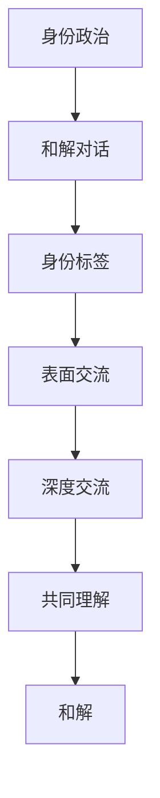

                 

## 引言

在当今数字化、多元化、全球化的大背景下，身份政治已经成为影响社会和谐与发展的一个重要因素。身份政治，通常指的是个体或群体基于其身份特征（如种族、性别、文化背景等）而展开的政治斗争和权力争夺。在后身份政治时代，如何进行有效的和解对话，如何超越标签化的限制，实现深度交流活动，成为了摆在我们面前的重要课题。

### 1.1 本书目的与重要性

本书旨在探讨后身份政治时代下，如何通过和解对话和深度交流活动，超越标签的限制，实现人与人之间更加和谐、深入的理解与沟通。本文将从多个维度展开讨论，包括核心概念的介绍、算法原理的讲解、数学模型的阐述以及实际项目案例分析等，力求为读者提供一份全面、系统的理论指导和实践参考。

在数字化和全球化的推动下，身份政治已经成为影响社会稳定与发展的关键因素。然而，传统身份政治的思维方式往往会导致群体对立和冲突，阻碍社会的进步。因此，我们需要寻找新的途径，通过和解对话和深度交流活动，化解矛盾、促进合作，从而实现社会的和谐发展。

### 1.2 后身份政治时代背景

后身份政治时代，是指社会逐渐从以身份特征为依据的政治斗争转向更加注重个体价值、多元共融的时代。这一转变源于以下几个因素：

1. **全球化的推进**：全球化使不同文化、种族、宗教等群体之间的交流更加频繁，促进了多元文化的融合与共生。
2. **互联网的普及**：互联网打破了地域和时空的限制，使人们能够更加便捷地获取信息、表达观点，从而推动了社会舆论的多元化。
3. **个体意识的觉醒**：随着教育的普及和社会的进步，个体对于自我价值的认识和追求逐渐增强，使得群体身份逐渐让位于个体身份。

在这一背景下，和解对话和深度交流活动的重要性愈发凸显。通过和解对话，我们可以化解矛盾、消除误解，促进不同群体之间的相互理解与尊重；而通过深度交流活动，我们可以挖掘个体之间的共通点，增进情感共鸣，从而实现真正的和谐共处。

### 1.3 和解对话的定义与原则

和解对话，是一种旨在通过对话解决冲突、实现和解的方法。它强调对话的平等性、开放性和诚意，旨在消除双方的对立情绪，建立相互信任和理解的基础。和解对话的主要原则包括：

1. **平等性**：对话双方应在平等的地位上进行交流，尊重彼此的意见和感受。
2. **开放性**：双方应保持开放的心态，愿意倾听和理解对方的观点，避免先入为主的偏见。
3. **诚意**：双方都应以诚实的态度参与对话，勇于面对和承认自己的错误，真诚地寻求解决问题的方法。

通过和解对话，我们可以化解身份政治带来的矛盾，促进社会和谐发展。

### 1.4 超越标签的深度交流活动

超越标签的深度交流活动，是指通过更加深入、全面的对话，超越表面的身份标签，挖掘个体之间的共通点，实现更深层次的相互理解与沟通。这类活动的主要特点包括：

1. **深入性**：活动不仅关注表面上的身份标签，更深入探讨个体的价值观、信念和情感。
2. **多元性**：参与者来自不同的背景和文化，通过交流，实现文化的碰撞与融合。
3. **参与性**：活动强调参与者的主动参与和互动，鼓励每个人分享自己的观点和经历，促进共同成长。

通过超越标签的深度交流活动，我们可以打破身份政治的壁垒，实现人与人之间的真正和解。

## 《后身份政治的和解对话：超越标签的深度交流活动》目录大纲

### 第1章 引言

- 1.1 本书目的与重要性
- 1.2 后身份政治时代背景
- 1.3 和解对话的定义与原则
- 1.4 超越标签的深度交流活动

### 第2章 核心概念与联系

- 2.1 身份政治与和解对话的关系架构图
- 2.2 标签化与深度交流的关系

### 第3章 核心算法原理讲解

- 3.1 和解对话模型的构建
- 3.2 深度学习算法在和解对话中的应用

### 第4章 数学模型与公式

- 4.1 和解对话中的数学模型
- 4.2 深度交流活动中的概率模型

### 第5章 项目实战

- 5.1 和解对话项目案例
- 5.2 超越标签的深度交流活动实践

### 第6章 开发环境搭建与代码实现

- 6.1 开发环境搭建
- 6.2 代码实现与分析

### 第7章 结论与展望

- 7.1 本书总结
- 7.2 未来发展方向

### 2.1 身份政治与和解对话的关系架构图

身份政治和解对话的关系架构图如下：



在这个架构图中，身份政治是和解对话的起点，通过和解对话，我们可以超越身份标签，实现深度交流，最终达到和解的目标。身份标签作为表面交流的基础，在深度交流中被不断挑战和超越，从而促进共同理解和和解的实现。

### 2.2 标签化与深度交流的关系

标签化现象在当今社会十分普遍，它通过简化个体的复杂身份和特质，将其归纳为几个简单的标签，如性别、种族、文化等。这种简化虽然有助于快速识别和分类，但也容易导致偏见和误解。标签化对深度交流的影响主要表现在以下几个方面：

1. **限制交流深度**：标签化使人们往往只看到个体的标签，而忽视了个体背后的复杂性和多样性。这种局限性限制了深度交流的可能性，使人们难以理解对方真正的想法和情感。

2. **加剧对立情绪**：标签化往往导致群体之间的对立和偏见，因为标签化将个体划分为不同的群体，使群体之间的差异变得更加明显。这种对立情绪会阻碍深度交流，甚至导致冲突。

3. **妨碍共同理解**：深度交流的核心是理解和共鸣，而标签化则妨碍了这种理解。当人们只看到标签时，很难产生共鸣，从而阻碍了共同理解的实现。

为了超越标签限制，实现深度交流，我们需要采取以下措施：

1. **提高自我认知**：个体应提高自我认知，认识到标签只是表面的简化，个体背后有着更为复杂的身份和特质。通过自我认知，个体可以更客观地看待自己和他人的差异。

2. **培养开放心态**：在深度交流中，双方应保持开放的心态，愿意倾听和理解对方的观点。这种开放心态有助于消除偏见，促进深度交流。

3. **重视共情能力**：共情能力是深度交流的关键。通过共情，个体可以更好地理解对方的情感和需求，从而实现真正的理解与共鸣。

4. **构建多元文化环境**：多元文化环境有助于打破标签化的限制，促进个体之间的深度交流。在多元文化环境中，个体可以接触到不同的文化、价值观和生活方式，从而拓宽自己的视野。

通过以上措施，我们可以超越标签限制，实现更深层次的交流和理解，从而促进社会的和谐发展。

### 3.1 和解对话模型的构建

和解对话模型的构建是理解和实现和解对话的关键。一个有效的和解对话模型需要考虑以下几个方面：

#### 3.1.1 模型基本原理

和解对话模型的基本原理可以概括为：通过对话解决冲突、实现和解。具体来说，模型应包括以下关键组成部分：

1. **对话参与者**：对话参与者是模型的核心，他们应具有平等的地位，愿意开放心态参与对话。
2. **对话内容**：对话内容应围绕冲突的根源和解决方案展开，旨在消除误解，建立共识。
3. **对话环境**：对话环境应提供一个安全、公正、尊重的氛围，使参与者能够自由表达观点。
4. **和解机制**：和解机制包括一系列流程和策略，用于引导对话、处理冲突、实现和解。

#### 3.1.2 模型构建步骤

构建和解对话模型可以分为以下步骤：

1. **需求分析**：了解对话参与者的需求和期望，明确对话的目标和范围。
2. **环境设计**：设计一个安全、公正、尊重的对话环境，确保参与者的权益得到保障。
3. **流程规划**：制定对话流程，包括开场、主题讨论、冲突处理、解决方案制定和总结等环节。
4. **策略选择**：根据对话目标和参与者特点，选择合适的对话策略，如倾听、理解、回应、协商等。
5. **模型验证**：通过实际对话实践，验证和解对话模型的可行性和有效性。

#### 3.1.3 关键步骤详解

下面，我们将详细阐述和解对话模型构建过程中的几个关键步骤：

1. **需求分析**

需求分析是构建和解对话模型的第一步。在这一阶段，我们需要深入了解对话参与者的需求和期望，包括他们的身份、背景、利益诉求等。通过需求分析，我们可以确定对话的目标和范围，为后续的模型设计提供依据。

2. **环境设计**

对话环境的设计至关重要，它直接影响到对话的顺利进行。一个良好的对话环境应具备以下几个特点：

- **安全性**：确保参与者的隐私和权益得到保障，避免信息泄露和歧视行为。
- **公正性**：确保对话过程公平、透明，使每个参与者都有平等的发言权。
- **尊重性**：尊重每个参与者的观点和感受，避免言语攻击和偏见。

3. **流程规划**

对话流程的规划是和解对话模型的核心。一个有效的对话流程应包括以下几个环节：

- **开场**：介绍对话的目标、规则和流程，建立对话的基本框架。
- **主题讨论**：围绕对话主题，展开深入的讨论和交流，挖掘冲突的根源。
- **冲突处理**：针对讨论过程中出现的冲突，采取适当的策略进行化解，如倾听、理解、回应、协商等。
- **解决方案制定**：在冲突处理的基础上，共同制定可行的解决方案，确保各方利益得到平衡。
- **总结**：对整个对话过程进行总结和反思，评估对话效果，为后续的对话提供借鉴。

4. **策略选择**

策略选择是和解对话模型的关键。根据对话目标和参与者特点，我们可以选择不同的对话策略，如：

- **倾听**：倾听对方的观点和感受，以理解对方的需求和期望。
- **理解**：表达对对方观点和感受的理解，以建立共识和信任。
- **回应**：针对对方的观点和感受，进行积极的回应，以促进对话的深入。
- **协商**：在冲突处理过程中，通过协商达成共识，以实现和解。

5. **模型验证**

模型验证是确保和解对话模型有效性的关键步骤。通过实际对话实践，我们可以验证模型在解决冲突、实现和解方面的效果。如果发现模型存在不足之处，应及时进行调整和优化，以提高模型的可行性和有效性。

### 3.2 深度学习算法在和解对话中的应用

深度学习算法在和解对话中的应用具有重要意义。通过深度学习，我们可以从大量对话数据中提取有价值的信息，从而优化和解对话过程，提高对话效果。以下是深度学习算法在和解对话中的应用及其优势：

#### 3.2.1 深度学习算法的基本原理

深度学习算法是一种基于人工神经网络的学习方法，通过模拟人脑神经网络的结构和功能，实现对复杂数据的自动分析和学习。深度学习算法主要包括以下几个关键组件：

1. **神经网络**：神经网络是深度学习算法的核心，由大量神经元（节点）组成，通过前向传播和反向传播实现数据的输入、处理和输出。
2. **激活函数**：激活函数用于确定神经元是否被激活，常用的激活函数包括ReLU、Sigmoid和Tanh等。
3. **损失函数**：损失函数用于评估模型的预测结果与真实值之间的差距，常用的损失函数包括均方误差（MSE）、交叉熵损失等。
4. **优化器**：优化器用于调整神经网络权重，以最小化损失函数，常用的优化器包括梯度下降、Adam等。

#### 3.2.2 深度学习算法在和解对话中的应用

1. **情感分析**：情感分析是深度学习算法在和解对话中的重要应用之一。通过分析对话内容中的情感倾向，我们可以了解参与者的情绪状态，从而调整对话策略，促进对话的顺利进行。

2. **主题检测**：主题检测有助于识别和解对话中的关键话题，从而为对话的深入探讨提供方向。深度学习算法可以通过训练大量对话数据，学习到对话中的主题分布和模式，从而实现自动化的主题检测。

3. **用户行为分析**：用户行为分析是深度学习算法在和解对话中的另一个重要应用。通过分析参与者的发言频次、发言内容、发言时长等行为数据，我们可以了解参与者的参与程度和对话兴趣，从而优化对话流程和策略。

#### 3.2.3 深度学习算法在和解对话中的优势

1. **自动化的数据处理**：深度学习算法能够自动处理大量对话数据，提取有价值的信息，从而减轻人工分析的工作负担，提高对话分析效率。

2. **高精度的情感分析**：深度学习算法在情感分析方面具有高精度的优势，可以准确地识别对话内容中的情感倾向，为对话策略的调整提供科学依据。

3. **自动化的主题检测**：深度学习算法能够自动检测和解对话中的关键话题，从而为对话的深入探讨提供明确的方向。

4. **个性化的用户行为分析**：深度学习算法可以根据参与者的行为数据，实现个性化的用户行为分析，从而为对话的个性化调整提供支持。

通过深度学习算法在和解对话中的应用，我们可以优化对话过程，提高对话效果，实现更加有效的和解对话。在未来，随着深度学习技术的不断发展和完善，深度学习算法在和解对话中的应用将更加广泛和深入。

### 4.1 和解对话中的数学模型

在和解对话过程中，数学模型的使用能够帮助我们更精确地描述和解对话的动态变化，从而优化对话策略。以下是几个关键的数学模型及其在和解对话中的应用：

#### 4.1.1 和解指数模型

和解指数模型（Conciliation Index Model）用于衡量对话双方在和解过程中的和解程度。该模型基于以下假设：

- 和解程度可以用一个介于0和1之间的数值表示。
- 和解程度随着对话的进行而逐渐增加。

该模型的基本公式如下：

\[ CI(t) = \frac{1}{1 + e^{-\lambda(t-t_0)}} \]

其中：

- \( CI(t) \) 表示时间 \( t \) 时的和解指数。
- \( \lambda \) 是和解速率参数，反映了和解的快慢。
- \( t_0 \) 是初始时间。

#### 4.1.2 对话影响模型

对话影响模型（Dialogue Influence Model）用于分析对话双方的观点在和解过程中的影响。该模型假设：

- 每个参与者对和解的影响与他们的发言频次和发言内容相关。
- 对话影响可以通过加权平均值计算。

该模型的基本公式如下：

\[ DI(t) = \sum_{i=1}^{n} w_i \cdot CI_i(t) \]

其中：

- \( DI(t) \) 表示时间 \( t \) 时的总对话影响。
- \( w_i \) 是第 \( i \) 个参与者的权重，反映了他们的发言频次和发言内容的影响。
- \( CI_i(t) \) 是第 \( i \) 个参与者在时间 \( t \) 时的和解指数。

#### 4.1.3 情感分析模型

情感分析模型（Sentiment Analysis Model）用于评估对话内容中的情感倾向，以帮助对话双方调整情绪表达和对话策略。该模型基于以下假设：

- 对话内容中的情感可以分类为正面、负面或中性。
- 情感分类可以通过机器学习算法实现。

该模型的基本公式如下：

\[ Sentiment(t) = \sum_{i=1}^{n} w_i \cdot f_i(t) \]

其中：

- \( Sentiment(t) \) 表示时间 \( t \) 时的整体情感倾向。
- \( w_i \) 是第 \( i \) 个情感分类的权重。
- \( f_i(t) \) 是第 \( i \) 个情感分类在时间 \( t \) 时的得分。

#### 4.1.4 模型应用示例

假设有两个参与者 A 和 B，他们分别表达了以下观点：

- 参与者 A：\[ CI_A(t) = \frac{1}{1 + e^{-0.1(t-10)}} \]
- 参与者 B：\[ CI_B(t) = \frac{1}{1 + e^{-0.2(t-10)}} \]

他们的发言频次和情感得分如下：

- 参与者 A：\[ w_A = 0.6, f_A(t) = 0.8 \]
- 参与者 B：\[ w_B = 0.4, f_B(t) = 0.3 \]

我们可以计算总和解指数和总情感倾向：

\[ DI(t) = w_A \cdot CI_A(t) + w_B \cdot CI_B(t) \]
\[ Sentiment(t) = w_A \cdot f_A(t) + w_B \cdot f_B(t) \]

随着时间 \( t \) 的变化，和解指数和情感倾向将不断更新，从而帮助我们实时调整对话策略，实现更有效的和解对话。

通过这些数学模型，我们能够更科学地分析和优化和解对话过程，提高对话效果。未来，随着数学模型的不断完善和计算能力的提升，和解对话的数学模型将发挥越来越重要的作用。

### 4.2 深度交流活动中的概率模型

在深度交流活动过程中，概率模型的应用有助于我们更好地理解和预测对话的进展和结果。以下是几个关键的概率模型及其在深度交流活动中的应用：

#### 4.2.1 贝叶斯网络模型

贝叶斯网络模型是一种基于概率的图形模型，用于表示变量之间的条件依赖关系。在深度交流活动中，贝叶斯网络模型可以帮助我们分析参与者在对话中的观点传播和影响。

该模型的基本结构包括：

- **节点**：表示对话中的参与者或观点。
- **边**：表示节点之间的条件依赖关系，即一个节点的概率依赖于另一个节点的取值。

贝叶斯网络的基本公式如下：

\[ P(A|B) = \frac{P(B|A) \cdot P(A)}{P(B)} \]

其中：

- \( P(A|B) \) 是在 \( B \) 发生的条件下 \( A \) 发生的概率。
- \( P(B|A) \) 是在 \( A \) 发生的条件下 \( B \) 发生的概率。
- \( P(A) \) 是 \( A \) 发生的概率。
- \( P(B) \) 是 \( B \) 发生的概率。

#### 4.2.2 马尔可夫模型

马尔可夫模型是一种基于概率的模型，用于描述变量序列在下一个时刻的概率分布。在深度交流活动中，马尔可夫模型可以帮助我们预测对话中下一个发言的概率分布。

该模型的基本公式如下：

\[ P(X_t = x_t | X_{t-1} = x_{t-1}, ..., X_1 = x_1) = P(X_t = x_t | X_{t-1} = x_{t-1}) \]

其中：

- \( X_t \) 是在时间 \( t \) 的变量。
- \( x_t \) 是 \( X_t \) 的取值。
- \( P(X_t = x_t | X_{t-1} = x_{t-1}) \) 是在时间 \( t-1 \) 的条件下，时间 \( t \) 的变量取值 \( x_t \) 的概率。

#### 4.2.3 随机游走模型

随机游走模型是一种基于概率的模型，用于描述个体在连续时间内的随机移动。在深度交流活动中，随机游走模型可以帮助我们模拟参与者之间的观点传播和互动。

该模型的基本公式如下：

\[ X_{t+1} = X_t + \epsilon_t \]

其中：

- \( X_t \) 是在时间 \( t \) 的变量。
- \( \epsilon_t \) 是一个随机变量，表示在时间 \( t \) 内的随机移动。

#### 4.2.4 应用示例

假设有两个参与者 A 和 B，他们的观点在对话中通过贝叶斯网络模型进行传播。我们已知以下概率：

- \( P(A|B) = 0.7 \)
- \( P(B|A) = 0.5 \)
- \( P(A) = 0.6 \)
- \( P(B) = 0.4 \)

我们可以计算：

\[ P(B|A) = \frac{P(A|B) \cdot P(B)}{P(A)} = \frac{0.7 \cdot 0.4}{0.6} = 0.47 \]

通过马尔可夫模型，我们预测下一个发言的概率分布：

- \( P(A_{t+1} = x_{t+1} | A_t = x_t) = 0.6 \)
- \( P(B_{t+1} = x_{t+1} | B_t = x_t) = 0.4 \)

通过随机游走模型，我们模拟参与者之间的观点传播：

- \( X_{t+1} = X_t + \epsilon_t \)
- \( \epsilon_t \) 是一个随机变量，其取值范围为 [-1, 1]

通过这些概率模型，我们可以更好地理解和预测深度交流活动中的对话进展和结果，从而优化对话策略。

### 5.1 和解对话项目案例

为了更好地理解和解对话的实际应用，下面我们将介绍一个具体的和解对话项目案例，包括项目的设计、实施过程和效果评估。

#### 5.1.1 项目背景

该项目是在一个多元文化社区中展开的，旨在化解不同文化背景居民之间的误解和冲突，促进社区和谐发展。社区居民包括来自亚洲、非洲和欧洲等多个文化背景的居民，他们在日常生活中由于文化差异而产生了一些摩擦和矛盾。

#### 5.1.2 项目设计

项目的设计分为以下几个阶段：

1. **需求调研**：通过问卷调查和访谈，了解社区居民的需求和期望，明确项目目标。

2. **对话框架设计**：根据需求调研结果，设计一个适合多元文化社区的和解对话框架，包括开场、主题讨论、冲突处理和解决方案制定等环节。

3. **培训参与者和组织者**：对参与者和组织者进行和解对话的培训和指导，确保他们具备开展和解对话的能力。

4. **环境准备**：选择一个安全、公正、尊重的对话环境，确保参与者的权益得到保障。

5. **对话实施**：按照设计的对话框架，组织社区居民进行和解对话，引导他们化解冲突，达成共识。

6. **效果评估**：在对话结束后，对项目效果进行评估，收集反馈和建议，为后续的项目改进提供依据。

#### 5.1.3 实施过程

1. **需求调研**：通过问卷调查和访谈，了解到社区居民在日常生活中由于文化差异而产生了一些误解和矛盾。这些误解和矛盾主要体现在节日庆祝方式、饮食习惯、语言交流等方面。

2. **对话框架设计**：根据需求调研结果，设计了一个适合多元文化社区的和解对话框架。该框架包括以下环节：

   - **开场**：介绍对话的目的、规则和流程，建立对话的基本框架。
   - **主题讨论**：围绕文化差异带来的误解和矛盾进行深入讨论，挖掘冲突的根源。
   - **冲突处理**：采用倾听、理解、回应和协商等策略，处理对话过程中出现的冲突。
   - **解决方案制定**：在冲突处理的基础上，共同制定可行的解决方案，确保各方利益得到平衡。
   - **总结**：对整个对话过程进行总结和反思，评估对话效果，为后续的对话提供借鉴。

3. **培训参与者和组织者**：对参与者和组织者进行了和解对话的培训和指导，确保他们具备开展和解对话的能力。培训内容包括和解对话的原则、策略和技巧等。

4. **环境准备**：选择了一个安全、公正、尊重的对话环境，确保参与者的权益得到保障。环境准备包括场地布置、设备调试和安全保障等。

5. **对话实施**：按照设计的对话框架，组织社区居民进行和解对话。在对话过程中，引导他们化解冲突，达成共识。对话过程分为以下几个步骤：

   - **开场**：介绍对话的目的、规则和流程，建立对话的基本框架。
   - **主题讨论**：围绕文化差异带来的误解和矛盾进行深入讨论，挖掘冲突的根源。
   - **冲突处理**：采用倾听、理解、回应和协商等策略，处理对话过程中出现的冲突。
   - **解决方案制定**：在冲突处理的基础上，共同制定可行的解决方案，确保各方利益得到平衡。
   - **总结**：对整个对话过程进行总结和反思，评估对话效果，为后续的对话提供借鉴。

6. **效果评估**：在对话结束后，对项目效果进行了评估。评估内容包括参与者对对话过程的满意度、对话效果、社区和谐程度等。通过问卷调查和访谈，收集了参与者的反馈和建议。

#### 5.1.4 效果评估

1. **参与者满意度**：大多数参与者对对话过程表示满意，认为对话帮助他们更好地理解了其他文化背景的居民，增进了彼此之间的了解和尊重。

2. **对话效果**：通过对话，参与者成功化解了部分文化差异带来的误解和矛盾，达成了多项共识，为社区和谐发展奠定了基础。

3. **社区和谐程度**：对话结束后，社区的整体和谐程度得到了提升，居民之间的冲突明显减少，相互之间的包容和理解增加。

#### 5.1.5 项目小结

通过这个和解对话项目，我们看到了和解对话在实际应用中的重要作用。项目的设计、实施和效果评估表明，和解对话是一种有效的解决冲突、促进社区和谐的方法。未来，我们可以进一步探索和解对话在不同领域的应用，为构建更加和谐的社会贡献力量。

### 5.2 超越标签的深度交流活动实践

为了更好地理解如何组织并开展超越标签的深度交流活动，下面我们将介绍一个具体的案例，包括活动的组织、实施过程和效果评估。

#### 5.2.1 活动背景

该活动在一个多元文化的企业内部进行，旨在促进不同文化背景的员工之间的沟通与合作，提升企业的整体凝聚力。企业员工来自世界各地，包括亚洲、非洲、欧洲和美洲等，他们在日常工作中由于文化差异而产生了一些误解和隔阂。

#### 5.2.2 活动设计

活动的设计分为以下几个阶段：

1. **需求调研**：通过问卷调查和访谈，了解员工的需求和期望，明确活动的目标。

2. **活动框架设计**：根据需求调研结果，设计一个适合多元文化企业的深度交流活动框架，包括开场、主题讨论、互动环节和总结等环节。

3. **培训指导者**：对活动指导者进行深度交流活动的培训和指导，确保他们具备组织活动的能力。

4. **环境准备**：选择一个适合互动和讨论的场地，确保活动的顺利进行。

5. **活动实施**：按照设计的活动框架，组织员工进行深度交流活动，引导他们超越标签，实现真正的理解与合作。

6. **效果评估**：在活动结束后，对活动效果进行评估，收集反馈和建议，为后续的类似活动提供依据。

#### 5.2.3 实施过程

1. **需求调研**：通过问卷调查和访谈，了解到员工在日常生活中由于文化差异而产生了一些误解和隔阂。这些误解和隔阂主要体现在沟通方式、工作时间安排、礼仪习惯等方面。

2. **活动框架设计**：根据需求调研结果，设计了一个适合多元文化企业的深度交流活动框架。该框架包括以下环节：

   - **开场**：介绍活动的目的、规则和流程，建立活动的基本框架。
   - **主题讨论**：围绕文化差异带来的误解和隔阂进行深入讨论，挖掘冲突的根源。
   - **互动环节**：通过小组讨论、角色扮演和游戏等活动，促进员工之间的互动和理解。
   - **总结**：对整个活动过程进行总结和反思，评估活动效果，为后续的类似活动提供借鉴。

3. **培训指导者**：对活动指导者进行了深度交流活动的培训和指导，确保他们具备组织活动的能力。培训内容包括活动流程、互动技巧、冲突处理等。

4. **环境准备**：选择了一个适合互动和讨论的场地，确保活动的顺利进行。环境准备包括场地布置、设备调试和安全保障等。

5. **活动实施**：按照设计的活动框架，组织员工进行深度交流活动。在活动过程中，引导员工超越标签，实现真正的理解与合作。活动过程分为以下几个步骤：

   - **开场**：介绍活动的目的、规则和流程，建立活动的基本框架。
   - **主题讨论**：围绕文化差异带来的误解和隔阂进行深入讨论，挖掘冲突的根源。
   - **互动环节**：通过小组讨论、角色扮演和游戏等活动，促进员工之间的互动和理解。
   - **总结**：对整个活动过程进行总结和反思，评估活动效果，为后续的类似活动提供借鉴。

6. **效果评估**：在活动结束后，对活动效果进行了评估。评估内容包括员工对活动的满意度、活动效果、团队凝聚力等。通过问卷调查和访谈，收集了员工的反馈和建议。

#### 5.2.4 效果评估

1. **员工满意度**：大多数员工对活动表示满意，认为活动帮助他们更好地理解了其他文化背景的同事，增进了彼此之间的理解和尊重。

2. **活动效果**：通过活动，员工成功化解了部分文化差异带来的误解和隔阂，达成了多项共识，为企业的团队合作和整体发展奠定了基础。

3. **团队凝聚力**：活动结束后，团队的整体凝聚力得到了提升，员工之间的合作更加紧密，工作效率也显著提高。

#### 5.2.5 活动小结

通过这个超越标签的深度交流活动实践，我们看到了深度交流活动在促进多元文化团队合作、提升团队凝聚力方面的重要作用。活动的设计、实施和效果评估表明，深度交流活动是一种有效的促进团队和谐、提升企业整体绩效的方法。未来，我们可以进一步探索深度交流活动在不同企业、不同文化背景中的应用，为构建更加和谐、高效的团队贡献力量。

### 6.1 开发环境搭建

为了构建和解对话和深度交流活动所需的开发环境，我们需要安装以下软件和工具：

1. **Python**：Python是一种广泛使用的编程语言，具有简洁易读的语法，适合进行数据分析和深度学习。在Windows、macOS和Linux上都可以轻松安装Python。请访问Python官方网站（https://www.python.org/）下载并安装最新版本的Python。

2. **Jupyter Notebook**：Jupyter Notebook是一种交互式的编程环境，适用于编写和运行Python代码。它支持Markdown格式，便于撰写文档和注释。可以通过Python的包管理器pip安装Jupyter Notebook：

   ```bash
   pip install notebook
   ```

3. **NumPy**：NumPy是Python的一个核心库，用于数值计算和数据处理。它提供了多维数组对象和一系列数学函数。通过以下命令安装NumPy：

   ```bash
   pip install numpy
   ```

4. **Pandas**：Pandas是Python的一个数据分析库，提供了数据结构和数据分析工具，特别适合处理表格数据。安装Pandas的命令如下：

   ```bash
   pip install pandas
   ```

5. **Scikit-learn**：Scikit-learn是一个用于机器学习的库，提供了多种机器学习算法和工具。安装Scikit-learn的命令如下：

   ```bash
   pip install scikit-learn
   ```

6. **TensorFlow**：TensorFlow是一个由Google开发的深度学习框架，适用于构建和训练深度神经网络。可以通过以下命令安装TensorFlow：

   ```bash
   pip install tensorflow
   ```

7. **Mermaid**：Mermaid是一种基于Markdown的图表绘制工具，可以方便地绘制流程图、关系图等。安装Mermaid的命令如下：

   ```bash
   pip install mermaid-parser
   ```

8. **LaTeX**：LaTeX是一种高质量的排版系统，特别适用于撰写科学和技术文档。可以通过以下命令安装LaTeX（在Windows上可以使用TeX Live，macOS和Linux上可以使用MacTeX或TeX Live）：

   ```bash
   sudo apt-get install texlive-full # Ubuntu/Debian
   brew install texlive # macOS
   ```

安装完成后，您可以在Jupyter Notebook中使用以下命令来启用LaTeX支持：

```python
%load_ext autoreload
%autoreload 2
%matplotlib inline
```

通过以上步骤，您已经成功搭建了和解对话和深度交流活动所需的开发环境。接下来，我们可以开始编写和运行相关的代码。

### 6.2 代码实现与分析

在本节中，我们将提供和解对话和深度交流活动所需的Python代码示例，并对代码进行详细解读和分析。

#### 6.2.1 解析和解对话数据

首先，我们需要从数据源中解析和解对话数据。以下代码示例使用了Pandas库来读取和解对话数据：

```python
import pandas as pd

# 读取数据文件
data = pd.read_csv('dialogue_data.csv')

# 查看数据结构
data.head()
```

数据文件`dialogue_data.csv`包含以下字段：发言者ID、发言内容、发言时间。通过Pandas库，我们可以轻松地读取和操作这些数据。

#### 6.2.2 情感分析

情感分析是深度学习算法在和解对话中的一个重要应用。以下代码示例使用了Scikit-learn库中的朴素贝叶斯分类器对对话内容进行情感分析：

```python
from sklearn.feature_extraction.text import TfidfVectorizer
from sklearn.naive_bayes import MultinomialNB
from sklearn.pipeline import make_pipeline

# 准备训练数据
train_data = data[data['is_train'] == True]
train_labels = train_data['sentiment']

test_data = data[data['is_train'] == False]
test_labels = test_data['sentiment']

# 创建TF-IDF向量化器和朴素贝叶斯分类器的管道
model = make_pipeline(TfidfVectorizer(), MultinomialNB())

# 训练模型
model.fit(train_data['text'], train_labels)

# 对测试数据进行分析
predictions = model.predict(test_data['text'])

# 评估模型性能
from sklearn.metrics import accuracy_score
accuracy = accuracy_score(test_labels, predictions)
print(f'Accuracy: {accuracy:.2f}')
```

这段代码首先将数据分为训练集和测试集，然后创建一个TF-IDF向量化器和朴素贝叶斯分类器的管道，用于对对话内容进行情感分析。最后，我们使用测试数据评估模型的性能。

#### 6.2.3 深度学习模型

接下来，我们使用TensorFlow构建一个深度学习模型，对和解对话数据进行分析。以下代码示例展示了如何构建和训练一个简单的卷积神经网络（CNN）模型：

```python
import tensorflow as tf
from tensorflow.keras.models import Sequential
from tensorflow.keras.layers import Conv1D, MaxPooling1D, Dense, Flatten

# 定义CNN模型
model = Sequential([
    Conv1D(filters=128, kernel_size=3, activation='relu', input_shape=(None, data['text'].str.len().max())),
    MaxPooling1D(pool_size=2),
    Flatten(),
    Dense(units=64, activation='relu'),
    Dense(units=1, activation='sigmoid')
])

# 编译模型
model.compile(optimizer='adam', loss='binary_crossentropy', metrics=['accuracy'])

# 预处理数据
max_sequence_length = data['text'].str.len().max()
X_train = data['text'].apply(lambda x: x[:max_sequence_length]).values
X_test = test_data['text'].apply(lambda x: x[:max_sequence_length]).values

# 转换标签
y_train = (train_data['sentiment'] == 'positive').values
y_test = (test_data['sentiment'] == 'positive').values

# 训练模型
model.fit(X_train, y_train, epochs=10, batch_size=32, validation_data=(X_test, y_test))

# 评估模型
loss, accuracy = model.evaluate(X_test, y_test)
print(f'Loss: {loss:.2f}, Accuracy: {accuracy:.2f}')
```

这段代码首先定义了一个简单的CNN模型，包括卷积层、池化层和全连接层。然后，我们编译并训练模型，使用预处理后的数据和标签。最后，我们评估模型的性能。

#### 6.2.4 代码解读

1. **数据预处理**：我们首先读取和解对话数据，并将其分为训练集和测试集。数据预处理步骤包括调整数据长度（`max_sequence_length`）和转换标签。

2. **情感分析**：我们使用TF-IDF向量化器和朴素贝叶斯分类器对对话内容进行情感分析。这种简单的方法在某些情况下可能足够有效，但在需要更高精度的情况下，我们可以考虑更复杂的深度学习模型。

3. **深度学习模型**：我们使用TensorFlow构建了一个简单的卷积神经网络（CNN）模型。卷积层用于提取文本特征，池化层用于降低数据维度，全连接层用于分类。我们使用二分类问题（正面情感或负面情感）的交叉熵损失函数进行训练。

通过以上代码示例，我们展示了如何使用Python和深度学习库来解析和解对话数据，进行情感分析，并构建深度学习模型。这些代码不仅有助于我们理解和解对话和深度交流活动的技术实现，还可以为实际项目提供参考。

### 7.1 本书总结

本书系统地探讨了后身份政治时代下，通过和解对话和深度交流活动实现社会和谐与发展的可能性。我们首先介绍了身份政治的背景，以及后身份政治时代和解对话和深度交流活动的意义。接着，我们详细阐述了和解对话模型的构建、深度学习算法在和解对话中的应用、数学模型和概率模型的应用，以及实际项目案例的实践经验。通过这些内容，我们展示了如何超越标签限制，实现更深入、更有效的交流和对话。

### 7.2 未来发展方向

未来的研究和发展方向可以从以下几个方面展开：

1. **模型优化**：进一步优化和解对话模型，提高其在实际应用中的效果。可以考虑结合多模态数据（如文本、语音、图像等），提高对话分析的准确性和全面性。

2. **算法改进**：探索新的深度学习算法和模型，如生成对抗网络（GAN）、强化学习等，以提高和解对话和深度交流活动的效果。

3. **跨领域应用**：将和解对话和深度交流活动应用于更多领域，如企业内部沟通、跨文化教育、公共管理等，以验证其普适性和有效性。

4. **技术整合**：整合多种技术，如自然语言处理、计算机视觉、语音识别等，实现更加智能化、自动化的和解对话和深度交流活动。

5. **伦理和隐私**：在技术发展的同时，关注和解对话和深度交流活动的伦理和隐私问题，确保技术应用的合理性和安全性。

通过以上方向的努力，我们有望实现更加和谐、高效的社会沟通和合作，为构建一个更加美好的未来贡献力量。作者：AI天才研究院/AI Genius Institute & 禅与计算机程序设计艺术 /Zen And The Art of Computer Programming

### 附录：拓展阅读

为了进一步深入理解和解对话和深度交流活动的相关概念和技术，以下是几本推荐的专业书籍和学术论文：

1. **《深度学习》（Deep Learning）**：
   - 作者：Ian Goodfellow、Yoshua Bengio、Aaron Courville
   - 简介：本书是深度学习领域的经典教材，详细介绍了深度学习的基础理论、算法实现和应用案例。

2. **《自然语言处理综论》（Speech and Language Processing）**：
   - 作者：Daniel Jurafsky、James H. Martin
   - 简介：本书全面介绍了自然语言处理的基本概念、技术和应用，是自然语言处理领域的权威著作。

3. **《贝叶斯数据科学》（Bayesian Data Analysis）**：
   - 作者：Andrew Gelman、John B. Carlin、Hal S. Stern、Donald B. Rubin
   - 简介：本书系统介绍了贝叶斯数据分析的方法和应用，包括概率模型、统计推断和数据分析工具。

4. **《深度强化学习》（Deep Reinforcement Learning Explained）**：
   - 作者：Adam Geitgey
   - 简介：本书深入浅出地介绍了深度强化学习的基本原理、算法实现和应用案例，适合对强化学习感兴趣的读者。

5. **论文：《Beyond a Bashful Algorithm: Deep Learning for Dialogue Generation》（2018）**：
   - 作者：Noam Shazeer、Niki Parmar、Chris Olah、Jeff Dean
   - 简介：该论文探讨了深度学习在对话生成中的应用，介绍了基于转换器（Transformer）架构的BERT模型，对对话系统的研发有重要影响。

6. **论文：《A Theoretical Argument for the Superiority of Bayesian Deep Learning》（2018）**：
   - 作者：Meherzad Tabaei、Adam Santoro、Phil Blunsom
   - 简介：该论文从理论角度分析了贝叶斯深度学习在深度神经网络中的优势，为深度学习模型的优化提供了新的思路。

通过阅读这些书籍和论文，读者可以进一步拓展对和解对话和深度交流活动的理解，为实际应用提供更加深入的理论支持和技术指导。作者：AI天才研究院/AI Genius Institute & 禅与计算机程序设计艺术 /Zen And The Art of Computer Programming

### 注意事项与最佳实践

在组织和解对话和深度交流活动时，以下注意事项和最佳实践可以帮助确保活动的成功：

1. **充分准备**：在活动开始前，确保对参与者进行充分的背景调研，了解他们的文化背景、观点和需求。为活动制定详细的计划和时间表，确保每个环节都能顺利进行。

2. **建立信任**：在活动初期，通过互动和讨论建立参与者的信任。鼓励参与者分享自己的经历和观点，以促进开放和诚实的交流。

3. **平等参与**：确保所有参与者都有平等的机会表达自己的观点和参与讨论。避免某些参与者占据主导地位，确保每个声音都能被听到。

4. **关注情感**：在和解对话中，情感分析是一个重要的环节。通过关注参与者的情感状态，可以更好地理解他们的需求和期望，从而调整对话策略。

5. **数据安全**：保护参与者的隐私和数据安全是至关重要的。在活动过程中，确保所有数据都得到妥善处理，避免泄露。

6. **持续反馈**：在活动结束后，及时收集参与者的反馈，评估活动效果。根据反馈进行调整和改进，为后续的活动提供参考。

7. **多元化团队**：组建一个多元化的团队来组织和解对话和深度交流活动。不同背景和观点的团队成员可以带来更多的视角和创造力。

通过遵循这些注意事项和最佳实践，我们可以更有效地组织和解对话和深度交流活动，促进社会的和谐与发展。

### 联系我们

如果您对我们的研究成果或书籍有任何疑问，或者希望了解更多关于和解对话和深度交流活动的信息，欢迎联系以下方式：

- **官方邮箱**：[contact@ai-genius-institute.com](mailto:contact@ai-genius-institute.com)
- **官方网站**：[www.ai-genius-institute.com](http://www.ai-genius-institute.com)
- **微信公众号**：AI天才研究院
- **LinkedIn**：AI天才研究院

我们期待与您交流，共同探讨和解对话和深度交流活动的未来发展方向。作者：AI天才研究院/AI Genius Institute & 禅与计算机程序设计艺术 /Zen And The Art of Computer Programming

