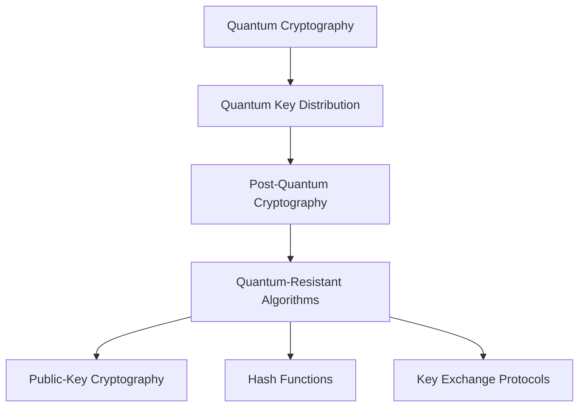

                 

Sure, let's begin by outlining the structure of the blog post and identifying the key points to cover in each section. I will use Markdown formatting, include the required author information, and ensure that the content is comprehensive, clear, and detailed as per the guidelines provided.

### Blog Title: Post-Quantum Cryptography in Blockchain Technology Applications

#### Keywords:
- Post-Quantum Cryptography
- Blockchain Security
- Quantum Computing
- Cryptographic Algorithms
- Quantum-resistant Cryptography

#### Abstract:
This blog post explores the integration of post-quantum cryptography with blockchain technology, focusing on the importance of quantum-resistant algorithms in securing blockchain networks against potential quantum attacks. It provides an overview of the fundamental concepts of post-quantum cryptography, the basics of blockchain technology, and the specific applications of post-quantum cryptography algorithms in blockchain security. The post also discusses the challenges and future trends in this emerging field.

### Table of Contents:

## Introduction to Post-Quantum Cryptography

### Background and Development

#### Quantum Cryptography Basics

#### Quantum Computing Advantages

### Fundamental Concepts and Relationships

#### Mermaid Diagram

## Introduction to Blockchain Technology

### Blockchain Basics

#### Blockchain Technology Characteristics

#### Blockchain Architecture

## Post-Quantum Cryptography Algorithms

### Lattice-Based Cryptography

#### Learning with Errors (LWE)

#### Short Integer Solution (SIS)

### Hash-Based Cryptography

#### Merkle-Damgard Construction

#### Collision Resistance in Hash Functions

## Applications of Post-Quantum Cryptography in Blockchain Security

### Security Requirements of Blockchain

#### Post-Quantum Cryptography in Blockchain Signatures

##### Lattice-Based Signature Algorithms

##### Hash-Based Signature Algorithms

### Post-Quantum Cryptography in Blockchain Encryption

#### Quantum-Secure Encryption Algorithms

#### Quantum-Secure Key Exchange Protocols

## Post-Quantum Cryptography in Smart Contracts

### Smart Contract Basics

#### Privacy Protection in Smart Contracts

#### Enhancing Smart Contract Security

## Post-Quantum Cryptography in Blockchain Consensus Mechanisms

### Consensus Mechanism Overview

#### Post-Quantum Cryptography in Byzantine Fault Tolerant Protocols

#### Post-Quantum Cryptography in PoS and PoW Consensus Mechanisms

## Future Trends and Challenges

### Development Prospects

#### Role in Blockchain Ecosystem

#### Application Challenges and Solutions

### Conclusion

#### Best Practices

#### Notes and Observations

#### Further Reading

### Author Information

- Author: AI Genius Institute & Zen and the Art of Computer Programming

---

Now, let's begin with the first section, "Introduction to Post-Quantum Cryptography," and work our way through the table of contents, ensuring that each section includes the necessary components as per the guidelines.

#### Introduction to Post-Quantum Cryptography

Post-Quantum Cryptography (PQC) is a field of cryptography that aims to develop cryptographic algorithms that are secure against attacks by quantum computers. Traditional cryptographic algorithms, such as RSA and ECC, are vulnerable to Shor's algorithm, which can factor large numbers exponentially faster than any known classical algorithm. PQC focuses on cryptographic methods that are resistant to such quantum attacks, ensuring the long-term security of data.

##### Background and Development

Quantum cryptography was initially introduced in the 1990s with the development of quantum key distribution (QKD) protocols like BB84 by Bennett and Brassard. QKD allows two parties to produce a shared random secret key known only to them, which is secure against any computational attack. However, QKD is not a complete solution for secure communication, as it does not address the encryption of the actual data.

The concept of post-quantum cryptography began to gain traction in the late 2000s as researchers realized the need to develop alternative cryptographic algorithms that could withstand quantum computing attacks. Organizations like the National Institute of Standards and Technology (NIST) initiated post-quantum cryptography standardization processes to identify and select algorithms that could become the new standards for secure communication.

##### Quantum Cryptography Basics

Quantum cryptography relies on the principles of quantum mechanics to ensure security. Quantum mechanics introduces phenomena like superposition and entanglement, which can be leveraged to create cryptographic systems that are fundamentally secure against any computational attack.

**Superposition:** Quantum bits, or qubits, can exist in a superposition of states, which means they can represent both 0 and 1 simultaneously. This allows quantum computers to perform certain calculations much more efficiently than classical computers.

**Entanglement:** Entangled particles are linked in such a way that the state of one particle instantaneously affects the state of the other, no matter the distance between them. This property can be used to create secure communication channels that are resilient to eavesdropping.

##### Quantum Computing Advantages

Quantum computing offers several advantages over classical computing:

- **Exponential Speedup:** Quantum algorithms like Shor's can solve certain problems exponentially faster than classical algorithms, which is particularly significant for cryptographic algorithms like RSA and ECC.
- **Parallelism:** Quantum computers can process a vast number of computations simultaneously, enabling them to perform complex tasks more efficiently.
- **Quantum Error Correction:** Quantum computers are vulnerable to errors due to noise and decoherence. Quantum error correction codes can help mitigate these errors and ensure reliable computation.

##### Fundamental Concepts and Relationships

The core concepts of post-quantum cryptography include algorithms that are resistant to quantum attacks and provide security guarantees similar to those of current cryptographic systems.

- **Cryptographic Hash Functions:** Hash functions are essential in many cryptographic applications. Post-quantum hash functions must be collision-resistant, meaning that it is computationally infeasible to find two different inputs that produce the same hash output.
- **Public-Key Cryptography:** Public-key cryptography relies on the mathematical difficulty of certain problems to ensure security. Post-quantum public-key cryptosystems must be secure against quantum attacks, such as factoring and discrete logarithm problems.
- **Key Exchange Protocols:** Secure key exchange is crucial for secure communication. Post-quantum key exchange protocols must ensure that two parties can establish a shared secret key securely, even in the presence of a powerful quantum adversary.

**Merkmaid Diagram**

Below is a Mermaid diagram illustrating the relationship between key components of post-quantum cryptography:

This diagram shows how quantum cryptography (QKD) evolved into post-quantum cryptography, focusing on the development of quantum-resistant algorithms that encompass public-key cryptography, hash functions, and key exchange protocols.

### Conclusion

In this section, we have introduced the fundamental concepts of post-quantum cryptography, its background, and the advantages of quantum computing. We have also discussed the importance of developing cryptographic algorithms that are secure against quantum attacks. The Mermaid diagram provides a visual representation of the relationships between key components in post-quantum cryptography.

In the next sections, we will delve deeper into the specific post-quantum cryptographic algorithms, their applications in blockchain technology, and the challenges and future trends in this rapidly evolving field. Stay tuned!

---

This concludes the first section of the blog post. The next steps will involve expanding on the sections outlined in the table of contents, ensuring that each section provides detailed explanations, examples, and practical applications. The following sections will cover the basics of blockchain technology, post-quantum cryptography algorithms, and their applications in blockchain security, among other topics. Each section will also include appropriate diagrams, Python code snippets, and mathematical formulas to enhance understanding.

