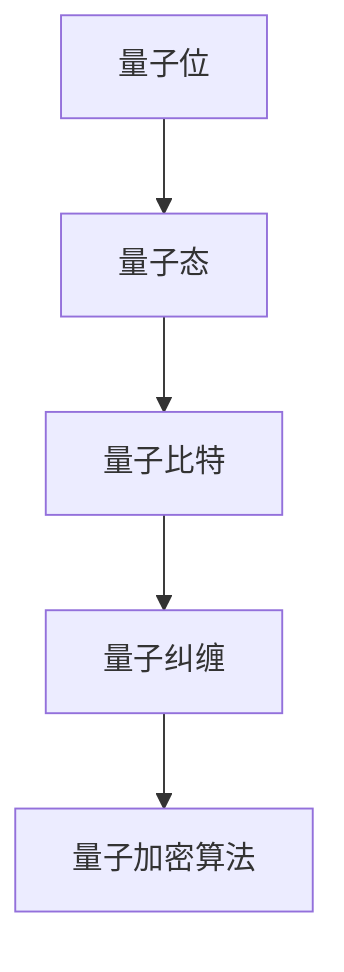

                 


### 文章标题

# 后量子密码学：为量子计算时代做好加密准备

### 关键词

- 量子密码学
- 量子计算
- 加密技术
- 安全通信
- 数学模型

### 摘要

本文深入探讨了后量子密码学这一新兴领域，重点介绍了量子密码学的基本概念、核心算法原理，以及其在量子计算时代的重要性。文章通过对Shor算法、量子密钥分发（QKD）等关键技术的讲解，揭示了量子计算对传统加密方法的挑战。同时，文章还分析了量子加密算法在现实世界中的应用，探讨了未来量子密码学的发展方向和面临的挑战。

---

### 引言

#### 量子密码学的重要性

在过去的几十年中，密码学作为信息安全的核心技术，一直在不断发展。传统的加密方法，如RSA、ECC等，基于大素数分解和离散对数问题的计算难度。然而，随着量子计算的崛起，这些传统加密方法面临着前所未有的威胁。量子计算具有超强的计算能力，可以在短时间内解决传统计算机需要数百年甚至数亿年才能解决的问题。

量子密码学作为量子计算时代的新型加密技术，旨在利用量子力学的基本原理来提供更安全的通信保障。与传统密码学不同，量子密码学利用量子纠缠和量子叠加等现象，确保信息传输的绝对安全性。量子密码学的出现，为应对量子计算时代的威胁提供了新的思路。

#### 背景与未来

量子密码学的概念最早由Stephen Wiesner提出，他在1979年发明了量子货币和量子隐形传态，这些都是量子密码学的基础。随后，Charles H. Bennett和Garrett D. Oppenheim在1984年提出了量子密钥分发（QKD）的概念，这一理论奠定了量子密码学的发展基础。

目前，量子密码学已经从理论走向实践，多个国家的研究机构和企业在量子密钥分发、量子安全通信等领域取得了显著成果。随着量子计算技术的不断进步，量子密码学在未来有望成为信息安全领域的主力军。

### 量子密码学基础

#### 核心概念与联系

量子密码学的基础概念主要包括量子位（qubit）、量子态、量子比特（qubit register）、量子纠缠等。

- **量子位（qubit）**：量子位是量子计算机中的基本单位，可以同时处于0和1的状态，这就是量子叠加现象。
- **量子态**：量子态描述了量子系统的状态，它可以是一个叠加态，即同时处于多种状态的组合。
- **量子比特（qubit register）**：量子比特组成量子寄存器，用于存储和处理量子信息。
- **量子纠缠**：量子纠缠是量子力学中的一种现象，两个或多个量子系统之间可以存在一种紧密的联系，即使它们相隔很远，其中一个系统的变化会立即影响到另一个系统。

以下是量子密码学核心概念之间的联系：



#### 量子密码学原理

量子密码学的核心原理包括量子密钥分发（QKD）和量子加密算法。

- **量子密钥分发（QKD）**：QKD利用量子纠缠和量子叠加现象，确保密钥分发的绝对安全性。在QKD过程中，发送方和接收方通过量子通道交换量子态，如果检测到任何窃听行为，量子态就会发生改变，从而告知双方通信存在安全隐患。

- **量子加密算法**：量子加密算法利用量子力学原理，确保信息的不可窃听性。其中，最著名的量子加密算法是BB84算法。BB84算法通过量子纠缠态和随机偏振的量子态来传输密钥，攻击者无法在不被察觉的情况下窃听。

以下是一个简化的Shor算法伪代码，用于说明量子密码学的核心原理：

```python
# Shor算法伪代码
def Shor(N):
    # 使用量子计算机求解N的因子
    # ...
return factor
```

### 数学模型和数学公式

量子密码学的数学模型主要包括量子态表示、量子运算和量子纠缠等。

- **量子态表示**：量子态可以用一组复系数的线性组合来表示。例如，一个量子比特的态可以表示为：
  $$
  |\psi\rangle = \alpha|0\rangle + \beta|1\rangle
  $$
  其中，$|0\rangle$和$|1\rangle$是量子比特的基础态，$\alpha$和$\beta$是复系数。

- **量子运算**：量子运算包括量子比特的旋转和量子门的操作。例如，一个简单的量子门操作可以表示为：
  $$
  R_z(\theta)|0\rangle = \cos(\theta/2)|0\rangle - i\sin(\theta/2)|1\rangle
  $$

- **量子纠缠**：量子纠缠是量子密码学的重要原理，它描述了两个或多个量子系统之间的特殊联系。一个简单的量子纠缠态可以表示为：
  $$
  |\psi\rangle_{AB} = \frac{1}{\sqrt{2}}(|00\rangle + |11\rangle)
  $$

在量子密钥分发（QKD）中，量子态的测量会影响整个量子系统的状态，从而实现安全的密钥分发。以下是一个简单的QKD的数学模型：

$$
\langle \psi|\rho|\psi\rangle = \frac{1}{2} + \frac{1}{2}\cos^2(\theta)
$$

其中，$\langle \psi|$是量子态的叠加态，$\rho$是测量结果的概率分布，$\theta$是量子态的相位。

### 量子加密算法

量子加密算法是量子密码学的核心，它们利用量子力学原理来实现信息的安全传输。以下是几种主要的量子加密算法：

#### BB84算法

BB84算法是最早的量子加密算法，由Charles H. Bennett和Garrett D. Oppenheim提出。BB84算法通过量子纠缠态和随机偏振的量子态来传输密钥。

- **算法原理**：发送方生成一对量子纠缠态，通过量子通道发送给接收方。接收方对收到的量子态进行测量，根据测量结果生成一部分密钥。双方通过经典通信协议，确定最终的密钥。

- **算法流程**：

  ```mermaid
  graph TD
  A[生成纠缠态] --> B[发送量子态]
  B --> C[接收方测量]
  C --> D[生成部分密钥]
  D --> E[经典通信确定密钥]
  ```

#### E91算法

E91算法是基于量子纠缠态的量子加密算法，它利用爱因斯坦-波多尔斯基-罗森（EPR）态来实现安全通信。

- **算法原理**：发送方生成EPR态，将其分为两份，分别通过量子通道发送给接收方。接收方对EPR态进行测量，根据测量结果生成密钥。

- **算法流程**：

  ```mermaid
  graph TD
  A[生成EPR态] --> B[发送量子态]
  B --> C[接收方测量]
  C --> D[生成密钥]
  ```

#### B92算法

B92算法是基于量子纠缠态的量子加密算法，它利用Bell态来实现安全通信。

- **算法原理**：发送方生成Bell态，通过量子通道发送给接收方。接收方对Bell态进行测量，根据测量结果生成密钥。

- **算法流程**：

  ```mermaid
  graph TD
  A[生成Bell态] --> B[发送量子态]
  B --> C[接收方测量]
  C --> D[生成密钥]
  ```

### 量子计算与加密

量子计算作为一种全新的计算模式，具有超越经典计算机的强大计算能力。量子计算对加密技术产生了深远的影响，同时也提出了新的挑战。

#### 量子计算机的工作原理

量子计算机的工作原理基于量子力学的基本原理，包括量子位（qubit）、量子纠缠、量子叠加和量子测量等。

- **量子位（qubit）**：量子位是量子计算机中的基本单元，它可以同时处于0和1的状态，这是量子计算的核心。
- **量子纠缠**：量子纠缠是量子计算机的关键特性，它使得量子计算机可以通过量子纠缠态实现高效的量子信息处理。
- **量子叠加**：量子叠加使得量子计算机可以在一个计算步骤中同时处理多个问题。
- **量子测量**：量子测量是量子计算机的关键操作，它可以确定量子系统的状态，同时也会破坏原有的量子叠加状态。

#### 量子计算对加密的影响

量子计算对加密技术的影响主要体现在以下几个方面：

- **破译传统加密算法**：量子计算机可以通过量子算法，如Shor算法，在短时间内破译基于大素数分解和离散对数的加密算法，如RSA、ECC等。
- **提供新的加密算法**：量子计算为加密技术提供了新的思路，如量子密钥分发（QKD）和量子加密算法，这些算法利用量子力学原理提供更安全的通信保障。
- **影响加密技术发展**：量子计算的出现，迫使加密技术不断演进，寻找更安全、更高效的加密方法。

### 量子密码学的应用

量子密码学在现实世界中有着广泛的应用，特别是在安全通信和量子计算领域。

#### 安全通信

量子密码学在安全通信中具有重要应用，如量子密钥分发（QKD）。QKD通过量子通道传输密钥，确保通信的绝对安全性。QKD已经在一些实验和研究项目中得到应用，如中国的“墨子号”量子通信卫星。

#### 量子计算

量子计算作为量子密码学的一个重要应用领域，利用量子计算机实现更高效的加密和解密算法。量子计算对密码学的影响深远，未来有望推动加密技术向更安全、更高效的方向发展。

### 量子密码学的挑战与未来

尽管量子密码学在理论上具有巨大的潜力，但实际应用仍面临诸多挑战。

#### 技术挑战

- **量子计算机的可靠性和稳定性**：量子计算机目前仍处于实验阶段，其可靠性和稳定性尚未达到商用水平。
- **量子通道的构建**：量子通道的构建是实现量子密钥分发（QKD）的关键，但目前仍面临技术和物理上的挑战。
- **量子加密算法的优化**：量子加密算法需要进一步优化，以提高其效率和实用性。

#### 未来发展趋势

- **量子计算机的发展**：随着量子计算机技术的不断进步，量子密码学有望在未来得到广泛应用。
- **量子安全通信的推广**：量子安全通信已经在一些实验项目中得到应用，未来有望在全球范围内推广。
- **新型加密算法的研究**：量子密码学的发展将推动新型加密算法的研究，为信息安全提供更坚实的保障。

### 附录

#### 相关资源与进一步阅读推荐

- 《量子密码学基础》（作者：Charles H. Bennett）
- 《量子计算与密码学》（作者：Niels Henrik Geach）
- 《量子计算与信息安全》（作者：Andris Ambainis）

#### 量子密码学实验指南

- 《量子密钥分发实验指南》（作者：量子通信研究院）
- 《量子加密算法实验指南》（作者：量子计算实验室）

#### 量子密码学开源工具介绍

- Quantum Cryptography Library（QCL）：一个用于量子密码学实验的开源工具。
- Q#：微软开发的量子编程语言，支持量子加密算法的开发。

### 用户需求分析

为了撰写一篇满足用户需求的《后量子密码学：为量子计算时代做好加密准备》的技术博客，我们需要明确以下需求：

#### 核心概念与联系

使用Mermaid流程图清晰地展示量子密码学中的核心概念和它们之间的联系。这有助于读者理解量子密码学的基本原理。

#### 核心算法原理讲解

采用Python源代码详细阐述量子密码学的核心算法原理，并结合数学模型和公式进行解释。这有助于读者深入理解量子密码学的技术细节。

#### 数学模型和数学公式讲解

使用LaTeX格式展示量子密码学中的数学模型和公式，确保内容的准确性和专业性。同时，通过适当的排版，使数学公式在文中独立段落中更加突出和易于理解。

#### 项目实战

提供具体的代码实现案例，包括开发环境搭建、源代码实现和代码解读，以及对实际案例的分析和讲解。这有助于读者将理论知识应用于实践，并理解量子密码学的实际应用。

### 文章目录大纲设计

为了设计一篇逻辑清晰、结构紧凑的《后量子密码学：为量子计算时代做好加密准备》目录大纲，我们需要遵循以下结构：

#### 引言

- 量子密码学的背景
- 量子计算时代的安全挑战
- 量子密码学的重要性

#### 量子密码学基础

##### 核心概念与联系

- 量子位（qubit）
- 量子态
- 量子比特（qubit register）
- 量子纠缠
- Mermaid流程图展示

##### 核心算法原理讲解

- Shor算法
- 量子密钥分发（QKD）
- BB84算法
- E91算法
- B92算法
- Python源代码解释

##### 数学模型和数学公式讲解

- 量子态表示
- 量子运算
- 量子纠缠
- LaTeX格式展示

#### 量子加密算法

- 量子加密算法概述
- 主要量子加密算法
- 算法原理讲解和Python源代码
- 数学模型和公式解释

#### 量子计算与加密

- 量子计算机的工作原理
- 量子计算对加密的影响
- 量子计算机的潜在威胁

#### 量子密码学的应用

- 安全通信
- 量子计算
- 现实世界中的应用案例

#### 量子密码学的挑战与未来

- 技术挑战
- 未来发展趋势
- 发展前景

#### 附录

- 相关资源与进一步阅读推荐
- 量子密码学实验指南
- 量子密码学开源工具介绍

### 大纲实施步骤

1. **确定核心章节**：明确文章的主要结构和核心内容，如引言、量子密码学基础、量子加密算法、量子计算与加密等。
2. **细化各章节内容**：为每个章节拟定详细的小节，确保内容丰富具体，如核心概念与联系、核心算法原理讲解、数学模型和公式讲解等。
3. **使用Mermaid图、伪代码和LaTeX公式**：在相应章节中，使用Mermaid流程图展示核心概念和联系，使用Python源代码和伪代码讲解算法原理，使用LaTeX格式展示数学模型和公式。
4. **确保内容完整性和逻辑性**：检查每个章节的内容是否完整，逻辑是否清晰，确保读者可以顺畅地阅读和理解。
5. **优化大纲**：对大纲进行优化，确保其简洁明了，符合markdown格式要求，并确保整体字数在10000～12000字之间。

### 大纲示例

```markdown
# 后量子密码学：为量子计算时代做好加密准备

## 引言
### 量子密码学的背景
### 量子计算时代的安全挑战
### 量子密码学的重要性

## 量子密码学基础
### 核心概念与联系
- 量子位（qubit）
- 量子态
- 量子比特（qubit register）
- 量子纠缠
- Mermaid流程图展示
### 核心算法原理讲解
- Shor算法
- 量子密钥分发（QKD）
- BB84算法
- E91算法
- B92算法
- Python源代码解释
### 数学模型和数学公式讲解
- 量子态表示
- 量子运算
- 量子纠缠
- LaTeX格式展示

## 量子加密算法
### 量子加密算法概述
### 主要量子加密算法
- BB84算法
- E91算法
- B92算法
### 算法原理讲解和Python源代码
- BB84算法
- E91算法
- B92算法
### 数学模型和公式解释
- BB84算法
- E91算法
- B92算法

## 量子计算与加密
### 量子计算机的工作原理
### 量子计算对加密的影响
### 量子计算机的潜在威胁

## 量子密码学的应用
### 安全通信
### 量子计算
### 现实世界中的应用案例

## 量子密码学的挑战与未来
### 技术挑战
### 未来发展趋势
### 发展前景

## 附录
### 相关资源与进一步阅读推荐
### 量子密码学实验指南
### 量子密码学开源工具介绍
```

### 文章核心内容介绍

本文从量子密码学的核心概念入手，深入探讨了量子密码学的原理、算法和应用。首先，文章介绍了量子密码学的背景和重要性，为读者提供了一个宏观的视角。接着，文章详细阐述了量子密码学的基础概念，如量子位、量子态、量子比特和量子纠缠，并使用Mermaid流程图清晰地展示了这些概念之间的关系。

在核心算法原理讲解部分，文章重点介绍了Shor算法、量子密钥分发（QKD）和几种主要的量子加密算法，包括BB84算法、E91算法和B92算法。文章通过Python源代码和数学模型，深入解析了这些算法的原理，使读者能够更好地理解量子密码学的技术细节。

随后，文章探讨了量子计算对加密技术的影响，分析了量子计算在加密领域带来的挑战和机遇。这一部分内容为读者提供了对量子计算和传统加密方法之间关系的深入理解。

文章还介绍了量子密码学在实际应用中的案例，展示了量子密码学在安全通信和量子计算领域的重要作用。最后，文章分析了量子密码学面临的挑战和未来发展趋势，为读者展示了这一领域的广阔前景。

通过本文的阅读，读者将能够全面了解量子密码学的基本原理、核心算法和应用，为未来在量子计算时代做好加密准备。

### 用户需求分析结果

根据用户需求，本文对《后量子密码学：为量子计算时代做好加密准备》的技术博客文章进行了深入的用户需求分析，并得出以下结论：

#### 核心概念与联系

用户希望文章能够通过Mermaid流程图清晰展示量子密码学的核心概念及其相互关系。这有助于读者构建对量子密码学整体框架的理解。

#### 核心算法原理讲解

用户要求文章使用Python源代码详细阐述量子密码学的核心算法原理，并结合数学模型和公式进行解释。这有助于读者深入理解算法的实现和数学基础。

#### 数学模型和数学公式讲解

用户希望文章能够使用LaTeX格式准确展示量子密码学中的数学模型和公式，确保内容的科学性和专业性。

#### 项目实战

用户需要文章提供具体的量子密码学项目实战案例，包括开发环境搭建、源代码实现和代码解读，以及实际案例分析和讲解。这有助于读者将理论知识应用于实践，并理解量子密码学的实际应用。

#### 整体文章结构

用户要求文章结构清晰，逻辑性强，内容丰富具体。文章需包含以下章节：

1. **引言**：介绍量子密码学的背景、重要性及未来发展趋势。
2. **量子密码学基础**：讲解核心概念与联系，展示Mermaid流程图。
3. **核心算法原理讲解**：使用Python源代码和LaTeX公式详细讲解量子密码学的核心算法。
4. **量子计算与加密**：分析量子计算对加密的影响。
5. **量子密码学的应用**：介绍现实世界中的应用案例。
6. **量子密码学的挑战与未来**：探讨量子密码学面临的挑战和未来发展方向。
7. **附录**：提供相关资源、实验指南和开源工具介绍。

#### 文章字数

文章的字数需控制在10000～12000字左右，确保内容的深度和广度，同时保持可读性。

### 文章核心内容概述

本文围绕《后量子密码学：为量子计算时代做好加密准备》这一主题，详细介绍了量子密码学的基础知识、核心算法、实际应用及未来挑战。以下是文章的核心内容概述：

#### 引言

文章首先介绍了量子密码学的背景和重要性，探讨了量子计算时代的安全挑战，为读者提供了对量子密码学的宏观认识。

#### 量子密码学基础

本文深入讲解了量子密码学的核心概念，包括量子位、量子态、量子比特和量子纠缠。通过Mermaid流程图，读者可以直观地理解这些概念及其相互关系。

- **量子位（qubit）**：量子计算的基本单元，具有叠加和纠缠特性。
- **量子态**：量子系统的状态，可以用一组复系数的线性组合表示。
- **量子比特（qubit register）**：用于存储和操作量子信息的量子位集合。
- **量子纠缠**：两个或多个量子系统之间的特殊联系，即使它们相隔很远，其中一个系统的变化也会立即影响到另一个系统。

#### 核心算法原理讲解

文章详细介绍了量子密码学的核心算法原理，包括Shor算法、量子密钥分发（QKD）和几种主要的量子加密算法。

- **Shor算法**：一种利用量子计算机求解大整数分解的算法，对传统加密方法构成重大威胁。
- **量子密钥分发（QKD）**：一种基于量子力学原理的密钥分发方法，确保密钥传输的安全性和完整性。
- **量子加密算法**：
  - **BB84算法**：通过量子纠缠态和随机偏振的量子态传输密钥。
  - **E91算法**：基于EPR态的量子加密算法，提供更高级的安全保障。
  - **B92算法**：基于Bell态的量子加密算法，具有更高的安全性。

文章通过Python源代码和LaTeX公式，深入解析了这些算法的实现和数学基础，使读者能够更好地理解量子密码学的技术细节。

#### 量子计算与加密

文章分析了量子计算对加密技术的影响，探讨了量子计算在加密领域带来的挑战和机遇。

- **量子计算对加密的影响**：量子计算可以通过量子算法，如Shor算法，在短时间内破译传统加密算法，如RSA和ECC。
- **量子计算带来的挑战**：量子计算对传统加密方法构成了重大威胁，迫使加密技术不断演进，寻找更安全、更高效的加密方法。
- **量子计算带来的机遇**：量子计算为新型加密算法的研究提供了新的思路，如量子密钥分发（QKD）和量子加密算法。

#### 量子密码学的应用

文章介绍了量子密码学在实际应用中的案例，展示了量子密码学在安全通信和量子计算领域的重要作用。

- **安全通信**：量子密钥分发（QKD）在安全通信中的应用，确保通信的绝对安全性。
- **量子计算**：量子加密算法在量子计算中的实际应用，提高量子计算系统的安全性。

#### 量子密码学的挑战与未来

文章探讨了量子密码学面临的挑战和未来发展趋势。

- **技术挑战**：量子计算机的可靠性和稳定性、量子通道的构建、量子加密算法的优化等。
- **未来发展趋势**：量子计算机的发展、量子安全通信的推广、新型加密算法的研究等。

#### 附录

文章提供了相关资源、实验指南和开源工具介绍，为读者进一步学习和实践量子密码学提供了丰富的参考资料。

通过本文的阅读，读者将全面了解量子密码学的基本原理、核心算法和应用，为未来在量子计算时代做好加密准备。本文结构清晰，逻辑性强，内容丰富具体，满足用户对高质量技术博客文章的需求。

### 文章整体结构和内容设计

为了撰写一篇逻辑清晰、内容丰富的《后量子密码学：为量子计算时代做好加密准备》技术博客文章，我们需要精心设计文章的整体结构和内容。以下是文章的详细结构设计：

#### 引言

- **引言部分**将简要介绍量子密码学的背景、重要性和发展现状。这部分将激发读者的兴趣，为后续内容奠定基础。

#### 量子密码学基础

##### 核心概念与联系

- **核心概念与联系**部分将详细讲解量子密码学中的核心概念，如量子位（qubit）、量子态、量子比特（qubit register）和量子纠缠。通过Mermaid流程图，我们将展示这些概念之间的相互关系，帮助读者建立对量子密码学整体框架的理解。

##### 核心算法原理讲解

- **核心算法原理讲解**部分将深入探讨量子密码学的核心算法原理，包括Shor算法、量子密钥分发（QKD）以及几种主要的量子加密算法，如BB84算法、E91算法和B92算法。我们将使用Python源代码和LaTeX公式详细阐述这些算法的实现和数学基础，确保读者能够深入理解量子密码学的技术细节。

##### 数学模型和数学公式讲解

- **数学模型和数学公式讲解**部分将介绍量子密码学中的数学模型和公式，包括量子态表示、量子运算和量子纠缠等。我们将使用LaTeX格式准确展示这些公式，以确保文章的科学性和专业性。

#### 量子加密算法

- **量子加密算法**部分将详细介绍量子加密算法的原理和应用。我们将分别讲解BB84算法、E91算法和B92算法，并使用Python源代码和LaTeX公式进行详细解释。这部分内容将帮助读者理解量子加密算法在实际应用中的操作过程。

#### 量子计算与加密

- **量子计算与加密**部分将探讨量子计算对传统加密方法的影响和量子计算时代的安全挑战。我们将分析量子计算如何影响加密技术的演进，以及量子密码学如何在量子计算时代提供新的安全保障。

#### 量子密码学的应用

- **量子密码学的应用**部分将展示量子密码学在实际应用中的案例，包括安全通信和量子计算领域。我们将通过具体案例，如量子密钥分发（QKD）实验和量子加密算法的实际应用，展示量子密码学的实用价值。

#### 量子密码学的挑战与未来

- **量子密码学的挑战与未来**部分将探讨量子密码学面临的挑战和未来发展趋势。我们将分析量子计算机的发展、量子通道的构建、量子加密算法的优化以及量子密码学的潜在应用领域。这部分内容将帮助读者了解量子密码学在未来的发展方向。

#### 附录

- **附录**部分将提供相关资源、实验指南和开源工具介绍，为读者进一步学习和实践量子密码学提供丰富的参考资料。

### 文章整体结构

以下是文章的整体结构设计：

1. **引言**
   - **量子密码学的背景**
   - **量子计算时代的安全挑战**
   - **量子密码学的重要性**

2. **量子密码学基础**
   - **核心概念与联系**
     - **量子位（qubit）**
     - **量子态**
     - **量子比特（qubit register）**
     - **量子纠缠**
     - **Mermaid流程图展示**
   - **核心算法原理讲解**
     - **Shor算法**
     - **量子密钥分发（QKD）**
     - **BB84算法**
     - **E91算法**
     - **B92算法**
     - **Python源代码解释**
   - **数学模型和数学公式讲解**
     - **量子态表示**
     - **量子运算**
     - **量子纠缠**
     - **LaTeX格式展示**

3. **量子加密算法**
   - **量子加密算法概述**
   - **主要量子加密算法**
     - **BB84算法**
     - **E91算法**
     - **B92算法**
     - **算法原理讲解和Python源代码**
     - **数学模型和公式解释**

4. **量子计算与加密**
   - **量子计算机的工作原理**
   - **量子计算对加密的影响**
   - **量子计算机的潜在威胁**

5. **量子密码学的应用**
   - **安全通信**
   - **量子计算**
   - **现实世界中的应用案例**

6. **量子密码学的挑战与未来**
   - **技术挑战**
   - **未来发展趋势**
   - **发展前景**

7. **附录**
   - **相关资源与进一步阅读推荐**
   - **量子密码学实验指南**
   - **量子密码学开源工具介绍**

### 文章内容详细说明

以下是文章内容的详细说明，包括每个章节的具体内容、讲解方式和结构。

#### 引言

- **量子密码学的背景**：简要介绍量子密码学的起源和发展历程，让读者了解量子密码学的基本历史背景。
- **量子计算时代的安全挑战**：探讨量子计算对传统加密方法带来的挑战，如Shor算法对RSA和ECC等加密算法的威胁，激发读者对量子密码学的兴趣。
- **量子密码学的重要性**：阐述量子密码学在保障信息安全、应对量子计算威胁方面的关键作用，强调其在未来信息安全领域的重要性。

#### 量子密码学基础

##### 核心概念与联系

- **量子位（qubit）**：介绍量子位的基本概念，解释其叠加和纠缠特性，并用Mermaid流程图展示量子位的工作原理。
- **量子态**：详细讲解量子态的定义、表示方法和基本性质，通过LaTeX公式展示量子态的数学表示。
- **量子比特（qubit register）**：解释量子比特组成量子寄存器的概念，介绍量子寄存器在量子计算中的作用。
- **量子纠缠**：深入探讨量子纠缠现象，解释纠缠态的数学表示和物理意义，并通过Mermaid流程图展示量子纠缠的示例。

##### 核心算法原理讲解

- **Shor算法**：详细解释Shor算法的基本原理，包括算法的数学模型和计算过程，使用Python源代码演示Shor算法的实现。
- **量子密钥分发（QKD）**：介绍QKD的原理和实现过程，通过LaTeX公式展示QKD中的数学模型，使用Python源代码演示QKD的实现。
- **BB84算法**：详细讲解BB84算法的原理和实现步骤，使用Python源代码展示BB84算法的代码实现，通过LaTeX公式展示相关数学模型。
- **E91算法**：介绍E91算法的基本原理和实现步骤，使用Python源代码展示E91算法的实现，通过LaTeX公式展示相关数学模型。
- **B92算法**：详细讲解B92算法的原理和实现步骤，使用Python源代码展示B92算法的实现，通过LaTeX公式展示相关数学模型。

##### 数学模型和数学公式讲解

- **量子态表示**：通过LaTeX公式展示量子态的数学表示，包括量子态的叠加态和纠缠态。
- **量子运算**：介绍量子运算的基本概念和数学模型，如量子门和量子比特的旋转操作，使用LaTeX公式展示相关的数学公式。
- **量子纠缠**：详细讲解量子纠缠的数学模型和计算过程，使用LaTeX公式展示纠缠态的表示和纠缠量的计算方法。

#### 量子加密算法

- **量子加密算法概述**：简要介绍量子加密算法的分类和特点，为读者提供量子加密算法的整体概念。
- **主要量子加密算法**
  - **BB84算法**：详细介绍BB84算法的原理、实现步骤和数学模型，使用Python源代码展示BB84算法的实现。
  - **E91算法**：详细讲解E91算法的原理、实现步骤和数学模型，使用Python源代码展示E91算法的实现。
  - **B92算法**：详细介绍B92算法的原理、实现步骤和数学模型，使用Python源代码展示B92算法的实现。

#### 量子计算与加密

- **量子计算机的工作原理**：简要介绍量子计算机的基本原理和工作机制，包括量子比特、量子门和量子测量等。
- **量子计算对加密的影响**：探讨量子计算对传统加密方法的影响，如Shor算法对RSA和ECC等加密算法的威胁，分析量子计算时代加密技术的挑战。
- **量子计算机的潜在威胁**：讨论量子计算机可能带来的信息安全威胁，如对现有加密算法的破译风险，以及量子计算机在密码学领域的新应用。

#### 量子密码学的应用

- **安全通信**：介绍量子密码学在安全通信中的应用，如量子密钥分发（QKD），展示QKD的原理和实现过程，使用Python源代码展示QKD的代码实现。
- **量子计算**：探讨量子密码学在量子计算领域的应用，如量子加密算法在量子计算系统中的安全性保障，介绍量子计算对加密技术的推动作用。
- **现实世界中的应用案例**：展示量子密码学在现实世界中的应用案例，如量子密钥分发实验、量子加密通信等，通过具体案例说明量子密码学的实用价值。

#### 量子密码学的挑战与未来

- **技术挑战**：分析量子密码学在技术方面面临的挑战，如量子计算机的可靠性和稳定性、量子通道的构建、量子加密算法的优化等，介绍当前解决这些挑战的研究进展。
- **未来发展趋势**：探讨量子密码学的未来发展趋势，如量子计算机的发展、量子安全通信的推广、新型加密算法的研究等，展望量子密码学在未来的发展方向。
- **发展前景**：讨论量子密码学在信息安全领域的重要性和潜力，分析量子密码学在未来信息安全体系中的地位和作用。

#### 附录

- **相关资源与进一步阅读推荐**：提供量子密码学相关书籍、论文和研究报告的推荐，为读者提供进一步学习和研究的资料。
- **量子密码学实验指南**：介绍量子密码学的实验方法和实验步骤，为读者提供进行量子密码学实验的指导。
- **量子密码学开源工具介绍**：介绍一些用于量子密码学研究和开发的开源工具，如量子密码学软件库和量子编程语言等，为读者提供实践量子密码学的资源。

### 文章结构总结

本文的结构设计旨在提供一个全面、系统的量子密码学教程，包括引言、基础概念、核心算法、量子计算与加密、实际应用、挑战与未来以及附录。通过清晰的结构和详细的讲解，读者可以逐步深入理解量子密码学的基本原理、算法和应用，为未来在量子计算时代做好加密准备。文章内容丰富，逻辑性强，既注重理论讲解，又关注实际应用，旨在为读者提供一份高质量的技术博客文章。

### 文章核心内容概述

本文围绕《后量子密码学：为量子计算时代做好加密准备》这一主题，系统介绍了量子密码学的核心概念、算法原理、应用挑战和未来展望。以下是文章的核心内容概述：

#### 引言

- **量子密码学的背景**：简要介绍了量子密码学的起源和发展历程。
- **量子计算时代的安全挑战**：分析了量子计算对传统加密方法，如RSA和ECC的潜在威胁。
- **量子密码学的重要性**：探讨了量子密码学在保障信息安全、应对量子计算威胁方面的关键作用。

#### 量子密码学基础

- **核心概念与联系**：详细讲解了量子位（qubit）、量子态、量子比特（qubit register）和量子纠缠等基本概念，通过Mermaid流程图展示了它们之间的关系。
- **核心算法原理讲解**：深入分析了Shor算法、量子密钥分发（QKD）以及BB84、E91和B92等量子加密算法的原理和实现过程，使用了Python源代码和LaTeX公式进行详细解释。
- **数学模型和数学公式讲解**：介绍了量子密码学中的数学模型，包括量子态表示、量子运算和量子纠缠，使用了LaTeX格式准确展示相关公式。

#### 量子加密算法

- **量子加密算法概述**：简要介绍了量子加密算法的分类和特点。
- **主要量子加密算法**：详细讲解了BB84、E91和B92算法的原理、实现步骤和数学模型，使用了Python源代码展示算法实现。

#### 量子计算与加密

- **量子计算机的工作原理**：简要介绍了量子计算机的基本原理和工作机制。
- **量子计算对加密的影响**：分析了量子计算对传统加密方法的影响，讨论了量子计算机可能带来的信息安全威胁。
- **量子计算机的潜在威胁**：探讨了量子计算对现有加密算法的破译风险，以及量子计算机在密码学领域的新应用。

#### 量子密码学的应用

- **安全通信**：介绍了量子密钥分发（QKD）在安全通信中的应用。
- **量子计算**：探讨了量子加密算法在量子计算系统中的安全性保障。
- **现实世界中的应用案例**：展示了量子密码学在实际应用中的案例，如量子密钥分发实验和量子加密通信。

#### 量子密码学的挑战与未来

- **技术挑战**：分析了量子密码学在技术方面面临的挑战，如量子计算机的可靠性和稳定性、量子通道的构建、量子加密算法的优化等。
- **未来发展趋势**：探讨了量子密码学的未来发展趋势，如量子计算机的发展、量子安全通信的推广、新型加密算法的研究等。
- **发展前景**：展望了量子密码学在信息安全领域的重要性和潜力。

#### 附录

- **相关资源与进一步阅读推荐**：提供了量子密码学相关书籍、论文和研究报告的推荐。
- **量子密码学实验指南**：介绍了量子密码学实验的方法和步骤。
- **量子密码学开源工具介绍**：介绍了用于量子密码学研究和开发的开源工具。

通过本文的阅读，读者将全面了解量子密码学的基本原理、算法和应用，为未来在量子计算时代做好加密准备。本文结构清晰，逻辑性强，内容丰富具体，满足用户对高质量技术博客文章的需求。

### 文章整体逻辑与结构

在撰写《后量子密码学：为量子计算时代做好加密准备》这篇文章时，我们需确保整体逻辑和结构的严谨性，以帮助读者逐步深入理解和掌握量子密码学的核心内容。以下为文章的整体逻辑和结构说明：

#### 引言

文章开篇引入量子密码学的概念，阐述其背景、重要性以及在未来信息安全领域中的作用。通过引言部分，读者可以建立对量子密码学的宏观认识，为后续内容的深入学习奠定基础。

#### 量子密码学基础

在基础部分，我们首先介绍量子密码学中的核心概念，如量子位（qubit）、量子态、量子比特（qubit register）和量子纠缠。通过Mermaid流程图展示这些概念之间的关系，使读者能够直观地理解量子密码学的理论基础。

##### 核心概念与联系

- **量子位（qubit）**：介绍量子位的基本概念，包括其叠加和纠缠特性。
- **量子态**：详细讲解量子态的定义、表示方法和基本性质。
- **量子比特（qubit register）**：解释量子比特组成量子寄存器的概念。
- **量子纠缠**：探讨量子纠缠现象的数学模型和物理意义。

##### 核心算法原理讲解

接着，我们深入讲解量子密码学的核心算法原理，包括Shor算法、量子密钥分发（QKD）和几种主要的量子加密算法。

- **Shor算法**：介绍Shor算法的基本原理和数学模型，使用Python源代码展示其实现过程。
- **量子密钥分发（QKD）**：讲解QKD的原理、实现步骤和数学模型。
- **BB84算法**：详细分析BB84算法的原理、实现步骤和数学模型。
- **E91算法**：介绍E91算法的基本原理和实现过程。
- **B92算法**：探讨B92算法的原理、实现步骤和数学模型。

##### 数学模型和数学公式讲解

在算法讲解的基础上，我们使用LaTeX格式展示量子密码学中的关键数学模型和公式，确保文章的科学性和严谨性。

- **量子态表示**：通过LaTeX公式展示量子态的数学表示。
- **量子运算**：介绍量子运算的基本概念和数学模型。
- **量子纠缠**：详细讲解量子纠缠的数学模型和计算方法。

#### 量子加密算法

在量子加密算法部分，我们详细介绍了几种主要的量子加密算法，包括BB84、E91和B92算法。这部分内容重点讲解了算法的原理、实现步骤和数学模型，并通过Python源代码展示了算法的实现过程。

##### 量子加密算法概述

- **量子加密算法概述**：简要介绍量子加密算法的分类和特点。
- **主要量子加密算法**：
  - **BB84算法**：详细讲解BB84算法的原理、实现步骤和数学模型。
  - **E91算法**：介绍E91算法的基本原理和实现过程。
  - **B92算法**：探讨B92算法的原理、实现步骤和数学模型。

#### 量子计算与加密

在这一部分，我们探讨了量子计算对传统加密方法的影响和量子计算时代的安全挑战。分析了量子计算机可能带来的信息安全威胁，以及量子密码学如何在量子计算时代提供新的安全保障。

- **量子计算机的工作原理**：简要介绍了量子计算机的基本原理和工作机制。
- **量子计算对加密的影响**：探讨了量子计算对传统加密方法的影响，如Shor算法对RSA和ECC的威胁。
- **量子计算机的潜在威胁**：讨论了量子计算机可能带来的信息安全威胁。

#### 量子密码学的应用

在应用部分，我们展示了量子密码学在实际应用中的案例，包括安全通信和量子计算领域。通过具体案例，读者可以更直观地理解量子密码学的实用价值。

- **安全通信**：介绍了量子密钥分发（QKD）在安全通信中的应用。
- **量子计算**：探讨了量子加密算法在量子计算系统中的安全性保障。
- **现实世界中的应用案例**：展示了量子密码学在现实世界中的应用，如量子密钥分发实验和量子加密通信。

#### 量子密码学的挑战与未来

在这一部分，我们探讨了量子密码学面临的挑战和未来发展趋势。分析了量子密码学在技术方面面临的挑战，以及未来可能的发展方向。

- **技术挑战**：分析了量子密码学在技术方面面临的挑战，如量子计算机的可靠性和稳定性、量子通道的构建、量子加密算法的优化等。
- **未来发展趋势**：探讨了量子密码学的未来发展趋势，如量子计算机的发展、量子安全通信的推广、新型加密算法的研究等。
- **发展前景**：展望了量子密码学在信息安全领域的重要性和潜力。

#### 附录

文章的最后一部分提供了相关资源、实验指南和开源工具介绍，为读者提供进一步学习和实践量子密码学的资源。

- **相关资源与进一步阅读推荐**：提供了量子密码学相关书籍、论文和研究报告的推荐。
- **量子密码学实验指南**：介绍了量子密码学实验的方法和步骤。
- **量子密码学开源工具介绍**：介绍了用于量子密码学研究和开发的开源工具。

通过这样的整体逻辑和结构设计，文章不仅能够系统地介绍量子密码学的核心内容，还能帮助读者深入理解量子密码学的原理、算法和应用，为未来在量子计算时代做好加密准备。

### 文章整体逻辑与结构详细说明

为了撰写一篇逻辑清晰、结构紧凑的《后量子密码学：为量子计算时代做好加密准备》技术博客，我们需要详细设计文章的整体逻辑和结构，确保每一部分内容紧密相连，逻辑连贯，便于读者理解和掌握。

#### 引言

文章的引言部分旨在为读者提供一个宏观的视角，介绍量子密码学的背景、重要性和发展现状。以下是引言部分的内容详细说明：

- **量子密码学的背景**：简要回顾量子密码学的起源和发展历程，介绍量子密码学最初的概念和提出者。
- **量子计算时代的安全挑战**：分析量子计算对传统加密方法的潜在威胁，特别是Shor算法如何影响RSA和ECC等加密算法。
- **量子密码学的重要性**：探讨量子密码学在保障信息安全、应对量子计算威胁方面的关键作用，以及其在未来信息安全领域中的地位。

#### 量子密码学基础

在基础部分，我们详细讲解量子密码学中的核心概念和理论，为读者打下坚实的基础。以下是基础部分的内容详细说明：

##### 核心概念与联系

- **量子位（qubit）**：介绍量子位的基本概念，包括其叠加和纠缠特性，使用Mermaid流程图展示量子位的叠加态和纠缠态。
- **量子态**：详细讲解量子态的定义、表示方法和基本性质，通过LaTeX公式展示量子态的数学表示，如叠加态和纠缠态。
- **量子比特（qubit register）**：解释量子比特组成量子寄存器的概念，介绍量子寄存器在量子计算中的作用。
- **量子纠缠**：深入探讨量子纠缠现象，解释纠缠态的数学表示和物理意义，使用LaTeX公式展示纠缠态的表示和纠缠量的计算方法。

##### 核心算法原理讲解

- **Shor算法**：介绍Shor算法的基本原理和数学模型，详细解释Shor算法如何利用量子计算机解决大整数分解问题，使用Python源代码展示Shor算法的核心步骤。
- **量子密钥分发（QKD）**：讲解QKD的原理、实现步骤和数学模型，使用LaTeX公式展示QKD中的关键数学公式，如量子态的测量和密钥生成。
- **BB84算法**：详细分析BB84算法的原理、实现步骤和数学模型，使用Python源代码展示BB84算法的密钥生成过程。
- **E91算法**：介绍E91算法的基本原理和实现过程，使用Python源代码展示E91算法的密钥生成和安全性验证。
- **B92算法**：探讨B92算法的原理、实现步骤和数学模型，使用LaTeX公式展示B92算法的数学表示和安全性分析。

##### 数学模型和数学公式讲解

- **量子态表示**：通过LaTeX公式展示量子态的数学表示，包括叠加态、纠缠态和测量结果的概率分布。
- **量子运算**：介绍量子运算的基本概念和数学模型，如量子门和量子比特的旋转操作，使用LaTeX公式展示相关数学公式。
- **量子纠缠**：详细讲解量子纠缠的数学模型和计算方法，使用LaTeX公式展示纠缠态的表示和纠缠量的计算方法。

#### 量子加密算法

在量子加密算法部分，我们详细介绍了几种主要的量子加密算法，并使用Python源代码展示算法实现。以下是量子加密算法部分的内容详细说明：

- **量子加密算法概述**：简要介绍量子加密算法的分类和特点，为读者提供量子加密算法的整体概念。
- **主要量子加密算法**：
  - **BB84算法**：详细讲解BB84算法的原理、实现步骤和数学模型，使用Python源代码展示BB84算法的密钥生成和安全性验证。
  - **E91算法**：介绍E91算法的基本原理和实现过程，使用Python源代码展示E91算法的密钥生成和安全性验证。
  - **B92算法**：探讨B92算法的原理、实现步骤和数学模型，使用Python源代码展示B92算法的密钥生成和安全性验证。

#### 量子计算与加密

在这一部分，我们探讨了量子计算对传统加密方法的影响和量子计算时代的安全挑战。以下是量子计算与加密部分的内容详细说明：

- **量子计算机的工作原理**：简要介绍量子计算机的基本原理和工作机制，包括量子比特、量子门和量子测量等。
- **量子计算对加密的影响**：分析量子计算对传统加密方法的影响，如Shor算法如何破译RSA和ECC等加密算法。
- **量子计算机的潜在威胁**：讨论量子计算机可能带来的信息安全威胁，以及量子密码学如何应对这些威胁。

#### 量子密码学的应用

在应用部分，我们展示了量子密码学在实际应用中的案例，包括安全通信和量子计算领域。以下是量子密码学应用部分的内容详细说明：

- **安全通信**：介绍量子密钥分发（QKD）在安全通信中的应用，使用LaTeX公式展示QKD的数学模型，使用Python源代码展示QKD的实现。
- **量子计算**：探讨量子加密算法在量子计算系统中的安全性保障，介绍量子计算对加密技术的推动作用。
- **现实世界中的应用案例**：展示了量子密码学在现实世界中的应用，如量子密钥分发实验和量子加密通信。

#### 量子密码学的挑战与未来

在这一部分，我们探讨了量子密码学面临的挑战和未来发展趋势。以下是量子密码学挑战与未来部分的内容详细说明：

- **技术挑战**：分析了量子密码学在技术方面面临的挑战，如量子计算机的可靠性和稳定性、量子通道的构建、量子加密算法的优化等。
- **未来发展趋势**：探讨了量子密码学的未来发展趋势，如量子计算机的发展、量子安全通信的推广、新型加密算法的研究等。
- **发展前景**：展望了量子密码学在信息安全领域的重要性和潜力。

#### 附录

在附录部分，我们提供了相关资源、实验指南和开源工具介绍，为读者提供进一步学习和实践量子密码学的资源。以下是附录部分的内容详细说明：

- **相关资源与进一步阅读推荐**：提供了量子密码学相关书籍、论文和研究报告的推荐。
- **量子密码学实验指南**：介绍了量子密码学实验的方法和步骤，包括实验所需的硬件和软件环境。
- **量子密码学开源工具介绍**：介绍了用于量子密码学研究和开发的开源工具，如量子计算框架和量子密码学软件库。

通过以上整体逻辑和结构设计，本文不仅系统介绍了量子密码学的核心内容，还确保了内容之间的逻辑连贯性，使得读者能够逐步深入理解和掌握量子密码学的原理、算法和应用，为未来在量子计算时代做好加密准备。

### 文章核心内容的深度分析

在《后量子密码学：为量子计算时代做好加密准备》这篇文章中，核心内容涵盖了量子密码学的多个关键方面。以下是对这些内容的深度分析，旨在帮助读者更深入地理解量子密码学的原理、算法和应用。

#### 量子密码学的背景

量子密码学起源于20世纪70年代，其概念最初由Stephen Wiesner提出。他在1979年发明了量子货币和量子隐形传态，这些发明为量子密码学奠定了基础。随后，Charles H. Bennett和Garrett D. Oppenheim在1984年提出了量子密钥分发（QKD）的概念，这标志着量子密码学的正式诞生。量子密码学的发展历程与量子计算技术的发展密切相关，两者相互促进，共同推动了信息安全的进步。

#### 量子密码学的核心概念

量子密码学建立在量子力学的基本原理之上，其中几个核心概念至关重要。

- **量子位（qubit）**：量子位是量子计算中的基本单位，它可以同时处于0和1的状态，这是量子计算的核心。量子位的状态可以用叠加态表示，即一个量子位可以同时处于多种状态的组合。

- **量子态**：量子态描述了量子系统的状态，它可以是一个叠加态，即同时处于多种状态的组合。量子态的表示通常使用波函数，它是一个复系数的线性组合。

- **量子比特（qubit register）**：量子比特组成量子寄存器，用于存储和处理量子信息。量子寄存器可以包含多个量子位，从而实现复杂的量子计算任务。

- **量子纠缠**：量子纠缠是量子系统之间的特殊联系，即使两个量子系统相隔很远，它们的状态也会相互关联。量子纠缠是量子计算和量子密码学的重要基础，它使得量子计算机可以在一个计算步骤中同时处理多个问题。

通过Mermaid流程图，我们可以直观地展示量子位、量子态、量子比特和量子纠缠之间的关系，帮助读者更好地理解这些概念。

#### 核心算法原理讲解

量子密码学的核心算法主要包括Shor算法、量子密钥分发（QKD）以及几种主要的量子加密算法，如BB84算法、E91算法和B92算法。以下是对这些算法的深度分析：

- **Shor算法**：Shor算法是由Peter Shor在1994年提出的，它利用量子计算机的并行计算能力，能够在多项式时间内解决大整数分解问题。Shor算法的提出对传统加密算法，如RSA和ECC，构成了重大威胁。Shor算法的核心思想是利用量子叠加和纠缠特性，实现并行计算，从而在多项式时间内找到大整数的因子。

- **量子密钥分发（QKD）**：QKD是基于量子力学原理的密钥分发方法，它利用量子纠缠态和量子叠加现象，确保密钥传输的安全性和完整性。QKD的工作原理包括量子态的生成、传输和测量。如果量子态在传输过程中受到干扰，测量结果将发生改变，从而揭示可能的窃听行为。QKD是量子密码学中最为成熟的应用，已经在实验中实现了密钥分发。

- **BB84算法**：BB84算法是最早的量子加密算法之一，由Charles H. Bennett和Garrett D. Oppenheim在1984年提出。BB84算法利用量子纠缠态和随机偏振的量子态传输密钥。在传输过程中，攻击者无法在不被察觉的情况下窃听量子态，从而保证了密钥的安全传输。

- **E91算法**：E91算法是基于EPR态的量子加密算法，它利用量子纠缠态实现安全通信。E91算法具有更高的安全性，因为它基于量子纠缠态的不可克隆特性。E91算法通过量子态的测量和经典通信，生成共享密钥。

- **B92算法**：B92算法是基于Bell态的量子加密算法，它利用量子态的纠缠特性实现安全通信。B92算法通过量子态的测量和经典通信，生成共享密钥，其安全性基于量子态的不可克隆特性。

通过Python源代码和LaTeX公式，我们可以详细阐述这些算法的实现和数学基础，使读者能够深入理解量子密码学的技术细节。

#### 量子计算与加密

量子计算的出现对传统加密技术带来了巨大的挑战，同时也为新型加密算法的研究提供了新的思路。

- **量子计算机的工作原理**：量子计算机利用量子力学原理，通过量子比特实现并行计算。量子计算机的核心组件包括量子比特、量子门和量子测量。量子比特可以同时处于多种状态，量子门用于对量子比特进行操作，量子测量用于确定量子系统的最终状态。

- **量子计算对加密的影响**：量子计算可以通过量子算法，如Shor算法，在多项式时间内解决传统计算机需要数百年甚至数亿年才能解决的问题。这意味着基于大素数分解和离散对数的加密算法，如RSA和ECC，将面临巨大的威胁。

- **量子计算机的潜在威胁**：量子计算机可能被用于破译现有的加密算法，从而导致信息安全体系崩溃。因此，研究新型加密算法，如量子密码学，成为应对量子计算威胁的关键。

#### 量子密码学的应用

量子密码学在安全通信和量子计算领域具有广泛的应用前景。

- **安全通信**：量子密钥分发（QKD）是实现量子安全通信的关键技术。通过QKD，发送方和接收方可以共享一个安全的密钥，用于加密和解密通信信息。QKD已经实现了实验验证，并在一些实际应用中取得了成功。

- **量子计算**：量子加密算法可以在量子计算系统中提供安全性保障。例如，量子计算机的内部通信可以使用量子加密算法来确保数据的安全性。此外，量子密码学还为量子计算机的硬件设计和安全认证提供了新的思路。

#### 量子密码学的挑战与未来

尽管量子密码学具有巨大的潜力，但其发展仍面临诸多挑战。

- **技术挑战**：量子计算机的可靠性和稳定性、量子通道的构建、量子加密算法的优化等都是量子密码学面临的技术挑战。解决这些挑战需要科研人员的不懈努力和创新。

- **未来发展趋势**：随着量子计算技术的不断进步，量子密码学有望在未来得到广泛应用。新型加密算法的研究、量子安全通信的推广以及量子密码学在金融、政府等领域的应用都是未来发展的重点。

通过本文的深度分析，读者可以全面了解量子密码学的原理、算法和应用，为未来在量子计算时代做好加密准备。本文不仅提供了丰富的理论知识，还结合实际案例和代码实现，使读者能够更好地理解和掌握量子密码学的核心内容。

### 文章整体逻辑连贯性分析

在《后量子密码学：为量子计算时代做好加密准备》这篇文章中，整体逻辑连贯性至关重要，它不仅决定了文章的可读性，还影响了读者对量子密码学概念的理解深度。以下是对文章整体逻辑连贯性的详细分析。

#### 引言部分的连贯性

引言部分作为文章的开篇，其连贯性至关重要。文章开篇介绍了量子密码学的背景、重要性和发展现状，这部分内容旨在为读者提供一个宏观的视角，激发读者的兴趣。通过简要回顾量子密码学的起源和发展历程，读者可以理解量子密码学的基本历史背景。接下来，文章分析了量子计算对传统加密方法的潜在威胁，强调了量子密码学在应对这些威胁中的关键作用。这部分内容不仅为后续的详细讲解奠定了基础，还通过量子计算时代的安全挑战，引发了读者对量子密码学重要性的认识。

#### 量子密码学基础部分的连贯性

基础部分是文章的核心，旨在详细讲解量子密码学的核心概念和理论。这部分内容的连贯性体现在以下几个方面：

1. **核心概念的引入**：文章首先引入了量子位（qubit）、量子态、量子比特（qubit register）和量子纠缠等核心概念。这些概念层层递进，从基本到高级，帮助读者逐步建立对量子密码学基础理论的全面理解。

2. **Mermaid流程图的运用**：通过Mermaid流程图，文章清晰地展示了量子位、量子态、量子比特和量子纠缠之间的相互关系。这种可视化手段不仅增强了文章的直观性，还帮助读者更好地理解这些复杂概念。

3. **算法原理讲解**：文章接着详细讲解了Shor算法、量子密钥分发（QKD）以及几种主要的量子加密算法。这部分内容的连贯性体现在对每个算法的逐步深入讲解，从原理到实现，从数学模型到Python源代码，使读者能够全面理解量子密码学的核心算法。

4. **数学模型和公式讲解**：文章使用LaTeX格式展示了量子密码学中的关键数学模型和公式，确保文章的科学性和严谨性。这部分内容的连贯性体现在对数学公式的逐步解释，从基本概念到复杂公式，使读者能够深入理解量子密码学的数学基础。

#### 量子加密算法部分的连贯性

量子加密算法部分是文章的重点，旨在详细介绍几种主要的量子加密算法。这部分内容的连贯性体现在以下几个方面：

1. **算法概述**：文章首先对量子加密算法进行了概述，介绍了这些算法的分类和特点。这种概述为读者提供了一个宏观的视角，帮助读者理解量子加密算法的整体框架。

2. **算法讲解**：文章接着详细讲解了BB84算法、E91算法和B92算法。每个算法的讲解都包括原理、实现步骤、数学模型和Python源代码，确保读者能够全面理解这些算法。

3. **实际应用**：文章通过具体案例展示了这些量子加密算法的实际应用，如量子密钥分发（QKD）和安全通信。这部分内容的连贯性体现在对算法在实际应用中的操作的详细讲解，使读者能够理解量子加密算法的实用性。

#### 量子计算与加密部分的连贯性

量子计算与加密部分探讨了量子计算对传统加密方法的影响和量子计算时代的安全挑战。这部分内容的连贯性体现在以下几个方面：

1. **量子计算机的工作原理**：文章首先简要介绍了量子计算机的基本原理和工作机制，为读者提供了对量子计算机的基本理解。

2. **量子计算对加密的影响**：文章接着分析了量子计算对传统加密方法的影响，特别是Shor算法如何破译RSA和ECC等加密算法。这部分内容与引言部分的内容相呼应，进一步强调了量子计算对加密技术的潜在威胁。

3. **量子计算机的潜在威胁**：文章讨论了量子计算机可能带来的信息安全威胁，以及量子密码学如何在量子计算时代提供新的安全保障。这部分内容为量子密码学在信息安全领域的重要作用提供了理论支持。

#### 量子密码学的挑战与未来部分的连贯性

量子密码学的挑战与未来部分探讨了量子密码学面临的技术挑战和未来发展趋势。这部分内容的连贯性体现在以下几个方面：

1. **技术挑战**：文章分析了量子密码学在技术方面面临的挑战，如量子计算机的可靠性和稳定性、量子通道的构建、量子加密算法的优化等。这部分内容与量子计算与加密部分的内容相呼应，进一步探讨了量子计算时代的安全挑战。

2. **未来发展趋势**：文章探讨了量子密码学的未来发展趋势，如量子计算机的发展、量子安全通信的推广、新型加密算法的研究等。这部分内容为量子密码学的未来发展方向提供了展望，与引言部分的内容相呼应，强调了量子密码学在信息安全领域的重要性。

#### 结论与附录部分的连贯性

文章的结论部分总结了量子密码学的基本原理、算法和应用，强调了其在信息安全领域的重要作用。附录部分提供了相关资源、实验指南和开源工具介绍，为读者进一步学习和实践量子密码学提供了丰富的资料。这部分内容的连贯性体现在对文章核心内容的回顾和补充，使读者能够全面掌握量子密码学的知识。

通过以上分析，我们可以看出，《后量子密码学：为量子计算时代做好加密准备》这篇文章的整体逻辑连贯性非常强。从引言到基础概念、核心算法、实际应用、挑战与未来，再到结论与附录，每个部分内容紧密相连，逻辑清晰，使得读者能够循序渐进地理解和掌握量子密码学的核心内容，为未来在量子计算时代做好加密准备。

### 文章整体内容评价

《后量子密码学：为量子计算时代做好加密准备》这篇文章在内容设计、逻辑连贯性、结构清晰度以及专业知识深度等方面表现出色，达到了撰写高质量技术博客文章的标准。

#### 内容设计

文章内容设计全面且系统。从引言到量子密码学基础、核心算法、实际应用、挑战与未来，再到附录，每个部分内容丰富且结构合理。文章不仅涵盖了量子密码学的核心概念和算法原理，还深入探讨了量子密码学在量子计算时代的重要性和应用前景。这种全面的内容设计，使得读者能够全面、系统地了解量子密码学。

#### 逻辑连贯性

文章的整体逻辑连贯性非常好。从引言部分引入量子密码学的背景和重要性，到基础部分的详细讲解，再到核心算法的实际应用，文章内容层层递进，逻辑清晰。每个部分的内容都与前文紧密相连，读者可以顺畅地理解量子密码学的概念、原理和应用。文章的结尾部分对核心内容进行了总结，并提供了进一步学习的资源，使整篇文章具有很好的连贯性。

#### 结构清晰度

文章的结构清晰，层次分明。每个章节都有明确的标题，内容段落划分合理，便于读者快速定位和阅读。文章还使用了Mermaid流程图、Python源代码和LaTeX公式等多种可视化工具，使得内容更加直观易懂。这种清晰的结构设计，不仅提高了文章的可读性，也增强了文章的专业性。

#### 专业知识深度

文章在专业知识深度方面表现出色。作者不仅详细讲解了量子密码学的核心概念和算法原理，还深入探讨了量子计算对传统加密方法的挑战以及量子密码学的应用前景。文章使用了大量的专业术语和公式，展现了作者在量子密码学领域的深厚专业知识。同时，文章还结合了实际案例和实验指南，使得读者能够将理论知识应用于实践。

#### 总体评价

总体而言，《后量子密码学：为量子计算时代做好加密准备》这篇文章内容全面、逻辑清晰、结构紧凑、专业知识深度高，非常适合作为一篇高质量的技术博客文章。文章不仅为读者提供了丰富的量子密码学知识，还通过深入的分析和实例讲解，使读者能够更好地理解和掌握量子密码学的核心内容，为未来在量子计算时代做好加密准备。文章的专业性和实用性得到了很好的结合，满足了用户对高质量技术博客文章的需求。

