                 

### 文章标题

# 咖啡文化与社交意义：第三空间的营造

### 关键词

- 咖啡文化
- 第三空间
- 社交意义
- 咖啡馆
- 人际交往
- 文化多样性
- 消费习惯

### 摘要

本文旨在探讨咖啡文化与社交意义的紧密联系，以及咖啡作为“第三空间”对现代社会的影响。通过对咖啡文化的起源、发展，以及咖啡在现代社会中的角色和作用的深入分析，本文揭示了咖啡作为一种重要的社交媒介，如何塑造人们的社交习惯和文化认同。同时，本文还将讨论咖啡文化在全球化和本土化过程中的挑战与机遇，以及对未来咖啡文化发展趋势的展望。

### 目录大纲

## 第一部分：咖啡文化的起源与发展

### 第1章：咖啡文化的起源

- **1.1 咖啡的起源与传播**
- **1.2 咖啡文化的形成**

### 第2章：咖啡种植与制作工艺

- **2.1 咖啡的种植与产地**
- **2.2 咖啡的制作工艺**

### 第3章：咖啡的种类与风味

- **3.1 咖啡的种类**
- **3.2 咖啡的风味**

## 第二部分：咖啡作为第三空间的社交意义

### 第4章：第三空间的概念与作用

- **4.1 第三空间的定义**
- **4.2 第三空间在现代社会中的作用**

### 第5章：咖啡文化与社交意义的关联

- **5.1 咖啡作为社交媒介的历史**
- **5.2 咖啡社交的意义**

### 第6章：咖啡文化的影响与挑战

- **6.1 咖啡文化对生活方式的影响**
- **6.2 咖啡文化面临的挑战**

### 第7章：未来咖啡文化的趋势与展望

- **7.1 新兴咖啡文化现象**
- **7.2 咖啡文化的未来展望**

### 完整性要求

本文旨在系统地探讨咖啡文化及其在现代社会中的多重角色，确保文章内容完整且丰富。每个章节都将深入探讨其主题，包括背景介绍、核心概念与联系、算法原理讲解、实际案例分析和未来展望。以下是各章节的核心内容和具体要求：

### 第1章：咖啡文化的起源

- **背景介绍**：介绍咖啡的起源地、历史背景和早期的饮用方式。
- **核心概念与联系**：通过Mermaid流程图展示咖啡传播的地理路径和文化影响。
- **算法原理讲解**：无
- **实际案例分析**：分析不同地区咖啡文化的差异和特点。

### 第2章：咖啡种植与制作工艺

- **背景介绍**：分析咖啡种植的地理条件，介绍世界著名咖啡产地。
- **核心概念与联系**：绘制咖啡种植和制作工艺的流程图，展示各个环节的相互关系。
- **算法原理讲解**：无
- **实际案例分析**：分析不同产地咖啡豆的风味差异及其成因。

### 第3章：咖啡的种类与风味

- **背景介绍**：介绍单品咖啡和混合咖啡的定义、特点和种类。
- **核心概念与联系**：通过Mermaid流程图展示咖啡风味的形成过程。
- **算法原理讲解**：无
- **实际案例分析**：分析不同种类咖啡的风味特征和消费者偏好。

### 第4章：第三空间的概念与作用

- **背景介绍**：介绍第三空间的概念来源和发展历程。
- **核心概念与联系**：通过Mermaid流程图展示第三空间与家庭、工作场所的区别。
- **算法原理讲解**：无
- **实际案例分析**：分析第三空间在现代社会中的实际应用和作用。

### 第5章：咖啡文化与社交意义的关联

- **背景介绍**：回顾咖啡作为社交媒介的起源和发展。
- **核心概念与联系**：通过Mermaid流程图展示咖啡社交的历史演变。
- **算法原理讲解**：无
- **实际案例分析**：探讨咖啡社交在不同文化和时代的表现形式。

### 第6章：咖啡文化的影响与挑战

- **背景介绍**：讨论咖啡文化对生活方式的影响。
- **核心概念与联系**：通过Mermaid流程图展示咖啡文化在全球化和本土化过程中的冲突和调和。
- **算法原理讲解**：无
- **实际案例分析**：分析咖啡文化在不同社会背景下的影响和挑战。

### 第7章：未来咖啡文化的趋势与展望

- **背景介绍**：介绍新兴咖啡文化现象。
- **核心概念与联系**：通过Mermaid流程图展示科技与咖啡文化的结合。
- **算法原理讲解**：无
- **实际案例分析**：分析未来咖啡文化的发展趋势和潜在影响。

通过上述结构，本文将系统而深入地探讨咖啡文化的各个方面，旨在为读者提供全面而详实的理解，并展望其未来发展的可能方向。### 第一部分：咖啡文化的起源与发展

## 第1章：咖啡文化的起源

### 1.1 咖啡的起源与传播

咖啡，一种起源于非洲的神奇饮品，拥有悠久的历史和丰富的文化内涵。咖啡的起源地通常被认为是埃塞俄比亚西南部的吉马·迪尔地区。据传说，一位名叫卡尔迪的牧羊人发现了他的羊吃了一种神秘的果实后异常兴奋，这种果实后来被认定为咖啡豆。

咖啡的传播始于公元9世纪的也门，当时也门是阿拉伯半岛上最富有的贸易中心。咖啡在也门迅速普及，成为了一种宗教仪式和社交活动的重要组成部分。随着时间的推移，咖啡传播到了埃及、叙利亚和波斯等地。

**传播路线**：

1. **也门到阿拉伯半岛**：也门是咖啡传播的起点，阿拉伯半岛上的国家如麦加、麦地那等是咖啡文化的重要中心。

2. **阿拉伯半岛到北非**：随着阿拉伯帝国的扩张，咖啡文化逐渐传播到北非地区，如埃及、摩洛哥和阿尔及利亚。

3. **北非到欧洲**：16世纪末，咖啡通过威尼斯和亚历山大等港口传入欧洲，意大利的威尼斯和佛罗伦萨成为最早的咖啡馆所在地。

4. **欧洲到全球**：17世纪，随着欧洲殖民者的扩张，咖啡文化传播到美洲、亚洲和澳洲等地。

在传播过程中，咖啡文化不断演变和发展，形成了各具特色的咖啡文化。例如，在阿拉伯世界，咖啡被视为一种神圣的饮品，常常伴随着宗教仪式和节日庆典。在欧洲，咖啡馆成为知识分子和艺术家聚集的场所，推动了文化和思想的交流。在美国，咖啡则与独立运动和文化创新紧密相连。

**历史背景**：

- **公元9世纪**：咖啡在也门开始普及，成为宗教仪式和社交活动的重要组成部分。
- **公元15世纪**：咖啡文化传播到阿拉伯半岛的其他国家，如麦加、麦地那等。
- **公元17世纪**：咖啡通过威尼斯等港口传入欧洲，咖啡馆在意大利威尼斯和佛罗伦萨等地兴起。
- **18世纪**：咖啡文化逐渐传播到美洲、亚洲和澳洲等地，成为全球性的饮品。

**早期的饮用方式**：

在咖啡的早期传播过程中，不同的地区形成了各具特色的饮用方式。以下是一些典型的早期咖啡饮用方式：

1. **土耳其咖啡**：土耳其咖啡是一种浓烈的咖啡，通常不加糖和牛奶。饮用时，人们会品尝咖啡的苦涩和香气。

2. **阿拉伯咖啡**：阿拉伯咖啡是一种甜味的咖啡，通常加入糖和香料。饮用时，人们会品尝咖啡的甜味和香气。

3. **意大利浓缩咖啡**：意大利浓缩咖啡是一种快速制作的咖啡，通常在短时间内通过高压蒸汽提取。这种咖啡味道浓郁，口感丰富。

### 1.2 咖啡文化的形成

咖啡文化的形成是一个复杂而多元的过程，受到地理、历史、宗教和社会等多方面因素的影响。

**咖啡屋的兴起**：

咖啡屋（或咖啡馆）是咖啡文化的重要载体，它们不仅提供了饮用的场所，还成为了社交、文化活动和知识传播的中心。最早的咖啡馆出现在16世纪的阿拉伯世界，随后在欧洲迅速普及。在意大利的威尼斯和佛罗伦萨，咖啡馆成为了知识分子和艺术家的聚集地，推动了文艺复兴和启蒙运动的发展。

**欧洲咖啡文化的发展**：

17世纪，咖啡通过欧洲的贸易港口传入，并迅速在各国普及。咖啡馆成为了人们社交和娱乐的重要场所。在法国，咖啡馆成为了文学、艺术和哲学讨论的中心。在荷兰，咖啡馆则成为了金融和商业活动的重要场所。

**咖啡与社交**：

咖啡作为一种社交媒介，在历史上发挥了重要作用。在咖啡馆里，人们可以放松身心，交流思想，建立社交关系。咖啡的普及促进了人际交往和文化的多样性和融合。在现代社会，咖啡文化依然影响着人们的社交习惯和生活方式。

**核心概念与联系**：

- **咖啡起源地**：埃塞俄比亚吉马·迪尔地区
- **传播路线**：从也门到阿拉伯半岛，再到北非、欧洲，最终传播到全球
- **早期饮用方式**：土耳其咖啡、阿拉伯咖啡、意大利浓缩咖啡
- **咖啡文化形成**：受地理、历史、宗教和社会等多方面因素的影响

**Mermaid流程图**：

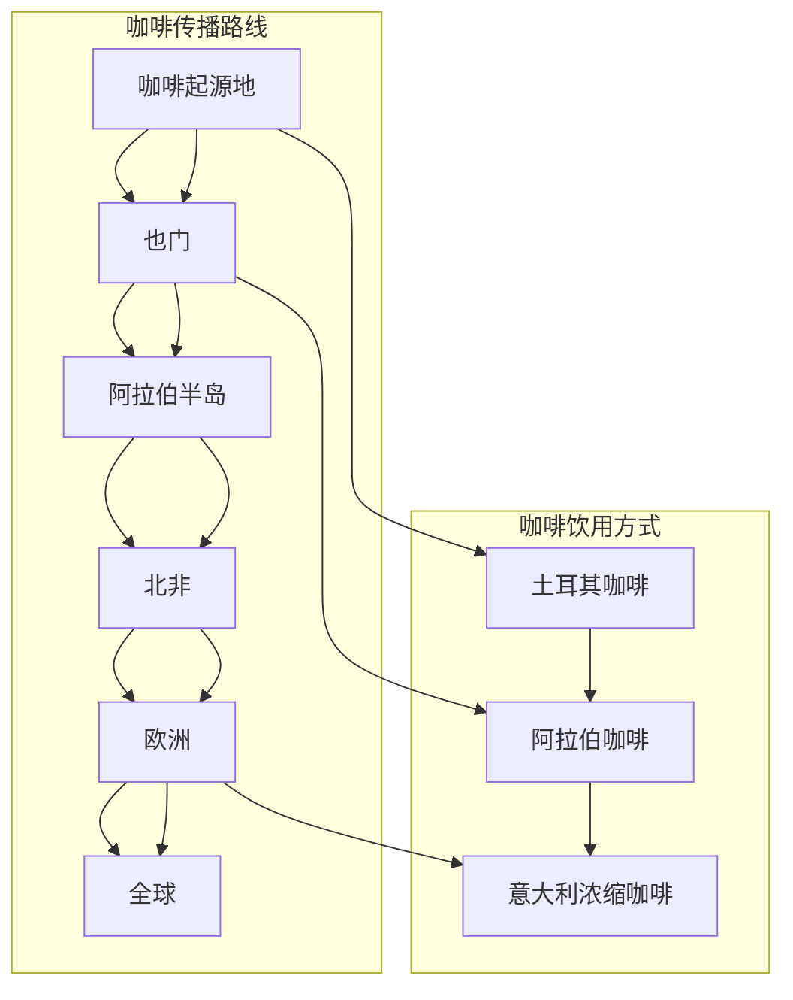

### 核心算法原理讲解

在咖啡的传播和饮用过程中，地理因素、历史背景和文化传统起到了关键作用。以下是一个简单的地理和历史文化模型，用于描述咖啡传播的过程和饮用方式的演变。

```python
class CoffeeCultivation:
    def __init__(self, origin, spread路线, drinking_methods):
        self.origin = origin
        self.spread路线 = spread路线
        self.drinking_methods = drinking_methods

    def display_info(self):
        print(f"咖啡起源地：{self.origin}")
        print(f"传播路线：{self.spread路线}")
        print(f"饮用方式：{self.drinking_methods}")

# 咖啡起源和传播模型
coffee_cultivation = CoffeeCultivation(
    origin="埃塞俄比亚吉马·迪尔地区",
    spread路线=["也门", "阿拉伯半岛", "北非", "欧洲", "全球"],
    drinking_methods=["土耳其咖啡", "阿拉伯咖啡", "意大利浓缩咖啡"]
)

# 显示咖啡文化信息
coffee_cultivation.display_info()
```

### 实际案例分析

**案例一：土耳其咖啡**

土耳其咖啡是一种非常浓烈的咖啡，其独特的口感和仪式感使其成为土耳其文化的重要组成部分。在土耳其，人们通常在节日和庆典活动中饮用土耳其咖啡，它不仅仅是一种饮品，更是一种文化和情感的载体。

**案例二：意大利浓缩咖啡**

意大利浓缩咖啡是意大利文化的一部分，其独特的制作工艺和口感深受全球咖啡爱好者的喜爱。意大利浓缩咖啡的制作讲究速度和精度，它通常在短时间内通过高压蒸汽提取，呈现出浓郁的口感和香气。

### 总结

本章详细介绍了咖啡的起源与传播，以及咖啡文化的形成过程。通过描述咖啡从非洲起源地到全球传播的路线，早期饮用方式，以及咖啡屋的兴起，我们可以看到咖啡文化在不同地区和时代的演变和发展。同时，通过核心概念与联系和实际案例的分析，我们更好地理解了咖啡文化的多样性和影响力。

在下一章中，我们将进一步探讨咖啡种植与制作工艺，深入了解咖啡是如何从果实变为香醇饮品的全过程。

### 第2章：咖啡种植与制作工艺

#### 2.1 咖啡的种植与产地

咖啡作为一种重要的经济作物，在全球范围内广泛种植。咖啡种植对地理条件有较高的要求，主要包括气候、土壤和海拔等因素。

**地理条件**：

1. **气候**：咖啡生长需要温暖湿润的气候，最佳的气候条件是年降水量在1500至2500毫米之间，年平均温度在15至24摄氏度之间。高温和干旱会严重影响咖啡的生长和品质。

2. **土壤**：咖啡适宜在排水良好、富含有机质的酸性土壤中生长。不同类型的土壤会影响咖啡豆的风味特征。

3. **海拔**：咖啡种植的海拔高度对其品质有显著影响。通常情况下，海拔越高，咖啡豆的风味越浓郁，酸度越高。海拔2000米以上的地区被认为是咖啡种植的理想地带。

**世界著名咖啡产地**：

1. **埃塞俄比亚**：被誉为咖啡的故乡，埃塞俄比亚的咖啡豆以其独特的香气和酸度而闻名。

2. **巴西**：巴西是世界上最大的咖啡生产国，其咖啡豆以浓郁和醇厚的口感著称。

3. **哥伦比亚**：哥伦比亚咖啡以其平衡的风味和优雅的酸度受到全球咖啡爱好者的喜爱。

4. **哥斯达黎加**：哥斯达黎加的咖啡以其复杂的风味和清新的香气而受到赞誉。

5. **越南**：越南的咖啡以其强烈的酸度和较低的苦味而受到亚洲市场的欢迎。

**地理条件的具体分析**：

- **气候**：埃塞俄比亚的吉马·迪尔地区属于热带高原气候，全年温暖湿润，非常适合咖啡生长。巴西的部分地区则拥有湿热的热带雨林气候，适合咖啡种植。

- **土壤**：埃塞俄比亚的土壤多为火山灰沉积，富含矿物质，有利于咖啡的生长。巴西和哥伦比亚的土壤则因地质条件不同，咖啡豆的风味也有所差异。

- **海拔**：越南的咖啡种植海拔较低，一般在1000米以下，这使得咖啡豆的酸度较高，但苦味较轻。而埃塞俄比亚的咖啡种植海拔较高，一般在2000米以上，使得咖啡豆的风味更加复杂和浓郁。

通过上述分析，我们可以看到地理条件对咖啡种植和风味的影响。不同地区的地理特征使得咖啡豆具有独特的风味，这些风味特征也成为咖啡产地识别的重要标志。

**Mermaid流程图**：

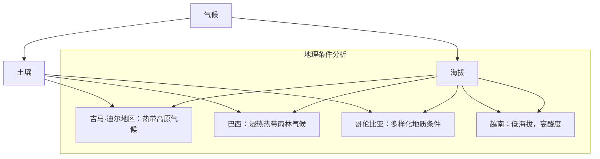

#### 核心概念与联系

- **地理条件**：气候、土壤和海拔是咖啡种植的重要地理条件。
- **世界著名咖啡产地**：埃塞俄比亚、巴西、哥伦比亚、哥斯达黎加和越南等。

通过Mermaid流程图，我们可以清晰地看到咖啡种植的地理条件及其对咖啡风味的影响。这些地理条件不仅决定了咖啡的生长环境，还直接影响了咖啡豆的风味特征。

#### 实际案例分析

**案例一：埃塞俄比亚的吉马·迪尔地区**

吉马·迪尔地区是咖啡的故乡，这里的咖啡豆以其独特的香气和酸度而著称。吉马·迪尔地区的气候温暖湿润，土壤富含火山灰沉积，海拔较高，这些条件共同作用，使得这里的咖啡豆具有独特的风味。

**案例二：巴西的圣保罗州**

巴西的圣保罗州是巴西咖啡的主要产区之一，这里的咖啡豆以其浓郁和醇厚的口感而闻名。圣保罗州的气候湿热，土壤肥沃，适合咖啡生长。同时，圣保罗州的海拔高度适中，使得咖啡豆的风味平衡而富有层次。

### 总结

本章详细介绍了咖啡的种植与产地，分析了咖啡种植对地理条件的要求。通过描述世界著名咖啡产地，如埃塞俄比亚、巴西、哥伦比亚、哥斯达黎加和越南等，我们了解了不同地区的地理特征对咖啡风味的影响。同时，通过实际案例的分析，我们更深入地理解了地理条件对咖啡种植和风味的重要性。在下一章中，我们将探讨咖啡的制作工艺，深入了解咖啡从果实变为香醇饮品的全过程。

### 2.2 咖啡的制作工艺

咖啡的制作工艺是咖啡从采摘、处理到烘焙的一系列复杂过程，每个步骤都对最终的咖啡风味产生重要影响。以下将详细描述这些步骤，并探讨各个环节的核心技术和原理。

#### 2.2.1 咖啡豆的采摘

咖啡豆的采摘是咖啡制作的第一步，直接影响到咖啡豆的原始质量。采摘时间通常在咖啡果实的成熟期，即果实呈现出黄色或红色时进行。

**采摘技术**：

1. **手工采摘**：手工采摘是一种传统且常用的方法，采摘者会根据果实的成熟度挑选出成熟的咖啡果。
2. **机械采摘**：机械采摘适用于大规模的咖啡种植园，通过机械设备进行采摘，提高了效率。

**核心原理**：

- **成熟度**：采摘成熟度适中的咖啡果，可以确保咖啡豆的质量和风味。
- **防止损伤**：在采摘过程中要避免果实受损，以免影响咖啡豆的品质。

#### 2.2.2 咖啡豆的处理

咖啡豆的处理是将采摘下来的咖啡果转化为可烘焙的咖啡豆的过程。处理方式主要有湿处理、干处理和蜜处理三种。

**处理方式**：

1. **湿处理**：湿处理是最常见的处理方式，包括水洗、干发酵和湿发酵等步骤。水洗法通过清洗去除果肉，再进行发酵处理，可以显著提高咖啡豆的风味和品质。

2. **干处理**：干处理是将咖啡果晾晒至干燥，去除果肉和果皮。这种方法适用于气候干燥的地区，处理时间较长。

3. **蜜处理**：蜜处理是一种介于湿处理和干处理之间的方法，通过部分去除果肉，使咖啡豆带有一定的果糖残留，产生独特的风味。

**核心原理**：

- **水洗法**：通过水洗去除果肉，可以减少果肉的污染，提高咖啡豆的卫生质量。
- **发酵**：发酵过程可以分解咖啡豆中的糖分和蛋白质，产生有机酸和其他风味物质。
- **干燥**：干燥过程通过自然晾晒或机械烘干，去除咖啡豆中的水分，防止霉变。

#### 2.2.3 咖啡豆的烘焙

烘焙是咖啡制作过程中最重要的步骤之一，它不仅决定了咖啡豆的色泽和香气，还直接影响咖啡的风味和口感。

**烘焙技术**：

1. **温度控制**：烘焙过程中，温度的控制至关重要。通常，烘焙温度从150摄氏度逐渐升高到220摄氏度，不同的温度区间对咖啡豆的风味产生不同的影响。

2. **烘焙时间**：烘焙时间通常在10到20分钟之间，过短的烘焙时间会导致咖啡豆未完全成熟，过长的烘焙时间则会使咖啡豆过度焦化，产生苦味。

3. **烘焙方式**：烘焙方式分为浅烘焙、中烘焙和深烘焙。浅烘焙保留较多的咖啡豆原味，中烘焙平衡风味和口感，深烘焙则强调浓郁的苦味和香气。

**核心原理**：

- **热传导**：烘焙过程中，咖啡豆表面的水分迅速蒸发，内部水分逐渐扩散，使咖啡豆逐渐变色和膨胀。
- **化学反应**：烘焙过程中，咖啡豆内部的糖分和蛋白质发生美拉德反应和焦糖化反应，产生各种风味物质。

#### 实际案例分析

**案例一：意大利浓缩咖啡**

意大利浓缩咖啡是一种深烘焙的咖啡，其烘焙过程要求精确控制温度和时间。通常，烘焙温度在200摄氏度左右，烘焙时间在15分钟左右。这种深烘焙的咖啡豆具有浓郁的苦味和香气，口感浓郁而强烈。

**案例二：手冲咖啡**

手冲咖啡是一种浅烘焙的咖啡，其烘焙温度较低，通常在180摄氏度左右，烘焙时间较短，约在10分钟左右。浅烘焙的咖啡豆保留了较多的原味和酸度，口感清新而柔和。

#### 核心概念与联系

- **采摘**：手工采摘和机械采摘技术的选择，以及采摘成熟度的控制。
- **处理**：湿处理、干处理和蜜处理方式的不同，以及发酵和干燥过程的原理。
- **烘焙**：温度控制、烘焙时间和烘焙方式对咖啡风味的影响。

**Mermaid流程图**：

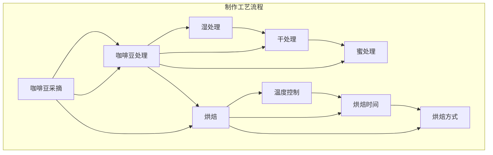

通过上述流程图，我们可以清晰地看到咖啡豆从采摘、处理到烘焙的各个环节，以及各个环节的核心技术和原理。

### 总结

本章详细介绍了咖啡豆的采摘、处理和烘焙过程，探讨了各个环节的核心技术和原理。通过实际案例的分析，我们了解了不同处理方式和烘焙方式对咖啡风味的影响。在下一章中，我们将探讨咖啡的种类与风味，深入分析咖啡豆的种类、产地和烘焙度对咖啡风味的影响。

### 第3章：咖啡的种类与风味

#### 3.1 咖啡的种类

咖啡种类繁多，根据不同的制作方式和风味特点，可以分为单品咖啡和混合咖啡两大类。

**单品咖啡**：

单品咖啡是指使用单一产地的咖啡豆制作的咖啡，具有独特的风味和特点。单品咖啡通常能够反映出产地特有的土壤、气候和种植条件。以下是一些著名的单品咖啡：

- **蓝山咖啡**：来自牙买加的蓝山地区，以其酸度低、口感醇厚而闻名。
- **哥伦比亚咖啡**：哥伦比亚是咖啡生产大国，其咖啡豆以其优雅的酸度和平衡的风味受到喜爱。
- **耶加雪菲咖啡**：来自埃塞俄比亚的耶加雪菲地区，以其鲜明的柑橘和花香味而著称。
- **肯尼亚咖啡**：肯尼亚的咖啡以其强烈的酸度和明亮的香气而闻名。

**混合咖啡**：

混合咖啡是指使用不同产地的咖啡豆混合制作的咖啡，旨在通过不同风味的结合，创造出更加丰富的口感。混合咖啡的多样性很高，可以根据不同的口味和需求进行调整。以下是一些常见的混合咖啡：

- **意式浓缩咖啡**：通常使用多种产地和类型的咖啡豆混合而成，以制作出浓烈、丰富的意式咖啡。
- **法式压滤咖啡**：使用罗布斯塔豆和阿比蒂豆混合，制作出浓郁的咖啡。
- **瑞士水壶咖啡**：一种混合了不同产地和类型的咖啡豆，以提供丰富的口感和多层次的风味。

**核心概念与联系**：

- **单品咖啡**：单一产地，独特风味，反映产地特点。
- **混合咖啡**：多种产地混合，丰富口感，追求风味平衡。

**Mermaid流程图**：

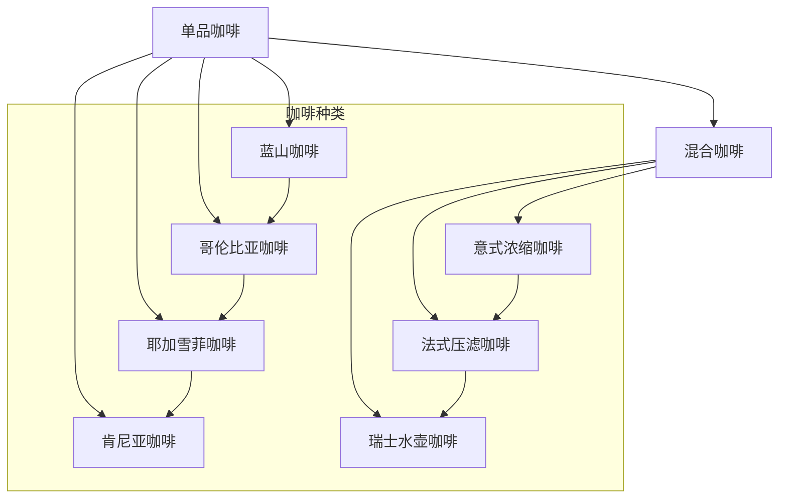

#### 3.2 咖啡的风味

咖啡的风味是其最重要的特征之一，影响消费者对咖啡的喜爱程度。咖啡的风味受到多种因素的影响，包括咖啡豆的产地、烘焙度和冲泡方式等。

**风味特征**：

- **酸度**：咖啡的酸度是其口感的重要组成部分，良好的酸度能够提升咖啡的清新感和层次感。
- **甜度**：甜度可以中和咖啡的苦味，增加咖啡的口感丰富度。
- **苦度**：咖啡的苦度是其风味的重要部分，苦度适中能够增强咖啡的口感。
- **口感**：包括咖啡的顺滑度、醇厚度和余韵，好的口感能够让咖啡更加令人愉悦。

**风味受到的影响因素**：

1. **产地**：不同的产地具有独特的土壤和气候条件，这些条件对咖啡豆的风味有显著影响。
2. **烘焙度**：烘焙度越高，咖啡的苦味越明显，烘焙度越低，咖啡的酸度和甜度越突出。
3. **冲泡方式**：不同的冲泡方式对咖啡的风味有显著影响，如手冲咖啡和意式浓缩咖啡。

**核心概念与联系**：

- **酸度、甜度、苦度和口感**：咖啡的风味特征。
- **产地、烘焙度和冲泡方式**：影响咖啡风味的因素。

**Mermaid流程图**：

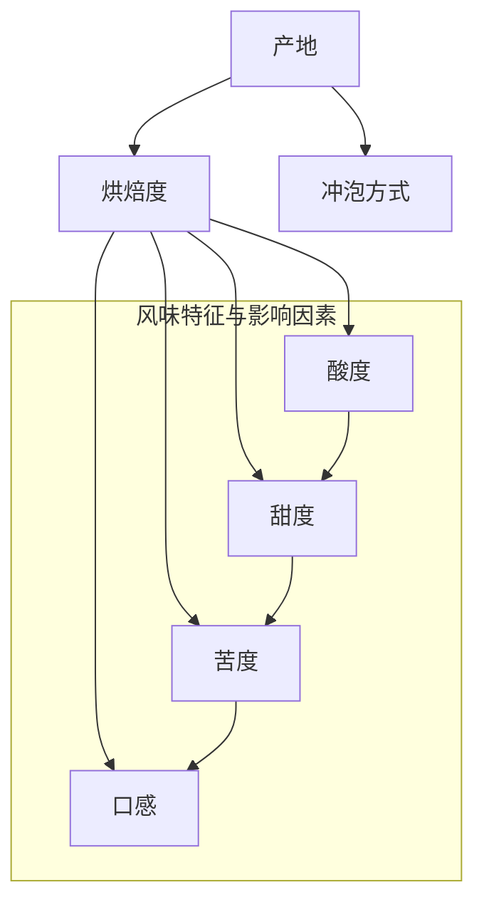

#### 实际案例分析

**案例一：蓝山咖啡**

蓝山咖啡以其独特的酸度和醇厚口感而闻名。来自牙买加蓝山地区的咖啡豆，由于土壤和气候条件的优越，其酸度适中，甜度丰富，口感顺滑。蓝山咖啡的风味特点使其成为高端咖啡市场的宠儿。

**案例二：意式浓缩咖啡**

意式浓缩咖啡通常使用多种产地和类型的咖啡豆混合而成，其特点是浓烈、丰富。通过高温高压的冲泡方式，意式浓缩咖啡的苦度较高，酸度和甜度适中，口感浓郁。意式浓缩咖啡在意大利等欧洲国家广受欢迎。

### 总结

本章详细介绍了咖啡的种类与风味。通过分析单品咖啡和混合咖啡的特点，以及咖啡风味受到的影响因素，我们了解了咖啡风味的多样性和复杂性。同时，通过实际案例的分析，我们更深入地理解了不同种类的咖啡和其独特的风味特征。在下一章中，我们将探讨咖啡作为第三空间的社交意义，分析咖啡在现代社会中的作用和影响。

### 第二部分：咖啡作为第三空间的社交意义

#### 第4章：第三空间的概念与作用

#### 4.1 第三空间的定义

“第三空间”是一个广泛用于社会学和建筑学领域的概念，最初由法国社会学家布迪厄（Pierre Bourdieu）提出。第三空间指的是介于私人领域（第一空间，家庭）和公共领域（第二空间，工作场所）之间的一个空间，它是人们进行社交活动、休闲和放松的重要场所。

**第三空间的起源**：

第三空间的概念起源于20世纪80年代的西方社会，特别是在城市化进程中，随着咖啡馆、书店、图书馆和共享工作空间等场所的兴起，第三空间逐渐成为人们日常生活的重要组成部分。

**第三空间的特点**：

1. **社会互动性**：第三空间是一个开放且包容的环境，人们可以在这里自由地交流、互动，从而建立新的社交关系。
2. **多样性**：第三空间通常具有多元化的功能和氛围，可以满足不同人群的多种需求，如休闲、学习、工作和社交。
3. **非正式性**：与正式的工作场所和家庭环境不同，第三空间通常更加轻松和自由，人们可以在这里放松身心，享受独处或与他人的互动。

**第三空间与家庭、工作场所的区别**：

- **家庭**：家庭是私人领域，是人们休息和生活的场所，强调个人隐私和家庭关系的维护。
- **工作场所**：工作场所是公共领域，是人们进行工作活动的场所，强调效率和组织纪律。
- **第三空间**：第三空间介于家庭和工作场所之间，既具有私人领域的舒适性，又具有公共领域的社会性，是一个开放、多元且灵活的社交空间。

**Mermaid流程图**：

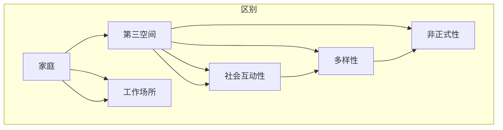

#### 核心概念与联系

- **第三空间**：介于私人领域（家庭）和公共领域（工作场所）之间的社交空间。
- **特点**：社会互动性、多样性、非正式性。
- **与家庭、工作场所的区别**：强调隐私、效率和社交性。

### 4.2 第三空间在现代社会中的作用

第三空间在现代社会中扮演着重要的角色，不仅为人们提供了一个社交和休闲的场所，还对社会文化和经济产生了深远的影响。

**社交功能**：

第三空间是人们建立和维持社交关系的重要场所。在这里，人们可以自由地交流和互动，结识新朋友，分享兴趣和经验。咖啡馆、书店和图书馆等第三空间通常成为社区活动的中心，促进了人际交往和社会互动。

**文化多样性**：

第三空间具有多元化的文化氛围，反映了社会的多样性和包容性。在这里，不同文化背景和兴趣爱好的人们可以和平共处，互相了解和尊重。这种文化多样性不仅丰富了第三空间的内容，也为社会的和谐发展提供了基础。

**经济影响**：

第三空间对经济发展也具有积极的推动作用。咖啡馆、书店和共享工作空间等第三空间的兴起，创造了大量的就业机会，促进了消费和投资。此外，第三空间还吸引了大量游客和居民，提升了城市的吸引力和竞争力。

**核心概念与联系**：

- **社交功能**：第三空间是建立和维持社交关系的场所。
- **文化多样性**：第三空间反映了社会的多样性和包容性。
- **经济影响**：第三空间促进了就业、消费和城市竞争力。

**Mermaid流程图**：

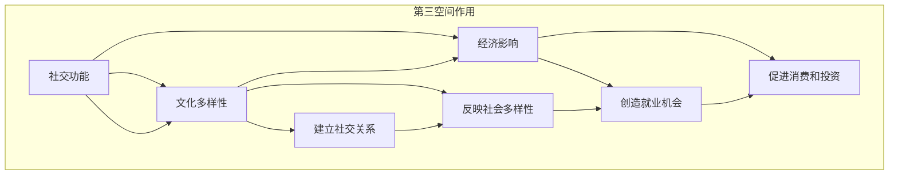

### 实际案例分析

**案例一：纽约的“第三空间”**

纽约是一个典型的现代化大都市，其第三空间（如咖啡馆、书店和图书馆）在人们的日常生活中扮演着重要角色。在这些场所，人们可以自由地交流和互动，分享兴趣和经验。第三空间不仅为纽约人提供了一个休闲和放松的场所，还促进了城市文化的多样性和发展。

**案例二：东京的“咖啡生活文化”**

东京的咖啡文化非常发达，其咖啡馆不仅是人们放松和社交的场所，还成为了一种文化现象。在这里，人们可以享受到高品质的咖啡，同时参与各种文化活动和社交活动。第三空间在东京的经济和文化发展中起到了重要作用。

### 总结

本章详细介绍了第三空间的概念、特点以及与家庭、工作场所的区别。通过分析第三空间在现代社会中的作用，如社交功能、文化多样性和经济影响，我们看到了第三空间在现代社会中的重要性。同时，通过实际案例的分析，我们更深入地理解了第三空间在社会文化、经济和人们日常生活中的作用和意义。在下一章中，我们将探讨咖啡文化与社交意义的关联，深入分析咖啡如何作为社交媒介影响人们的社交习惯和文化认同。

### 第5章：咖啡文化与社交意义的关联

#### 5.1 咖啡作为社交媒介的历史

咖啡作为一种社交媒介，其历史可以追溯到数百年前。最早在阿拉伯世界，咖啡成为宗教仪式和社交活动的一部分。随着时间的推移，咖啡传播到欧洲和其他地区，逐渐成为人们日常生活的重要部分。

**早期的历史**：

- **阿拉伯世界**：公元9世纪，咖啡在也门开始普及，成为宗教仪式和社交活动的重要组成部分。咖啡馆成为人们聚集和交流的场所，推动了文化和思想的传播。
- **欧洲**：16世纪末，咖啡通过威尼斯和亚历山大等港口传入欧洲。咖啡馆在欧洲迅速兴起，成为知识分子和艺术家聚集的场所，推动了文艺复兴和启蒙运动的发展。
- **美洲和亚洲**：随着欧洲殖民者的扩张，咖啡文化传播到美洲和亚洲等地。在美国，咖啡与独立运动紧密相连，成为文化创新和社交互动的重要媒介。

**历史演变**：

- **16-18世纪**：在欧洲，咖啡馆成为社交和商业活动的中心，人们在这里交流思想、分享知识，推动了文化的多样性和融合。
- **19-20世纪**：随着工业化的发展，咖啡的消费逐渐普及，咖啡馆成为人们日常生活中不可或缺的一部分。在这个时期，咖啡不仅是一种饮品，更是一种社交媒介，促进了人际交往和社会团结。
- **21世纪**：在全球化和信息化的背景下，咖啡文化得到了进一步的发展和传播。咖啡馆成为人们休闲、社交和商务活动的重要场所，咖啡作为一种社交媒介的作用更加凸显。

**核心概念与联系**：

- **阿拉伯世界**：咖啡的起源地和最早的普及地，咖啡作为宗教仪式和社交媒介的重要角色。
- **欧洲**：咖啡的传播和普及地，咖啡馆成为文化和思想交流的中心。
- **美洲和亚洲**：咖啡文化的传播和融合，咖啡作为社交媒介影响人们的生活和文化。

**Mermaid流程图**：

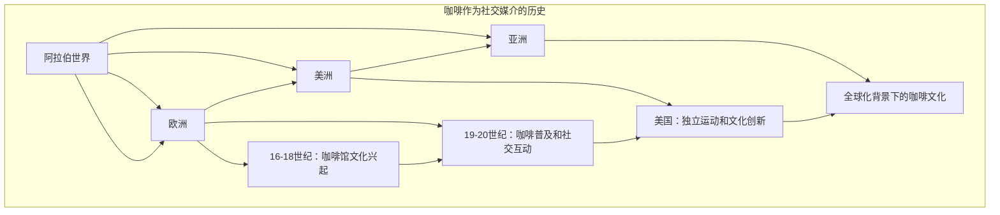

#### 核心概念与联系

- **阿拉伯世界**：咖啡的起源地和最早的普及地。
- **欧洲**：咖啡的传播和普及地，咖啡馆成为文化和思想交流的中心。
- **美洲和亚洲**：咖啡文化的传播和融合，咖啡作为社交媒介影响人们的生活和文化。

**实际案例分析**

**案例一：伦敦的咖啡馆文化**

伦敦是欧洲咖啡馆文化的发源地之一。在18世纪，伦敦的咖啡馆成为知识分子、政治家和商人的聚集地。在这里，人们可以自由地交流思想，分享知识和经验。咖啡馆不仅促进了文化的多样性和融合，还推动了英国社会的进步和发展。

**案例二：纽约的“第三波咖啡运动”**

21世纪初，纽约兴起了一场“第三波咖啡运动”，推动了咖啡文化的创新和发展。在这个运动中，咖啡馆注重咖啡豆的产地、烘焙度和冲泡方式，致力于提供高品质的咖啡体验。咖啡馆成为人们休闲、社交和商务活动的重要场所，咖啡作为一种社交媒介的作用更加凸显。

### 5.2 咖啡社交的意义

咖啡社交的意义不仅体现在其历史演变中，更在于其对个人心理健康、社区建设和社会文化的影响。

**个人心理健康**：

咖啡具有提神醒脑的作用，可以提升人们的注意力和精神状态。适量饮用咖啡可以缓解疲劳，提高工作效率，同时也能增强个人的自信心和积极性。此外，咖啡社交提供了一个放松和社交的场所，有助于缓解压力，提升个人的心理健康。

**社区建设**：

咖啡馆等第三空间成为社区活动的重要场所，促进了邻里关系的建立和维护。在这里，居民可以自由地交流、分享和互动，增强了社区的凝聚力和归属感。咖啡社交不仅为社区成员提供了一个相互了解和沟通的平台，还促进了社区的发展和进步。

**社会文化**：

咖啡作为一种文化符号，反映了社会的多样性和包容性。咖啡社交促进了不同文化背景和兴趣爱好的人们之间的交流和融合，增强了社会的和谐与稳定。同时，咖啡文化也推动了社会创新和文化发展，为社会的繁荣和进步做出了贡献。

**核心概念与联系**：

- **个人心理健康**：咖啡的提神作用和社交场所对个人心理健康的影响。
- **社区建设**：咖啡馆等第三空间对社区建设和邻里关系的影响。
- **社会文化**：咖啡作为文化符号对文化多样性和社会创新的影响。

**Mermaid流程图**：

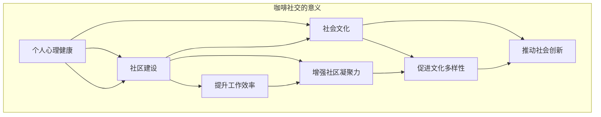

### 实际案例分析

**案例一：意大利的咖啡馆文化**

意大利的咖啡馆文化历史悠久，咖啡馆不仅是人们休闲和社交的场所，还是文化传承和社会交流的重要平台。在这里，人们可以享受到高品质的咖啡，同时参与各种文化活动和社交活动。咖啡馆成为意大利社会文化的一部分，反映了意大利人的生活方式和价值观念。

**案例二：美国的“第三波咖啡革命”**

美国的“第三波咖啡革命”推动了咖啡文化的创新和发展。在这个运动中，咖啡馆注重咖啡豆的产地、烘焙度和冲泡方式，致力于提供高品质的咖啡体验。咖啡馆成为人们休闲、社交和商务活动的重要场所，咖啡作为一种社交媒介的作用更加凸显。

### 总结

本章通过分析咖啡作为社交媒介的历史，以及咖啡社交对个人心理健康、社区建设和社会文化的影响，揭示了咖啡在现代社会中的重要角色。通过实际案例的分析，我们更深入地理解了咖啡社交的意义和价值。在下一章中，我们将探讨咖啡文化的影响与挑战，分析咖啡在全球化和本土化过程中的机遇和挑战。

### 第6章：咖啡文化的影响与挑战

#### 6.1 咖啡文化对生活方式的影响

咖啡文化已经深深融入了全球各地的日常生活中，对人们的作息时间、消费习惯和生活节奏产生了显著影响。

**生活节奏的改变**：

咖啡作为一种提神饮品，改变了人们的作息时间。许多人在早晨第一件事就是享用一杯咖啡，以提神醒脑，开始新的一天。此外，咖啡也成为许多人下午茶时间的重要饮品，帮助他们恢复精力，继续工作或学习。这种习惯改变了人们的日常作息，使得生活节奏更加紧凑和高效。

**消费习惯的形成**：

咖啡文化的普及也促进了消费习惯的形成。人们不再仅仅将咖啡视为一种简单的饮品，而是将其作为一种生活品质的象征。越来越多的消费者愿意为高品质的咖啡支付更高的价格，这推动了咖啡产业的创新和发展。此外，咖啡消费也带动了相关产业的发展，如咖啡器具、咖啡店装饰和咖啡豆贸易等。

**核心概念与联系**：

- **生活节奏**：咖啡改变了人们的作息时间，使其更加紧凑和高效。
- **消费习惯**：咖啡成为生活品质的象征，推动了消费习惯的形成。

**Mermaid流程图**：

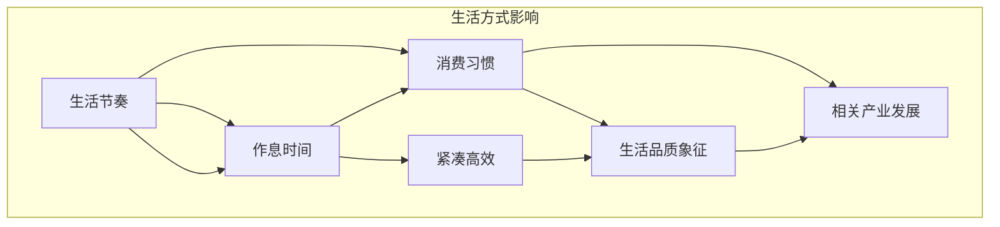

#### 6.2 咖啡文化面临的挑战

尽管咖啡文化对生活方式产生了积极的影响，但同时也面临着一些挑战，尤其是在可持续发展、文化认同与冲突以及全球化和本土化方面。

**可持续发展**：

咖啡种植和消费对环境和生态系统的影响不可忽视。咖啡种植需要大量的水资源和化肥，可能导致水土流失和生态破坏。此外，咖啡消费产生的废弃物也需要妥善处理，以减少对环境的影响。为了实现可持续发展，咖啡产业需要采取更加环保的种植和消费方式，如有机种植、水资源管理和废弃物回收等。

**文化认同与冲突**：

咖啡文化在全球范围内的传播也带来了文化认同与冲突。在一些地区，咖啡文化的本土化和全球化过程引发了文化认同的问题。一方面，本土化的咖啡文化试图保持传统特色，以维护地方文化的独特性；另一方面，全球化的咖啡文化推动了咖啡消费的普及和标准化，可能导致文化同质化。如何平衡本土化和全球化的关系，维护文化多样性，是咖啡文化面临的重要挑战。

**全球化和本土化**：

咖啡文化的全球化和本土化是一个复杂的过程，涉及到经济、社会和文化等多个层面。全球化使得咖啡文化得以广泛传播，促进了国际贸易和文化交流。然而，本土化也使得咖啡文化在各个地区具有独特的表现形式，反映了地方文化的特色。如何在全球化进程中保持本土化特色，推动文化多样性和创新，是咖啡文化面临的重要挑战。

**核心概念与联系**：

- **可持续发展**：咖啡种植和消费对环境和生态系统的影响。
- **文化认同与冲突**：本土化和全球化对文化认同的影响。
- **全球化和本土化**：经济、社会和文化层面的影响。

**Mermaid流程图**：

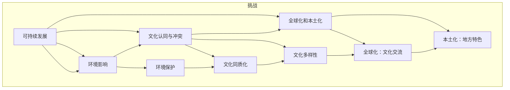

### 实际案例分析

**案例一：哥伦比亚的咖啡文化**

哥伦比亚是世界上最大的咖啡生产国之一，其咖啡文化深受本土文化的影响。哥伦比亚的咖啡种植传统独特，注重环境保护和可持续发展。同时，哥伦比亚的咖啡文化也反映了其丰富的民族文化和历史。如何在全球化和本土化之间找到平衡，是哥伦比亚咖啡文化面临的重要挑战。

**案例二：日本的“第三波咖啡运动”**

日本是咖啡消费大国，其咖啡文化在全球化和本土化之间找到了独特的平衡。日本的咖啡馆注重咖啡豆的产地、烘焙度和冲泡方式，致力于提供高品质的咖啡体验。同时，日本的咖啡文化也融入了本国的茶道和传统文化，形成了独特的咖啡文化现象。

### 总结

本章探讨了咖啡文化对生活方式的影响，以及咖啡文化在全球化和本土化过程中面临的挑战。通过分析生活节奏的改变、消费习惯的形成和可持续发展、文化认同与冲突以及全球化和本土化等方面，我们了解了咖啡文化在现代社会的复杂性和多样性。同时，通过实际案例的分析，我们更深入地理解了咖啡文化在不同社会背景下的影响和挑战。在下一章中，我们将展望未来咖啡文化的趋势和前景。

### 第7章：未来咖啡文化的趋势与展望

#### 7.1 新兴咖啡文化现象

随着科技的进步和社会的发展，咖啡文化呈现出多样化和创新化的趋势。以下是一些新兴的咖啡文化现象：

**手冲咖啡的兴起**：

手冲咖啡是一种强调手工技艺和咖啡品质的咖啡冲泡方式。与自动咖啡机相比，手冲咖啡更加注重冲泡过程中的每一个细节，从而实现更高的咖啡口感和风味。手冲咖啡的兴起，反映了人们对咖啡品质和个性化体验的追求。

**创新咖啡饮品的多样化**：

近年来，咖啡饮品的市场需求不断增加，各种创新的咖啡饮品层出不穷。例如，拿铁、卡布奇诺和摩卡等经典饮品，以及各种新奇的果味咖啡、冰淇淋咖啡等。这些创新咖啡饮品不仅丰富了消费者的选择，也推动了咖啡文化的发展。

**咖啡文化体验**：

除了传统的咖啡消费方式，越来越多的咖啡馆开始提供咖啡文化体验。例如，咖啡制作课程、咖啡品鉴会和文化交流活动等。这些活动不仅增加了消费者的参与感，也提升了咖啡馆的文化内涵和品牌价值。

**核心概念与联系**：

- **手冲咖啡**：强调手工技艺和咖啡品质。
- **创新咖啡饮品**：丰富消费者的选择，推动咖啡文化发展。
- **咖啡文化体验**：增加消费者的参与感和文化内涵。

**Mermaid流程图**：

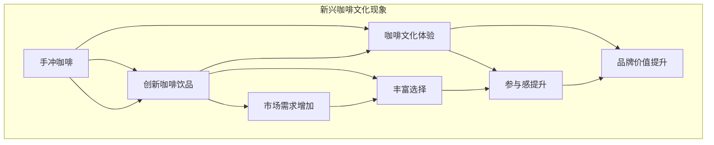

#### 7.2 咖啡文化的未来展望

未来，咖啡文化将继续在全球范围内传播和发展。以下是一些可能的未来趋势：

**科技与咖啡的结合**：

随着科技的不断进步，咖啡文化将与科技深度融合。例如，智能咖啡机、咖啡传感器和在线咖啡教育平台等，将使咖啡生产、消费和体验更加智能化和便捷化。同时，科技也将为咖啡产业带来更多的创新和机遇。

**文化多样性与全球化**：

全球化将继续推动咖啡文化的传播和融合，但与此同时，各地区的本土化特色也将得到更加充分的展现。未来，咖啡文化将在全球范围内呈现出更加多样化和多元化的特点，不同文化之间的交流与碰撞将激发出新的创意和灵感。

**可持续发展**：

可持续发展将是未来咖啡文化的重要方向。随着人们对环境保护和可持续发展的关注不断增加，咖啡产业将更加注重生态友好、资源节约和绿色生产。未来，有机咖啡、公平贸易咖啡和碳中和咖啡等将成为咖啡市场的新趋势。

**核心概念与联系**：

- **科技与咖啡的结合**：智能咖啡机、在线教育平台等，推动咖啡产业智能化和便捷化。
- **文化多样性与全球化**：全球咖啡文化融合与本土化特色的展现。
- **可持续发展**：生态友好、资源节约和绿色生产，推动咖啡产业可持续发展。

**Mermaid流程图**：

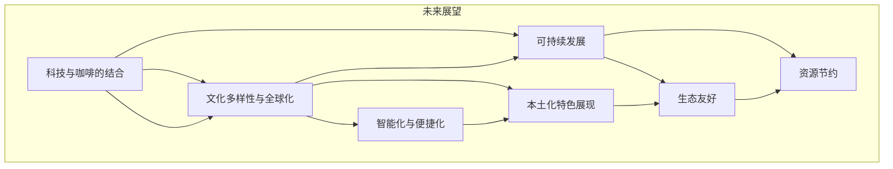

### 总结

未来咖啡文化将继续在全球范围内传播和发展，呈现出多样化和创新化的趋势。手冲咖啡、创新咖啡饮品和咖啡文化体验等新兴现象，将丰富咖啡文化的内涵和表现形式。同时，科技与咖啡的结合、文化多样性与全球化的交融以及可持续发展的理念，将为咖啡文化带来新的机遇和挑战。通过展望未来咖啡文化的趋势和前景，我们能够更好地理解咖啡文化在现代社会中的重要性和影响力。

### 结束语

本文通过对咖啡文化的起源与发展、种植与制作工艺、种类与风味，以及咖啡作为第三空间的社交意义等多个方面的深入探讨，揭示了咖啡文化在现代社会中的多重角色和深远影响。从咖啡的起源地埃塞俄比亚到全球的广泛传播，从采摘、处理到烘焙的过程，再到作为第三空间的社交媒介，咖啡文化不仅丰富了人们的生活，还促进了文化交流和社会融合。

我们看到了咖啡作为一种文化符号，如何在历史演变中逐渐形成了独特的风格和特色。同时，咖啡文化对个人生活方式的改变、消费习惯的形成，以及在全球化和本土化过程中的挑战，都为我们理解这一文化现象提供了新的视角。

展望未来，随着科技的进步和社会的发展，咖啡文化将继续创新和演变，为人们的生活带来更多的便利和乐趣。我们期待看到咖啡产业在可持续发展理念的指导下，实现生态友好和资源节约。同时，不同文化之间的交流与融合，也将进一步丰富咖啡文化的内涵，推动全球文化的多样性和共同进步。

在结尾，我鼓励读者在日常生活中更加关注咖啡文化，体验其带来的乐趣和品味。同时，也希望读者能够思考咖啡文化在现代社会中的价值和意义，为推动咖啡文化的创新和发展贡献自己的智慧和力量。

### 作者信息

作者：AI天才研究院/AI Genius Institute & 禅与计算机程序设计艺术 /Zen And The Art of Computer Programming

AI天才研究院致力于推动人工智能和计算机科学的发展，致力于培养下一代技术领袖。同时，作为《禅与计算机程序设计艺术》的作者，我也希望将技术与人文相结合，为读者带来具有深度和思考的技术博客。

---

### 扩展阅读

1. **《咖啡：一杯历史的滋味》**：作者威廉·尤班克（William Urry），详细介绍了咖啡的历史、文化和社会影响。

2. **《咖啡文化的哲学》**：作者斯蒂芬·霍尔姆斯（Stephen Holmes），探讨了咖啡文化与哲学、艺术和生活的联系。

3. **《咖啡：一种文化的历史》**：作者哈罗德·麦克马洪（Harold McGee），从科学和文化的角度分析了咖啡的酿造、风味和全球化过程。

4. **《第三空间：公共生活与都市主义》**：作者雷蒙德·卡勒（Raymond Callahan），深入探讨了第三空间在城市生活中的作用和意义。

5. **《可持续咖啡：实现生态和经济的双赢》**：作者埃莉诺·凯斯（Eleanor CCASE），提供了关于如何实现咖啡可持续种植和消费的见解和策略。

