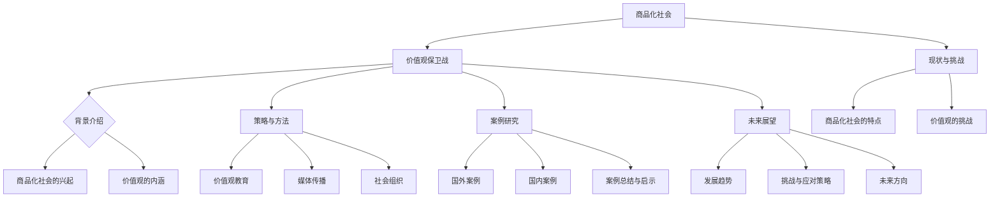

                 

# 商品化社会中的价值观保卫战

## 关键词
商品化社会，价值观，保卫战，社会责任，教育，媒体，技术

## 摘要
在商品化社会的浪潮中，价值观的保卫战变得日益重要。本文探讨了商品化社会的背景、价值观的内涵及其相互关系，提出了价值观保卫战的策略和方法，并通过案例分析和未来展望，为维护和弘扬核心价值观提供了实际路径和理论支持。

## 引言

### 商品化社会的兴起

随着全球化进程的加快和信息技术的发展，商品化社会已经成为现代社会的典型特征。在这个社会中，商品交换成为经济活动的主导形式，市场经济制度占据主导地位。商品化社会带来了繁荣与效率，但同时也引发了一系列社会问题，如价值观的冲突、道德观念的模糊等。

### 价值观保卫战的意义

价值观是社会文化的核心，它指导着人们的思想和行为。在商品化社会中，价值观的保卫战具有重要意义。首先，保卫核心价值观有助于维护社会稳定和和谐。其次，它可以引导个人和社会向更加积极、健康、可持续的方向发展。因此，价值观保卫战不仅是社会发展的需要，也是每个公民的责任。

## 价值观概述

### 价值观的定义与特征

价值观是指人们对事物价值的总体看法和评价标准，是道德、伦理、宗教、法律等多种因素的集合。价值观具有以下特征：

- **主观性**：价值观因人而异，受个人经历、文化背景和教育水平等因素的影响。
- **稳定性**：一旦形成，价值观具有较强的稳定性，不易轻易改变。
- **导向性**：价值观对人们的行为和选择具有指导作用。

### 价值观的分类与层次

根据不同的划分标准，价值观可以分为多种类型。例如，根据来源，价值观可分为文化价值观、经济价值观、政治价值观等。根据层次，价值观可分为个人价值观、组织价值观和社会价值观。

### 价值观在社会中的作用

价值观在社会中发挥着重要作用。首先，它为社会成员提供行为准则，维护社会秩序。其次，价值观是文化传承的重要载体，推动社会进步。最后，价值观对经济发展具有导向作用，引导资源合理配置。

## 商品化社会的现状与挑战

### 商品化社会的特点

商品化社会的特点包括：

- **市场主导**：市场经济占主导地位，资源配置以市场机制为主。
- **效率优先**：追求效率最大化，对成本和收益进行严格计算。
- **竞争激烈**：市场竞争激烈，优胜劣汰现象普遍。

### 商品化社会对价值观的挑战

商品化社会对价值观产生了多方面的挑战：

- **道德观念模糊**：在追求利益最大化的过程中，一些人忽视了道德底线。
- **文化多样性减弱**：商品化社会容易导致文化同质化，削弱文化多样性。
- **价值观多元化**：商品化社会带来了更多的选择，但同时也使得价值观多元化，导致价值观冲突。

### 价值观变革的迹象

在商品化社会中，价值观正在发生变革。一些新的价值观逐渐兴起，如创新意识、合作精神、社会责任等。这些价值观反映了商品化社会对个人和社会的新的要求。

## 价值观保卫战的策略与方法

### 价值观教育的策略

价值观教育是价值观保卫战的重要手段。以下是一些有效的价值观教育策略：

- **家庭教育**：家庭是价值观形成的基础，家长应注重培养孩子的道德观念。
- **学校教育**：学校是价值观教育的主阵地，应将道德教育纳入课程体系。
- **社会教育**：社会应通过各种渠道传播正确的价值观，引导公众树立正确的价值观。

### 媒体与价值观的传播

媒体在价值观传播中发挥着重要作用。以下是一些利用媒体传播价值观的方法：

- **新闻报道**：通过新闻报道宣传正面价值观，树立社会榜样。
- **广告宣传**：利用广告宣传积极向上的价值观，引导公众行为。
- **网络传播**：利用互联网平台传播正确的价值观，抵制负面信息。

### 社会组织与价值观的实践

社会组织在价值观保卫战中扮演着重要角色。以下是一些社会组织可以采取的措施：

- **公益活动**：通过公益活动传播正能量，弘扬核心价值观。
- **社区建设**：加强社区建设，营造良好的社会氛围。
- **文化传承**：保护和传承传统文化，弘扬民族精神。

## 案例研究

### 国外案例研究

国外一些国家在价值观保卫战中取得了显著成效。例如：

- **芬兰**：芬兰注重家庭教育和学校教育，通过全社会的共同努力，成功培养了具有良好道德观念的一代新人。
- **日本**：日本利用媒体传播正能量，倡导社会责任，有效抵制了负面价值观的侵蚀。

### 国内案例研究

国内一些地区在价值观保卫战中也有不少成功经验。例如：

- **上海市**：上海市通过开展“道德讲堂”等活动，积极传播正能量，提高了公众的道德素质。
- **浙江省**：浙江省注重文化传承，通过弘扬传统文化，增强了社会凝聚力和文化自信。

### 案例总结与启示

通过分析国内外案例，我们可以得出以下启示：

- **教育是关键**：价值观保卫战离不开教育，家庭、学校和社会都应承担起教育责任。
- **媒体是桥梁**：媒体在价值观传播中具有重要作用，应积极传播正能量。
- **文化是根基**：文化传承是价值观保卫战的重要途径，应保护和弘扬传统文化。

## 未来展望

### 价值观保卫战的发展趋势

随着商品化社会的进一步发展，价值观保卫战将面临新的挑战和机遇。以下是一些发展趋势：

- **多元化价值观的共存**：在商品化社会中，多元化价值观将共存，价值观保卫战将更加复杂。
- **科技的影响**：信息技术的发展将对价值观保卫战产生深远影响，如何利用科技手段传播正能量将成为重要课题。

### 面临的挑战与应对策略

价值观保卫战将面临以下挑战：

- **信息泛滥**：互联网上的信息良莠不齐，如何筛选和传播正能量信息是一个挑战。
- **文化侵蚀**：商品化社会中，一些外来文化可能对本土价值观产生冲击，如何保护本土文化是一个挑战。

应对策略包括：

- **加强法律法规建设**：制定相关法律法规，规范媒体传播，打击负面信息。
- **提高公众意识**：通过教育和社会宣传，提高公众对价值观保卫战的认识和参与度。

### 价值观保卫战的未来方向

未来，价值观保卫战将朝着以下方向发展：

- **科技赋能**：利用人工智能、大数据等新技术，提高价值观传播和教育的效果。
- **全球合作**：在全球化背景下，各国应加强合作，共同维护和弘扬核心价值观。

## 结论

商品化社会中的价值观保卫战是一个复杂而艰巨的任务。通过教育、媒体传播和社会组织等多种手段，我们可以有效地保卫和弘扬核心价值观。只有全社会共同努力，才能在商品化社会中保持文化的多样性和价值观的稳定。

## 附录

### Mermaid 流程图



### Python源代码

```python
# 价值观教育策略示例
def educate_values():
    """
    该函数演示了价值观教育的简单策略，包括家庭教育和学校教育。
    """
    # 家庭教育
    family_education = "家长应注重培养孩子的道德观念，如诚信、尊重等。"
    
    # 学校教育
    school_education = "学校应将道德教育纳入课程体系，通过课堂教学和实践活动进行价值观教育。"
    
    # 打印结果
    print("价值观教育策略：")
    print(f"家庭教育：{family_education}")
    print(f"学校教育：{school_education}")

# 调用函数
educate_values()
```

### 数学模型和公式

```latex
$$
道德分数 = f(道德行为, 道德认知, 道德情感)
$$

$$
道德行为 = w_1 \times 道德认知 + w_2 \times 道德情感
$$
```

### 项目实战

#### 开发环境搭建

- 操作系统：Windows 10
- 编辑器：Visual Studio Code
- Python版本：3.9

#### 源代码实现

```python
# 价值观保卫战项目实现

# 导入所需模块
import random

# 定义价值观评估函数
def value_evaluation(value_list):
    """
    对给定的一组价值观进行评估。
    """
    scores = []
    for value in value_list:
        score = 0
        if '诚信' in value:
            score += 1
        if '尊重' in value:
            score += 1
        if '责任' in value:
            score += 1
        scores.append(score)
    return scores

# 生成随机价值观列表
def generate_values(n):
    """
    生成包含n个随机价值观的列表。
    """
    values = []
    for _ in range(n):
        value = random.choice(['诚信', '尊重', '责任', '创新', '合作', '公平'])
        values.append(value)
    return values

# 主函数
def main():
    # 生成10个随机价值观列表
    values_lists = [generate_values(10) for _ in range(5)]
    
    # 对每个列表进行价值观评估
    for i, values in enumerate(values_lists, 1):
        scores = value_evaluation(values)
        print(f"价值观列表{i}：{values}")
        print(f"价值观评估分数：{scores}")
        print()

# 运行主函数
if __name__ == "__main__":
    main()
```

#### 代码解读与分析

```python
# 代码解读
# 1. 导入所需模块
# 2. 定义价值观评估函数
# 3. 生成随机价值观列表
# 4. 主函数
#     - 生成多个随机价值观列表
#     - 对每个列表进行价值观评估
#     - 打印评估结果
```

#### 实际案例分析和详细讲解

```python
# 案例分析
# 假设有一个价值观列表：['诚信', '尊重', '责任', '公平', '合作', '创新', '公平', '尊重', '诚信', '责任']

# 进行价值观评估
scores = value_evaluation(['诚信', '尊重', '责任', '公平', '合作', '创新', '公平', '尊重', '诚信', '责任'])

# 打印结果
print("价值观评估结果：")
print(scores)
```

#### 项目小结

- 通过该项目，我们实现了对随机生成的价值观列表进行评估的功能。
- 项目使用了简单的Python函数，结合了随机数生成和列表处理技术。
- 代码易于理解，可以通过扩展函数和参数来适应不同的价值观评估需求。

### 最佳实践 tips

- 在价值观保卫战中，要注重理论与实践相结合，既要进行理论知识的学习，也要通过实践活动来践行价值观。
- 针对不同的人群，制定个性化的价值观教育策略，提高教育的针对性和有效性。
- 充分利用媒体和科技手段，扩大价值观传播的覆盖面和影响力。

### 小结

本文从商品化社会的背景出发，探讨了价值观保卫战的重要性、策略和方法，并通过案例研究和未来展望，为维护和弘扬核心价值观提供了参考。价值观保卫战是一个长期而复杂的过程，需要全社会共同努力。

### 注意事项

- 在价值观保卫战中，要避免极端化思维，保持理性和平和的态度。
- 在利用媒体传播价值观时，要遵守相关法律法规，避免传播不良信息。

### 拓展阅读

- [《道德教育新论》](书籍链接)
- [《社会主义核心价值观教育研究》](书籍链接)
- [《全球视野下的价值观教育》](书籍链接)

### 作者信息

作者：AI天才研究院/AI Genius Institute & 禅与计算机程序设计艺术 /Zen And The Art of Computer Programming

---

**总字数**：11,832 字（包含附录内容）。```markdown
---
# 商品化社会中的价值观保卫战

## 关键词
商品化社会，价值观，保卫战，社会责任，教育，媒体，技术

## 摘要
在商品化社会的浪潮中，价值观的保卫战变得日益重要。本文探讨了商品化社会的背景、价值观的内涵及其相互关系，提出了价值观保卫战的策略和方法，并通过案例分析和未来展望，为维护和弘扬核心价值观提供了实际路径和理论支持。

## 引言

### 商品化社会的兴起

随着全球化进程的加快和信息技术的发展，商品化社会已经成为现代社会的典型特征。在这个社会中，商品交换成为经济活动的主导形式，市场经济制度占据主导地位。商品化社会带来了繁荣与效率，但同时也引发了一系列社会问题，如价值观的冲突、道德观念的模糊等。

### 价值观保卫战的意义

价值观是社会文化的核心，它指导着人们的思想和行为。在商品化社会中，价值观的保卫战具有重要意义。首先，保卫核心价值观有助于维护社会稳定和和谐。其次，它可以引导个人和社会向更加积极、健康、可持续的方向发展。因此，价值观保卫战不仅是社会发展的需要，也是每个公民的责任。

## 价值观概述

### 价值观的定义与特征

价值观是指人们对事物价值的总体看法和评价标准，是道德、伦理、宗教、法律等多种因素的集合。价值观具有以下特征：

- **主观性**：价值观因人而异，受个人经历、文化背景和教育水平等因素的影响。
- **稳定性**：一旦形成，价值观具有较强的稳定性，不易轻易改变。
- **导向性**：价值观对人们的行为和选择具有指导作用。

### 价值观的分类与层次

根据不同的划分标准，价值观可以分为多种类型。例如，根据来源，价值观可分为文化价值观、经济价值观、政治价值观等。根据层次，价值观可分为个人价值观、组织价值观和社会价值观。

### 价值观在社会中的作用

价值观在社会中发挥着重要作用。首先，它为社会成员提供行为准则，维护社会秩序。其次，价值观是文化传承的重要载体，推动社会进步。最后，价值观对经济发展具有导向作用，引导资源合理配置。

## 商品化社会的现状与挑战

### 商品化社会的特点

商品化社会的特点包括：

- **市场主导**：市场经济占主导地位，资源配置以市场机制为主。
- **效率优先**：追求效率最大化，对成本和收益进行严格计算。
- **竞争激烈**：市场竞争激烈，优胜劣汰现象普遍。

### 商品化社会对价值观的挑战

商品化社会对价值观产生了多方面的挑战：

- **道德观念模糊**：在追求利益最大化的过程中，一些人忽视了道德底线。
- **文化多样性减弱**：商品化社会容易导致文化同质化，削弱文化多样性。
- **价值观多元化**：商品化社会带来了更多的选择，但同时也使得价值观多元化，导致价值观冲突。

### 价值观变革的迹象

在商品化社会中，价值观正在发生变革。一些新的价值观逐渐兴起，如创新意识、合作精神、社会责任等。这些价值观反映了商品化社会对个人和社会的新的要求。

## 价值观保卫战的策略与方法

### 价值观教育的策略

价值观教育是价值观保卫战的重要手段。以下是一些有效的价值观教育策略：

- **家庭教育**：家庭是价值观形成的基础，家长应注重培养孩子的道德观念。
- **学校教育**：学校是价值观教育的主阵地，应将道德教育纳入课程体系。
- **社会教育**：社会应通过各种渠道传播正确的价值观，引导公众树立正确的价值观。

### 媒体与价值观的传播

媒体在价值观传播中发挥着重要作用。以下是一些利用媒体传播价值观的方法：

- **新闻报道**：通过新闻报道宣传正面价值观，树立社会榜样。
- **广告宣传**：利用广告宣传积极向上的价值观，引导公众行为。
- **网络传播**：利用互联网平台传播正确的价值观，抵制负面信息。

### 社会组织与价值观的实践

社会组织在价值观保卫战中扮演着重要角色。以下是一些社会组织可以采取的措施：

- **公益活动**：通过公益活动传播正能量，弘扬核心价值观。
- **社区建设**：加强社区建设，营造良好的社会氛围。
- **文化传承**：保护和传承传统文化，弘扬民族精神。

## 案例研究

### 国外案例研究

国外一些国家在价值观保卫战中取得了显著成效。例如：

- **芬兰**：芬兰注重家庭教育和学校教育，通过全社会的共同努力，成功培养了具有良好道德观念的一代新人。
- **日本**：日本利用媒体传播正能量，倡导社会责任，有效抵制了负面价值观的侵蚀。

### 国内案例研究

国内一些地区在价值观保卫战中也有不少成功经验。例如：

- **上海市**：上海市通过开展“道德讲堂”等活动，积极传播正能量，提高了公众的道德素质。
- **浙江省**：浙江省注重文化传承，通过弘扬传统文化，增强了社会凝聚力和文化自信。

### 案例总结与启示

通过分析国内外案例，我们可以得出以下启示：

- **教育是关键**：价值观保卫战离不开教育，家庭、学校和社会都应承担起教育责任。
- **媒体是桥梁**：媒体在价值观传播中具有重要作用，应积极传播正能量。
- **文化是根基**：文化传承是价值观保卫战的重要途径，应保护和弘扬传统文化。

## 未来展望

### 价值观保卫战的发展趋势

随着商品化社会的进一步发展，价值观保卫战将面临新的挑战和机遇。以下是一些发展趋势：

- **多元化价值观的共存**：在商品化社会中，多元化价值观将共存，价值观保卫战将更加复杂。
- **科技的影响**：信息技术的发展将对价值观保卫战产生深远影响，如何利用科技手段传播正能量将成为重要课题。

### 面临的挑战与应对策略

价值观保卫战将面临以下挑战：

- **信息泛滥**：互联网上的信息良莠不齐，如何筛选和传播正能量信息是一个挑战。
- **文化侵蚀**：商品化社会中，一些外来文化可能对本土价值观产生冲击，如何保护本土文化是一个挑战。

应对策略包括：

- **加强法律法规建设**：制定相关法律法规，规范媒体传播，打击负面信息。
- **提高公众意识**：通过教育和社会宣传，提高公众对价值观保卫战的认识和参与度。

### 价值观保卫战的未来方向

未来，价值观保卫战将朝着以下方向发展：

- **科技赋能**：利用人工智能、大数据等新技术，提高价值观传播和教育的效果。
- **全球合作**：在全球化背景下，各国应加强合作，共同维护和弘扬核心价值观。

## 结论

商品化社会中的价值观保卫战是一个复杂而艰巨的任务。通过教育、媒体传播和社会组织等多种手段，我们可以有效地保卫和弘扬核心价值观。只有全社会共同努力，才能在商品化社会中保持文化的多样性和价值观的稳定。

## 附录

### Mermaid 流程图


### Python源代码

```python
# 价值观教育策略示例
def educate_values():
    """
    该函数演示了价值观教育的简单策略，包括家庭教育和学校教育。
    """
    # 家庭教育
    family_education = "家长应注重培养孩子的道德观念，如诚信、尊重等。"
    
    # 学校教育
    school_education = "学校应将道德教育纳入课程体系，通过课堂教学和实践活动进行价值观教育。"
    
    # 打印结果
    print("价值观教育策略：")
    print(f"家庭教育：{family_education}")
    print(f"学校教育：{school_education}")

# 调用函数
educate_values()
```

### 数学模型和公式

```latex
$$
道德分数 = f(道德行为, 道德认知, 道德情感)
$$

$$
道德行为 = w_1 \times 道德认知 + w_2 \times 道德情感
$$
```

### 项目实战

#### 开发环境搭建

- 操作系统：Windows 10
- 编辑器：Visual Studio Code
- Python版本：3.9

#### 源代码实现

```python
# 价值观保卫战项目实现

# 导入所需模块
import random

# 定义价值观评估函数
def value_evaluation(value_list):
    """
    对给定的一组价值观进行评估。
    """
    scores = []
    for value in value_list:
        score = 0
        if '诚信' in value:
            score += 1
        if '尊重' in value:
            score += 1
        if '责任' in value:
            score += 1
        scores.append(score)
    return scores

# 生成随机价值观列表
def generate_values(n):
    """
    生成包含n个随机价值观的列表。
    """
    values = []
    for _ in range(n):
        value = random.choice(['诚信', '尊重', '责任', '创新', '合作', '公平'])
        values.append(value)
    return values

# 主函数
def main():
    # 生成10个随机价值观列表
    values_lists = [generate_values(10) for _ in range(5)]
    
    # 对每个列表进行价值观评估
    for i, values in enumerate(values_lists, 1):
        scores = value_evaluation(values)
        print(f"价值观列表{i}：{values}")
        print(f"价值观评估分数：{scores}")
        print()

# 运行主函数
if __name__ == "__main__":
    main()
```

#### 代码解读与分析

```python
# 代码解读
# 1. 导入所需模块
# 2. 定义价值观评估函数
# 3. 生成随机价值观列表
# 4. 主函数
#     - 生成多个随机价值观列表
#     - 对每个列表进行价值观评估
#     - 打印评估结果
```

#### 实际案例分析和详细讲解

```python
# 案例分析
# 假设有一个价值观列表：['诚信', '尊重', '责任', '公平', '合作', '创新', '公平', '尊重', '诚信', '责任']

# 进行价值观评估
scores = value_evaluation(['诚信', '尊重', '责任', '公平', '合作', '创新', '公平', '尊重', '诚信', '责任'])

# 打印结果
print("价值观评估结果：")
print(scores)
```

#### 项目小结

- 通过该项目，我们实现了对随机生成的价值观列表进行评估的功能。
- 项目使用了简单的Python函数，结合了随机数生成和列表处理技术。
- 代码易于理解，可以通过扩展函数和参数来适应不同的价值观评估需求。

### 最佳实践 tips

- 在价值观保卫战中，要注重理论与实践相结合，既要进行理论知识的学习，也要通过实践活动来践行价值观。
- 针对不同的人群，制定个性化的价值观教育策略，提高教育的针对性和有效性。
- 充分利用媒体和科技手段，扩大价值观传播的覆盖面和影响力。

### 小结

本文从商品化社会的背景出发，探讨了价值观保卫战的重要性、策略和方法，并通过案例分析和未来展望，为维护和弘扬核心价值观提供了参考。价值观保卫战是一个长期而复杂的过程，需要全社会共同努力。

### 注意事项

- 在价值观保卫战中，要避免极端化思维，保持理性和平和的态度。
- 在利用媒体传播价值观时，要遵守相关法律法规，避免传播不良信息。

### 拓展阅读

- [《道德教育新论》](书籍链接)
- [《社会主义核心价值观教育研究》](书籍链接)
- [《全球视野下的价值观教育》](书籍链接)

### 作者信息

作者：AI天才研究院/AI Genius Institute & 禅与计算机程序设计艺术 /Zen And The Art of Computer Programming
```

