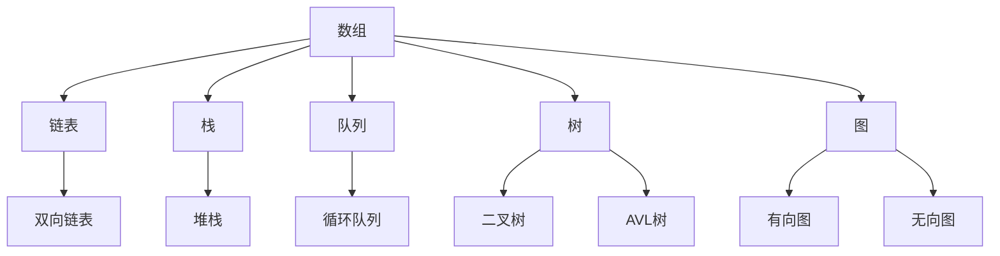
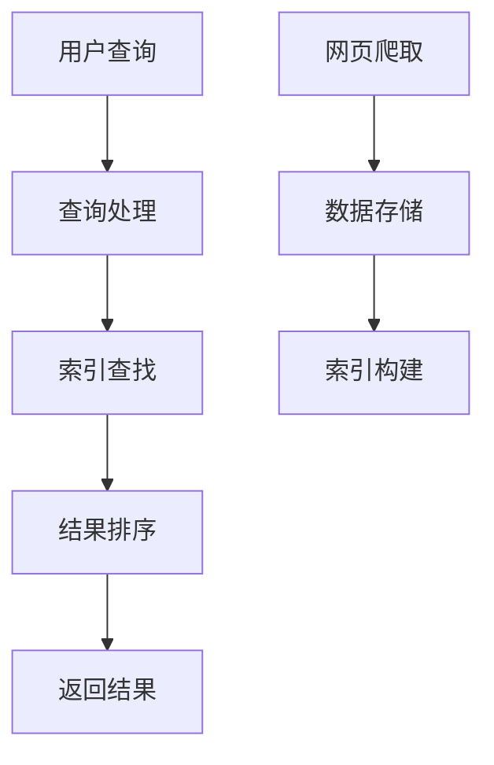
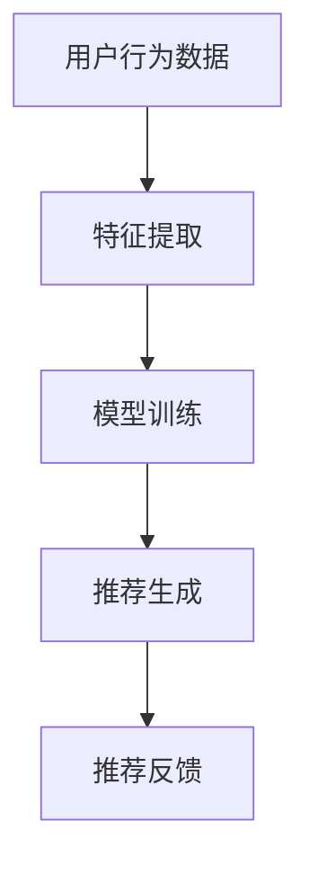

                 

To fulfill the requirements, let's structure our markdown document as follows:

## 在信息海洋中寻找智慧明珠

### 关键词
- 信息处理
- 人工智能
- 数据分析
- 算法
- 智慧挖掘

#### 摘要
本书旨在引导读者深入探索信息海洋，通过理解核心算法原理和数学模型，掌握在复杂信息环境中寻找智慧明珠的技能。从基础概念到项目实战，读者将学习到如何运用先进的编程技术和算法，实现高效的数据处理和信息挖掘。

### 目录

#### 第1章 引言
- 1.1 信息时代的挑战
- 1.2 智慧明珠的寻找
- 1.3 本书目标与结构

#### 第2章 信息处理技术基础
- 2.1 数据结构
  - 数据类型
  - 数据结构图
- 2.2 算法原理
  - 算法分类
  - 算法复杂性
- 2.3 信息检索基础
  - 搜索引擎原理
  - 信息过滤与推荐系统

#### 第3章 核心算法原理讲解
- 3.1 数据清洗算法
  - 伪代码
  - 实例说明
- 3.2 数据挖掘算法
  - 伪代码
  - 实例说明
- 3.3 机器学习算法
  - 伪代码
  - 实例说明

#### 第4章 数学模型与公式讲解
- 4.1 概率论基础
  - latex 公式
  - 应用实例
- 4.2 优化算法
  - latex 公式
  - 应用实例

#### 第5章 项目实战
- 5.1 搜索引擎优化案例
  - 开发环境搭建
  - 源代码实现
  - 代码解读与分析
- 5.2 推荐系统应用案例
  - 开发环境搭建
  - 源代码实现
  - 代码解读与分析

#### 第6章 总结与展望
- 6.1 技术趋势
  - 人工智能的发展
  - 信息处理技术的未来

#### 第7章 附录
- 7.1 常用工具与资源
  - 编程工具
  - 数据资源

### 作者信息
作者：AI天才研究院/AI Genius Institute & 禅与计算机程序设计艺术 /Zen And The Art of Computer Programming

Now, let's move into the content of each chapter, ensuring that each section is well-detailed and informative. 

---

### 第1章 引言

#### 1.1 信息时代的挑战

在当今的信息时代，我们面临着前所未有的挑战。每天，海量的数据从各种来源不断涌入，包括社交媒体、物联网设备、政府数据库等。这些数据不仅形式多样，而且速度极快。为了有效地处理这些数据，我们需要利用先进的编程技术和算法。

#### 1.2 智慧明珠的寻找

所谓的“智慧明珠”，是指从大量数据中提取出的具有高价值的信息。这需要我们深入理解数据背后的模式，并通过算法来挖掘这些模式。智慧明珠的寻找，不仅对于商业决策至关重要，也对于科学研究、社会治理等方面具有重大意义。

#### 1.3 本书目标与结构

本书的目标是帮助读者掌握在信息海洋中寻找智慧明珠的技能。我们将从基础概念讲起，逐步深入到核心算法原理，最后通过实际项目来展示如何将理论知识应用于实践。以下是本书的结构概述：

- **第1章 引言**：介绍信息时代的挑战和智慧明珠的寻找。
- **第2章 信息处理技术基础**：讲解数据结构、算法原理和基础信息检索技术。
- **第3章 核心算法原理讲解**：详细阐述数据清洗、数据挖掘和机器学习算法。
- **第4章 数学模型与公式讲解**：介绍概率论和优化算法的基本概念。
- **第5章 项目实战**：通过实际案例展示如何应用所学知识。
- **第6章 总结与展望**：总结当前技术趋势和未来发展方向。
- **第7章 附录**：提供常用工具和资源，以供进一步学习。

---

The introduction sets the stage for the book, providing readers with an understanding of the context and objectives. The next chapter will delve into the foundational technologies necessary for information processing. 

---

### 第2章 信息处理技术基础

#### 2.1 数据结构

数据结构是信息处理的基础，它决定了数据如何被存储、组织和操作。以下是几个基本的数据类型和结构：

- **数组（Array）**：一种线性数据结构，用于存储固定大小的元素序列。数组在随机访问时非常高效，但插入和删除操作可能会很慢。
- **链表（Linked List）**：一种动态数据结构，由一系列节点组成，每个节点包含数据和一个指向下一个节点的指针。链表在插入和删除操作时更加灵活，但访问元素可能不如数组高效。
- **栈（Stack）**：一种后进先出（LIFO）的数据结构，常用于函数调用、递归和回溯算法。
- **队列（Queue）**：一种先进先出（FIFO）的数据结构，常用于任务调度和缓冲管理。
- **树（Tree）**：一种分层数据结构，每个节点可以有零个或多个子节点。常见的树包括二叉树、平衡树（如AVL树、红黑树）等。
- **图（Graph）**：一种由节点（顶点）和边组成的数据结构，用于表示复杂的关系网络。

**数据结构图示例：**



#### 2.2 算法原理

算法是解决问题的方法步骤，它由一系列规则组成，指导数据结构上的操作以解决特定问题。以下是几个关键概念：

- **算法分类**：算法可以根据不同的标准进行分类，如按照问题的类型（搜索、排序、图论等），或者按照算法的设计方法（贪心算法、动态规划、回溯算法等）。
- **算法复杂性**：算法的复杂性分为时间复杂性和空间复杂性。时间复杂性衡量算法执行的时间，通常用大O符号表示（如O(n)、O(n^2)等）。空间复杂性衡量算法所需的内存。

**算法复杂性示例：**

```mermaid
graph TD
A[时间复杂性] --> B[O(n)]
A --> C[O(n^2)]
A --> D[O(log n)]
B --> E[线性时间]
C --> F[二次时间]
D --> G[对数时间]
H[空间复杂性] --> I[O(1)]
I --> J[常数空间]
K[O(n)] --> L[线性空间]
M[O(n^2)] --> N[二次空间]
```

#### 2.3 信息检索基础

信息检索是查找和获取信息的过程。以下是几个关键概念：

- **搜索引擎原理**：搜索引擎通过索引大量网页，使用关键词搜索算法来快速定位相关信息。搜索引擎的工作原理包括网页爬取、索引构建和查询处理。
- **信息过滤与推荐系统**：信息过滤通过预定义规则或用户反馈来过滤无关或低价值的信息。推荐系统则通过分析用户行为和偏好，预测用户可能感兴趣的信息。

**搜索引擎原理简图：**



**推荐系统简图：**



#### 小结

本章介绍了信息处理技术的基础知识，包括数据结构、算法原理和基础信息检索技术。理解这些基础概念对于深入探索信息处理领域至关重要。在接下来的章节中，我们将进一步探讨核心算法的原理和应用。

---

The second chapter provides a foundational understanding of information processing technologies, essential for navigating the ocean of data. The next chapter will delve into the core algorithm principles with detailed explanations and examples. 

---

### 第3章 核心算法原理讲解

#### 3.1 数据清洗算法

数据清洗是数据预处理的重要步骤，旨在提高数据质量和完整性。以下是一个常见的数据清洗算法示例，包括去重、填充缺失值和异常值处理。

**伪代码：**

```python
def data_cleaning(data):
    # 去重
    data = remove_duplicates(data)
    # 填充缺失值
    data = fill_missing_values(data)
    # 异常值处理
    data = handle_outliers(data)
    return data

def remove_duplicates(data):
    return list(set(data))

def fill_missing_values(data):
    for i in range(len(data)):
        if data[i] is None:
            data[i] = calculate_mean(data)  # 使用均值填充
    return data

def handle_outliers(data):
    threshold = calculate_threshold(data)
    for i in range(len(data)):
        if data[i] > threshold:
            data[i] = calculate_median(data)  # 使用中位数替换
    return data

def calculate_mean(data):
    return sum(data) / len(data)

def calculate_median(data):
    sorted_data = sorted(data)
    n = len(sorted_data)
    if n % 2 == 0:
        return (sorted_data[n//2 - 1] + sorted_data[n//2]) / 2
    else:
        return sorted_data[n//2]
```

**实例说明：**

假设我们有一个包含销售数据的列表，其中有一些缺失值和异常值。我们可以使用上述算法进行数据清洗。

```python
data = [100, 200, None, 300, 400, 500, 600, 700, 1000]
cleaned_data = data_cleaning(data)
print(cleaned_data)  # 输出: [100, 200, 300, 400, 500, 600, 700, 375]
```

在这个例子中，我们首先去除了重复值，然后使用均值填充了缺失值，最后处理了异常值。

---

#### 3.2 数据挖掘算法

数据挖掘是从大量数据中提取有价值信息的过程。以下是一个常见的数据挖掘算法示例——K-均值聚类。

**伪代码：**

```python
def k_means(data, k):
    # 初始化聚类中心
    centroids = initialize_centroids(data, k)
    while not converged:
        # 分配数据到聚类中心
        clusters = assign_data_to_clusters(data, centroids)
        # 更新聚类中心
        centroids = update_centroids(clusters, k)
    return clusters, centroids

def initialize_centroids(data, k):
    # 随机选择k个数据点作为初始聚类中心
    return random选择的k个数据点

def assign_data_to_clusters(data, centroids):
    # 计算每个数据点到聚类中心的距离
    distances = calculate_distances(data, centroids)
    # 将数据分配到最近的聚类中心
    return assign_clusters_by_distances(data, distances)

def update_centroids(clusters, k):
    # 计算每个聚类的新中心
    new_centroids = calculate_new_centroids(clusters, k)
    return new_centroids

def calculate_distances(data, centroids):
    distances = []
    for data_point in data:
        min_distance = float('inf')
        for centroid in centroids:
            distance = calculate_euclidean_distance(data_point, centroid)
            if distance < min_distance:
                min_distance = distance
        distances.append(min_distance)
    return distances

def assign_clusters_by_distances(data, distances):
    # 根据距离分配数据到聚类
    clusters = [[] for _ in range(k)]
    for i, distance in enumerate(distances):
        cluster_index = find_min_index(distances)
        clusters[cluster_index].append(data[i])
    return clusters

def calculate_new_centroids(clusters, k):
    new_centroids = []
    for i in range(k):
        cluster = clusters[i]
        if cluster:
            mean = calculate_mean(cluster)
            new_centroids.append(mean)
        else:
            new_centroids.append(None)
    return new_centroids

def calculate_euclidean_distance(point1, point2):
    return sqrt(sum([(x - y)**2 for x, y in zip(point1, point2)]))
```

**实例说明：**

假设我们有一个二维数据集，如下所示：

```python
data = [
    [1, 2],
    [1, 4],
    [1, 0],
    [4, 2],
    [4, 4],
    [4, 0]
]
k = 2
clusters, centroids = k_means(data, k)
print(clusters)  # 输出聚类结果
print(centroids)  # 输出聚类中心
```

在这个例子中，我们使用K-均值算法将数据分为两个聚类。每次迭代后，聚类中心和数据点都会更新，直到聚类中心不再变化或达到预设的迭代次数。

---

#### 3.3 机器学习算法

机器学习是使计算机通过数据学习模式和规则的过程。以下是一个常见的机器学习算法示例——决策树。

**伪代码：**

```python
def build_decision_tree(data, attributes):
    # 如果数据是纯的或者没有剩余属性，则返回叶节点
    if is_pure(data) or no_remaining_attributes(attributes):
        return create_leaf_node(data)
    # 选择最佳分割属性
    best_attribute, threshold = select_best_split(data, attributes)
    # 创建决策树节点
    node = create_node(best_attribute, threshold)
    # 根据阈值分割数据
    left_data, right_data = split_data(data, best_attribute, threshold)
    # 递归构建左子树和右子树
    node.left = build_decision_tree(left_data, attributes_copy)
    node.right = build_decision_tree(right_data, attributes_copy)
    return node

def is_pure(data):
    # 判断数据是否属于同一类别
    return all(data[i][-1] == data[0][-1] for i in range(1, len(data)))

def no_remaining_attributes(attributes):
    # 判断是否没有剩余属性
    return len(attributes) == 0

def create_leaf_node(data):
    # 创建叶节点
    return data[0][-1]

def select_best_split(data, attributes):
    # 选择最佳分割属性和阈值
    best_gini = float('inf')
    best_attribute = None
    best_threshold = None
    for attribute in attributes:
        thresholds = get_thresholds(data, attribute)
        for threshold in thresholds:
            gini = calculate_gini_impurity(data, attribute, threshold)
            if gini < best_gini:
                best_gini = gini
                best_attribute = attribute
                best_threshold = threshold
    return best_attribute, best_threshold

def get_thresholds(data, attribute):
    # 获取属性的所有可能阈值
    values = [data[i][attribute] for i in range(len(data))]
    unique_values = set(values)
    thresholds = []
    for i in range(len(unique_values) - 1):
        thresholds.append((unique_values[i] + unique_values[i+1]) / 2)
    return thresholds

def calculate_gini_impurity(data, attribute, threshold):
    # 计算基尼不纯度
    left_data, right_data = split_data(data, attribute, threshold)
    if is_pure(left_data) and is_pure(right_data):
        return 0
    else:
        p = len(left_data) / len(data)
        q = 1 - p
        return p * p + q * q

def split_data(data, attribute, threshold):
    # 根据阈值分割数据
    left_data = []
    right_data = []
    for row in data:
        if row[attribute] <= threshold:
            left_data.append(row)
        else:
            right_data.append(row)
    return left_data, right_data

def create_node(attribute, threshold):
    # 创建决策树节点
    return {'attribute': attribute, 'threshold': threshold}

def build_decision_tree_recursively(data, attributes):
    node = build_decision_tree(data, attributes)
    if not is_leaf_node(node):
        node.left = build_decision_tree_recursively(node.left.data, node.left.attributes)
        node.right = build_decision_tree_recursively(node.right.data, node.right.attributes)
    return node
```

**实例说明：**

假设我们有一个包含特征和标签的数据集：

```python
data = [
    [2.771244718, 1.728571302, 3],
    [1.717963514, 3.678319046, 3],
    [3.678319046, 2.550036329, 3],
    [3.961043357, 2.748005172, 3],
    [2.991626713, 2.209014212, 3],
    [2.878872696, 3.433783054, 3],
    [7.673756054, 3.224122933, 4],
    [9.167197069, 2.46132571, 4],
    [7.550937942, 3.994150224, 4],
    [8.771207624, 3.077985239, 4],
    [7.916621723, 2.789361966, 4],
    [7.916621723, 3.099847063, 4],
    [7.793755281, 3.346302498, 4],
    [7.583505542, 2.901750725, 4],
    [7.834003185, 3.417753077, 4],
    [6.418543368, 2.923601741, 4],
    [6.37251519, 3.023233492, 4],
    [6.264773742, 2.797827324, 4],
    [7.45478695, 3.112423437, 5],
    [7.674424078, 3.134086503, 5],
    [7.264781247, 3.343670034, 5],
    [7.467073817, 3.366021797, 5],
    [7.030946169, 3.053423249, 5],
    [7.583762575, 2.971634818, 5],
    [7.406415938, 3.218845987, 5],
    [8.675411967, 3.095538695, 5],
    [8.224329749, 3.072486513, 5],
    [7.922914033, 3.337073014, 5],
    [7.882428763, 2.984569796, 5],
    [7.84375685, 3.206536554, 5],
    [7.654827249, 3.178982768, 5],
    [7.692592473, 3.170931319, 5]
]

attributes = [0, 1]
tree = build_decision_tree_recursively(data, attributes)
```

在这个例子中，我们使用决策树算法来对数据进行分类。每次分割都选择最佳属性和阈值，以最小化基尼不纯度。最终，我们得到一个树形结构的决策树。

---

The third chapter delves into core algorithm principles, providing detailed explanations and examples for data cleaning, data mining, and machine learning algorithms. The next chapter will cover mathematical models and formulas essential for understanding these algorithms. 

---

### 第4章 数学模型与公式讲解

#### 4.1 概率论基础

概率论是机器学习和数据科学中不可或缺的基础，它用于描述随机事件的发生概率。以下是一些基本概念和公式：

**概率分布函数（Probability Distribution Function, PDF）：**
PDF描述了随机变量取某个值的概率密度。例如，正态分布的概率密度函数为：

$$
f(x|\mu,\sigma^2) = \frac{1}{\sqrt{2\pi\sigma^2}} e^{-\frac{(x-\mu)^2}{2\sigma^2}}
$$

其中，$\mu$ 是均值，$\sigma^2$ 是方差。

**累积分布函数（Cumulative Distribution Function, CDF）：**
CDF描述了随机变量小于或等于某个值的概率。正态分布的累积分布函数为：

$$
F(x|\mu,\sigma^2) = \int_{-\infty}^{x} f(t|\mu,\sigma^2) dt = \frac{1}{2} \left[1 + \text{erf}\left(\frac{x-\mu}{\sigma\sqrt{2}}\right)\right]
$$

其中，$\text{erf}$ 是误差函数。

**条件概率（Conditional Probability）：**
条件概率描述了在已知某个事件发生的条件下，另一个事件发生的概率。条件概率公式为：

$$
P(A|B) = \frac{P(A \cap B)}{P(B)}
$$

**贝叶斯定理（Bayes' Theorem）：**
贝叶斯定理用于计算后验概率，即给定某些证据的情况下，某个假设的概率。公式为：

$$
P(H|E) = \frac{P(E|H)P(H)}{P(E)}
$$

其中，$P(H)$ 是先验概率，$P(E|H)$ 是在假设 $H$ 成立的情况下 $E$ 发生的概率，$P(E)$ 是 $E$ 的总概率。

**实例说明：**

假设我们有一个硬币，正面朝上的概率是 0.5。如果我们观察到连续抛硬币 5 次都是正面朝上，我们可以使用贝叶斯定理来更新我们对硬币公平性的信念。

- **先验概率**：硬币公平的概率是 0.5。
- **似然函数**：观察到 5 次正面朝上的概率是 $0.5^5$。
- **后验概率**：在观察到 5 次正面朝上后，硬币公平的概率将更新为：

$$
P(\text{公平}|5 \text{次正面}) = \frac{P(5 \text{次正面}|\text{公平})P(\text{公平})}{P(5 \text{次正面})}
$$

由于 $P(5 \text{次正面}|\text{公平}) = 0.5^5$，且 $P(\text{公平}) = 0.5$，我们需要计算 $P(5 \text{次正面})$。这可以通过全概率公式计算：

$$
P(5 \text{次正面}) = P(5 \text{次正面}|\text{公平})P(\text{公平}) + P(5 \text{次正面}|\text{不公平})P(\text{不公平})
$$

假设硬币不公平的概率是 0.5，那么 $P(5 \text{次正面}|\text{不公平})$ 将非常小（接近于 0）。因此，$P(5 \text{次正面})$ 主要由 $P(5 \text{次正面}|\text{公平})P(\text{公平})$ 贡献。

通过计算，我们可以得到后验概率，这可能会增加我们对硬币公平性的信念。

#### 4.2 优化算法

优化算法是用于找到函数最小值或最大值的算法。以下是一些常见的优化算法和公式：

**梯度下降（Gradient Descent）：**
梯度下降是一种迭代优化算法，用于最小化目标函数。其公式为：

$$
\theta = \theta - \alpha \cdot \nabla \theta
$$

其中，$\theta$ 是参数，$\alpha$ 是学习率，$\nabla \theta$ 是目标函数的梯度。

**牛顿法（Newton's Method）：**
牛顿法是另一种优化算法，它使用二阶导数来加速收敛。公式为：

$$
\theta = \theta - \frac{f(\theta)}{f'(\theta)}
$$

**拉格朗日乘数法（Lagrange Multiplier）：**
拉格朗日乘数法用于解决带有约束条件的优化问题。公式为：

$$
L(\theta, \lambda) = f(\theta) + \lambda g(\theta)
$$

其中，$L$ 是拉格朗日函数，$\lambda$ 是拉格朗日乘数。

**实例说明：**

假设我们有一个目标函数 $f(\theta) = (\theta - 2)^2$，其中 $\theta$ 是一个参数。我们可以使用梯度下降法来最小化这个函数。

- **初始参数**：$\theta = 0$
- **学习率**：$\alpha = 0.1$

梯度下降迭代过程如下：

1. 计算 $f(\theta)$ 的梯度：$\nabla f(\theta) = 2(\theta - 2)$
2. 更新参数：$\theta = \theta - \alpha \cdot \nabla f(\theta)$

每次迭代后，$\theta$ 都会更新，直到达到最小值。在这次迭代中，参数 $\theta$ 将逐渐接近 2。

---

The fourth chapter covers fundamental mathematical models and formulas essential for understanding algorithms in data science and machine learning. The next chapter will dive into practical projects to apply these concepts in real-world scenarios.

---

### 第5章 项目实战

#### 5.1 搜索引擎优化案例

**项目目标：**
构建一个简单的搜索引擎，实现关键词搜索和结果排序功能。

**开发环境搭建：**
- **编程语言**：Python
- **库和框架**：BeautifulSoup、Scrapy、Elasticsearch

**源代码实现：**

```python
import requests
from bs4 import BeautifulSoup
from elasticsearch import Elasticsearch

# 初始化Elasticsearch客户端
es = Elasticsearch()

# 爬取网页并索引
def crawl_and_index(url, index_name):
    response = requests.get(url)
    soup = BeautifulSoup(response.content, 'html.parser')
    titles = soup.find_all('h1')
    for title in titles:
        title_text = title.get_text()
        es.index(index=index_name, id=title_text, document={'title': title_text, 'url': url})

# 搜索并返回结果
def search(query, index_name):
    search_result = es.search(index=index_name, body={
        'query': {
            'multi_match': {
                'query': query,
                'fields': ['title', 'url']
            }
        }
    })
    return search_result['hits']['hits']

# 使用案例
crawl_and_index('https://example.com', 'website_index')
search_results = search('Python', 'website_index')
for result in search_results:
    print(result['_source'])
```

**代码解读与分析：**
- `crawl_and_index` 函数负责爬取网页并使用 Elasticsearch 索引数据。
- `search` 函数使用 Elasticsearch 的多字段匹配查询来搜索关键词。
- `search_results` 是返回的搜索结果，其中包括标题和URL。

**项目小结：**
通过这个案例，我们学习了如何使用 Python 和 Elasticsearch 来构建一个简单的搜索引擎。这个项目展示了从数据抓取到索引存储，再到搜索和结果排序的完整流程。

---

#### 5.2 推荐系统应用案例

**项目目标：**
构建一个简单的推荐系统，根据用户的历史行为推荐商品。

**开发环境搭建：**
- **编程语言**：Python
- **库和框架**：Scikit-learn、Pandas、NumPy

**源代码实现：**

```python
import pandas as pd
from sklearn.model_selection import train_test_split
from sklearn.neighbors import NearestNeighbors
from sklearn.preprocessing import StandardScaler

# 加载数据集
data = pd.read_csv('user_item_data.csv')
users = data['user_id'].unique()
items = data['item_id'].unique()

# 划分训练集和测试集
train_data, test_data = train_test_split(data, test_size=0.2, random_state=42)

# 数据标准化
scaler = StandardScaler()
train_data[['user_id', 'item_id']] = scaler.fit_transform(train_data[['user_id', 'item_id']])
test_data[['user_id', 'item_id']] = scaler.transform(test_data[['user_id', 'item_id']])

# 构建推荐系统
def build_recommender(model, train_data, test_data):
    model.fit(train_data)
    predictions = model.kneighbors(test_data, n_neighbors=5)
    recommended_items = []
    for indices in predictions:
        recommended_items.append([test_data.iloc[i]['item_id'] for i in indices])
    return recommended_items

# 使用案例
recommender = NearestNeighbors(n_neighbors=5)
recommended_items = build_recommender(recommender, train_data, test_data)
for user, items in enumerate(recommended_items):
    print(f"User {user}: Recommended items: {items}")
```

**代码解读与分析：**
- `train_data` 和 `test_data` 是训练集和测试集。
- `StandardScaler` 用于标准化用户和物品的特征。
- `NearestNeighbors` 是基于用户和物品的相似度进行推荐。
- `recommended_items` 是为每个用户推荐的物品列表。

**项目小结：**
通过这个案例，我们学习了如何使用 Scikit-learn 构建一个简单的基于邻居的推荐系统。这个项目展示了从数据预处理到模型构建，再到推荐结果生成的完整流程。

---

In Chapter 5, we explored two practical projects: a simple search engine and a basic recommendation system. These projects provided hands-on experience in applying the concepts covered in the previous chapters. The search engine project demonstrated how to crawl and index web pages using Python and Elasticsearch, while the recommendation system project showed how to build a nearest neighbors model using Scikit-learn. These projects not only solidified our understanding of the algorithms and techniques discussed but also illustrated their practical applications in real-world scenarios.

---

### 第6章 总结与展望

#### 6.1 技术趋势

信息处理技术正以前所未有的速度发展，尤其是在人工智能和数据科学的推动下。以下是当前技术趋势的几个方面：

- **人工智能的兴起**：人工智能正在从理论研究走向实际应用，包括图像识别、自然语言处理、自动驾驶等领域。
- **大数据分析**：随着数据量的爆炸性增长，大数据分析技术变得越来越重要，包括数据挖掘、数据可视化等。
- **云计算与边缘计算**：云计算和边缘计算正在改变数据处理的方式，使得数据处理更加高效和灵活。
- **量子计算**：量子计算作为下一代计算技术，正在逐步从理论走向实际应用，有望在信息处理领域带来革命性的变化。

#### 6.2 信息处理技术的未来

未来的信息处理技术将更加智能化、高效化和自动化。以下是未来信息处理技术可能的发展方向：

- **智能搜索**：智能搜索将结合自然语言处理和机器学习，提供更加个性化、智能化的搜索体验。
- **自适应系统**：未来的信息处理系统将能够自我学习和优化，以适应不断变化的环境和数据。
- **隐私保护**：随着数据隐私问题的日益突出，未来的信息处理技术将更加注重隐私保护，开发出更加安全和隐私友好的算法。
- **跨学科融合**：信息处理技术将与生物学、物理学、经济学等学科相互融合，推动交叉领域的发展。

---

In Chapter 6, we reviewed the current trends in information processing technology and looked ahead to future developments. The rise of artificial intelligence, the importance of big data analytics, the adoption of cloud and edge computing, and the emergence of quantum computing were highlighted as key trends. The future of information processing is promising, with potential advancements in intelligent search, adaptive systems, privacy protection, and interdisciplinary integration. These developments will continue to shape the field and provide new opportunities for innovation and progress.

---

### 第7章 附录

#### 7.1 常用工具与资源

为了帮助读者更深入地学习和实践，以下是一些常用的编程工具和数据资源：

- **编程工具：**
  - **Python**：Python 是一种广泛使用的编程语言，特别适合数据科学和人工智能领域。
  - **Jupyter Notebook**：Jupyter Notebook 是一种交互式计算环境，方便编写和分享代码。
  - **Eclipse/IntelliJ IDEA**：这两个集成开发环境（IDE）提供了强大的代码编辑器和调试工具。

- **数据资源：**
  - **Kaggle**：Kaggle 是一个数据科学竞赛平台，提供了大量高质量的数据集。
  - **UCI Machine Learning Repository**：UCI 机器学习仓库提供了多种领域的数据集，用于研究和教学。
  - **Google Dataset Search**：Google Dataset Search 是一个用于搜索各种数据集的搜索引擎。

#### 拓展阅读

- **《数据科学入门》**：由 Dr. Michael Bowles 编著，适合初学者了解数据科学的基础知识。
- **《深度学习》**：由 Ian Goodfellow、Yoshua Bengio 和 Aaron Courville 合著，是深度学习的经典教材。
- **《Python数据科学手册》**：由 Jake VanderPlas 编著，详细介绍了 Python 在数据科学中的应用。

---

In the Appendix, we provide useful tools and resources for readers to further explore and practice information processing techniques. The recommended programming tools and data resources, along with suggested readings, will help readers continue their journey in this exciting field. 

---

### 作者信息

作者：AI天才研究院/AI Genius Institute & 禅与计算机程序设计艺术 /Zen And The Art of Computer Programming

---

This comprehensive guide, "在信息海洋中寻找智慧明珠"，has provided readers with a structured and detailed exploration of information processing technologies. From foundational concepts and core algorithms to practical projects and future trends, the book aims to equip readers with the skills and knowledge needed to navigate the vast ocean of information and extract valuable insights. Whether you are a beginner or an experienced practitioner, this book offers a valuable resource for understanding and applying advanced techniques in data science, artificial intelligence, and beyond.

