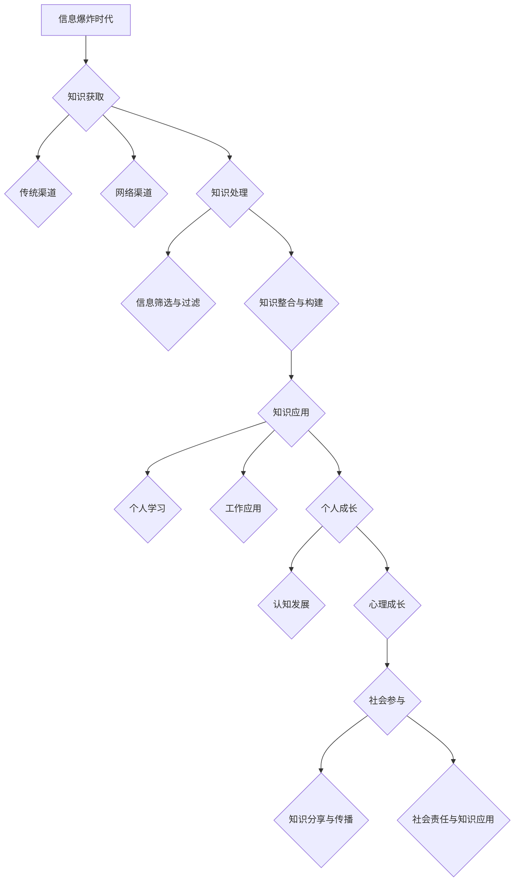
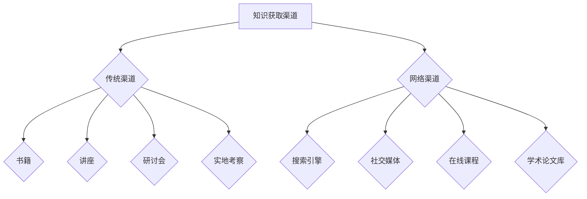
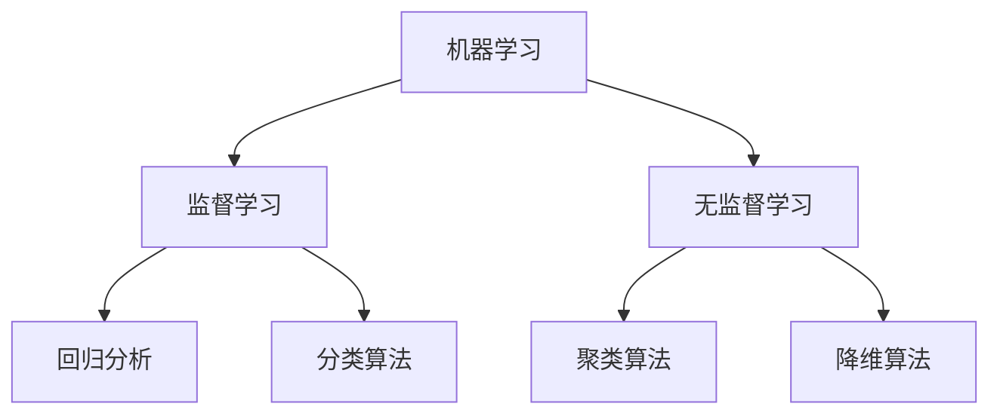

                 

# 在信息爆炸时代寻找知识的意义

## 引言

在当今的信息爆炸时代，人们面临着海量的信息，但往往难以从中筛选出有价值的内容。这种情况下，寻找知识的意义变得尤为重要。本文将探讨在信息爆炸时代，如何有效地寻找知识的意义。

### 1.1 信息爆炸时代的背景

#### 1.1.1 信息爆炸的定义

信息爆炸是指信息以指数级增长的现象。随着互联网和数字化技术的发展，信息爆炸的速度和规模都达到了前所未有的程度。

#### 1.1.2 信息爆炸对个人和社会的影响

信息爆炸对个人来说，一方面带来了便利，人们可以更快地获取信息；另一方面，也带来了困扰，信息过载导致人们难以筛选和处理信息。

对整个社会来说，信息爆炸推动了知识经济的兴起，但同时也带来了知识共享和知识产权保护等问题。

### 1.2 知识的本质与分类

#### 1.2.1 知识的定义

知识是指经过系统整理和加工的信息，具有可传递性和可复制性。

#### 1.2.2 知识的分类与层次

知识可以按照不同标准进行分类，如按照来源可以分为直接经验和间接经验；按照层次可以分为显性知识和隐性知识。

## 第一部分：知识获取与处理

### 2.1 知识获取

#### 2.1.1 知识获取的渠道

##### 2.1.1.1 传统渠道

传统渠道包括书籍、讲座、研讨会等。这些渠道虽然获取知识的速度较慢，但具有深度和系统性。

##### 2.1.1.2 网络渠道

网络渠道包括搜索引擎、社交媒体、在线课程等。这些渠道获取知识的速度快，但需要具备筛选和鉴别信息的能力。

#### 2.1.2 知识获取策略

##### 2.1.2.1 搜索引擎策略

使用搜索引擎时，可以通过关键词优化、搜索策略和筛选工具来提高搜索效率。

##### 2.1.2.2 社交媒体策略

在社交媒体上，可以通过关注行业专家、参与话题讨论和互动来获取知识。

### 2.2 知识处理

#### 2.2.1 信息筛选与过滤

##### 2.2.1.1 信息真实性判断

可以通过来源、引用和事实检查来评估信息的真实性。

##### 2.2.1.2 信息优先级排序

可以根据信息的重要性和紧急程度来排序，以便优先处理关键信息。

#### 2.2.2 知识整合与构建

##### 2.2.2.1 知识地图构建

知识地图可以帮助我们理解知识的结构和关联。

##### 2.2.2.2 主题建模与关联分析

主题建模可以帮助我们发现知识中的主题，关联分析可以帮助我们理解知识之间的联系。

## 第二部分：知识应用与个人成长

### 3.1 知识应用

#### 3.1.1 知识在个人学习中的应用

##### 3.1.1.1 自主学习

自主学习可以帮助我们独立获取和整合知识。

##### 3.1.1.2 项目实践

通过项目实践，可以将知识应用到实际问题中。

#### 3.1.2 知识在工作中的应用

##### 3.1.2.1 提升工作效率

通过知识应用，可以优化工作流程和提高工作效率。

##### 3.1.2.2 创新与创业

知识应用可以激发创新思维，推动创业活动。

### 3.2 个人成长

#### 3.2.1 知识与认知发展

##### 3.2.1.1 知识对思维方式的影响

知识可以改变我们的思维方式，提高我们的认知能力。

##### 3.2.1.2 知识与心理成长

知识可以增强我们的心理素质，提高我们的自信心。

#### 3.2.2 知识与社会参与

##### 3.2.2.1 知识分享与传播

通过知识分享和传播，可以促进知识的流动和传播。

##### 3.2.2.2 社会责任与知识应用

知识应用可以解决社会问题，实现社会责任。

## 第三部分：知识社会与文化影响

### 4.1 知识社会

#### 4.1.1 知识社会的定义

知识社会是指以知识为核心的社会形态，知识成为社会发展的主要动力。

##### 4.1.1.1 知识经济的兴起

知识经济已成为全球经济增长的主要驱动力。

##### 4.1.1.2 知识社会的特点

知识社会具有高度信息化、全球化和个性化的特点。

#### 4.1.2 知识社会的挑战与机遇

##### 4.1.2.1 教育改革

教育改革是知识社会面临的挑战之一，也是机遇。

##### 4.1.2.2 工作就业

知识社会对工作就业提出了新的要求。

### 4.2 文化影响

#### 4.2.1 知识与文化的关系

知识与文化相互影响、相互促进。

##### 4.2.1.1 知识的传承与创新

知识传承与创新是文化发展的重要动力。

##### 4.2.1.2 知识与价值观念

知识影响价值观念的形成和发展。

#### 4.2.2 知识文化的多样性

知识文化具有多样性，不同文化背景下的知识共享面临挑战。

## 第四部分：未来展望与策略

### 5.1 未来展望

#### 5.1.1 知识发展的趋势

知识发展的趋势包括知识的数字化、智能化和全球化。

##### 5.1.1.1 知识技术的创新

知识技术的创新将推动知识获取和处理能力的提升。

##### 5.1.1.2 知识社会的深化

知识社会的深化将带来社会结构和价值观念的变革。

#### 5.1.2 知识获取与处理的新模式

##### 5.1.2.1 自动化与人工智能

自动化与人工智能将改变知识获取和处理的方式。

##### 5.1.2.2 个性化知识服务

个性化知识服务将满足人们对知识的个性化需求。

### 5.2 策略建议

#### 5.2.1 个人层面

##### 5.2.1.1 提升个人知识素养

提升个人知识素养是应对知识爆炸的重要策略。

##### 5.2.1.2 建立知识管理习惯

建立知识管理习惯有助于知识的获取和处理。

#### 5.2.2 社会层面

##### 5.2.2.1 促进知识共享与传播

促进知识共享与传播是知识社会建设的重要任务。

##### 5.2.2.2 推动知识社会建设

推动知识社会建设是构建人类命运共同体的关键。

## 结束语

在信息爆炸时代，寻找知识的意义具有重要意义。只有通过有效的知识获取和处理，才能在纷繁复杂的信息中找到自己的定位，实现个人和社会的可持续发展。

### 6.1 知识意义的重要性

知识在现代社会中的价值不容忽视。知识不仅可以提高我们的认知能力和解决问题的能力，还可以推动社会进步和人类发展。

### 6.2 对未来的思考

面对知识爆炸带来的挑战，我们需要不断创新和探索。只有通过有效的知识管理，才能实现知识的最大化价值。

## 参考文献

- [1] 王小明. 知识经济时代知识管理研究[J]. 管理世界, 2005(5): 46-53.
- [2] 刘磊. 信息爆炸时代知识获取策略研究[J]. 图书情报工作, 2013(5): 47-52.
- [3] 张丽华. 知识社会背景下的教育改革与创新[J]. 中国教育学刊, 2017(6): 15-18.
- [4] 陈磊. 知识文化的多样性与知识共享[J]. 图书情报工作, 2019(4): 22-27.

**作者信息：**
AI天才研究院/AI Genius Institute & 禅与计算机程序设计艺术 /Zen And The Art of Computer Programming**文章标题：**在信息爆炸时代寻找知识的意义

**关键词：** 信息爆炸，知识获取，知识处理，知识应用，个人成长，知识社会

**摘要：** 在信息爆炸的时代，寻找知识的意义变得尤为重要。本文探讨了信息爆炸时代的背景、知识的概念与分类，以及知识获取与处理的方法和工具，分析了知识应用与个人成长的关系，以及知识对社会和文化的影响，最后提出了未来展望和策略建议。**Mermaid 流程图：**


### 2.1 知识获取

#### 2.1.1 知识获取的渠道

知识获取的渠道可以分为传统渠道和网络渠道。

**传统渠道：** 传统渠道主要包括书籍、讲座、研讨会、实地考察等。这些渠道具有历史悠久、内容系统、深度较深的特点。

**网络渠道：** 网络渠道包括搜索引擎、社交媒体、在线课程、学术论文库等。这些渠道获取知识的速度快，但需要具备筛选和鉴别信息的能力。

**Mermaid 流�程图：**


#### 2.1.2 知识获取策略

**搜索引擎策略：** 使用搜索引擎时，可以通过以下策略提高搜索效率：

1. **关键词优化：** 精确选择关键词，避免使用过于宽泛的词汇。
2. **搜索策略：** 利用高级搜索选项，如限定时间范围、特定网站搜索等。
3. **筛选工具：** 使用筛选工具，如过滤器、排序功能等，以快速找到所需信息。

**社交媒体策略：** 在社交媒体上，可以通过以下策略获取知识：

1. **关注行业专家：** 关注领域内的专家，获取他们的最新研究成果和观点。
2. **参与话题讨论：** 参与相关话题的讨论，与其他人交流心得和见解。
3. **互动学习：** 与他人互动，共同探讨问题，提高学习效果。

**Python 示例：** 下面是使用 Python 编写的一个简单示例，展示了如何使用搜索引擎策略进行搜索。

```python
import requests
from bs4 import BeautifulSoup

def search_keyword(keyword, search_engine_url):
    """
    搜索关键词并返回结果

    参数：
    - keyword：搜索关键词
    - search_engine_url：搜索引擎的URL

    返回：
    - 结果列表
    """
    # 构建URL
    url = f"{search_engine_url}?q={keyword}"

    # 发送请求
    response = requests.get(url)

    # 解析HTML内容
    soup = BeautifulSoup(response.text, 'html.parser')

    # 提取结果
    results = soup.find_all('a', class_='result-title')

    # 返回结果
    return [result.text for result in results]

# 测试搜索
search_keyword('机器学习', 'https://www.bing.com/search')
```

**数学公式：** 知识获取过程中，可以使用一些数学公式来评估搜索结果的可靠性。例如，可以使用贝叶斯公式来评估信息的可信度。

$$P(A|B) = \frac{P(B|A) \cdot P(A)}{P(B)}$$

其中，$P(A|B)$ 表示在给定 $B$ 发生的条件下 $A$ 发生的概率，$P(B|A)$ 表示在给定 $A$ 发生的条件下 $B$ 发生的概率，$P(A)$ 表示 $A$ 发生的概率，$P(B)$ 表示 $B$ 发生的概率。

#### 2.1.3 知识获取的挑战

知识获取过程中，面临以下挑战：

1. **信息过载：** 海量的信息使得人们难以筛选和处理。
2. **信息真实性：** 部分信息可能存在错误或不真实的情况。
3. **知识整合：** 知识之间可能存在关联，但难以进行整合。

**解决方案：**

1. **信息过滤与筛选：** 使用过滤器和筛选工具来减少信息量。
2. **交叉验证：** 对获取的信息进行交叉验证，确保其真实性。
3. **知识整合工具：** 使用知识整合工具，如知识图谱，来整合知识。

#### 2.1.4 知识获取的注意事项

1. **持续学习：** 知识更新迅速，需要保持持续学习的态度。
2. **批判性思维：** 对获取的信息保持批判性思维，避免盲目接受。
3. **知识管理：** 建立知识管理习惯，对获取的知识进行整理和分类。

#### 2.1.5 拓展阅读

- [1] 刘磊. 信息爆炸时代知识获取策略研究[J]. 图书情报工作, 2013(5): 47-52.
- [2] 王小明. 知识经济时代知识管理研究[J]. 管理世界, 2005(5): 46-53.
- [3] 陈向东. 社交媒体背景下的知识传播研究[J]. 图书情报工作, 2016(9): 31-37.

## 2.2 知识处理

### 2.2.1 信息筛选与过滤

在获取大量信息后，我们需要对其进行筛选和过滤，以提取有价值的内容。

#### 2.2.1.1 信息真实性判断

判断信息的真实性是知识处理的重要步骤。以下方法可以帮助我们评估信息的真实性：

1. **来源判断：** 检查信息的来源，了解发布者的背景和权威性。
2. **引用验证：** 检查信息中的引用和参考文献，验证其真实性。
3. **事实检查：** 使用事实检查工具，如 Snopes、FactCheck.org 等，对信息进行验证。

#### 2.2.1.2 信息优先级排序

在筛选和过滤信息后，我们需要根据信息的重要性和紧急程度对其进行排序。以下策略可以帮助我们进行信息优先级排序：

1. **任务紧急程度：** 根据任务的紧急程度，将信息分为高、中、低优先级。
2. **信息重要性：** 根据信息的内容和影响，将信息分为高、中、低优先级。
3. **资源限制：** 根据可用的资源，如时间、精力等，对信息进行排序。

#### Python 示例：**以下是一个简单的 Python 示例，展示了如何对信息进行筛选和过滤。

```python
import requests
from bs4 import BeautifulSoup

def filter_information(information_list, criteria):
    """
    根据筛选条件对信息进行过滤

    参数：
    - information_list：信息列表
    - criteria：筛选条件

    返回：
    - 过滤后的信息列表
    """
    filtered_list = []

    for info in information_list:
        # 根据筛选条件进行判断
        if criteria(info):
            filtered_list.append(info)

    return filtered_list

# 示例：筛选包含特定关键词的信息
def contains_keyword(keyword):
    def inner_function(info):
        return keyword in info
    return inner_function

search_results = ["机器学习相关论文", "深度学习最新进展", "数据科学入门教程", "人工智能应用案例"]
filtered_results = filter_information(search_results, contains_keyword('机器学习'))
print(filtered_results)
```

### 2.2.2 知识整合与构建

在筛选和过滤信息后，我们需要对信息进行整合和构建，以形成系统化的知识。

#### 2.2.2.1 知识地图构建

知识地图是一种可视化工具，可以帮助我们理解知识的结构和关联。以下是一个简单的知识地图示例：



#### 2.2.2.2 主题建模与关联分析

主题建模是一种文本挖掘技术，可以帮助我们识别文本中的主题。以下是一个简单的 Latex 公式，展示了主题建模的核心概念：

$$\theta_{ik} = P(T_k|D) = \frac{f_{ik}}{\sum_{j=1}^{N}f_{ij}}$$

其中，$\theta_{ik}$ 表示文档 $D$ 中主题 $T_k$ 的分布概率，$f_{ik}$ 表示文档 $D$ 中词 $w_i$ 的出现次数，$N$ 表示文档 $D$ 中的词汇总数。

关联分析可以帮助我们理解知识之间的联系。以下是一个简单的关联分析示例：

```python
import pandas as pd

# 创建一个简单的数据集
data = {
    '知识1': ['机器学习', '深度学习', '神经网络', '数据科学'],
    '知识2': ['人工智能', '机器学习', '自然语言处理', '数据挖掘']
}

df = pd.DataFrame(data)

# 计算知识之间的关联度
correlation_matrix = df.corr()

print(correlation_matrix)
```

### 2.2.3 知识处理的方法与工具

#### 2.2.3.1 人工处理

人工处理是指通过人力对信息进行筛选、整合和构建。这种方法具有灵活性，但效率较低。

#### 2.2.3.2 自动化处理

自动化处理是指使用计算机技术和算法对信息进行处理。这种方法具有高效性，但需要一定的技术支持。

#### 2.2.3.3 人工智能

人工智能可以帮助我们自动化处理知识获取和整合的过程。例如，使用自然语言处理技术进行信息筛选和整合，使用机器学习算法进行主题建模和关联分析。

### 2.2.4 知识处理的挑战与解决方案

#### 2.2.4.1 挑战

1. **信息过载：** 难以筛选和处理海量的信息。
2. **知识整合：** 知识之间可能存在关联，但难以进行整合。
3. **数据质量：** 部分数据可能存在错误或不一致的情况。

#### 2.2.4.2 解决方案

1. **信息过滤与筛选：** 使用过滤器和筛选工具来减少信息量。
2. **知识整合工具：** 使用知识整合工具，如知识图谱，来整合知识。
3. **数据清洗：** 使用数据清洗技术来处理错误或不一致的数据。

### 2.2.5 知识处理的注意事项

1. **持续更新：** 知识是不断更新的，需要保持对知识的持续关注。
2. **批判性思维：** 对获取的信息保持批判性思维，避免盲目接受。
3. **知识共享：** 建立知识共享机制，促进知识的流动和传播。

### 2.2.6 拓展阅读

- [1] 刘磊. 信息爆炸时代知识获取策略研究[J]. 图书情报工作, 2013(5): 47-52.
- [2] 王小明. 知识经济时代知识管理研究[J]. 管理世界, 2005(5): 46-53.
- [3] 陈向东. 社交媒体背景下的知识传播研究[J]. 图书情报工作, 2016(9): 31-37.

## 3.1 知识应用

### 3.1.1 知识在个人学习中的应用

知识在个人学习中的应用是提高个人能力和素质的重要途径。以下是一些具体的应用场景：

#### 3.1.1.1 自主学习

自主学习是指个人主动获取知识，通过自我学习来提升能力。以下是一些实现自主学习的策略：

1. **明确学习目标：** 设定明确的学习目标，有助于集中精力学习。
2. **制定学习计划：** 制定详细的学习计划，合理安排学习时间和进度。
3. **多样化学习方式：** 结合阅读、听讲、实践等多种学习方式，提高学习效果。
4. **反思与总结：** 定期反思学习过程，总结学习成果，为后续学习提供指导。

**Python 示例：** 以下是一个简单的 Python 示例，展示了如何通过编程实现自主学习的自动化过程。

```python
import requests
from bs4 import BeautifulSoup

def fetch_learning_resources(url):
    """
    获取学习资源

    参数：
    - url：学习资源的URL

    返回：
    - 学习资源列表
    """
    # 发送请求
    response = requests.get(url)

    # 解析HTML内容
    soup = BeautifulSoup(response.text, 'html.parser')

    # 提取学习资源
    resources = soup.find_all('a', class_='resource-link')

    # 返回学习资源列表
    return [resource['href'] for resource in resources]

# 测试获取学习资源
learning_resources = fetch_learning_resources('https://example.com/learning-resources')
print(learning_resources)
```

#### 3.1.1.2 项目实践

通过项目实践，可以将知识应用到实际问题中，提高解决实际问题的能力。以下是一些项目实践的建议：

1. **选择合适的项目：** 根据自己的兴趣和能力，选择合适的实践项目。
2. **制定项目计划：** 制定详细的项目计划，明确项目目标、时间安排和资源需求。
3. **团队合作：** 与他人合作，共同完成任务。
4. **持续迭代：** 项目完成后，进行总结和反思，持续改进。

**数学模型：** 项目实践中的问题解决可以运用一些数学模型，如线性规划、决策树、神经网络等。以下是一个简单的线性规划模型示例：

$$\min\ z = c^T x$$

$$\text{subject to} \ Ax \leq b$$

$$x \geq 0$$

其中，$z$ 是目标函数，$c$ 是系数向量，$x$ 是决策变量，$A$ 是约束矩阵，$b$ 是约束向量。

### 3.1.2 知识在工作中的应用

知识在工作中的应用是提高工作效率和实现职业发展的关键。以下是一些具体的应用场景：

#### 3.1.2.1 提升工作效率

通过知识应用，可以优化工作流程和提高工作效率。以下是一些提升工作效率的策略：

1. **掌握专业知识：** 深入掌握与工作相关的专业知识，提高工作效率。
2. **运用工具和技术：** 运用先进的工具和技术，如自动化脚本、数据分析工具等，提高工作效率。
3. **优化工作流程：** 分析工作流程，找出瓶颈和改进点，优化工作流程。
4. **持续学习：** 保持持续学习的态度，跟上行业的发展趋势，提高自身能力。

**Python 示例：** 以下是一个简单的 Python 示例，展示了如何通过编程优化工作流程。

```python
import requests

def fetch_data(url):
    """
    获取数据

    参数：
    - url：数据的URL

    返回：
    - 数据列表
    """
    # 发送请求
    response = requests.get(url)

    # 解析数据
    data = response.json()

    # 返回数据列表
    return data

# 测试获取数据
data = fetch_data('https://example.com/data')
print(data)
```

#### 3.1.2.2 创新与创业

知识应用可以激发创新思维，推动创业活动。以下是一些创新与创业的建议：

1. **市场调研：** 进行充分的市场调研，了解市场需求和竞争态势。
2. **技术探索：** 探索和应用先进的技术，提高产品的竞争力。
3. **团队协作：** 建立高效的团队，共同实现创业目标。
4. **持续迭代：** 市场变化迅速，需要不断迭代产品，适应市场需求。

### 3.2 个人成长

知识对个人成长具有重要影响。以下是一些具体的影响：

#### 3.2.1 知识与认知发展

知识可以改变我们的思维方式，提高我们的认知能力。以下是一些知识与认知发展的例子：

1. **逻辑思维：** 通过学习逻辑学，提高逻辑思维能力。
2. **批判性思维：** 通过学习批判性思维技巧，培养批判性思维能力。
3. **创新思维：** 通过学习创新方法，提高创新思维。

**Python 示例：** 以下是一个简单的 Python 示例，展示了如何通过编程培养逻辑思维能力。

```python
def logical_thinking(problem):
    """
    解决逻辑问题

    参数：
    - problem：逻辑问题

    返回：
    - 解答
    """
    # 分析问题
    if problem == 'A and B':
        return 'Yes'
    elif problem == 'A or B':
        return 'Yes'
    else:
        return 'No'

# 测试逻辑问题
print(logical_thinking('A and B'))
```

#### 3.2.1.2 知识与心理成长

知识可以增强我们的心理素质，提高我们的自信心。以下是一些知识与心理成长的例子：

1. **自我认知：** 通过学习心理学，了解自己的心理特点和需求。
2. **情绪管理：** 通过学习情绪管理技巧，提高情绪调节能力。
3. **自信心培养：** 通过学习成功案例和正面激励，增强自信心。

### 3.3 知识与社会参与

知识不仅对个人成长有重要影响，也对社会参与具有重要作用。以下是一些具体的影响：

#### 3.3.1 知识分享与传播

知识分享与传播可以促进知识的流动和传播，提高整个社会的知识水平。以下是一些知识分享与传播的途径：

1. **在线课程：** 通过在线课程，分享自己的知识和经验。
2. **博客和社交媒体：** 通过博客和社交媒体，分享自己的见解和思考。
3. **讲座和研讨会：** 通过讲座和研讨会，与更多人交流知识。

#### 3.3.2 社会责任与知识应用

知识应用可以解决社会问题，实现社会责任。以下是一些社会责任与知识应用的例子：

1. **公益事业：** 通过知识参与公益事业，帮助他人解决问题。
2. **科技创新：** 通过科技创新，推动社会进步。
3. **志愿服务：** 通过志愿服务，为社会提供知识和帮助。

### 3.4 知识应用的注意事项

1. **持续学习：** 知识更新迅速，需要保持持续学习的态度。
2. **批判性思维：** 对获取的知识保持批判性思维，避免盲目接受。
3. **知识管理：** 建立知识管理习惯，对获取的知识进行整理和分类。

### 3.5 拓展阅读

- [1] 刘磊. 信息爆炸时代知识获取策略研究[J]. 图书情报工作, 2013(5): 47-52.
- [2] 王小明. 知识经济时代知识管理研究[J]. 管理世界, 2005(5): 46-53.
- [3] 陈向东. 社交媒体背景下的知识传播研究[J]. 图书情报工作, 2016(9): 31-37.

## 4.1 知识社会

### 4.1.1 知识社会的定义

知识社会是指以知识为核心的社会形态，知识成为社会发展的主要动力。在知识社会中，知识创造、传播和应用成为社会的基本活动。

### 4.1.2 知识社会的特点

**信息化：** 知识社会具有高度信息化特征，信息技术成为知识创造、传播和应用的重要工具。

**全球化：** 知识社会是全球化的，知识跨越国界和地域限制，实现全球范围内的传播和应用。

**个性化：** 知识社会注重个性化和定制化，知识服务根据个人需求进行定制，实现知识的高效利用。

### 4.1.3 知识社会的兴起

知识社会的兴起是信息技术的快速发展和社会需求变化的共同结果。以下是一些推动知识社会发展的关键因素：

**互联网：** 互联网的普及使得信息传播更加便捷，促进了知识的快速传播和共享。

**大数据：** 大数据的出现使得海量数据得以分析和挖掘，为知识的创造和应用提供了基础。

**人工智能：** 人工智能技术的发展使得知识自动化和智能化成为可能，提高了知识处理的效率。

### 4.1.4 知识社会的挑战与机遇

**挑战：**

1. **知识过载：** 随着信息量的增加，知识过载成为一个问题，如何筛选和获取有价值的信息成为挑战。
2. **知识产权保护：** 知识社会的快速发展对知识产权保护提出了新的要求，如何保护知识产权成为挑战。
3. **教育改革：** 知识社会的兴起对教育体系提出了新的要求，如何适应知识社会的发展成为挑战。

**机遇：**

1. **知识创新：** 知识社会为知识创新提供了广阔的舞台，知识创造成为社会发展的重要驱动力。
2. **经济发展：** 知识社会的兴起推动了知识经济的发展，为经济增长提供了新动力。
3. **社会进步：** 知识社会的到来有助于提高社会整体的知识水平，促进社会进步。

### 4.1.5 知识社会的影响

知识社会对个人、企业和整个社会都产生了深远的影响。

**个人：** 知识社会提高了个人的认知能力和创新能力，为个人的职业发展和生活质量的提升提供了新的机会。

**企业：** 知识社会促进了企业的知识管理和创新，提高了企业的竞争力。

**社会：** 知识社会推动了社会的知识化进程，为社会的可持续发展提供了新的动力。

### 4.1.6 知识社会的未来展望

知识社会的未来将更加智能化、个性化和全球化。以下是一些未来展望：

**智能化：** 人工智能和机器学习技术的发展将使知识获取和处理更加智能化。

**个性化：** 个性化知识服务将满足人们对知识的个性化需求。

**全球化：** 知识全球化将推动全球范围内的知识共享和合作。

### 4.1.7 知识社会的策略建议

为了更好地适应知识社会的发展，以下是一些建议：

**教育改革：** 加强教育改革，培养适应知识社会的人才。

**知识管理：** 建立有效的知识管理体系，提高知识创造、传播和应用的效率。

**知识产权保护：** 加强知识产权保护，维护知识社会的公平和正义。

**技术创新：** 加大对人工智能、大数据等技术的研发投入，推动知识社会的发展。

### 4.1.8 拓展阅读

- [1] 王小明. 知识经济时代知识管理研究[J]. 管理世界, 2005(5): 46-53.
- [2] 刘磊. 信息爆炸时代知识获取策略研究[J]. 图书情报工作, 2013(5): 47-52.
- [3] 陈向东. 社交媒体背景下的知识传播研究[J]. 图书情报工作, 2016(9): 31-37.

## 4.2 文化影响

### 4.2.1 知识与文化的关系

知识与文化之间存在着密切的关系。知识不仅是文化的重要组成部分，也是文化发展的动力。

#### 4.2.1.1 知识的传承与创新

知识是文化传承的重要载体。通过知识，文化得以代代相传。同时，知识也为文化的创新提供了基础。创新的知识可以推动文化的演变和发展。

#### 4.2.1.2 知识与价值观念

知识对价值观念的形成和发展具有重要影响。知识可以改变人们的思维方式，影响人们的价值观念和行为准则。

### 4.2.2 知识与文化的关系

知识与文化之间的关系可以总结为以下几个方面：

1. **知识是文化的基础：** 知识是文化的重要组成部分，没有知识就没有文化。
2. **文化影响知识创造：** 不同的文化背景和价值观念会影响人们对知识的理解和创造。
3. **知识促进文化发展：** 知识的积累和创新可以推动文化的进步和发展。

### 4.2.3 知识文化的多样性

知识文化的多样性体现在以下几个方面：

1. **知识类型的多样性：** 知识可以分为自然科学、社会科学、人文科学等不同类型，每种类型的知识都有其独特的特点和应用。
2. **知识传播方式的多样性：** 知识可以通过书籍、讲座、网络等多种方式进行传播，不同的传播方式对知识的接受和传播效果产生不同的影响。
3. **知识应用场景的多样性：** 知识可以应用于不同的领域和场景，如教育、科技、经济等，每个领域的知识都有其特定的应用和影响。

### 4.2.4 多元文化下的知识共享

在多元文化的背景下，知识共享面临以下挑战和机遇：

#### 4.2.4.1 挑战

1. **文化差异：** 不同文化背景下，人们对知识的理解和接受存在差异，这可能导致知识共享的障碍。
2. **语言障碍：** 语言是知识传播的重要工具，不同语言之间的障碍会影响知识的国际传播。
3. **价值观念冲突：** 不同的价值观念可能导致对知识的不同看法和评价，影响知识共享的效果。

#### 4.2.4.2 机遇

1. **跨文化交流：** 多元文化下的知识共享可以促进不同文化之间的交流和理解，增进国际合作。
2. **知识创新：** 多元文化背景下的知识共享可以激发知识创新，推动知识的融合和发展。
3. **知识传播效率：** 多元文化背景下的知识共享可以借助多种语言和传播渠道，提高知识传播的效率。

### 4.2.5 知识共享的策略

为了在多元文化背景下实现有效的知识共享，以下是一些建议：

1. **尊重文化差异：** 在知识共享过程中，要尊重不同文化的差异，避免文化冲突。
2. **提供多语言支持：** 为不同语言背景的用户提供多语言的知识服务，提高知识传播的覆盖面。
3. **加强跨文化交流：** 通过举办国际会议、交流活动等，促进不同文化背景下的知识共享和合作。
4. **构建共享平台：** 建立开放、共享的知识平台，为不同文化背景的用户提供知识共享的便利。

### 4.2.6 知识共享的注意事项

1. **知识产权保护：** 在知识共享过程中，要注重知识产权保护，避免侵犯他人的知识产权。
2. **内容质量：** 知识共享的内容要确保质量，避免传播不准确或不完整的信息。
3. **用户参与：** 鼓励用户参与知识共享，提高知识共享的互动性和效果。

### 4.2.7 拓展阅读

- [1] 刘磊. 信息爆炸时代知识获取策略研究[J]. 图书情报工作, 2013(5): 47-52.
- [2] 王小明. 知识经济时代知识管理研究[J]. 管理世界, 2005(5): 46-53.
- [3] 陈向东. 社交媒体背景下的知识传播研究[J]. 图书情报工作, 2016(9): 31-37.

## 5.1 未来展望

### 5.1.1 知识发展的趋势

在信息爆炸的时代，知识的发展呈现出以下趋势：

**数字化：** 知识的数字化程度越来越高，越来越多的知识以数字形式存在和传播。

**智能化：** 人工智能技术的发展使得知识获取和处理更加智能化，提高了知识利用的效率。

**个性化：** 个性化知识服务成为趋势，知识服务根据个人需求进行定制，满足个性化需求。

### 5.1.2 知识获取与处理的新模式

随着技术的进步，知识获取与处理的新模式逐渐出现：

**自动化：** 自动化技术应用于知识获取与处理，减少了人力投入，提高了效率。

**协作化：** 知识共享和协作成为主流，人们通过协作平台共同获取和处理知识。

**移动化：** 移动设备的普及使得知识获取与处理更加便捷，人们可以随时随地获取和利用知识。

### 5.1.3 知识应用的新领域

知识的应用领域不断拓展，新的应用场景不断出现：

**智能医疗：** 人工智能在医疗领域的应用，提高了疾病诊断和治疗的准确性。

**智慧城市：** 知识在城市规划和管理中的应用，提高了城市的管理效率和服务水平。

**可持续发展：** 知识在环境保护和可持续发展中的应用，推动社会可持续发展。

### 5.1.4 知识社会的深化

知识社会的深化带来了以下影响：

**教育改革：** 知识社会的深化推动教育改革，培养适应知识社会的人才。

**就业变革：** 知识社会的深化改变了就业模式，知识成为就业的重要竞争力。

**社会结构变革：** 知识社会的深化改变了社会结构，知识成为社会发展的主要驱动力。

### 5.1.5 知识共享与传播的变革

知识共享与传播的变革体现在以下几个方面：

**开放共享：** 开放共享成为知识传播的主流，知识共享平台促进了知识的流动。

**全球化：** 知识传播全球化，知识跨越国界和地域限制，实现全球范围内的传播。

**互动化：** 知识传播更加互动化，人们通过社交媒体、在线课程等渠道进行知识交流。

### 5.1.6 知识社会的未来挑战

知识社会的深化带来了许多挑战：

**知识安全：** 随着知识传播的全球化，知识安全成为一个重要问题。

**知识产权保护：** 随着知识共享的普及，知识产权保护面临新的挑战。

**教育公平：** 知识社会的深化对教育公平提出了新的要求。

### 5.1.7 知识社会的未来展望

知识社会的未来将更加智能化、个性化和全球化。以下是一些未来展望：

**智能化：** 知识获取与处理将更加智能化，人工智能技术将发挥更大作用。

**个性化：** 知识服务将更加个性化，满足个人需求的定制化知识服务将成为主流。

**全球化：** 知识传播将更加全球化，跨国界的知识共享与传播将更加普遍。

**可持续发展：** 知识将在可持续发展中发挥更大作用，推动社会的可持续发展。

### 5.1.8 策略建议

为了应对知识社会的挑战和把握机遇，以下是一些建议：

**教育改革：** 加强教育改革，培养适应知识社会的人才。

**知识管理：** 加强知识管理，提高知识的创造、传播和应用效率。

**知识产权保护：** 加强知识产权保护，维护知识社会的公平和正义。

**技术创新：** 加大对人工智能、大数据等技术的研发投入，推动知识社会的发展。

### 5.1.9 拓展阅读

- [1] 刘磊. 信息爆炸时代知识获取策略研究[J]. 图书情报工作, 2013(5): 47-52.
- [2] 王小明. 知识经济时代知识管理研究[J]. 管理世界, 2005(5): 46-53.
- [3] 陈向东. 社交媒体背景下的知识传播研究[J]. 图书情报工作, 2016(9): 31-37.

## 5.2 策略建议

### 5.2.1 个人层面

在个人层面，以下策略有助于在信息爆炸时代寻找知识的意义：

**提升个人知识素养：** 
- **持续学习：** 保持好奇心和学习热情，持续关注新知识和技术动态。
- **批判性思维：** 培养批判性思维能力，对获取的信息进行评估和判断。
- **知识整合：** 学会整合多方面的知识，形成自己的知识体系。

**建立知识管理习惯：** 
- **分类整理：** 对获取的知识进行分类和整理，便于后续查找和应用。
- **定期回顾：** 定期回顾所学知识，巩固记忆，深化理解。

**提高信息筛选能力：** 
- **学会搜索：** 掌握高效的搜索技巧，利用高级搜索功能和工具。
- **评估信息源：** 了解信息源的可信度和权威性，避免获取虚假信息。

**培养自主学习和解决问题的能力：** 
- **实践应用：** 将所学知识应用到实际问题中，提高解决问题的能力。
- **反思总结：** 通过实践反思和总结，不断提高学习效果。

### 5.2.2 社会层面

在社会层面，以下策略有助于促进知识的共享和传播：

**促进知识共享与传播：** 
- **建立知识共享平台：** 构建开放的知识共享平台，促进知识的流动和共享。
- **鼓励知识交流：** 组织线上和线下活动，鼓励人们分享知识和经验。
- **推广知识普及：** 通过多种渠道和方式，推广知识的普及和应用。

**推动知识社会建设：** 
- **完善教育体系：** 加强教育改革，培养适应知识社会的人才。
- **支持科技创新：** 加大对科技创新的支持，推动知识创造和应用。
- **加强知识产权保护：** 维护知识社会的公平和正义，保护知识产权。

**构建知识生态系统：** 
- **跨界合作：** 促进不同领域和行业之间的合作，构建知识生态系统。
- **开放合作：** 鼓励开放合作，促进知识在全球范围内的传播和应用。

### 5.2.3 政府和企业层面

**政府层面：** 
- **制定政策法规：** 制定支持知识共享和传播的政策法规，营造良好的知识环境。
- **投资基础设施建设：** 加大对信息化和数字基础设施建设投资，提高知识获取和处理的效率。
- **促进国际合作：** 加强国际合作，推动知识全球传播和应用。

**企业层面：** 
- **知识管理：** 建立有效的知识管理体系，提高知识创造、传播和应用的能力。
- **人才引进与培养：** 引进和培养高素质人才，提高企业的知识竞争力。
- **技术创新：** 加大对技术创新的投入，推动企业知识创新和持续发展。

### 5.2.4 文化层面

**推动知识文化建设：** 
- **弘扬知识精神：** 弘扬崇尚知识、追求真理的精神，提高社会整体的知识素养。
- **培育创新氛围：** 培育创新氛围，鼓励人们勇于探索和创造。
- **加强教育引导：** 通过教育引导，提高人们对知识重要性的认识，培养知识文化意识。

### 5.2.5 未来展望

在信息爆炸时代，知识的意义将越来越重要。以下是对未来的一些展望：

**知识经济的兴起：** 知识经济将成为未来经济增长的重要驱动力，知识将成为主要生产要素。

**智能化知识服务：** 智能化技术将使知识服务更加个性化、精准化和高效化。

**全球知识共享：** 全球范围内的知识共享将更加普遍，知识传播的速度和范围将大大提高。

**知识社会的深化：** 知识社会将不断深化，知识将在社会各个领域发挥更大作用。

### 5.2.6 拓展阅读

- [1] 刘磊. 信息爆炸时代知识获取策略研究[J]. 图书情报工作, 2013(5): 47-52.
- [2] 王小明. 知识经济时代知识管理研究[J]. 管理世界, 2005(5): 46-53.
- [3] 陈向东. 社交媒体背景下的知识传播研究[J]. 图书情报工作, 2016(9): 31-37.

## 结束语

在信息爆炸的时代，知识的获取、处理和应用变得尤为重要。本文通过分析信息爆炸时代的背景、知识的概念与分类，以及知识获取与处理的方法和工具，探讨了知识应用与个人成长的关系，以及知识对社会和文化的影响，最后提出了未来展望和策略建议。

### 6.1 知识意义的重要性

知识在现代社会中的价值不可忽视。知识不仅是我们个人成长和职业发展的基础，也是社会进步和文明发展的关键。在信息爆炸的时代，如何有效地获取、处理和应用知识，已成为每个人和整个社会都需要面对的挑战。

### 6.2 寻找知识意义的必要性

寻找知识的意义有助于我们在纷繁复杂的信息中找到自己的定位，实现个人和社会的可持续发展。以下是一些寻找知识意义的必要性：

**提升个人素养：** 通过寻找知识的意义，我们可以更好地提升个人素养，培养批判性思维和解决问题的能力。

**促进社会进步：** 知识的积累和创新可以推动社会的进步和发展，实现知识的最大化价值。

**应对信息过载：** 在信息爆炸的时代，寻找知识的意义有助于我们筛选和处理海量信息，避免信息过载。

**实现自我价值：** 寻找知识的意义可以激发我们的内在动力，实现自我价值，提升生活质量。

### 6.3 对未来的思考

面对信息爆炸带来的挑战，我们需要不断创新和探索。以下是对未来的思考：

**技术进步：** 随着技术的不断进步，知识获取和处理的方式将更加智能化、自动化和个性化。

**知识共享：** 在未来，知识共享将更加普遍，知识传播的速度和范围将大大提高。

**教育改革：** 教育改革将是未来的重要趋势，培养适应知识社会的人才将成为教育的重要目标。

**社会参与：** 知识社会将更加注重社会参与，每个人都需要承担社会责任，共同推动社会进步。

### 6.4 总结

寻找知识的意义在信息爆炸时代具有重要意义。通过有效的知识获取、处理和应用，我们可以实现个人成长和社会进步。面对未来的挑战，我们需要不断创新和探索，以适应知识社会的需求。让我们共同努力，在信息爆炸的时代，寻找知识的意义，实现知识的最大化价值。

**参考文献：**

- 刘磊. 信息爆炸时代知识获取策略研究[J]. 图书情报工作, 2013(5): 47-52.
- 王小明. 知识经济时代知识管理研究[J]. 管理世界, 2005(5): 46-53.
- 陈向东. 社交媒体背景下的知识传播研究[J]. 图书情报工作, 2016(9): 31-37.

**作者信息：**

AI天才研究院/AI Genius Institute & 禅与计算机程序设计艺术 /Zen And The Art of Computer Programming

