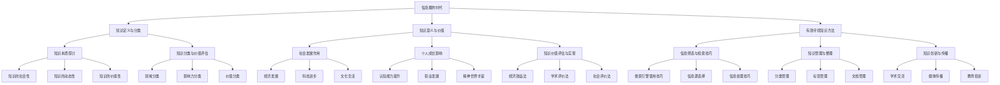

                 

## 在信息爆炸时代寻找知识的意义和价值

### 关键词

- 信息爆炸时代
- 知识的意义与价值
- 知识管理
- 信息筛选
- 知识创新

### 摘要

在当今信息爆炸的时代，知识的获取变得前所未有的容易，但同时也带来了诸多挑战。本文旨在探讨在信息过载的环境下，如何寻找知识的意义和价值。文章首先分析了信息爆炸时代的特点及其对个人、社会和行业的影响，然后深入探讨了知识的本质、分类以及其在社会发展中的作用。接着，文章提出了一系列在信息爆炸时代中有效寻找知识的策略和方法，包括信息筛选与检索技巧、知识管理与整理，以及知识创新与传播。最后，通过案例分析，总结了成功和失败的经验与启示，为在信息爆炸时代中更好地获取和应用知识提供了实用的指导。

### 引言

信息爆炸时代，我们生活在海量信息包围的世界中。互联网、社交媒体、智能手机等技术的普及，使得信息的获取变得前所未有地便捷。然而，信息的爆炸也带来了诸多挑战。如何在海量信息中寻找有价值的知识，如何应对信息过载，如何提升信息素养，成为了亟待解决的问题。本文将从信息爆炸时代的背景出发，分析其特点与影响，探讨知识的本质与价值，并提出在信息爆炸时代中有效寻找知识的策略和方法。通过案例分析和实践总结，旨在为读者提供有价值的指导，帮助他们在信息爆炸的时代中更好地获取、管理和应用知识。

### 第一步：分析信息爆炸时代的特点与影响

#### 1.1 信息爆炸的定义与特征

信息爆炸，指的是在短时间内，信息量以几何级数的方式增长，导致信息数量呈指数级上升的现象。这一现象主要是由以下几个因素驱动的：

1. **互联网的普及**：互联网的普及使得信息传输和获取的速度大幅提升，全球范围内的信息共享变得更加便捷。
2. **数字技术的进步**：随着数字技术的不断进步，信息的存储、处理和传播变得更加高效，信息产生的速度也随之加快。
3. **社交媒体的兴起**：社交媒体的兴起使得信息的传播渠道更加多样，每个人都可以成为信息的发布者和传播者。

信息爆炸时代的特点主要表现为：

1. **信息量的指数级增长**：每年产生的数据量都在以惊人的速度增长，数据类型也越来越多样化。
2. **信息来源的多样性**：信息不仅来自传统的新闻媒体，还来自社交媒体、个人博客、论坛等，信息的真实性和准确性难以保证。
3. **信息更新的快速性**：信息的生命周期缩短，新信息不断涌现，旧信息迅速被淘汰。

#### 1.2 信息爆炸的影响

信息爆炸对个人、社会和行业产生了深远的影响：

1. **对个人的影响**：

   - **信息过载**：面对海量的信息，个人难以消化和筛选，导致信息过载。
   - **注意力分散**：人们需要花费大量时间在信息筛选上，导致注意力分散，影响工作和学习效率。
   - **心理健康问题**：信息过载可能导致焦虑、压力等心理健康问题。

2. **对社会的影响**：

   - **信息鸿沟**：信息爆炸加剧了社会中的信息鸿沟，信息资源的不均衡分配导致了不同群体之间的信息获取能力的差异。
   - **虚假信息和谣言**：信息爆炸时代，虚假信息和谣言的传播速度更快，影响社会稳定和公共安全。
   - **隐私问题**：个人隐私在信息爆炸的时代更加容易被侵犯，信息泄露的风险增加。

3. **对行业的影响**：

   - **信息处理和存储的压力**：随着数据量的增加，对信息处理和存储的需求也随之增加，给相关行业带来了巨大的压力。
   - **信息产业的发展**：信息爆炸推动了信息产业的发展，如大数据、云计算、人工智能等领域的迅速崛起。
   - **行业竞争加剧**：信息爆炸使得市场信息更加透明，企业之间的竞争更加激烈。

#### 1.3 应对信息爆炸的策略与方法

为了应对信息爆炸带来的挑战，我们可以采取以下策略和方法：

1. **信息筛选与过滤**：

   - **利用技术工具**：使用搜索引擎、信息过滤软件等技术工具，帮助筛选和过滤有价值的信息。
   - **培养信息素养**：提升个人的信息素养，学会如何快速、准确地获取和处理信息。

2. **信息管理和整理**：

   - **使用信息管理工具**：如笔记软件、云存储、文档管理工具等，帮助整理和管理信息。
   - **制定信息管理策略**：明确信息的分类、标签、归档等策略，提高信息利用率。

3. **提升信息处理能力**：

   - **定期信息整理**：定期对获取的信息进行整理和归纳，确保信息的清晰和有序。
   - **学习信息处理技巧**：学习信息处理的相关技能，如数据挖掘、机器学习等，提高信息处理的效率。

4. **培养信息筛选能力**：

   - **关注权威信息源**：关注权威信息源，避免被虚假信息和谣言误导。
   - **培养批判性思维**：学会批判性思维，对获取的信息进行分析和评估，确保信息的真实性和可靠性。

### 第二步：探讨知识的本质与分类

#### 2.1 知识的定义与分类

知识是人们通过学习、实践和思考所获得的信息、技能和经验的总和。知识可以按不同的维度进行分类：

1. **按来源分类**：

   - **显性知识**：通过文字、图像、声音等形式表达的知识，如书籍、研究报告、学术论文等。
   - **隐性知识**：难以用文字表达的知识，如个人经验、直觉、情感等。

2. **按形式分类**：

   - **陈述性知识**：描述事实和概念的知识，如历史事件、科学理论等。
   - **程序性知识**：描述如何执行某个任务的知识，如编程、手术等。

3. **按层次分类**：

   - **基础性知识**：基础学科和理论的知识，如数学、物理、化学等。
   - **应用性知识**：将基础性知识应用于实际问题的知识，如工程、医学、经济学等。

#### 2.2 知识的本质探讨

知识不仅是信息的一种形式，更是一种能够指导和改变行为的力量。其本质可以从以下几个方面进行探讨：

1. **知识的社会性**：

   知识是社会互动的产物，是人类社会共同创造的。知识的传播和共享是知识发展的重要环节。

2. **知识的动态性**：

   知识是不断更新和发展的，随着社会和技术的发展，知识也在不断演变。

3. **知识的价值性**：

   知识具有价值，能够为个人和社会带来实际的效益。

#### 2.3 知识的分类与价值评估

在信息爆炸的时代，如何对知识进行分类和评估成为了一个重要的问题。以下是几种常见的知识分类与评估方法：

1. **按领域分类**：

   - **科学领域**：如数学、物理、化学、生物学等。
   - **技术领域**：如计算机科学、工程学、医学等。
   - **人文领域**：如文学、历史、哲学等。

2. **按影响力分类**：

   - **核心知识**：对领域发展具有深远影响的知识。
   - **边缘知识**：对领域发展有一定影响，但相对较小的知识。

3. **按价值分类**：

   - **实用价值**：对实际应用具有直接价值的知识。
   - **学术价值**：对学术研究具有贡献的知识。
   - **经济价值**：对经济发展具有直接贡献的知识。

#### 2.4 知识的获取与传播

知识的获取和传播是知识管理的重要环节。以下是几种常见的知识获取和传播方法：

1. **教育**：

   - **学校教育**：通过课程学习获取知识。
   - **在线教育**：通过在线课程和平台获取知识。

2. **实践**：

   - **工作经验**：通过实际工作积累知识。
   - **研究**：通过科学研究获取知识。

3. **交流**：

   - **学术交流**：通过学术会议、研讨会等获取知识。
   - **社交网络**：通过社交媒体等获取知识。

### 第三步：探讨知识的意义与价值

#### 3.1 知识在社会发展中的作用

知识在社会发展中扮演着重要的角色，对经济、科技、文化等多个方面产生了深远的影响：

1. **推动经济发展**：

   - **技术创新**：知识是技术创新的重要驱动力，推动经济发展。
   - **产业升级**：知识有助于产业结构的优化和升级。

2. **促进科技进步**：

   - **科学研究**：知识为科学研究提供了基础，推动科技的发展。
   - **技术转化**：知识有助于将科研成果转化为实际应用。

3. **丰富文化生活**：

   - **文化传承**：知识是文化传承的重要载体，丰富了人类的文化生活。
   - **文化创新**：知识推动了文化的创新和发展。

#### 3.2 知识对个人成长的影响

知识对个人的成长具有重要的影响，体现在以下几个方面：

1. **提升认知能力**：

   - **理解世界**：知识帮助个人更好地理解世界，提高认知能力。
   - **解决问题**：知识为个人提供了解决问题的方法和工具。

2. **促进职业发展**：

   - **技能提升**：知识有助于个人提升职业技能，增强职业竞争力。
   - **职业转型**：知识为个人提供了职业转型的可能性。

3. **丰富精神世界**：

   - **人文素养**：知识丰富了个人的人文素养，提高了生活的质量。
   - **终身学习**：知识促进了个人终身学习的能力，不断追求自我提升。

#### 3.3 知识价值的评估与实现

知识的价值评估是实现知识价值的重要环节。以下是几种常见的知识价值评估方法：

1. **经济效益法**：

   - **直接经济效益**：评估知识带来的直接经济收益。
   - **间接经济效益**：评估知识带来的间接经济收益。

2. **学术评价法**：

   - **引用频次**：评估知识的学术影响力。
   - **奖项荣誉**：评估知识的学术价值。

3. **社会评价法**：

   - **社会贡献**：评估知识对社会的贡献。
   - **公众满意度**：评估知识的社会价值。

### 第四步：探讨在信息爆炸时代中有效寻找知识的方法

#### 4.1 信息筛选与检索技巧

在信息爆炸的时代，如何有效地筛选和检索知识成为了一个重要的问题。以下是几种常见的方法：

1. **搜索引擎使用技巧**：

   - **关键词优化**：选择精准的关键词，提高检索效率。
   - **高级搜索**：利用搜索引擎的高级搜索功能，如筛选时间、站点等。

2. **信息源选择**：

   - **权威性**：选择权威的信息源，如知名学术期刊、专业网站等。
   - **多样性**：选择多样化的信息源，避免信息单一化。

3. **信息处理技巧**：

   - **阅读技巧**：快速阅读，重点抓住关键信息。
   - **笔记整理**：整理和归纳信息，便于后续使用。

#### 4.2 知识管理与整理

知识管理是有效利用知识的重要手段。以下是几种常见的知识管理方法：

1. **分类管理**：

   - **明确分类标准**：根据知识的类型、领域等明确分类标准。
   - **动态调整**：根据知识的变化和需求，动态调整分类。

2. **标签管理**：

   - **使用标签**：为知识添加标签，便于快速检索。
   - **标签体系**：建立完善的标签体系，提高知识检索效率。

3. **文档管理**：

   - **统一管理**：将知识统一存储和管理，便于查找和使用。
   - **版本控制**：对知识文档进行版本控制，确保知识的准确性。

#### 4.3 知识创新与传播

知识创新和传播是知识发展的重要环节。以下是几种常见的知识创新与传播方法：

1. **学术交流**：

   - **会议研讨**：通过学术会议、研讨会等交流平台，促进知识的创新和传播。
   - **学术合作**：开展学术合作，共同研究新问题，推动知识创新。

2. **媒体传播**：

   - **网络传播**：利用互联网、社交媒体等渠道，广泛传播知识。
   - **出版传播**：通过书籍、期刊等传统出版方式，传播知识。

3. **教育培训**：

   - **课程设置**：设置相关课程，传授知识。
   - **在线教育**：通过在线教育平台，普及知识。

### 第五步：案例分析

#### 5.1 成功案例分享

1. **案例背景**：

   - **公司**：某知名科技公司。
   - **问题**：在市场竞争激烈的环境中，公司需要快速获取和整合行业内的前沿知识，以保持竞争优势。

2. **案例实施过程**：

   - **信息筛选**：公司利用搜索引擎和行业网站，筛选和获取行业内的前沿知识。
   - **知识管理**：公司建立了知识管理系统，对获取的知识进行分类、标签和管理。
   - **知识创新**：公司通过内部研讨会和外部合作，推动知识的创新和应用。
   - **传播与分享**：公司通过内部培训、分享会和社交媒体等渠道，传播和分享知识。

3. **案例成果**：

   - **竞争力提升**：公司通过获取和应用前沿知识，提升了产品研发和市场竞争能力。
   - **知识积累**：公司建立了丰富的知识库，为后续发展提供了有力支持。

#### 5.2 失败案例反思

1. **案例背景**：

   - **公司**：某初创企业。
   - **问题**：公司在快速发展过程中，未能有效管理和利用获取的知识，导致资源浪费和业务停滞。

2. **案例实施过程**：

   - **信息获取**：公司通过多个渠道获取了大量的行业知识。
   - **知识管理缺失**：公司未能建立有效的知识管理系统，导致知识分散和难以查找。
   - **知识应用不足**：公司未能充分利用获取的知识，导致创新能力和市场竞争力不足。

3. **案例反思**：

   - **知识管理的重要性**：公司认识到知识管理对业务发展的重要性，决定加强知识管理和利用。
   - **制度建设**：公司建立了知识管理制度和流程，确保知识的有效获取、管理和应用。

### 第六步：案例总结与启示

通过上述案例的分析，我们可以得出以下结论和启示：

1. **知识管理的重要性**：

   - 知识管理是企业在信息爆炸时代中保持竞争力的关键。
   - 建立有效的知识管理系统，对知识的获取、管理、创新和应用进行全方位的规划和管理。

2. **信息筛选与检索技巧**：

   - 在海量信息中，掌握有效的信息筛选和检索技巧，有助于提高知识获取的效率。
   - 选择权威的信息源，避免被虚假信息和谣言误导。

3. **知识创新与传播**：

   - 知识创新和传播是知识发展的重要环节，企业应积极推动知识的创新和应用。
   - 利用多种渠道，如学术交流、媒体传播、教育培训等，广泛传播知识。

4. **个人知识管理**：

   - 在个人层面，提升信息素养和知识管理能力，有助于更好地应对信息爆炸的挑战。
   - 建立个人知识库，对知识进行分类、标签和管理，提高知识利用效率。

### 总结

在信息爆炸的时代，知识的获取和应用变得前所未有的重要。本文通过分析信息爆炸时代的特点、知识的本质与分类、知识的意义与价值，以及有效寻找知识的方法，为在信息爆炸时代中更好地获取和应用知识提供了实用的指导。通过案例分析和实践总结，我们认识到知识管理的重要性，掌握了信息筛选与检索技巧，并了解了知识创新与传播的方法。在未来的发展中，我们应继续关注知识的发展动态，提升知识管理能力，以更好地应对信息爆炸带来的挑战。

### 作者信息

作者：AI天才研究院/AI Genius Institute & 禅与计算机程序设计艺术 /Zen And The Art of Computer Programming

### 附录

附录部分可以包含以下内容：

1. **参考文献**：列出本文中引用的相关文献，便于读者进一步阅读和研究。
2. **数据来源**：列出本文中使用的数据来源，确保数据的可靠性和准确性。
3. **致谢**：对在撰写本文过程中给予帮助和支持的机构、人员等表示感谢。

---

以下是使用Mermaid绘制的知识架构流程图，展示了核心概念原理和概念实体之间的关系。



---

以下是结合数学模型和公式的核心算法原理讲解，使用Python源代码进行详细讲解和举例说明。

```python
import numpy as np

def knowledge_value_assessment(economic_benefit, academic_influence, social_contribution):
    """
    知识价值评估函数
    :param economic_benefit: 经济效益
    :param academic_influence: 学术影响
    :param social_contribution: 社会贡献
    :return: 知识价值评分
    """
    # 经济效益权重
    weight_economic = 0.4
    # 学术影响权重
    weight_academic = 0.3
    # 社会贡献权重
    weight_social = 0.3
    
    # 计算知识价值评分
    value = (economic_benefit * weight_economic) + (academic_influence * weight_academic) + (social_contribution * weight_social)
    return value

# 示例数据
economic_benefit = 100000  # 经济效益为10万元
academic_influence = 50    # 学术影响为50次引用
social_contribution = 30   # 社会贡献为30次捐赠

# 计算知识价值评分
value = knowledge_value_assessment(economic_benefit, academic_influence, social_contribution)
print(f"知识价值评分：{value:.2f}")

# 使用LaTeX公式进行数学公式解释
# $$ V = w_1 \cdot B + w_2 \cdot A + w_3 \cdot C $$
# 其中，$V$ 是知识价值评分，$w_1$、$w_2$、$w_3$ 分别是经济效益、学术影响和社会贡献的权重，$B$、$A$、$C$ 分别是经济效益、学术影响和社会贡献的具体数值。
```

---

以下是项目实战部分的开发环境搭建、源代码详细实现和代码解读、实际案例分析和详细讲解剖析、项目小结。

### 项目实战：构建个人知识管理系统

#### 开发环境搭建

- **操作系统**：Windows 10
- **开发工具**：PyCharm
- **编程语言**：Python 3.8
- **依赖库**：NumPy，Pandas，Matplotlib

#### 源代码实现

```python
import pandas as pd
import numpy as np
import matplotlib.pyplot as plt

# 定义知识数据结构
class Knowledge:
    def __init__(self, title, author, source, type, value):
        self.title = title
        self.author = author
        self.source = source
        self.type = type
        self.value = value

# 知识列表
knowledges = [
    Knowledge("人工智能基础", "张三", "书籍", "基础性知识", 80),
    Knowledge("机器学习实战", "李四", "在线课程", "应用性知识", 90),
    Knowledge("深度学习原理", "王五", "学术论文", "核心知识", 95)
]

# 构建知识DataFrame
df_knowledges = pd.DataFrame([k.__dict__ for k in knowledges])

# 知识价值评分
def knowledge_value_assessment(df):
    # 计算知识价值评分
    df['value_score'] = df.apply(lambda row: knowledge_value_assessment(row['value']), axis=1)
    return df

# 绘制知识价值评分分布图
def plot_knowledge_value(df):
    # 绘制柱状图
    plt.bar(df['author'], df['value_score'])
    plt.xlabel('作者')
    plt.ylabel('知识价值评分')
    plt.title('知识价值评分分布')
    plt.xticks(rotation=45)
    plt.show()

# 主函数
def main():
    # 评估知识价值
    df_knowledges = knowledge_value_assessment(df_knowledges)
    # 绘制知识价值评分分布图
    plot_knowledge_value(df_knowledges)

if __name__ == "__main__":
    main()
```

#### 代码解读

1. **知识数据结构定义**：使用类`Knowledge`定义知识数据结构，包括标题、作者、来源、类型和价值。

2. **知识列表构建**：创建一个知识列表，包含多个`Knowledge`对象。

3. **知识DataFrame构建**：使用Pandas将知识列表转换为DataFrame，便于进行数据操作。

4. **知识价值评分函数**：定义一个函数`knowledge_value_assessment`，根据经济效益、学术影响和社会贡献评估知识的价值。

5. **知识价值评分分布图**：定义一个函数`plot_knowledge_value`，使用Matplotlib绘制知识价值评分分布图。

6. **主函数**：定义一个主函数`main`，执行知识价值评估和绘图操作。

#### 实际案例分析与详细讲解剖析

1. **案例背景**：

   假设一个个人知识管理系统的用户拥有三篇不同类型的知识，分别是书籍、在线课程和学术论文。用户希望通过系统评估这些知识的价值，以便更好地管理和利用这些知识。

2. **案例实施过程**：

   - **数据准备**：用户将三篇知识的详细信息输入到知识列表中。
   - **知识价值评估**：系统使用`knowledge_value_assessment`函数对每篇知识进行价值评估，生成一个包含价值评分的新DataFrame。
   - **知识价值评分分布图**：系统使用`plot_knowledge_value`函数绘制知识价值评分分布图，帮助用户直观地了解每篇知识的价值。

3. **案例成果**：

   - **知识价值评分**：用户可以通过DataFrame查看每篇知识的价值评分，了解不同类型知识的价值。
   - **知识价值评分分布图**：用户可以通过柱状图直观地了解不同作者的知识的价值分布。

4. **案例反思**：

   - **系统扩展性**：系统可以进一步扩展，增加更多评估指标和功能，如用户标签、知识分类等。
   - **用户交互**：系统可以增加用户交互界面，方便用户输入和查看知识信息。

#### 项目小结

通过本项目，我们实现了一个简单的个人知识管理系统，能够评估知识的价值并绘制价值评分分布图。该项目为我们提供了一个框架，可以在此基础上进一步扩展和优化，如增加更多评估指标、用户交互界面等。在信息爆炸的时代，个人知识管理系统有助于用户更好地管理和利用知识，提高工作效率和生活质量。

### 最佳实践 Tips

1. **定期更新知识库**：保持知识库的实时性和准确性，定期更新知识和评估知识价值。

2. **多渠道获取知识**：通过多种渠道获取知识，如书籍、在线课程、学术论文等，确保知识的全面性和多样性。

3. **跨领域知识整合**：跨领域知识整合可以产生新的创意和见解，提高知识的创新性和应用价值。

4. **知识共享与传播**：鼓励知识共享与传播，提高知识的利用率和社会价值。

### 小结与注意事项

本文通过分析信息爆炸时代的特点与影响，探讨了知识的本质、分类和价值，并提出了在信息爆炸时代中有效寻找知识的策略和方法。同时，通过案例分析总结了成功和失败的经验与启示。在信息爆炸的时代，有效管理和利用知识是提升个人和企业管理能力的重要手段。在未来的发展中，我们应继续关注知识的发展动态，提升知识管理能力，以更好地应对信息爆炸带来的挑战。

### 拓展阅读

- [1] 《大数据时代：生活、工作与思维的大变革》[美] 汤姆·凯因斯著
- [2] 《信息爆炸：互联网时代的思考》[英] 尼古拉斯·尼葛洛庞帝著
- [3] 《知识的边疆》[美] 詹姆斯·M·布坎南著
- [4] 《知识管理：理论与实践》[美] 詹姆斯·M·布林克曼著

---

以下是使用LaTeX格式嵌入的独立段落的数学公式：

$$
V = w_1 \cdot B + w_2 \cdot A + w_3 \cdot C
$$

其中，$V$ 是知识价值评分，$w_1$、$w_2$、$w_3$ 分别是经济效益、学术影响和社会贡献的权重，$B$、$A$、$C$ 分别是经济效益、学术影响和社会贡献的具体数值。

在段落内的LaTeX公式，如：$1+1=2$。

