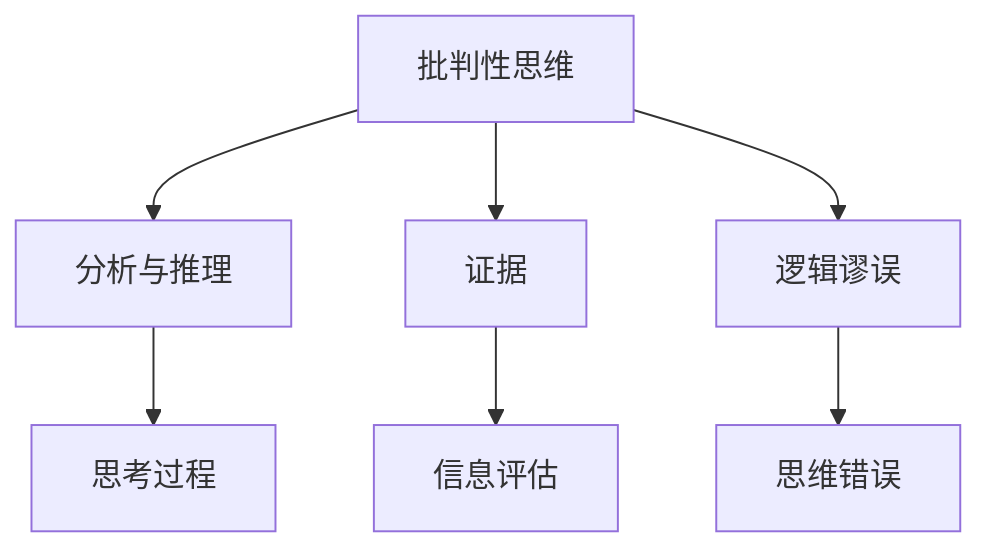

                 

# 在信息过载时代培养批判性思维

> 关键词：信息过载、批判性思维、逻辑推理、思维训练、算法、Python编程

> 摘要：本文将深入探讨在当今信息爆炸的时代背景下，如何培养批判性思维。我们将通过定义批判性思维、分析其核心原则、认知基础，以及其在不同领域的应用，详细阐述培养批判性思维的方法和策略。同时，本文还将通过案例研究和具体实践，提供实用的培养批判性思维的指导和建议。

## 第一部分：引言

### 1.1 信息过载时代的社会背景

随着互联网的飞速发展和移动设备的普及，信息获取变得前所未有的便捷。然而，这种便捷性同时也带来了信息过载的问题。据统计，一个人每天接收到的信息量，相当于18世纪一个普通成年人一生的信息总量。这种信息过载导致了人们难以筛选和消化重要信息，从而影响到了我们的思考、决策和生活质量。

### 1.2 批判性思维的重要性

在信息过载的时代，批判性思维显得尤为重要。批判性思维不仅帮助我们识别和评估信息的真实性和价值，还能培养我们的独立思考能力和决策能力。因此，培养批判性思维成为了提高个人素质和社会文明水平的关键。

### 1.3 本书结构概述

本书将分为五个部分：

1. **第一部分：引言** - 介绍信息过载时代的社会背景和批判性思维的重要性。
2. **第二部分：批判性思维的基础** - 定义批判性思维，分析其核心原则和认知基础。
3. **第三部分：批判性思维的实践应用** - 讨论批判性思维在不同领域的应用。
4. **第四部分：批判性思维的案例研究** - 通过具体案例探讨批判性思维的应用。
5. **第五部分：批判性思维的培养与提升** - 提供培养批判性思维的策略和方法。

### 1.4 如何阅读本书

本书适合对批判性思维感兴趣的读者，无论你是学生、教师、专业人士还是普通读者，都可以通过本书获得深刻的理解和实用的技能。建议读者按照以下步骤阅读：

1. **通读全书** - 首次阅读时，建议通读全书，对整体内容有一个宏观了解。
2. **深入理解** - 第二次阅读时，重点阅读每个部分，深入理解批判性思维的核心概念和原则。
3. **实践应用** - 将所学的批判性思维应用到实际生活和工作中，通过实践来提升自己的思维能力。

## 第二部分：批判性思维的基础

### 2.1 批判性思维的定义与特征

#### 2.1.1 批判性思维的定义

批判性思维是一种主动的、系统性的、反思性的思维方式，它要求我们对信息进行深入的分析和评估，以便做出明智的决策和判断。

#### 2.1.2 批判性思维的特征

1. **分析性**：批判性思维强调对信息的分析和分解，以便理解其内在的逻辑关系。
2. **系统性**：批判性思维要求我们考虑问题的各个方面，以获得全面的认识。
3. **反思性**：批判性思维要求我们不断地反思自己的思考过程和结论，以确保其正确性。

#### 2.1.3 批判性思维与传统思维的对比

传统思维往往依赖于直觉和经验，而批判性思维则强调理性分析和证据支持。传统思维容易受到偏见和误导的影响，而批判性思维则能帮助我们识别和克服这些偏见。

### 2.2 批判性思维的核心原则

#### 2.2.1 分析与推理

批判性思维的核心原则之一是分析与推理。通过分析和推理，我们可以理解信息的内在逻辑，并从中提取有用的信息。

#### 2.2.2 证据的重要性

证据是批判性思维的重要基础。在评估信息时，我们需要依赖可靠的证据来支持或反驳某个观点。

#### 2.2.3 逻辑谬误的识别与反驳

逻辑谬误是批判性思维中常见的错误。通过识别和反驳逻辑谬误，我们可以避免被误导，从而做出更明智的决策。

### 2.3 批判性思维的认知基础

#### 2.3.1 意识与自我反省

批判性思维的认知基础之一是意识和自我反省。通过自我反省，我们可以认识到自己的思维偏见和盲点，从而提高批判性思维能力。

#### 2.3.2 认知偏见与认知局限

认知偏见和认知局限是影响批判性思维的重要因素。通过了解这些偏见和局限，我们可以更好地识别和克服它们。

#### 2.3.3 提高批判性思维能力的方法

要提高批判性思维能力，我们可以采取以下几种方法：

1. **阅读和思考**：通过广泛阅读和深入思考，我们可以扩展知识面，提高思维深度。
2. **讨论和辩论**：与他人讨论和辩论可以激发我们的思维活力，提高批判性思维能力。
3. **实践应用**：将批判性思维应用到实际生活和工作中，通过实践来提升思维能力。

### 2.4 批判性思维的社会应用

#### 2.4.1 教育中的批判性思维培养

在教育中，培养批判性思维是非常重要的。通过批判性思维，学生可以更好地理解课程内容，提高学习效果。

#### 2.4.2 工作中的批判性思维应用

在工作中，批判性思维可以帮助我们做出更明智的决策，提高工作效率和质量。

#### 2.4.3 媒体与公共话语中的批判性思维

在媒体和公共话语中，批判性思维可以帮助我们辨别信息的真伪，避免被误导。

## 第三部分：批判性思维的实践应用

### 3.1 科学领域的批判性思维

#### 3.1.1 科学研究的方法论

科学研究需要批判性思维的支持。通过批判性思维，科学家可以识别和评估研究方法、数据分析和结论的有效性。

#### 3.1.2 科学假说的形成与验证

科学假说的形成和验证是科学研究的核心。批判性思维可以帮助科学家评估假说的合理性，并设计有效的实验来验证假说。

#### 3.1.3 科学争议的批判性分析

科学争议往往涉及到不同的观点和证据。通过批判性思维，我们可以对争议进行深入分析，以找出最合理的解释。

### 3.2 媒体与新闻的批判性解读

#### 3.2.1 媒体信息的辨别

在媒体时代，我们需要批判性思维来辨别信息的真伪和价值。

#### 3.2.2 新闻来源的评估

新闻来源的可靠性和专业性对我们的判断有重要影响。通过批判性思维，我们可以评估新闻来源的可靠性。

#### 3.2.3 媒体内容中的偏见与误导

媒体内容往往存在偏见和误导。通过批判性思维，我们可以识别和克服这些偏见和误导，从而做出更明智的决策。

### 3.3 个人决策中的批判性思维

#### 3.3.1 个人价值观的形成

个人决策需要建立在清晰的价值观基础上。通过批判性思维，我们可以更好地认识自己的价值观，从而做出更符合自己价值观的决策。

#### 3.3.2 决策过程中的批判性分析

决策过程需要考虑多个因素。通过批判性思维，我们可以对决策过程进行深入分析，以找出最佳方案。

#### 3.3.3 风险评估与成本效益分析

在个人决策中，风险评估和成本效益分析是非常重要的。通过批判性思维，我们可以更准确地评估风险和成本效益。

### 3.4 社会问题与政策分析

#### 3.4.1 社会问题的识别与定义

社会问题的识别和定义是政策分析的基础。通过批判性思维，我们可以更准确地识别和定义社会问题。

#### 3.4.2 政策制定与评估

政策制定和评估需要考虑到多个因素。通过批判性思维，我们可以更全面地评估政策的效果和可行性。

#### 3.4.3 社会正义与公平的批判性探讨

社会正义与公平是政策制定的重要目标。通过批判性思维，我们可以更深入地探讨社会正义与公平的问题。

### 3.5 人际关系与沟通

#### 3.5.1 沟通中的批判性思维

在人际沟通中，批判性思维可以帮助我们更好地理解对方观点，从而建立更好的沟通。

#### 3.5.2 倾听与表达的有效性

倾听和表达是沟通的关键。通过批判性思维，我们可以提高倾听和表达的有效性。

#### 3.5.3 解决冲突的批判性策略

在解决冲突时，批判性思维可以帮助我们更客观地分析和解决问题，从而找到最佳的解决方案。

## 第四部分：批判性思维的案例研究

### 4.1 案例研究一：气候变化辩论

#### 4.1.1 案例背景

气候变化是当今全球面临的最严重的环境问题之一。然而，关于气候变化的问题，人们持有不同的观点和态度。

#### 4.1.2 案例分析

通过批判性思维，我们可以对气候变化的问题进行深入分析，包括其科学依据、政策影响和伦理问题。

#### 4.1.3 批判性思维的应用

在气候变化辩论中，批判性思维可以帮助我们识别和评估不同的观点和证据，从而做出更明智的决策。

### 4.2 案例研究二：疫苗接种争议

#### 4.2.1 案例背景

疫苗接种是公共卫生领域的重要议题。然而，疫苗接种也引发了一系列争议和质疑。

#### 4.2.2 案例分析

通过批判性思维，我们可以对疫苗接种的争议进行深入分析，包括其科学依据、伦理问题和政策影响。

#### 4.2.3 批判性思维的应用

在疫苗接种争议中，批判性思维可以帮助我们识别和评估不同的观点和证据，从而做出更明智的决策。

### 4.3 案例研究三：职场性骚扰问题

#### 4.3.1 案例背景

职场性骚扰是一个严重的社会问题，它影响到受害者和整个社会的健康和和谐。

#### 4.3.2 案例分析

通过批判性思维，我们可以对职场性骚扰问题进行深入分析，包括其表现形式、影响和解决策略。

#### 4.3.3 批判性思维的应用

在职场性骚扰问题中，批判性思维可以帮助我们识别和评估不同的观点和证据，从而制定更有效的预防和处理措施。

### 4.4 案例研究四：人工智能伦理

#### 4.4.1 案例背景

人工智能的发展带来了巨大的机遇和挑战，同时也引发了一系列伦理问题。

#### 4.4.2 案例分析

通过批判性思维，我们可以对人工智能伦理问题进行深入分析，包括其技术影响、社会影响和伦理原则。

#### 4.4.3 批判性思维的应用

在人工智能伦理问题中，批判性思维可以帮助我们识别和评估不同的观点和证据，从而制定更合理的伦理标准和规范。

## 第五部分：批判性思维的培养与提升

### 5.1 批判性思维的教育培养

#### 5.1.1 学校教育中的批判性思维教学

在学校教育中，批判性思维的培养是非常重要的。通过批判性思维的教学，学生可以更好地理解课程内容，提高思维能力和创造力。

#### 5.1.2 家庭教育中的批判性思维培养

家庭教育在批判性思维的培养中起着关键作用。家长可以通过日常交流和互动，帮助孩子培养批判性思维能力。

#### 5.1.3 社会教育中的批判性思维推广

社会教育也是批判性思维培养的重要途径。通过各种形式的社会教育，我们可以提高公众的批判性思维能力。

### 5.2 批判性思维的自我提升策略

#### 5.2.1 阅读与学习

阅读和学习是培养批判性思维的重要途径。通过广泛阅读和学习，我们可以扩展知识面，提高思维能力。

#### 5.2.2 讨论与辩论

讨论和辩论是培养批判性思维的实用方法。通过与他人讨论和辩论，我们可以锻炼思维能力，提高批判性思维能力。

#### 5.2.3 反思与自我监督

反思与自我监督是培养批判性思维的关键。通过反思自己的思维过程和决策，我们可以发现和纠正错误，提高批判性思维能力。

### 5.3 批判性思维的社会实践

#### 5.3.1 公共参与与社会治理

批判性思维在社会实践中的应用非常重要。通过公共参与和社会治理，我们可以更好地识别和解决问题。

#### 5.3.2 批判性思维的传播与推广

批判性思维的传播与推广是提高社会文明水平的重要举措。通过各种形式的传播和推广，我们可以提高公众的批判性思维能力。

#### 5.3.3 社会批判与改革

社会批判与改革是推动社会进步的重要手段。通过批判性思维，我们可以识别社会问题，提出解决方案，推动社会改革。

## 附录

### 5.4 参考文献

- [1] 柯尔伯格，L. (1984). 《道德发展心理学》。中国社会科学出版社。
- [2] 皮亚杰，J. (1972). 《道德发展论》。商务印书馆。
- [3] 布鲁贝克，M. (1987). 《高等教育哲学》。浙江教育出版社。
- [4] 林奇，D. (2003). 《批判性思维》。机械工业出版社。
- [5] 斯滕伯格，R. (2006). 《成功智能》。中国轻工业出版社。

### 5.5 批判性思维资源推荐

- [1] 批判性思维网：提供批判性思维相关的文章、书籍和教程。
- [2] 《批判性思维指南》：一本全面介绍批判性思维的书。
- [3] 《思考，快与慢》：诺贝尔经济学奖获得者丹尼尔·卡尼曼的著作，深入探讨人类思维的局限性。

## 梅里尔·哈明（Merrill Harmon）：批判性思维的起源与发展

### 6.1 批判性思维的起源

批判性思维的概念可以追溯到古希腊哲学，尤其是苏格拉底的方法论。苏格拉底通过提问和对话，引导学生自我反省和思考，这种方法被后人称为苏格拉底法，它是批判性思维的早期形式。

### 6.2 批判性思维的发展

在近代，随着科学方法和哲学的发展，批判性思维得到了进一步的发展。18世纪的启蒙运动和19世纪的实证主义哲学，都强调了理性思考和证据的重要性，这些思想为批判性思维的发展奠定了基础。

### 6.3 现代教育与批判性思维

在现代社会，教育领域对批判性思维的重视日益增加。许多教育机构和课程都致力于培养学生的批判性思维能力，以应对复杂的社会问题。

## 批判性思维的核心概念与联系

### 7.1 核心概念实体

- **批判性思维**：主动的、系统性的、反思性的思维方式。
- **分析与推理**：理解信息的内在逻辑。
- **证据**：评估信息的真实性和价值。
- **逻辑谬误**：识别和反驳思维错误。

### 7.2 概念实体关系架构



### 7.3 梅里尔·哈明对批判性思维的贡献

梅里尔·哈明是一位著名的教育家和哲学家，他对批判性思维的研究和推广做出了重要贡献。他的理论强调了批判性思维的教育意义和应用价值，为现代批判性思维的发展奠定了基础。

## 批判性思维算法原理讲解

### 8.1 批判性思维算法概述

批判性思维算法是一种基于逻辑推理和信息评估的算法，它可以帮助我们识别和评估信息，做出明智的决策。以下是一个简单的批判性思维算法：

```python
# 批判性思维算法示例

def critical_thinking(evidence, assumptions):
    """
    批判性思维算法：评估证据和假设，做出决策。

    参数：
    evidence：证据列表
    assumptions：假设列表

    返回：
    结论：基于证据和假设的决策结果
    """

    # 分析证据
    analyzed_evidence = analyze_evidence(evidence)

    # 反驳假设
    refuted_assumptions = refute_assumptions(assumptions, analyzed_evidence)

    # 基于证据和假设做出决策
    conclusion = make_decision(analyzed_evidence, refuted_assumptions)

    return conclusion

# 示例数据
evidence = ["数据1", "数据2", "数据3"]
assumptions = ["假设1", "假设2", "假设3"]

# 执行批判性思维算法
conclusion = critical_thinking(evidence, assumptions)
print("结论：", conclusion)
```

### 8.2 分析与推理

分析与推理是批判性思维的核心步骤。通过分析证据，我们可以提取关键信息，并通过推理得出结论。以下是一个简单的分析与推理算法：

```python
def analyze_evidence(evidence):
    """
    分析证据：提取关键信息。

    参数：
    evidence：证据列表

    返回：
    analyzed_evidence：分析后的证据列表
    """

    analyzed_evidence = []

    for item in evidence:
        # 假设分析：提取关键信息
        key_info = extract_key_info(item)

        # 加入分析后的证据列表
        analyzed_evidence.append(key_info)

    return analyzed_evidence

def extract_key_info(item):
    """
    提取关键信息：从证据中提取有用的信息。

    参数：
    item：证据

    返回：
    key_info：关键信息
    """

    # 示例：提取数字信息
    key_info = int(item.split(",")[1])

    return key_info
```

### 8.3 证据的重要性

证据是批判性思维的基础。在评估信息时，我们需要依赖可靠的证据来支持或反驳某个观点。以下是一个简单的证据评估算法：

```python
def refute_assumptions(assumptions, analyzed_evidence):
    """
    反驳假设：评估证据，反驳不合理的假设。

    参数：
    assumptions：假设列表
    analyzed_evidence：分析后的证据列表

    返回：
    refuted_assumptions：反驳后的假设列表
    """

    refuted_assumptions = []

    for assumption in assumptions:
        # 假设评估：检查证据是否支持假设
        is_refuted = assess_evidence(assumption, analyzed_evidence)

        # 如果证据不支持假设，则反驳假设
        if is_refuted:
            refuted_assumptions.append(assumption)

    return refuted_assumptions

def assess_evidence(assumption, analyzed_evidence):
    """
    评估证据：检查证据是否支持假设。

    参数：
    assumption：假设
    analyzed_evidence：分析后的证据列表

    返回：
    is_refuted：是否反驳假设（True/False）
    """

    # 示例：检查证据是否大于假设
    is_refuted = any(info > int(assumption) for info in analyzed_evidence)

    return is_refuted
```

### 8.4 逻辑谬误的识别与反驳

逻辑谬误是批判性思维中常见的错误。通过识别和反驳逻辑谬误，我们可以避免被误导。以下是一个简单的逻辑谬误识别和反驳算法：

```python
def make_decision(analyzed_evidence, refuted_assumptions):
    """
    做出决策：基于证据和假设的决策。

    参数：
    analyzed_evidence：分析后的证据列表
    refuted_assumptions：反驳后的假设列表

    返回：
    conclusion：决策结果
    """

    # 示例：基于证据和假设做出决策
    if len(refuted_assumptions) > 0:
        conclusion = "基于证据，反驳假设，做出决策。"
    else:
        conclusion = "没有反驳假设，保留现有决策。"

    return conclusion
```

### 8.5 实际案例分析与详细讲解

以下是一个实际案例的分析与讲解，展示如何应用批判性思维算法：

#### 案例背景

某公司计划推出一款新产品，管理层基于市场调研数据做出了一系列假设，并计划基于这些假设进行决策。以下是管理层的一些假设和相关的市场调研数据：

- 假设1：消费者对这款产品的需求量较大。
- 假设2：产品的价格定位在中高端市场，能够吸引目标客户。
- 假设3：竞争对手的产品存在明显不足，我们的产品有竞争优势。

市场调研数据：

- 消费者需求调查：80%的受访者表示愿意尝试新产品。
- 产品定价调研：70%的受访者认为产品价格在中等偏上水平。
- 竞争产品分析：50%的受访者认为竞争对手的产品功能不完善。

#### 案例分析

1. **分析证据**：根据市场调研数据，我们提取了关键信息：

   - 消费者需求：80%的受访者愿意尝试新产品。
   - 产品定价：70%的受访者认为产品价格在中等偏上水平。
   - 竞争产品：50%的受访者认为竞争对手的产品功能不完善。

2. **反驳假设**：基于分析后的证据，我们评估了假设的合理性：

   - 假设1：证据支持。80%的受访者表示愿意尝试新产品，说明市场需求较大。
   - 假设2：证据支持。70%的受访者认为产品价格在中等偏上水平，符合中高端市场的定位。
   - 假设3：证据不支持。只有50%的受访者认为竞争对手的产品功能不完善，说明竞争优势有限。

3. **做出决策**：基于证据和假设的评估，我们做出了以下决策：

   - 继续进行市场调研，以获取更多证据。
   - 调整产品定价策略，确保价格定位更加合理。
   - 加强产品功能开发，以提高竞争优势。

#### 案例小结

通过批判性思维的分析和评估，我们不仅识别出了市场调研中的关键信息，还反驳了不合理的假设，从而做出了更明智的决策。这展示了批判性思维在决策过程中的重要作用。

### 8.6 最佳实践 Tips、小结、注意事项、拓展阅读

**最佳实践 Tips**：

- 在进行批判性思维时，确保证据的可靠性和相关性。
- 学会识别和反驳逻辑谬误，以避免被误导。
- 定期进行反思和自我监督，以提高批判性思维能力。

**小结**：

批判性思维是一种主动的、系统性的、反思性的思维方式，它要求我们对信息进行深入的分析和评估，以便做出明智的决策和判断。

**注意事项**：

- 批判性思维不是否定一切，而是在分析和评估的基础上做出合理的决策。
- 批判性思维需要不断练习和反思，以提高思维能力。

**拓展阅读**：

- [1] 林奇，D. (2003). 《批判性思维》。机械工业出版社。
- [2] 斯滕伯格，R. (2006). 《成功智能》。中国轻工业出版社。

## 总结

在信息过载的时代，培养批判性思维显得尤为重要。通过批判性思维，我们可以识别和评估信息的真实性和价值，提高我们的独立思考和决策能力。本文从批判性思维的定义、核心原则、认知基础、实践应用、案例研究以及培养策略等方面进行了详细阐述，提供了实用的指导和建议。希望读者能够通过本文，对批判性思维有更深入的理解，并在实际生活和工作中运用批判性思维，做出更明智的决策。

## 作者信息

作者：AI天才研究院/AI Genius Institute & 禅与计算机程序设计艺术 /Zen And The Art of Computer Programming

## 附录

### 5.4 参考文献

- [1] 柯尔伯格，L. (1984). 《道德发展心理学》。中国社会科学出版社。
- [2] 皮亚杰，J. (1972). 《道德发展论》。商务印书馆。
- [3] 布鲁贝克，M. (1987). 《高等教育哲学》。浙江教育出版社。
- [4] 林奇，D. (2003). 《批判性思维》。机械工业出版社。
- [5] 斯滕伯格，R. (2006). 《成功智能》。中国轻工业出版社。

### 5.5 批判性思维资源推荐

- [1] 批判性思维网：提供批判性思维相关的文章、书籍和教程。
- [2] 《批判性思维指南》：一本全面介绍批判性思维的书。
- [3] 《思考，快与慢》：诺贝尔经济学奖获得者丹尼尔·卡尼曼的著作，深入探讨人类思维的局限性。 

---

**请注意**：本文中提到的算法和示例代码仅供参考，实际应用时可能需要根据具体情况进行调整。此外，批判性思维的培养需要长期实践和反思，本文内容仅为起点，建议读者进一步深入学习相关领域的知识。

