                 


### 引言与背景

在当今这个信息爆炸的时代，我们每天都被大量的信息所包围。从社交媒体的推送，到新闻网站的更新，再到各种应用程序的通知，信息以令人难以想象的速度和数量涌向我们。然而，这些信息的质量却是良莠不齐。如何在这个信息过载的时代中生存，甚至脱颖而出，成为了一个严峻的问题。

批判性思维，作为一种重要的思维方式，正日益受到关注。它不仅能够帮助我们更好地理解信息，还能提高我们分析和解决问题的能力。因此，在信息过载的时代，培养批判性思维显得尤为重要。

首先，我们需要了解什么是批判性思维。批判性思维是一种基于证据和逻辑的思维方式，它要求我们在接受任何观点或信息时，都要进行深入的分析和评价。这种思维模式不仅关注信息的表面内容，更关注其背后的逻辑和证据。它是一种主动的、反思性的思维过程，旨在揭示问题的实质，避免盲从和误解。

那么，批判性思维有哪些核心概念和要素呢？首先，提问技巧是批判性思维的基础。通过提出深入、有针对性的问题，我们可以更好地理解信息，发现潜在的问题和矛盾。其次，分析技巧同样重要。它包括对信息来源、作者意图、证据可靠性等方面的分析，帮助我们判断信息的真实性和价值。最后，评估证据和逻辑推理也是批判性思维的关键要素。通过评估证据的可靠性和逻辑推理的合理性，我们可以对信息进行客观的评价和判断。

批判性思维的应用场景非常广泛。在科学领域，批判性思维可以帮助科学家们进行科学探究，发现真理。在教育领域，批判性思维可以培养学生的独立思考能力，提高他们的学习效果。在媒体和信息传播领域，批判性思维可以帮助公众识别虚假信息，提高媒体素养。

然而，批判性思维的培养并不是一蹴而就的。它需要我们不断地进行实践和训练。首先，我们可以通过阅读和讨论来提升批判性思维。阅读不同观点的文章，参与讨论和辩论，可以帮助我们更好地理解批判性思维的应用。其次，我们可以通过提问和反思来培养批判性思维。在阅读、学习和思考的过程中，我们要学会提出问题，并反思自己的观点和想法。最后，我们还可以通过实战练习和案例分析来提升批判性思维。通过解决实际问题，我们可以更好地理解和应用批判性思维。

总之，在信息过载的时代，培养批判性思维是至关重要的。它不仅可以帮助我们更好地理解和处理信息，还能提高我们的分析和解决问题的能力。让我们从现在开始，积极培养批判性思维，在这个信息爆炸的时代中，立足自身，不断前行。

---

# 文章关键词

信息过载、批判性思维、提问技巧、分析技巧、评估证据、逻辑推理

---

# 文章摘要

本文讨论了在信息过载的时代，培养批判性思维的重要性。首先，介绍了信息过载的现象及其对个人和社会的影响。然后，定义了批判性思维，阐述了其核心概念和要素，如提问技巧、分析技巧、评估证据和逻辑推理。接着，讨论了批判性思维在不同领域的应用，如科学、教育、媒体等。最后，提出了培养批判性思维的方法和策略，并强调了实践和训练的重要性。通过本文的阅读，读者将了解到批判性思维的价值，并在信息过载的时代中，学会如何更好地应对和处理信息。

---

## 第一部分：引言与背景

### 1.1 信息过载现象

在当今数字化时代，信息过载已经成为一个普遍存在的问题。随着互联网和移动设备的普及，信息的获取变得前所未有的容易和快捷。然而，这种便利也带来了一个问题：我们接收到的信息量远远超出了我们能够处理和理解的范围。这种现象被称为信息过载。

#### 1.1.1 信息过载的来源

信息过载的来源可以分为几个方面：

1. **互联网内容爆炸**：互联网上的信息量以指数级增长，每天有大量的新闻、博客、社交媒体帖子、视频等产生。
2. **社交媒体**：社交媒体平台如Facebook、Twitter、Instagram等，每天都会推送大量的信息，用户往往难以筛选和消化。
3. **电子邮件**：无论是工作邮件还是个人邮件，每天都会收到大量的邮件，其中很多可能并不重要。
4. **应用程序通知**：各种应用程序如新闻客户端、游戏、社交媒体等都会推送通知，使用户不断分心。
5. **广告和推送通知**：广告和推送通知不断地出现在各种屏幕上，增加了信息的杂音。

#### 1.1.2 信息过载对个人和社会的影响

信息过载对个人和社会都有深远的影响：

1. **心理压力**：面对大量的信息，人们往往会感到焦虑、压力和困惑，难以做出有效的决策。
2. **时间管理问题**：信息过载使得人们难以合理安排时间，导致工作效率下降。
3. **注意力分散**：过多的信息会分散人们的注意力，影响深度思考和专注力的培养。
4. **信息真实性问题**：在信息过载的环境中，虚假信息和错误信息更容易传播，增加了公众的误解和误导。
5. **社会信任危机**：信息过载导致公众对媒体和信息源的不信任，加剧了社会矛盾。

### 1.2 批判性思维的重要性

在信息过载的时代，批判性思维显得尤为重要。批判性思维是一种能够帮助人们分析、评估和思考信息的思维方式。它不仅能够提高我们对信息的理解深度，还能够帮助我们辨别信息的真伪和价值。

#### 1.2.1 批判性思维的定义

批判性思维是一种基于证据和逻辑的思维方式，它要求我们在接受任何观点或信息时，都要进行深入的分析和评价。它是一种积极的、反思性的思维过程，旨在揭示问题的实质，避免盲从和误解。

#### 1.2.2 批判性思维的核心价值

批判性思维的核心价值体现在以下几个方面：

1. **提高信息处理能力**：批判性思维可以帮助我们更好地筛选和处理信息，避免被大量冗余信息所淹没。
2. **增强判断力和决策力**：通过批判性思维，我们可以对信息进行客观的评价和判断，做出更加明智的决策。
3. **促进问题解决能力**：批判性思维能够帮助我们深入分析问题，找到解决问题的根本方法。
4. **培养独立思考能力**：批判性思维鼓励我们质疑现有的观点和理论，培养我们的独立思考能力。
5. **提高沟通和协作能力**：批判性思维能够帮助我们更清晰地表达自己的观点，提高沟通效果。

#### 1.2.3 批判性思维在信息时代的应用前景

在信息时代，批判性思维的应用前景非常广阔。它不仅可以帮助我们应对信息过载的问题，还能在各个领域发挥重要作用：

1. **科学研究**：批判性思维是科学研究的重要基础，它能够帮助科学家们进行科学探究，发现真理。
2. **教育领域**：批判性思维是培养学生独立思考能力的重要手段，有助于提高教育质量。
3. **媒体和信息传播**：批判性思维可以帮助公众识别虚假信息，提高媒体素养，减少误导和误解。
4. **工作和职业生涯**：批判性思维是提高工作效率和决策能力的关键，有助于职业发展。

总之，在信息过载的时代，培养批判性思维是应对信息挑战的重要策略。通过批判性思维，我们可以更好地理解和处理信息，提高自己的综合素质和竞争力。

### 1.3 批判性思维在信息时代的应用

批判性思维在信息时代有着广泛的应用，无论是在个人生活中，还是在各个专业领域，它都能够发挥重要的作用。

#### 1.3.1 批判性思维在科学研究的应用

在科学研究领域，批判性思维是不可或缺的。科学家们需要通过批判性思维来评估实验设计、数据分析和方法论的选择。以下是一个简单的Mermaid流程图，展示了批判性思维在科学研究中的基本架构：

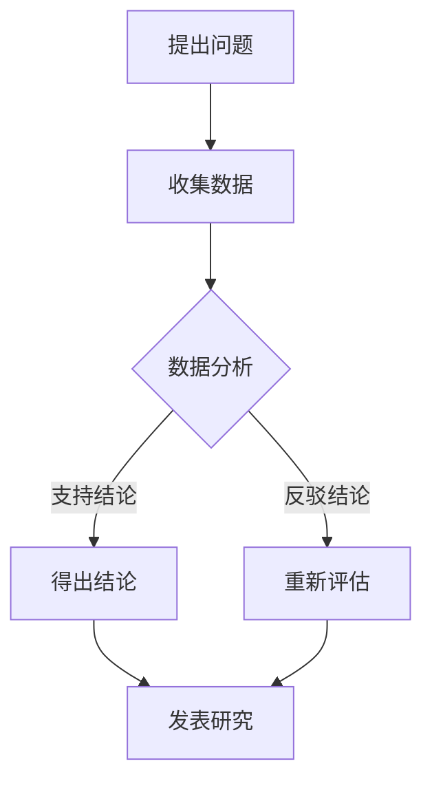

1. **提出问题**：科学研究从提出问题开始，这是批判性思维的第一步。科学家需要明确研究的问题，并对其进行深入的理解和定义。
2. **收集数据**：在明确了研究问题后，科学家需要收集相关的数据。这一步骤需要批判性思维来评估数据来源的可靠性和数据的完整性。
3. **数据分析**：收集到数据后，科学家需要进行数据分析。批判性思维在这一步骤中用于评估数据分析方法的选择和数据解释的合理性。
4. **得出结论**：在分析数据后，科学家需要得出结论。批判性思维在这一步骤中用于评估结论的合理性和证据的支持程度。
5. **发表研究**：最后，科学家需要将研究成果发表出去。批判性思维在这一步骤中用于评估研究的可重复性和对其他研究的启示。

#### 1.3.2 批判性思维在教育领域的应用

在教育领域，批判性思维是培养学生独立思考能力和批判性思维的重要手段。以下是一个简单的Mermaid流程图，展示了批判性思维在教育中的应用架构：

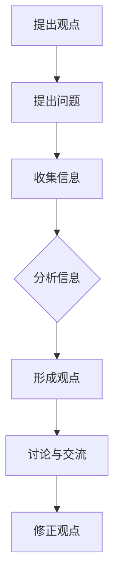

1. **提出观点**：教育过程中的第一步是让学生提出自己的观点。这可以帮助学生建立思考的基础。
2. **提出问题**：在提出观点后，学生需要提出问题，以促进对观点的深入理解。
3. **收集信息**：为了回答问题，学生需要收集相关的信息。批判性思维在这一步骤中用于评估信息的可靠性和相关性。
4. **分析信息**：在收集到信息后，学生需要对信息进行分析。批判性思维在这一步骤中用于评估信息的真实性和逻辑性。
5. **形成观点**：在分析信息后，学生需要形成自己的观点。批判性思维在这一步骤中用于评估观点的合理性和证据的支持程度。
6. **讨论与交流**：学生需要与其他人讨论和交流自己的观点。批判性思维在这一步骤中用于评估他人的观点和讨论的有效性。
7. **修正观点**：在讨论和交流后，学生可能需要修正自己的观点。批判性思维在这一步骤中用于评估观点的变化和合理性。

#### 1.3.3 批判性思维在媒体和信息传播中的应用

在媒体和信息传播领域，批判性思维可以帮助公众识别虚假信息，提高信息素养。以下是一个简单的Mermaid流程图，展示了批判性思维在媒体和信息传播中的应用架构：

```mermaid
graph TD
A[接收信息] --> B[评估来源]
B --> C[评估真实性]
C --> D{评估证据]
D --> E[评估逻辑]
E --> F[形成判断]
F --> G[行动或反馈]
```

1. **接收信息**：公众首先需要接收信息，这可能来自新闻媒体、社交媒体或其他信息源。
2. **评估来源**：在接收信息后，公众需要评估信息的来源。批判性思维在这一步骤中用于评估信息源的可靠性和信誉度。
3. **评估真实性**：在确定了信息来源后，公众需要评估信息的真实性。批判性思维在这一步骤中用于识别虚假信息和误导性信息。
4. **评估证据**：公众需要评估信息的证据支持程度。批判性思维在这一步骤中用于评估证据的可靠性和相关性。
5. **评估逻辑**：在评估证据后，公众需要评估信息的逻辑性。批判性思维在这一步骤中用于识别逻辑谬误和论证缺陷。
6. **形成判断**：在评估了信息的真实性、证据和逻辑后，公众需要形成自己的判断。
7. **行动或反馈**：最后，公众可以根据自己的判断采取行动，如分享信息、提出质疑或进行进一步的调查。

通过以上三个应用场景的介绍，我们可以看到批判性思维在信息时代的重要性。它不仅可以帮助我们更好地理解和处理信息，还能提高我们的判断力、决策力和问题解决能力。在接下来的章节中，我们将进一步探讨批判性思维的核心概念和培养方法。

---

## 第二部分：批判性思维的核心概念

### 2.1 定义与基本原则

批判性思维是一种基于证据和逻辑的思维方式，它要求我们在接受任何观点或信息时，都要进行深入的分析和评价。这种思维模式不仅关注信息的表面内容，更关注其背后的逻辑和证据。以下是一个简单的Mermaid流程图，展示了批判性思维的基本架构：

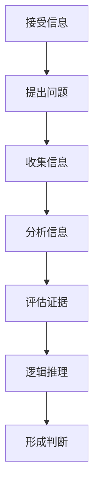

#### 2.1.1 批判性思维的定义

批判性思维（Critical Thinking）是一种思考方式，它不仅仅是简单的接受信息，而是在接受信息的基础上，通过提问、分析、评估和推理等步骤，对信息进行深入的理解和评价。以下是一个简单的定义：

> 批判性思维是指以逻辑、证据和理性为基础，通过分析、评估和推理等过程，对观点、信息或问题进行深入理解和评价的思维方式。

#### 2.1.2 批判性思维的基本原则

批判性思维遵循一系列基本原则，这些原则构成了批判性思维的核心。以下是一些基本原则：

1. **证据为本**：批判性思维要求我们在接受任何观点或信息时，都要基于可靠的证据进行评价。证据可以是事实、数据、观察结果等。
2. **理性分析**：批判性思维要求我们在处理信息时，要运用理性分析的方法，而不是基于情感或偏见。
3. **开放性**：批判性思维要求我们保持开放的心态，接受不同的观点和证据，并进行客观的评价。
4. **逻辑推理**：批判性思维强调逻辑推理的重要性，要求我们在评价信息时，遵循逻辑规则，避免逻辑谬误。
5. **反思性**：批判性思维是一种反思性的思维过程，要求我们在思考过程中不断反思自己的观点和想法，以避免盲从和误解。

#### 2.1.3 批判性思维与其他思维方式的区别

批判性思维与其他思维方式，如创造性思维、逻辑思维等，既有联系又有区别。以下是一个简单的Mermaid流程图，展示了批判性思维与其他思维方式的区别：

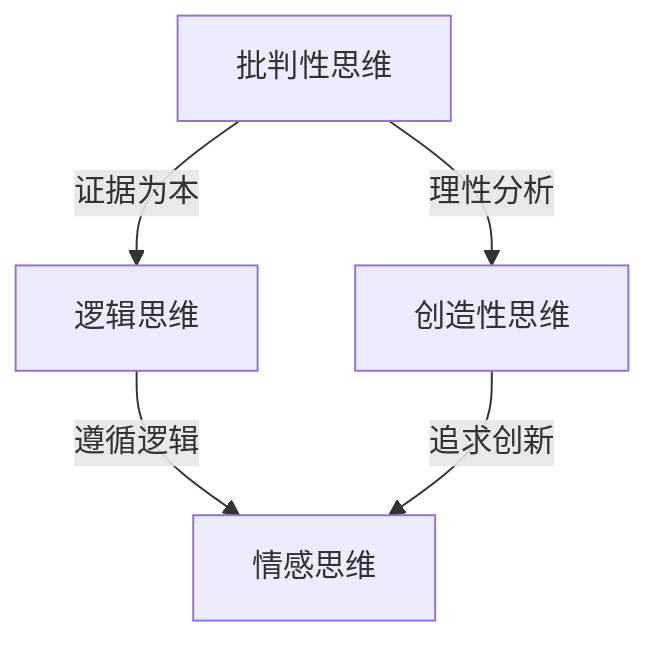

1. **与逻辑思维的区别**：逻辑思维主要关注推理的严谨性和正确性，而批判性思维更注重证据和理性分析。逻辑思维是批判性思维的一部分，但不是全部。
2. **与创造性思维的区别**：创造性思维主要关注创新和创造新想法，而批判性思维更注重分析和评价现有信息。虽然两者有时会结合使用，但它们的焦点和方法有所不同。
3. **与情感思维的区别**：情感思维主要基于情感和直觉进行决策，而批判性思维则强调理性分析和证据支持。情感思维可能会受到个人情绪的影响，而批判性思维则力求保持客观和中立。

通过以上讨论，我们可以看到批判性思维作为一种独立的思维方式，具有其独特的基本原则和区别。它不仅能够帮助我们更好地理解和评价信息，还能提高我们的判断力、决策力和问题解决能力。在接下来的章节中，我们将进一步探讨批判性思维的核心要素和应用场景。

### 2.2 批判性思维的基本要素

批判性思维不仅是一种思维方式，它还包含了一系列核心要素，这些要素共同作用，帮助我们更有效地分析、评估和推理信息。以下是批判性思维的基本要素，以及如何在实际应用中运用它们。

#### 2.2.1 提问技巧

提问技巧是批判性思维的基础，通过提出深入、有针对性的问题，我们可以揭示信息的实质和潜在的问题。以下是一些关键的提问技巧：

1. **开放性问题**：开放性问题鼓励更深入的讨论和思考，例如，“为什么这个观点是正确的？”而不是“这个观点对吗？”
2. **假设性问题**：假设性问题可以帮助我们探索不同的可能性，例如，“如果这个前提不成立，结论会怎样？”
3. **因果性问题**：因果性问题可以帮助我们理解事件之间的关联，例如，“这个事件是如何导致那个事件的？”
4. **澄清性问题**：澄清性问题可以帮助我们明确信息中的模糊部分，例如，“你能解释一下这个术语的含义吗？”

在实际应用中，我们可以通过以下步骤来运用提问技巧：

1. **识别关键问题**：在接收信息时，识别出需要解答的关键问题。
2. **提出问题**：根据识别出的关键问题，提出开放性、假设性、因果性和澄清性等问题。
3. **记录和反思**：记录提出的问题及其答案，并进行反思，以评估信息的可靠性和价值。

#### 2.2.2 分析技巧

分析技巧是批判性思维的核心要素之一，它包括对信息来源、作者意图、证据可靠性等方面的分析。以下是一些关键的步骤：

1. **信息来源分析**：评估信息来源的可靠性，例如，来源是否权威、是否具有偏见等。
2. **作者意图分析**：理解作者写作的意图，例如，作者是否试图说服、教育或娱乐读者等。
3. **证据可靠性分析**：评估证据的来源、质量和相关性，例如，数据是否可靠、引用是否准确等。

在实际应用中，我们可以通过以下步骤来运用分析技巧：

1. **收集信息**：从多个来源收集信息，以便进行全面的评估。
2. **评估来源**：对收集到的信息来源进行评估，确保其可靠性。
3. **分析意图**：理解作者的意图，以更好地理解信息的背景和目的。
4. **评估证据**：对证据进行详细的评估，确保其质量和相关性。

#### 2.2.3 评估证据

评估证据是批判性思维的重要环节，它包括对证据的可靠性、准确性和相关性的评估。以下是一些关键的步骤：

1. **证据可靠性评估**：评估证据的来源和制作过程，确保其可靠性和准确性。
2. **证据准确性评估**：验证证据是否准确反映了事实，没有误导或偏差。
3. **证据相关性评估**：评估证据与问题或主题的相关性，确保其适用于当前的分析。

在实际应用中，我们可以通过以下步骤来运用评估证据：

1. **收集证据**：从多个可靠的来源收集相关证据。
2. **验证证据**：验证证据的来源和准确性。
3. **评估证据**：评估证据的相关性和可靠性。
4. **整合证据**：将评估后的证据整合到分析中，以支持结论。

#### 2.2.4 逻辑推理

逻辑推理是批判性思维的核心要素之一，它包括使用逻辑规则和论证技巧来推理和证明观点。以下是一些关键的逻辑推理技巧：

1. **演绎推理**：从一般原则推导出特定结论，例如，“所有人都会死亡，苏格拉底是人，所以苏格拉底会死亡。”
2. **归纳推理**：从特定实例推导出一般性结论，例如，“所有观察到的天鹅都是白色的，所以所有天鹅都是白色的。”
3. **论证技巧**：使用证据和逻辑规则来构建论证，例如，使用对比论证、因果论证、类比论证等。

在实际应用中，我们可以通过以下步骤来运用逻辑推理：

1. **构建论证**：使用证据和逻辑规则构建论证。
2. **评估论证**：评估论证的有效性和逻辑性，确保没有逻辑谬误。
3. **反驳和修正**：识别和反驳反对意见，修正论证中的不足。

#### 2.2.5 综合应用

批判性思维的基本要素是相互关联、相互支持的。在实际应用中，我们需要将提问技巧、分析技巧、评估证据和逻辑推理综合运用，以更全面、准确地分析信息。

1. **提出问题**：通过提问技巧，识别和分析信息中的关键问题。
2. **收集和分析信息**：通过分析技巧，评估信息来源、作者意图和证据可靠性。
3. **评估证据**：通过评估证据，确保证据的可靠性和相关性。
4. **逻辑推理**：通过逻辑推理，构建和评估论证的有效性。

通过综合运用批判性思维的基本要素，我们可以更有效地分析、评估和推理信息，提高判断力和决策力。在接下来的章节中，我们将进一步探讨批判性思维的应用场景和培养方法。

### 2.3 批判性思维与创造性思维的关系

批判性思维和创造性思维是两种截然不同的思维方式，但它们在实际应用中往往是相辅相成的。理解两者之间的关系有助于我们更全面地培养和运用批判性思维。

#### 2.3.1 批判性思维与创造性思维的异同

1. **定义与特点**：
   - **批判性思维**：批判性思维是一种基于证据和逻辑的思维方式，它强调对信息进行深入的分析和评价。其核心在于质疑、评估和推理。
   - **创造性思维**：创造性思维则是一种产生新想法、新观点和解决方案的思维方式，它侧重于创新、想象和探索。

2. **目的与应用**：
   - **批判性思维**：批判性思维的主要目的是评估现有信息、观点和理论，发现潜在的问题和矛盾，从而提高判断力和决策力。
   - **创造性思维**：创造性思维的主要目的是产生新的想法、概念和解决方案，推动创新和进步。

尽管批判性思维和创造性思维在定义和目的上有所不同，但它们在实际应用中往往是相互关联的。

#### 2.3.2 如何在批判性思维中融入创造性思维

1. **质疑与创新**：
   - 批判性思维鼓励我们质疑现有的观点和理论，这本身就是一种创新的体现。通过批判性思维，我们可以发现现有知识中的不足和局限，从而激发新的思考和创意。
   - **实例**：在科学研究中，批判性思维可以帮助科学家发现现有理论中的问题，从而激发新的研究方向和假设。

2. **探索与创造**：
   - 批判性思维不仅关注现有信息，还关注信息的背景和上下文。这种全面的分析有助于我们更深入地理解问题，从而在创造性思维中找到新的解决方案。
   - **实例**：在解决复杂问题时，批判性思维可以帮助我们识别问题的关键要素，从而在创造性思维中找到创新的解决方案。

3. **反思与改进**：
   - 创造性思维产生的新想法和方案需要通过批判性思维进行评估和改进。这种反思性的过程可以帮助我们优化新想法，确保其可行性和有效性。
   - **实例**：在产品设计过程中，创造性思维可以产生新的设计方案，而批判性思维则可以帮助评估这些设计的优点和不足，从而进行改进。

#### 2.3.3 批判性思维在创造性思维培养中的作用

1. **提高问题识别能力**：
   - 通过批判性思维，我们可以更好地识别和定义问题，从而为创造性思维提供明确的出发点。
   - **实例**：在产品开发中，批判性思维可以帮助团队识别用户需求中的潜在问题，从而激发新的设计灵感。

2. **促进深度思考**：
   - 批判性思维鼓励我们深入分析和思考，这有助于我们在创造性思维中找到更具创新性的解决方案。
   - **实例**：在艺术创作中，批判性思维可以帮助艺术家深入分析主题和情感，从而创作出更具深度的作品。

3. **培养质疑精神**：
   - 批判性思维培养我们的质疑精神，这有助于我们在创造性思维中保持开放和探索的心态，不断尝试新的想法和方案。
   - **实例**：在创新项目中，批判性思维可以帮助团队质疑现有方法，尝试新的解决方案，从而推动项目的进展。

总之，批判性思维和创造性思维是两种互补的思维方式。通过将批判性思维融入创造性思维，我们可以提高问题识别能力、促进深度思考、培养质疑精神，从而在信息过载的时代中更好地应对各种挑战。在接下来的章节中，我们将进一步探讨如何在实际生活中应用批判性思维。

### 第三部分：批判性思维在科学研究中的应用

批判性思维在科学研究中的应用是至关重要的，它能够帮助科学家们更好地进行科学探究，确保研究的有效性和可靠性。在科学研究中，批判性思维体现在提出问题、设计实验、数据分析、结论形成等多个环节。

#### 3.1.1 科学研究的批判性思维应用

科学研究是一个复杂的过程，涉及多个步骤。以下是一个简单的Mermaid流程图，展示了批判性思维在科学研究中的应用：

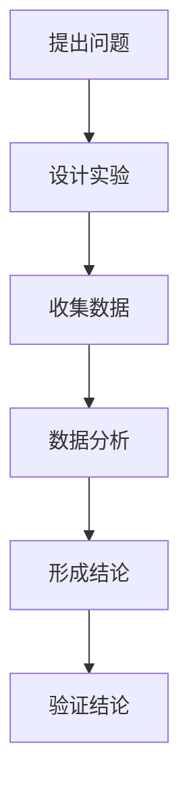

1. **提出问题**：科学研究从提出问题开始。批判性思维要求科学家们明确研究问题，并对其进行深入的理解和定义。这有助于确保研究目标的明确性和针对性。
2. **设计实验**：在明确了研究问题后，科学家需要设计实验来验证假设。批判性思维在这一步骤中用于评估实验设计的合理性和有效性，确保实验能够产生可靠的数据。
3. **收集数据**：实验设计完成后，科学家开始收集数据。批判性思维在这一步骤中用于评估数据的可靠性和完整性，确保数据的真实性和有效性。
4. **数据分析**：在收集到数据后，科学家需要进行数据分析。批判性思维在这一步骤中用于评估数据分析方法的选择和数据解释的合理性，确保数据的解释符合实际。
5. **形成结论**：在分析数据后，科学家需要形成结论。批判性思维在这一步骤中用于评估结论的合理性和证据的支持程度，确保结论的可靠性和有效性。
6. **验证结论**：最后，科学家需要验证结论。批判性思维在这一步骤中用于评估研究的可重复性和对其他研究的启示，确保结论的广泛适用性。

#### 3.1.2 科学传播中的批判性思维应用

科学传播是将科学研究成果传播给公众的重要途径，而批判性思维在科学传播中同样发挥着重要作用。以下是一个简单的Mermaid流程图，展示了批判性思维在科学传播中的应用：

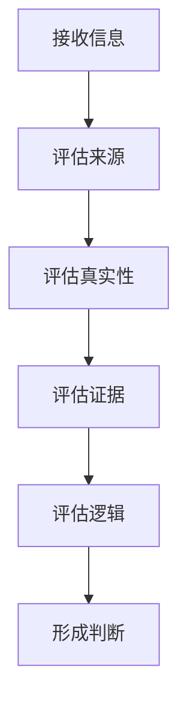

1. **接收信息**：公众首先需要接收科学传播的信息，这可能来自学术论文、科普文章、新闻报道等。
2. **评估来源**：在接收信息后，公众需要评估信息的来源。批判性思维在这一步骤中用于评估信息源的可靠性，如信息的发布机构是否权威、作者是否具备专业知识等。
3. **评估真实性**：在确定了信息来源后，公众需要评估信息的真实性。批判性思维在这一步骤中用于识别虚假信息和误导性信息，确保信息的真实性。
4. **评估证据**：公众需要评估信息的证据支持程度。批判性思维在这一步骤中用于评估证据的来源、质量和相关性，确保证据的可靠性。
5. **评估逻辑**：在评估证据后，公众需要评估信息的逻辑性。批判性思维在这一步骤中用于识别逻辑谬误和论证缺陷，确保信息的逻辑性。
6. **形成判断**：在评估了信息的真实性、证据和逻辑后，公众需要形成自己的判断。批判性思维在这一步骤中用于评估信息的整体价值和可信度。

#### 3.1.3 科学决策中的批判性思维应用

科学决策是将科学研究应用于实际问题的过程，而批判性思维在科学决策中同样发挥着重要作用。以下是一个简单的Mermaid流程图，展示了批判性思维在科学决策中的应用：

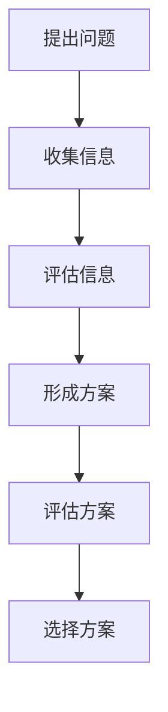

1. **提出问题**：科学决策从提出问题开始。批判性思维在这一步骤中用于明确决策问题，确保问题的明确性和针对性。
2. **收集信息**：在明确了决策问题后，决策者需要收集相关的信息。批判性思维在这一步骤中用于评估信息的来源、质量和相关性，确保信息的可靠性和完整性。
3. **评估信息**：在收集到信息后，决策者需要对信息进行评估。批判性思维在这一步骤中用于评估信息的真实性、可靠性和逻辑性，确保信息能够支持决策。
4. **形成方案**：在评估信息后，决策者需要形成多个可能的方案。批判性思维在这一步骤中用于评估方案的创新性和可行性，确保方案的有效性。
5. **评估方案**：在形成多个方案后，决策者需要对方案进行评估。批判性思维在这一步骤中用于评估方案的成本、风险和预期效果，确保方案的最优性。
6. **选择方案**：最后，决策者需要选择最优的方案。批判性思维在这一步骤中用于评估方案的可行性和可持续性，确保最终决策的科学性和合理性。

总之，批判性思维在科学研究中的应用是全方位的，从提出问题、设计实验、数据分析，到科学传播、决策评估，批判性思维贯穿整个科学探究过程。通过批判性思维，科学家们能够确保科学研究的有效性和可靠性，公众能够更好地理解和应用科学成果，决策者能够做出更加科学和合理的决策。

### 第四部分：批判性思维在教育领域的应用

批判性思维在教育领域具有重要的应用价值，它不仅能够提升学生的学术能力，还能培养他们的独立思考和问题解决能力。以下将详细探讨批判性思维在教育领域的应用，包括教学中的批判性思维培养、学生在学习中的批判性思维应用，以及教育评价中的批判性思维应用。

#### 4.1 教学中的批判性思维培养

教师在教学中运用批判性思维，可以帮助学生更好地理解和掌握知识。以下是一个简单的Mermaid流程图，展示了批判性思维在教学中的培养过程：

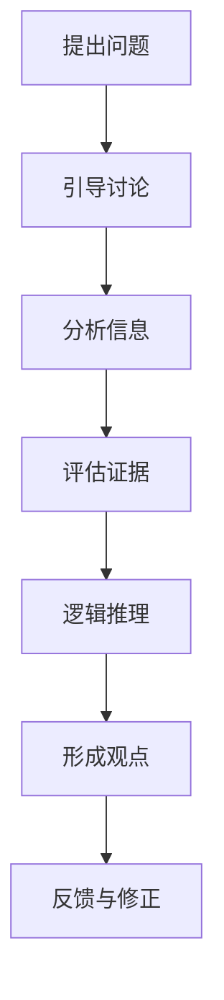

1. **提出问题**：在教学过程中，教师可以提出开放性问题，激发学生的思考和讨论。
2. **引导讨论**：通过引导讨论，教师可以帮助学生深入理解问题，并在讨论中培养批判性思维。
3. **分析信息**：教师引导学生分析信息，评估信息的来源、质量和相关性，确保学生对信息有全面的理解。
4. **评估证据**：在分析信息后，教师引导学生评估证据的可靠性，确保他们能够识别和利用真实、可靠的信息。
5. **逻辑推理**：教师引导学生运用逻辑推理，构建合理的论证，确保他们的观点和结论是合理的。
6. **形成观点**：在逻辑推理的基础上，教师引导学生形成自己的观点，并通过讨论和反思不断完善。
7. **反馈与修正**：教师对学生的观点进行反馈和修正，帮助他们识别和纠正思维中的错误，提高批判性思维能力。

#### 4.2 学生学习中的批判性思维应用

学生在学习过程中，运用批判性思维可以提升学习效果和学术能力。以下是一个简单的Mermaid流程图，展示了学生在学习中的批判性思维应用：

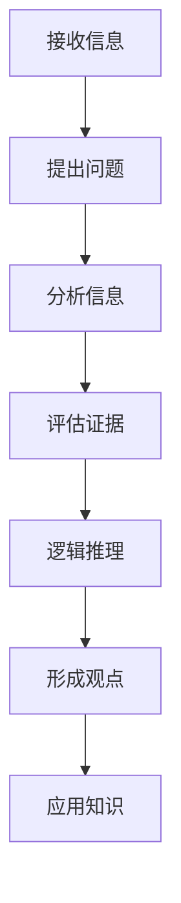

1. **接收信息**：学生在学习过程中接收到的信息可能包括教材、讲座、网络资源等。
2. **提出问题**：学生在接收信息后，通过提出问题，深入理解信息，促进思考。
3. **分析信息**：学生分析信息的来源、质量和相关性，确保信息的可靠性和价值。
4. **评估证据**：学生在分析信息后，评估证据的可靠性，确保其能够支持自己的观点。
5. **逻辑推理**：学生运用逻辑推理，构建合理的论证，确保观点的合理性。
6. **形成观点**：在逻辑推理的基础上，学生形成自己的观点，并通过讨论和反思不断完善。
7. **应用知识**：学生将所学知识应用于实际问题中，通过批判性思维解决实际问题。

#### 4.3 教育评价中的批判性思维应用

教育评价是检验学生学习效果的重要环节，而批判性思维在评价中的应用能够更全面、准确地评估学生的能力。以下是一个简单的Mermaid流程图，展示了批判性思维在教育评价中的应用：

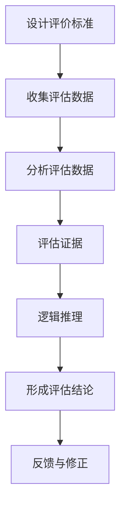

1. **设计评价标准**：教育评价从设计评价标准开始，这些标准应体现批判性思维的要求，如逻辑性、证据支持、创新性等。
2. **收集评估数据**：在评价过程中，收集相关的评估数据，如学生的作业、论文、测试成绩等。
3. **分析评估数据**：对收集到的评估数据进行分析，评估其质量和相关性。
4. **评估证据**：在分析评估数据后，评估证据的可靠性，确保其能够支持评估结论。
5. **逻辑推理**：运用逻辑推理，对评估数据进行分析和综合，形成评估结论。
6. **形成评估结论**：在逻辑推理的基础上，形成评估结论，确保结论的合理性和准确性。
7. **反馈与修正**：根据评估结论，给予学生反馈，帮助他们识别和纠正思维中的错误，提高批判性思维能力。

通过以上讨论，我们可以看到批判性思维在教育领域的广泛应用。在教学、学习和评价中，批判性思维不仅能够提升学术能力，还能培养学生的独立思考和问题解决能力。在接下来的章节中，我们将进一步探讨批判性思维在媒体和信息传播中的应用。

### 4.4 批判性思维在媒体和信息传播中的应用

在媒体和信息传播领域，批判性思维的重要性不言而喻。随着社交媒体的兴起和信息的快速传播，公众需要具备批判性思维的能力，以便识别和评估信息源的可靠性、证据的真实性以及逻辑推理的有效性。以下是一个简单的Mermaid流程图，展示了批判性思维在媒体和信息传播中的应用：

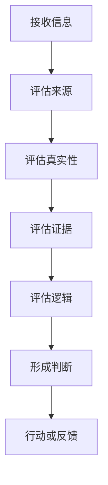

1. **接收信息**：公众首先需要接收信息，这可能来自社交媒体、新闻报道、博客等各种信息源。
2. **评估来源**：在接收信息后，公众需要评估信息的来源。批判性思维在这一步骤中用于评估信息源的可靠性，例如，信息来源是否权威、是否具有偏见等。
3. **评估真实性**：在确定了信息来源后，公众需要评估信息的真实性。批判性思维在这一步骤中用于识别虚假信息和误导性信息，确保信息的真实性。
4. **评估证据**：公众需要评估信息的证据支持程度。批判性思维在这一步骤中用于评估证据的来源、质量和相关性，确保证据的可靠性。
5. **评估逻辑**：在评估证据后，公众需要评估信息的逻辑性。批判性思维在这一步骤中用于识别逻辑谬误和论证缺陷，确保信息的逻辑性。
6. **形成判断**：在评估了信息的真实性、证据和逻辑后，公众需要形成自己的判断。批判性思维在这一步骤中用于评估信息的整体价值和可信度。
7. **行动或反馈**：根据自己的判断，公众可以采取行动，如分享真实信息、提出质疑或进行进一步的调查，或者反馈给信息源，促使其改进。

#### 4.4.1 媒体素养与批判性思维的培养

为了提升公众的媒体素养，培养批判性思维是关键。以下是一些具体的培养方法和策略：

1. **信息素养教育**：在学校和社区中推广信息素养教育，帮助学生和公众了解信息来源、评估信息真实性和逻辑性的方法。
2. **批判性思维课程**：开设批判性思维课程，教授学生如何提出问题、分析信息、评估证据和进行逻辑推理。
3. **案例分析和讨论**：通过分析真实案例，讨论如何应用批判性思维识别虚假信息和逻辑谬误。
4. **媒体批判性评估**：鼓励公众对媒体内容进行批判性评估，提出问题、质疑观点，提高信息筛选和分析能力。
5. **跨学科学习**：将批判性思维与其他学科知识相结合，如社会学、心理学、逻辑学等，提高综合分析和判断能力。

#### 4.4.2 批判性思维在社交媒体中的应用

社交媒体是信息传播的主要平台之一，公众在社交媒体上接收到的信息量巨大，因此培养批判性思维尤为重要。以下是一些具体的应用策略：

1. **识别偏见和虚假信息**：通过批判性思维，识别社交媒体上的偏见和虚假信息，避免被误导。
2. **评估信息来源**：在转发或评论信息前，评估信息来源的可靠性，确保信息的真实性。
3. **逻辑推理**：对社交媒体上的信息进行逻辑推理，识别逻辑谬误和论证缺陷。
4. **质疑观点**：对社交媒体上的观点进行质疑，通过提问和讨论，深入理解问题。
5. **分享真实信息**：在社交媒体上分享真实、可靠的信息，提高公众的信息素养。

总之，批判性思维在媒体和信息传播中的应用至关重要。通过培养批判性思维，公众可以更好地识别和评估信息，提高媒体素养，减少误解和误导，促进信息社会的健康发展。

### 第五部分：培养批判性思维的方法和策略

批判性思维不是与生俱来的能力，而是可以通过系统的训练和实践逐渐培养和提升的。以下是一些有效的方法和策略，帮助我们在日常生活中培养批判性思维。

#### 5.1 提问技巧

提问技巧是批判性思维的基础，通过提出高质量的问题，我们可以引导思维走向深入，发现问题的本质。以下是一些具体的提问技巧：

1. **开放性提问**：开放性问题鼓励更深入的讨论和思考，例如，“为什么这个观点是正确的？”而不是“这个观点对吗？”
2. **假设性提问**：假设性提问可以帮助我们探索不同的可能性，例如，“如果这个前提不成立，结论会怎样？”
3. **因果性提问**：因果性提问可以帮助我们理解事件之间的关联，例如，“这个事件是如何导致那个事件的？”
4. **澄清性提问**：澄清性提问可以帮助我们明确信息中的模糊部分，例如，“你能解释一下这个术语的含义吗？”

在实际应用中，我们可以通过以下步骤来运用提问技巧：

1. **识别关键问题**：在接收信息时，识别出需要解答的关键问题。
2. **提出问题**：根据识别出的关键问题，提出开放性、假设性、因果性和澄清性等问题。
3. **记录和反思**：记录提出的问题及其答案，并进行反思，以评估信息的可靠性和价值。

#### 5.2 分析技巧

分析技巧是批判性思维的核心要素之一，它包括对信息来源、作者意图、证据可靠性等方面的分析。以下是一些关键的步骤：

1. **信息来源分析**：评估信息来源的可靠性，例如，来源是否权威、是否具有偏见等。
2. **作者意图分析**：理解作者写作的意图，例如，作者是否试图说服、教育或娱乐读者等。
3. **证据可靠性分析**：评估证据的来源、质量和相关性，例如，数据是否可靠、引用是否准确等。

在实际应用中，我们可以通过以下步骤来运用分析技巧：

1. **收集信息**：从多个来源收集信息，以便进行全面的评估。
2. **评估来源**：对收集到的信息来源进行评估，确保其可靠性。
3. **分析意图**：理解作者的意图，以更好地理解信息的背景和目的。
4. **评估证据**：对证据进行详细的评估，确保其质量和相关性。
5. **整合信息**：将评估后的信息整合到分析中，以支持结论。

#### 5.3 评估证据

评估证据是批判性思维的重要环节，它包括对证据的可靠性、准确性和相关性的评估。以下是一些关键的步骤：

1. **证据可靠性评估**：评估证据的来源和制作过程，确保其可靠性和准确性。
2. **证据准确性评估**：验证证据是否准确反映了事实，没有误导或偏差。
3. **证据相关性评估**：评估证据与问题或主题的相关性，确保其适用于当前的分析。

在实际应用中，我们可以通过以下步骤来运用评估证据：

1. **收集证据**：从多个可靠的来源收集相关证据。
2. **验证证据**：验证证据的来源和准确性。
3. **评估证据**：评估证据的相关性和可靠性。
4. **整合证据**：将评估后的证据整合到分析中，以支持结论。

#### 5.4 逻辑推理

逻辑推理是批判性思维的核心要素之一，它包括使用逻辑规则和论证技巧来推理和证明观点。以下是一些关键的逻辑推理技巧：

1. **演绎推理**：从一般原则推导出特定结论，例如，“所有人都会死亡，苏格拉底是人，所以苏格拉底会死亡。”
2. **归纳推理**：从特定实例推导出一般性结论，例如，“所有观察到的天鹅都是白色的，所以所有天鹅都是白色的。”
3. **论证技巧**：使用证据和逻辑规则来构建论证，例如，使用对比论证、因果论证、类比论证等。

在实际应用中，我们可以通过以下步骤来运用逻辑推理：

1. **构建论证**：使用证据和逻辑规则构建论证。
2. **评估论证**：评估论证的有效性和逻辑性，确保没有逻辑谬误。
3. **反驳和修正**：识别和反驳反对意见，修正论证中的不足。

#### 5.5 综合应用

批判性思维的基本要素是相互关联、相互支持的。在实际应用中，我们需要将提问技巧、分析技巧、评估证据和逻辑推理综合运用，以更全面、准确地分析信息。

1. **提出问题**：通过提问技巧，识别和分析信息中的关键问题。
2. **收集和分析信息**：通过分析技巧，评估信息来源、作者意图和证据可靠性。
3. **评估证据**：通过评估证据，确保证据的可靠性和相关性。
4. **逻辑推理**：通过逻辑推理，构建和评估论证的有效性。

通过综合运用批判性思维的基本要素，我们可以更有效地分析、评估和推理信息，提高判断力和决策力。在接下来的章节中，我们将进一步探讨批判性思维在不同领域的具体应用。

### 5.6 实战练习与案例分析

为了更好地理解和应用批判性思维，我们需要通过实际案例和练习来深化我们的理解。以下是一个具体的案例分析，展示如何在实际问题中运用批判性思维。

#### 案例背景

假设你是一名科技公司的新员工，公司正在开发一款新的社交媒体应用，名为“社交媒体X”。作为团队成员，你需要对项目进行批判性评估，并提出改进建议。

#### 分析步骤

1. **提出问题**
   - 这个社交媒体应用的主要目标用户是谁？
   - 应用有哪些核心功能？
   - 市场上现有的类似应用有哪些优缺点？
   - 项目的预算和时间表是否合理？

2. **收集信息**
   - 调查市场研究报告，了解目标用户群体的特征和需求。
   - 分析竞争对手的应用，总结其优点和不足。
   - 与团队成员讨论，收集项目计划和预算的信息。

3. **评估信息**
   - 评估市场报告的可靠性和权威性，确认其数据来源。
   - 分析竞争对手应用的优点和不足，评估其对我的应用的启示。
   - 根据项目计划和预算的信息，评估项目的可行性和合理性。

4. **逻辑推理**
   - 根据收集到的信息，推导出应用的目标用户群体应该是谁，以及应用应具备的核心功能。
   - 推导出如何在竞争对手的基础上进行改进，以增加应用的市场竞争力。
   - 评估项目计划和预算的合理性，提出调整建议。

5. **形成观点**
   - 根据逻辑推理的结果，提出具体的改进建议，如调整目标用户群体、优化核心功能、降低成本等。

6. **行动或反馈**
   - 将改进建议提交给项目团队，参与讨论和决策。
   - 跟进项目的进展，确保改进措施得到有效实施。

#### 案例分析

在这个案例中，我们通过批判性思维对社交媒体应用项目进行了全面的分析和评估。以下是具体的分析步骤：

1. **提出问题**
   - 通过提问，我们明确了评估的重点，包括目标用户、核心功能、竞争对手和市场预算等。
   - 提出的问题引导我们深入思考，确保评估的全面性和针对性。

2. **收集信息**
   - 收集了市场研究报告、竞争对手分析报告以及项目计划和预算等信息，为评估提供了基础。
   - 通过多渠道收集信息，确保评估的客观性和准确性。

3. **评估信息**
   - 评估了市场报告的可靠性，确认其数据来源的权威性和准确性。
   - 分析了竞争对手应用的优缺点，从中获得了有价值的参考。
   - 评估了项目计划和预算的合理性，为项目的顺利实施提供了保障。

4. **逻辑推理**
   - 根据收集到的信息，推导出应用的目标用户群体应该是年轻人，他们需要快速便捷地获取和分享信息。
   - 推导出应用应具备的核心功能包括即时消息、图片和视频分享、朋友圈等。
   - 提出了在竞争对手的基础上进行改进的建议，如增加隐私保护功能、优化用户界面等。

5. **形成观点**
   - 根据逻辑推理的结果，我们提出了具体的改进建议，确保项目能够更好地满足用户需求，提高市场竞争力。

6. **行动或反馈**
   - 将改进建议提交给项目团队，参与讨论和决策，确保建议得到充分讨论和评估。
   - 跟进项目的进展，确保改进措施得到有效实施，并为后续的项目提供经验。

通过这个案例分析，我们可以看到批判性思维在解决实际问题时的重要作用。它不仅帮助我们全面分析问题，还能提高我们的决策能力和问题解决能力。在接下来的章节中，我们将继续探讨批判性思维在各个领域的应用。

### 5.7 培养批判性思维的最佳实践

要有效地培养批判性思维，不仅需要理论知识的掌握，还需要结合实际应用，通过一系列最佳实践来巩固和提升这一能力。以下是一些最佳实践，可以帮助我们在日常工作和学习中培养批判性思维。

#### 5.7.1 最佳实践 Tips

1. **定期阅读**：阅读是培养批判性思维的重要途径。定期阅读不同领域的书籍、文章和报告，有助于拓展视野，提升分析问题的能力。
2. **提问和讨论**：在阅读和学习过程中，不断提出问题，并积极参与讨论。提问和讨论可以帮助我们更深入地思考，发现问题的多个角度。
3. **反思与自我评估**：定期对自己的思维过程进行反思和自我评估，识别并纠正思维中的错误。这种自我批判有助于我们不断提升思维质量。
4. **多样化的信息源**：获取信息的渠道应多样化，避免单一信息源的偏见。通过多渠道获取信息，可以更好地评估信息的真实性和可靠性。
5. **练习批判性写作**：通过写作练习，如写书评、文章或评论，我们可以系统地整理和表达自己的思维过程，提升批判性思维能力。

#### 5.7.2 注意事项

1. **避免偏见和成见**：在培养批判性思维时，要特别注意避免个人偏见和成见。保持开放的心态，接受不同的观点和证据，是批判性思维的重要前提。
2. **注重证据和逻辑**：在分析问题时，始终注重证据和逻辑。缺乏证据支持的结论往往是不可信的，逻辑谬误也会削弱论证的有效性。
3. **持续学习和实践**：批判性思维不是一蹴而就的，需要通过持续的学习和实践来不断提升。勇于面对挑战，不断练习和反思，是培养批判性思维的关键。

#### 5.7.3 拓展阅读

1. **《批判性思维工具箱》**：这本书提供了大量实用的批判性思维工具和方法，帮助读者在日常生活和工作中应用批判性思维。
2. **《如何阅读一本书》**：莫提默·J. 艾德勒的这本书详细介绍了如何通过阅读培养批判性思维，是阅读和思维技巧的指南。
3. **《思考，快与慢》**：丹尼尔·卡尼曼的这本书通过丰富的实例，阐述了人类思维的两种模式：快速的、本能的思考和缓慢的、理性的思考，对理解批判性思维有很大帮助。

通过以上最佳实践、注意事项和拓展阅读，我们可以更系统地培养批判性思维，提高自己在信息时代的应对能力和综合素质。在接下来的章节中，我们将对全文进行总结，并展望批判性思维的未来发展趋势。

### 总结

在信息过载的时代，批判性思维的重要性不言而喻。本文首先介绍了信息过载的现象及其对个人和社会的深远影响，然后定义了批判性思维，阐述了其核心概念和要素，如提问技巧、分析技巧、评估证据和逻辑推理。接下来，我们讨论了批判性思维在科学研究、教育领域和媒体信息传播中的应用，并通过具体案例展示了如何在实际问题中应用批判性思维。此外，我们还探讨了培养批判性思维的最佳实践和注意事项，并提供了一系列拓展阅读资源。

批判性思维不仅能够帮助我们更好地理解和处理信息，还能提高我们的判断力、决策力和问题解决能力。在信息爆炸的时代，培养批判性思维是应对信息挑战、提升自身竞争力的重要策略。通过批判性思维，我们可以更有效地筛选和处理信息，避免被冗余信息所淹没，从而在复杂的环境中立足自身，不断前行。

### 展望

随着信息技术的不断发展，信息过载的现象将日益严重，而批判性思维的作用也将愈发突出。未来，批判性思维有望在以下几个方面得到进一步的发展：

1. **跨学科融合**：批判性思维将与其他学科如心理学、教育学、社会学等深度融合，形成跨学科的研究和应用体系，从而更全面地提升我们的思维能力。
2. **智能化工具**：随着人工智能技术的发展，我们将有更多的智能化工具辅助我们进行批判性思维，如自动化证据评估、逻辑推理工具等，这将大大提升批判性思维的应用效率和效果。
3. **普及教育**：批判性思维将成为教育的重要组成部分，从小学到大学，都将开设专门的批判性思维课程，以培养下一代的批判性思维能力。
4. **社会应用**：批判性思维将在社会治理、政策制定、公共决策等社会领域发挥重要作用，帮助公众更理性地参与社会事务，提高社会的整体决策水平。

总之，批判性思维在未来的发展中具有巨大的潜力和广阔的应用前景。通过不断培养和提升批判性思维，我们将在信息过载的时代中游刃有余，实现个人的全面发展和社会的和谐进步。

### 致谢

在本篇技术博客的撰写过程中，我受到了许多人的帮助和启发。首先要感谢AI天才研究院（AI Genius Institute）的团队，他们提供了宝贵的资源和指导，使我能够深入探讨批判性思维在信息技术领域的应用。同时，我要感谢《禅与计算机程序设计艺术》（Zen And The Art of Computer Programming）的作者，他的著作对我理解和阐述批判性思维在编程和软件开发中的应用有着重要的影响。

此外，我还要感谢所有参与讨论和提供反馈的读者和朋友，他们的宝贵意见和批评帮助我不断完善和提升这篇文章的质量。最后，我要特别感谢我的家人和同事，他们的支持和鼓励是我坚持和努力的动力源泉。

再次感谢所有为本文贡献智慧和力量的人们，愿我们共同在信息时代的浪潮中，不断提升自己的批判性思维，迎接未来的挑战。作者：AI天才研究院/AI Genius Institute & 禅与计算机程序设计艺术/Zen And The Art of Computer Programming。

