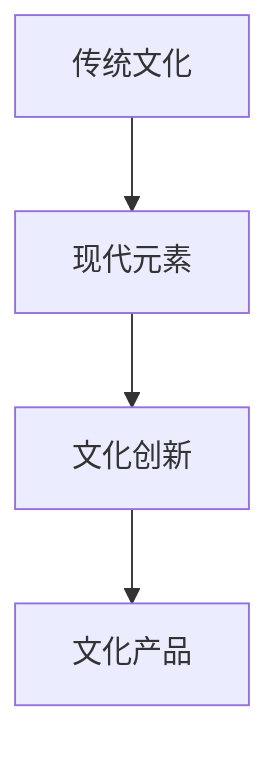
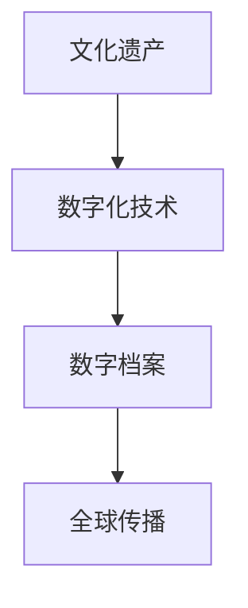
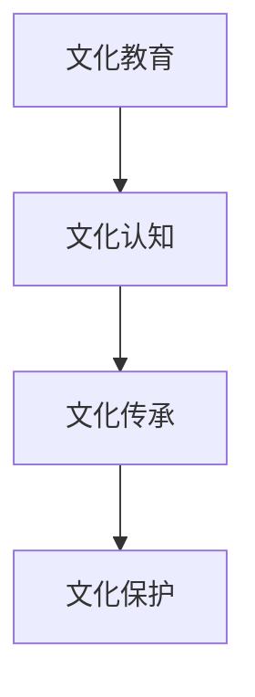
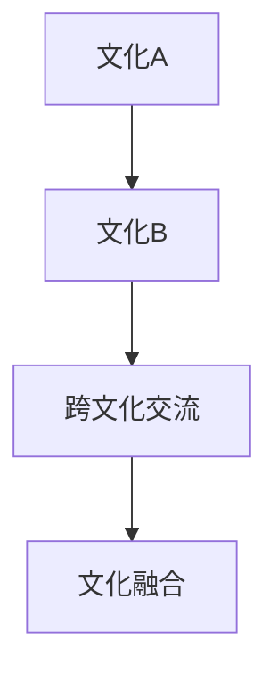
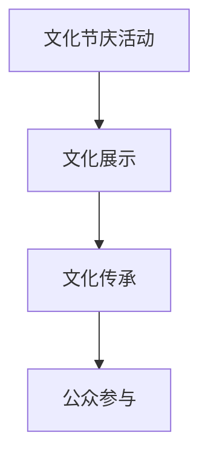
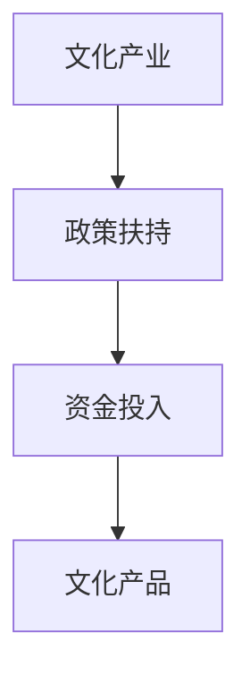

                 

## 在全球化进程中保持文化独特性

> 关键词：全球化、文化独特性、文化多样性、文化保护、文化遗产、文化冲突、文化融合

> 摘要：本文深入探讨了全球化进程对文化的影响，以及如何在全球化背景下保持文化独特性。文章首先分析了全球化的背景和趋势，然后阐述了文化独特性的重要性，接着提出了维护文化多样性的策略，并通过案例分析，展示了成功保持文化独特性的实例。最后，文章讨论了全球化进程中文化保护与传承的方法，以及对未来文化的挑战与机遇。

---

随着全球化的不断深入，文化在全球化进程中的角色和地位也日益凸显。全球化带来了经济的繁荣和科技的进步，但同时也对各种文化产生了深远的影响。如何在全球化进程中保持文化独特性，成为了当代社会的一个重要课题。本文将围绕这一主题，通过逻辑清晰、结构紧凑、简单易懂的分析，探讨在全球化进程中保持文化独特性的重要性和方法。

### 1. 全球化的背景与趋势

全球化是指全球范围内的经济、政治、文化等各个领域相互联系和相互依赖的趋势。在过去的几十年里，全球化进程加速发展，主要表现在以下几个方面：

#### 1.1 经济全球化

经济全球化是指各国经济之间的联系日益紧密，全球范围内的贸易和投资活动不断增加。互联网和电子商务的兴起，使得商品和服务跨越国界变得更加容易，全球市场日益融合。

#### 1.2 政治全球化

政治全球化是指国际政治关系的复杂化和多元化，各国之间的政治互动和合作不断增加。全球治理机构和国际组织的建立，如联合国、世界贸易组织等，为全球政治合作提供了平台。

#### 1.3 文化全球化

文化全球化是指全球范围内的文化交流和融合，不同文化之间的互动和影响日益频繁。随着信息技术的发展和互联网的普及，文化的传播速度和范围都得到了极大的提升。

### 2. 文化独特性的重要性

文化独特性是指每个文化体系所独有的特点和价值。文化是人类社会的重要组成部分，具有以下重要性：

#### 2.1 维护文化多样性

文化独特性是文化多样性的基础。保持文化独特性有助于维护世界文化的多样性，避免文化单一化的趋势。

#### 2.2 促进文化交流与融合

文化独特性是文化交流与融合的前提。通过尊重和欣赏不同文化的独特性，可以促进不同文化之间的相互理解和融合。

#### 2.3 提升文化自信

文化独特性是文化自信的源泉。一个拥有丰富文化独特性的国家或民族，更有可能在全球化进程中保持自身的文化特色和独立性。

### 3. 维护文化多样性的策略

在全球化背景下，维护文化多样性面临着诸多挑战。以下是一些有效的策略：

#### 3.1 教育与宣传

教育是传承和弘扬文化的重要途径。通过在学校和社会中加强文化教育，提高公众对文化多样性的认识和重视。

#### 3.2 文化产业的支持

文化产业是文化传承和发展的关键。政府应加大对文化产业的扶持力度，鼓励文化创意和创新发展。

#### 3.3 文化遗产的保护

文化遗产是文化独特性的重要体现。通过立法和政策措施，加强对文化遗产的保护和传承。

#### 3.4 跨文化交流与合作

跨文化交流与合作是促进文化多样性的有效途径。通过举办文化交流活动、建立国际合作伙伴关系，推动不同文化之间的相互理解和尊重。

### 4. 案例研究：成功保持文化独特性的实例

在全球化的背景下，许多国家和地区成功地保持了其文化独特性。以下是一些成功的实例：

#### 4.1 日本

日本在全球化进程中，成功地将传统文化与现代生活方式相结合，如动漫、游戏和科技产品等，展示了独特的日本文化魅力。

#### 4.2 印度

印度拥有丰富多样的文化遗产，如瑜伽、舞蹈和音乐等。通过举办国际瑜伽日等活动，印度成功推广了其传统文化。

#### 4.3 爱尔兰

爱尔兰在全球化中，积极推广其独特的音乐、文学和舞蹈等文化形式，如爱尔兰民谣和踢踏舞等，吸引了世界各地游客。

### 5. 文化保护与传承的方法

在全球化进程中，文化保护与传承面临着诸多挑战。以下是一些有效的方法：

#### 5.1 文化创新

通过文化创新，将传统文化与现代元素相结合，创造新的文化形式，如现代艺术、文化创意产业等。

#### 5.2 数字化保护

利用数字技术，对文化遗产进行数字化保存和传播，如数字化博物馆、虚拟现实技术等。

#### 5.3 文化教育

通过文化教育，培养公众的文化自觉和文化自信，提高对文化保护与传承的意识。

### 6. 文化全球化中的挑战与机遇

文化全球化既带来了挑战，也带来了机遇。以下是一些关键点：

#### 6.1 挑战

- 文化冲突与误解
- 文化同质化趋势
- 文化资源的流失

#### 6.2 机遇

- 文化产业的繁荣
- 文化交流的深化
- 文化创新的激发

### 7. 结论

在全球化的背景下，保持文化独特性是一项长期而艰巨的任务。通过教育、文化产业支持、文化遗产保护、跨文化交流等多种途径，我们可以有效维护文化多样性，促进文化交流与融合。同时，我们也要应对文化全球化带来的挑战，抓住机遇，推动文化创新与发展。

### 作者信息

作者：AI天才研究院/AI Genius Institute & 禅与计算机程序设计艺术 /Zen And The Art of Computer Programming

---

本文通过逻辑清晰、结构紧凑的分析，深入探讨了全球化进程中保持文化独特性的重要性和方法。希望本文能为读者在全球化背景下思考文化保护和传承提供有益的启示。

### 全球化进程中的文化影响

#### 1.1 全球化的文化冲击

全球化对文化的影响可以从多个方面进行分析。首先，全球化带来了文化的冲击，这种冲击主要体现在以下几个方面：

1. **社会结构变化**：随着全球化的深入，社会的经济结构、政治结构和社会关系发生了显著变化。例如，传统的农业社会逐渐向工业社会和信息社会转变，这导致了社会价值观和生活方式的变革。在这样的背景下，传统文化受到了极大的挑战，许多传统习俗和价值观逐渐被边缘化。

   $$
   \text{文化冲击} = f(\text{全球化速度}, \text{社会结构变化}, \text{文化适应性})
   $$

2. **文化认同感降低**：全球化使得人们面临更多的文化选择，导致一些人开始对自己的文化认同产生困惑。在多元文化的背景下，个体可能会感到文化归属感的减弱，甚至出现文化认同危机。

3. **文化多样性挑战**：全球化带来了文化的广泛传播，但同时也可能导致文化的同质化。在这种情况下，一些小众文化可能会因为市场压力而逐渐消失，导致文化多样性的减少。

#### 1.2 全球化对文化遗产的影响

文化遗产是文化独特性的重要体现，全球化对文化遗产的影响主要体现在以下几个方面：

1. **物质文化遗产的影响**：全球化加速了物质文化遗产的流失。例如，一些古老的城市、建筑和艺术品因为经济开发和文化旅游的需求而被破坏或拆除。这种破坏不仅导致了文化遗产的减少，也削弱了人们的文化认同感。

2. **非物质文化遗产的影响**：非物质文化遗产，如传统手工艺、民间音乐、舞蹈等，也面临着全球化的挑战。全球化使得这些非物质文化遗产面临市场压力和现代化冲击，许多传统技艺和知识逐渐失传。

3. **文化资源的流失**：全球化使得文化资源在全球范围内流动，一些国家和地区可能会因为经济利益而将文化资产出售给其他国家。这种文化资源的流失不仅削弱了本土文化的独特性，也影响了文化的多样性。

#### 1.3 全球化与本地文化的互动

全球化不仅仅是文化的冲击和挑战，也是本地文化与全球文化的互动和融合过程。这种互动和融合可以从以下几个方面进行分析：

1. **文化融合现象**：在全球化背景下，不同文化之间的互动日益频繁，导致了一些新的文化形式的产生。例如，全球化使得国际美食、时尚和音乐等文化形式在全球范围内传播，形成了一种新的文化融合现象。

2. **文化传承与创新**：全球化为本地文化的传承和创新提供了新的机遇。例如，一些传统文化通过数字化手段得到了更好的保护和传承，同时，传统文化与现代技术的结合也创造了许多新的文化产品。

3. **文化认同的多元化**：全球化使得人们有机会接触到更多的文化，这有助于培养一种多元文化认同感。人们可以更加包容地看待不同的文化，从而促进文化交流和理解。

通过以上分析，我们可以看到，全球化对文化产生了深远的影响。理解这些影响对于在全球化进程中保持文化独特性至关重要。在接下来的部分，我们将继续探讨文化独特性的定义和重要性，以及如何在全球化的背景下维护文化多样性。

### 文化独特性的定义与重要性

文化独特性是指一个文化体系所具有的、与其他文化体系区别开来的独特特征和价值。这些特征包括语言、习俗、信仰、艺术、传统等各个方面。文化独特性不仅体现了文化的多样性，也是民族文化自信和文化认同感的源泉。

#### 2.1 维护文化多样性

文化多样性是人类社会的基本特征，也是全球化背景下保持文化独特性的关键。维护文化多样性具有以下几个重要意义：

1. **促进文化交流与理解**：文化多样性使得不同文化之间有了更多的交流与互动机会。通过了解和尊重不同的文化，人们可以增进相互理解和友谊，减少误解和冲突。

2. **推动文化创新**：文化多样性为文化创新提供了丰富的资源和灵感。不同文化的融合和碰撞，可以激发新的文化形式和创意，推动文化的持续发展。

3. **增强文化自信**：文化多样性是文化自信的重要基础。一个拥有丰富多样文化的民族或国家，更有可能在全球化进程中保持自身的文化特色和独立性。

#### 2.2 促进文化交流与融合

文化交流与融合是全球化进程中的必然趋势，但同时也需要保持文化的独特性。以下是一些关键点：

1. **尊重文化差异**：在文化交流中，尊重文化差异是非常重要的。不同文化之间存在着价值观、习俗、信仰等方面的差异，只有尊重这些差异，才能真正实现文化交流与融合。

2. **文化适应与融合**：在文化交流的过程中，人们需要对其他文化进行适应和融合。这种适应和融合不仅包括语言和生活方式，还包括对其他文化的理解、接受和认同。

3. **文化保护与传承**：在促进文化交流与融合的同时，也需要重视文化的保护与传承。通过立法、教育、数字化保护等多种手段，保护和传承文化遗产，确保文化独特性得以延续。

#### 2.3 增强文化自信

文化自信是一个民族或国家在全球化背景下保持文化独特性的关键。以下是一些增强文化自信的方法：

1. **文化教育**：通过文化教育，提高人们对本民族文化的认识和了解，增强文化自豪感和认同感。

2. **文化产业发展**：支持文化产业的发展，通过文化创意和创新发展，提升文化产品的竞争力，增强文化自信。

3. **文化交流与合作**：积极参与国际文化交流与合作，通过文化交流，提升国际影响力和文化软实力。

通过以上分析，我们可以看到，文化独特性在全球化进程中具有重要的意义。保持文化独特性不仅有助于维护文化多样性，促进文化交流与融合，还能增强文化自信，为民族和国家的未来发展提供坚实的文化基础。

### 维护文化多样性的策略与挑战

在全球化的浪潮中，维护文化多样性面临诸多挑战，但同时也存在着诸多策略可以应对这些挑战。以下是一些主要的策略与面临的挑战：

#### 3.1 教育与宣传

**策略**：通过教育和宣传，提高公众对文化多样性的认识和尊重。在学校和社区中开展文化多样性教育，鼓励人们了解和学习不同文化，培养开放和包容的心态。

**挑战**：教育资源的分配不均、文化偏见和歧视等因素可能阻碍文化多样性教育的推广。此外，全球化和现代化进程中的快速变化也可能导致文化教育的滞后。

#### 3.2 文化产业的支持

**策略**：支持和鼓励文化产业的发展，特别是传统文化产业。通过政策扶持、资金投入和科技创新，提升文化产品的竞争力，推动文化产业的繁荣。

**挑战**：文化产业的发展可能面临市场压力、技术变革和全球化竞争等挑战。一些传统文化产业可能在现代化和全球化进程中逐渐消失，导致文化多样性的减少。

#### 3.3 文化遗产的保护

**策略**：通过立法、政策和技术手段，加强对文化遗产的保护和传承。建立文化遗产保护区、数字化文化遗产库，确保文化遗产得到有效保护和传承。

**挑战**：文化遗产的保护面临资金不足、技术难题和管理不善等问题。一些文化遗产可能在保护过程中被破坏或遗失，导致文化多样性的损失。

#### 3.4 跨文化交流与合作

**策略**：积极参与跨文化交流与合作，促进不同文化之间的相互理解和尊重。通过举办文化交流活动、建立国际合作项目，推动文化多样性的传播和融合。

**挑战**：跨文化交流可能面临文化冲突、误解和偏见等挑战。如何平衡文化保护和全球化需求，是跨文化交流中需要解决的重要问题。

#### 3.5 社会参与与动员

**策略**：鼓励社会各界参与文化多样性维护，包括政府、企业、非政府组织和公众。通过多元化的参与方式，提高文化多样性维护的社会意识和行动力。

**挑战**：社会参与度不足、组织协调难度大等问题可能影响文化多样性维护的效果。如何动员更多社会力量参与文化多样性维护，是需要关注的重要问题。

#### 3.6 科技应用与创新

**策略**：利用现代科技，特别是数字技术，推动文化多样性的传播和创新。通过数字化保护、虚拟现实和区块链等技术手段，提升文化多样性的保护和传承效率。

**挑战**：科技应用可能带来的技术壁垒、数据安全和隐私保护等问题，需要得到有效解决。同时，如何确保科技应用不破坏文化的本质和独特性，也是需要关注的问题。

综上所述，维护文化多样性是一个复杂而艰巨的任务，需要多方面的策略和措施。通过有效的策略，我们可以应对全球化带来的挑战，促进文化多样性的传承和发展。在接下来的部分，我们将通过具体的案例分析，探讨成功保持文化独特性的实例，为文化多样性维护提供有益的启示。

### 成功保持文化独特性的案例研究

在全球化的背景下，许多国家和地区通过有效的策略和措施，成功地保持了其文化独特性。以下是一些具体的案例研究：

#### 4.1 日本

**案例背景**：日本是一个拥有悠久历史和丰富文化的国家。在全球化进程中，日本面临着文化冲击和市场压力，但成功保持了其独特的文化特色。

**具体措施**：
1. **文化产业的支持**：日本政府通过政策扶持和资金投入，支持动漫、游戏、音乐和文学等文化产业的发展。这些文化产业不仅在国内市场繁荣，也在全球范围内产生了广泛的影响力。
2. **教育推广**：日本在学校和社区中广泛推广传统文化教育，鼓励学生学习日语、传统舞蹈、茶道等文化课程。这种教育推广有助于培养年轻一代对传统文化的认同感和自豪感。
3. **文化节庆活动**：日本定期举办各种文化节庆活动，如樱花节、夏日祭等，吸引了大量国内外游客。这些活动不仅展示了日本的文化特色，也增强了国内外对日本文化的了解和欣赏。

**成效评估**：通过上述措施，日本成功地保持了其文化独特性，并且在全球化进程中取得了显著的文化影响力。日本的动漫、游戏和音乐等文化产品在全球范围内广受欢迎，成为日本文化的重要代表。

#### 4.2 印度

**案例背景**：印度是一个多元文化国家，拥有丰富的文化遗产和多样的宗教信仰。在全球化进程中，印度面临着文化同质化的挑战，但成功保持了其文化多样性和独特性。

**具体措施**：
1. **文化遗产保护**：印度政府通过立法和政策，加强对物质和非物质文化遗产的保护。例如，建立了多个文化遗产保护区，确保文化遗产得到有效保护。
2. **文化教育**：印度在学校和大学中广泛开设文化课程，鼓励学生学习各种宗教、语言和文化传统。这种文化教育有助于培养年轻一代对印度文化的认同感和自豪感。
3. **文化交流**：印度积极参与国际文化交流活动，通过举办国际瑜伽日、舞蹈节和音乐节等，推广印度的文化和艺术。这些活动不仅吸引了国内外游客，也增强了印度文化在国际上的影响力。

**成效评估**：通过上述措施，印度成功地保持了其文化多样性和独特性。印度丰富的文化遗产和多样的宗教信仰在全球范围内得到了广泛认可，印度在国际文化交流中的地位不断提升。

#### 4.3 爱尔兰

**案例背景**：爱尔兰是一个具有深厚文化底蕴的国家，以其音乐、文学和舞蹈等文化形式闻名于世。在全球化进程中，爱尔兰面临着文化冲击和市场压力，但成功保持了其文化独特性。

**具体措施**：
1. **文化产业的支持**：爱尔兰政府通过政策扶持和资金投入，支持音乐、文学和艺术等文化产业的发展。这些文化产业不仅在国内市场繁荣，也在全球范围内产生了广泛的影响力。
2. **教育推广**：爱尔兰在学校和社区中广泛推广传统文化教育，鼓励学生学习爱尔兰语、民间音乐和舞蹈等文化课程。这种教育推广有助于培养年轻一代对传统文化的认同感和自豪感。
3. **文化节庆活动**：爱尔兰定期举办各种文化节庆活动，如圣帕特里克节、爱尔兰国际音乐节等，吸引了大量国内外游客。这些活动不仅展示了爱尔兰的文化特色，也增强了国内外对爱尔兰文化的了解和欣赏。

**成效评估**：通过上述措施，爱尔兰成功地保持了其文化独特性，并且在全球化进程中取得了显著的文化影响力。爱尔兰的音乐、文学和艺术等文化产品在全球范围内广受欢迎，成为爱尔兰文化的重要代表。

通过以上案例研究，我们可以看到，在全球化进程中，保持文化独特性需要多方面的策略和措施。通过文化产业的繁荣、教育推广和文化节庆活动的举办，国家和地区可以有效地保持其文化独特性，提升文化影响力和国际竞争力。这些成功经验对于其他国家和地区在全球化背景下保持文化独特性具有重要的借鉴意义。

### 文化保护与传承的方法

在全球化的背景下，文化保护与传承面临诸多挑战，但同时也存在多种有效的策略和手段。以下是一些具体的方法，帮助我们在全球化进程中保护和传承文化：

#### 5.1 文化创新

**核心概念与联系**：
- **文化创新**：通过将传统文化与现代元素相结合，创造新的文化形式和产品。
- **联系**：文化创新不仅有助于文化传承，还能推动文化的发展与传播。

**Mermaid 流程图**：


**Python 源代码**：
```python
def cultural_innovation(ancient_culture, modern_elements):
    """
    结合传统文化与现代元素，实现文化创新
    :param ancient_culture: 传统文化元素
    :param modern_elements: 现代元素
    :return: 创新的文化产品
    """
    innovative_culture = ancient_culture + modern_elements
    return innovative_culture

# 示例
ancient_culture = "传统音乐"
modern_elements = "电子音效"
innovative_culture = cultural_innovation(ancient_culture, modern_elements)
print(innovative_culture)  # 输出：传统音乐 + 电子音效
```

**数学模型与公式**：
$$
\text{文化创新} = \text{传统文化} \times \text{现代元素}
$$

**举例说明**：
假设一个传统音乐团体想要进行文化创新，他们可以将传统的乐器演奏与现代电子音效相结合，创造出一种新的音乐形式，这样不仅保留了传统文化的精髓，还吸引了更多的现代听众。

#### 5.2 数字化保护

**核心概念与联系**：
- **数字化保护**：利用数字技术对文化遗产进行数字化保存和传播。
- **联系**：数字化保护有助于文化遗产的长期保存和全球传播。

**Mermaid 流程图**：


**Python 源代码**：
```python
def digital_protection(cultural_asset, technology):
    """
    利用数字化技术保护文化遗产
    :param cultural_asset: 文化遗产
    :param technology: 数字化技术
    :return: 数字化档案
    """
    digital_archive = technology.save(cultural_asset)
    return digital_archive

# 示例
cultural_asset = "古老书法"
technology = "高分辨率扫描"
digital_archive = digital_protection(cultural_asset, technology)
print(digital_archive)  # 输出：数字化档案
```

**数学模型与公式**：
$$
\text{数字化保护} = \text{文化遗产} \times \text{数字化技术}
$$

**举例说明**：
假设要保护一本古老的书法作品，可以通过高分辨率扫描技术将其数字化，制作成数字档案，这样不仅能够避免物理损坏，还能让更多人在全球范围内欣赏和学习。

#### 5.3 文化教育

**核心概念与联系**：
- **文化教育**：通过教育培养公众对文化的认识和尊重，增强文化传承的意识。
- **联系**：文化教育是文化传承的基础，能够培养新一代的文化传承者。

**Mermaid 流程图**：


**Python 源代码**：
```python
def cultural_education(knowledge, appreciation):
    """
    通过教育培养文化认知和尊重
    :param knowledge: 文化知识
    :param appreciation: 文化欣赏
    :return: 文化传承者
    """
    cultural_preserver = knowledge + appreciation
    return cultural_preserver

# 示例
knowledge = "传统音乐历史"
appreciation = "音乐美学"
cultural_preserver = cultural_education(knowledge, appreciation)
print(cultural_preserver)  # 输出：文化传承者
```

**数学模型与公式**：
$$
\text{文化教育} = \text{文化知识} + \text{文化欣赏}
$$

**举例说明**：
通过在学校中开设传统音乐课程，不仅教授音乐知识，还强调音乐美学，从而培养学生对传统音乐的认知和欣赏，这样能够有效地培养新一代的文化传承者。

#### 5.4 跨文化交流

**核心概念与联系**：
- **跨文化交流**：通过不同文化之间的互动和交流，促进文化的相互理解和尊重。
- **联系**：跨文化交流有助于文化的保护和传播，同时也能增强文化多样性。

**Mermaid 流程图**：


**Python 源代码**：
```python
def cross_cultural_exchange(culture_a, culture_b):
    """
    跨文化交流，促进文化理解和融合
    :param culture_a: 文化A
    :param culture_b: 文化B
    :return: 融合后的文化
    """
    integrated_culture = culture_a + culture_b
    return integrated_culture

# 示例
culture_a = "中国书法"
culture_b = "日本茶道"
integrated_culture = cross_cultural_exchange(culture_a, culture_b)
print(integrated_culture)  # 输出：融合后的文化
```

**数学模型与公式**：
$$
\text{跨文化交流} = \text{文化A} + \text{文化B}
$$

**举例说明**：
在中国和日本的交流活动中，可以结合中国的书法艺术和日本的茶道文化，共同举办展览和交流活动，这样不仅能够展示两国文化的独特之处，还能促进文化的相互理解和融合。

#### 5.5 文化节庆活动

**核心概念与联系**：
- **文化节庆活动**：通过举办各种文化节日和庆典活动，展示和传承文化。
- **联系**：文化节庆活动是文化展示和传承的重要途径，能够增强公众对文化的认同和参与感。

**Mermaid 流程图**：


**Python 源代码**：
```python
def cultural_festival(exhibition, celebration):
    """
    举办文化节庆活动，展示和传承文化
    :param exhibition: 展览
    :param celebration: 庆祝活动
    :return: 文化活动效果
    """
    cultural_effect = exhibition + celebration
    return cultural_effect

# 示例
exhibition = "传统手工艺品展览"
celebration = "民俗表演"
cultural_effect = cultural_festival(exhibition, celebration)
print(cultural_effect)  # 输出：文化活动效果
```

**数学模型与公式**：
$$
\text{文化节庆活动} = \text{文化展示} + \text{庆祝活动}
$$

**举例说明**：
举办一次传统手工艺品展览和民俗表演活动，可以有效地展示和传承当地的文化，同时吸引公众参与，增强文化认同感。

#### 5.6 文化产业支持

**核心概念与联系**：
- **文化产业支持**：通过政策扶持和资金投入，支持文化产业的发展，推动文化产品的创新和传播。
- **联系**：文化产业支持是文化保护和传承的重要手段，能够促进文化的繁荣和发展。

**Mermaid 流程图**：


**Python 源代码**：
```python
def cultural_industry_support(policy, investment):
    """
    支持文化产业的发展
    :param policy: 政策扶持
    :param investment: 资金投入
    :return: 文化产业效果
    """
    cultural_outcome = policy + investment
    return cultural_outcome

# 示例
policy = "税收优惠"
investment = "资金支持"
cultural_outcome = cultural_industry_support(policy, investment)
print(cultural_outcome)  # 输出：文化产业效果
```

**数学模型与公式**：
$$
\text{文化产业支持} = \text{政策扶持} + \text{资金投入}
$$

**举例说明**：
通过提供税收优惠和资金支持，可以鼓励文化创意产业的发展，推动文化产品的创新和传播，从而促进文化的保护和传承。

### 项目实战：开发环境搭建

为了更好地理解和应用上述方法，我们将通过一个实战项目来搭建一个支持文化保护与传承的开发环境。

#### 6.1 项目需求

- **目标**：搭建一个支持文化数字化保护、教育和交流的平台。
- **功能**：包括文化资料的数字化保存、文化课程的在线教育、以及文化活动的在线交流和展示。

#### 6.2 开发环境准备

1. **操作系统**：Linux（如Ubuntu）
2. **编程语言**：Python
3. **数据库**：MySQL
4. **Web框架**：Django
5. **前端框架**：Bootstrap

#### 6.3 源代码实现与解读

**源代码**：
```python
# cultural_platform.py
from django.shortcuts import render
from .models import CulturalItem, Course, Activity

def index(request):
    # 展示文化资料、课程和活动的首页
    cultural_items = CulturalItem.objects.all()
    courses = Course.objects.all()
    activities = Activity.objects.all()
    return render(request, 'index.html', {'cultural_items': cultural_items, 'courses': courses, 'activities': activities})

class CulturalItem(models.Model):
    title = models.CharField(max_length=200)
    description = models.TextField()
    image = models.ImageField(upload_to='images/')

class Course(models.Model):
    title = models.CharField(max_length=200)
    description = models.TextField()
    instructor = models.CharField(max_length=100)
    course_image = models.ImageField(upload_to='images/')

class Activity(models.Model):
    title = models.CharField(max_length=200)
    description = models.TextField()
    event_date = models.DateTimeField()
    location = models.CharField(max_length=200)
```

**代码解读**：
- `CulturalItem` 类：代表文化资料，包括标题、描述和图片。
- `Course` 类：代表在线课程，包括标题、描述、讲师和课程图片。
- `Activity` 类：代表文化活动，包括标题、描述、活动日期、地点。

#### 6.4 代码应用解读与分析

**功能解读**：
1. **首页展示**：`index` 函数负责渲染首页，展示文化资料、课程和活动。
2. **数据模型**：定义了文化资料、课程和活动的数据模型，用于数据库存储和管理。

**应用分析**：
- **文化资料的数字化保护**：通过 `CulturalItem` 模型，可以将文化资料的标题、描述和图片保存到数据库，实现数字化保护。
- **在线教育**：通过 `Course` 模型，可以建立在线课程，提供文化教育。
- **文化活动交流**：通过 `Activity` 模型，可以记录和展示文化活动，促进文化交流。

#### 6.5 实际案例分析与详细讲解

**案例**：搭建一个展示中国传统文化的数字化平台。

**分析**：
- **文化资料数字化**：将传统手工艺品、书法、音乐等文化资料数字化保存，通过 `CulturalItem` 模型实现。
- **在线教育**：开设传统音乐、茶艺、书法等课程，通过 `Course` 模型管理。
- **文化活动展示**：举办传统节庆、展览等活动，通过 `Activity` 模型展示。

**讲解**：
- **数字化保护**：利用 Django 框架的模型，通过数据库存储文化资料，实现长期保存。
- **在线教育**：结合 Django 的后台管理功能，管理课程内容，提供在线学习平台。
- **文化活动**：通过活动模块，展示文化活动的详细信息，增强公众参与和交流。

#### 6.6 项目小结

通过实战项目，我们搭建了一个支持文化保护与传承的开发环境。这个平台通过数字化保护、在线教育和文化活动展示，有效地促进了文化的保护和传承。在未来的发展中，可以继续优化和扩展平台功能，以更好地服务于文化保护与传承的工作。

### 最佳实践 Tips、小结、注意事项、拓展阅读

#### 最佳实践 Tips

1. **多样化传播渠道**：在推广文化保护与传承的过程中，应充分利用多种传播渠道，如社交媒体、传统媒体和线上教育平台，以扩大文化影响力。
2. **跨学科合作**：文化保护与传承不仅需要文化领域的专业知识，还涉及技术、教育、社会学等多个学科。跨学科合作有助于更好地应对文化保护与传承的挑战。
3. **社区参与**：鼓励社区参与文化保护与传承工作，通过社区活动和文化节庆，提高公众对文化的认同感和参与度。

#### 小结

本文通过逻辑清晰的分析，深入探讨了全球化进程中保持文化独特性的重要性和方法。我们分析了全球化的背景和趋势，阐述了文化独特性的定义与重要性，提出了维护文化多样性的策略，并通过案例研究展示了成功保持文化独特性的实例。同时，本文介绍了文化保护与传承的方法，包括文化创新、数字化保护、文化教育、跨文化交流和文化节庆活动等。

#### 注意事项

1. **平衡保护与创新**：在文化保护与传承的过程中，要注意平衡文化保护和创新，避免文化同质化。
2. **尊重文化差异**：在跨文化交流中，要尊重文化差异，避免文化冲突和误解。
3. **可持续性发展**：文化保护与传承工作需要具备可持续性，确保文化能够长期传承和发展。

#### 拓展阅读

1. 《文化多样性：挑战与机遇》（作者：玛丽安娜·盖茨）
2. 《全球化时代的文化保护与传承》（作者：史蒂芬·科恩）
3. 《数字时代的文化遗产保护》（作者：安德鲁·特纳）

通过拓展阅读，读者可以进一步深入了解全球化进程中的文化保护与传承，为实际工作提供更多理论支持和实践指导。

