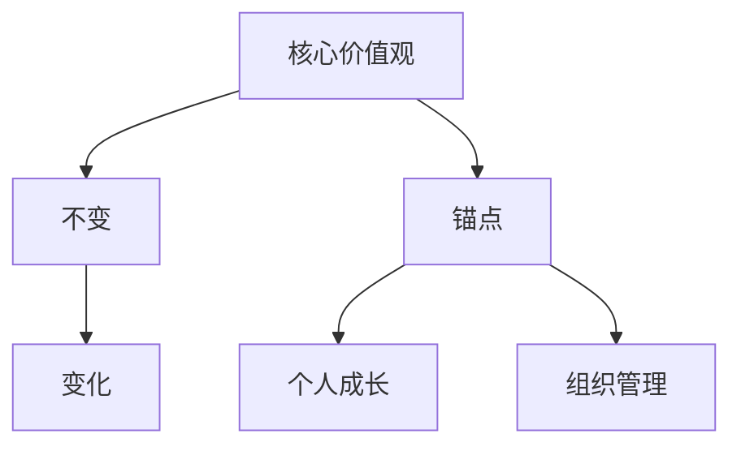

                 

### 《在变化中寻找不变：价值观的锚点》

#### 关键词：
- 价值观
- 不变
- 变化
- 锚点
- 个人成长
- 组织管理

#### 摘要：
本文深入探讨了在快速变化的社会环境中，如何寻找并坚守核心价值观的锚点。通过分析价值观的定义、类型及其发展历程，我们揭示了核心价值观在个人成长和组织管理中的重要作用。文章提出了寻找价值观锚点的实践方法，并详细阐述了其应用场景。通过实际案例分析和项目实战，我们展示了如何在复杂多变的环境中，保持价值观的一致性和稳定性。

---

## 引言

### 1. 背景介绍

在当今全球化、信息化、智能化的时代，技术变革的速度越来越快，社会环境的复杂性不断升级。个体和组织面临着前所未有的挑战，如何在变化中保持稳定和持续发展，成为了一个重要的课题。价值观作为人们行为和决策的内在驱动力，其稳定性和一致性对个人和组织的发展至关重要。

### 2. 核心概念与联系

#### 核心概念

- **价值观**：对事物的评价标准，是人们内心深处的信仰和追求。
- **不变**：在变化的环境中，核心价值观的稳定性。
- **变化**：外部环境和内部认知的持续演变。
- **锚点**：在动荡中保持稳定的基准或参考。

#### 概念实体之间的关系架构

下面是一个简化的 Mermaid 流程图，展示了核心价值观、不变、变化和锚点之间的关系：

在这个流程图中，核心价值观是个人和组织的基石，不变和变化是核心价值观所处的环境，锚点则是连接核心价值观与个人成长和组织管理的桥梁。

## 核心章节内容

### 第1章：价值观概述

#### 1.1 价值观的定义与重要性

价值观是对事物进行评价的标准，它反映了个体或组织对于什么是有意义、什么是重要的共同理解。价值观的重要性体现在其对个人行为和组织文化的指导作用。

#### 1.2 价值观的类型与层次

价值观可以分为个体价值观和组织价值观，每个类型又有不同的层次，如基本价值观、次级价值观和具体价值观。理解这些类型和层次有助于我们更全面地把握价值观的构成。

#### 1.3 价值观的发展历程

从古代到现代，价值观经历了不断的演变。了解价值观的发展历程，有助于我们更好地理解当今的价值观构成，以及如何应对未来的变化。

#### 1.4 价值观与行为的关系

价值观对行为有着深远的影响。个体的行为往往受其内在价值观的驱动，而组织的行为则受其文化价值观的塑造。理解价值观与行为的关系，有助于我们在实践中更好地调整和引导行为。

### 第2章：不变价值观的核心要素

#### 2.1 不变价值观的核心原则

不变价值观的核心原则包括真善美、诚实守信和责任与担当。这些原则是衡量个体行为和组织行为的重要标准，具有普遍适用性。

#### 2.2 不变价值观的价值观意义

不变价值观在个人成长和组织管理中具有重要意义。它为个人提供了行为准则，为组织塑造了良好的文化氛围。

### 第3章：变化中的价值观应用

#### 3.1 变化中的价值观挑战

全球化、科技进步等因素带来的价值观挑战，要求个体和组织不断调整和更新其价值观。

#### 3.2 变化中的价值观适应

个体和组织需要采取适应策略，以应对价值观的变化。这些策略包括自我反思、沟通交流和外部环境分析等。

### 第4章：寻找价值观锚点的实践方法

#### 4.1 价值观锚点的概念与作用

价值观锚点是在变化中保持价值观稳定的基准或参考。它有助于个体和组织在动荡的环境中，保持核心价值观的一致性。

#### 4.2 寻找价值观锚点的实践方法

寻找价值观锚点的方法包括自我反思、沟通交流、外部环境分析和价值观重塑等。

### 第5章：价值观锚点与个人成长

#### 5.1 价值观锚点在个人成长中的应用

价值观锚点在个人成长中发挥着重要作用。通过坚持核心价值观，个体可以更好地规划人生，实现自我价值。

#### 5.2 价值观锚点与个人成长案例

通过分析成功人士和失败人士的价值观锚点，我们可以更好地理解价值观锚点在个人成长中的应用。

### 第6章：价值观锚点与组织管理

#### 6.1 价值观锚点在组织管理中的应用

价值观锚点在组织管理中具有重要作用。它有助于塑造组织文化，提升组织绩效。

#### 6.2 价值观锚点与组织管理案例

通过分析成功组织和失败组织的价值观锚点，我们可以更好地理解价值观锚点在组织管理中的应用。

### 第7章：未来价值观的展望

#### 7.1 未来价值观的挑战与机遇

面对未来，价值观将面临新的挑战和机遇。个体和组织需要做好准备，以应对这些挑战。

#### 7.2 未来价值观的展望

在未来，核心价值观将继续发挥重要作用。通过持续调整和更新价值观，个体和组织可以更好地适应未来社会的发展。

## 总结

在快速变化的社会环境中，寻找并坚守核心价值观的锚点，对个人和组织的发展至关重要。本文通过深入探讨价值观的定义、类型、发展历程及其在个人成长和组织管理中的应用，为读者提供了一种在变化中保持稳定的方法。希望通过本文，读者能够更好地理解和应用价值观锚点，实现个人成长和组织成功。

### 作者信息

作者：AI天才研究院/AI Genius Institute & 禅与计算机程序设计艺术 /Zen And The Art of Computer Programming

---

以上是《在变化中寻找不变：价值观的锚点》的初步内容框架，接下来将逐步完善每个章节的具体内容。本文预计字数将在10000-12000字左右，以确保内容的丰富性和深入性。请在后续撰写过程中，根据实际需求和反馈进行调整和优化。如果您对当前框架有任何建议或要求，请随时告知。

