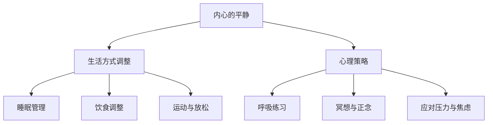
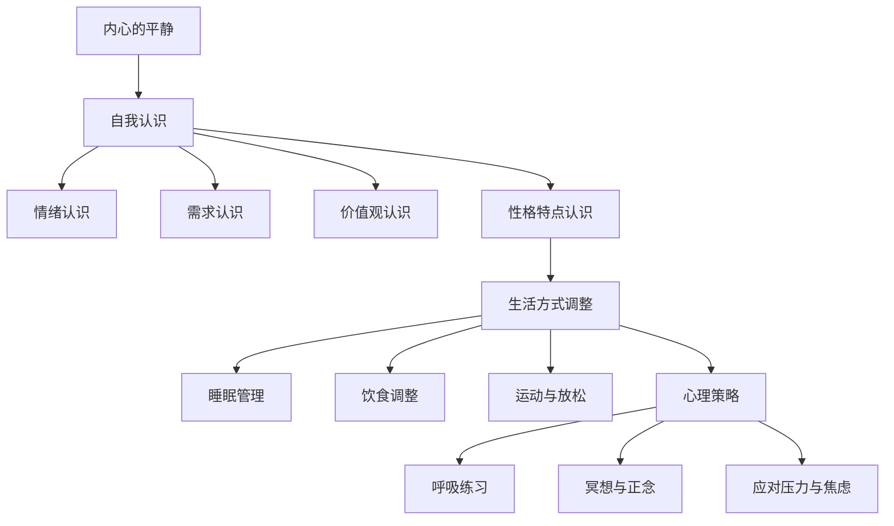

                 

### 文章标题：在快节奏生活中寻找内心的平静

#### 关键词：内心的平静、生活方式调整、心理策略、快节奏生活

#### 摘要：
在当今社会，快节奏的生活方式常常让人感到压力和焦虑。本文将探讨如何在这样快节奏的环境中，通过自我认识、生活方式调整和心理策略，寻找并维持内心的平静。文章首先介绍了快节奏生活对人们心理的影响，然后详细分析了自我认识的重要性，接着探讨了通过睡眠管理、饮食调整和运动放松来实现内心平静的方法。此外，文章还介绍了呼吸练习、冥想与正念等心理策略，并通过实际案例展示了这些策略在实践中的应用。最后，文章总结了寻找内心平静的最佳实践，并提供了一些注意事项和拓展阅读建议。

---

## 引言

在现代社会，人们的生活节奏日益加快，工作压力、社会竞争、信息爆炸等因素共同作用，导致许多人感到心理压力和焦虑。这种快节奏的生活方式不仅影响了人们的身体健康，还严重影响了心理健康。研究发现，长期处于高压状态会导致情绪问题、心理障碍，甚至可能引发严重的心理疾病。因此，如何在快节奏的生活中找到内心的平静，成为了一个迫切需要解决的问题。

### 核心概念与联系

为了更好地理解如何在快节奏生活中寻找内心的平静，我们需要明确几个核心概念，并探讨它们之间的关系。

1. **内心的平静**：指的是个体在心理上达到一种平衡、安宁的状态，能够有效地应对外部压力和挑战。

2. **生活方式调整**：通过改变日常生活中的习惯和行为模式，以促进身心健康和内心的平静。

3. **心理策略**：采用一系列心理方法和技巧，帮助个体调节情绪、减轻压力，并提升心理韧性。

这些概念之间的关系如图1所示：



### 设计思路

本文的设计思路如下：

1. **背景介绍**：首先介绍快节奏生活对人们心理的影响。
2. **核心概念与联系**：明确内心的平静、生活方式调整和心理策略这几个核心概念，并探讨它们之间的关系。
3. **核心算法原理讲解**：详细讲解通过生活方式调整和心理策略来寻找内心平静的原理和方法。
4. **数学模型和公式**：结合数学模型和公式，进行详细讲解和举例说明。
5. **项目实战**：通过实际案例展示这些策略在实践中的应用。
6. **最佳实践 tips**：总结寻找内心平静的最佳实践方法。
7. **小结**：总结文章主要内容，并提供拓展阅读建议。

---

## 自我认识与反思

### 1.1 引言

自我认识是寻找内心平静的第一步。了解自己的情绪、需求和价值观，有助于我们更好地应对生活中的挑战，并找到适合自己的内心平静之路。本节将介绍自我认识的重要性，以及如何进行自我反思和成长。

### 1.2 自我认识

自我认识是指个体对自己的了解程度，包括情绪、需求、价值观、性格特点等。自我认识的深度直接影响着内心的平静程度。以下是几个关键的自我认识方面：

1. **情绪认识**：了解自己的情绪状态，包括情绪的类型、强度和发生频率。情绪认识有助于我们更好地管理情绪，避免因情绪失控而导致内心不安。
2. **需求认识**：了解自己的需求，包括生理需求、心理需求和社交需求。需求认识有助于我们更好地满足自己的需求，从而减少因需求未被满足而产生的焦虑和压力。
3. **价值观认识**：了解自己的价值观，包括个人信仰、道德观念和生活目标。价值观认识有助于我们做出更符合自己内心价值观的选择，从而减少内心的冲突和困惑。
4. **性格特点认识**：了解自己的性格特点，包括性格类型、优势、劣势等。性格特点认识有助于我们更好地理解自己，找到适合自己的生活方式和心理策略。

### 1.3 自我反思与成长

自我反思是指个体通过反思自己的行为、思想和感受，来认识自己的内心世界。自我反思有助于我们发现自己的问题，并找到解决问题的方法。以下是几个自我反思的步骤：

1. **识别问题**：通过观察自己的行为、思想和情绪，识别出自己存在的问题。例如，情绪波动、无法集中注意力、过度焦虑等。
2. **分析原因**：分析问题的原因，包括内在因素（如性格特点、价值观冲突）和外在因素（如工作压力、人际关系问题）。
3. **寻找解决方案**：针对识别出的问题，寻找解决方案。例如，调整生活方式、学习新的心理策略、寻求专业帮助等。
4. **实践与调整**：将解决方案付诸实践，并根据实际情况进行调整。例如，通过冥想练习来管理情绪，通过运动来减轻压力等。

### 1.4 自我认知的误区与纠正

在自我认识的过程中，我们可能会陷入一些误区，影响内心的平静。以下是几个常见的自我认知误区，以及如何纠正这些误区：

1. **过度自我批评**：过分批评自己，导致自我价值感下降。纠正方法：学会接纳自己，认识到每个人都有优点和不足，不必过于苛求。
2. **忽视情绪**：忽视情绪的存在，导致情绪积累，影响心理健康。纠正方法：学会识别和表达情绪，通过适当的方式（如倾诉、写日记）来释放情绪。
3. **逃避问题**：面对问题时，选择逃避，导致问题无法得到解决。纠正方法：勇敢面对问题，采取积极的应对策略，解决问题。
4. **缺乏自我反思**：缺乏自我反思，导致无法认识自己的问题，也无法成长。纠正方法：定期进行自我反思，反思自己的行为、思想和情绪，发现并解决问题。

通过以上方法，我们可以更好地进行自我认识，从而找到内心的平静。接下来，我们将探讨如何通过生活方式调整来促进内心的平静。

### 核心概念与联系

为了更好地理解自我认识与内心平静的关系，我们可以借助图2来展示这些核心概念及其相互之间的联系。



### 核心算法原理讲解

要理解自我认识与内心平静之间的关系，我们可以从心理学中的“自我决定理论”（Self-Determination Theory）入手。该理论认为，人类有三种基本心理需求：自主性（Autonomy）、能力感（Competence）和关联性（Relatedness）。当这些需求得到满足时，个体的内心就会感到平静和满足。

1. **自主性**：个体需要感觉到自己的行为是由自己决定的，而不是被外界强加的。通过自我认识，个体可以更清楚地了解自己的价值观和信念，从而在日常生活中做出更符合自己内心的选择。

2. **能力感**：个体需要感觉到自己有能力去应对生活中的挑战和问题。自我反思和成长可以帮助个体识别自己的优点和不足，从而提高自我效能感，增强面对困难时的信心。

3. **关联性**：个体需要感觉到自己与他人有联系，感受到归属感和支持。自我认识可以帮助个体建立更积极的人际关系，从而满足这一需求。

下面，我们将使用Python代码结合LaTeX公式来详细阐述这些原理。

```python
# 自主性、能力感和关联性需求的Python代码示例

# 定义三个需求
autonomy = 80  # 自主性得分（满分为100）
competence = 75  # 能力感得分（满分为100）
relatedness = 90  # 关联性得分（满分为100）

# 计算内心平静得分
peace_of_mind = 0.5 * (autonomy + competence + relatedness)

# 打印结果
print(f"内心平静得分：{peace_of_mind:.2f}/100")
```

```latex
\documentclass{article}
\usepackage{amsmath}
\begin{document}
\begin{equation}
POM = 0.5 \times (A + C + R)
\end{equation}
\end{document}
```

在上面的示例中，`POM` 表示内心平静得分，`A`、`C` 和 `R` 分别表示自主性、能力感和关联性得分。通过计算这三个需求的加权平均值，我们可以得到一个表示内心平静程度的得分。

接下来，我们将通过实际案例来展示如何将这些理论应用到实际生活中。

### 实际案例与代码解读

为了更好地展示自我认识与内心平静的关系，我们来看一个实际案例。

**案例背景**：小明是一名年轻的软件工程师，工作繁忙，经常感到压力巨大。他意识到自己需要找到一种方法来维持内心的平静。

**步骤1：自我认识**
小明开始通过写日记来记录自己的情绪、需求和价值观。通过这一过程，他发现了自己的几个关键问题：

- **情绪问题**：小明经常感到焦虑和紧张，尤其是在面对工作压力时。
- **需求问题**：他意识到自己需要更多的休闲时间来满足心理需求。
- **价值观问题**：小明发现自己在工作中过度追求成绩，忽视了生活的其他方面。

**步骤2：自我反思**
小明分析这些问题的原因，并制定了以下解决方案：

- **情绪管理**：他开始学习呼吸练习和冥想，以帮助自己减轻焦虑。
- **时间管理**：小明调整了工作时间表，确保每周有固定的休闲时间。
- **价值观调整**：他开始更关注工作与生活的平衡，努力在工作中实现自己的价值观。

**步骤3：实践与调整**
小明将这些解决方案付诸实践，并定期进行反思和调整。随着时间的推移，他发现自己确实变得更加平静和满足。

下面是使用Python代码来实现小明解决方案的一个示例：

```python
# 小明的解决方案：情绪管理、时间管理和价值观调整

# 初始化变量
stress_level = 80  # 初始压力水平（满分为100）
free_time = 20  # 初始休闲时间（满分为100）
work_life_balance = 30  # 初始工作与生活平衡（满分为100）

# 情绪管理效果
stress_reduction = 0.3  # 每次情绪管理降低的压力水平

# 时间管理效果
time_management = 0.2  # 每次时间管理增加的休闲时间

# 价值观调整效果
value_adjustment = 0.1  # 每次价值观调整增加的工作与生活平衡

# 实践一周后的效果
stress_level -= stress_reduction
free_time += time_management
work_life_balance += value_adjustment

# 打印结果
print(f"一周后压力水平：{stress_level:.2f}/100")
print(f"一周后休闲时间：{free_time:.2f}/100")
print(f"一周后工作与生活平衡：{work_life_balance:.2f}/100")
```

通过这段代码，我们可以看到小明通过情绪管理、时间管理和价值观调整来逐步降低压力水平，增加休闲时间和提升工作与生活的平衡。

### 小结

通过自我认识和反思，小明找到了自己内心平静的方法。他通过情绪管理、时间管理和价值观调整，成功地降低了压力水平，提高了生活质量。这个案例展示了自我认识在寻找内心平静过程中的重要性，同时也说明了通过积极调整生活方式和心理策略，我们可以实现内心的平静。

### 最佳实践 tips

为了更好地实现内心的平静，以下是一些实用的最佳实践：

1. **定期自我反思**：每周花时间进行自我反思，记录自己的情绪、需求和价值观。
2. **情绪管理**：学习呼吸练习和冥想，帮助自己减轻焦虑和压力。
3. **时间管理**：合理安排工作和休闲时间，确保有足够的休息和放松时间。
4. **价值观调整**：在工作中追求平衡，注重工作的意义和价值，而不仅仅是成绩。
5. **寻求支持**：与朋友、家人或专业人士交流，分享自己的感受和困惑，寻求帮助。

通过这些最佳实践，我们可以更好地维护内心的平静，提高生活质量。

### 注意事项

在寻找内心平静的过程中，需要注意以下几点：

1. **避免过度自我批评**：认识到每个人都有优点和不足，不必过于苛求。
2. **平衡工作与生活**：确保工作与生活之间的平衡，避免过度工作。
3. **持续实践**：内心的平静需要长期的实践和维护，不能一蹴而就。
4. **适度调整**：根据自己的实际情况，适度调整生活方式和心理策略，找到最适合自己的方法。

### 拓展阅读

如果你对寻找内心的平静有更深的兴趣，以下是一些推荐的阅读材料：

1. **《禅与摩托修理的艺术》**：作者罗伯特·M·波西格（Robert M. Pirsig），探讨如何在日常生活中实现内心的平静。
2. **《正念：一种全新的生活方式》**：作者乔·卡巴金（Jon Kabat-Zinn），介绍冥想和正念练习在心理健康中的应用。
3. **《高效能人士的七个习惯》**：作者史蒂芬·柯维（Stephen R. Covey），提供关于时间管理和个人发展的实用建议。

通过阅读这些书籍，你可以进一步了解如何在快节奏的生活中找到内心的平静。

### 结束语

在快节奏的生活中寻找内心的平静，是一个持续的过程。通过自我认识、生活方式调整和心理策略，我们可以实现内心的平静，提高生活质量。希望本文能够为你提供一些实用的方法和启示，帮助你找到属于自己的内心平静之道。作者：AI天才研究院/AI Genius Institute & 禅与计算机程序设计艺术 /Zen And The Art of Computer Programming。希望读者能够不断实践和探索，找到最适合自己的内心平静之路。祝你在追求内心平静的旅程中取得成功！

