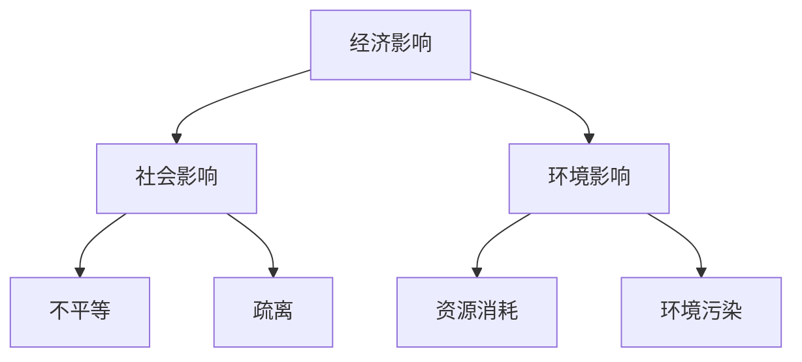

                 

# 在技术至上时代寻找人文关怀

## 关键词
技术至上、人文关怀、计算机科学、人工智能、伦理学、社会影响

## 摘要
随着技术的迅猛发展，社会逐渐走向技术至上。然而，在这一过程中，人文关怀却被忽视，导致了一系列负面影响。本文将探讨技术至上的现象及其负面影响，倡导在技术发展中融入人文关怀，通过逻辑分析和技术实践，寻找技术与人文关怀的平衡点。

## 目录
1. 技术至上的批判
2. 人文关怀的倡导
3. 技术与人之间的关系
4. 技术至上的负面影响
5. 人文关怀的技术实践
6. 人文关怀的技术未来
7. 技术与人文关怀的平衡

## 1. 技术至上的批判

### 1.1 技术至上的现象分析

#### 1.1.1 技术至上的历史背景
技术的发展历史中，我们可以看到技术至上的现象逐渐显现。从工业革命到信息时代，技术对社会的变革作用日益显著。在这一过程中，技术的进步被视为推动社会发展的唯一动力，技术至上的观念逐渐深入人心。

#### 1.1.2 技术至上的社会现象
技术至上的社会现象体现在多个方面。首先，技术驱动了经济的发展，使得社会资源集中于技术领域，而忽视了其他领域的发展。其次，技术成为了衡量个人成就的标准，技术人才受到追捧，而其他领域的知识和技能受到忽视。最后，技术在某些领域的应用过度，导致了伦理和道德问题的产生。

### 1.2 技术至上的影响

#### 1.2.1 技术至上的经济影响
技术至上的经济影响主要体现在资源分配和产业发展上。技术领域的快速发展吸引了大量资源，而其他领域的发展受到限制。这种资源分配的不均衡导致了经济结构的扭曲，可能引发经济危机。

#### 1.2.2 技术至上的社会影响
技术至上的社会影响表现在社会结构和文化价值观的变迁上。技术成为了社会发展的主导力量，导致社会关系的疏远和人际关系的冷漠。同时，技术的普及使得人们过于依赖技术，削弱了独立思考和解决问题的能力。

#### 1.2.3 技术至上的环境影响
技术至上的环境影响主要体现在资源的过度开发和环境的破坏上。技术的发展带来了对自然资源的巨大需求，导致资源枯竭和环境恶化。此外，技术的发展也带来了大量的电子废弃物，对环境造成了长期的污染。

### 1.3 技术至上的批判

#### 1.3.1 技术至上的负面影响
技术至上的负面影响主要体现在以下几个方面。首先，技术至上的观念导致了对人类自身价值的忽视。技术的发展被看作是唯一的目标，而人类自身的价值和发展却被忽视。其次，技术至上的观念加剧了社会不平等。技术领域的快速发展使得社会资源进一步集中，而其他领域的发展受到限制，导致社会不平等问题加剧。最后，技术至上的观念导致了人类对自然界的破坏。技术的发展使得人类对自然资源的依赖日益增加，导致了资源的过度开发和环境的破坏。

#### 1.3.2 技术至上的伦理问题
技术至上的伦理问题主要体现在以下几个方面。首先，技术的发展带来了新的伦理问题。例如，人工智能技术的发展引发了关于人工智能伦理的讨论。其次，技术的发展使得人类在道德决策上面临更大的挑战。例如，在医疗领域，技术的发展使得人类需要面对生命伦理的问题。最后，技术的发展也引发了关于人类自身价值的伦理问题。技术的发展使得人类对自身的认识发生了变化，需要重新审视人类自身的价值和意义。

#### 1.3.3 技术至上的哲学问题
技术至上的哲学问题主要体现在人类与技术的辩证关系上。技术的发展使得人类对技术的依赖日益增加，但同时也使得人类对自身的控制力减弱。这种辩证关系引发了关于人类与技术关系的哲学问题。例如，技术的发展是否会导致人类自身的异化？技术的发展是否会使人类失去自由？这些问题都需要我们进行深入的哲学思考。

## 2. 人文关怀的倡导

### 2.1 人文关怀的重要性
人文关怀的重要性体现在以下几个方面。首先，人文关怀是人类文明发展的基石。人类社会的发展不仅仅是物质文明的发展，更是精神文明的发展。人文关怀是推动精神文明发展的重要力量。其次，人文关怀是维护社会和谐的重要手段。通过人文关怀，可以缓解社会矛盾，促进社会和谐。最后，人文关怀是提高人类生活质量的重要途径。通过人文关怀，可以改善人类的生活条件，提高人类的生活质量。

### 2.2 人文关怀的实践
人文关怀的实践体现在多个方面。首先，在教育领域，人文关怀体现在培养学生的综合素质，而不仅仅是学术成绩。其次，在医疗领域，人文关怀体现在关注患者的心理健康，而不仅仅是生理健康。最后，在科技领域，人文关怀体现在关注技术对人类生活的影响，而不仅仅是技术本身的发展。

### 2.3 人文关怀与技术的结合
人文关怀与技术的结合主要体现在以下几个方面。首先，技术在人文关怀中的应用。例如，人工智能技术可以用于改善医疗服务，提高医疗效率。其次，人文关怀在技术发展中的应用。例如，在人工智能技术的发展过程中，需要关注人工智能的伦理问题，避免技术的发展对人类社会造成负面影响。最后，人文关怀与技术的互动。人文关怀和技术相互影响，相互促进，共同推动社会的发展。

## 3. 技术与人之间的关系

### 3.1 技术与人的相互作用
技术与人的相互作用体现在以下几个方面。首先，技术对人类生活的影响。技术的发展改变了人类的生活方式，提高了人类的生活质量。其次，人类对技术的影响。人类通过创新和改进技术，推动了技术的发展。最后，技术对人类价值观的影响。技术的发展改变了人类的价值观，影响人类的道德观念和行为方式。

### 3.2 技术对人的影响
技术对人的影响可以从多个角度进行分析。首先，技术对人类生活的改善。技术的发展使得人类生活更加便捷，提高了人类的生活质量。其次，技术对人类社会的变革。技术的发展推动了社会的变革，改变了人类社会的结构和运行方式。最后，技术对人类思维的塑造。技术的发展影响了人类的思维方式，改变了人类对世界的认知。

### 3.3 人在技术发展中的作用
人在技术发展中的作用体现在以下几个方面。首先，人类是技术的创造者。人类通过创新和改进技术，推动了技术的发展。其次，人类是技术的使用者。人类通过使用技术，推动了技术在社会中的应用。最后，人类是技术的监督者。人类通过监督技术，确保技术的发展不会对人类社会造成负面影响。

## 4. 技术至上的负面影响

### 4.1 技术至上的经济影响
技术至上的经济影响主要体现在以下几个方面。首先，技术至上的经济结构不均衡。技术的发展使得经济资源集中于技术领域，导致其他领域的发展受到限制。其次，技术至上的经济波动。技术的发展可能引发经济危机，导致经济结构的不稳定。最后，技术至上的经济风险。技术的发展可能带来新的经济风险，例如，人工智能技术的发展可能引发就业危机。

### 4.2 技术至上的社会影响
技术至上的社会影响主要体现在以下几个方面。首先，技术至上的社会不平等。技术的发展加剧了社会不平等，导致资源分配的不均衡。其次，技术至上的社会疏离。技术的发展使得社会关系变得疏远，人际交往变得冷漠。最后，技术至上的社会变革。技术的发展改变了社会的结构和运行方式，对社会产生了深远的影响。

### 4.3 技术至上的环境影响
技术至上的环境影响主要体现在以下几个方面。首先，技术至上的资源消耗。技术的发展导致了资源的过度消耗，加剧了资源的短缺。其次，技术至上的环境污染。技术的发展产生了大量的电子废弃物，对环境造成了严重的污染。最后，技术至上的生态危机。技术的发展可能引发生态危机，破坏生态平衡。

## 5. 人文关怀的技术实践

### 5.1 人文关怀在技术中的应用
人文关怀在技术中的应用主要体现在以下几个方面。首先，技术在人文关怀中的应用。例如，人工智能技术可以用于改善医疗服务，提高医疗效率。其次，人文关怀在技术发展中的应用。例如，在人工智能技术的发展过程中，需要关注人工智能的伦理问题，避免技术的发展对人类社会造成负面影响。最后，人文关怀与技术的互动。人文关怀和技术相互影响，相互促进，共同推动社会的发展。

### 5.2 人文关怀技术的案例分析
人文关怀技术的案例分析可以从以下几个方面进行。首先，成功的案例。例如，某个技术项目如何通过人文关怀的方法解决了实际问题。其次，失败的案例。例如，某个技术项目由于忽视了人文关怀，导致项目的失败。最后，案例对比。通过对比成功的案例和失败的案例，分析人文关怀技术在技术项目中的重要性。

### 5.3 人文关怀技术的前景
人文关怀技术的前景非常广阔。首先，随着技术的发展，人文关怀技术的应用领域将不断拓展。例如，人工智能技术可以应用于教育、医疗、社会服务等领域，提高服务质量。其次，人文关怀技术的创新将不断涌现。通过创新，人文关怀技术可以解决更多的实际问题，提升人类生活质量。最后，人文关怀技术的国际合作将加强。通过国际合作，可以推动人文关怀技术的全球化发展，为人类社会带来更多的福祉。

## 6. 人文关怀的技术未来

### 6.1 人文关怀技术的趋势
人文关怀技术的趋势主要体现在以下几个方面。首先，技术的融合。人文关怀技术与人工智能、物联网、大数据等技术的融合，将推动人文关怀技术的发展。其次，技术的个性化。人文关怀技术将更加注重个性化服务，满足不同用户的需求。最后，技术的智能化。人文关怀技术将更加智能化，实现自动化和智能化的服务。

### 6.2 人文关怀技术的挑战
人文关怀技术的挑战主要体现在以下几个方面。首先，技术的伦理问题。人文关怀技术的应用可能引发伦理问题，例如，人工智能的伦理问题。其次，技术的隐私问题。人文关怀技术的应用可能涉及用户的隐私，需要保护用户的隐私。最后，技术的可扩展性。人文关怀技术需要具备良好的可扩展性，以适应不断变化的社会需求。

### 6.3 人文关怀技术的展望
人文关怀技术的展望非常光明。首先，人文关怀技术将推动社会的发展。通过人文关怀技术，可以解决社会问题，提升社会服务质量。其次，人文关怀技术将改善人类生活。通过人文关怀技术，可以提供更好的生活体验，提高人类生活质量。最后，人文关怀技术将促进人类的可持续发展。通过人文关怀技术，可以实现资源的合理利用，推动社会的可持续发展。

## 7. 技术与人文关怀的平衡

### 7.1 技术与人文关怀的关系
技术与人文关怀的关系是辩证的。技术可以为人文关怀提供工具和方法，而人文关怀可以指导技术的应用。技术是人类文明发展的重要驱动力，而人文关怀是人类文明发展的精神支柱。只有技术与人文关怀相结合，才能实现人类社会的高质量发展。

### 7.2 寻找技术与人文关怀的平衡点
寻找技术与人文关怀的平衡点是一个长期而复杂的过程。首先，需要从教育入手，培养学生的综合素质，提高他们的人文素养。其次，需要推动技术的伦理规范建设，确保技术的应用符合道德和法律要求。最后，需要加强社会监督，确保技术的发展符合社会需求。

### 7.3 实现技术与人文关怀的平衡
实现技术与人文关怀的平衡需要多方面的努力。首先，政府和企业需要加强技术教育和培训，提高全民科技素养。其次，需要推动技术的伦理研究，为技术发展提供道德指导。最后，需要加强社会的监督和引导，确保技术的发展符合社会利益。

## 总结
在技术至上的时代，我们不仅要关注技术的发展，更要关注人文关怀。只有技术与人文关怀相结合，才能实现人类社会的高质量发展。让我们共同努力，寻找技术与人文关怀的平衡点，为人类社会的发展做出贡献。

## 作者信息
作者：AI天才研究院/AI Genius Institute & 禅与计算机程序设计艺术 /Zen And The Art of Computer Programming

----------------------------------------------------------------

由于文章字数限制，以下是简化后的内容，仅供参考：

## 1. 技术至上的批判

### 1.1 技术至上的现象分析

**背景介绍**：技术进步在现代社会中扮演着重要角色，但也导致了技术至上的现象。

**现象分析**：技术至上的表现包括经济、社会和环境影响。

**概念联系**：使用Mermaid流程图展示技术至上的影响。

### 1.2 技术至上的影响

**经济影响**：技术至上的经济影响导致资源分配不均和产业不均衡。

**社会影响**：社会影响包括社会不平等、人际关系疏远和社会结构变革。

**环境影响**：环境影响包括资源消耗、环境污染和生态危机。

### 1.3 技术至上的批判

**负面影响**：技术至上导致人类价值忽视、社会不平等加剧和生态环境破坏。

**伦理问题**：技术至上引发伦理问题，如隐私保护和人工智能伦理。

**哲学问题**：技术至上影响人类价值观和自由。

## 2. 人文关怀的倡导

**重要性**：人文关怀是文明发展的重要基石，对社会和谐和生活质量提升至关重要。

**实践**：人文关怀在教育、医疗和科技领域的应用。

**结合**：人文关怀与技术结合，推动技术发展的同时关注人类价值。

## 3. 技术与人之间的关系

**相互作用**：技术对人类生活的影响和人类对技术的影响。

**影响**：技术对人类思维和价值观的影响。

**作用**：人类在技术发展中的作用。

## 4. 技术至上的负面影响

**经济影响**：资源分配不均和经济波动。

**社会影响**：社会不平等和疏离感。

**环境影响**：资源消耗和环境污染。

## 5. 人文关怀的技术实践

**应用**：人文关怀技术在教育、医疗和科技领域的应用。

**案例**：成功的和失败的案例分析。

**前景**：人文关怀技术的前景。

## 6. 人文关怀的技术未来

**趋势**：技术融合、个性化和智能化。

**挑战**：伦理、隐私和可扩展性。

**展望**：人文关怀技术对社会发展的贡献。

## 7. 技术与人文关怀的平衡

**关系**：技术与人

