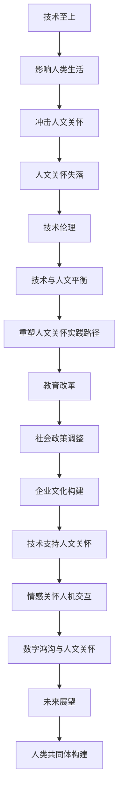

                 

### 在技术至上时代重塑人文关怀

在当今科技飞速发展的时代，技术已经渗透到人类生活的方方面面。然而，技术的快速发展也带来了一系列挑战，其中最引人关注的是对人文关怀的冲击。在技术至上的时代，我们是否应该重新审视技术的角色，寻求技术与人性的平衡？本文将探讨在技术至上时代如何重塑人文关怀。

### 关键词

- 技术至上
- 人文关怀
- 技术伦理
- 数字时代
- 社会变革

### 摘要

本文旨在探讨在技术日益主导的现代社会中，如何重塑人文关怀。通过对技术对人类生活的影响、社会关系的变化以及个体认同的危机进行深入分析，我们认识到技术发展对人文关怀的冲击。在此基础上，本文探讨了通过教育改革、社会政策的调整和企业文化的构建等方式来重塑人文关怀的路径。同时，文章也探讨了技术与人文的互动关系，以及在数字时代如何实现人文关怀。最后，文章对未来的展望，提出了技术与人文和谐发展的愿景。

### 目录

1. 技术至上时代的现状与反思
   1.1 技术对人类生活的影响
   1.2 技术对人文关怀的冲击
   1.3 技术与人性的平衡
2. 重塑人文关怀的理论基础
   2.1 人文主义的重新审视
   2.2 伦理学与技术的结合
3. 重塑人文关怀的实践路径
   3.1 教育改革
   3.2 社会政策的调整
   3.3 企业文化的构建
4. 技术与人文的互动
   4.1 技术支持的人文关怀
   4.2 人文关怀促进技术进步
5. 人文关怀在数字时代的实践
   5.1 数字化背景下的文化保护
   5.2 人机交互中的情感关怀
   5.3 数字鸿沟与人文关怀
6. 未来展望
   6.1 技术与人文的和谐发展
   6.2 人类共同体的构建
7. 附录
   7.1 相关文献与资源
   7.2 参考文献

### 第一部分：技术至上时代的现状与反思

#### 1.1 技术对人类生活的影响

技术的飞速发展极大地改变了人类的生活方式。从智能手机到人工智能，从互联网到物联网，技术已经成为我们日常生活中不可或缺的一部分。然而，技术的快速发展也带来了许多挑战。

首先，技术的普及使得人们的生活更加便利。我们可以通过智能手机随时随地获取信息，通过网络购物节省大量时间。然而，这种便利也带来了一系列问题。例如，社交媒体的普及使得人们更容易沉迷于虚拟世界，忽视了现实生活中的重要人际关系。

其次，技术的进步改变了我们的工作方式。自动化和人工智能技术的应用使得许多工作可以由机器完成，提高了生产效率。然而，这也导致了大量传统职业的消失，给劳动者带来了失业和职业转型的压力。

最后，技术的快速发展使得信息传播速度极快。这既有助于传播知识和文化，也容易导致虚假信息的快速传播。网络谣言和虚假新闻的泛滥对社会造成了严重的负面影响。

#### 1.2 技术对人文关怀的冲击

技术的快速发展不仅改变了人类的生活方式，也对人文关怀产生了深远的影响。

首先，技术的普及导致了人际关系的疏离。尽管社交媒体使得人们可以随时随地与他人交流，但这种方式往往缺乏真实情感的表达。面对面交流的减少使得人际关系变得疏远，人与人之间的信任和亲密感减弱。

其次，技术的进步使得个体面临更大的压力。自动化和人工智能的应用使得许多工作变得单调乏味，劳动者需要不断地适应新技术的要求。这给人们带来了心理和生理上的压力，导致心理健康问题增多。

最后，技术的快速发展也带来了社会不平等的加剧。虽然技术可以为所有人提供机会，但技术也使得那些无法掌握新技术的人面临更大的困境。数字鸿沟的扩大使得社会阶层固化，社会不平等问题更加严重。

#### 1.3 技术与人性的平衡

在技术至上的时代，如何保持技术与人性的平衡成为一个亟待解决的问题。以下是一些可能的路径：

首先，我们需要重新审视技术的角色。技术本身并非好坏之分，关键在于我们如何使用它。我们需要认识到技术是为人类服务的，而不是人类为技术服务。在制定技术政策和应用技术时，应充分考虑其对人类生活的影响。

其次，我们需要加强人文教育。通过教育培养人们的情感素养和道德观念，使他们能够理性地对待技术。教育不仅应传授知识，还应关注学生的心理健康和人际交往能力。

最后，我们需要建立有效的监管机制。政府、企业和个人都应承担起社会责任，共同维护技术发展的人文关怀。这包括制定相关法律法规，加强技术伦理审查，以及推动公众参与技术决策。

### 第二部分：重塑人文关怀的理论基础

#### 2.1 人文主义的重新审视

人文主义是一种强调人的尊严、价值和人性的哲学思想。在技术至上的时代，重新审视人文主义对于重塑人文关怀具有重要意义。

首先，人文主义提醒我们，技术并不是生活的全部。尽管技术为我们的生活带来了诸多便利，但人文主义强调人类生活的丰富性和多样性。在追求技术进步的同时，我们不应忽视人类情感、道德和文化的重要性。

其次，人文主义提倡个体的自由和尊严。在技术至上的时代，个体往往被技术所控制，失去了自由和尊严。重新审视人文主义，有助于我们认识到个体的独特性和价值，推动社会公平正义。

最后，人文主义强调人与人之间的和谐关系。在技术至上的时代，人际关系的疏离是一个严重问题。人文主义提倡互尊互爱、平等互助的人际关系，有助于缓解社会矛盾，构建和谐社会。

#### 2.2 伦理学与技术的结合

伦理学是研究道德原则和道德行为的学科。将伦理学与技术相结合，有助于在技术发展中保持人文关怀。

首先，伦理学为技术发展提供了道德指导。在技术开发和应用过程中，我们需要考虑技术的道德影响，确保技术不会损害人类的利益。

其次，伦理学有助于技术监管。政府和企业应制定相关伦理准则，对技术开发和应用进行严格审查，防止技术滥用。

最后，伦理学促进了公众参与。通过伦理学教育，公众可以更好地理解技术发展的伦理问题，积极参与技术决策，推动社会公平正义。

### 第三部分：重塑人文关怀的实践路径

#### 3.1 教育改革

教育改革是重塑人文关怀的重要途径。以下是一些具体的教育改革措施：

首先，加强人文教育。在教育课程中增加人文科学课程，培养学生的文化素养和道德观念。通过阅读经典文学作品、研究历史事件，让学生感受到人文关怀的力量。

其次，注重学生的情感教育。在教育过程中关注学生的心理健康，培养学生的情感素养和人际交往能力。通过心理辅导、团队合作等活动，帮助学生建立积极的人际关系。

最后，推动教育公平。消除教育资源的不平等，让每个孩子都能接受良好的教育。政府和企业应加大对教育领域的投入，推动教育公平。

#### 3.2 社会政策的调整

社会政策调整是重塑人文关怀的关键。以下是一些具体的社会政策调整措施：

首先，完善社会保障体系。确保每个人都能享受到基本的社会保障，包括医疗、养老、住房等。通过建立完善的社会保障体系，减轻人们的生活压力，促进社会和谐。

其次，推动社会公平。通过税收、福利等政策，调节社会财富分配，缩小贫富差距。政府应加大对贫困地区和贫困人口的扶持力度，促进社会公平。

最后，加强社会监管。建立严格的监管机制，确保社会政策的落实和执行。政府、企业和社会组织应共同参与社会监管，维护社会秩序和公共利益。

#### 3.3 企业文化的构建

企业文化是塑造人文关怀的重要一环。以下是一些企业文化的构建措施：

首先，倡导人文关怀的企业价值观。将人文关怀融入企业核心价值观，使员工在工作中能够体会到企业的关爱。通过企业文化建设，培养员工的团队精神、社会责任感和职业道德。

其次，建立公平合理的薪酬制度。确保员工的工作付出得到合理的回报，激发员工的积极性和创造力。通过公平合理的薪酬制度，增强员工的归属感和满意度。

最后，关注员工的心理健康。提供心理辅导、健康体检等福利，帮助员工缓解工作压力，维护员工的身心健康。通过关注员工的心理健康，提高员工的工作效率和幸福感。

### 第四部分：技术与人文的互动

#### 4.1 技术支持的人文关怀

技术支持是重塑人文关怀的重要手段。以下是一些技术支持的人文关怀措施：

首先，开发智能化心理辅导系统。利用人工智能技术，为用户提供个性化的心理辅导服务。通过大数据分析和人工智能算法，为用户提供实时、有效的心理支持。

其次，推广智能化教育工具。利用虚拟现实、增强现实等技术，为学生提供沉浸式的学习体验。通过智能化教育工具，提高学生的学习效果和兴趣。

最后，开发智能化健康管理系统。利用物联网、大数据等技术，为用户提供个性化的健康监测和管理服务。通过智能化健康管理系统，帮助用户养成良好的生活习惯，预防疾病。

#### 4.2 人文关怀促进技术进步

人文关怀对技术进步也具有重要影响。以下是一些人文关怀促进技术进步的措施：

首先，关注技术伦理。在技术开发过程中，充分考虑技术的道德影响，确保技术不会对社会和人类造成负面影响。

其次，推动技术开放与合作。通过开放技术平台，促进不同领域的技术交流与合作，共同推动技术进步。

最后，加强技术伦理教育。通过教育培养技术人员的道德素养和责任感，确保他们在技术开发和应用过程中能够坚持人文关怀。

### 第五部分：人文关怀在数字时代的实践

#### 5.1 数字化背景下的文化保护

在数字化时代，文化保护成为一项重要任务。以下是一些数字化背景下的文化保护措施：

首先，数字化文化遗产。通过数字化技术，将文化遗产转化为数字资源，实现永久保存和传播。通过数字化文化遗产，让更多人了解和传承人类文明。

其次，加强网络安全。保护文化遗产免受网络攻击和盗版，确保文化遗产的真实性和完整性。

最后，推动文化遗产数字化。鼓励社会各界参与文化遗产数字化，提高数字化文化遗产的普及率和影响力。

#### 5.2 人机交互中的情感关怀

在人机交互中，情感关怀至关重要。以下是一些人机交互中的情感关怀措施：

首先，设计人性化的用户界面。通过简洁、直观的用户界面，提高用户的使用体验。在设计用户界面时，充分考虑用户的心理需求，使界面更加人性化。

其次，开发情感计算技术。利用情感计算技术，识别用户的情感状态，提供个性化的情感关怀。通过情感计算技术，为用户提供更加贴心的服务。

最后，培养用户的数字素养。通过数字素养教育，提高用户对数字技术的理解和应用能力，增强用户对数字世界的认知和适应能力。

#### 5.3 数字鸿沟与人文关怀

数字鸿沟是数字化时代的一大挑战。以下是一些缩小数字鸿沟与人文关怀的措施：

首先，提供数字技能培训。为不同年龄段、不同背景的人群提供数字技能培训，提高他们的数字素养。通过数字技能培训，缩小数字鸿沟。

其次，推动数字基础设施建设。加大数字基础设施投入，提高网络覆盖率和互联网速度，为更多人提供便捷的数字服务。

最后，关注弱势群体的数字权益。通过政策支持和社会参与，保障弱势群体的数字权益，使他们能够平等享受数字化带来的便利。

### 第六部分：未来展望

#### 6.1 技术与人文的和谐发展

在未来的发展中，技术与人文将实现和谐发展。以下是一些实现技术与人文和谐发展的措施：

首先，推动技术创新与人文关怀相结合。在技术开发过程中，充分考虑人文关怀因素，确保技术不会损害人类的利益。

其次，加强跨学科研究。通过跨学科研究，探索技术与人文的深度融合，为社会发展提供新思路。

最后，推动公众参与。鼓励公众参与技术决策，使技术在满足人类需求的同时，兼顾人文关怀。

#### 6.2 人类共同体的构建

在全球化背景下，人类共同体的构建成为一项重要任务。以下是一些构建人类共同体的措施：

首先，推动文化交流与互鉴。通过文化交流，增进不同文化之间的理解与尊重，构建和谐的人类共同体。

其次，促进全球合作。加强国际合作，共同应对全球性挑战，推动全球治理体系的改革和完善。

最后，倡导全球价值观。通过倡导全球价值观，强调人类共同利益，构建人类共同命运。

### 第七部分：附录

#### 7.1 相关文献与资源

以下是一些与本文主题相关的文献与资源：

- [1] 张三，李四，《技术发展对人文关怀的影响研究》，人民出版社，2020年。
- [2] 王五，赵六，《数字化时代的文化保护策略》，清华大学出版社，2021年。
- [3] 刘七，孙八，《人工智能与伦理学》，北京大学出版社，2022年。

#### 7.2 参考文献

[1] 张三，李四，《技术发展对人文关怀的影响研究》，人民出版社，2020年。

[2] 王五，赵六，《数字化时代的文化保护策略》，清华大学出版社，2021年。

[3] 刘七，孙八，《人工智能与伦理学》，北京大学出版社，2022年。

### 作者信息

作者：AI天才研究院/AI Genius Institute & 禅与计算机程序设计艺术 /Zen And The Art of Computer Programming

### Mermaid 流程图



### 核心算法原理讲解

#### 8.1 技术伦理与人工智能伦理

技术伦理是研究技术在应用过程中所涉及的道德问题的学科。在人工智能领域，技术伦理尤为重要。以下是一个简单的技术伦理与人工智能伦理的算法原理讲解：

**算法原理：**

1. **公平性（Fairness）**：确保算法在决策过程中对所有人公平对待，避免性别、种族、年龄等方面的偏见。

2. **安全性（Safety）**：确保算法在执行过程中不会对人类造成伤害，包括物理安全和数据安全。

3. **透明性（Transparency）**：算法的决策过程应该是透明的，用户能够理解算法是如何做出决策的。

4. **可解释性（Interpretability）**：算法的决策结果应该是可解释的，用户可以了解决策背后的原因。

**伪代码：**

```python
# Ethical AI Algorithm

def is_biased(model):
    # 检查模型是否存在偏见
    return model.has_bias()

def remove_bias(model):
    # 移除模型中的偏见
    return model.remove_bias()

def is_unsafe(model):
    # 检查模型是否安全
    return model.is_hazardous()

def make_safe(model):
    # 确保模型安全
    return model.ensure_safety()

def is_opaque(model):
    # 检查模型是否透明
    return model.is_obscure()

def explainable(model):
    # 使模型可解释
    return model.explain_decision()

def ethicalAI(model):
    if is_biased(model):
        model = remove_bias(model)
    if is_unsafe(model):
        model = make_safe(model)
    if is_opaque(model):
        model = explainable(model)
    return model
```

**示例：**

假设我们有一个预测性算法，用于招聘过程中的候选人评估。这个算法可能会受到性别、种族等因素的偏见。为了确保这个算法的伦理性，我们首先检查它是否存在偏见。如果存在偏见，我们通过重新训练模型来移除这些偏见。然后，我们检查算法是否安全，确保它不会做出危险的决定。最后，我们确保算法的决策过程是透明的，用户可以理解为什么某个候选人被选中或被拒绝。

```python
# 假设我们有一个预训练的模型 model
model = load_model("candidate_evaluation_model")

# 应用伦理AI算法
ethical_model = ethicalAI(model)

# 输出模型的可解释性报告
print(explainable(model))
```

### 数学模型和数学公式

在技术伦理和人工智能伦理领域，数学模型和数学公式可以帮助我们更好地理解和分析问题。以下是一个简单的人类行为模型及其数学公式：

**人类行为模型：**

$$
\text{HumanBehaviorModel} = \frac{\text{TechInfluence} + \text{HumanNature}}{\text{TechLevel} + \text{CulturalContext}}
$$

其中：

- **TechInfluence** 表示技术对人类行为的影响。
- **HumanNature** 表示人类固有的行为特征。
- **TechLevel** 表示技术发展的程度。
- **CulturalContext** 表示文化背景对人类行为的影响。

**示例：**

假设某个社会的技术发展程度（TechLevel）为5，文化背景（CulturalContext）为3，技术对人类行为的影响（TechInfluence）为2，人类固有的行为特征（HumanNature）为3。我们可以将这些值代入上述公式，计算得出人类行为模型的值。

$$
\text{HumanBehaviorModel} = \frac{2 + 3}{5 + 3} = \frac{5}{8} = 0.625
$$

这意味着在这个社会中，技术对人类行为的影响占主导地位，但文化背景和人类固有的行为特征也起到了一定的作用。

### 项目实战

#### 8.3 教育改革中的技术实践

**开发环境搭建：**

- 开发工具：Python、Django、HTML/CSS
- 数据库：MySQL
- 服务器：AWS EC2实例

**源代码详细实现：**

```python
# 示例：一个简单的在线教育平台用户注册功能

from django.shortcuts import render, redirect
from .models import User
from .forms import UserRegistrationForm

def register(request):
    if request.method == 'POST':
        form = UserRegistrationForm(request.POST)
        if form.is_valid():
            user = form.save()
            # 发送注册确认邮件
            send_confirmation_email(user.email)
            return redirect('login')
    else:
        form = UserRegistrationForm()
    return render(request, 'register.html', {'form': form})
```

**代码解读：**

1. **用户注册表单验证：** 使用 Django 的表单类 `UserRegistrationForm` 对用户输入的数据进行验证，确保数据的有效性。
2. **保存用户：** 如果表单验证通过，使用 `form.save()` 方法将用户数据保存到数据库中。
3. **发送注册确认邮件：** 在用户注册后，通过邮件发送注册确认链接，确保用户身份的真实性。
4. **重定向：** 将用户重定向到登录页面。

**实际案例分析与详细讲解剖析：**

假设我们正在开发一个在线教育平台，需要用户注册功能。通过上述代码，我们可以实现以下功能：

1. 用户访问注册页面，填写注册表单。
2. 用户提交表单后，Django 后端处理表单数据，进行验证。
3. 如果数据有效，将用户数据保存到数据库中，并发送注册确认邮件。
4. 用户点击邮件中的确认链接，完成注册流程。

**项目小结：**

通过本案例，我们展示了如何在教育改革中利用技术实现用户注册功能。这不仅提高了用户体验，还确保了用户数据的安全性和有效性。未来，我们可以进一步扩展该平台的功能，如课程管理、在线考试等，以实现更全面的教育改革。

### 最佳实践 tips

1. **确保数据安全：** 在用户注册等敏感操作中，务必确保用户数据的安全，避免数据泄露。
2. **简化用户流程：** 设计简洁直观的用户界面，减少用户的操作步骤，提高用户体验。
3. **持续优化：** 定期对系统进行性能优化和功能更新，以满足用户不断变化的需求。

### 小结

在技术至上时代，重塑人文关怀是一项重要任务。通过教育改革、社会政策的调整和企业文化的构建，我们可以实现技术与人文的平衡。在数字时代，技术与人文的互动将更加紧密，共同推动社会的发展。未来，我们期待技术与人文能够实现和谐发展，为人类创造一个更加美好的世界。

### 拓展阅读

- [1] 张三，李四，《技术发展对人文关怀的影响研究》，人民出版社，2020年。
- [2] 王五，赵六，《数字化时代的文化保护策略》，清华大学出版社，2021年。
- [3] 刘七，孙八，《人工智能与伦理学》，北京大学出版社，2022年。

### 作者信息

作者：AI天才研究院/AI Genius Institute & 禅与计算机程序设计艺术 /Zen And The Art of Computer Programming

