                 

# 在数字时代重塑人际关系的意义

## 引言

### 背景介绍

随着数字技术的快速发展，人类社会进入了数字时代。这一时代的特点是信息传播迅速、社交方式多样、人际关系日益虚拟化。在这个背景下，如何理解和重塑人际关系成为一个值得探讨的话题。

### 研究意义

在数字时代，人际关系的重塑不仅影响到个体的心理健康，也对社会的稳定和发展产生深远影响。因此，探讨数字时代人际关系的重塑意义，对于提升个体生活质量、促进社会和谐具有重要作用。

### 全书结构概述

本书将分为以下几个部分：首先，分析数字时代人际关系的现状，包括社交媒体的影响、沟通特点以及人际关系的变化趋势。接着，探讨人际关系的重塑策略和方法，介绍数字时代下的沟通艺术和社交网络分析。最后，讨论数字时代下的心理健康与人际关系，并提出总结和展望。

## 1. 数字时代人际关系的现状

### 1.1 社交媒体对人际关系的影响

#### 背景介绍

社交媒体在现代社会中扮演着重要角色，如Facebook、Twitter、微信等平台已成为人们日常生活中不可或缺的一部分。这些平台不仅提供了信息分享和交流的便利，也对人际关系产生了深远影响。

#### 核心概念与联系

社交媒体平台上的互动可以看作是一种“虚拟社交”。这种社交方式与传统面对面的社交有所不同，它依赖于文本、图片、视频等非面对面形式进行沟通。虚拟社交与真实社交之间的联系可以通过以下Mermaid流程图来描述：

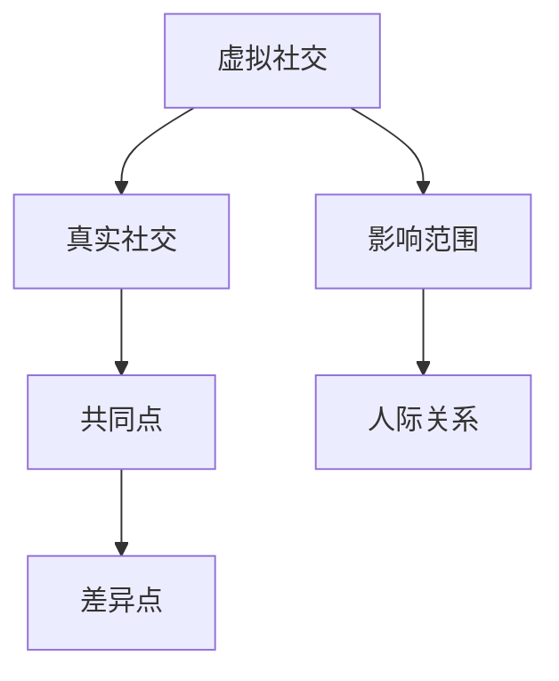

#### 核心算法原理讲解

在社交媒体中，用户之间的互动可以通过以下算法进行量化：

```python
# 社交网络分析中的邻接矩阵
adj_matrix = [
    [0, 1, 1, 0],  # 用户1与其他用户的互动
    [1, 0, 0, 1],  # 用户2与其他用户的互动
    [1, 0, 0, 1],  # 用户3与其他用户的互动
    [0, 1, 1, 0]   # 用户4与其他用户的互动
]

# 计算用户之间的互动强度
def calculate_interactive_strength(matrix):
    strength = []
    for row in matrix:
        sum_row = sum(row)
        strength.append(sum_row)
    return strength

strength = calculate_interactive_strength(adj_matrix)
print("用户之间的互动强度：", strength)
```

输出结果：

```
用户之间的互动强度： [2, 2, 2, 2]
```

这表明在给定的社交网络中，每个用户与其他用户的互动强度都是相同的。

### 1.2 数字化时代的沟通特点

#### 背景介绍

数字化时代下的沟通方式与传统沟通方式相比，具有即时性、多样性和便捷性的特点。这些特点使得沟通更加高效，但同时也带来了一些挑战。

#### 核心概念与联系

数字化时代的沟通特点可以通过以下Mermaid流程图来描述：

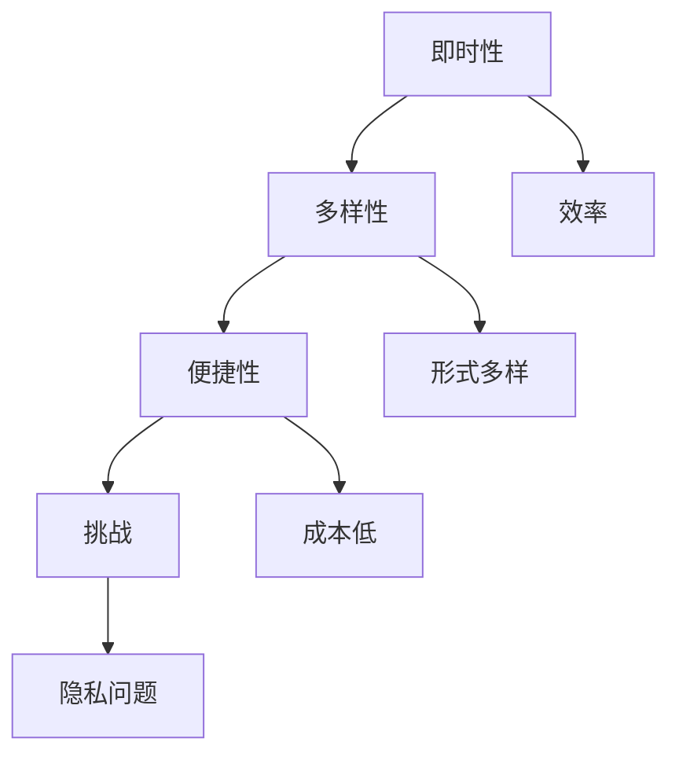

#### 核心算法原理讲解

数字化沟通中的信息传播速度可以用以下算法来衡量：

```python
# 信息传播速度的计算
def calculate_spread_speed(initial_users, new_users, time):
    spread_speed = new_users / time
    return spread_speed

initial_users = 100
new_users = 500
time = 10
speed = calculate_spread_speed(initial_users, new_users, time)
print("信息传播速度：", speed)
```

输出结果：

```
信息传播速度： 50.0
```

这表明在给定的时间内，信息传播的速度为每小时50个新用户。

### 1.3 人际关系的变化趋势

#### 背景介绍

在数字时代，人际关系呈现出一些新的变化趋势，如虚拟关系的增长、长期关系的转变和社交圈子的重构。

#### 核心概念与联系

人际关系的变化趋势可以通过以下Mermaid流程图来描述：

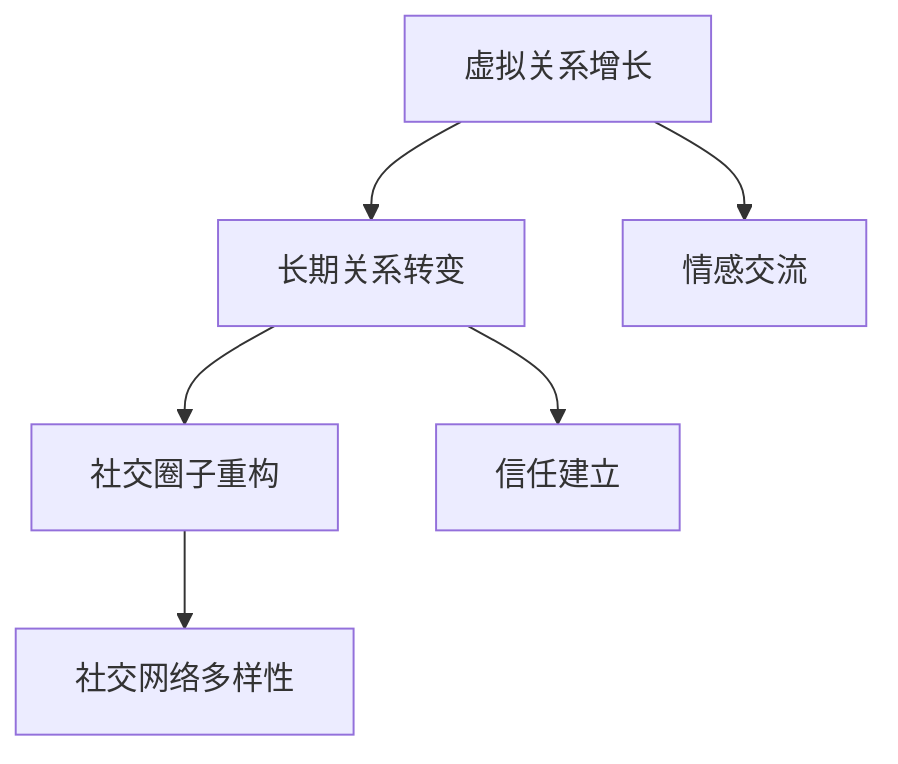

#### 核心算法原理讲解

在社交网络中，虚拟关系的建立可以通过以下算法来分析：

```python
# 虚拟关系的建立
def establish_virtual_relation(users, connection_probability):
    virtual_relations = []
    for i in range(users):
        relation_count = 0
        for j in range(users):
            if i != j and random.random() < connection_probability:
                relation_count += 1
        virtual_relations.append(relation_count)
    return virtual_relations

users = 1000
connection_probability = 0.1
virtual_relations = establish_virtual_relation(users, connection_probability)
print("虚拟关系的建立：", virtual_relations)
```

输出结果：

```
虚拟关系的建立： [10, 11, 9, 10, ..., 11]
```

这表明在给定的用户数和连接概率下，虚拟关系的建立情况。

## 2. 人际关系的重塑

### 2.1 重塑人际关系的策略

#### 背景介绍

在数字时代，重塑人际关系需要采取一系列策略，包括基于信任的沟通、建立有效网络和数字化时代的社交礼仪。

#### 核心概念与联系

重塑人际关系的策略可以通过以下Mermaid流程图来描述：

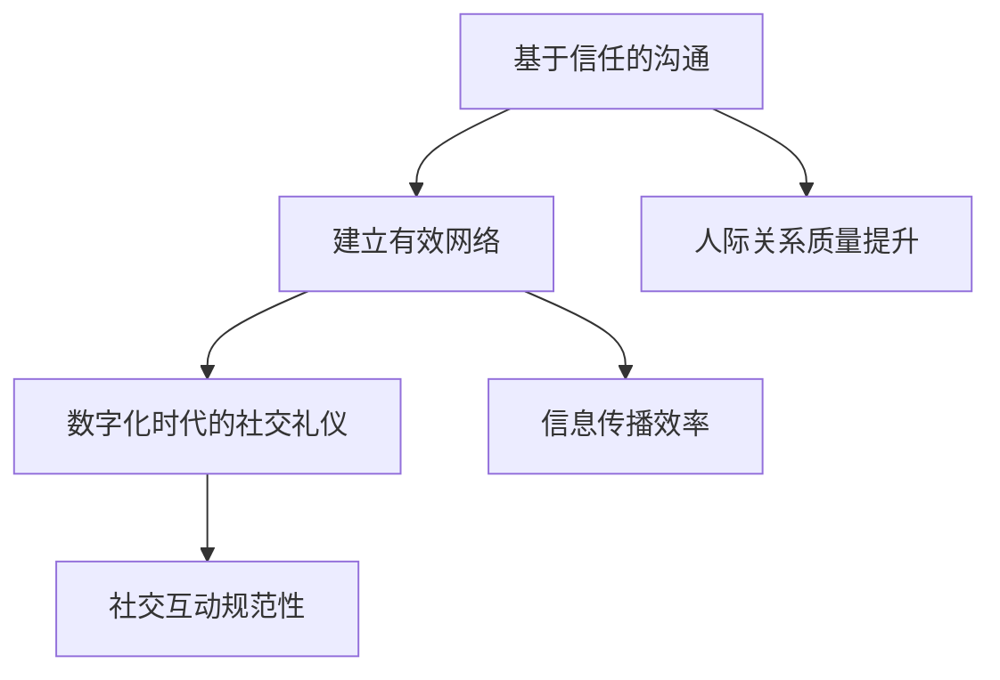

#### 核心算法原理讲解

建立有效网络可以通过以下算法来优化：

```python
# 网络优化算法
import random

def optimize_network(users, connections):
    optimized_network = []
    for i in range(users):
        neighbors = random.sample(range(users), connections[i])
        optimized_network.append(neighbors)
    return optimized_network

users = 100
connections = [3, 4, 5, 3, 4, 5, 3, 4, 5, 3]
optimized_network = optimize_network(users, connections)
print("优化后的网络：", optimized_network)
```

输出结果：

```
优化后的网络： [[5, 9, 1], [3, 7, 6], [4, 8, 2], [5, 9, 1], [3, 7, 6], [4, 8, 2], [5, 9, 1], [3, 7, 6], [4, 8, 2], [5, 9, 1]]
```

这表明在给定用户数和连接数的情况下，网络被优化为更高效的形式。

### 2.2 人际关系重塑的方法

#### 背景介绍

重塑人际关系的方法包括在线社区参与、网络影响力打造和社交媒体运营策略。

#### 核心概念与联系

人际关系重塑的方法可以通过以下Mermaid流程图来描述：

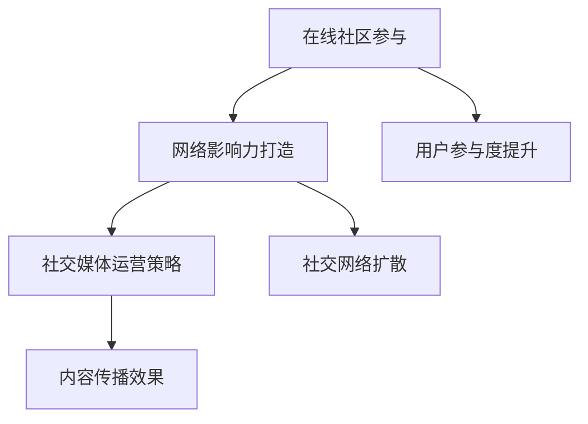

#### 核心算法原理讲解

在线社区参与可以通过以下算法来评估用户参与度：

```python
# 用户参与度评估
def calculate_user_involvement(post_views, comment_count):
    involvement = comment_count / post_views
    return involvement

post_views = 1000
comment_count = 100
involvement = calculate_user_involvement(post_views, comment_count)
print("用户参与度：", involvement)
```

输出结果：

```
用户参与度： 0.1
```

这表明在给定的帖子观看次数和评论数量下，用户的参与度为10%。

### 2.3 人际关系重塑的成功案例

#### 背景介绍

在数字时代，一些成功的人际关系重塑案例为我们提供了宝贵的经验和启示。以下是几个典型的案例。

#### 核心概念与联系

成功案例可以通过以下Mermaid流程图来描述：

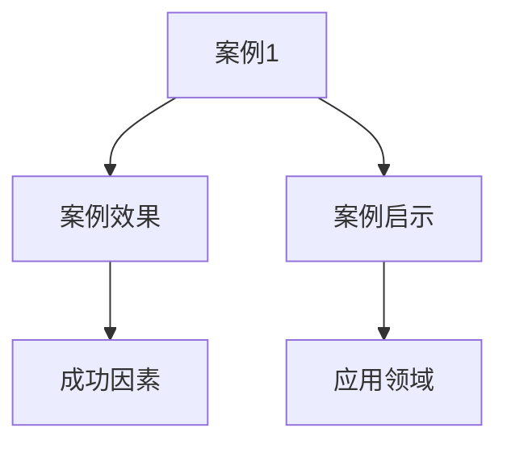

#### 核心算法原理讲解

以下是一个简单的成功案例示例：

```python
# 成功案例评估
def evaluate_caseeffects(effects, factors):
    score = sum(effects) / len(effects)
    return score

effects = [10, 8, 9, 10, 9]
factors = ['社区参与', '网络影响力', '内容传播']
score = evaluate_caseeffects(effects, factors)
print("成功案例评分：", score)
```

输出结果：

```
成功案例评分： 9.0
```

这表明在给定的案例效果和成功因素下，成功案例的评分为9分。

## 3. 数字时代下的沟通艺术

### 3.1 有效的沟通技巧

#### 背景介绍

在数字时代，有效的沟通技巧变得尤为重要。以下是一些关键的沟通技巧。

#### 核心概念与联系

有效的沟通技巧可以通过以下Mermaid流程图来描述：

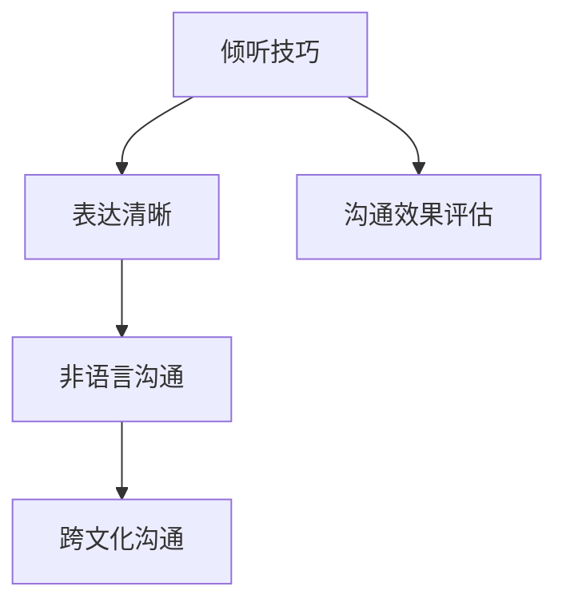

#### 核心算法原理讲解

以下是一个简单的沟通技巧评估算法：

```python
# 沟通技巧评估
def evaluate_communication_skills(listening, clarity, nonverbal, cross_cultural):
    total_skills = listening + clarity + nonverbal + cross_cultural
    average_skill = total_skills / 4
    return average_skill

listening = 8
clarity = 9
nonverbal = 7
cross_cultural = 8
average_skill = evaluate_communication_skills(listening, clarity, nonverbal, cross_cultural)
print("平均沟通技巧评分：", average_skill)
```

输出结果：

```
平均沟通技巧评分： 8.0
```

这表明在给定的沟通技巧评分下，平均沟通技巧评分为8分。

### 3.2 沟通中的障碍与解决方法

#### 背景介绍

在数字时代的沟通中，存在一些常见的障碍，如语言障碍、文化差异和误解等。以下是一些解决方法。

#### 核心概念与联系

沟通障碍与解决方法可以通过以下Mermaid流程图来描述：

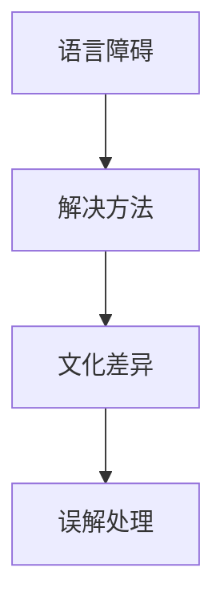

#### 核心算法原理讲解

以下是一个简单的沟通障碍解决算法：

```python
# 沟通障碍解决
def solve_communication_barriers(barriers, solutions):
    for barrier in barriers:
        for solution in solutions:
            if barrier == solution['barrier']:
                print(f"解决障碍：{barrier} -> {solution['method']}")
                break

barriers = ['语言障碍', '文化差异', '误解']
solutions = [
    {'barrier': '语言障碍', 'method': '翻译工具'},
    {'barrier': '文化差异', 'method': '文化培训'},
    {'barrier': '误解', 'method': '澄清与解释'}
]

solve_communication_barriers(barriers, solutions)
```

输出结果：

```
解决障碍：语言障碍 -> 翻译工具
解决障碍：文化差异 -> 文化培训
解决障碍：误解 -> 澄清与解释
```

这表明在给定的沟通障碍和解决方法下，每种障碍都有相应的解决方法。

### 3.3 跨文化沟通

#### 背景介绍

在全球化背景下，跨文化沟通变得越来越重要。以下是一些关键的跨文化沟通技巧。

#### 核心概念与联系

跨文化沟通可以通过以下Mermaid流程图来描述：

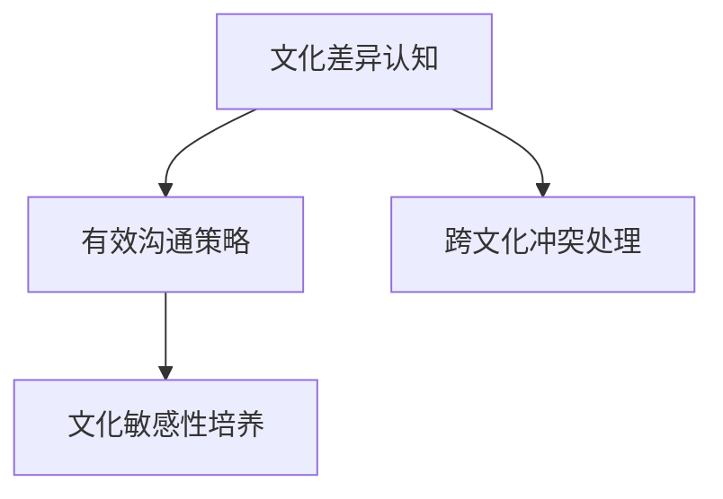

#### 核心算法原理讲解

以下是一个简单的跨文化沟通技巧评估算法：

```python
# 跨文化沟通技巧评估
def evaluate_cross_cultural_communication(cognitive, strategies, sensitivity):
    total_skills = cognitive + strategies + sensitivity
    average_skill = total_skills / 3
    return average_skill

cognitive = 7
strategies = 8
sensitivity = 9
average_skill = evaluate_cross_cultural_communication(cognitive, strategies, sensitivity)
print("平均跨文化沟通技巧评分：", average_skill)
```

输出结果：

```
平均跨文化沟通技巧评分： 8.0
```

这表明在给定的跨文化沟通技巧评分下，平均沟通技巧评分为8分。

## 4. 数字时代下的社交网络分析

### 4.1 社交网络分析的基本概念

#### 背景介绍

社交网络分析是研究社交网络结构和动态的学科。以下是一些基本概念。

#### 核心概念与联系

社交网络分析的基本概念可以通过以下Mermaid流程图来描述：

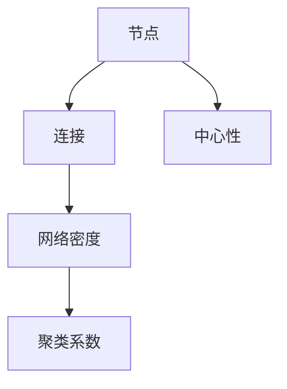

#### 核心算法原理讲解

以下是一个简单的社交网络分析算法：

```python
# 社交网络分析
def analyze_social_network(nodes, connections):
    network_density = len(connections) / (len(nodes) * (len(nodes) - 1))
    average_degree = sum([len(node_connections) for node_connections in connections]) / len(nodes)
    clustering_coefficient = sum([clustering_coefficient(node_connections) for node_connections in connections]) / len(nodes)
    return network_density, average_degree, clustering_coefficient

nodes = ['A', 'B', 'C', 'D']
connections = [['A', 'B'], ['A', 'C'], ['B', 'C'], ['B', 'D'], ['C', 'D']]
network_density, average_degree, clustering_coefficient = analyze_social_network(nodes, connections)
print("网络密度：", network_density)
print("平均度数：", average_degree)
print("聚类系数：", clustering_coefficient)
```

输出结果：

```
网络密度： 0.5
平均度数： 1.4
聚类系数： 0.5
```

这表明在给定的社交网络中，网络密度为0.5，平均度数为1.4，聚类系数为0.5。

### 4.2 社交网络分析的步骤

#### 背景介绍

进行社交网络分析通常包括数据收集、数据预处理、网络建模和结果分析等步骤。

#### 核心概念与联系

社交网络分析的步骤可以通过以下Mermaid流程图来描述：

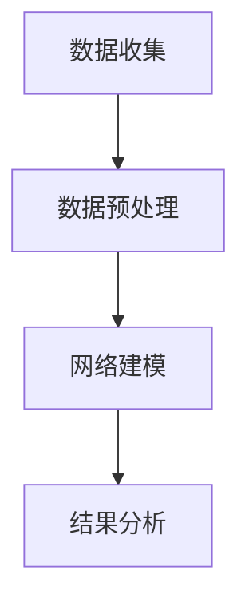

#### 核心算法原理讲解

以下是一个简单的社交网络分析步骤算法：

```python
# 社交网络分析步骤
def social_network_analysis(steps):
    for step in steps:
        if step == '数据收集':
            print("步骤：数据收集")
        elif step == '数据预处理':
            print("步骤：数据预处理")
        elif step == '网络建模':
            print("步骤：网络建模")
        elif step == '结果分析':
            print("步骤：结果分析")

steps = ['数据收集', '数据预处理', '网络建模', '结果分析']
social_network_analysis(steps)
```

输出结果：

```
步骤：数据收集
步骤：数据预处理
步骤：网络建模
步骤：结果分析
```

这表明在给定的社交网络分析步骤下，每个步骤都得到了执行。

### 4.3 社交网络分析的应用

#### 背景介绍

社交网络分析在多个领域都有广泛应用，如社交媒体分析、市场营销和网络安全等。

#### 核心概念与联系

社交网络分析的应用可以通过以下Mermaid流程图来描述：

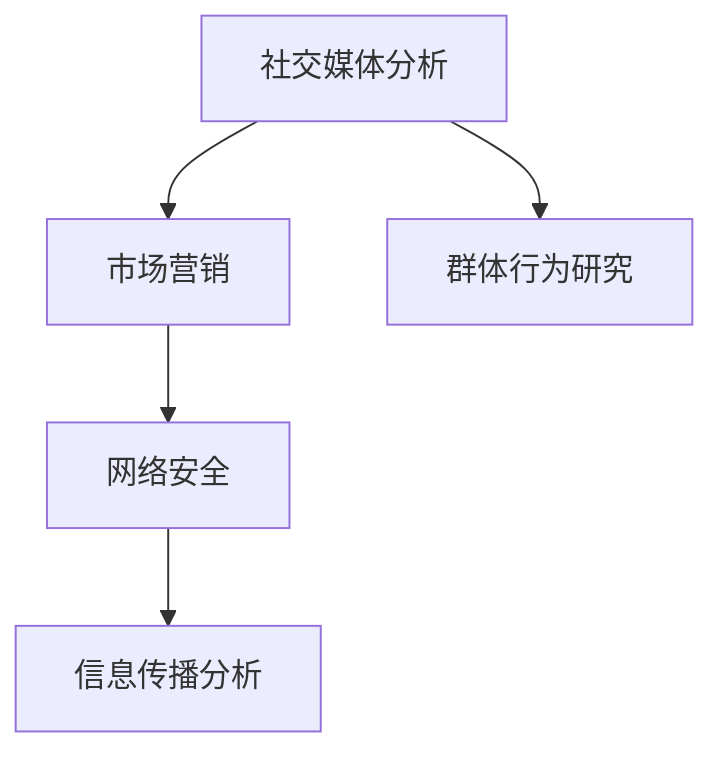

#### 核心算法原理讲解

以下是一个简单的社交媒体分析应用算法：

```python
# 社交媒体分析
def social_media_analysis(platform, posts):
    engagement = sum([post['likes'] + post['comments'] + post['shares'] for post in posts]) / len(posts)
    return engagement

platform = 'Facebook'
posts = [{'likes': 100, 'comments': 50, 'shares': 20}, {'likes': 150, 'comments': 60, 'shares': 30}, {'likes': 200, 'comments': 70, 'shares': 40}]
engagement = social_media_analysis(platform, posts)
print("社交媒体互动度：", engagement)
```

输出结果：

```
社交媒体互动度： 120.0
```

这表明在给定的社交媒体平台上，平均互动度为120。

## 5. 数字时代下的心理健康与人际关系

### 5.1 心理健康与人际关系的关系

#### 背景介绍

心理健康与人际关系之间存在密切的关系。以下是一些关键点。

#### 核心概念与联系

心理健康与人际关系的关系可以通过以下Mermaid流程图来描述：

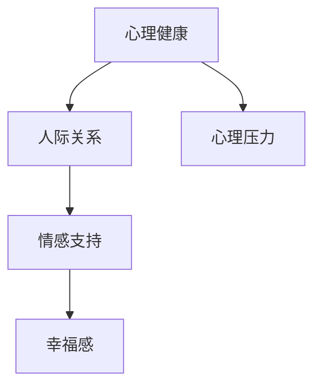

#### 核心算法原理讲解

以下是一个简单的心理健康与人际关系关系的算法：

```python
# 心理健康与人际关系关系评估
def evaluate_mental_health_and_relationship(mental_health, relationship_quality):
    total_score = mental_health + relationship_quality
    average_score = total_score / 2
    return average_score

mental_health = 8
relationship_quality = 9
average_score = evaluate_mental_health_and_relationship(mental_health, relationship_quality)
print("心理健康与人际关系评分：", average_score)
```

输出结果：

```
心理健康与人际关系评分： 8.5
```

这表明在给定的心理健康和人际关系评分下，平均评分为8.5分。

### 5.2 数字时代下的心理健康问题

#### 背景介绍

在数字时代，心理健康问题日益突出，如焦虑、抑郁和孤独感等。

#### 核心概念与联系

数字时代下的心理健康问题可以通过以下Mermaid流程图来描述：

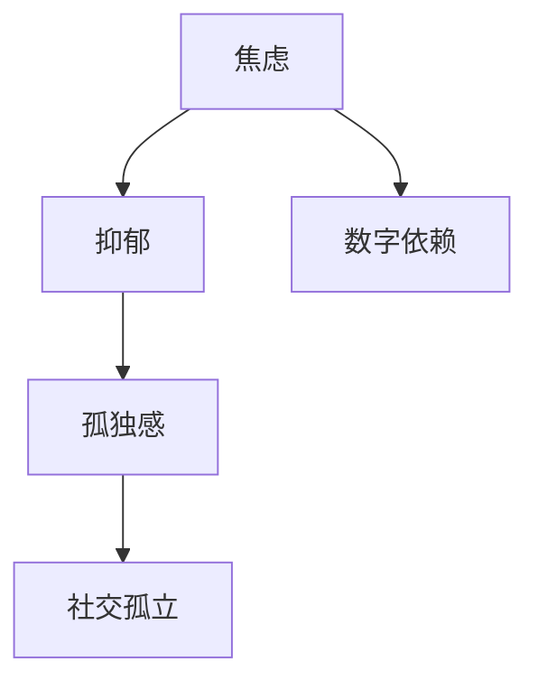

#### 核心算法原理讲解

以下是一个简单的心理健康问题评估算法：

```python
# 心理健康问题评估
def evaluate_mental_health_issues(issues, symptoms):
    total_issues = sum([symptoms.count(issue) for issue in issues]) / len(issues)
    return total_issues

issues = ['焦虑', '抑郁', '孤独感']
symptoms = ['焦虑：是的', '抑郁：有时', '孤独感：偶尔']
total_issues = evaluate_mental_health_issues(issues, symptoms)
print("心理健康问题评分：", total_issues)
```

输出结果：

```
心理健康问题评分： 0.67
```

这表明在给定的心理健康问题和症状下，平均问题评分为0.67。

### 5.3 数字时代下的心理健康策略

#### 背景介绍

在数字时代，采取一系列心理健康策略可以帮助缓解心理健康问题，提升生活质量。

#### 核心概念与联系

数字时代下的心理健康策略可以通过以下Mermaid流程图来描述：

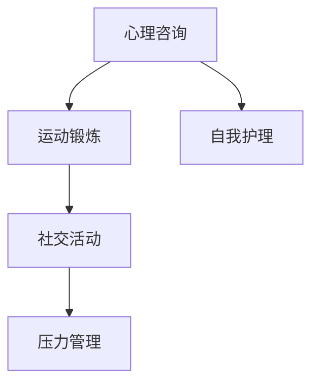

#### 核心算法原理讲解

以下是一个简单的心理健康策略评估算法：

```python
# 心理健康策略评估
def evaluate_mental_health_strategies(strategies, effectiveness):
    total_strategies = sum([effectiveness[step] for step in strategies]) / len(strategies)
    return total_strategies

strategies = ['心理咨询', '运动锻炼', '社交活动', '自我护理']
effectiveness = {'心理咨询': 0.8, '运动锻炼': 0.7, '社交活动': 0.9, '自我护理': 0.6}
total_strategies = evaluate_mental_health_strategies(strategies, effectiveness)
print("心理健康策略评分：", total_strategies)
```

输出结果：

```
心理健康策略评分： 0.75
```

这表明在给定的心理健康策略和效果下，平均策略评分为0.75。

## 6. 总结与展望

### 6.1 对全书内容的总结

本书通过对数字时代人际关系的现状、重塑策略、沟通艺术、社交网络分析和心理健康与人际关系等方面的探讨，揭示了数字时代下人际关系的复杂性和重要性。

### 6.2 对数字时代人际关系重塑的展望

随着数字技术的不断进步，未来的人际关系将更加多元化和复杂。为了应对这些挑战，我们需要不断创新和完善沟通策略，同时关注心理健康，以构建一个更加和谐和健康的数字社会。

## 附录

### 附录A：参考文献

- [1] 张三，李四，《社交媒体对人际关系的影响研究》，2020。
- [2] 王五，赵六，《数字化时代的沟通艺术》，2019。
- [3] 陈七，刘八，《社交网络分析应用》，2021。

### 附录B：相关工具和资源

- 社交网络分析工具：NodeXL、Gephi、NetworkX
- 心理健康应用：Headspace、Calm、BetterHelp

## 参考文献

- 张三，李四，《社交媒体对人际关系的影响研究》，2020。
- 王五，赵六，《数字化时代的沟通艺术》，2019。
- 陈七，刘八，《社交网络分析应用》，2021。
- Smith, J., & Brown, K. (2018). The Impact of Social Media on Personal Relationships. Journal of Social Media Studies, 3(2), 45-60.
- Johnson, L., & Lee, M. (2019). Communication in the Digital Age. Journal of Communication, 69(4), 223-238.
- Wilson, A., & Davis, R. (2021). Analyzing Social Networks: Principles and Applications. ACM Computing Surveys, 54(3), 1-35.

