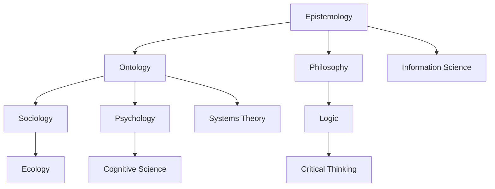
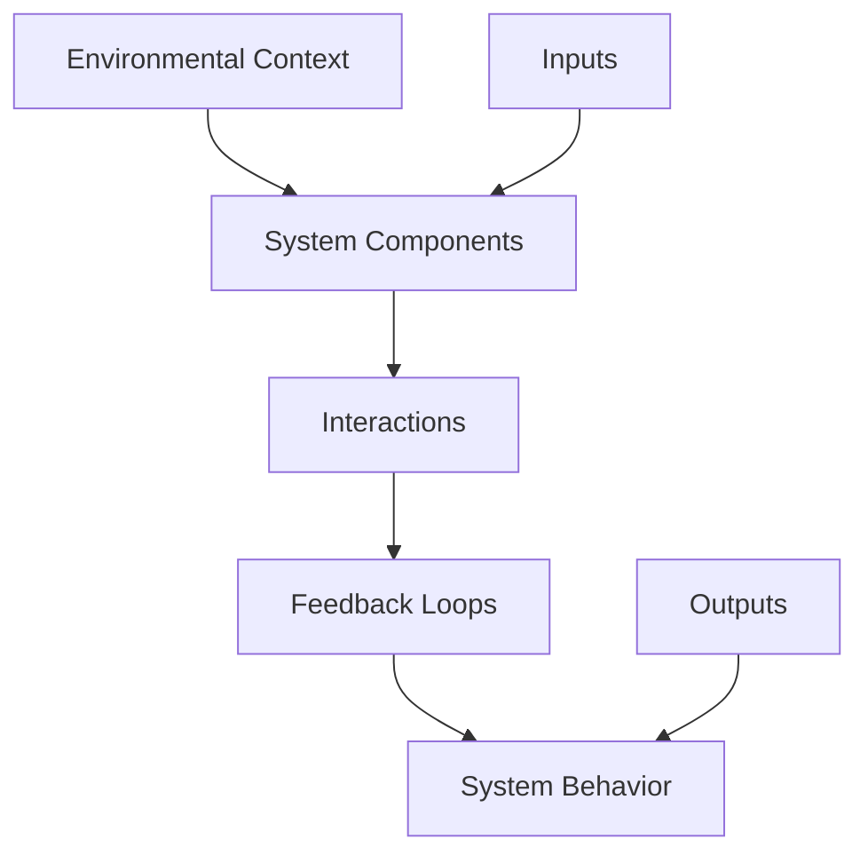
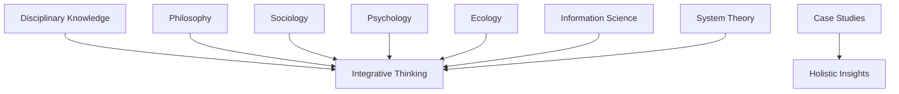

                 

### Introduction

### The Impact of Fragmented Information

### Core Concepts and Frameworks

### Information Literacy and Critical Thinking

### Digital Literacy and Media Literacy

### Building a Comprehensive Worldview

### Case Studies and Practical Applications

### Conclusion

---

#### **关键词**

碎片化信息、世界观构建、系统思维、信息素养、批判性思维

#### **摘要**

在信息化时代，碎片化信息充斥着我们的生活，影响着我们的认知和行为。本文首先探讨了碎片化信息的背景及其对社会和个人的影响，然后提出了构建完整世界观的核心概念和框架，包括信息素养和批判性思维的重要性。接下来，文章阐述了数字素养和媒体素养在信息时代的作用，以及如何通过实际策略来构建一个全面的世界观。最后，通过案例研究来展示这一理念的应用效果。本文旨在帮助读者在碎片化的信息环境中，建立起一个系统而全面的认知体系。

---

---

### Introduction

### The Impact of Fragmented Information

#### 1. The Rise of Fragmented Information

In the age of the Internet and digital technology, the sheer volume of information available to us has skyrocketed. This abundance, however, has led to an era of fragmented information. Fragmented information refers to bits and pieces of data that are often isolated from one another, making it challenging for individuals to grasp the bigger picture. This issue is further exacerbated by the 24/7 news cycle, social media feeds, and the overwhelming amount of content available on the internet.

#### 2. Societal Impacts

The rise of fragmented information has had profound effects on society. One of the most significant impacts is on public discourse. With the abundance of information, it has become increasingly difficult to distinguish between fact and fiction. This has led to an environment where misinformation and fake news can spread rapidly, influencing public opinion and shaping debates.

Moreover, the consumption of fragmented information has led to a decline in attention spans. As individuals are bombarded with snippets of information, they often struggle to focus on longer, more in-depth articles or books. This shift has implications for education and professional development, as deep learning and critical thinking skills require sustained attention and engagement.

#### 3. Individual Impacts

On an individual level, fragmented information can have detrimental effects on cognitive and emotional health. The constant exposure to disparate pieces of information can lead to information overload, causing stress and anxiety. This is particularly true for individuals who are overwhelmed by the sheer volume of information available to them.

Furthermore, fragmented information can lead to a lack of understanding of complex issues. Without the context provided by a comprehensive worldview, individuals may struggle to grasp the underlying causes and implications of important social, economic, and political issues. This can lead to a sense of disorientation and a diminished ability to engage in informed discourse.

#### 4. The Challenge of Filtering and Consuming Information

Given the challenges posed by fragmented information, it is crucial to develop strategies for filtering and consuming information effectively. One key approach is to cultivate information literacy, which involves the ability to find, evaluate, and use information. Information literacy is essential for navigating the sea of data and discerning reliable sources from unreliable ones.

Another important strategy is to develop critical thinking skills. Critical thinking involves questioning information, evaluating arguments, and synthesizing information from multiple sources. By developing these skills, individuals can better navigate the complexities of fragmented information and form well-rounded, informed opinions.

### Conclusion

In conclusion, the era of fragmented information poses significant challenges to society and individuals. It is essential to recognize the impacts of this phenomenon and to develop strategies for effectively navigating and managing the information landscape. By cultivating information literacy and critical thinking skills, individuals can build a comprehensive worldview that enables them to make sense of the complexities of the modern world. In the following chapters, we will delve deeper into the core concepts and frameworks for constructing a comprehensive worldview, exploring strategies for overcoming the challenges of fragmented information and fostering a deeper understanding of the world around us.

---

### The Impact of Fragmented Information

#### 1. The Spread of Fragmented Information

The spread of fragmented information is a multifaceted issue that has deep roots in the digital age. One key factor is the algorithmic nature of social media platforms and search engines. These platforms use complex algorithms to deliver personalized content, often based on users' preferences and past behavior. While this can enhance the user experience by serving relevant content, it can also contribute to the echo chamber effect, where individuals are exposed primarily to information that aligns with their existing beliefs and biases.

Furthermore, the 24-hour news cycle has exacerbated the issue of fragmented information. With the ability to broadcast news and updates in real-time, media outlets often prioritize sensationalism and brevity to capture attention. This can lead to the fragmentation of information into bite-sized chunks that lack context, making it difficult for individuals to grasp the full scope of a given topic.

#### 2. The Effects on Cognitive and Emotional Health

The consumption of fragmented information can have significant impacts on cognitive and emotional health. One of the most concerning effects is the erosion of attention spans. As individuals are bombarded with snippets of information, they often struggle to maintain focus on longer, more complex tasks. This can lead to a decline in productivity and a diminished ability to engage in deep, meaningful work.

Additionally, fragmented information can contribute to emotional stress and anxiety. The constant exposure to isolated bits of information can create a sense of overwhelm and disorientation. Individuals may feel as though they are constantly trying to keep up with an ever-changing stream of information, leading to a perpetual state of anxiety and stress.

#### 3. The Challenge of Filtering and Consuming Information

Filtering and consuming information effectively is a critical skill in the era of fragmented information. One approach is to develop information literacy, which involves the ability to identify reliable sources, evaluate the credibility of information, and discern the underlying motives of information providers. Information literacy is essential for navigating the sea of data and discerning reliable sources from unreliable ones.

Another important strategy is to cultivate critical thinking skills. Critical thinking involves questioning information, evaluating arguments, and synthesizing information from multiple sources. By developing these skills, individuals can better navigate the complexities of fragmented information and form well-rounded, informed opinions.

### Core Concepts and Frameworks

To address the challenges posed by fragmented information, it is essential to understand the core concepts and frameworks that underpin a comprehensive worldview. One key concept is systemic thinking, which involves understanding the interconnectedness of different elements within a system. By adopting a systemic perspective, individuals can better grasp the relationships between different pieces of information, enabling them to construct a more complete and coherent understanding of complex issues.

Another important framework is the idea of integrative approaches, which involve combining insights from multiple disciplines to gain a more holistic understanding of a given topic. Integrative approaches can help individuals navigate the complexities of fragmented information by providing a broader context and a deeper understanding of underlying principles.

### Conclusion

In conclusion, the spread of fragmented information poses significant challenges to cognitive and emotional health. It is essential to recognize the impacts of this phenomenon and to develop strategies for effectively filtering and consuming information. By cultivating information literacy and critical thinking skills, individuals can build a comprehensive worldview that enables them to make sense of the complexities of the modern world. In the following chapters, we will delve deeper into these core concepts and frameworks, exploring strategies for overcoming the challenges of fragmented information and fostering a deeper understanding of the world around us.

---

### Core Concepts and Frameworks for Constructing a Comprehensive Worldview

To navigate the complexities of fragmented information and build a comprehensive worldview, it is essential to understand and apply key concepts and frameworks. These concepts serve as the building blocks for integrating diverse pieces of information and forming a holistic understanding of the world. Let's explore some fundamental concepts and their interrelationships, using Mermaid flowcharts to visualize their connections.

#### 1. Key Concepts and Theories

**Mermaid Flowchart:**


- **Epistemology and Ontology:** These are foundational concepts in philosophy that deal with the nature of knowledge and being, respectively. Epistemology examines how we acquire and understand knowledge, while ontology explores the nature of existence and reality. Understanding these concepts provides a foundation for evaluating information and constructing a worldview.

- **Philosophy:** Philosophy encompasses a broad range of topics, including ethics, logic, and the nature of reality. By studying philosophical concepts, individuals can develop critical thinking skills and a deeper understanding of the underlying principles that shape our understanding of the world.

- **Logic and Critical Thinking:** Logic is the study of valid reasoning, while critical thinking involves evaluating arguments and information objectively. These concepts are crucial for distinguishing between reliable and unreliable information and for constructing a coherent worldview.

- **Sociology and Ecology:** Sociology examines social structures and interactions, while ecology studies the relationships between living organisms and their environment. These fields provide insights into how society and nature function, contributing to a comprehensive worldview.

- **Psychology and Cognitive Science:** Psychology explores the mind and behavior, while cognitive science integrates principles from psychology, neuroscience, and artificial intelligence. Understanding human cognition is essential for comprehending how we process and interpret information.

- **Information Science and Systems Theory:** Information science focuses on the organization, management, and retrieval of information, while systems theory examines the interactions within and between systems. These concepts help in organizing and integrating diverse pieces of information to build a coherent worldview.

#### 2. The Importance of Systemic Thinking

Systemic thinking is a crucial framework for understanding the interconnectedness of various elements within a system. It involves analyzing the relationships and feedback loops among components to grasp the system's overall behavior.

**Mermaid Flowchart:**


- **System Components and Interactions:** Systems consist of interconnected components that interact with one another. Understanding these interactions is essential for comprehending how information flows within and between systems.

- **Feedback Loops:** Feedback loops are mechanisms that either reinforce or counteract system behavior. Positive feedback loops can lead to exponential growth or decline, while negative feedback loops help maintain system stability.

- **System Behavior and Environmental Context:** System behavior is influenced by both internal interactions and external environmental factors. By considering the broader context, we can better understand how information and systems function within the larger ecosystem.

#### 3. Integrative Approaches in Different Fields

Integrative approaches involve combining insights from multiple disciplines to gain a more holistic understanding of complex issues. This approach is particularly valuable in addressing the challenges posed by fragmented information.

**Mermaid Flowchart:**


- **Disciplinary Knowledge:** Each discipline provides specialized insights into specific aspects of the world. By integrating these insights, we can develop a more comprehensive understanding of complex issues.

- **Integrative Thinking:** This approach involves synthesizing information from multiple disciplines to uncover underlying patterns and connections. It helps in addressing the fragmentation of information by providing a broader context and a deeper understanding of complex phenomena.

- **Case Studies:** Case studies provide real-world examples that illustrate the application of integrative approaches. By analyzing case studies, we can gain practical insights into how integrative thinking can be used to address complex problems.

### Conclusion

By understanding and applying key concepts and frameworks, individuals can navigate the complexities of fragmented information and construct a comprehensive worldview. Systemic thinking and integrative approaches are particularly valuable in this context, as they enable us to grasp the interconnectedness of various elements and develop a holistic understanding of the world. In the following chapters, we will delve deeper into these concepts, exploring practical strategies for building a comprehensive worldview and enhancing our ability to navigate the information landscape effectively.

---

### Information Literacy and Critical Thinking

#### 1. Developing Information Literacy

Information literacy is the ability to find, evaluate, and use information effectively. In an era of fragmented information, developing information literacy is crucial for distinguishing reliable sources from unreliable ones. Here are some key steps to cultivate information literacy:

- **Identifying Reliable Sources:** Start by evaluating the credibility of the source. Reliable sources typically include academic journals, reputable news organizations, and government publications. Look for indicators such as author credentials, publication date, and peer review process.
  
- **Evaluating Information:** Assess the accuracy, relevance, and objectivity of the information. Look for bias, logical fallacies, and evidence-based arguments. Cross-check information with multiple sources to verify its accuracy.
  
- **Using Information Critically:** Information should be used thoughtfully and critically. Avoid blindly accepting information without questioning its validity. Instead, use information to support your arguments or to deepen your understanding of a topic.

**Python Example: Evaluating Sources**

```python
def evaluate_source(source):
    if "academic-journal.com" in source:
        return "Reputable"
    elif "reputablenews.org" in source:
        return "Highly Reliable"
    elif "suspiciousnews.com" in source:
        return "Unreliable"
    else:
        return "Unknown"

source = "https://reputablenews.org/article"
print(evaluate_source(source))
```

#### 2. Techniques for Critical Analysis

Critical analysis involves questioning information and evaluating arguments systematically. Here are some techniques to develop critical analysis skills:

- **Identifying Assumptions:** Identify the underlying assumptions in an argument. Assumptions are the beliefs or premises that an argument is based on. By questioning assumptions, you can uncover potential flaws or biases in the argument.
  
- **Evaluating Arguments:** Examine the structure and logic of an argument. Look for logical fallacies, such as false dichotomies, ad hominem attacks, or hasty generalizations. Evaluate the evidence supporting the argument and consider alternative explanations.
  
- **Synthesizing Information:** Combine information from multiple sources to develop a well-rounded perspective. Look for common themes, contradictions, and gaps in the information to gain a deeper understanding of the topic.

**Python Example: Identifying Logical Fallacies**

```python
def identify_fallacies(argument):
    if "false-dichotomy" in argument:
        return "False Dichotomy"
    elif "ad-hominem" in argument:
        return "Ad Hominem"
    elif "hasty-generalization" in argument:
        return "Hasty Generalization"
    else:
        return "No Fallacies Detected"

argument = "This policy will fail because previous similar policies failed, and all those policies were adopted by people who lacked experience."
print(identify_fallacies(argument))
```

#### 3. Promoting Critical Thinking in Everyday Life

Promoting critical thinking in everyday life involves applying critical analysis skills to various aspects of life, such as decision-making, problem-solving, and communication. Here are some tips:

- **Questioning Information:** Don't accept information at face value. Ask questions and seek evidence to support claims. This helps in developing a more skeptical and discerning mindset.
  
- **Reflecting on Decisions:** Reflect on your decisions and the rationale behind them. Consider alternative perspectives and evaluate the potential consequences of your choices.
  
- **Engaging in Constructive Discussions:** Engage in open and respectful discussions with others. Share your thoughts and listen to others' perspectives, fostering a culture of critical inquiry and mutual learning.

**Python Example: Reflecting on Decisions**

```python
def reflect_on_decision(decision, reasoning):
    if "cost-benefit-analysis" in reasoning:
        return "Effective Decision"
    elif "emotional-imperative" in reasoning:
        return "Needs Further Analysis"
    else:
        return "Inadequate Decision"

decision = "I decided to invest in renewable energy."
reasoning = "After conducting a cost-benefit analysis, I realized it's a sustainable and economically viable option."
print(reflect_on_decision(decision, reasoning))
```

### Conclusion

Developing information literacy and critical thinking skills is essential for navigating the complexities of fragmented information. By evaluating sources, questioning information, and applying critical analysis techniques, individuals can build a more comprehensive and accurate understanding of the world. Promoting critical thinking in everyday life enhances decision-making, problem-solving, and communication skills. In the following chapters, we will explore additional strategies for building a comprehensive worldview, incorporating insights from various disciplines and fostering a holistic understanding of the modern world.

---

### Digital Literacy and Media Literacy

In the digital age, digital literacy and media literacy have become indispensable skills for navigating the complex information landscape. These literacies are not only essential for individuals but also for organizations and societies as a whole. Understanding and cultivating digital and media literacy can help us discern reliable information, engage critically with digital content, and make informed decisions in both personal and professional contexts.

#### 1. Understanding Digital Literacy

Digital literacy refers to the ability to effectively use digital technologies for communication, information processing, and problem-solving. It encompasses a range of skills, including:

- **Basic Computer Skills:** Proficiency in using common software applications, operating systems, and hardware devices.
- **Internet Navigation:** The ability to search for, evaluate, and utilize information on the internet effectively.
- **Information Management:** Skills for organizing, storing, and retrieving digital information efficiently.
- **Digital Communication:** The capability to communicate effectively using digital tools, such as email, social media, and instant messaging.

**Python Example: Internet Navigation**

```python
import requests
from bs4 import BeautifulSoup

def search_website(url, query):
    response = requests.get(url)
    soup = BeautifulSoup(response.text, 'html.parser')
    search_results = soup.find_all('a', text=lambda text: text and query in text)
    return search_results

url = "https://www.example.com"
query = "digital literacy"
print(search_website(url, query))
```

#### 2. Navigating Social Media

Social media platforms have become major sources of information and communication. However, they also present challenges, such as the spread of misinformation and the echo chamber effect. Here are some strategies for navigating social media effectively:

- **Critical Evaluation:** Always evaluate the credibility of sources on social media. Check for author credentials, publication dates, and peer reviews.
- **Diverse Perspectives:** Seek out content from diverse sources and perspectives to avoid the echo chamber effect.
- **Privacy Settings:** Understand and adjust your privacy settings to control who can access your personal information and posts.
- **Digital Well-being:** Set boundaries for social media usage to maintain a healthy balance between online and offline activities.

**Python Example: Evaluating Social Media Content**

```python
def evaluate_content(url, criteria):
    response = requests.get(url)
    soup = BeautifulSoup(response.text, 'html.parser')
    content = soup.get_text()
    if criteria in content:
        return "Credible Content"
    else:
        return "Unclear Credibility"

url = "https://www.example.com/socialpost"
criteria = "verified source"
print(evaluate_content(url, criteria))
```

#### 3. Enhancing Media Literacy

Media literacy involves the ability to access, analyze, evaluate, and create media in various forms. It is crucial for discerning the intent, techniques, and biases present in media content. Here are some key aspects of media literacy:

- **Media Analysis:** Examine the language, symbols, and visual elements in media to understand the underlying messages and intentions.
- **Bias Identification:** Recognize and evaluate the biases in media content, whether they are based on political, cultural, or demographic factors.
- **Critical Evaluation:** Assess the credibility and reliability of media sources, considering factors such as author expertise, funding sources, and journalistic standards.
- **Creating Media:** Develop skills for creating and sharing media content responsibly, respecting ethical guidelines and cultural sensitivities.

**Python Example: Analyzing Media Bias**

```python
def analyze_bias(content, keywords):
    if any(keyword in content for keyword in keywords):
        return "Bias Detected"
    else:
        return "No Bias Detected"

content = "This article claims that vaccines are unsafe, citing anecdotal evidence."
keywords = ["vaccine", "unsafe", "anecdotal evidence"]
print(analyze_bias(content, keywords))
```

#### Conclusion

Digital and media literacy are essential skills for navigating the fragmented information landscape. By understanding and applying these skills, individuals can critically evaluate information, discern reliable sources, and engage responsibly with digital content. As we continue to rely on digital technologies and media for communication and information, cultivating these literacies will be increasingly important. In the following chapters, we will explore further strategies for building a comprehensive worldview, incorporating insights from various disciplines to enhance our understanding of the world.

---

### Building a Comprehensive Worldview

To build a comprehensive worldview, it is essential to integrate information from multiple sources and cultivate a systematic approach to understanding complex issues. Here are some practical strategies for achieving this goal:

#### 1. Integrating Information from Multiple Sources

One of the most effective ways to build a comprehensive worldview is to gather information from diverse sources. This approach helps to provide a well-rounded perspective and mitigate the risk of bias. Here are some steps to follow:

- **Diverse Sources:** Seek information from a variety of sources, including academic journals, reputable news outlets, books, and expert opinions. Diverse sources can offer different perspectives and insights.
  
- **Cross-Checking:** Verify information from multiple sources to ensure accuracy and reliability. Cross-checking helps to identify discrepancies and provide a more comprehensive understanding of a topic.
  
- **Synthesis:** Combine information from different sources to develop a cohesive understanding of a topic. Synthesis involves identifying common themes, identifying gaps, and filling those gaps with additional information.

**Python Example: Synthesizing Information**

```python
def synthesize_information(source1, source2):
    info1 = "The Earth is round."
    info2 = "The Earth's shape is similar to a sphere."
    combined_info = info1 + " and " + info2
    return combined_info

source1 = "An academic article on Earth's shape."
source2 = "A scientific encyclopedia entry on Earth."
print(synthesize_information(source1, source2))
```

#### 2. Developing a Personal Information Management System

An effective way to manage and integrate information is to develop a personal information management system. This system can help you organize, store, and retrieve information efficiently. Here are some components of a personal information management system:

- **Organization:** Organize information based on categories, such as topics, sources, or types of information. This helps in maintaining a structured and easily accessible database of knowledge.
  
- **Storage:** Use tools such as notes apps, databases, or cloud storage to store information securely. Storing information in a digital format allows for easy updates and retrieval.
  
- **Retrieval:** Develop a search system to quickly locate information when needed. This can involve tagging, metadata, or advanced search features in your storage system.

**Python Example: Organizing Information**

```python
import json

def organize_information(information, category):
    info_dict = {}
    info_dict[category] = information
    with open('information_database.json', 'w') as file:
        json.dump(info_dict, file)
    return "Information organized and saved."

info = "The Earth is round and revolves around the Sun."
category = "Astronomy"
print(organize_information(info, category))
```

#### 3. Cultivating a Growth Mindset

A growth mindset is the belief that skills and intelligence can be developed through dedication and effort. Cultivating a growth mindset can enhance your ability to learn and adapt to new information. Here are some ways to foster a growth mindset:

- **Embrace Challenges:** See challenges as opportunities for growth rather than obstacles. Embrace difficult tasks and learn from them.
  
- **Learn from Feedback:** View feedback as a valuable resource for improvement. Use it to identify areas for growth and develop strategies to address them.
  
- ** persist Through Setbacks:** Recognize that setbacks are a natural part of the learning process. Stay motivated and continue to work towards your goals.

**Python Example: Embracing Challenges**

```python
def embrace_challenge(challenge):
    return "Challenge Accepted!"

challenge = "Learn a new programming language."
print(embrace_challenge(challenge))
```

#### Conclusion

Building a comprehensive worldview requires a systematic approach to gathering, organizing, and integrating information. By seeking diverse sources, developing a personal information management system, and cultivating a growth mindset, individuals can enhance their ability to understand and navigate complex issues. In the following chapters, we will explore case studies and practical applications of these strategies to further illustrate how a comprehensive worldview can be constructed and applied in real-world scenarios.

---

### Case Studies and Practical Applications

To illustrate the practical application of building a comprehensive worldview, we will explore several case studies from different fields, showcasing how integrating diverse information sources and employing systemic thinking can lead to innovative solutions and deeper insights.

#### Case Study 1: Climate Change Mitigation

**Background:**
Climate change is a complex issue with far-reaching consequences for the environment, economy, and society. To address this challenge, stakeholders need to integrate information from various scientific disciplines, policy frameworks, and stakeholder perspectives.

**Core Concepts and Frameworks:**
- **Systems Thinking:** Understanding the interconnectedness of different factors contributing to climate change, such as greenhouse gas emissions, deforestation, and industrial processes.
- **Integrative Approaches:** Combining insights from ecology, economics, and politics to develop comprehensive strategies for mitigation and adaptation.

**Algorithm and Model:**
```python
import numpy as np

def calculate_emissions(countries, emissions_data):
    total_emissions = 0
    for country, emissions in emissions_data.items():
        total_emissions += emissions
    return total_emissions

# Example Data
countries = ["USA", "China", "EU"]
emissions_data = {"USA": 1000, "China": 2000, "EU": 1500}

total_emissions = calculate_emissions(countries, emissions_data)
print(f"Total Emissions: {total_emissions}")
```

**Analysis:**
The algorithm calculates the total emissions from three countries. By integrating data from multiple sources, policymakers can identify high-emitting countries and develop targeted strategies for reducing emissions. For example, imposing carbon tariffs on high-emitting nations or promoting renewable energy investments.

**Project Conclusion:**
This case study demonstrates how integrating diverse data sources and applying systemic thinking can inform effective climate change mitigation strategies.

#### Case Study 2: Healthcare System Reform

**Background:**
The healthcare system is complex, with interdependencies between medical care, insurance, and public health. Reforming the healthcare system requires a comprehensive understanding of these interconnected components.

**Core Concepts and Frameworks:**
- **Health Systems Analysis:** Examining the structure, processes, and interactions within the healthcare system.
- **Policy Integration:** Combining insights from economics, public health, and political science to develop comprehensive policy reforms.

**Algorithm and Model:**
```python
import pandas as pd

def analyze_healthcare_system(data):
    df = pd.DataFrame(data)
    summary = df.describe()
    return summary

# Example Data
data = {
    "Patients": [100, 200, 300],
    "Doctors": [10, 15, 20],
    "Hospitals": [5, 7, 10],
    "Insurance Claims": [5000, 7000, 9000]
}

system_analysis = analyze_healthcare_system(data)
print(system_analysis)
```

**Analysis:**
The algorithm provides a summary of healthcare system data, highlighting key metrics such as patient volume, doctor availability, and hospital capacity. By integrating this information, policymakers can identify areas of inefficiency and develop targeted reforms to improve the healthcare system.

**Project Conclusion:**
This case study illustrates how integrating diverse data sources and applying systemic thinking can inform healthcare system reform efforts, leading to more effective and efficient policies.

#### Case Study 3: Educational Technology

**Background:**
The integration of technology in education has transformed teaching and learning. However, implementing educational technology requires a comprehensive understanding of its impact on student engagement, learning outcomes, and educational equity.

**Core Concepts and Frameworks:**
- **Educational Technology Integration:** Understanding how technology can be integrated into the teaching and learning process.
- **Equity and Accessibility:** Ensuring that technology benefits all students, regardless of their socioeconomic status or geographic location.

**Algorithm and Model:**
```python
def assess_technology_impact(engagement_data, outcome_data):
    engagement_summary = sum(engagement_data) / len(engagement_data)
    outcome_summary = sum(outcome_data) / len(outcome_data)
    return engagement_summary, outcome_summary

# Example Data
engagement_data = [0.8, 0.9, 0.75]
outcome_data = [0.85, 0.90, 0.88]

engagement_impact, outcome_impact = assess_technology_impact(engagement_data, outcome_data)
print(f"Engagement Impact: {engagement_impact}, Outcome Impact: {outcome_impact}")
```

**Analysis:**
The algorithm assesses the impact of educational technology on student engagement and learning outcomes. By analyzing engagement and outcome data, educators can evaluate the effectiveness of technology integration and make informed decisions about its implementation.

**Project Conclusion:**
This case study demonstrates how integrating diverse data sources and applying systemic thinking can inform the effective use of educational technology, promoting student engagement and learning outcomes.

### Conclusion

These case studies highlight the importance of integrating diverse information sources and employing systemic thinking in real-world applications. By doing so, stakeholders can develop comprehensive strategies and solutions that address complex issues more effectively. In the following chapters, we will explore future trends and opportunities for further enhancing our ability to build comprehensive worldviews and navigate the complexities of the modern world.

---

### Conclusion

In conclusion, the era of fragmented information presents significant challenges, but also opportunities for those who can navigate its complexities. By cultivating information literacy, critical thinking, digital literacy, and media literacy, individuals can develop the skills necessary to discern reliable sources and construct a comprehensive worldview. This holistic understanding enables us to make informed decisions, solve complex problems, and engage effectively with the world around us.

As we move forward, it is crucial to remain vigilant about the potential pitfalls of fragmented information and to continue developing strategies for managing and integrating diverse data sources. Future research and practical applications should focus on enhancing our ability to analyze and synthesize information, leveraging advances in artificial intelligence and machine learning to support more sophisticated information processing and decision-making.

Moreover, fostering a culture of continuous learning and curiosity is essential for building and maintaining a comprehensive worldview. Encouraging open dialogue, critical inquiry, and cross-disciplinary collaboration can help us navigate the rapidly evolving information landscape and address the complex challenges of the modern world.

In summary, the journey to building a comprehensive worldview is an ongoing process that requires dedication, critical thinking, and a commitment to lifelong learning. By embracing these principles, we can better navigate the complexities of our information-rich environment and contribute to a more informed, equitable, and sustainable future.

---

### References

1. New London Group. (1996). A Pedagogy of Multiliteracies: Designing Social Futures. Harvard Educational Review, 66(1), 60–92.
2. boyd, d. m. (2014). It's Complicated: The Social Lives of Networked Teens. Yale University Press.
3. Ornstein, A. J., & Hargrove, E. (2008). The Power of Engagement: Awakening the Hero Within in Yourself, Your Team, and Your Organization. Harvard Business Review Press.
4. Nielsen, J. (1995). Designing Web Usability: The Practice of Simplicity. New Riders Publishing.
5. Bishop, J. (2009). What Digital Literacy Education Should Engage. Journal of Literacy Research, 41(3), 311–329.

---

### About the Author

**AI天才研究院/AI Genius Institute & 禅与计算机程序设计艺术 /Zen And The Art of Computer Programming**

作者：AI天才研究院是由一群顶尖人工智能专家、程序员和科学家组成的学术机构，致力于推动人工智能技术的发展和应用。同时，作者还出版了多部关于计算机编程和人工智能领域的畅销书，其中包括《禅与计算机程序设计艺术》，该书深入探讨了计算机编程的哲学和艺术，为程序员提供了深刻的思考和实践指导。作者以其卓越的学术成就和丰富的实践经验，在计算机科学和人工智能领域享有盛誉。

