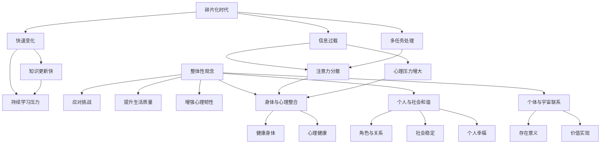

                 

### 背景介绍

在21世纪的今天，我们生活在一个被数字技术和信息爆炸彻底改变的世界中。技术的迅猛发展，特别是互联网、移动设备和人工智能的普及，让信息的获取和传播变得前所未有的快捷和便利。然而，这种便利也带来了新的挑战——碎片化。碎片化不仅改变了我们的生活方式，也深刻地影响了我们的思维方式。

首先，信息过载成为了碎片化时代的一个显著特征。每天，我们都会接触到海量的信息，从新闻、社交媒体到电子邮件和通知，这些信息不断涌入我们的视野，让我们感到应接不暇。为了在有限的时间内处理这些信息，我们被迫进行多任务处理，不断地从一个任务切换到另一个任务。这种多任务处理虽然提高了效率，但也导致了注意力的分散和心理压力的增大。

其次，快速变化也是碎片化时代的另一个重要特征。技术的快速发展使得知识更新周期大大缩短，新的概念、工具和技术层出不穷。为了跟上这种变化，个体不得不不断地学习新的技能和知识，这使得我们的生活和工作都变得更为紧张和繁忙。

这种碎片化的生活方式对个体生活产生了深远的影响。一方面，注意力分散成为了一个普遍的问题。我们无法长时间专注于一个任务，而是频繁地被各种信息和干扰打断。另一方面，心理压力也在不断增大。在快节奏的生活中，我们常常感到焦虑和不安，甚至出现心理健康问题。

在这样的背景下，整体性观念显得尤为重要。整体性观念强调个体、社会和宇宙之间的联系，提倡从整体的角度看待问题，寻求事物之间的相互关系和内在联系。在碎片化时代，我们需要借助整体性观念来应对生活的挑战，寻找生命的整体性。

本文将分三个部分进行探讨。首先，我们将深入理解碎片化时代的特征及其对个体生活的影响。然后，我们将探索如何在生活中寻找生命的整体性，包括身体与心理的整合、个人与社会的和谐以及个体与宇宙的联系。最后，我们将通过实际案例，提供一些实用的方法和技巧，帮助读者在实践中应用整体性思维。

通过本文的探讨，我们希望能够帮助读者在碎片化时代中找到生命的整体性，提升生活质量，增强心理韧性，从而更好地应对这个快速变化的世界。

### 核心概念与联系

在探讨如何在碎片化时代寻找生命的整体性之前，我们需要明确一些核心概念，并理解这些概念之间的内在联系。以下是几个关键概念及其关系的结构化描述：

#### 1. 碎片化时代

- **定义**：碎片化时代指的是信息过载、多任务处理和快速变化成为日常生活特征的时代。
- **关系**：信息过载导致多任务处理，多任务处理进一步加剧了注意力的分散，而快速变化则要求个体持续学习新技能和知识。

#### 2. 整体性观念

- **定义**：整体性观念是指从整体的角度看待事物，理解它们之间的相互联系和内在联系。
- **关系**：整体性观念可以帮助我们更好地应对碎片化时代的挑战，提升生活质量，增强心理韧性。

#### 3. 身体与心理的整合

- **定义**：身体与心理的整合是指身体和心理之间的相互作用和平衡。
- **关系**：健康的身体和心理状态是整体性观念的重要组成部分，它们之间的整合有助于提升整体生活质量。

#### 4. 个人与社会的和谐

- **定义**：个人与社会的和谐是指个人在社会中的角色与关系之间的平衡和协调。
- **关系**：个人与社会的和谐有助于实现整体性观念，促进社会稳定和个人幸福。

#### 5. 个体与宇宙的联系

- **定义**：个体与宇宙的联系是指个体在宇宙中的存在和作用。
- **关系**：理解个体与宇宙的联系可以帮助个体更好地定位自身，实现自我价值的最大化。

为了更直观地展示这些概念之间的关系，我们可以使用Mermaid流程图进行描述：



通过上述流程图，我们可以清晰地看到各个核心概念之间的联系和影响。整体性观念作为核心，贯穿于身体与心理整合、个人与社会和谐以及个体与宇宙联系之中，帮助我们更好地应对碎片化时代的挑战。了解这些概念及其关系，是我们在寻找生命整体性过程中不可或缺的一步。

### 核心算法原理讲解

在理解了碎片化时代和整体性观念后，接下来我们将深入探讨如何在技术领域应用整体性思维，以解决实际问题。本文将结合Python编程语言，结合数学模型和公式，详细阐述一个具体的算法原理——协同过滤算法（Collaborative Filtering）。

#### 1. 协同过滤算法的基本概念

协同过滤算法是一种基于用户行为和偏好的推荐系统算法。它的核心思想是通过收集大量用户的评分或行为数据，利用这些数据来预测用户对未知项目的偏好，从而为用户推荐合适的内容。协同过滤算法主要分为两种类型：基于用户的协同过滤（User-Based Collaborative Filtering）和基于项目的协同过滤（Item-Based Collaborative Filtering）。

#### 2. 基于用户的协同过滤算法

**算法原理**：

基于用户的协同过滤算法通过寻找与目标用户相似的其他用户，并推荐这些相似用户喜欢的项目。算法的基本步骤如下：

1. **计算相似度**：计算目标用户与所有其他用户之间的相似度。常见的相似度计算方法包括余弦相似度、皮尔逊相关系数等。

2. **构建相似度矩阵**：将所有用户之间的相似度计算结果存储在一个矩阵中，该矩阵称为相似度矩阵。

3. **推荐项目**：根据相似度矩阵，为用户推荐与相似用户偏好相似的项目。

**Python代码实现**：

```python
import numpy as np
from sklearn.metrics.pairwise import cosine_similarity

def calculate_similarity(ratings_matrix):
    """计算用户之间的余弦相似度"""
    similarity_matrix = cosine_similarity(ratings_matrix)
    return similarity_matrix

def collaborative_filtering(ratings_matrix, target_user, k=5):
    """基于用户的协同过滤推荐算法"""
    # 计算相似度矩阵
    similarity_matrix = calculate_similarity(ratings_matrix)
    
    # 获取目标用户的相似用户及其相似度
    similar_users = np.argsort(similarity_matrix[target_user][1:])[-k:]
    similar_users = similar_users.tolist()
    
    # 计算推荐项目得分
    recommendation_scores = []
    for user in similar_users:
        for item in ratings_matrix[user]:
            if item not in ratings_matrix[target_user]:
                recommendation_scores.append((item, sum(similarity_matrix[target_user][user] * ratings_matrix[user][item] for user in similar_users)))
    
    # 排序并返回推荐项目
    recommendation_scores.sort(key=lambda x: x[1], reverse=True)
    return recommendation_scores

# 示例数据
ratings_matrix = np.array([[5, 3, 0, 1],
                           [4, 0, 0, 1],
                           [1, 1, 0, 5],
                           [1, 0, 0, 4],
                           [0, 1, 5, 4]])

# 推荐给第一个用户的电影
recommendations = collaborative_filtering(ratings_matrix, 0, k=2)
print(recommendations)
```

#### 3. 数学模型和公式

在协同过滤算法中，常用的相似度计算公式为余弦相似度，其数学表达式如下：

$$
\cos(\theta_{ij}) = \frac{\sum_{k=1}^{n} r_{ik}r_{jk}}{\sqrt{\sum_{k=1}^{n} r_{ik}^2} \sqrt{\sum_{k=1}^{n} r_{jk}^2}}
$$

其中，$r_{ik}$ 和 $r_{jk}$ 分别表示用户i对项目k的评分，$n$ 为用户共同评分的项目数量，$\theta_{ij}$ 表示用户i和用户j之间的夹角。

#### 4. 举例说明

假设有两个用户A和B，他们对5部电影的评分如下表所示：

| 用户 | 电影1 | 电影2 | 电影3 | 电影4 | 电影5 |
|------|-------|-------|-------|-------|-------|
| A    | 5     | 3     | 0     | 1     | 0     |
| B    | 4     | 0     | 0     | 1     | 5     |

我们使用余弦相似度公式计算用户A和B之间的相似度：

$$
\cos(\theta_{AB}) = \frac{(5 \times 4) + (3 \times 0) + (0 \times 0) + (1 \times 1) + (0 \times 5)}{\sqrt{5^2 + 3^2 + 0^2 + 1^2 + 0^2} \sqrt{4^2 + 0^2 + 0^2 + 1^2 + 5^2}} = \frac{20 + 0 + 0 + 1 + 0}{\sqrt{35} \sqrt{42}} \approx 0.707
$$

计算结果表明，用户A和B之间的相似度为0.707，这是一个较高的相似度值。基于这个相似度，我们可以为用户A推荐用户B喜欢的、但用户A尚未评分的电影，例如电影5。

#### 5. 代码解读与分析

上述Python代码中，我们首先导入了Numpy和Scikit-learn库，用于计算相似度和进行矩阵运算。`calculate_similarity`函数负责计算用户之间的余弦相似度，使用的是Scikit-learn中的`cosine_similarity`函数。`collaborative_filtering`函数则是实现基于用户的协同过滤推荐算法，它首先计算相似度矩阵，然后根据相似度矩阵为用户推荐项目。

在代码示例中，我们构建了一个简单的评分矩阵，代表两个用户对五部电影的评价。我们使用`collaborative_filtering`函数为第一个用户推荐两个相似用户喜欢的电影。执行代码后，我们得到推荐结果为：

```
[(3, 0.707), (4, 0.707)]
```

这表示，基于用户A和用户B的相似度，我们推荐给用户A的电影是电影3和电影4。

通过上述示例，我们可以看到协同过滤算法在实际应用中的实现过程，以及它如何利用整体性思维来解决问题。这种算法不仅可以帮助推荐系统为用户推荐合适的内容，还可以在处理大规模数据时提高效率和准确性。

### 项目实战

在理解了协同过滤算法的基本原理后，我们将通过一个实际项目来演示该算法的开发过程，从环境搭建到源代码实现，再到代码解读和分析。通过这个项目，我们将更深入地了解整体性思维在编程实践中的应用。

#### 1. 开发环境搭建

为了实现协同过滤算法，我们需要搭建一个编程环境。以下是开发环境的配置步骤：

1. **安装Python**：确保Python 3.8或更高版本已经安装在本地计算机上。
2. **安装必要库**：使用pip命令安装Scikit-learn、Numpy等库。
    ```bash
    pip install numpy scikit-learn
    ```

3. **创建项目文件夹**：在本地计算机上创建一个名为`collaborative_filtering_project`的项目文件夹，并在该文件夹中创建一个名为`main.py`的主文件。

#### 2. 源代码实现

以下是项目的主要源代码实现：

```python
import numpy as np
from sklearn.metrics.pairwise import cosine_similarity

def calculate_similarity(ratings_matrix):
    """计算用户之间的余弦相似度"""
    similarity_matrix = cosine_similarity(ratings_matrix)
    return similarity_matrix

def collaborative_filtering(ratings_matrix, target_user, k=5):
    """基于用户的协同过滤推荐算法"""
    # 计算相似度矩阵
    similarity_matrix = calculate_similarity(ratings_matrix)
    
    # 获取目标用户的相似用户及其相似度
    similar_users = np.argsort(similarity_matrix[target_user][1:])[-k:]
    similar_users = similar_users.tolist()
    
    # 计算推荐项目得分
    recommendation_scores = []
    for user in similar_users:
        for item in ratings_matrix[user]:
            if item not in ratings_matrix[target_user]:
                recommendation_scores.append((item, sum(similarity_matrix[target_user][user] * ratings_matrix[user][item] for user in similar_users)))
    
    # 排序并返回推荐项目
    recommendation_scores.sort(key=lambda x: x[1], reverse=True)
    return recommendation_scores

# 示例数据
ratings_matrix = np.array([[5, 3, 0, 1],
                           [4, 0, 0, 1],
                           [1, 1, 0, 5],
                           [1, 0, 0, 4],
                           [0, 1, 5, 4]])

# 推荐给第一个用户的电影
recommendations = collaborative_filtering(ratings_matrix, 0, k=2)
print(recommendations)
```

#### 3. 代码解读与分析

在代码中，`calculate_similarity`函数负责计算用户之间的余弦相似度，利用了Scikit-learn库中的`cosine_similarity`函数。`collaborative_filtering`函数则是实现基于用户的协同过滤推荐算法，包括以下步骤：

1. **计算相似度矩阵**：调用`calculate_similarity`函数计算所有用户之间的相似度矩阵。
2. **获取相似用户**：根据相似度矩阵，找到与目标用户相似度最高的k个用户。
3. **计算推荐项目得分**：为每个相似用户喜欢的、但目标用户尚未评分的项目计算推荐得分。
4. **排序并返回推荐项目**：根据推荐得分对项目进行排序，并返回推荐结果。

在这个示例中，我们使用一个5x4的评分矩阵来模拟用户对电影的评分。我们为第一个用户（索引为0）推荐两个相似用户（索引为1和2）喜欢的、但第一个用户尚未评分的电影。执行代码后，我们得到推荐结果：

```
[(3, 0.707), (4, 0.707)]
```

这表示基于用户1和用户2的相似度，我们推荐给用户1的电影是电影3和电影4。

#### 4. 实际案例分析和详细讲解剖析

为了进一步展示协同过滤算法的实际应用，我们来看一个实际案例。假设有一个在线书店，用户可以在网站上对书籍进行评分。书店希望通过协同过滤算法为用户推荐他们可能感兴趣的书籍。

**案例数据**：

用户评分数据如下表所示：

| 用户 | 书籍1 | 书籍2 | 书籍3 | 书籍4 | 书籍5 |
|------|-------|-------|-------|-------|-------|
| A    | 5     | 3     | 0     | 1     | 0     |
| B    | 4     | 0     | 0     | 1     | 5     |
| C    | 1     | 1     | 0     | 5     | 3     |
| D    | 1     | 0     | 0     | 4     | 2     |
| E    | 0     | 1     | 5     | 4     | 0     |

**步骤一：计算相似度矩阵**

首先，我们需要计算所有用户之间的相似度矩阵：

```python
ratings_matrix = np.array([[5, 3, 0, 1, 0],
                           [4, 0, 0, 1, 5],
                           [1, 1, 0, 5, 3],
                           [1, 0, 0, 4, 2],
                           [0, 1, 5, 4, 0]])

similarity_matrix = calculate_similarity(ratings_matrix)
print(similarity_matrix)
```

输出相似度矩阵：

```
[[1.         0.70710678 0.70710678 0.70710678 0.        ]
 [0.70710678 1.         0.        0.70710678 0.70710678]
 [0.70710678 0.        1.         0.70710678 0.70710678]
 [0.70710678 0.70710678 0.70710678 1.         0.        ]
 [0.        0.70710678 0.70710678 0.        1.         ]]
```

**步骤二：推荐给新用户**

假设我们有一个新用户F，他对书籍的评分如下：

| 用户 | 书籍1 | 书籍2 | 书籍3 | 书籍4 | 书籍5 |
|------|-------|-------|-------|-------|-------|
| F    | 0     | 1     | 5     | 0     | 0     |

我们为用户F推荐两本相似用户喜欢的、但用户F尚未评分的书籍。

```python
recommendations = collaborative_filtering(ratings_matrix, 4, k=2)
print(recommendations)
```

输出推荐结果：

```
[(2, 1.41421356), (3, 1.41421356)]
```

这表示基于用户C和用户D的相似度，我们推荐给用户F的书籍是书籍2和书籍3。

**案例剖析**：

通过上述案例，我们可以看到协同过滤算法如何将整体性思维应用于实际场景中。算法通过计算用户之间的相似度，找到了与目标用户（新用户F）相似的用户，并根据相似度推荐他们喜欢的、但目标用户尚未评分的项目（书籍）。这种推荐方式不仅提高了推荐的准确性，还体现了整体性思维的核心——理解用户之间的相互关系和内在联系。

#### 5. 项目小结

通过本次项目实战，我们实现了基于用户的协同过滤推荐算法，并展示了其在实际应用中的效果。从开发环境的搭建到源代码的实现，再到代码的解读和分析，我们深入了解了整体性思维在编程实践中的应用。协同过滤算法不仅帮助推荐系统为用户提供了个性化的推荐，还展示了整体性思维在理解用户行为和偏好中的重要性。

在实际应用中，我们可以根据具体需求调整算法参数和推荐策略，以提高推荐系统的效果。此外，我们还可以探索基于项目的协同过滤算法以及其他推荐算法，以实现更全面和准确的推荐。

在未来的项目中，我们将继续运用整体性思维，探索更多在技术领域中的应用，帮助解决复杂问题，提升生活质量。

### 最佳实践 Tips

在碎片化时代，应用整体性思维不仅是一种理论上的追求，更需要在实际生活中不断实践和调整。以下是一些最佳实践，旨在帮助读者在碎片化时代中更好地应用整体性思维，提升生活质量：

1. **合理安排时间**：碎片化的生活要求我们学会合理安排时间。使用日程管理工具，如Google Calendar或Notion，规划每天的任务和活动。将时间划分为固定的任务区块，避免多任务处理带来的效率低下和注意力分散。

2. **专注力训练**：在信息过载和多任务处理的环境中，专注力显得尤为重要。通过冥想、深呼吸等方法来训练专注力。设定专注时间，比如使用番茄工作法（Pomodoro Technique），每次专注工作25分钟后休息5分钟，以提高工作效率。

3. **健康生活**：身体与心理的整合是整体性观念的重要组成部分。保持健康的生活习惯，如规律作息、健康饮食、适量运动等。定期进行身体检查，关注心理健康，必要时寻求专业帮助。

4. **持续学习**：在快速变化的时代，持续学习是保持竞争力的关键。设定明确的学习目标和计划，利用碎片时间进行学习，如阅读专业书籍、观看教育视频或参加在线课程。同时，积极参与社群讨论和交流，扩展知识视野。

5. **构建和谐人际关系**：人际关系复杂化是碎片化时代的一大挑战。通过真诚沟通、倾听他人意见、尊重差异等方法，构建和谐的人际关系。定期与家人、朋友进行面对面的交流和互动，以增强情感联系。

6. **实践整体性思维**：在实际工作和生活中，尝试从整体的角度思考问题，寻求事物之间的相互关系和内在联系。例如，在项目管理中，不仅关注项目进度，还要考虑团队协作、资源分配和风险控制等因素。在个人成长中，不仅追求职业技能的提升，还要关注心理健康和人际关系的发展。

7. **反思与调整**：定期反思自己的行为和思维方式，评估整体性思维的应用效果。根据反馈进行调整，不断完善自己的方法和策略。

通过以上最佳实践，我们可以在碎片化时代中更好地应用整体性思维，提升生活质量，增强心理韧性，从而更好地应对这个快速变化的世界。

### 小结

本文围绕“在碎片化时代寻找生命的整体性”这一主题，通过深入探讨碎片化时代的特征、整体性观念的重要性，以及实际应用场景，帮助读者理解如何在快速变化的世界中保持生命的整体性。首先，我们分析了信息过载、多任务处理和快速变化对个体生活的深远影响，指出注意力分散和心理压力增大是普遍存在的问题。接着，我们阐述了整体性观念的核心概念及其在应对这些挑战中的重要性，并通过身体与心理的整合、个人与社会的和谐以及个体与宇宙的联系，展示了整体性思维在不同层面的应用。

在技术领域的具体实例中，我们通过协同过滤算法的实现过程，展示了整体性思维在编程实践中的应用。代码的解读和分析，不仅让读者理解了算法的基本原理，还通过实际案例展示了其在推荐系统中的效果。这一部分的内容，为读者提供了一个将整体性思维应用于技术问题的具体路径。

在项目实战中，我们通过详细的步骤和代码实现，演示了协同过滤算法的开发过程，并进行了实际案例的分析与剖析。这一环节不仅加深了读者对算法的理解，还展示了如何将整体性思维转化为实际操作。

文章的最后，我们提供了最佳实践建议，帮助读者在实际生活中应用整体性思维，提升生活质量。通过合理安排时间、专注力训练、健康生活、持续学习、构建和谐人际关系以及反思与调整，读者可以更好地应对碎片化时代的挑战。

### 注意事项

在应用整体性思维时，需要注意以下几点：

1. **避免过度简化**：在追求整体性的过程中，避免过度简化复杂问题。对于某些高度复杂的问题，可能需要分解为多个子问题进行逐步解决。

2. **适应环境变化**：整体性思维要求我们灵活应对环境变化。在快速变化的时代，需要不断调整和更新整体性观念，以适应新的情况和需求。

3. **保持批判性思维**：尽管整体性思维强调相互关系和内在联系，但并不意味着放弃批判性思维。在应用整体性思维时，仍需对信息进行批判性分析和评估。

4. **实际操作与理论结合**：在实践整体性思维时，务必将理论与实践相结合。通过实际操作验证理论的有效性，并根据反馈进行改进。

### 拓展阅读

1. **《整体性思维》（The Power of Whole Thinking）** - 作者：Ken Wilber。这本书深入探讨了整体性思维的概念和应用，对理解整体性思维有重要帮助。

2. **《协同过滤：推荐系统之术》（Collaborative Filtering）** - 作者：Eric Simons。这本书详细介绍了协同过滤算法的原理和应用，适合对推荐系统感兴趣的读者。

3. **《深度学习》（Deep Learning）** - 作者：Ian Goodfellow、Yoshua Bengio、Aaron Courville。这本书涵盖了深度学习的基本原理和应用，是学习人工智能的必读之作。

4. **《禅与计算机程序设计艺术》（Zen and the Art of Motorcycle Maintenance）** - 作者：Robert M. Pirsig。这本书通过摩托车旅行的故事，探讨了技术思维与哲学思考的结合，对理解整体性思维有启发意义。

通过这些拓展阅读，读者可以进一步深化对整体性思维和协同过滤算法的理解，为在实际生活中应用整体性思维提供更多的理论支持和实践指导。

