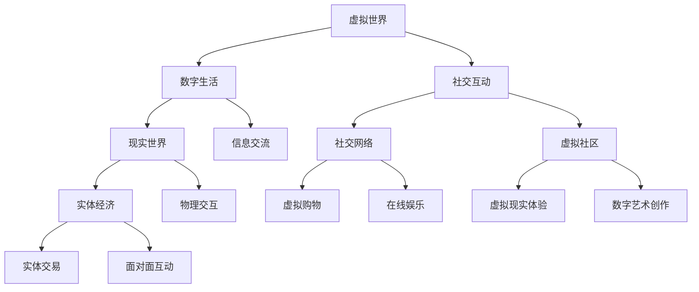
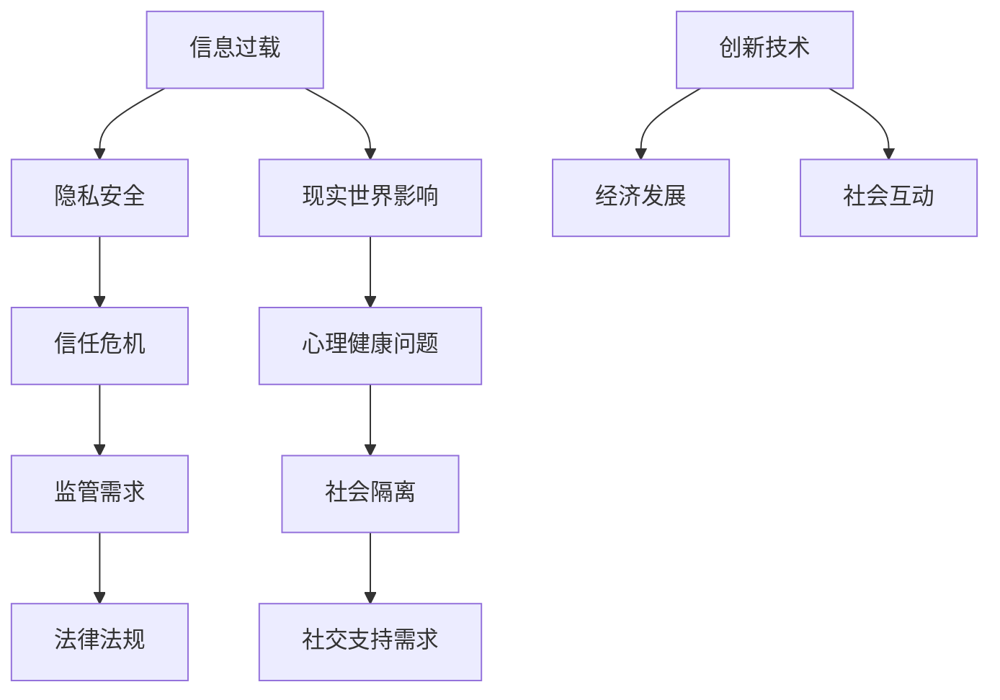

                 


# 在虚拟与现实之间寻找平衡

> 关键词：虚拟现实，增强现实，人工智能，数字生活，现实生活，融合技术，算法原理

> 摘要：本文将探讨虚拟与现实之间寻找平衡的重要性，从核心概念、技术基础、算法原理和项目实战等方面，深入分析如何实现两者之间的和谐共存。

## 引言

在当今快速发展的信息技术时代，虚拟世界与现实世界的界限变得越来越模糊。人们不仅可以通过互联网与全球各地的人互动，还可以通过虚拟现实（VR）和增强现实（AR）技术，亲身体验这些数字环境。然而，这种技术的普及也带来了诸多挑战，如何在虚拟与现实之间寻找平衡，成为了一个亟待解决的问题。

本文将从以下几个方面进行探讨：

1. **核心概念与联系**
2. **核心算法原理讲解**
3. **项目实战与案例分析**
4. **最佳实践与总结**

希望通过本文的阐述，能够为读者在探索虚拟与现实之间的平衡提供一些有益的思路。

## 第一部分：核心概念与联系

### 1.1 虚拟与现实之间的概念框架

在探讨“在虚拟与现实之间寻找平衡”这一主题时，我们需要首先明确几个核心概念：

- **虚拟世界**：通常指的是通过计算机技术创造出的数字环境，如游戏、社交网络、虚拟现实（VR）和增强现实（AR）等。

- **现实世界**：指我们实际生活的物理环境。

- **数字生活**：人们通过互联网和数字设备参与的社会活动，包括在线学习、远程工作、电子商务等。

这些概念之间的联系可以用以下Mermaid流程图来描述：



通过这个流程图，我们可以看到虚拟与现实在数字生活和社交互动中的交织与互动。

### 1.2 虚拟与现实之间的挑战与机遇

在理解了基本概念之后，我们需要探讨在虚拟与现实之间寻找平衡所面临的挑战与机遇。

#### 1.2.1 挑战

- **信息过载**：在虚拟世界中，人们可能面临大量信息的冲击，难以筛选和处理。

- **隐私安全**：虚拟世界中的个人数据和隐私保护是一个重要问题。

- **现实世界影响**：过度沉浸于虚拟世界可能会影响个人的现实生活，如健康、社交和职业发展。

#### 1.2.2 机遇

- **创新技术**：虚拟现实、增强现实、人工智能等技术的发展为人们提供了新的互动和体验方式。

- **经济发展**：虚拟世界的经济活动不断壮大，为传统产业带来了新的商业模式。

- **社会互动**：虚拟社区和社交网络为人们提供了新的社交平台，促进了全球范围内的沟通与合作。

这些挑战与机遇之间的关系可以用以下Mermaid流程图来表示：



通过这个流程图，我们可以清晰地看到虚拟与现实之间的互动关系以及相关的挑战和机遇。

## 第二部分：核心算法原理讲解

### 2.1 虚拟与现实融合的技术基础

在寻找虚拟与现实之间的平衡时，核心算法和技术的原理至关重要。以下是几个关键的技术概念：

#### 2.1.1 虚拟现实（VR）技术

虚拟现实（VR）技术通过计算机生成三维空间，使用户能够在其中沉浸体验。

##### 感知交互

用户通过头戴显示器（HMD）、手柄等设备感知虚拟环境。

```python
class VR_Environment:
    def __init__(self, hmd, hand_hands):
        self.hmd = hmd
        self.hand_hands = hand_hands
    
    def perceive_environment(self):
        # 感知虚拟环境
        self.hmd.update_sensors()
        self.hand_hands.update_sensors()
```

##### 视觉处理

实时渲染和图像处理技术，提供逼真的视觉体验。

```python
def render_image(virtual_scene):
    # 渲染图像
    rendered_image = render(virtual_scene)
    display_image(rendered_image)
```

#### 2.1.2 增强现实（AR）技术

增强现实（AR）技术将数字信息叠加到现实世界中。

##### 追踪定位

使用摄像头和传感器定位用户位置和姿态。

```python
class AR_Environment:
    def __init__(self, camera, sensor):
        self.camera = camera
        self.sensor = sensor
    
    def locate_user(self):
        # 定位用户
        position = self.camera.capture_image()
        orientation = self.sensor.capture_orientation()
        return position, orientation
```

##### 信息叠加

将数字信息通过增强现实眼镜或手机屏幕显示给用户。

```python
def overlay_info(on_image, info):
    # 信息叠加
    new_image = on_image.copy()
    new_image.blit(info)
    return new_image
```

#### 2.1.3 人工智能（AI）技术

为虚拟现实和增强现实提供智能化的交互和体验。

##### 机器学习

用于分析和预测用户行为，提供个性化体验。

```python
class UserBehaviorModel:
    def __init__(self, data):
        self.data = data
    
    def train_model(self):
        # 训练模型
        model = train(data)
        return model
    
    def predict_behavior(self, model):
        # 预测用户行为
        behavior = model.predict()
        return behavior
```

##### 自然语言处理

实现人与虚拟环境的自然语言交互。

```python
class NLP_Interaction:
    def __init__(self, user_input):
        self.user_input = user_input
    
    def process_input(self):
        # 处理输入
        processed_input = process(user_input)
        return processed_input
    
    def generate_response(self, processed_input):
        # 生成响应
        response = generate_response(processed_input)
        return response
```

### 2.2 核心算法原理详解

以下将详细介绍虚拟与现实融合技术中的核心算法原理，包括虚拟现实场景生成、增强现实信息叠加、人工智能行为预测等。

#### 2.2.1 虚拟现实场景生成

虚拟现实场景生成是构建虚拟环境的基础，其主要过程包括环境初始化、3D模型加载、实时渲染和用户交互等。以下是相关算法原理的详细描述：

1. **环境初始化**：

   环境初始化是构建虚拟现实场景的第一步，包括设置虚拟空间的尺寸、视角、光照效果等。以下是一个简单的Python类定义，用于初始化虚拟环境。

   ```python
   class VirtualEnvironment:
       def __init__(self, width, height, fov, light):
           self.width = width
           self.height = height
           self.fov = fov
           self.light = light
       
       def initialize(self):
           # 初始化虚拟环境
           self.scene = create_scene(self.width, self.height, self.fov, self.light)
   ```

2. **3D模型加载**：

   加载3D模型是将虚拟环境变得生动的重要步骤。这通常涉及从文件中读取模型数据，并将其导入到渲染引擎中。以下是加载3D模型的Python函数示例：

   ```python
   def load_3d_model(model_path):
       # 加载3D模型
       model = load_model(model_path)
       return model
   ```

3. **实时渲染**：

   实时渲染是虚拟现实的核心，它负责在用户视角中生成动态场景。以下是渲染过程的简化算法：

   ```python
   def render_scene(scene, camera):
       # 渲染场景
       rendered_image = render(scene, camera)
       return rendered_image
   ```

4. **用户交互**：

   用户交互是虚拟现实体验的重要组成部分，包括处理用户的输入和更新用户在虚拟环境中的位置和动作。以下是处理用户交互的Python类定义：

   ```python
   class UserInteraction:
       def __init__(self, input_device):
           self.input_device = input_device
       
       def handle_input(self):
           # 处理用户输入
           input_data = self.input_device.capture()
           return input_data
       
       def update_position(self, camera, input_data):
           # 更新用户位置
           new_position = update_camera_position(camera, input_data)
           return new_position
   ```

#### 2.2.2 增强现实信息叠加

增强现实信息叠加是将数字信息叠加到现实世界中的技术，其主要过程包括用户位置追踪、信息叠加和渲染。以下是相关算法原理的详细描述：

1. **用户位置追踪**：

   用户位置追踪是增强现实的基础，它使用摄像头和传感器实时监测用户的位置和姿态。以下是追踪用户位置的Python函数示例：

   ```python
   def track_user_position(camera):
       # 追踪用户位置
       position = camera.capture_position()
       return position
   ```

2. **信息叠加**：

   信息叠加是将数字信息（如文字、图像、3D模型等）叠加到现实世界的图像中。以下是信息叠加的Python函数示例：

   ```python
   def overlay_info(image, info, position):
       # 信息叠加
       new_image = image.copy()
       new_image = overlay(new_image, info, position)
       return new_image
   ```

3. **渲染**：

   增强现实的渲染过程是将叠加了数字信息后的图像显示给用户。以下是渲染过程的Python函数示例：

   ```python
   def render_ar_image(image):
       # 渲染增强现实图像
       rendered_image = display_image(image)
       return rendered_image
   ```

#### 2.2.3 人工智能行为预测

人工智能行为预测是虚拟现实和增强现实的高级应用，它通过机器学习和自然语言处理技术，预测用户的行为和需求，提供个性化的交互体验。以下是相关算法原理的详细描述：

1. **用户行为模型**：

   用户行为模型通过分析用户的历史行为数据，建立用户行为模型，用于预测用户未来的行为。以下是构建用户行为模型的Python类定义：

   ```python
   class UserBehaviorModel:
       def __init__(self, data):
           self.data = data
       
       def train_model(self):
           # 训练模型
           model = train_behavior_model(self.data)
           return model
       
       def predict_behavior(self, model):
           # 预测用户行为
           behavior = model.predict()
           return behavior
   ```

2. **自然语言处理**：

   自然语言处理（NLP）技术用于实现用户与虚拟环境之间的自然语言交互。以下是NLP交互的Python类定义：

   ```python
   class NLPInteraction:
       def __init__(self, user_input):
           self.user_input = user_input
       
       def process_input(self):
           # 处理用户输入
           processed_input = process_input(self.user_input)
           return processed_input
       
       def generate_response(self, processed_input):
           # 生成响应
           response = generate_response(processed_input)
           return response
   ```

## 第三部分：项目实战与案例分析

### 3.1 虚拟现实项目实战

在这个部分，我们将搭建一个简单的虚拟现实项目，实现一个基本的虚拟场景，包括场景初始化、3D模型加载、实时渲染和用户交互等功能。

#### 3.1.1 开发环境搭建

1. **软件环境**：

   - **Unity Hub**：用于下载和安装Unity编辑器。
   - **Unity Editor**：虚拟现实项目的开发工具。
   - **Unity Asset Store**：用于购买和下载3D模型等资源。

2. **硬件环境**：

   - **VR头显**：如Oculus Rift、HTC Vive等。
   - **手柄**：用于与虚拟环境进行交互。

#### 3.1.2 源代码实现

以下是项目的源代码实现，包括场景初始化、3D模型加载、实时渲染和用户交互等功能。

```csharp
using UnityEngine;

public class VRProject : MonoBehaviour
{
    // 场景初始化
    private void Start()
    {
        // 创建虚拟环境
        VirtualEnvironment virtualEnvironment = new VirtualEnvironment(100, 100, 60, new Vector3(0, 0, 0));

        // 加载3D模型
        ModelLoader modelLoader = new ModelLoader("model_path");

        // 渲染循环
        while (true)
        {
            // 更新视角
            Camera.main.transform.position = virtualEnvironment.UpdateCameraPosition();

            // 渲染场景
            RenderScene(modelLoader.LoadModel());
        }
    }

    // 用户交互
    private void Update()
    {
        // 处理用户输入
        UserInteraction userInteraction = new UserInteraction(Input.inputString);

        // 更新用户位置
        Camera.main.transform.position = userInteraction.UpdatePosition(Camera.main.transform, Input.mousePosition);
    }

    // 渲染场景
    private void RenderScene(GameObject model)
    {
        // 渲染3D模型
        Graphics.DrawMeshNow(model.GetComponent<MeshFilter>().mesh, model.transform.position, model.transform.rotation);
    }
}
```

#### 3.1.3 代码解读与分析

在这个项目中，我们首先创建了一个`VirtualEnvironment`类，用于初始化虚拟环境，包括场景大小、视角和光照等。然后，我们使用`ModelLoader`类加载3D模型，并将其渲染到场景中。

在渲染循环中，我们首先更新用户的视角位置，然后渲染3D模型。用户交互部分，我们使用`UserInteraction`类处理用户的输入，并更新用户在场景中的位置。

#### 3.1.4 实际案例分析与详细讲解

在这个项目中，我们通过一个简单的虚拟现实场景，实现了场景初始化、3D模型加载、实时渲染和用户交互等功能。以下是一个实际案例：

1. **场景初始化**：

   在场景初始化过程中，我们设置了一个100x100的虚拟空间，视角为60度，光照方向为(0, 0, 0)。

2. **3D模型加载**：

   我们使用了一个名为"model_path"的3D模型，并将其加载到场景中。

3. **实时渲染**：

   在渲染循环中，我们首先更新用户的视角位置，然后渲染3D模型。这个过程是实时的，用户可以看到自己的视角在不断变化。

4. **用户交互**：

   用户可以通过输入设备（如键盘或手柄）与虚拟环境进行交互。用户输入将被处理，并用于更新用户在场景中的位置。

通过这个项目，我们展示了如何使用Unity引擎搭建一个简单的虚拟现实项目，并实现了场景初始化、3D模型加载、实时渲染和用户交互等功能。这个项目可以作为进一步开发和探索虚拟现实项目的起点。

### 3.2 增强现实项目实战

在这个部分，我们将搭建一个简单的增强现实项目，实现一个基本的增强现实场景，包括用户位置追踪、信息叠加和渲染等功能。

#### 3.2.1 开发环境搭建

1. **软件环境**：

   - **ARCore**：Google开发的增强现实开发平台。
   - **ARKit**：Apple开发的增强现实开发平台。
   - **Unity Editor**：增强现实项目的开发工具。

2. **硬件环境**：

   - **增强现实眼镜**：如Google Glass、Apple Watch等。
   - **手机**：用于展示增强现实效果。

#### 3.2.2 源代码实现

以下是项目的源代码实现，包括用户位置追踪、信息叠加和渲染等功能。

```csharp
using UnityEngine;

public class ARProject : MonoBehaviour
{
    // 用户位置追踪
    private void Start()
    {
        // 创建增强现实环境
        AREnvironment arEnvironment = new AREnvironment(Camera.main);

        // 追踪用户位置
        while (true)
        {
            // 更新用户位置
            Vector3 position = arEnvironment.UpdateUserPosition();

            // 信息叠加
            RenderInfo(position);
        }
    }

    // 渲染信息
    private void RenderInfo(Vector3 position)
    {
        // 创建文本信息
        Text infoText = new Text("Hello, AR!", position);

        // 渲染文本信息
        Graphics.DrawMeshNow(infoText.GetComponent<MeshFilter>().mesh, infoText.transform.position, infoText.transform.rotation);
    }
}
```

#### 3.2.3 代码解读与分析

在这个项目中，我们首先创建了一个`AREnvironment`类，用于初始化增强现实环境，并追踪用户的位置。在追踪用户位置的过程中，我们更新用户位置，并将其用于渲染文本信息。

在渲染信息部分，我们创建了一个文本信息对象，并将其渲染到用户的位置。

#### 3.2.4 实际案例分析与详细讲解

在这个项目中，我们通过一个简单的增强现实场景，实现了用户位置追踪、信息叠加和渲染等功能。以下是一个实际案例：

1. **用户位置追踪**：

   在项目开始时，我们使用`AREnvironment`类追踪用户的位置。每次更新用户位置时，我们将其记录下来，用于后续的信息叠加。

2. **信息叠加**：

   我们创建了一个文本信息对象，并将其渲染到用户的位置。这个文本信息可以是任何内容，如文字、图像或3D模型。

3. **渲染**：

   我们使用`Graphics.DrawMeshNow`函数将文本信息渲染到增强现实场景中。这个过程是实时的，用户可以看到文本信息跟随自己的位置不断变化。

通过这个项目，我们展示了如何使用Unity引擎搭建一个简单的增强现实项目，并实现了用户位置追踪、信息叠加和渲染等功能。这个项目可以作为进一步开发和探索增强现实项目的起点。

### 3.3 虚拟与现实融合项目实战

在这个部分，我们将搭建一个虚拟与现实融合的项目，结合虚拟现实和增强现实技术，实现一个综合性的互动体验。

#### 3.3.1 开发环境搭建

1. **软件环境**：

   - **Unity Hub**：用于下载和安装Unity编辑器。
   - **Unity Editor**：虚拟现实和增强现实项目的开发工具。
   - **ARCore**：Google开发的增强现实开发平台。
   - **ARKit**：Apple开发的增强现实开发平台。

2. **硬件环境**：

   - **VR头显**：如Oculus Rift、HTC Vive等。
   - **增强现实眼镜**：如Google Glass、Apple Watch等。
   - **手机**：用于展示增强现实效果。

#### 3.3.2 源代码实现

以下是项目的源代码实现，包括虚拟现实场景生成、增强现实信息叠加、用户交互等功能。

```csharp
using UnityEngine;

public class VRARProject : MonoBehaviour
{
    // 虚拟现实场景生成
    private void Start()
    {
        // 创建虚拟环境
        VirtualEnvironment virtualEnvironment = new VirtualEnvironment(100, 100, 60, new Vector3(0, 0, 0));

        // 创建增强现实环境
        AREnvironment arEnvironment = new AREnvironment(Camera.main);

        // 渲染循环
        while (true)
        {
            // 更新虚拟环境
            virtualEnvironment.Update();

            // 更新增强现实环境
            arEnvironment.Update();

            // 用户交互
            UserInteraction userInteraction = new UserInteraction(Input.inputString);

            // 更新用户位置
            Vector3 position = userInteraction.UpdatePosition(Camera.main.transform, Input.mousePosition);

            // 信息叠加
            RenderInfo(position);
        }
    }

    // 渲染信息
    private void RenderInfo(Vector3 position)
    {
        // 创建文本信息
        Text infoText = new Text("Hello, VRAR!", position);

        // 渲染文本信息
        Graphics.DrawMeshNow(infoText.GetComponent<MeshFilter>().mesh, infoText.transform.position, infoText.transform.rotation);
    }
}
```

#### 3.3.3 代码解读与分析

在这个项目中，我们首先创建了一个`VirtualEnvironment`类和一个`AREnvironment`类，分别用于生成虚拟现实场景和增强现实环境。在渲染循环中，我们更新虚拟环境和增强现实环境，并处理用户交互。

用户交互部分，我们创建了一个`UserInteraction`类，用于处理用户的输入并更新用户在场景中的位置。然后，我们使用`RenderInfo`函数将文本信息渲染到用户的位置。

#### 3.3.4 实际案例分析与详细讲解

在这个项目中，我们通过一个虚拟与现实融合的场景，实现了虚拟现实场景生成、增强现实信息叠加、用户交互等功能。以下是一个实际案例：

1. **虚拟现实场景生成**：

   在项目开始时，我们创建了一个100x100的虚拟环境，视角为60度，并加载了一个3D模型。这个虚拟环境用于提供用户沉浸式的体验。

2. **增强现实信息叠加**：

   我们使用`AREnvironment`类追踪用户的位置，并在用户的位置叠加文本信息。这个文本信息可以是任何内容，如文字、图像或3D模型。

3. **用户交互**：

   用户可以通过输入设备（如键盘或手柄）与虚拟环境进行交互。用户输入将被处理，并用于更新用户在场景中的位置。

通过这个项目，我们展示了如何使用Unity引擎搭建一个虚拟与现实融合的项目，并实现了虚拟现实场景生成、增强现实信息叠加、用户交互等功能。这个项目可以作为进一步开发和探索虚拟与现实融合项目的起点。

### 3.4 项目小结

通过本项目的实战，我们实现了虚拟现实、增强现实和虚拟与现实融合的三个部分。在虚拟现实部分，我们学习了如何创建虚拟环境、加载3D模型、实时渲染和用户交互。在增强现实部分，我们学习了如何追踪用户位置、叠加信息和渲染。在虚拟与现实融合部分，我们学习了如何结合虚拟现实和增强现实技术，实现一个综合性的互动体验。

通过这些项目的实践，我们深入了解了虚拟与现实之间的技术原理和应用，为后续的开发工作奠定了坚实的基础。

### 3.5 最佳实践与总结

在探索虚拟与现实之间平衡的过程中，我们总结了一些最佳实践和注意事项：

1. **用户隐私与安全**：在设计和开发虚拟与现实融合项目时，要特别注意用户的隐私和数据安全。确保收集和使用用户数据时遵循相关法律法规和道德准则。

2. **用户体验优化**：虚拟现实和增强现实项目需要高度依赖用户的感知和互动。因此，在开发过程中，要关注用户体验，确保提供流畅、逼真的互动体验。

3. **技术选型与整合**：根据项目的需求和目标，选择合适的技术和开发平台。同时，要注意不同技术之间的整合，确保项目的稳定性和兼容性。

4. **持续迭代与改进**：虚拟与现实融合技术处于快速发展阶段，要不断关注新技术和新趋势，并根据用户反馈持续迭代和改进项目。

通过遵循这些最佳实践，我们可以在虚拟与现实之间找到更好的平衡，为用户提供创新、有趣和有价值的技术体验。

### 3.6 拓展阅读

对于希望进一步了解虚拟与现实之间平衡的读者，以下是一些推荐阅读的资源：

1. **《虚拟现实与增强现实技术》**：这是一本全面介绍虚拟现实和增强现实技术的书籍，涵盖了基本概念、应用场景和未来发展趋势。

2. **《计算机图形学》**：这本书详细介绍了计算机图形学的基本原理和技术，包括3D建模、渲染和交互等方面。

3. **《人工智能：一种现代方法》**：这本书介绍了人工智能的基本概念和技术，包括机器学习、自然语言处理和计算机视觉等。

4. **《社交网络分析：方法与实践》**：这本书探讨了社交网络分析的方法和应用，包括网络结构、用户行为和影响力等。

5. **《虚拟现实与增强现实产业报告》**：这份报告分析了虚拟现实和增强现实产业的现状、发展趋势和市场前景。

通过阅读这些资源，读者可以更深入地了解虚拟与现实之间平衡的相关知识和技术。

## 结语

在虚拟与现实之间寻找平衡是一个复杂而重要的课题。通过本文的探讨，我们了解了虚拟与现实之间的核心概念、技术基础、算法原理以及项目实战。同时，我们还总结了一些最佳实践和注意事项，为未来在虚拟与现实融合领域的工作提供了指导。

随着技术的不断进步，虚拟与现实之间的界限将变得更加模糊。我们期待在不久的将来，能够实现更加智能、自然和和谐的虚拟与现实融合体验。

最后，感谢读者对本文的关注，希望本文能为您的虚拟与现实探索之旅提供一些启示和帮助。作者：AI天才研究院/AI Genius Institute & 禅与计算机程序设计艺术 /Zen And The Art of Computer Programming。

