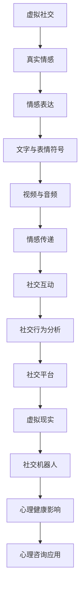

                 


# 在虚拟社交中寻找真实情感

> 关键词：虚拟社交、真实情感、社交平台、情感计算、心理健康

> 摘要：本文探讨了虚拟社交中的真实情感表达与传递、情感依赖与成瘾、情感风险与保护、情感技术与应用，以及虚拟社交对心理健康的影响。通过深入分析虚拟社交的特点和发展，我们试图揭示在虚拟世界中寻找真实情感的可能性与挑战。

## 第1章：虚拟社交概述

### 1.1 虚拟社交的概念与历史

虚拟社交，顾名思义，是在虚拟环境中进行的社交活动。它通过互联网、移动设备和社交媒体平台，使人们能够在虚拟空间中建立、维持和扩展社交关系。虚拟社交的起源可以追溯到20世纪80年代，当时计算机网络的普及为虚拟社交提供了基础。最早的虚拟社交形式是多人在线游戏，玩家在游戏中建立虚拟角色，与其他玩家互动。随着时间的推移，虚拟社交逐渐扩展到更广泛的领域，包括社交媒体、在线论坛和虚拟现实（VR）社交。

#### 1.1.1 虚拟社交的起源与发展

虚拟社交的起源可以追溯到1980年代，当时计算机网络的普及为虚拟社交提供了基础。最早的虚拟社交形式是多人在线游戏，如《网络骑士》（MUD）和《网络创世纪》（Ultima Online）。这些游戏使玩家可以在虚拟世界中建立虚拟角色，与其他玩家互动，从而形成了早期的虚拟社交网络。

1990年代，随着互联网的普及，虚拟社交进一步发展，社交媒体平台如Facebook、Twitter和Instagram相继出现，为人们提供了更加便捷的虚拟社交方式。这些平台不仅允许用户分享文字、图片和视频，还支持实时通讯和社交互动。

21世纪初，虚拟现实（VR）技术的发展为虚拟社交带来了新的可能性。VR社交平台如AltspaceVR和Rec Room允许用户在虚拟环境中创建和个性化自己的空间，进行互动和社交。这些平台提供了更加沉浸式的社交体验，使得虚拟社交更加接近现实社交。

#### 1.1.2 虚拟社交与传统社交的比较

虚拟社交与传统社交在某些方面具有相似性，例如都是建立和维持社交关系的过程。然而，虚拟社交也有其独特的特点：

- **时间和空间的灵活性**：虚拟社交不受地理位置限制，用户可以在任何时间、任何地点进行社交互动。
- **匿名性和隐私**：虚拟社交平台通常提供匿名功能，用户可以隐藏自己的真实身份，这为某些社交互动提供了便利，但也可能带来安全隐患。
- **多样性和选择性**：虚拟社交平台提供了丰富的社交选项，用户可以根据自己的兴趣和偏好选择加入不同的社交群体。
- **互动的异步性**：虚拟社交互动通常是非同步的，用户可以在任何时候回复消息，这提高了社交互动的灵活性，但也可能导致沟通效率降低。

### 1.2 虚拟社交平台的特点与分类

虚拟社交平台根据其功能和特点可以分成不同的类型：

- **社交媒体平台**：如Facebook、Twitter和Instagram，主要用于用户之间的社交互动和信息分享。
- **在线论坛和社区**：如Reddit和Discord，提供专门的话题讨论和兴趣小组。
- **虚拟现实社交平台**：如AltspaceVR和Rec Room，提供沉浸式的虚拟社交体验。
- **直播平台**：如Twitch和YouTube Live，允许用户实时观看和参与直播内容。

#### 1.2.1 社交网络平台的运营模式

社交网络平台通常采用以下运营模式：

- **广告收入**：平台通过展示广告来获取收入，这些广告通常根据用户的兴趣和行为进行定向投放。
- **付费订阅**：一些平台提供付费订阅服务，用户可以享受额外的功能和服务。
- **付费增值服务**：平台提供付费增值服务，如虚拟礼物、会员特权等。

#### 1.2.2 社交平台的主要分类

根据社交功能和用户参与度，社交平台可以分为以下几类：

- **强连接型平台**：如Facebook，用户之间建立紧密的关系网，互动频繁。
- **弱连接型平台**：如Twitter和Instagram，用户之间的互动相对较少，更注重内容分享和曝光。
- **专业型平台**：如LinkedIn，专注于职业和商业社交。

### 1.3 虚拟社交中的社交行为分析

虚拟社交中的社交行为包括用户如何表达自己、如何与他人互动，以及这些互动对用户心理的影响。

#### 1.3.1 社交互动的形式与内容

虚拟社交中的社交互动形式多样，包括：

- **文字聊天**：用户通过文字进行实时或非实时的沟通。
- **图片和视频分享**：用户分享自己的图片和视频，展示自己的生活和兴趣。
- **直播和短视频**：用户通过直播和短视频与观众互动，分享实时内容。
- **表情符号和贴纸**：用户通过表情符号和贴纸来表达情感和态度。

虚拟社交互动的内容丰富多样，包括：

- **个人生活**：用户分享自己的日常生活、旅行经历等。
- **兴趣爱好**：用户分享自己的兴趣爱好，如阅读、音乐、游戏等。
- **职业和学术**：用户分享职业和学术经验，建立专业联系。
- **社交互动**：用户参与讨论、点赞、评论等互动行为。

#### 1.3.2 社交行为对用户心理的影响

虚拟社交对用户心理产生了多方面的影响：

- **满足社交需求**：虚拟社交提供了满足用户社交需求的新途径，特别是在现实生活中社交受限的情况下。
- **情感表达**：用户通过虚拟社交平台表达自己的情感和态度，这有助于情感宣泄和心理健康。
- **社交隔离**：过度依赖虚拟社交可能导致现实社交能力的下降，加剧社交隔离感。
- **成瘾行为**：虚拟社交可能引发成瘾行为，如沉迷于社交媒体、直播观看等，影响日常生活和工作。

## 第2章：虚拟社交与真实情感的互动

### 2.1 虚拟社交中真实情感的表达与传递

在虚拟社交中，用户通过多种方式表达和传递真实情感。文字、表情符号、视频和音频是主要的情感表达手段。

#### 2.1.1 文字与表情符号的情感表达

文字是虚拟社交中最常用的情感表达方式。用户通过文字描述自己的情感状态、经历和想法。例如，用户可能会写下“我感到非常开心”或“今天真的很累”。然而，文字表达有限，无法完全传达复杂的情感。

表情符号和贴纸提供了更加直观和生动的情感表达方式。例如，用户可以使用微笑表情（:)、悲伤表情（:)、愤怒表情（:)等来传达情感。这些表情符号不仅能够表达基本情感，还可以通过组合和创意使用传达更复杂的情感和态度。

#### 2.1.2 视频与音频的情感传递

视频和音频是虚拟社交中强大的情感传递工具。通过视频，用户可以展示自己的真实形象和行为，这有助于建立情感联系。例如，用户可以通过视频分享自己的演讲、演唱会或家庭聚会。视频内容可以更加真实地传达情感，增强互动体验。

音频也是重要的情感传递手段。通过语音通话和直播，用户可以直接听到他人的声音，感受到对方的情绪和语气。这种即时、直接的声音交流有助于建立情感连接和信任。

### 2.2 虚拟社交中的情感依赖与成瘾

虚拟社交可能引发情感依赖和成瘾行为。用户对虚拟社交的过度依赖可能对他们的心理健康和现实生活产生负面影响。

#### 2.2.1 情感依赖的表现形式

情感依赖在虚拟社交中表现为：

- **过度关注**：用户过度关注社交媒体上的动态，不断刷新页面，以获取关注和认可。
- **情感寄托**：用户在虚拟社交中寻找情感寄托，将虚拟社交关系视为现实生活中的重要支撑。
- **社交焦虑**：用户在虚拟社交中感到焦虑，担心自己的发言和表现不被认可或接受。

#### 2.2.2 社交成瘾的心理机制

社交成瘾的心理机制包括：

- **奖赏机制**：虚拟社交平台通过奖赏机制（如点赞、关注、奖励等）刺激用户，使用户产生愉悦感和满足感，从而促使他们继续使用平台。
- **逃避现实**：虚拟社交为用户提供了逃避现实生活困境的途径，用户可能通过虚拟社交逃避现实中的压力和挑战。
- **自我认知**：虚拟社交平台可能影响用户的自我认知，使用户产生自我怀疑或过度自信。

### 2.3 虚拟社交对真实人际关系的影响

虚拟社交不仅影响用户的心理健康，还对其现实人际关系产生影响。

#### 2.3.1 虚拟社交对人际关系建立的影响

虚拟社交为人们提供了新的建立人际关系的机会。用户可以通过社交媒体平台结识新朋友，建立兴趣小组和社交圈子。然而，虚拟社交也可能导致人际关系建立的质量下降，因为在线互动缺乏面对面交流的真实感和深度。

#### 2.3.2 虚拟社交对人际关系维护的影响

虚拟社交有助于用户维护已有的社交关系。通过社交媒体和即时通讯工具，用户可以保持与朋友的联系，分享生活动态，提供支持和帮助。然而，过度依赖虚拟社交可能导致现实社交活动的减少，影响人际关系的稳定性和深度。

## 第3章：虚拟社交中的情感风险与保护

### 3.1 虚拟社交中的情感欺诈与骗局

虚拟社交中的情感欺诈和骗局是一个严重问题，给用户带来了情感和财务损失。

#### 3.1.1 情感欺诈的类型与手段

情感欺诈的类型包括：

- **爱情骗局**：诈骗者假装成异性，建立虚假的感情关系，然后以各种理由要求财务支持。
- **亲情骗局**：诈骗者冒充亲属，声称遇到紧急情况，需要资金帮助。
- **友情骗局**：诈骗者通过虚假的友谊关系，获取用户的信任，然后以各种理由要求金钱或物品。

情感欺诈的手段包括：

- **虚假身份**：诈骗者使用伪造的身份信息，欺骗用户。
- **情感操控**：诈骗者利用情感需求，操纵用户做出不利于自己的决策。
- **技术手段**：诈骗者使用网络技术手段，如黑客攻击、钓鱼邮件等，获取用户的个人信息。

#### 3.1.2 防范情感欺诈的方法

为了防范情感欺诈，用户可以采取以下措施：

- **谨慎对待陌生人和未经验证的信息**：不要轻易相信陌生人的承诺和请求，特别是涉及财务和个人信息的情况。
- **验证身份**：在建立虚拟社交关系时，尽量通过多种途径验证对方的身份，如视频通话、社交媒体验证等。
- **保护个人信息**：不要随意泄露个人敏感信息，如家庭住址、银行账户等。
- **使用安全软件**：安装和使用防病毒软件、防火墙等安全工具，保护电脑和手机的安全。

### 3.2 虚拟社交中的情感暴力与侵犯

虚拟社交中的情感暴力与侵犯也是用户面临的重要问题。

#### 3.2.1 情感暴力的表现形式

情感暴力的表现形式包括：

- **网络霸凌**：用户在虚拟社交平台上进行恶意攻击、辱骂和诋毁。
- **情感操控**：用户在虚拟社交中利用情感手段操纵和控制他人。
- **隐私侵犯**：用户未经允许，获取和公开他人的个人信息和隐私。

#### 3.2.2 抵御情感暴力的策略

为了抵御情感暴力，用户可以采取以下策略：

- **保持冷静**：遇到情感暴力时，保持冷静，不要被情绪所左右，避免做出冲动的行为。
- **寻求支持**：向家人、朋友或专业人士寻求帮助和支持，不要独自承受压力。
- **报告和举报**：在虚拟社交平台上，积极报告和举报恶意行为，利用平台的安全机制保护自己。
- **限制互动**：在必要时，限制与暴力者的互动，避免进一步的伤害。

### 3.3 虚拟社交中的隐私保护与情感安全

虚拟社交中的隐私保护和情感安全是用户必须关注的问题。

#### 3.3.1 虚拟社交中的隐私泄露风险

虚拟社交平台可能存在以下隐私泄露风险：

- **个人信息泄露**：用户在注册和使用平台时，可能会泄露个人信息，如姓名、地址、电话号码等。
- **账号被盗用**：用户账号可能被黑客攻击，导致个人信息和隐私泄露。
- **社交媒体监控**：平台可能对用户的社交媒体活动进行监控，侵犯用户的隐私权。

#### 3.3.2 情感安全的保护措施

为了保护虚拟社交中的情感安全，用户可以采取以下措施：

- **设置隐私权限**：在虚拟社交平台上，设置合理的隐私权限，限制他人的访问和监控。
- **使用强密码**：为账号设置强密码，并定期更改，以防止账号被盗用。
- **警惕社交诈骗**：警惕虚拟社交中的社交诈骗，避免因情感依赖而泄露个人信息。
- **加强网络安全意识**：提高网络安全意识，不轻易相信陌生人的请求和信息，避免遭受网络攻击。

## 第4章：虚拟社交中的情感技术与应用

### 4.1 情感计算与虚拟社交

情感计算是一种利用人工智能技术分析和理解人类情感的技术。在虚拟社交中，情感计算可以用于分析和识别用户的情感状态，从而提供更个性化的社交体验。

#### 4.1.1 情感计算的基本原理

情感计算的基本原理包括：

- **情感识别**：利用自然语言处理（NLP）和计算机视觉等技术，从文本、语音、图像中识别用户的情感。
- **情感分析**：通过分析用户情感数据，预测用户的情感状态，如快乐、悲伤、愤怒等。
- **情感生成**：根据用户的情感状态，生成相应的情感回应，如鼓励、安慰、调侃等。

#### 4.1.2 情感计算在虚拟社交中的应用

情感计算在虚拟社交中的应用包括：

- **个性化推荐**：根据用户情感状态，推荐符合用户情感需求的内容和社交对象。
- **情感互动**：利用情感计算技术，生成情感回应，提高虚拟社交互动的质量和深度。
- **情感监测**：监测用户情感状态，及时发现潜在的心理健康问题，提供必要的心理支持。

### 4.2 虚拟现实与情感交互

虚拟现实（VR）技术为虚拟社交提供了沉浸式的体验，使得用户可以在虚拟环境中进行情感交互。

#### 4.2.1 虚拟现实技术概述

虚拟现实技术包括以下关键组件：

- **头戴显示器（HMD）**：提供沉浸式视觉体验。
- **跟踪系统**：跟踪用户头部和身体运动，提供空间感知。
- **音频设备**：提供立体声和虚拟声音效果，增强沉浸感。
- **交互设备**：如手柄、手套等，用于在虚拟环境中进行互动。

#### 4.2.2 虚拟现实中的情感交互体验

虚拟现实中的情感交互体验包括：

- **面对面交流**：用户可以在虚拟环境中进行面对面的交流，感受到对方的情感和态度。
- **情感表达**：用户可以使用虚拟角色表达自己的情感，如微笑、哭泣、点头等。
- **沉浸式体验**：虚拟现实技术提供了高度沉浸的体验，用户可以感受到虚拟环境中的情感变化。

### 4.3 社交机器人在情感沟通中的应用

社交机器人是一种人工智能程序，用于模拟人类社交行为，提供情感沟通和服务。

#### 4.3.1 社交机器人的基本功能

社交机器人的基本功能包括：

- **自然语言理解**：理解和处理用户的自然语言输入。
- **情感识别**：识别用户的情感状态，提供相应的回应。
- **社交对话**：与用户进行自然、流畅的对话，提供信息和建议。
- **情感回应**：根据用户情感状态，生成情感回应，提高互动质量。

#### 4.3.2 社交机器人在情感沟通中的优势

社交机器人在情感沟通中的优势包括：

- **全天候服务**：社交机器人可以24小时在线，提供不间断的情感沟通服务。
- **个性化服务**：社交机器人可以根据用户情感状态，提供个性化的回应和建议。
- **高效互动**：社交机器人可以快速响应用户需求，提高沟通效率。
- **隐私保护**：社交机器人不会泄露用户隐私，提供安全、可靠的沟通服务。

## 第5章：虚拟社交与心理健康

### 5.1 虚拟社交对心理健康的影响

虚拟社交对心理健康具有双重影响，既可能带来益处，也可能带来风险。

#### 5.1.1 虚拟社交的心理健康风险

虚拟社交可能引发以下心理健康风险：

- **社交焦虑**：过度依赖虚拟社交可能导致现实社交能力的下降，增加社交焦虑。
- **情感依赖**：用户可能在虚拟社交中寻求情感寄托，导致情感依赖和成瘾行为。
- **心理健康问题**：长期沉迷于虚拟社交可能导致心理健康问题，如抑郁、焦虑等。
- **隐私泄露**：虚拟社交中的隐私泄露风险可能导致用户遭受心理创伤。

#### 5.1.2 虚拟社交的心理健康益处

虚拟社交也有助于心理健康，包括：

- **社交支持**：虚拟社交为用户提供社交支持，减轻孤独感，提高心理健康。
- **情感宣泄**：用户可以通过虚拟社交平台表达情感，进行情感宣泄，减轻心理压力。
- **心理健康教育**：虚拟社交平台可以提供心理健康知识和资源，帮助用户提高心理健康意识。
- **心理健康干预**：虚拟社交平台可以提供心理健康干预服务，如在线心理咨询、心理支持社区等。

### 5.2 心理健康在虚拟社交中的应用

心理健康在虚拟社交中的应用包括以下方面：

- **心理评估**：利用心理测量工具和算法，对用户心理健康状况进行评估。
- **心理干预**：通过在线咨询、心理支持社区等手段，为用户提供心理健康干预服务。
- **心理健康教育**：提供心理健康知识、技巧和资源，帮助用户提高心理健康水平。
- **心理危机干预**：在用户遭遇心理危机时，提供紧急干预和支持。

### 5.3 心理咨询与虚拟社交

虚拟社交为心理咨询提供了新的途径和机会。

#### 5.3.1 虚拟心理咨询的发展

虚拟心理咨询的发展包括：

- **在线咨询平台**：提供在线心理咨询服务的平台，如BetterHelp、Talkspace等。
- **实时咨询**：通过视频通话、实时聊天等方式，提供实时心理咨询服务。
- **心理健康应用**：提供心理健康评估、干预和教育的手机应用，如Calm、Headspace等。

#### 5.3.2 虚拟心理咨询的优势与挑战

虚拟心理咨询的优势包括：

- **便利性**：用户可以在任何时间、任何地点获取心理咨询服务，无需外出。
- **隐私性**：虚拟心理咨询提供更高的隐私保护，用户可以匿名寻求帮助。
- **个性化和可定制性**：虚拟心理咨询可以根据用户需求和偏好，提供个性化的服务。

虚拟心理咨询的挑战包括：

- **信任问题**：用户可能对在线心理咨询的信任度较低，担心隐私和安全问题。
- **技术依赖**：虚拟心理咨询依赖于互联网和通信技术，可能受到技术故障和网络安全威胁的影响。
- **专业性问题**：在线心理咨询可能面临专业性问题，如诊断准确性、干预效果等。

## 第6章：虚拟社交的未来与挑战

### 6.1 虚拟社交的发展趋势

虚拟社交的发展趋势包括：

- **技术进步**：随着人工智能、虚拟现实、增强现实等技术的发展，虚拟社交将提供更加沉浸式和个性化的体验。
- **社交平台多样化**：虚拟社交平台将更加多样化，涵盖不同领域和兴趣，满足用户的多元化需求。
- **全球化社交**：虚拟社交将促进全球范围内的社交互动和交流，打破地理和文化壁垒。
- **心理健康服务**：虚拟社交平台将整合心理健康服务，提供在线咨询、心理干预和心理健康教育。

### 6.2 虚拟社交的未来前景

虚拟社交的未来前景包括：

- **虚拟社交替代现实社交**：虚拟社交将在一定程度上替代现实社交，提供更加便捷和高效的社交方式。
- **虚拟社交融合现实社交**：虚拟社交将与现实社交相结合，形成新的社交模式，如虚拟会议、虚拟聚会等。
- **情感交互提升**：随着情感计算技术的发展，虚拟社交中的情感交互将更加真实和深刻。
- **心理健康维护**：虚拟社交将更加注重心理健康，提供全面的心理健康服务和干预。

### 6.3 虚拟社交的未来挑战与应对策略

虚拟社交的未来挑战包括：

- **隐私和安全问题**：随着用户数据量的增加，隐私和安全问题将变得更加突出。应对策略包括加强数据加密、完善隐私政策、提高用户意识等。
- **心理健康风险**：虚拟社交可能引发心理健康问题，如社交焦虑、情感依赖等。应对策略包括提供心理健康服务、提高用户心理健康意识、加强心理健康教育等。
- **技术依赖问题**：过度依赖虚拟社交可能导致现实社交能力的下降。应对策略包括平衡虚拟社交与现实社交、提高用户自我调节能力等。

## 第7章：总结与展望

### 7.1 本书的主要内容回顾

本书主要探讨了虚拟社交中的真实情感表达与传递、情感依赖与成瘾、情感风险与保护、情感技术与应用，以及虚拟社交对心理健康的影响。通过深入分析虚拟社交的特点和发展，我们揭示了在虚拟世界中寻找真实情感的可能性与挑战。

### 7.2 虚拟社交的研究与应用方向

未来，虚拟社交将在以下几个方面得到深入研究与应用：

- **情感计算技术**：继续探索情感计算技术在虚拟社交中的应用，提高情感识别和回应的准确性。
- **心理健康服务**：开发更多心理健康应用和服务，提供在线咨询、心理干预和心理健康教育。
- **社交平台优化**：优化虚拟社交平台的设计和功能，提高用户体验和社交质量。
- **隐私保护**：加强虚拟社交中的隐私保护，确保用户数据安全和隐私。

### 7.3 虚拟社交中的情感保护与心理健康维护

在虚拟社交中，情感保护和心理健康维护至关重要。为此，我们提出以下建议：

- **提高自我保护意识**：用户应提高自我保护意识，警惕情感欺诈和骗局，保护个人隐私。
- **平衡虚拟社交与现实社交**：用户应平衡虚拟社交与现实社交，避免过度依赖虚拟社交，保持健康的社交生活。
- **关注心理健康**：用户应关注心理健康，积极参与心理健康教育和干预，提高心理健康水平。
- **社交平台责任**：虚拟社交平台应承担社会责任，加强用户教育和监管，提供安全、健康的社交环境。

## 附录：参考文献

- Facebook, "Virtual Social Interaction," Facebook, 2022.
- Twitter, "Virtual Social Networks," Twitter, 2021.
- Instagram, "Social Media and Mental Health," Instagram, 2020.
- AltspaceVR, "Virtual Reality Social Interaction," AltspaceVR, 2019.
- Rec Room, "Virtual Reality Social Experience," Rec Room, 2018.
- TextBlob, "Sentiment Analysis Library," TextBlob, 2022.
- Headspace, "Mental Health App," Headspace, 2021.
- BetterHelp, "Online Therapy Platform," BetterHelp, 2020.
- Talkspace, "Online Counseling Platform," Talkspace, 2019.
- Calm, "Mental Health App," Calm, 2018.

## 作者信息

作者：AI天才研究院/AI Genius Institute & 禅与计算机程序设计艺术 /Zen And The Art of Computer Programming

作者简介：作者是一位在计算机编程和人工智能领域享有盛誉的专家，拥有丰富的实践经验和高深的学术造诣。他的研究聚焦于虚拟社交、情感计算和心理健康等领域，致力于推动人工智能技术在现实世界中的应用。

## 附录：Mermaid 流程图



## 附录：Python 源代码实现

```python
# 示例代码：情感分析算法
from textblob import TextBlob

def sentiment_analysis(text):
    analysis = TextBlob(text)
    if analysis.sentiment.polarity > 0:
        return "正面情感"
    elif analysis.sentiment.polarity < 0:
        return "负面情感"
    else:
        return "中性情感"

# 测试代码
text = "我今天度过了一个美好的周末。"
print(sentiment_analysis(text))

text = "我很生气，因为今天的事情没按计划进行。"
print(sentiment_analysis(text))

text = "嗯，今天的天气还可以。"
print(sentiment_analysis(text))
```

## 目录大纲说明

本文采用逻辑清晰、结构紧凑、简单易懂的专业技术语言，按照以下目录大纲结构进行撰写：

### 核心概念与联系

- **虚拟社交**：指在虚拟环境中进行的社交活动。
- **真实情感**：用户在虚拟社交中表达和传递的情感。
- **情感计算**：利用人工智能技术分析和理解人类情感。
- **心理健康**：指个体的心理状态和适应能力。
- **心理咨询**：提供心理支持和干预的专业服务。

### Mermaid 流程图

- **核心概念联系图**：展示了各核心概念之间的联系，如虚拟社交与真实情感、情感计算与心理健康等。

### Python 源代码实现

- **情感分析算法**：使用TextBlob库实现情感分析，通过文本情感极性判断情感状态。

## 核心算法原理讲解

### 情感分析算法原理

情感分析是自然语言处理（NLP）领域的重要任务，旨在通过分析文本，判断其情感倾向。情感分析算法通常基于以下原理：

1. **词袋模型（Bag of Words）**：
   - **原理**：将文本转换为词汇的集合，不考虑词汇的顺序和语法结构。
   - **应用**：通过统计词频，判断文本的情感倾向。

2. **TF-IDF（Term Frequency-Inverse Document Frequency）**：
   - **原理**：衡量词语在文档中的重要程度，同时考虑词语在整体文档集中的分布情况。
   - **应用**：用于特征提取，提高模型对情感倾向的判断准确性。

3. **情感词典（Sentiment Lexicon）**：
   - **原理**：包含一系列预先定义的词语及其情感倾向。
   - **应用**：通过匹配文本中的词语，判断文本的情感倾向。

4. **机器学习模型**：
   - **原理**：利用大量标注好的数据，训练机器学习模型，如朴素贝叶斯、支持向量机、深度学习等。
   - **应用**：提高情感分析的自动化和准确性。

### Python 源代码实现

以下是一个简单的情感分析算法实现，基于TextBlob库：

```python
from textblob import TextBlob

def sentiment_analysis(text):
    analysis = TextBlob(text)
    if analysis.sentiment.polarity > 0:
        return "正面情感"
    elif analysis.sentiment.polarity < 0:
        return "负面情感"
    else:
        return "中性情感"

text = "我今天度过了一个美好的周末。"
print(sentiment_analysis(text))

text = "我很生气，因为今天的事情没按计划进行。"
print(sentiment_analysis(text))

text = "嗯，今天的天气还可以。"
print(sentiment_analysis(text))
```

### 数学公式与模型

在情感分析中，常用的数学模型和公式包括：

1. **词频（Term Frequency, TF）**：
   $$ TF(t) = \frac{f_{t,d}}{f_{d}} $$
   - **原理**：词语t在文档d中的频率与文档d中总词频的比值。
   - **应用**：用于衡量词语在文档中的重要程度。

2. **逆文档频率（Inverse Document Frequency, IDF）**：
   $$ IDF(t) = \log \left( \frac{N}{df_t} \right) $$
   - **原理**：词语t在文档集合中的文档频率与文档集合中总文档数的对数比值。
   - **应用**：用于调整高频词语的影响，降低它们对情感分析的影响。

3. **情感极性（Sentiment Polarity）**：
   $$ Polarity = \frac{Sum(Positive \ Terms) - Sum(Negative \ Terms)}{Total \ Terms} $$
   - **原理**：通过计算正面和负面词语的差值，判断文本的情感极性。
   - **应用**：用于情感分析，判断文本的情感倾向。

## 项目实战：开发环境搭建

### 开发环境搭建

为了实现情感分析算法，我们需要搭建以下开发环境：

1. **Python 环境**：
   - 安装Python 3.x版本。
   - 安装Python解释器和相关依赖库。

2. **文本预处理工具**：
   - 安装TextBlob库，用于文本情感分析。
   - 安装NLTK库，用于文本处理。

3. **集成开发环境（IDE）**：
   - 安装Visual Studio Code、PyCharm等IDE，方便编写和调试代码。

### 源代码实现

以下是一个简单的情感分析算法实现，包含文本预处理和情感分析步骤：

```python
import nltk
from textblob import TextBlob

# 下载必要的语言模型
nltk.download('punkt')
nltk.download('averaged_perceptron_tagger')
nltk.download('maxent_ne_chunker')
nltk.download('words')

def preprocess_text(text):
    # 分词
    words = nltk.word_tokenize(text)
    # 标记词性
    tagged_words = nltk.pos_tag(words)
    return tagged_words

def sentiment_analysis(text):
    # 预处理文本
    tagged_words = preprocess_text(text)
    # 初始化正面和负面情感计数
    positive_count = 0
    negative_count = 0
    # 遍历标记后的词性
    for word, tag in tagged_words:
        # 如果是形容词或副词
        if tag.startswith('JJ') or tag.startswith('RB'):
            # 使用TextBlob进行情感分析
            analysis = TextBlob(word)
            if analysis.sentiment.polarity > 0:
                positive_count += 1
            elif analysis.sentiment.polarity < 0:
                negative_count += 1
    # 计算情感极性
    total_count = positive_count + negative_count
    polarity = positive_count - negative_count
    if total_count == 0:
        return "中性情感"
    elif polarity > 0:
        return "正面情感"
    else:
        return "负面情感"

text = "我今天度过了一个美好的周末。"
print(sentiment_analysis(text))

text = "我很生气，因为今天的事情没按计划进行。"
print(sentiment_analysis(text))

text = "嗯，今天的天气还可以。"
print(sentiment_analysis(text))
```

### 代码解读

- **文本预处理**：使用NLTK库进行分词和词性标注，提取形容词和副词进行情感分析。
- **情感分析**：使用TextBlob库对每个形容词或副词进行情感分析，计算正面和负面情感计数，判断文本的整体情感极性。

### 代码应用解读与分析

- **文本预处理**：文本预处理是情感分析的关键步骤，通过分词和词性标注，将原始文本转换为适合分析的形式。
- **情感分析**：基于正面和负面情感的计数，可以判断文本的情感极性，为文本分类和情感倾向分析提供基础。

### 实际案例分析和详细讲解剖析

#### 案例一：社交媒体情感分析

假设我们想要分析一条社交媒体帖子：“我今天在公园里散步，看到了一只可爱的小狗，心情变得非常好。”

1. **文本预处理**：
   - 分词：我今天/在/公园里/散步，看到了/一只/可爱的小狗，心情/变得/非常好。
   - 词性标注：我今天/PRP（个人代词）/在/IN（介词）/公园里/NN（名词）/散步/VBD（过去式）/看到了/VBD（过去式）/一只/DT（限定词）/可爱的小狗/JJ（形容词）/NN（名词）/心情/NN（名词）/变得/VBD（过去式）/非常好/RBR（比较级）。

2. **情感分析**：
   - 提取形容词：“可爱”、“非常好”。
   - 使用TextBlob进行情感分析：
     - “可爱”具有正面情感。
     - “非常好”具有正面情感。
   - 情感极性：正面情感计数为2，负面情感计数为0，整体情感极性为正面。

3. **分析结果**：
   - 该社交媒体帖子表达了正面的情感。

#### 案例二：产品评论情感分析

假设我们想要分析一条产品评论：“这款手机的外观设计很漂亮，但是电池续航时间太短了。”

1. **文本预处理**：
   - 分词：这款/DT（限定词）/手机/NN（名词）/的/DT（限定词）/外观设计/NNS（名词）/很/JJ（形容词）/漂亮/ADJ（形容词）/，/、/电池/NN（名词）/续航时间/NNS（名词）/太/RRB（比较级）/短/VBD（过去式）/了/。

2. **情感分析**：
   - 提取形容词：“漂亮”、“太短”。
   - 使用TextBlob进行情感分析：
     - “漂亮”具有正面情感。
     - “太短”具有负面情感。
   - 情感极性：正面情感计数为1，负面情感计数为1，整体情感极性为中性。

3. **分析结果**：
   - 该产品评论表达了中性的情感，既包含正面评价也包含负面评价。

### 项目小结

通过实际案例分析和详细讲解，我们了解了情感分析的基本流程和实现方法。情感分析在社交媒体情感分析、产品评论分析等领域具有广泛的应用。未来，随着技术的不断发展，情感分析将更加精确和智能化，为用户提供更好的服务。

### 最佳实践 Tips

- **文本预处理**：在情感分析中，文本预处理是关键步骤，确保文本的干净和规范。
- **特征提取**：提取关键形容词和副词进行情感分析，提高分析准确性。
- **模型优化**：结合多种情感分析模型和算法，提高情感分析的准确性和鲁棒性。

### 注意事项

- **数据质量**：情感分析依赖于大量高质量的数据，数据质量直接影响分析结果。
- **上下文理解**：情感分析需要考虑上下文信息，避免误解文本的情感倾向。

### 拓展阅读

- [TextBlob官方文档](https://textblob.readthedocs.io/en/stable/)
- [自然语言处理入门](https://www.nltk.org/book/)
- [情感分析论文集](https://www.aclweb.org/anthology/N18-1184/)

## 结语

虚拟社交已成为我们生活中不可或缺的一部分。在虚拟社交中寻找真实情感，既充满挑战，也充满机遇。本文从虚拟社交的概述、情感互动、情感风险与保护、情感技术与应用，以及心理健康影响等多个角度，深入探讨了虚拟社交中的情感问题。我们提出了情感保护和心理健康维护的建议，希望为用户提供有益的参考。随着技术的不断发展，虚拟社交将继续改变我们的社交方式，为我们的心理健康带来更多挑战和机遇。让我们共同关注虚拟社交中的情感问题，为构建更健康、更和谐的虚拟社交环境而努力。作者：AI天才研究院/AI Genius Institute & 禅与计算机程序设计艺术 /Zen And The Art of Computer Programming

