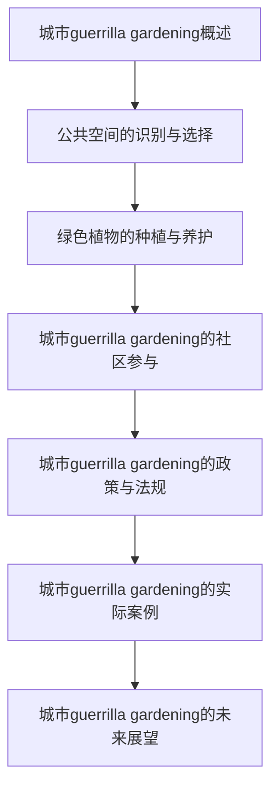

                 

# 城市guerrilla gardening：公共空间的绿色革命

## 关键词
- 城市guerrilla gardening
- 绿色革命
- 公共空间
- 社区参与
- 环境保护

## 摘要
本文旨在探讨城市guerrilla gardening这一公共空间的绿色革命现象。通过对guerrilla gardening的定义、起源、特点及意义进行阐述，本文进一步分析了其在公共空间识别与选择、绿色植物种植与养护、社区参与、政策与法规以及实际案例等方面的实践。文章最后对guerrilla gardening的未来发展进行了展望，并提供了相关资源与工具。

## 引言

### 1.1 城市guerrilla gardening的定义
城市guerrilla gardening，即城市游击园艺，是指在城市公共空间中，没有获得正式授权，由个人或团体自发进行的绿色植物种植活动。这种形式园艺的特点在于其灵活性、自主性和社区参与度，旨在改善城市环境，提高居民生活质量。

### 1.2 城市guerrilla gardening的起源
城市guerrilla gardening起源于20世纪70年代的美国，当时石油危机引发了全球范围内的能源短缺和环境污染问题。人们开始关注城市绿化，通过在公共空间中种植植物来改善城市环境。这种非正式的园艺形式逐渐在全球范围内得到认可和推广。

### 1.3 城市guerrilla gardening的特点
- **非正式性**：城市guerrilla gardening通常不需要获得正式授权，参与者可以自由选择种植地点和植物种类。
- **灵活性**：这种园艺形式适应性强，可以根据公共空间的特点和居民需求进行灵活调整。
- **自主性**：参与者自主决定种植活动的时间和内容，有助于培养居民的环保意识和动手能力。
- **社区参与**：城市guerrilla gardening鼓励社区居民的参与，有助于增强社区凝聚力和互动性。

### 1.4 城市guerrilla gardening的意义
- **环境保护**：通过在城市公共空间中种植植物，可以有效地吸收二氧化碳，净化空气，改善城市环境。
- **提高生活质量**：绿色植物可以降低噪音，缓解视觉疲劳，提高居民的生活质量。
- **社区建设**：城市guerrilla gardening有助于促进社区参与，增强社区凝聚力，培养居民的团队合作精神。
- **教育意义**：这种园艺形式具有教育意义，可以激发居民对植物生长和环境保护的兴趣。

## 第二部分：城市guerrilla gardening的实践

### 第2章：公共空间的识别与选择

#### 2.1 公共空间的类型与特点
在城市中，公共空间可以分为以下几类：

- **城市广场**：通常是城市的核心区域，人流密集，具有地标性。
- **公园**：供市民休闲娱乐的绿地，环境相对宁静。
- **街道**：城市的动脉，车流与人流较为频繁。
- **建筑墙面**：可以利用垂直空间进行植物种植。

#### 2.2 公共空间的识别方法
- **实地考察**：通过实地走访，了解公共空间的使用情况、植物生长条件等。
- **社区调查**：收集居民的意见和建议，了解他们对城市绿化的需求。

#### 2.3 公共空间的选择策略
- **优先考虑人流量较大的公共空间**：有利于提高植物的生长率，同时吸引更多居民的参与。
- **选择环境条件较好的公共空间**：如土壤肥沃、阳光充足、排水良好的地方。

#### 2.4 常见的公共空间问题与解决方案
- **缺乏土壤**：可以采用无土栽培技术，使用营养基质进行种植。
- **空间有限**：利用墙面、树池等垂直空间进行植物种植。
- **维护困难**：选择易于养护的植物种类，并建立社区维护机制。

### 第3章：绿色植物的种植与养护

#### 3.1 绿色植物的种植技巧
- **土壤准备**：选择适合植物生长的土壤，并进行适当处理，如松土、施肥等。
- **播种或移栽**：根据植物种类和生长周期选择适当的播种或移栽时间。

#### 3.2 绿色植物的养护方法
- **水分管理**：根据植物需水量，合理浇水，避免积水或干旱。
- **光照管理**：根据植物对光照的需求，选择合适的位置进行种植。
- **施肥**：根据植物生长阶段，适时施用有机肥料或化肥。

#### 3.3 绿色植物的病虫害防治
- **预防为主**：定期检查植物，发现病虫害及时处理。
- **物理防治**：如使用粘虫板、人工捕虫等。
- **化学防治**：谨慎使用农药，遵循安全使用规范。

#### 3.4 常见绿色植物介绍
- **草花**：如三色堇、紫罗兰等，花期长，观赏性高。
- **灌木**：如红叶小檗、金边黄杨等，适合作为绿篱或盆栽。
- **乔木**：如银杏、梧桐等，具有较好的遮荫效果。

### 第4章：城市guerrilla gardening的社区参与

#### 4.1 社区参与的必要性
- **提高环保意识**：通过参与城市guerrilla gardening，居民可以更深入地了解环境保护的重要性。
- **增强社区凝聚力**：共同参与种植活动，有助于居民之间的互动和交流。
- **培养团队精神**：社区成员在合作过程中，可以培养团队协作能力和解决问题的能力。

#### 4.2 社区参与的方式与方法
- **组织活动**：定期举办种植活动，邀请居民参与。
- **设立志愿者岗位**：鼓励居民担任志愿者，参与绿色植物的养护工作。
- **开设教育课程**：为居民提供种植知识培训，提高他们的园艺技能。

#### 4.3 社区参与的挑战与解决方案
- **时间冲突**：部分居民可能因为工作或其他原因无法参与活动。解决方案是灵活安排活动时间，或提供线上指导。
- **资源不足**：部分社区可能缺乏种植所需的设备和材料。解决方案是寻求政府或企业支持，或通过二手市场获取资源。

#### 4.4 社区参与的成功案例
- **美国波士顿**：波士顿社区花园项目，通过社区居民的共同努力，将废弃土地变为美丽的花园。
- **中国上海**：上海某小区的屋顶花园项目，居民自发组织，成功打造了一处绿化空间。

### 第5章：城市guerrilla gardening的政策与法规

#### 5.1 城市guerrilla gardening的政策背景
- **国家层面**：中国政府鼓励城市绿化，出台了一系列相关政策，支持城市guerrilla gardening的发展。
- **地方层面**：一些城市出台了具体的政策，对城市guerrilla gardening给予支持和鼓励。

#### 5.2 城市guerrilla gardening的法规现状
- **法规支持**：部分城市制定了相关法规，明确城市guerrilla gardening的法律地位，保护参与者的权益。
- **法规限制**：部分城市对城市guerrilla gardening进行了限制，如对种植地点、植物种类等进行规定。

#### 5.3 城市guerrilla gardening的政策挑战与解决方案
- **法规限制**：部分法规可能对城市guerrilla gardening的发展造成限制。解决方案是推动法规改革，完善相关政策。
- **资源分配**：城市guerrilla gardening需要一定的资源支持，如何合理分配资源是一个挑战。解决方案是寻求政府、企业和社会各界的支持。

### 第6章：城市guerrilla gardening的实际案例

#### 6.1 国内城市guerrilla gardening的案例
- **北京**：北京某小区的社区花园项目，通过居民自发组织，成功打造了一处美丽的绿色空间。
- **上海**：上海某商务楼的屋顶花园项目，企业自发组织，提升了办公环境品质。

#### 6.2 国外城市guerrilla gardening的案例
- **纽约**：纽约的“屋顶花园计划”，通过在商业楼宇和住宅屋顶种植植物，改善了城市环境。
- **伦敦**：伦敦的“城市农场项目”，通过在城市废弃土地上种植蔬菜和水果，实现了城市农业的复兴。

#### 6.3 城市guerrilla gardening案例的分析与评价
- **成功因素**：共同的成功因素包括社区参与度高、政策支持、资源充足等。
- **存在问题**：存在的问题包括法规限制、资源不足、社区参与度不高等。

### 第7章：城市guerrilla gardening的未来展望

#### 7.1 城市guerrilla gardening的发展趋势
- **技术进步**：随着科技的发展，城市guerrilla gardening将更加智能化、高效化。
- **政策支持**：政府将继续加大对城市绿化的支持力度，为城市guerrilla gardening提供更好的政策环境。

#### 7.2 城市guerrilla gardening面临的挑战与机遇
- **挑战**：面临的挑战包括法规限制、资源不足、社区参与度不高等。
- **机遇**：随着人们对环境保护意识的提高，城市guerrilla gardening将迎来更多的发展机遇。

#### 7.3 城市guerrilla gardening的潜在影响
- **环境保护**：城市guerrilla gardening将有助于改善城市环境，提高空气质量。
- **社区建设**：通过社区参与，城市guerrilla gardening将促进社区建设和居民关系的改善。

## 附录
### 附录A：城市guerrilla gardening资源与工具

#### A.1 城市guerrilla gardening的网站与博客
- **城市游击园艺网**：提供城市guerrilla gardening的相关资讯和活动信息。
- **社区花园博客**：分享社区花园建设和管理的经验。

#### A.2 城市guerrilla gardening的相关书籍
- 《城市guerrilla gardening：公共空间的绿色革命》
- 《城市园艺：打造美丽的城市空间》

#### A.3 城市guerrilla gardening的社交媒体
- **Facebook**：城市guerrilla gardening的粉丝页面。
- **Instagram**：分享城市guerrilla gardening的图片和故事。

#### A.4 城市guerrilla gardening的其他资源与工具
- **城市绿化工具包**：提供城市guerrilla gardening所需的工具和设备。
- **绿化植物目录**：介绍各种适合城市guerrilla gardening的植物种类。

### 附录B：城市guerrilla gardening的流程图



### 附录C：城市guerrilla gardening的Python源代码示例

```python
# 城市guerrilla gardening的Python源代码示例

# 导入必要的库
import random
import matplotlib.pyplot as plt

# 定义一个函数，用于模拟植物的生长过程
def plant_growth(plant_type, days):
    if plant_type == "grass":
        growth_rate = 0.2
    elif plant_type == "tree":
        growth_rate = 0.1
    else:
        growth_rate = 0.3
    
    growth = growth_rate * days
    return growth

# 模拟不同类型的植物生长
plants = ["grass", "tree", "flower"]
days = 30

# 遍历每种植物，计算其生长量
growth_data = {}
for plant in plants:
    growth_data[plant] = plant_growth(plant, days)

# 绘制生长量图表
plt.bar(plants, growth_data.values())
plt.xlabel("Plant Type")
plt.ylabel("Growth (cm)")
plt.title("Plant Growth Simulation")
plt.show()
```

### 附录D：城市guerrilla gardening的数学公式

$$
\text{植物生长量} = \text{生长速率} \times \text{生长天数}
$$

### 附录E：城市guerrilla gardening的实战案例

#### 1. 实战案例一：北京某小区的社区花园项目
- **项目背景**：北京某小区的居民自发组织，利用小区内的闲置土地建设社区花园。
- **项目实施**：通过社区会议，确定了花园的设计方案和种植计划。居民分工合作，完成了花园的规划和建设。
- **项目成果**：花园的建设不仅美化了小区环境，还提高了居民的生活质量，增强了社区的凝聚力。

#### 2. 实战案例二：上海某商务楼的屋顶花园项目
- **项目背景**：上海某商务楼的企业员工自发组织，利用屋顶空间建设花园。
- **项目实施**：企业提供了资金和技术支持，员工们共同参与花园的规划和建设。
- **项目成果**：屋顶花园的建设提升了办公环境的品质，员工们在工作之余有了放松的场所，企业的员工关系也得到了改善。

### 附录F：城市guerrilla gardening的最佳实践 tips

- **选择合适的种植地点**：优先考虑阳光充足、土壤肥沃、排水良好的地方。
- **合理规划种植面积**：根据实际情况，合理规划种植面积，避免浪费资源。
- **关注植物养护**：定期浇水、施肥，关注病虫害防治，确保植物健康成长。
- **鼓励社区参与**：通过举办活动、开设课程等方式，鼓励居民参与城市guerrilla gardening。

### 附录G：城市guerrilla gardening的小结、注意事项和拓展阅读

- **小结**：城市guerrilla gardening是一种创新的绿色革命形式，具有广泛的应用前景。通过本篇文章的介绍，读者可以了解城市guerrilla gardening的定义、特点、实践方法以及未来展望。
- **注意事项**：在实际操作中，应注意法规政策、资源利用、社区参与等问题，确保城市guerrilla gardening的可持续发展。
- **拓展阅读**：《城市园艺学》、《城市绿色革命》等书籍，可以为读者提供更深入的了解。

### 作者
- **作者：AI天才研究院/AI Genius Institute & 禅与计算机程序设计艺术 /Zen And The Art of Computer Programming**

