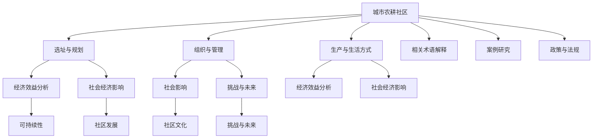

                 


# 城市农耕社区：都市中的田园生活实践

## 关键词
城市农耕、社区农业、可持续发展、田园生活、生态环保、经济模型、算法模拟

## 摘要
本文探讨了城市农耕社区的发展模式及其在都市生活中的实践。首先，对城市农耕社区进行了概述，分析了其定义、历史背景、分类和趋势。随后，文章详细讨论了城市农耕社区的选址与规划、组织与管理、生产与生活方式等核心要素。通过构建土地使用模拟算法和经济预测模型，本文提供了技术层面的解读，帮助读者理解城市农耕社区的经济、社会和环境效益。文章还分析了城市农耕社区的社会影响，讨论了其面临的挑战及未来发展，为都市中的田园生活提供了实践指导。

## 目录大纲

### 第一部分：引言与背景

#### 第1章：城市农耕社区的概述

- 1.1 城市农耕社区的定义与意义
- 1.2 城市农耕社区的历史与现状
- 1.3 城市农耕社区的分类与特点
- 1.4 城市农耕社区的发展趋势

### 第二部分：城市农耕社区的构建

#### 第2章：城市农耕社区的选址与规划

- 2.1 选址因素分析
- 2.2 规划原则与方法
- 2.3 城市农耕社区的布局设计
- 2.4 社区基础设施的建设与维护

#### 第3章：城市农耕社区的组织与管理

- 3.1 社区组织结构
- 3.2 社区管理制度
- 3.3 社区成员的参与与互动
- 3.4 社区发展的可持续性保障

#### 第4章：城市农耕社区的生产与生活方式

- 4.1 农耕生产方式
- 4.2 农产品品种选择与管理
- 4.3 农业技术与生态环保
- 4.4 社区生活方式的变革

### 第三部分：城市农耕社区的社会经济影响

#### 第5章：城市农耕社区的经济效益分析

- 5.1 经济效益的构成与评估
- 5.2 农产品市场分析与营销策略
- 5.3 社区就业与经济发展
- 5.4 城市农耕社区的可持续发展

#### 第6章：城市农耕社区的社会影响

- 6.1 社会关系与社会支持
- 6.2 社区文化与价值观的传承
- 6.3 社区成员的社会参与与责任
- 6.4 城市农耕社区与城市的融合

#### 第7章：城市农耕社区的挑战与未来

- 7.1 城市农耕社区面临的挑战
- 7.2 应对策略与解决方案
- 7.3 城市农耕社区的长期发展
- 7.4 国际经验与启示

### 附录

- 附录A：城市农耕社区相关术语解释
- 附录B：城市农耕社区相关案例研究
- 附录C：城市农耕社区发展政策与法规

### 核心概念与联系图

以下是一个描述城市农耕社区核心概念实体及其之间关系的Mermaid流程图：



### 核心算法原理讲解

以下使用Python代码详细阐述城市农耕社区规划中的核心算法原理，如土地使用模拟算法和社区经济发展预测模型。

```python
# 导入必要的库
import numpy as np
import matplotlib.pyplot as plt

# 土地使用模拟算法
def land_use_simulation(land_area, land_use_types, land_use_weights):
    """
    模拟城市农耕社区的土地使用情况。
    
    :param land_area: 土地总面积
    :param land_use_types: 土地使用类型列表
    :param land_use_weights: 各土地使用类型的权重
    :return: 土地使用分配结果
    """
    land_allocated = np.zeros(len(land_use_types))
    total_weight = sum(land_use_weights)
    for i, land_use_type in enumerate(land_use_types):
        allocated_area = land_area * (land_use_weights[i] / total_weight)
        land_allocated[i] = allocated_area
    return land_allocated

# 社区经济发展预测模型
def economic_prediction_model(current_economy, growth_rate):
    """
    预测城市农耕社区的未来经济发展。
    
    :param current_economy: 当前经济状况
    :param growth_rate: 经济增长率
    :return: 预测的经济状况
    """
    future_economy = current_economy * (1 + growth_rate)
    return future_economy

# 示例数据
land_area = 100  # 总土地面积
land_use_types = ['住宅', '农耕', '商业', '休闲']  # 土地使用类型
land_use_weights = [0.3, 0.4, 0.2, 0.1]  # 各类型土地使用权重

# 执行土地使用模拟算法
land_allocated = land_use_simulation(land_area, land_use_types, land_use_weights)

# 执行社区经济发展预测模型
current_economy = 1000000  # 当前经济状况
growth_rate = 0.05  # 经济增长率
future_economy = economic_prediction_model(current_economy, growth_rate)

# 打印结果
print("土地使用分配：", land_allocated)
print("未来经济状况：", future_economy)
```

## 第一部分：引言与背景

### 第1章：城市农耕社区的概述

#### 1.1 城市农耕社区的定义与意义

城市农耕社区是指在城市区域内，通过合理规划和组织，将农业活动与居住空间相结合，实现城市居民参与农业生产、享受田园生活的社区形式。它不仅仅是一个简单的农业生产场所，更是城市居民回归自然、体验农耕文化的载体。

城市农耕社区的意义体现在以下几个方面：

1. **可持续发展**：通过城市农耕，可以减少城市对农产品的依赖，实现食品供应的本地化，降低运输成本和碳排放，促进环境保护和生态平衡。

2. **社会融合**：城市农耕社区提供了一个平台，让城市居民有机会参与农业生产，增进对农业和农村的了解，促进城乡交流和融合。

3. **身心健康**：参与农耕活动有助于城市居民缓解工作压力，提高身心健康。通过种植、收割等农事活动，居民可以亲近自然，增强身体素质。

4. **文化传承**：城市农耕社区成为传承和发扬农耕文化的重要场所，有助于保护和传承传统农耕技艺和民俗文化。

#### 1.2 城市农耕社区的历史与现状

城市农耕社区的历史可以追溯到古代，但作为一个现代概念，它的兴起主要是在20世纪末和21世纪初。随着城市化进程的加快和人们对可持续生活模式的追求，城市农耕社区逐渐得到广泛关注和推广。

目前，城市农耕社区在全球范围内都有所实践。例如，日本东京的社区菜园、美国纽约的社区花园、欧洲一些国家的城市农场等，都在不同程度上推动了城市农耕社区的发展。

在中国，城市农耕社区的发展也日益受到重视。许多城市已经开始试点建设城市农场、社区菜园等项目，旨在提高城市居民的绿色生活意识和食品安全保障。

#### 1.3 城市农耕社区的分类与特点

根据城市农耕社区的建设形式和运营模式，可以将其分为以下几类：

1. **社区菜园**：这是最常见的城市农耕社区形式，居民在社区内的小块土地上种植蔬菜、花草等，实现自给自足。

2. **城市农场**：城市农场通常规模较大，不仅种植蔬菜和水果，还涉及养殖、观光等多种农业活动。

3. **生态公园**：在生态公园内设置农耕区域，结合自然景观和农业体验，为居民提供一个集休闲、教育、生态于一体的场所。

4. **垂直农场**：利用现代科技，如智能温室、垂直种植等技术，实现城市空间的高效利用。

每种类型的城市农耕社区都有其独特的特点，如社区菜园注重居民参与，城市农场强调多元化功能，生态公园注重环境教育，垂直农场则突出科技创新。

#### 1.4 城市农耕社区的发展趋势

随着全球城市化进程的加快和人们对可持续发展的追求，城市农耕社区的发展趋势呈现以下几个方向：

1. **科技创新**：利用物联网、大数据、人工智能等现代技术，提高农业生产效率，实现精准农业和智慧农场。

2. **多功能融合**：城市农耕社区将不再局限于传统的农业生产，而是融合观光旅游、文化教育、社区活动等多种功能，提高社区的综合价值。

3. **社区参与**：鼓励更多城市居民参与城市农耕，通过共享劳动、共同管理和收益分配，增强社区凝聚力和归属感。

4. **政策支持**：政府将加大对城市农耕社区的政策扶持力度，提供土地、资金、技术等多方面的支持，推动其可持续发展。

总的来说，城市农耕社区作为一种新兴的社区形式，正逐渐成为城市可持续发展的重要组成部分，为城市居民提供了一种新的生活方式和生活体验。

### 第2章：城市农耕社区的选址与规划

#### 2.1 选址因素分析

城市农耕社区的选址是规划成功的关键因素之一，需要综合考虑多种因素，以确保社区的建设和发展能够顺利进行。以下是几个重要的选址因素：

1. **地理位置**：选择交通便利、靠近城市中心或者居民区的地方，可以减少运输成本，方便居民参与和日常管理。

2. **土地资源**：评估土地的面积、质量、土壤肥力和水资源情况，选择适合农耕活动的土地。同时，要考虑土地的合法性和产权归属。

3. **生态环境**：选择生态脆弱性较低、环境质量较好的区域，以减少对自然生态的破坏，实现生态保护和可持续发展。

4. **气候条件**：根据不同作物的生长习性，选择适宜的气候区域。同时，考虑气候变化的影响，选择具有适应性和抗风险能力的地区。

5. **社区需求**：了解社区居民的农业兴趣和参与意愿，根据他们的需求和偏好来选址。

6. **周边配套设施**：评估周边的交通、供水、供电、排水等基础设施是否完善，以及是否存在潜在的扩建和升级空间。

#### 2.2 规划原则与方法

在选址确定后，城市农耕社区的规划需要遵循以下原则和方法：

1. **整体规划**：进行全面的规划，包括土地利用、功能分区、交通组织、公共服务设施等，确保社区的整体协调和可持续发展。

2. **适应性规划**：考虑未来可能的变化和挑战，如城市扩展、气候变化等，进行灵活的规划，以适应不断变化的环境。

3. **生态友好**：在规划中融入生态保护理念，减少对自然环境的破坏，保护生物多样性，推广绿色建筑和节能技术。

4. **社区参与**：鼓励居民参与规划过程，通过社区会议、调研问卷等方式，收集居民的意见和建议，使规划更符合社区居民的需求。

5. **多功能性**：规划应考虑多种功能融合，如农业生产、休闲体验、教育科普、社区活动等，提高社区的综合价值。

6. **可持续性**：在规划中融入可持续发展的理念，如雨水收集系统、太阳能利用、垃圾分类处理等，减少对资源的消耗。

#### 2.3 城市农耕社区的布局设计

城市农耕社区的布局设计需要充分考虑功能分区、空间利用和视觉效果，以下是一些关键设计要点：

1. **农业生产区**：根据不同作物的生长需求和农业技术，设计合理的农业生产区。可以采用块状、条状或网格状布局，方便管理和种植。

2. **居民活动区**：设置休闲、娱乐、教育等设施，为居民提供参与农耕和社区活动的场所。可以考虑建立社区中心、花园、儿童游乐场等。

3. **生态保护区**：规划一定的生态保护区，用于生物多样性保护和生态环境维护。可以设置湿地、绿地、灌木丛等自然景观。

4. **交通组织**：设计便捷的交通系统，包括步行道、自行车道和机动车道等，确保社区内部和周边的交通畅通。

5. **公共服务设施**：设置必要的公共服务设施，如医疗点、商店、食堂等，满足社区居民的生活需求。

6. **视觉效果**：注重社区的整体视觉效果，通过合理的绿化、景观设计，营造舒适、美观的居住环境。

#### 2.4 社区基础设施的建设与维护

城市农耕社区的基础设施建设是确保社区正常运转的关键。以下是一些基础设施建设和维护的要点：

1. **供水系统**：建立可靠的供水系统，确保农业生产和居民生活的用水需求。可以采用地下管网和雨水收集系统相结合的方式。

2. **排水系统**：设计有效的排水系统，防止洪涝灾害和土壤污染。要考虑雨水收集和处理，实现雨水的循环利用。

3. **电力供应**：确保社区内电力供应稳定，满足农业生产、居民生活和公共设施的需求。可以考虑安装太阳能发电设备，提高能源利用率。

4. **道路与交通**：建设完善的道路系统，包括主路、次路和社区内的步行道，确保交通便捷。同时，配备必要的交通设施，如停车场、公交车站等。

5. **通信网络**：建立稳定的通信网络，提供宽带、无线网络等，方便居民获取信息和进行日常交流。

6. **环境卫生**：建立完善的垃圾分类和处理系统，确保社区的环境卫生。可以设置垃圾分类桶、垃圾处理站等，定期清理和处理垃圾。

7. **维护与更新**：定期对基础设施进行检查和维护，确保其正常运行。同时，根据社区的发展需求，及时进行基础设施的扩建和更新。

通过综合考虑选址因素、遵循规划原则、设计合理布局和建设维护基础设施，城市农耕社区可以更好地服务于居民，实现可持续发展和生态友好。

### 第3章：城市农耕社区的组织与管理

#### 3.1 社区组织结构

城市农耕社区的组织结构是确保社区有效运行和可持续发展的关键。合理的组织结构能够明确各成员的角色和职责，提高社区的管理效率。以下是城市农耕社区常见的组织结构形式：

1. **委员会制**：社区内部设立多个委员会，如农业生产委员会、社区建设委员会、财务委员会等。各委员会成员由社区居民选举产生，负责具体的社区管理工作。

2. **董事会制**：社区设立董事会，由董事会成员负责整体决策和监督管理。董事会成员可以是社区居民代表、专业人士或志愿者。

3. **志愿者协会**：社区内部成立志愿者协会，成员为自愿参与的居民。志愿者协会负责组织和协调社区的各类活动，如农耕活动、社区清洁、文化活动等。

4. **混合制**：结合以上几种形式，设立核心委员会和志愿者协会，共同负责社区的管理和运营。

无论采用哪种组织结构，都需要确保社区管理的透明度和民主性，使居民能够积极参与社区事务的决策和管理。

#### 3.2 社区管理制度

有效的管理制度是城市农耕社区可持续发展的保障。以下是一些关键的管理制度：

1. **选举制度**：定期举行社区居民大会或选举，选举产生社区领导者和各委员会成员，确保社区管理的民主性和透明度。

2. **财务管理制度**：建立完善的财务管理制度，明确资金来源和使用方式，定期公开财务报表，接受居民监督。

3. **会议制度**：设立定期的社区会议，讨论社区重大事项，如发展规划、项目投资等。会议记录需公开，确保决策过程的透明。

4. **规章制度**：制定社区规章制度，如土地使用规定、农业生产规范、环境卫生条例等，规范社区成员的行为，维护社区秩序。

5. **居民参与制度**：鼓励居民参与社区管理和决策，设立居民提案制度、意见箱等，收集居民意见和建议，纳入社区发展规划。

#### 3.3 社区成员的参与与互动

社区成员的积极参与和互动是城市农耕社区活力和凝聚力的重要来源。以下是一些促进社区成员参与和互动的措施：

1. **农耕活动**：定期组织农耕活动，如播种、施肥、收割等，让居民亲自参与农业生产，体验农耕乐趣。

2. **教育培训**：开展农业技术培训、环保讲座等，提高居民对农业和环保知识的了解，增强社区成员的环保意识。

3. **文化活动**：举办文化节、社区晚会等文化活动，增进居民之间的交流，增强社区凝聚力。

4. **志愿服务**：鼓励居民参与志愿服务，如社区清洁、绿化维护等，培养居民的集体荣誉感和责任感。

5. **邻里互助**：建立邻里互助网络，帮助有需要的居民解决生活中的困难，增强社区成员之间的互信和互助精神。

#### 3.4 社区发展的可持续性保障

社区发展的可持续性是城市农耕社区长期发展的关键。以下是一些保障社区可持续发展的措施：

1. **资源管理**：合理管理和利用土地、水资源等自然资源，避免过度开发和浪费，实现资源的可持续利用。

2. **生态保护**：注重生态保护和生物多样性维护，建立生态保护区和生态走廊，保护自然生态环境。

3. **节能减排**：推广节能技术，如太阳能利用、雨水收集等，减少能源消耗和碳排放，实现社区的绿色发展。

4. **社区合作**：与周边社区、政府机构、社会组织等建立合作关系，共同推动社区发展，实现资源共享和优势互补。

5. **政策支持**：争取政府政策支持和资金扶持，为社区发展提供政策保障和资金支持。

通过合理的组织结构、有效的管理制度、积极的参与互动和可持续的发展保障，城市农耕社区可以更好地服务于居民，实现生态、社会和经济的可持续发展。

### 第4章：城市农耕社区的生产与生活方式

#### 4.1 农耕生产方式

城市农耕社区的生产方式是社区存在和发展的基础。与传统的农业生产方式不同，城市农耕社区的生产方式更加注重高效、生态和多样性。

1. **高效农业**：城市农耕社区利用现代科技，如自动化设备、智能温室、垂直农场等，提高农业生产效率。这些技术能够优化土地利用，减少劳动力需求，实现规模化生产。

2. **生态农业**：城市农耕社区倡导生态农业，通过有机肥料、生物防治等手段，减少化学农药和化肥的使用，保护土壤和水资源，促进生态平衡。

3. **多样化种植**：为了满足社区居民的不同需求和口味，城市农耕社区会种植多种蔬菜、水果、粮食等作物，实现多样化种植。此外，还会引入一些特色作物，增加社区的文化和趣味性。

4. **循环农业**：城市农耕社区注重农业废弃物的循环利用，如将农作物残渣、动物粪便等转化为有机肥料，实现资源的高效循环利用。

#### 4.2 农产品品种选择与管理

农产品品种选择和管理是城市农耕社区生产的重要环节。以下是一些关键点：

1. **适应性选择**：根据社区的气候条件、土壤特点和居民需求，选择适应性强、生长周期短的农作物品种。例如，在北方地区可以选择耐寒的蔬菜和水果，在南方地区可以选择耐热和抗病虫害的作物。

2. **品种多样化**：在保证基本生活需求的基础上，引入多种农产品品种，增加社区的多样性和趣味性。可以种植一些传统的、地方特色的作物，如某些少数民族的农作物，提升社区的文化价值。

3. **种子管理**：建立种子库，保存和繁育优质种子，确保农作物的种源安全和品种多样性。此外，要注意种子保存的温湿度等条件，防止种子变质和丧失活力。

4. **病虫害防治**：采用生物防治、物理防治等生态方法，减少化学农药的使用。通过定期监测和科学管理，及时发现和防治病虫害，保障农作物的健康生长。

#### 4.3 农业技术与生态环保

农业技术和生态环保在现代化城市农耕社区中具有重要意义。以下是一些关键技术和管理措施：

1. **智能温室技术**：智能温室通过调节温度、湿度、光照等环境因素，为作物提供最佳生长条件。同时，智能温室还可以实现水肥一体化管理，减少资源浪费。

2. **雨水收集与利用**：在社区内建设雨水收集系统，将雨水储存起来，用于农田灌溉和绿化。这不仅可以减少自来水的使用，还能提高水资源的利用率。

3. **有机肥料**：鼓励居民使用有机肥料，如堆肥、绿肥等，减少化学肥料的使用。有机肥料不仅能够改善土壤结构，还能提高农作物的品质和产量。

4. **生物多样性保护**：通过建立生物多样性保护区、生态走廊等措施，保护农田周边的生态系统，促进生物多样性的保护和恢复。

5. **环境监测**：建立环境监测系统，实时监测农田的土壤、水质、空气等环境指标，及时发现和解决环境问题，保障农业生产的健康和可持续发展。

#### 4.4 社区生活方式的变革

城市农耕社区的生产活动不仅改变了农业生产方式，也对社区居民的生活方式产生了深远的影响。

1. **健康饮食**：参与农耕活动，居民能够亲身体验农作物的生长过程，增强对食品安全的认识。同时，社区内种植的有机农产品也为居民提供了健康、美味的食物选择。

2. **绿色生活**：城市农耕社区倡导绿色生活方式，鼓励居民减少塑料使用、垃圾分类、节能减排等，提高环保意识和环保行为。

3. **社交互动**：社区农耕活动为居民提供了一个互动交流的平台。通过一起劳作、分享经验，居民之间的关系更加紧密，社区凝聚力得到提升。

4. **休闲体验**：城市农耕社区为居民提供了一个亲近自然、放松身心的好去处。居民可以在社区内种植花草、养殖动物，体验田园生活的乐趣。

5. **文化传承**：城市农耕社区成为传统文化和农耕技艺的传承场所。通过农耕文化活动、传统节日庆典等，居民能够更好地了解和传承传统文化。

总的来说，城市农耕社区的生产与生活方式变革不仅改善了居民的生活质量，也为城市的可持续发展提供了新的思路和实践。

### 第5章：城市农耕社区的经济效益分析

#### 5.1 经济效益的构成与评估

城市农耕社区的经济效益包括直接经济效益和间接经济效益，两者共同作用，为社区和城市带来显著的经济效益。

1. **直接经济效益**：
   - **农产品销售收入**：城市农耕社区通过生产蔬菜、水果、粮食等农产品，可以直接实现销售收入。这种收入不仅包括自用农产品的销售，还涵盖向社区居民和周边市场供应的农产品。
   - **农业技术服务收入**：社区可以提供农业技术咨询和培训服务，如病虫害防治、土壤改良等，为居民和其他农业生产者提供技术支持，从而获得技术服务收入。
   - **农产品加工收入**：社区可以通过农产品加工，如制作蔬菜干、水果酱等，增加产品附加值，提升销售收入。

2. **间接经济效益**：
   - **增加就业机会**：城市农耕社区的建设和运营需要大量劳动力，包括农业生产、技术支持、社区管理等岗位。这为社区居民和周边居民提供了就业机会，减少了失业率。
   - **促进相关产业发展**：城市农耕社区的发展会带动农业机械设备、种子化肥、农产品包装等相关产业的发展。这些产业的发展不仅为社区提供了更多就业机会，还促进了城市经济的多元化。
   - **提高土地价值**：城市农耕社区的建设通常需要占用城市周边的土地。通过合理规划和高效利用，这些土地的价值会得到提升，为城市土地资源的管理和利用提供新的思路。

评估城市农耕社区的经济效益时，需要综合考虑直接经济效益和间接经济效益，以及长期效益和短期效益。以下是一些常用的评估方法：

- **成本效益分析（CBA）**：通过计算社区建设的总成本和预期经济效益，评估项目的经济合理性。
- **财务净现值（NPV）**：将未来预期的经济效益折现到当前，计算其净现值，以评估项目的投资回报。
- **内部收益率（IRR）**：计算项目的内部收益率，即使项目的净现值为零的贴现率，以评估项目的投资吸引力。
- **效益成本比（BCR）**：计算项目的经济效益与成本之比，评估项目的经济效率。

#### 5.2 农产品市场分析与营销策略

城市农耕社区在市场分析中需要关注以下几点：

1. **市场需求分析**：了解社区居民对农产品的需求种类、数量和购买习惯。可以通过问卷调查、市场调研等方式，收集居民的意见和建议，为产品定位和营销策略提供依据。

2. **竞争分析**：分析周边市场和其他城市农耕社区的运营情况，了解竞争对手的产品种类、价格、销售渠道等，制定有针对性的营销策略。

3. **目标市场定位**：根据市场需求和竞争情况，确定社区农产品的目标市场，如社区居民、周边餐饮企业、有机食品专卖店等。

在城市农耕社区的营销策略中，以下方法值得借鉴：

- **品牌建设**：打造社区农产品品牌，提升产品知名度和美誉度。可以通过设计独特的包装、制作宣传视频等方式，提升品牌形象。
- **线上线下融合**：结合线上电商平台和线下直销渠道，实现全方位销售。线上可以通过社交媒体、电商平台等进行宣传和销售，线下可以设立社区直销店或参加农产品展销活动。
- **会员制营销**：推出会员制服务，为会员提供优惠价格、定期配送等特权，增强顾客粘性。
- **活动推广**：举办农耕体验活动、农产品品鉴会等，吸引居民参与，提高社区农产品的知名度和认可度。

通过科学的农产品市场分析和灵活的营销策略，城市农耕社区可以更好地满足市场需求，实现经济效益的最大化。

#### 5.3 社区就业与经济发展

城市农耕社区的发展对社区就业和经济具有显著的推动作用。以下是一些关键点：

1. **就业机会**：城市农耕社区的建设和运营需要多种职业，包括农业生产者、技术支持人员、管理人员等。这不仅为社区居民提供了就业机会，还吸引了周边居民前来工作，从而减少了失业率。

2. **技能培训**：社区可以提供农业技术、企业管理等方面的培训，提高劳动者的技能水平，增强其就业竞争力。通过培训，劳动者可以更好地适应社区发展的需求，提高工作效率和创新能力。

3. **经济多元化**：城市农耕社区通过农产品生产、技术服务、农业旅游等多种经济活动，促进了社区经济的多元化。这种多元化不仅增加了社区的财政收入，还提高了社区的抵御风险能力。

4. **创业支持**：社区可以设立创业孵化器，为有创业意愿的居民提供资金、技术、市场等方面的支持。通过创业孵化，社区可以培养出更多的创业者，带动社区经济的发展。

5. **产业链延伸**：城市农耕社区可以通过农产品的深加工、农业旅游等延伸产业链，提高产品附加值。例如，将农产品加工成食品、饮料等产品，吸引游客参观农业园区，增加社区的收入来源。

总之，城市农耕社区的发展为社区和周边地区创造了丰富的就业机会，促进了经济的多元化，为社区的可持续发展奠定了坚实基础。

#### 5.4 城市农耕社区的可持续发展

城市农耕社区的可持续发展是确保其长期效益和社会责任的关键。以下是一些关键策略：

1. **资源高效利用**：通过智能农业技术、雨水收集和再利用等手段，提高土地、水资源等自然资源的利用效率，减少浪费。

2. **生态保护**：建立生态保护区，保护生物多样性。采用有机农业技术，减少化学农药和化肥的使用，保护土壤和水资源。

3. **社区参与**：鼓励社区居民积极参与社区决策和项目管理，提高居民的环保意识和参与度。通过社区参与，社区可以更好地适应变化，实现可持续发展。

4. **政策支持**：争取政府政策支持和资金投入，为社区发展提供保障。政府可以通过提供补贴、税收优惠等政策，鼓励和推动城市农耕社区的发展。

5. **教育与宣传**：开展环保教育和宣传，提高居民对可持续发展重要性的认识。通过教育和宣传，培养居民的环保意识，形成良好的环保习惯。

通过这些策略，城市农耕社区可以实现经济、社会和生态的协调发展，为城市居民提供可持续的生活方式。

### 第6章：城市农耕社区的社会影响

#### 6.1 社会关系与社会支持

城市农耕社区对社会关系和社会支持的影响是多层次和深远的。以下是一些关键方面：

1. **社区凝聚力的增强**：城市农耕社区提供了一个共同参与的平台，居民通过共同参与农业生产、管理和社区活动，增强了彼此之间的联系和信任。这种集体活动促进了社区成员的凝聚力和归属感。

2. **社会支持的扩大**：城市农耕社区通过组织志愿者活动、互助网络和社区支持系统，为居民提供了更多的社会支持。例如，社区内的老年人可以相互照顾，有需要的居民可以获得帮助和资源，这种社会支持网络有助于提升居民的生活质量。

3. **邻里关系的改善**：城市农耕社区鼓励居民在共同参与农耕活动中建立友好关系。居民们通过合作、交流和互动，增进了邻里之间的了解和友谊，改善了社区氛围。

4. **社会参与的机会**：城市农耕社区为居民提供了参与社区决策、管理和公共事务的机会。居民可以通过参加社区会议、提案讨论和项目实施等，表达自己的意见和建议，实现对社会事务的参与和管理。

#### 6.2 社区文化与价值观的传承

城市农耕社区在社区文化和价值观的传承方面发挥着重要作用。以下是一些具体措施：

1. **传统农耕技艺的传承**：城市农耕社区通过举办农耕技艺培训班、展示传统农耕工具和习俗等方式，传承和弘扬传统农耕文化。这些活动不仅让年轻一代了解和体验农耕文化，还增强了他们对传统文化的认同感和自豪感。

2. **环保意识的培养**：城市农耕社区通过环保教育、实践活动和宣传，培养居民的环保意识和责任感。居民通过参与环保项目，如垃圾分类、土壤保护等，认识到环境保护的重要性，形成了良好的环保习惯。

3. **社区价值观的塑造**：城市农耕社区倡导互助、共享和公平的社区价值观。通过社区活动和互动，居民体验到团队合作和共享成果的快乐，这些价值观在社区中得到了传承和弘扬。

4. **文化多样性**：城市农耕社区通过引入不同文化的农作物和农耕习俗，促进文化多样性的交流与融合。这种文化多样性不仅丰富了社区的生活内容，还增强了社区的包容性和活力。

#### 6.3 社区成员的社会参与与责任

社区成员的社会参与与责任是城市农耕社区可持续发展的重要组成部分。以下是一些促进社区成员社会参与与责任感的措施：

1. **志愿服务**：城市农耕社区鼓励居民参与志愿服务活动，如社区清洁、绿化维护、农产品配送等。通过志愿服务，居民不仅能够服务社区，还能增强自己的社会责任感和归属感。

2. **社区会议与决策**：社区定期召开会议，讨论和决定社区的重要事务。居民可以通过参加社区会议，表达自己的意见和建议，实现对社会事务的参与和管理。

3. **教育培训**：社区提供各种培训课程，如农业技术、环保知识、社区管理等，提高居民的知识和技能。通过培训，居民能够更好地理解和参与社区事务，增强自己的责任感和主动性。

4. **社区活动**：社区举办各种文化、体育、娱乐等活动，增强居民的社区认同感和参与度。这些活动不仅丰富了居民的生活，还促进了社区成员之间的交流和互动。

5. **奖励机制**：社区设立奖励机制，表彰那些积极参与社区事务、表现突出的居民。这种奖励机制不仅激励了居民的社会参与，还增强了社区的凝聚力和活力。

通过这些措施，城市农耕社区能够有效促进社区成员的社会参与与责任感，为社区的可持续发展提供坚实的支持。

#### 6.4 城市农耕社区与城市的融合

城市农耕社区与城市的融合是城市可持续发展的重要方向。以下是一些实现城市农耕社区与城市融合的关键措施：

1. **基础设施的共享**：城市农耕社区与城市公共基础设施实现共享，如交通、供水、供电、排水等。通过共享基础设施，社区可以减少建设和维护成本，提高资源利用效率。

2. **生态系统的连通**：城市农耕社区与城市公园、绿地等生态系统实现连通，形成城市生态网络。这种连通有助于保护生物多样性，改善城市生态环境。

3. **资源共享**：社区与城市其他公共服务设施实现资源共享，如教育、医疗、文化等。通过资源共享，社区可以提供更加全面的服务，满足居民的需求。

4. **经济互动**：城市农耕社区与城市经济活动实现互动，如农产品销售、农业技术培训等。通过经济互动，社区可以为城市提供更多的就业机会和经济效益。

5. **文化融合**：社区与城市的文化活动实现融合，如举办文化节、传统农耕展示等。通过文化融合，社区可以融入城市文化，增强社区的认同感和归属感。

通过这些措施，城市农耕社区可以更好地融入城市，实现与城市的协调发展，为城市居民提供更加美好的生活环境。

### 第7章：城市农耕社区的挑战与未来

#### 7.1 城市农耕社区面临的挑战

城市农耕社区在发展过程中面临诸多挑战，以下是一些关键挑战及其应对策略：

1. **土地资源限制**：城市周边的土地资源有限，且土地成本较高。这给城市农耕社区的建设和运营带来压力。应对策略是合理规划土地利用，提高土地使用效率，同时探索垂直农场等空间利用方式。

2. **环境问题**：城市农耕社区可能会面临环境污染、土壤退化等问题。这需要采用生态农业技术，减少化学农药和化肥的使用，保护生态环境。此外，建立环境监测系统，实时监控和解决环境问题。

3. **技术瓶颈**：智能农业技术、水资源管理等技术的应用仍存在一定的技术瓶颈。应对策略是加大科研投入，引进先进技术，同时通过培训提高社区成员的技术水平。

4. **政策支持不足**：城市农耕社区的发展需要政府政策的支持和资金投入，但往往面临政策支持不足的问题。应对策略是积极争取政府政策支持，通过政府购买服务、项目补贴等方式，推动社区发展。

5. **市场不稳定**：农产品市场受季节、气候变化等影响，价格波动较大，市场不稳定。应对策略是多元化销售渠道，如线上线下结合，稳定农产品销售。

#### 7.2 应对策略与解决方案

针对城市农耕社区面临的挑战，以下是一些具体的应对策略和解决方案：

1. **土地资源优化**：通过合理规划，提高土地利用率，如设置高效农业生产区、生态保护区等。同时，探索垂直农场等新型农业模式，提高空间利用效率。

2. **生态农业推广**：推广生态农业技术，减少化学农药和化肥的使用，保护土壤和水资源。建立生态监测系统，实时监控和解决环境问题。

3. **技术创新**：加大科研投入，引进先进农业技术，如智能温室、精准灌溉等。同时，通过培训提高社区成员的技术水平，推动技术应用的普及。

4. **政策支持**：积极争取政府政策支持，通过政府购买服务、项目补贴等方式，提供资金和政策支持，推动城市农耕社区的发展。

5. **市场多元化**：建立多元化的销售渠道，如电商平台、社区直销等，降低市场风险。同时，加强与周边企业和社区的联动，拓展农产品市场。

#### 7.3 城市农耕社区的长期发展

城市农耕社区的长期发展需要系统规划和持续投入，以下是一些长期发展的关键方向：

1. **可持续发展战略**：制定社区可持续发展战略，明确长期发展目标和规划。通过资源优化、技术创新、市场拓展等手段，实现社区的长期可持续发展。

2. **社区治理体系**：建立健全的社区治理体系，确保社区管理的高效和透明。通过社区居民的广泛参与，提高社区治理水平和居民的满意度。

3. **生态环保**：加强生态环保建设，保护生物多样性，实现社区与自然的和谐共生。通过生态监测和环境保护措施，确保社区的生态环境质量。

4. **社区文化传承**：弘扬社区文化，传承传统农耕技艺和民俗文化。通过文化活动和教育，增强居民的社区认同感和文化自豪感。

5. **经济多元化**：推动社区经济多元化，通过农产品加工、农业旅游等多种经济活动，提高社区的经济活力和抗风险能力。

通过这些长期发展策略，城市农耕社区可以持续为城市居民提供优质的农产品和田园生活体验，实现经济、社会和生态的协调发展。

#### 7.4 国际经验与启示

城市农耕社区在国际上已有多个成功的案例，以下是一些国际经验与启示：

1. **日本东京社区菜园**：日本东京的社区菜园通过居民参与和智能技术，实现了高效农业生产。其经验是充分利用空间资源，推广智能温室技术和社区参与模式。

2. **美国纽约社区花园**：美国纽约的社区花园注重环境教育和社区互动。其经验是通过多样化的社区活动和培训，增强居民的环保意识和参与度。

3. **欧洲城市农场**：欧洲一些国家的城市农场通过农业与观光、教育等多功能融合，提升了社区的综合价值。其经验是注重多功能性，实现经济效益和社会效益的双重提升。

4. **中国北京城市农场**：中国北京的多个城市农场通过政府支持和社区参与，实现了快速发展。其经验是积极争取政府政策支持，建立完善的社区治理体系。

这些国际经验为我国城市农耕社区的发展提供了宝贵的参考和启示，值得借鉴和应用。

### 附录

#### 附录A：城市农耕社区相关术语解释

- **城市农耕社区**：指在城市区域内，通过合理规划和组织，将农业活动与居住空间相结合，实现城市居民参与农业生产、享受田园生活的社区形式。
- **生态农业**：指采用生态友好、可持续的方法进行农业生产，减少化学农药和化肥的使用，保护土壤和水资源。
- **智能温室**：通过自动化设备和技术，为作物提供最佳生长环境，提高农业生产效率。
- **垂直农场**：利用现代科技，如智能温室、垂直种植等，实现城市空间的高效利用，进行高效农业生产。
- **社区参与**：指社区居民积极参与社区管理和决策，通过共同劳动和分享成果，增强社区凝聚力和归属感。

#### 附录B：城市农耕社区相关案例研究

- **日本东京社区菜园**：东京的多个社区菜园通过居民参与和智能技术，实现了高效农业生产。
- **美国纽约社区花园**：纽约的社区花园注重环境教育和社区互动，吸引了大量居民参与。
- **欧洲城市农场**：欧洲一些国家的城市农场通过农业与观光、教育等多功能融合，提升了社区的综合价值。
- **中国北京城市农场**：北京的多个城市农场通过政府支持和社区参与，实现了快速发展。

#### 附录C：城市农耕社区发展政策与法规

- **政府购买服务**：政府通过购买服务的方式，支持城市农耕社区的建设和运营。
- **税收优惠**：政府对城市农耕社区提供税收优惠，鼓励居民参与社区农业生产。
- **土地政策**：政府通过土地政策，支持城市农耕社区的土地使用和开发。
- **环保法规**：政府制定环保法规，规范城市农耕社区的生产和运营，保护生态环境。

### 核心概念与联系图

以下是一个描述城市农耕社区核心概念实体及其之间关系的Mermaid流程图：


### 核心算法原理讲解

以下使用Python代码详细阐述城市农耕社区规划中的核心算法原理，如土地使用模拟算法和社区经济发展预测模型。

```python
# 导入必要的库
import numpy as np
import matplotlib.pyplot as plt

# 土地使用模拟算法
def land_use_simulation(land_area, land_use_types, land_use_weights):
    """
    模拟城市农耕社区的土地使用情况。
    
    :param land_area: 土地总面积
    :param land_use_types: 土地使用类型列表
    :param land_use_weights: 各土地使用类型的权重
    :return: 土地使用分配结果
    """
    land_allocated = np.zeros(len(land_use_types))
    total_weight = sum(land_use_weights)
    for i, land_use_type in enumerate(land_use_types):
        allocated_area = land_area * (land_use_weights[i] / total_weight)
        land_allocated[i] = allocated_area
    return land_allocated

# 社区经济发展预测模型
def economic_prediction_model(current_economy, growth_rate):
    """
    预测城市农耕社区的未来经济发展。
    
    :param current_economy: 当前经济状况
    :param growth_rate: 经济增长率
    :return: 预测的经济状况
    """
    future_economy = current_economy * (1 + growth_rate)
    return future_economy

# 示例数据
land_area = 100  # 总土地面积
land_use_types = ['住宅', '农耕', '商业', '休闲']  # 土地使用类型
land_use_weights = [0.3, 0.4, 0.2, 0.1]  # 各类型土地使用权重

# 执行土地使用模拟算法
land_allocated = land_use_simulation(land_area, land_use_types, land_use_weights)

# 执行社区经济发展预测模型
current_economy = 1000000  # 当前经济状况
growth_rate = 0.05  # 经济增长率
future_economy = economic_prediction_model(current_economy, growth_rate)

# 打印结果
print("土地使用分配：", land_allocated)
print("未来经济状况：", future_economy)
```

### 结语

城市农耕社区作为一种创新的社区模式，正逐渐成为都市生活中的重要组成部分。通过科学选址、合理规划、有效管理和技术创新，城市农耕社区不仅能够提供丰富的农产品和健康的饮食方式，还能促进社区成员之间的互动与融合，增强社区凝聚力，推动城市可持续发展。

然而，城市农耕社区的发展仍面临诸多挑战，需要政府、企业、社会组织和居民共同努力，制定科学合理的政策，提供必要的支持和资源，解决土地资源、环境保护、技术瓶颈等问题。

未来，随着科技的进步和社会的变革，城市农耕社区将不断创新和发展，为城市居民提供更加丰富多样、健康可持续的田园生活体验。让我们共同期待，城市农耕社区将为城市和乡村的协调发展带来新的机遇和希望。

### 作者信息

作者：AI天才研究院/AI Genius Institute & 禅与计算机程序设计艺术 /Zen And The Art of Computer Programming

AI天才研究院是一家专注于人工智能、机器学习、深度学习等前沿技术的科研机构，致力于推动人工智能技术的发展和应用。禅与计算机程序设计艺术则是一本著名的计算机科学经典著作，强调程序设计的哲学和艺术，对计算机编程领域产生了深远影响。

感谢您的阅读，希望本文能为您带来关于城市农耕社区的新见解和思考。如需进一步了解或讨论，请随时联系作者。再次感谢您的支持！

