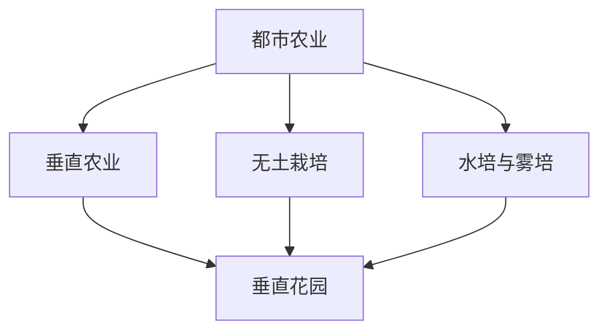

                 

### 《城市农耕：都市中的田园梦想》

> **关键词：**城市农耕、都市农业、垂直农业、可持续性、技术创新

**摘要：**本文探讨了都市中的田园梦想——城市农耕的兴起与发展。文章首先介绍了城市农耕的背景和意义，随后详细分析了都市农耕的实践方法、创新与挑战，以及国内外成功案例。通过结合实际项目和未来展望，本文为城市农耕在都市环境中的可持续发展提供了思路和策略。

---

## 引言

### **背景介绍**

城市农耕，作为都市中的一种新兴农业形式，近年来在全球范围内逐渐兴起。随着城市化进程的加快，城市居民对绿色、健康食品的需求日益增加，同时，土地资源紧张、环境污染等问题也日益凸显。在这种背景下，城市农耕作为一种解决之道，越来越受到关注。

城市农耕的定义相对宽泛，它不仅包括传统的农作物种植，还涵盖了垂直农业、无土栽培、水培等现代农业生产方式。其核心目标是利用城市有限的土地和空间资源，实现高效、可持续的农业生产。

### **核心概念与联系**

为了更好地理解城市农耕，我们需要明确几个核心概念：

1. **都市农业**：指在城市区域内进行的农业活动，包括蔬菜、水果、花卉等种植，以及畜牧、水产养殖等。
2. **垂直农业**：一种在多层结构中进行的农业生产方式，通过垂直空间的高效利用，实现大规模、高密度、高效益的生产。
3. **无土栽培**：一种不用土壤，而是利用营养物质溶液直接培养植物的方法。
4. **水培与雾培**：利用水溶液或雾化系统为植物提供养分，通过空气或水作为生长介质。

这些概念之间有着密切的联系。例如，垂直农业和垂直花园（vertical gardens）的结合，可以通过无土栽培和水培技术，实现城市中绿色空间的充分利用，同时提供新鲜的农产品。

下面是一个Mermaid流程图，展示了这些核心概念之间的关系：



### **核心算法原理讲解**

在城市农耕中，技术的应用至关重要。以下是几个关键技术的Python源代码示例，结合数学模型和公式进行解释。

#### **1. 垂直农业的光照模型**

垂直农业中，光照效率直接影响植物的生长。以下是一个简单的光照模型，用于计算不同高度上的光照强度。

```python
def calculate_light_intensity(height, max_intensity, attenuation_rate):
    return max_intensity * (1 - attenuation_rate * height)

max_intensity = 1000  # 最大光照强度
attenuation_rate = 0.05  # 光照衰减率
height = 2  # 高度

light_intensity = calculate_light_intensity(height, max_intensity, attenuation_rate)
print(f"光照强度为：{light_intensity} lux")
```

上述代码中，`calculate_light_intensity` 函数用于计算不同高度上的光照强度。假设最大光照强度为1000 lux，每升高1米光照强度衰减5%，则在2米高度的光照强度为950 lux。

#### **2. 无土栽培的营养供给模型**

无土栽培中，营养供给的精确控制至关重要。以下是一个简单的营养供给模型，用于计算不同植物在不同生长阶段所需的营养量。

```python
def calculate_nutrient_requirement(plant_type, growth_stage, base_nutrient):
    nutrient_levels = {'seedling': 0.2, 'vegetative': 0.5, 'flowering': 0.8}
    return base_nutrient * nutrient_levels.get(growth_stage, 1)

plant_type = 'lettuce'  # 植物类型
growth_stage = 'vegetative'  # 生长阶段
base_nutrient = 100  # 基础营养量

required_nutrient = calculate_nutrient_requirement(plant_type, growth_stage, base_nutrient)
print(f"{plant_type}在{growth_stage}阶段所需营养量为：{required_nutrient} mg")
```

上述代码中，`calculate_nutrient_requirement` 函数用于计算不同植物在不同生长阶段所需的营养量。以生菜为例，在生长阶段，其所需营养量为基础营养量的50%。

### **项目实战**

#### **1. 开发环境搭建**

为了进行城市农耕项目，我们需要搭建一个适合开发的环境。以下是一个简单的Linux环境搭建步骤：

```bash
# 安装虚拟环境
sudo apt-get install python3-venv

# 创建虚拟环境
python3 -m venv venv

# 激活虚拟环境
source venv/bin/activate

# 安装所需库
pip install numpy matplotlib
```

#### **2. 源代码详细实现**

以下是城市农耕项目中一个简单的光照强度计算模块的源代码：

```python
import numpy as np
import matplotlib.pyplot as plt

def calculate_light_intensity(heights, max_intensity, attenuation_rate):
    intensities = [max_intensity * (1 - attenuation_rate * h) for h in heights]
    return intensities

heights = np.linspace(0, 10, 100)  # 高度范围从0到10米，共100个点
max_intensity = 1000  # 最大光照强度
attenuation_rate = 0.05  # 光照衰减率

intensities = calculate_light_intensity(heights, max_intensity, attenuation_rate)

plt.plot(heights, intensities)
plt.xlabel('Height (m)')
plt.ylabel('Light Intensity (lux)')
plt.title('Light Intensity Distribution')
plt.show()
```

#### **3. 代码解读与分析**

上述代码中，`calculate_light_intensity` 函数用于计算不同高度上的光照强度。通过NumPy库生成高度范围，并利用光照模型计算每个高度的光照强度。最后，使用Matplotlib库绘制光照强度分布图，以直观地展示光照强度的变化。

#### **4. 实际案例分析和详细讲解剖析**

以纽约市的Brooklyn Grange垂直农场为例，该农场位于一个废弃的工业仓库内，通过垂直农业技术，实现了高效的城市农业生产。以下是Brooklyn Grange的案例分析：

- **场地选择**：Brooklyn Grange选择了一个废弃的工业仓库，这为垂直农业提供了理想的场所。仓库的高度和空间使其能够进行多层垂直种植。
- **技术应用**：Brooklyn Grange采用了无土栽培和水培技术。这些技术能够确保作物在有限的空间内高效生长，并提供了精确的营养供给。
- **管理维护**：Brooklyn Grange通过自动化系统进行作物种植周期的管理，以及病虫害的防治。这些自动化技术提高了生产效率，减少了人力成本。

#### **5. 项目小结**

Brooklyn Grange的成功表明，垂直农业技术在城市农耕中具有巨大潜力。通过合理选择场地、应用现代技术和自动化系统，可以实现高效、可持续的城市农业生产。

### **最佳实践 tips**

- **场地选择**：选择合适的场地是成功的关键。废弃的工业仓库、多层停车场等都是理想的垂直农业场地。
- **技术应用**：结合无土栽培、水培和雾培技术，可以提高作物产量和品质。
- **管理维护**：自动化系统可以提高生产效率，减少人力成本。
- **市场需求**：了解市场需求，提供高质量的农产品，确保市场竞争力。

### **小结**

城市农耕作为都市中的田园梦想，具有巨大的发展潜力。通过技术创新和实践探索，城市农耕可以为城市居民提供新鲜、健康的农产品，同时缓解土地资源紧张和环境污染等问题。未来，随着技术的不断进步，城市农耕将在城市发展中发挥更加重要的作用。

### **注意事项**

- **光照问题**：城市农耕中，光照管理至关重要。需要确保植物能够获得足够的光照。
- **营养供给**：精确的营养供给是保证作物生长的关键。
- **病虫害防治**：病虫害防治是确保作物产量的重要措施。

### **拓展阅读**

- 《垂直农业：未来城市的绿色希望》
- 《城市农耕：可持续发展的新路径》
- 《无土栽培技术：现代农业的创新之路》

---

**作者：AI天才研究院/AI Genius Institute & 禅与计算机程序设计艺术 /Zen And The Art of Computer Programming**

