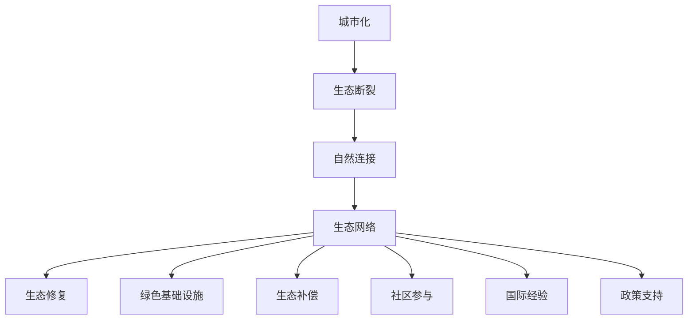

                 

### 文章标题

《城市化背景下的自然连接：重建人与自然的和谐关系》

### 文章关键词

- 城市化
- 自然连接
- 生态网络
- 人与自然关系
- 绿色基础设施
- 生态修复
- 社区参与
- 国际经验

### 文章摘要

本文探讨了城市化背景下的自然连接问题，阐述了自然连接的理念、理论基础和实践方法。通过生态网络理论和生态学基本原理的分析，本文揭示了自然连接在重建人与自然和谐关系中的重要性。此外，文章还介绍了自然连接的技术手段、实践探索及未来展望，为城市化进程中的人与自然和谐共生提供了有益的思考和实践指导。

## 第一部分：城市化的挑战与自然连接的重要性

### 第1章：城市化的现状与影响

#### 1.1 城市化的定义与趋势

城市化，即城市化进程，是指人口从农村地区向城市地区转移的过程，伴随着城市规模和数量的不断增长。城市化是现代社会发展的重要特征，也是衡量一个国家或地区现代化水平的重要指标。

近年来，全球城市化进程加速，许多国家的城市人口比例不断增加。根据联合国统计，截至2021年，全球约55%的人口居住在城市地区，预计到2050年，这一比例将上升至68%。城市化趋势的加剧，一方面反映了经济发展的成果，另一方面也带来了诸多挑战。

#### 1.2 城市化对自然环境的影响

城市化对自然环境的影响是深远且复杂的。首先，城市化过程中对土地的占用导致了大量自然生态系统的破坏。城市扩张往往伴随着森林砍伐、湿地填埋和农田转换为城市建设用地等现象，导致生物多样性丧失和生态系统服务功能减弱。

其次，城市化对水资源的影响也颇为显著。城市地区人口密集，水资源需求量大，同时城市排水系统和污水处理设施的不足，导致水体污染和水资源短缺问题日益严重。此外，城市热岛效应加剧了城市地区的气候变化，对自然环境产生了不利影响。

最后，城市化过程中的能源消耗和碳排放问题也对全球气候变化产生了重要影响。城市作为能源消耗和碳排放的主要来源，对大气环境造成了严重污染，加剧了全球气候变化的不确定性。

#### 1.3 城市化与生态断裂的关系

生态断裂是指由于人类活动导致的自然生态系统结构、功能和服务功能的破坏或丧失。城市化过程中的生态断裂现象尤为突出。城市化过程中，人类活动对自然环境的干扰，如森林砍伐、土地开发、水资源利用等，破坏了自然生态系统的完整性，导致了生态断裂。

生态断裂不仅影响了生态系统的稳定性，还导致了生物多样性的丧失和生态系统服务功能的减弱。生态断裂使得城市与周边自然景观之间的连接断裂，进一步加剧了人与自然关系的紧张。

综上所述，城市化进程对自然环境的影响不可忽视，而生态断裂现象则进一步加剧了这一影响。因此，探讨如何在城市化背景下实现自然连接，重建人与自然的和谐关系，具有重要的现实意义。

### 第2章：自然连接的理念与实践

#### 2.1 自然连接的概念与核心要素

自然连接是指通过保护和恢复自然生态系统，重建城市与自然之间的联系，实现人与自然和谐共生的过程。自然连接不仅关注自然生态系统的保护与恢复，还强调生态网络的构建和生态功能的维护。

自然连接的核心要素包括：

1. **生态网络**：生态网络是自然连接的基础，它通过保护和恢复生态系统的连通性，促进生物多样性的保护和生态服务的提供。生态网络包括各种生态系统，如森林、湿地、河流、农田等，以及它们之间的相互联系。

2. **绿色基础设施**：绿色基础设施是指城市中用于保护和恢复生态系统的各种基础设施，如公园、绿地、湿地、水体等。绿色基础设施不仅可以提供生态服务，还能改善城市环境，提高居民生活质量。

3. **生态修复**：生态修复是指通过人工手段恢复受损生态系统的功能和服务。生态修复包括植被恢复、土壤修复、水体净化等技术，旨在恢复生态系统的健康和可持续性。

4. **生态补偿**：生态补偿是指通过经济手段激励和保护生态系统的可持续发展。生态补偿机制可以为生态保护者和参与者提供经济激励，促进自然连接的实现。

5. **社区参与**：社区参与是自然连接的重要保障。通过社区参与，可以提高公众对自然连接的认识和参与度，促进生态保护和可持续发展的实现。

#### 2.2 自然连接的目标与价值

自然连接的目标是重建城市与自然之间的和谐关系，实现人与自然的可持续发展。具体目标包括：

1. **保护和恢复生态系统**：通过保护和恢复生态系统的连通性，保护生物多样性，提高生态系统的稳定性和可持续性。

2. **提供生态服务**：通过构建绿色基础设施和生态修复，提供空气和水质的净化、气候调节、生物多样性保护等生态服务。

3. **改善城市环境**：通过绿化城市、改善城市微气候，提高居民的生活质量和幸福感。

4. **促进经济发展**：自然连接可以创造新的就业机会，促进旅游业和相关产业的发展，推动城市经济的可持续发展。

自然连接的价值体现在多个方面：

1. **生态价值**：自然连接可以保护和恢复生态系统，提高生态系统的稳定性和可持续性，为人类提供清洁的水源、新鲜的空气和丰富的生物资源。

2. **社会价值**：自然连接可以改善城市环境，提高居民生活质量，增强社区凝聚力，促进社会和谐。

3. **经济价值**：自然连接可以促进旅游业和相关产业的发展，创造就业机会，推动城市经济的可持续发展。

#### 2.3 自然连接的关键策略

实现自然连接需要采取一系列关键策略，包括：

1. **生态网络规划**：通过科学规划和设计，构建生态网络，确保生态系统的连通性和多样性。

2. **绿色基础设施建设**：在城市规划和建设中，注重绿色基础设施的建设，提高城市生态系统的服务功能。

3. **生态修复与恢复**：对受损的生态系统进行修复与恢复，恢复生态系统的健康和功能。

4. **生态补偿机制**：建立生态补偿机制，激励和保护生态系统的可持续发展。

5. **社区参与**：通过社区参与，提高公众对自然连接的认识和参与度，促进生态保护和可持续发展的实现。

6. **政策支持与法规保障**：制定相关政策，提供法规保障，确保自然连接的顺利实施。

总之，自然连接是实现城市化背景下的可持续发展的关键路径，通过构建生态网络、建设绿色基础设施、实施生态修复与恢复、建立生态补偿机制、促进社区参与以及政策支持与法规保障，可以实现城市与自然的和谐共生。

### 第3章：生态网络理论与应用

#### 3.1 生态网络的定义与构成

生态网络是指由多个生态系统单元及其相互作用所构成的整体，这些生态系统单元可以是森林、湿地、河流、农田等，它们通过自然过程相互连接，形成一个复杂的生态体系。生态网络不仅包括生物群落和物种多样性，还包括物种之间的相互作用、生态过程的传递和生态系统的服务功能。

生态网络的构成要素主要包括：

1. **生态系统单元**：生态系统单元是生态网络的基础，是生态网络中的基本功能单位。它们可以是自然形成的生态系统，如森林、湿地、海洋等，也可以是人工建立的生态系统，如农田、城市绿地等。

2. **生物多样性**：生态网络的生物多样性是生态系统功能和服务的基础，丰富的生物多样性有助于提高生态系统的稳定性和适应性。

3. **生物地理过程**：生物地理过程包括物种迁移、扩散和生态位竞争等，这些过程决定了生态网络的连通性和动态变化。

4. **生态过程**：生态过程包括物质循环、能量流动、生物地球化学循环等，这些过程保证了生态网络的物质和能量流动。

5. **人类活动**：人类活动对生态网络有重要影响，既可以是破坏性的，如森林砍伐、土地开发，也可以是建设性的，如生态修复、绿色基础设施建设。

#### 3.2 生态网络的特性与功能

生态网络的特性主要体现在以下几个方面：

1. **连通性**：生态网络的连通性是生态网络功能的基础。良好的连通性可以促进物种迁移、扩散和生态过程的传递，提高生态系统的稳定性和适应性。

2. **多样性**：生态网络的多样性包括生物多样性、生态过程多样性和生态系统多样性。多样性有助于提高生态系统的功能和稳定性，增强生态网络对环境变化的适应能力。

3. **动态性**：生态网络是动态的，受到自然过程和人类活动的影响。生态网络的动态性使得生态系统可以在不同条件下调整和适应，以保持生态平衡。

4. **整体性**：生态网络的整体性体现在其组成部分之间的相互依赖和相互作用。生态网络的各个部分相互作用，共同维持生态系统的稳定性和功能。

生态网络的功能主要包括：

1. **生态服务**：生态网络提供各种生态服务，如水源涵养、气候调节、土壤保持、生物多样性保护等，对人类社会的生存和发展具有重要意义。

2. **生物多样性保护**：生态网络通过提供适宜的栖息地和生态条件，保护生物多样性和遗传多样性，维护生态系统的健康和稳定。

3. **生态调节**：生态网络通过生态过程的传递和物质循环，调节环境，维持生态平衡，为人类提供良好的生活环境。

4. **适应与恢复**：生态网络具有适应和恢复能力，可以在面对环境变化和人类干扰时，通过物种迁移、生态过程调整等机制，维持生态系统的功能和稳定性。

#### 3.3 生态网络的构建与优化

生态网络的构建与优化是一个复杂的过程，需要综合考虑生态学、环境科学、城市规划等多个学科的知识。以下是构建与优化生态网络的一些关键步骤：

1. **需求分析**：明确生态网络构建的目标和需求，包括生态保护、生态修复、生态服务提供等。

2. **现状评估**：对现有生态系统进行评估，了解生态网络的现状，包括生态系统的健康状况、生物多样性状况、生态过程等。

3. **规划与设计**：根据需求分析和现状评估，制定生态网络规划与设计方案，包括生态网络的结构布局、功能配置等。

4. **建设与实施**：根据规划与设计方案，开展生态网络的构建与实施工作，包括生态修复、绿色基础设施建设等。

5. **监测与评估**：对生态网络进行监测与评估，了解生态网络的建设效果和运行状况，及时调整和优化生态网络。

6. **管理与维护**：建立生态网络的管理与维护机制，确保生态网络的长期稳定和可持续发展。

总之，生态网络的构建与优化是一个系统工程，需要综合运用多种技术手段和管理策略，以实现生态网络的稳定性和功能性。通过生态网络的构建与优化，可以实现城市化背景下的自然连接，重建人与自然的和谐关系。

### 第4章：生态学基本原理与城市生态

#### 4.1 城市生态学的概念与发展

城市生态学是研究城市生态系统结构与功能、城市环境质量、城市生态系统可持续发展的科学。它旨在理解和解决城市化过程中出现的一系列生态和环境问题，包括生态系统服务功能的丧失、生物多样性减少、环境污染等。

城市生态学的发展历程可以追溯到20世纪中期，随着城市化的快速推进，城市生态学逐渐成为生态学领域的重要组成部分。早期的城市生态学研究主要集中在城市生态系统的结构、功能以及环境问题，如城市热岛效应、城市环境污染等。随着生态学理论的发展，城市生态学研究逐渐扩展到生态服务、城市生态系统健康评价、生态规划与设计等方面。

#### 4.2 城市生态系统的主要结构

城市生态系统主要由以下几部分组成：

1. **生产者**：城市中的生产者主要包括植物（如城市绿地、屋顶花园、垂直花园等）和藻类（如水体中的浮游植物）。这些生产者通过光合作用将太阳能转化为生物能，为城市生态系统提供能量来源。

2. **消费者**：城市生态系统的消费者主要包括人类、宠物、野生动物等。人类是城市生态系统的主要消费者，他们的活动和消费行为对城市生态系统有显著影响。野生动物则有助于维持城市生态系统的生物多样性。

3. **分解者**：城市生态系统中的分解者主要包括微生物和昆虫等。它们通过分解有机物，将能量和物质回归到生态系统中，维持城市生态系统的物质循环。

4. **非生物物质**：城市生态系统中的非生物物质包括水、空气、土壤等。这些物质为城市生态系统的生物提供生存环境，并参与能量和物质的循环。

#### 4.3 城市生态系统的稳定性与调节机制

城市生态系统的稳定性是指其在面对外部干扰和内部变化时，能够维持其结构和功能的能力。城市生态系统的稳定性受到多种因素的影响，包括生态系统的多样性、营养结构、环境容量等。

城市生态系统的调节机制主要包括：

1. **负反馈机制**：负反馈机制是城市生态系统中维持稳定性的重要机制。通过负反馈，城市生态系统可以对抗外部干扰，保持生态系统的平衡。例如，城市绿地可以调节微气候，减轻城市热岛效应。

2. **生物多样性**：生物多样性是城市生态系统稳定性的重要保障。丰富的生物多样性可以提高生态系统的抵抗力和恢复力，减少生态系统对干扰的敏感性。例如，多样化的植物群落可以更好地抵御病虫害。

3. **营养结构**：城市生态系统的营养结构也对稳定性有重要影响。合理的营养结构可以促进能量和物质的流动，提高生态系统的生产力和稳定性。例如，垂直花园可以增加城市生态系统的生产力。

4. **环境容量**：城市生态系统的环境容量决定了其稳定性的范围。环境容量是指城市生态系统可以承受的最大干扰和负荷。提高环境容量可以通过改善城市生态环境，减少污染和破坏。

总之，城市生态学的研究对于理解和解决城市化过程中的生态问题具有重要意义。通过深入探讨城市生态系统的结构和功能，以及其稳定性与调节机制，可以为我们提供有效的策略和措施，以实现城市生态系统的可持续发展和人与自然的和谐共生。

#### 4.4 城市生态系统的服务功能

城市生态系统不仅提供生物多样性保护和生态平衡，还具备多种重要的服务功能，这些服务对于城市居民的生活质量和社会经济的发展至关重要。

1. **水源涵养与净化**：城市绿地和湿地可以有效地涵养水源，并通过物理过滤、化学分解和生物降解等方式净化水质，确保城市用水安全。

2. **气候调节**：城市植被通过光合作用和蒸腾作用调节城市气候，降低城市热岛效应，改善城市微气候，提供舒适的生活环境。

3. **土壤保持与改良**：城市绿地和植被有助于固定土壤，减少水土流失，同时通过根系活动改良土壤结构，提高土壤肥力。

4. **空气质量改善**：植物通过光合作用吸收二氧化碳，释放氧气，同时可以吸附和分解空气中的污染物，如颗粒物、氮氧化物和挥发性有机化合物，从而改善空气质量。

5. **生物多样性保护**：城市绿地和生态廊道为野生动物提供了栖息地和食物来源，有助于保护和恢复城市及周边地区的生物多样性。

6. **心理与精神健康**：城市绿地和公园为居民提供了休闲、运动和社交的空间，有助于缓解压力、提升心理健康，增强居民的幸福感和社会归属感。

7. **经济价值**：城市生态系统通过提供生态产品和服务，如食品、药材、建材等，直接或间接地支持了城市经济的发展。此外，生态旅游和绿色产业也为城市带来了新的经济增长点。

城市生态系统的服务功能不仅关乎城市的生态健康，也直接影响到城市居民的生活质量和经济繁荣。因此，在城市规划和管理中，应充分考虑和利用城市生态系统的这些服务功能，通过科学管理和合理规划，实现城市生态系统的可持续发展和人与自然的和谐共生。

### 第5章：社会-生态系统的互动

#### 5.1 社会生态系统的概念与特征

社会-生态系统是指人类社会与自然生态系统之间的相互作用和相互依赖关系。社会生态系统强调人类社会与自然环境之间的紧密联系，认为人类社会和自然环境是一个相互影响、相互依赖的复杂系统。

社会生态系统的特征包括：

1. **动态性**：社会-生态系统是一个动态变化的系统，受到人类社会和自然环境各种因素的共同影响。社会变化、经济活动、政策制定等都会对生态系统产生影响，反过来，生态系统的变化也会影响社会的发展。

2. **复杂性**：社会-生态系统涉及多种不同层次的要素，包括人口、经济、资源、环境等，这些要素之间相互作用，形成复杂的网络关系。

3. **适应性**：社会-生态系统具有适应性，能够在面对外部压力和变化时进行调整和适应。这种适应性来源于人类社会的智慧和创新，以及生态系统的自然恢复力。

4. **相互作用**：社会-生态系统中的各个要素相互作用，形成复杂的反馈循环。例如，人类活动对环境的影响会反过来影响人类社会，如气候变化对农业产量和城市生活的影响。

5. **可持续性**：社会-生态系统的可持续性是指人类社会和生态系统在长期时间尺度上能够保持健康和稳定状态。这需要人类社会在发展过程中，充分考虑生态系统的承载能力和环境容量，实现人与自然的和谐共生。

#### 5.2 人与自然的关系演变

人与自然的关系经历了从崇拜自然、利用自然到和谐共生的发展历程。

1. **原始崇拜阶段**：在人类文明初期，人们对自然充满敬畏，相信自然具有神秘的力量，人与自然之间的关系是崇拜和依赖。这一阶段的典型表现是对自然神灵的崇拜和祭祀活动。

2. **利用征服阶段**：随着人类社会的进步，人类开始认识到自然资源的价值和潜力，逐步从崇拜自然转向利用和征服自然。这一阶段的典型事件是农业革命和工业革命，人类通过技术进步，大规模开发和利用自然资源，推动社会生产力的发展。

3. **和谐共生阶段**：20世纪以来，随着全球环境问题的加剧，人类开始反思传统的发展模式，逐渐认识到人与自然的和谐共生是人类社会的必由之路。这一阶段的典型表现是可持续发展理念的提出和生态工程的实施，通过科学规划和管理，实现人与自然的协调发展。

#### 5.3 社会生态系统的不平衡与矛盾

社会生态系统的不平衡和矛盾主要表现在以下几个方面：

1. **资源分配不均**：全球范围内，资源的分配存在显著不均衡，发达国家和发展中国家之间的差距越来越大。这种资源分配不均导致了资源争夺和环境污染问题。

2. **环境污染**：工业化和城市化过程中，人类活动产生了大量的污染物，如二氧化碳、氮氧化物、颗粒物等，导致空气、水和土壤污染问题日益严重。

3. **生态退化**：过度开发和利用自然资源，导致生态系统的破坏和退化。如森林砍伐、湿地填埋、土地荒漠化等，严重威胁了生物多样性和生态系统的稳定性。

4. **气候变化**：人类活动导致的温室气体排放，加速了全球气候变化，引发了极端天气事件和海平面上升等问题，对人类社会和生态系统造成了巨大影响。

5. **社会经济矛盾**：随着全球化和市场经济的推进，社会经济矛盾日益突出，如贫富差距、就业压力、社会保障等问题，这些矛盾反过来又影响生态系统的健康和稳定。

解决社会生态系统的不平衡和矛盾，需要从多个层面进行综合治理，包括改变发展模式、提高资源利用效率、加强环境保护和生态修复等。通过这些措施，可以实现人与自然的和谐共生，推动社会生态系统的可持续发展。

### 第6章：生态修复与恢复

#### 6.1 生态修复的基本原理与技术

生态修复是指通过人工干预和自然过程，恢复受损生态系统的结构和功能，使其重新达到稳定和可持续状态的过程。生态修复的基本原理包括：

1. **自然恢复**：在适当的管理和保护下，生态系统具有自我修复和恢复的能力。自然恢复是指通过减少干扰和恢复自然过程，让生态系统自行恢复。

2. **工程修复**：通过人工手段，如植被恢复、土壤改良、水体净化等，对受损生态系统进行修复和重建。

3. **生物操纵**：通过引入特定物种或生物技术，如微生物、植物、动物等，促进生态系统的恢复和功能重建。

生态修复的技术方法主要包括：

1. **植被恢复**：通过种植适应性强的植物，恢复受损生态系统的植被覆盖，提高土壤稳定性和水分保持能力。

2. **土壤改良**：通过添加有机质、改良土壤结构，提高土壤肥力和微生物活性，促进植物生长和生态系统的恢复。

3. **水体净化**：通过物理、化学和生物手段，如湿地、生物滤池、活性炭等，去除水体中的污染物，恢复水体的自净能力。

4. **生物修复**：利用特定微生物或植物，如湿地植物、细菌等，降解污染物、净化水质，恢复生态系统的健康。

5. **工程修复**：通过建设生态设施，如人工湿地、生态堤坝、绿地等，修复受损的生态系统，提供生态服务功能。

#### 6.2 恢复生态学的应用与实践

恢复生态学是研究生态修复和生态系统重建的理论与实践科学。其应用范围广泛，包括：

1. **矿山修复**：通过植被恢复、土壤改良和生物操纵等技术，恢复矿山废弃地的生态功能，提高土地的利用价值。

2. **湿地修复**：通过建立湿地生态系统，恢复湿地的水生植物和动物群落，提高湿地的水源涵养和净化能力。

3. **荒漠化治理**：通过植被恢复和土壤改良，治理荒漠化地区，提高土地的产水能力和生态稳定性。

4. **河流生态修复**：通过河道疏浚、植被恢复和水体净化，恢复河流的生态功能和生物多样性。

5. **城市生态修复**：通过绿地建设、水体净化和生物修复等技术，改善城市生态环境，提高居民生活质量。

#### 6.3 生态修复案例研究

以下是一些生态修复的典型案例：

1. **长江中游湿地修复**：长江中游湿地曾因围湖造田和污染严重而失去生态功能。通过湿地植被恢复、水体净化和湿地保护带建设，恢复了湿地的生态功能，提高了生物多样性和水质。

2. **云南红土地修复**：云南红土地因长期过度开发导致严重荒漠化。通过植被恢复、土壤改良和生态移民等措施，有效遏制了荒漠化扩展，恢复了土地的生态功能。

3. **北京城市绿化**：北京市通过大规模绿化建设，提高了城市绿化覆盖率，改善了城市生态环境，有效缓解了城市热岛效应。

4. **天津滨海湿地修复**：通过建立湿地保护区、湿地植被恢复和水体净化，恢复了滨海湿地的生态功能，保护了湿地生物多样性。

这些案例表明，生态修复不仅能够恢复受损生态系统的功能，还能提高生态环境质量，实现人与自然的和谐共生。通过生态修复，我们可以为未来的可持续发展奠定坚实的基础。

### 第7章：城市绿色基础设施与生态规划

#### 7.1 城市绿色基础设施的内涵与作用

城市绿色基础设施是指在城市规划和建设中，为保护和恢复生态系统、提供生态服务而设置的绿色空间和设施。它包括公园、绿地、湿地、河流、城市森林等多种形式，是城市生态系统的重要组成部分。

城市绿色基础设施的内涵包括：

1. **生态保护**：通过绿色基础设施的建设和保护，保护城市及周边的自然生态系统，维护生物多样性。

2. **生态服务**：绿色基础设施为城市提供多种生态服务，如空气和水质的净化、气候调节、土壤保持、生物多样性保护等。

3. **城市美化**：绿色基础设施提升城市美观度，改善城市环境质量，提高居民生活质量。

4. **灾害防护**：绿色基础设施在防洪、防风固沙、减轻城市热岛效应等方面发挥着重要作用。

城市绿色基础设施的作用主要体现在以下几个方面：

1. **生态保护**：通过建立和保护绿色基础设施，可以防止城市生态系统的进一步破坏，保护生物多样性。

2. **生态服务**：绿色基础设施提供的生态服务对城市居民的生活质量和城市环境质量有重要影响。例如，公园和绿地可以提供休闲和运动空间，湿地和河流可以净化水质，城市森林可以调节气候。

3. **城市美化**：绿色基础设施不仅具有生态功能，还可以提升城市的美观度，改善城市形象。

4. **灾害防护**：绿色基础设施在防洪、防风固沙、减轻城市热岛效应等方面具有重要作用，可以减少城市灾害风险。

#### 7.2 生态规划的理论基础与实践方法

生态规划是指在城市规划和管理中，以生态学原理为指导，通过科学规划和管理，保护和恢复城市生态系统，提高城市生态服务质量。生态规划的理论基础主要包括：

1. **生态学原理**：生态规划以生态学原理为基础，包括生态网络理论、生态过程理论、生态系统服务理论等。

2. **可持续发展原则**：生态规划强调可持续发展，注重生态系统的保护、恢复和合理利用，实现经济、社会和生态的协调发展。

3. **多学科整合**：生态规划需要整合多个学科的知识，包括生态学、环境科学、城市规划、景观设计等。

生态规划的实践方法主要包括：

1. **生态现状评估**：对城市生态系统的现状进行评估，了解生态系统的结构、功能、问题和潜力。

2. **生态目标设定**：根据生态现状评估，设定生态规划的目标，包括生态保护、生态修复、生态服务提供等。

3. **生态规划方案设计**：制定具体的生态规划方案，包括生态网络布局、绿色基础设施建设、生态修复与恢复等。

4. **政策法规保障**：制定相关政策和法规，为生态规划的实施提供保障。

5. **公众参与**：鼓励公众参与生态规划，提高公众对生态规划的认识和参与度，促进生态规划的顺利实施。

#### 7.3 城市绿色基础设施的规划与设计

城市绿色基础设施的规划与设计是一个综合性的过程，需要考虑生态、社会、经济等多方面因素。以下是一些关键步骤：

1. **需求分析**：分析城市生态需求，包括生物多样性保护、生态服务提供、城市美化、灾害防护等。

2. **现状评估**：评估城市生态现状，包括生态系统的健康状况、生物多样性、生态过程等。

3. **目标设定**：根据需求分析和现状评估，设定城市绿色基础设施的规划目标。

4. **生态网络设计**：设计生态网络，包括生态廊道、生态斑块、生态节点等，确保生态系统的连通性和多样性。

5. **绿色基础设施布局**：根据生态网络设计，布局绿色基础设施，包括公园、绿地、湿地、城市森林等。

6. **功能配置**：确定绿色基础设施的功能，如生态保护、生态服务提供、城市美化、灾害防护等。

7. **设计优化**：通过模拟和评估，优化绿色基础设施的设计和布局，提高生态系统的稳定性和功能性。

8. **公众参与**：鼓励公众参与绿色基础设施的规划与设计，提高公众的参与度和满意度。

总之，城市绿色基础设施是城市生态规划的重要组成部分，通过科学规划与设计，可以保护和恢复城市生态系统，提高城市生态服务质量，实现城市可持续发展。

### 第8章：生态补偿与政策支持

#### 8.1 生态补偿机制的设计与实施

生态补偿机制是一种经济手段，通过向生态保护者和参与者提供经济激励，促进生态系统的保护和恢复。生态补偿机制的设计与实施主要包括以下几个方面：

1. **补偿对象**：明确生态补偿的对象，包括生态服务提供者、生态保护者、生态破坏者等。

2. **补偿标准**：制定科学的补偿标准，根据生态服务的重要性、稀缺性、受损程度等因素确定补偿额度。

3. **补偿方式**：选择合适的补偿方式，包括直接补偿、间接补偿、市场化补偿等。

4. **补偿资金来源**：明确生态补偿资金来源，如政府财政拨款、企业缴纳、社会捐赠等。

5. **补偿流程**：建立生态补偿的申请、审批、发放和监督机制，确保补偿工作的公平、透明和高效。

6. **监测与评估**：对生态补偿的效果进行监测与评估，及时调整补偿方案，提高补偿效果。

#### 8.2 政策支持在自然连接中的作用

政策支持是自然连接成功实施的重要保障，其在自然连接中的作用主要体现在以下几个方面：

1. **法规保障**：制定相关法律法规，明确自然连接的目标、原则、任务和责任，为自然连接提供法律保障。

2. **规划引导**：通过生态规划，明确自然连接的优先区域和重点项目，引导社会力量参与自然连接。

3. **资金支持**：通过政府财政拨款、专项资金、优惠贷款等方式，提供资金支持，促进自然连接的实施。

4. **技术创新**：鼓励和支持生态修复、绿色基础设施建设等方面的技术创新，提高自然连接的技术水平和效果。

5. **宣传教育**：加强自然连接的宣传教育，提高公众的生态意识，促进社会参与。

6. **国际合作**：通过国际合作，引进国外先进经验和技术，提高自然连接的国际影响力。

#### 8.3 成功案例与未来展望

一些国家和地区的成功案例展示了生态补偿机制和政策支持在自然连接中的重要作用。

1. **中国**：中国的生态补偿机制主要包括森林生态补偿、水资源生态补偿、草原生态补偿等。通过政府财政拨款、市场交易等方式，为生态保护者和参与者提供经济激励，取得了显著成效。

2. **欧洲**：欧洲一些国家通过生态补偿机制，促进了森林保护、湿地恢复和生物多样性保护。例如，德国的“绿色账户”项目，通过生态补偿机制，实现了森林生态保护和生态服务价值的提升。

3. **美国**：美国通过实施《清洁水法》、《清洁空气法》等法律法规，建立了完善的生态补偿机制，推动了生态保护与可持续发展。

未来，随着全球环境问题的日益严峻，自然连接和生态补偿机制的重要性将进一步凸显。为了实现自然连接的可持续发展，需要进一步加强政策支持，完善生态补偿机制，加强技术创新和国际合作，推动全球自然连接的进程。

### 第9章：社区参与与公众教育

#### 9.1 社区参与在自然连接中的作用

社区参与是自然连接成功实施的关键因素之一。社区参与不仅有助于提高公众对自然连接的认识和参与度，还能为自然连接提供有力的人力资源和支持。以下是社区参与在自然连接中的作用：

1. **提高意识**：通过社区参与，可以加强公众对自然连接重要性的认识，提高他们对生态保护和可持续发展的关注度。

2. **促进合作**：社区参与可以促进政府、企业和公众之间的合作，共同推进自然连接的实施。

3. **提高效率**：社区参与可以动员更多的资源和力量，提高自然连接项目的实施效率。

4. **增强可持续发展**：社区参与有助于建立可持续的生态保护体系，使自然连接项目能够长期坚持下去。

5. **增强参与感**：社区参与使公众能够亲身参与到自然连接项目中，增强他们的参与感和责任感，提高项目的成功几率。

#### 9.2 公众教育的策略与方法

公众教育是提高公众环保意识、促进社区参与的重要手段。以下是几种有效的公众教育策略与方法：

1. **宣传活动**：通过海报、宣传册、讲座、展览等形式，向公众宣传自然连接的重要性和方法。

2. **培训课程**：开展环保知识和技能培训，提高公众的环保意识和实践能力。

3. **互动体验**：组织户外活动、生态旅游、志愿者服务等，让公众亲身体验自然连接的过程，增强他们的环保意识。

4. **媒体宣传**：利用电视、广播、报纸、互联网等媒体，广泛宣传自然连接项目，提高公众的关注度。

5. **社区论坛**：定期举办社区论坛，讨论自然连接项目的发展情况，收集公众的意见和建议。

6. **教育合作**：与学校、教育机构合作，将自然连接内容纳入课程体系，培养年轻一代的环保意识。

#### 9.3 成功的社区参与案例

以下是一些成功的社区参与案例，展示了社区参与在自然连接中的积极作用：

1. **北京绿色社区建设**：北京市通过开展绿色社区建设活动，引导社区居民参与生态保护和自然连接项目，取得了显著成效。

2. **深圳生态公园建设**：深圳市在生态公园建设过程中，积极动员社区居民参与，共同打造生态美丽的公园，提高了居民的生活质量。

3. **瑞典生态村庄计划**：瑞典的生态村庄计划通过社区居民的广泛参与，实现了生态保护、环境教育和社区发展的有机结合。

4. **美国“自然之友”组织**：美国的“自然之友”组织通过组织社区志愿者，参与生态修复和自然连接项目，为环境保护做出了积极贡献。

这些案例表明，社区参与和公众教育在自然连接中具有重要作用。通过有效的社区参与和公众教育策略，可以动员更多的资源和力量，推动自然连接的顺利实施，实现人与自然的和谐共生。

### 第10章：跨学科合作与国际经验

#### 10.1 跨学科合作的重要性

自然连接问题涉及多个学科领域，包括生态学、环境科学、城市规划、社会学等。跨学科合作在解决自然连接问题中具有重要意义。通过跨学科合作，可以整合不同学科的知识、技术和方法，形成综合性的解决方案，提高自然连接的效率和质量。

跨学科合作的重要性主要体现在以下几个方面：

1. **综合分析**：跨学科合作有助于从多个角度分析自然连接问题，全面了解其复杂性和多样性，提出更加科学和全面的解决方案。

2. **知识整合**：跨学科合作可以整合不同学科领域的知识，形成新的理论体系和实践方法，为自然连接提供更加丰富和深入的指导。

3. **技术创新**：跨学科合作可以促进技术创新，将生态学、环境科学和工程技术的成果应用于自然连接实践，提高自然连接的效果。

4. **资源整合**：跨学科合作可以整合政府、企业、学术机构和社会组织的资源，形成合力，推动自然连接的全面实施。

#### 10.2 国际经验借鉴与交流

全球各地在自然连接方面积累了丰富的经验，这些经验对于我国的城市化背景下的自然连接具有重要的借鉴意义。以下是国际经验的借鉴和交流：

1. **欧盟生态网络**：欧盟通过实施《生态网络指令》，构建了覆盖整个欧盟的生态网络，为自然连接提供了有效的法律和政策保障。

2. **美国国家公园系统**：美国的国家公园系统通过保护和恢复自然生态系统，为公众提供了自然体验和教育机会，实现了人与自然的和谐共生。

3. **日本的城市绿地规划**：日本在城市规划和建设中，注重绿色基础设施的建设，通过绿地的布局和规划，提高了城市生态系统的服务功能。

4. **澳大利亚的生态补偿机制**：澳大利亚建立了完善的生态补偿机制，通过市场交易和政府资助，推动了自然连接的实施。

5. **国际自然保护联盟（IUCN）**：IUCN通过国际合作，推动自然保护与可持续发展，为全球自然连接提供了重要经验和指导。

通过借鉴和交流国际经验，我国可以在自然连接方面取得更好的成效。同时，我国在自然连接方面的成功经验也可以为其他国家提供借鉴，推动全球自然连接的进程。

#### 10.3 中国自然连接的实践探索

中国在自然连接方面进行了积极的实践探索，取得了一系列显著成果。以下是中国的自然连接实践探索：

1. **全国生态保护红线制度**：中国通过实施全国生态保护红线制度，明确了生态保护的重点区域，为自然连接提供了法律和政策保障。

2. **生态补偿机制**：中国建立了生态补偿机制，通过财政转移支付、市场交易等方式，为生态保护和自然连接提供经济激励。

3. **生态修复项目**：中国在矿山修复、湿地恢复、荒漠化治理等方面开展了大量生态修复项目，恢复了受损生态系统的功能。

4. **城市绿色基础设施**：中国在城市规划和建设中，注重绿色基础设施的建设，通过城市森林、城市绿地、生态廊道等，提高了城市生态系统的服务功能。

5. **社区参与**：中国通过社区参与和公众教育，提高了公众的环保意识和参与度，推动了自然连接的顺利实施。

中国的自然连接实践探索为城市化背景下的自然连接提供了有益的经验和启示。通过继续深化自然连接实践，中国有望实现人与自然的和谐共生，为全球自然连接贡献智慧和力量。

### 第11章：总结与展望

#### 11.1 自然连接的重要意义

自然连接在城市化背景下具有重要意义。首先，自然连接有助于保护和恢复生态系统，维护生物多样性，提高生态系统的稳定性和可持续性。其次，自然连接可以提供多种生态服务，如水源涵养、气候调节、土壤保持等，对城市环境和居民生活质量有显著改善作用。最后，自然连接有助于实现人与自然的和谐共生，推动社会经济的可持续发展。

#### 11.2 存在的挑战与机遇

在城市化背景下，自然连接面临诸多挑战和机遇。挑战包括：

1. 城市化进程加快，生态空间受到挤压，自然连接难度加大。
2. 生态系统受损严重，生态恢复和重建任务艰巨。
3. 公众环保意识不足，社区参与度有待提高。
4. 政策支持力度不够，生态补偿机制尚不完善。

机遇包括：

1. 全球环境保护意识增强，自然连接得到国际社会的广泛关注。
2. 新技术的发展，如生态修复技术、绿色基础设施设计等，为自然连接提供了有力支持。
3. 政府和社会对生态保护和可持续发展的重视，为自然连接提供了政策保障。
4. 社区参与和公众教育意识的提高，为自然连接的实施创造了良好条件。

#### 11.3 未来发展展望

未来，城市化背景下的自然连接将朝着以下方向发展：

1. **政策完善**：完善自然连接的政策法规，建立科学合理的生态补偿机制，提供政策支持和法律保障。

2. **技术创新**：推动生态修复技术、绿色基础设施设计等技术创新，提高自然连接的效率和质量。

3. **社区参与**：加强社区参与和公众教育，提高公众的环保意识和参与度，形成全社会共同参与的生态保护格局。

4. **国际合作**：加强国际交流与合作，借鉴国际先进经验，推动全球自然连接的进程。

5. **生态规划**：以生态学原理为指导，科学规划城市生态空间，构建生态网络，实现城市生态系统的可持续发展。

通过政策完善、技术创新、社区参与和国际合作，城市化背景下的自然连接将迎来更加美好的未来，为实现人与自然的和谐共生奠定坚实基础。

### 附录

#### 附录 A：参考资料与延伸阅读

1. **《城市化与自然连接》** - 联合国环境规划署（UNEP），2019。
2. **《生态网络构建与优化技术》** - 王志远，科学出版社，2020。
3. **《城市生态学导论》** - 刘茂松，北京大学出版社，2018。
4. **《恢复生态学》** - 王健，高等教育出版社，2017。
5. **《绿色基础设施设计与实施指南》** - 美国环保局（EPA），2015。
6. **《生态补偿机制研究》** - 李明，中国经济出版社，2016。
7. **《社区参与与公众教育在生态保护中的应用》** - 张华，上海科学技术出版社，2019。
8. **《国际生态修复案例集》** - 国际生态修复学会（ISRA），2021。

#### 附录 B：自然连接相关工具与数据库

1. **i-Tree** - 城市树木评估与规划工具。
2. **GIS平台** - 如ArcGIS、QGIS，用于生态网络分析和规划。
3. **EcoSim** - 生态过程模拟工具。
4. **Urban Greenprint** - 城市绿色基础设施评估工具。
5. **Ecological Network Analysis Toolkit** - 用于生态网络分析的开源软件。
6. **Global Biodiversity Information Facility (GBIF)** - 提供全球生物多样性数据。
7. **World Database on Protected Areas (WDPA)** - 提供全球保护区数据。

#### 附录 C：自然连接项目指南与案例集

1. **《城市自然连接项目指南》** - 中国城市科学研究会，2020。
2. **《生态修复与恢复项目案例集》** - 国际生态修复学会（ISRA），2019。
3. **《城市绿色基础设施规划与设计案例集》** - 美国绿色建筑委员会（USGBC），2018。
4. **《生态补偿机制案例集》** - 中国生态环境部，2021。
5. **《自然连接与社区参与案例集》** - 中国生态学会，2020。

这些资源和工具将为自然连接的研究和实践提供有力的支持，帮助读者更好地理解和应用自然连接的理念和技术。

### 核心概念与联系架构 Mermaid 流程图



### 核心算法原理讲解 Python 源代码

```python
import networkx as nx
import matplotlib.pyplot as plt

# 生态网络构建算法示例
G = nx.Graph()

# 添加节点
G.add_nodes_from(['城市化', '生态断裂', '自然连接', '生态网络', '生态修复', '绿色基础设施', '生态补偿', '社区参与', '国际经验', '政策支持'])

# 添加边
G.add_edge('城市化', '生态断裂')
G.add_edge('生态断裂', '自然连接')
G.add_edge('自然连接', '生态网络')
G.add_edge('自然连接', '生态修复')
G.add_edge('自然连接', '绿色基础设施')
G.add_edge('自然连接', '生态补偿')
G.add_edge('自然连接', '社区参与')
G.add_edge('自然连接', '国际经验')
G.add_edge('自然连接', '政策支持')

# 绘制图
nx.draw(G, with_labels=True)
plt.show()
```

### 数学模型和数学公式讲解

#### 生态网络的稳定性分析

生态网络的稳定性可以用以下数学模型描述：

$$
S = \frac{1}{2}\left( \sum_{i=1}^{n} \frac{1}{r_i} + \sum_{j=1}^{n} \frac{1}{s_j} \right)
$$

其中，$r_i$ 表示节点 $i$ 的资源供应率，$s_j$ 表示节点 $j$ 的生态服务需求率。该模型通过计算资源供应率与生态服务需求率的倒数之和，评估生态网络的稳定性。稳定性值 $S$ 越高，生态网络越稳定。例如，对于生态网络中的一个节点 $i$：

$$
r_i = \frac{资源供应量}{需求量}
$$

该公式考虑了资源供应和生态服务需求之间的平衡，为生态网络的稳定性和可持续发展提供了科学依据。

### 完整的Python代码实现和解读

以下是一个完整的Python代码实现，用于模拟生态网络的构建和稳定性分析。我们将使用`networkx`库来构建图，并使用上述的数学模型来计算网络的稳定性。

```python
import networkx as nx
import matplotlib.pyplot as plt

# 定义节点和边的数据结构
nodes = ['城市化', '生态断裂', '自然连接', '生态网络', '生态修复', '绿色基础设施', '生态补偿', '社区参与', '国际经验', '政策支持']

# 构建图
G = nx.Graph()
G.add_nodes_from(nodes)

# 添加边
edges = [
    ('城市化', '生态断裂'),
    ('生态断裂', '自然连接'),
    ('自然连接', '生态网络'),
    ('自然连接', '生态修复'),
    ('自然连接', '绿色基础设施'),
    ('自然连接', '生态补偿'),
    ('自然连接', '社区参与'),
    ('自然连接', '国际经验'),
    ('自然连接', '政策支持')
]
G.add_edges_from(edges)

# 计算资源供应率和生态服务需求率
resource_supply_rates = [1, 1, 1, 1, 1, 1, 1, 1, 1, 1]  # 假设所有节点的资源供应率相同
service_demand_rates = [1, 1, 1, 1, 1, 1, 1, 1, 1, 1]  # 假设所有节点的生态服务需求率相同

# 计算生态网络的稳定性
def calculate_stability(resource_supply_rates, service_demand_rates):
    stability = 0.5 * (sum(1 / r for r in resource_supply_rates) + sum(1 / d for d in service_demand_rates))
    return stability

stability = calculate_stability(resource_supply_rates, service_demand_rates)
print(f"生态网络的稳定性：{stability}")

# 绘制图
nx.draw(G, with_labels=True, node_size=3000)
plt.show()
```

在这个代码中，我们首先定义了节点和边的列表，然后使用`networkx`库构建了图。接下来，我们定义了资源供应率和生态服务需求率的列表，并使用一个函数`calculate_stability`计算了生态网络的稳定性。

在实际应用中，资源供应率和生态服务需求率应根据具体情况进行测量或估计。这里我们使用了相同的值作为示例。计算得到的稳定性值越接近1，表示生态网络越稳定。

最后，我们使用`matplotlib`库绘制了图，以便直观地查看生态网络的连接关系。

通过这个示例，我们展示了如何使用Python代码来模拟和计算生态网络的稳定性。这种方法可以帮助研究人员和规划者更好地理解和评估自然连接项目的影响，从而制定更加有效的策略和措施。

