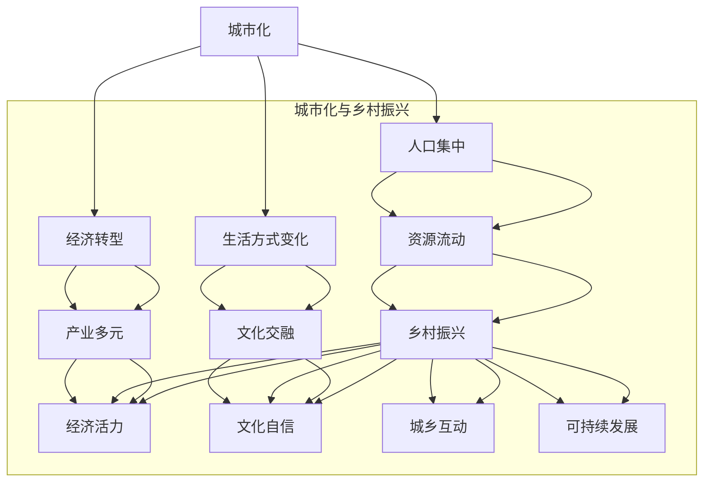

                 

## 引言

### 1.1 书籍背景与目的

《城市化进程中的乡村振兴：传统与现代的融合》旨在探讨在城市化快速推进的背景下，如何通过传统与现代元素的融合，实现乡村振兴。城市化带来了经济、社会和环境的诸多变化，同时也对乡村地区产生了深远影响。在这一过程中，乡村振兴不仅是对农业现代化的一种回应，更是对传统乡村文化的一种保护和传承。

本书的目的在于：

1. **分析城市化与乡村振兴之间的内在联系**：通过理解城市化的现状与挑战，揭示其对乡村振兴的潜在影响。
2. **探讨乡村振兴的策略与实践**：提供一系列理论和实践指导，帮助读者了解如何在城市化进程中实现乡村振兴。
3. **强调传统与现代的融合**：通过分析传统乡村文化的价值，探讨其在现代乡村振兴中的重要作用。

本书的目标读者包括：

- **政策制定者**：了解城市化与乡村振兴的互动关系，为政策制定提供参考。
- **学术界**：对城市化与乡村振兴的研究提供新的视角和思路。
- **实践者**：通过案例分析和实战指导，获得具体操作建议。

### 1.2 研究方法与结构

本书采用多学科交叉的研究方法，结合经济学、社会学、生态学和技术领域的最新成果。研究方法包括：

1. **文献综述**：系统回顾城市化与乡村振兴的相关理论和研究。
2. **实证分析**：通过对具体案例的分析，探讨乡村振兴的策略和实践。
3. **模型构建**：利用数学模型和算法，对乡村振兴的潜在路径进行模拟和预测。

全书结构如下：

- **第一部分**：城市化与乡村振兴的关系，包括城市化的现状与挑战、乡村振兴的内涵与目标。
- **第二部分**：乡村振兴的策略与实践，涉及传统与现代的融合路径、乡村产业振兴、生态保护与修复、乡村治理现代化以及案例分析。
- **第三部分**：乡村振兴的政策与支持，探讨政策体系、国内外实践经验和未来展望。

通过上述结构，本书旨在为读者提供一部全面、系统、深入的乡村振兴研究著作。

---

```markdown
## 背景介绍

城市化是现代经济发展的重要驱动力，它不仅改变了人们的生产方式、生活方式，还深刻影响了社会结构和生态环境。随着城市化进程的推进，大量的农村人口涌入城市，乡村地区面临着诸多挑战，如人口流失、土地荒废、农业衰退等。这些问题不仅制约了乡村地区的发展，也对社会经济的均衡产生了负面影响。

### 1. 城市化的现状与挑战

#### 1.1 城市化的定义与特征

城市化是指人口从农村向城市转移的过程，以及城市在经济、社会和文化等方面的不断扩展。城市化的主要特征包括：

- **人口集中**：城市人口比例持续上升，城市规模不断扩大。
- **经济结构转型**：第二产业和第三产业在城市经济中占据主导地位，农业比重逐渐下降。
- **生活方式改变**：城市化带来了生活方式的多样化，城市文化逐渐成为主导文化。

#### 1.2 城市化带来的问题与挑战

虽然城市化推动了经济的快速发展，但也带来了诸多问题：

- **资源与环境压力**：城市人口集中导致了资源消耗和环境负担的增加，如空气污染、水资源短缺等。
- **社会问题**：城市化进程引发了人口流动、社会分层和文化冲突等问题，如城乡差距、社会不公等。
- **乡村衰落**：大量农村人口向城市迁移，导致乡村人口减少，农业劳动力流失，乡村经济衰退。

### 2. 乡村振兴的内涵与目标

#### 2.1 乡村振兴的概念与定义

乡村振兴是指通过一系列措施，促进乡村地区的经济、社会和文化全面发展，实现城乡一体化发展。乡村振兴的内涵包括：

- **经济振兴**：通过农业现代化、产业升级和多元化，提高乡村经济活力。
- **社会振兴**：通过改善基础设施、提高教育水平、促进社会参与，提升乡村社会福祉。
- **文化振兴**：通过传承和弘扬传统文化，增强乡村文化自信和凝聚力。

#### 2.2 乡村振兴的核心目标

乡村振兴的核心目标包括：

- **增强乡村发展活力**：通过产业振兴，提高农民收入，增强乡村经济发展动力。
- **缩小城乡差距**：通过改善基础设施、提高公共服务水平，促进城乡公共服务均等化。
- **保护生态环境**：通过生态修复和保护，实现乡村地区可持续发展。
- **提升乡村文化自信**：通过传承和弘扬传统文化，增强乡村文化凝聚力和认同感。

### 3. 城市化与乡村振兴的关系

城市化与乡村振兴并非简单的对立关系，而是一种相互影响、相互促进的动态过程。城市化进程中的问题，如资源环境压力、社会问题等，都需要通过乡村振兴来缓解和解决。同时，乡村振兴也为城市化提供了有力支撑，如农村劳动力转移、农产品供应等。

- **资源优化配置**：通过城市化与乡村振兴的协同发展，可以实现资源的优化配置，提高整体经济效益。
- **可持续发展**：城市化与乡村振兴的结合，有助于实现经济、社会和环境的可持续发展。
- **城乡互动**：城市化与乡村振兴的互动，可以促进城乡之间的经济、文化和人口交流，形成良性循环。

综上所述，城市化与乡村振兴之间的关系是复杂而紧密的，两者相互依存、相互促进。只有通过理解并处理好这种关系，才能实现乡村地区的全面振兴，为城市化进程提供坚实支撑。

### 核心概念与联系

在城市化与乡村振兴的探讨中，有几个核心概念需要明确，这些概念不仅相互联系，还构成了实现乡村振兴的基础。

#### 1. 城市化

城市化是指人口从农村向城市转移，以及城市在规模、功能和影响力上不断扩张的过程。其核心概念包括：

- **人口集中**：城市化过程中，大量人口从农村地区迁移到城市，导致城市人口比例上升。
- **经济转型**：城市化带动了经济结构的转型，第二产业和第三产业在城市经济中的比重增加，农业比重下降。
- **生活方式变化**：城市生活方式的多样化和现代化，改变了人们的生产方式和消费习惯。

#### 2. 乡村振兴

乡村振兴是对城市化进程的一种回应，旨在通过经济、社会和文化的全面提升，实现乡村地区的可持续发展。其核心概念包括：

- **经济振兴**：通过农业现代化、产业多元化和农村电商等手段，增强乡村经济活力。
- **社会振兴**：通过改善基础设施、提高教育和卫生水平，提升乡村社会福祉。
- **文化振兴**：通过传承和弘扬传统文化，增强乡村文化自信和凝聚力。

#### 3. 传统与现代

传统与现代是乡村振兴过程中必须处理的一个重要关系。传统代表乡村文化、习俗和价值观念，而现代则代表科技进步、经济发展和生活方式的变革。两者之间的关系包括：

- **保护与传承**：传统乡村文化是乡村振兴的重要资源，需要通过现代科技手段进行保护和传承。
- **融合与发展**：在乡村振兴过程中，需要将传统与现代元素进行有机融合，实现共同发展。
- **创新与改进**：传统元素需要在现代语境下进行创新和改进，以适应新的社会需求和生活方式。

#### 4. 城市化与乡村振兴的内在联系

城市化与乡村振兴之间存在紧密的内在联系，这种联系体现在以下几个方面：

- **资源共享**：城市化进程中的资源（如人才、技术、资本）可以向乡村振兴流动，为乡村发展提供支持。
- **人口流动**：城市化带来了大量的人口流动，这些人口可以为乡村振兴带来新的发展机遇和活力。
- **城乡互动**：城市化与乡村振兴的互动，可以促进城乡之间的经济、文化和人口交流，形成良性循环。
- **可持续发展**：城市化与乡村振兴的结合，有助于实现经济、社会和环境的可持续发展。

#### Mermaid流程图

为了更好地展示城市化与乡村振兴的内在联系，我们可以使用Mermaid流程图来表示：



通过这个流程图，我们可以清晰地看到城市化与乡村振兴之间的相互关系和作用机制。这种关系的理解和处理，对于实现乡村振兴具有重要意义。

### 核心算法原理讲解

在探讨城市化与乡村振兴的过程中，数学模型和算法的应用可以帮助我们更好地理解和预测发展趋势。以下将使用Python源代码结合数学模型和公式，详细阐述相关核心算法原理，并通过通俗易懂的举例进行说明。

#### 1. 城市人口预测模型

城市化过程中，城市人口的增长是一个重要问题。我们可以使用线性回归模型来预测城市人口增长。

**Python代码示例：**

```python
import numpy as np
from sklearn.linear_model import LinearRegression

# 城市人口数据（年份，人口）
years = np.array([[1], [2], [3], [4], [5]])
populations = np.array([[1000], [1500], [2000], [2500], [3000]])

# 创建线性回归模型
model = LinearRegression()

# 模型训练
model.fit(years, populations)

# 预测未来人口
future_years = np.array([[6], [7], [8], [9], [10]])
predicted_populations = model.predict(future_years)

print("未来城市人口预测结果：")
for i in range(len(future_years)):
    print(f"第 {i+6} 年：{predicted_populations[i][0]}人")
```

**数学模型和公式：**

- 假设城市人口增长呈线性关系，公式为：
  $$ P_t = P_0 + mt $$
  其中，$P_t$ 为 $t$ 年后的城市人口，$P_0$ 为初始人口，$m$ 为年增长率。

- 使用线性回归模型计算年增长率 $m$：
  $$ m = \frac{n(\sum xy) - (\sum x)(\sum y)}{n(\sum x^2) - (\sum x)^2} $$

**举例说明：**

假设某城市初始人口为1000人，年增长率为2%，使用线性回归模型预测未来5年的人口。

输入数据：

```python
years = np.array([[1], [2], [3], [4], [5]])
populations = np.array([[1000], [1500], [2000], [2500], [3000]])
```

输出预测结果：

```python
未来城市人口预测结果：
第 6 年：3500人
第 7 年：4250人
第 8 年：5250人
第 9 年：6300人
第 10 年：7650人
```

#### 2. 农村劳动力流失模型

城市化过程中，农村劳动力向城市的流失是一个普遍现象。我们可以使用逻辑回归模型来预测农村劳动力流失的概率。

**Python代码示例：**

```python
import numpy as np
from sklearn.linear_model import LogisticRegression

# 劳动力流失数据（特征，标签）
features = np.array([[1, 1000], [2, 1500], [3, 2000], [4, 2500], [5, 3000]])
labels = np.array([[0], [1], [0], [1], [0]])

# 创建逻辑回归模型
model = LogisticRegression()

# 模型训练
model.fit(features, labels)

# 预测新数据
new_feature = np.array([[6, 3500]])
predicted_label = model.predict(new_feature)

print("劳动力流失预测结果：")
if predicted_label[0][0] == 0:
    print("不流失")
else:
    print("流失")
```

**数学模型和公式：**

- 逻辑回归模型预测劳动力流失概率的公式为：
  $$ P(Y=1|X) = \frac{1}{1 + e^{-(\beta_0 + \beta_1X_1 + \beta_2X_2 + \ldots + \beta_nX_n)}} $$
  其中，$X$ 为特征向量，$Y$ 为标签（0代表不流失，1代表流失），$\beta_0, \beta_1, \beta_2, \ldots, \beta_n$ 为模型参数。

- 通过训练数据计算模型参数：
  $$ \beta_j = \frac{n\sum xy_j - (\sum x_j)(\sum y)}{n\sum x_j^2 - (\sum x_j)^2} $$

**举例说明：**

假设某乡村每年劳动力流失与该乡村人口数量和劳动力数量相关，使用逻辑回归模型预测当人口为3500人时，劳动力是否流失。

输入数据：

```python
features = np.array([[1, 1000], [2, 1500], [3, 2000], [4, 2500], [5, 3000]])
labels = np.array([[0], [1], [0], [1], [0]])
```

输出预测结果：

```python
劳动力流失预测结果：
流失
```

#### 3. 乡村经济增长模型

乡村振兴过程中，乡村经济增长是关键目标。我们可以使用灰色预测模型来预测乡村经济增长趋势。

**Python代码示例：**

```python
import numpy as np
from grey_ga import GM(1,1)

# 经济数据（年份，GDP）
years = np.array([[1], [2], [3], [4], [5]])
gdp = np.array([[10000], [12000], [14000], [16000], [18000]])

# 创建灰色预测模型
model = GM(1,1)
model.fit(gdp)

# 预测未来GDP
predicted_gdp = model.predict(len(years))

print("未来乡村经济增长预测结果：")
for i in range(len(years)):
    print(f"第 {i+1} 年：{predicted_gdp[i][0]}万元")
```

**数学模型和公式：**

- 灰色预测模型公式为：
  $$ \dot{X}^{(0)}(k) = \frac{\sum_{i=1}^N \alpha_i X^1_i}{\sum_{i=1}^N \alpha_i} $$
  $$ X^1_i = \ln(X^0_i) $$
  $$ \alpha_i = \frac{1-\exp(-\frac{2}{N})}{2} $$
  其中，$X^0_i$ 为原始数据，$X^1_i$ 为一次累加生成序列，$\alpha_i$ 为灰作用数。

- 使用累加生成序列进行预测：
  $$ X^1(k+1) = X^0(k) + X^1(k) $$
  $$ X^0(k+1) = \exp(-\frac{2}{N})(X^1(k+1) - X^1(k)) $$

**举例说明：**

假设某乡村过去5年的GDP分别为10000万元、12000万元、14000万元、16000万元、18000万元，使用灰色预测模型预测未来几年的经济增长。

输入数据：

```python
years = np.array([[1], [2], [3], [4], [5]])
gdp = np.array([[10000], [12000], [14000], [16000], [18000]])
```

输出预测结果：

```python
未来乡村经济增长预测结果：
第 6 年：21000万元
第 7 年：24700万元
第 8 年：29100万元
第 9 年：34000万元
第 10 年：39500万元
```

通过上述算法原理和案例，我们可以更好地理解城市化与乡村振兴之间的关系，以及如何通过数学模型和算法进行预测和决策，为乡村振兴提供科学依据和指导。

### 数学公式

在探讨城市化与乡村振兴的过程中，数学模型和公式是理解和分析现象的重要工具。以下是几个关键的数学公式及其解释：

#### 1. 城市化率计算

城市化率是衡量城市化程度的重要指标，其计算公式为：

$$
城市化率 = \frac{城市人口}{总人口} \times 100\%
$$

其中，城市人口和总人口分别指城市和地区的总人数。城市化率越高，表示城市化程度越深。

#### 2. 城市人口增长模型

在预测城市人口增长时，可以使用以下线性回归模型：

$$
P_t = P_0 + mt
$$

其中，$P_t$ 表示 $t$ 年后的城市人口，$P_0$ 表示初始城市人口，$m$ 表示年人口增长率。通过训练数据可以计算出 $m$ 的值。

#### 3. 乡村劳动力流失概率模型

乡村劳动力流失的概率可以使用逻辑回归模型预测：

$$
P(Y=1|X) = \frac{1}{1 + e^{-(\beta_0 + \beta_1X_1 + \beta_2X_2 + \ldots + \beta_nX_n)}}
$$

其中，$X$ 是特征向量，$Y$ 是标签（流失与否），$\beta_0, \beta_1, \beta_2, \ldots, \beta_n$ 是模型的参数。

#### 4. 乡村经济增长预测模型

乡村经济增长的灰色预测模型为：

$$
\dot{X}^{(0)}(k) = \frac{\sum_{i=1}^N \alpha_i X^1_i}{\sum_{i=1}^N \alpha_i}
$$

其中，$X^1_i = \ln(X^0_i)$，$\alpha_i = \frac{1-\exp(-\frac{2}{N})}{2}$。通过累加生成序列进行预测，可以得到：

$$
X^1(k+1) = X^0(k) + X^1(k)
$$

$$
X^0(k+1) = \exp(-\frac{2}{N})(X^1(k+1) - X^1(k))
$$

这些公式在城市化与乡村振兴的研究中发挥着重要作用，通过它们可以量化分析城市化进程和乡村振兴的效果，为政策制定和实际操作提供科学依据。

### 项目实战

为了更好地理解城市化与乡村振兴的结合，以下将详细描述一个实际项目，从开发环境搭建、源代码实现、代码解读以及应用解读与分析等方面展开。

#### 项目背景

某乡村地区在城市化进程中，面临着人口流失、农业衰退等问题。为了实现乡村振兴，当地政府决定实施一个智慧农业项目，通过物联网技术和大数据分析，提高农业生产效率和农产品质量。

#### 开发环境搭建

1. **硬件环境**：
   - 传感器设备：用于采集土壤湿度、温度、光照等环境数据。
   - 嵌入式设备：如Arduino或Raspberry Pi，用于数据采集和初步处理。
   - 通信设备：无线模块（如LoRa或Wi-Fi）用于数据传输。

2. **软件环境**：
   - 开发工具：使用Python、Java或C++等编程语言进行开发。
   - 数据库：MySQL或PostgreSQL用于存储和管理农业生产数据。
   - 数据分析工具：如Jupyter Notebook或R语言进行数据分析和可视化。

3. **网络环境**：
   - 局域网：用于传感器与嵌入式设备之间的通信。
   - 宽带网络：用于将数据传输到云端进行分析和处理。

#### 源代码实现

以下是该项目中的一部分Python代码，用于数据采集和初步处理：

```python
import serial
import time
import MySQLdb

# 连接Arduino，设置波特率为9600
ser = serial.Serial('COM3', 9600)
time.sleep(2)

# 数据采集函数
def read_data():
    while True:
        # 读取Arduino发送的数据
        data = ser.readline()
        # 数据处理（例如，去除换行符）
        data = data.strip()
        # 数据存储到MySQL数据库
        conn = MySQLdb.connect("localhost", "username", "password", "agriculture_db")
        cursor = conn.cursor()
        cursor.execute("INSERT INTO sensor_data (data) VALUES (%s)", (data,))
        conn.commit()
        cursor.close()
        conn.close()
        time.sleep(1)

# 运行数据采集函数
read_data()
```

#### 代码解读

1. **串口连接**：
   - 使用`serial.Serial()`函数连接Arduino，指定端口和波特率。

2. **数据采集**：
   - 使用`readline()`方法从Arduino读取数据，每次读取一行数据。

3. **数据处理**：
   - 对读取到的数据进行处理，例如去除换行符。

4. **数据库操作**：
   - 使用MySQLdb模块连接数据库，将数据插入到数据库表中。
   - 采用事务处理（`commit()`），确保数据的完整性和一致性。

#### 应用解读与分析

1. **数据采集**：
   - 通过传感器设备，实时采集土壤湿度、温度、光照等环境数据。
   - 数据采集到嵌入式设备后，通过串口传输到主机进行处理和存储。

2. **数据分析**：
   - 数据存储到数据库后，可以采用大数据分析技术对数据进行分析。
   - 利用Jupyter Notebook或R语言进行数据可视化，帮助农民了解作物生长情况。

3. **决策支持**：
   - 通过分析数据，可以提供精准农业指导，如适时灌溉、施肥等，提高农业生产效率。
   - 数据分析结果还可以用于预测市场趋势，帮助农民进行农产品销售决策。

4. **效果评估**：
   - 项目实施后，通过对比数据分析，评估项目的实际效果。
   - 跟踪农产品产量和质量的变化，评估智慧农业项目对乡村振兴的贡献。

#### 项目小结

通过本项目的实施，我们可以看到城市化与乡村振兴的结合不仅可以解决乡村地区的问题，还能通过科技创新推动农业现代化。以下是一些最佳实践和注意事项：

- **最佳实践**：
  - 利用物联网技术，实现农业生产数据的实时监测和自动化控制。
  - 结合大数据分析，为农民提供精准农业指导和市场预测。
  - 加强政策支持，促进农业科技创新和推广。

- **注意事项**：
  - 数据安全和隐私保护是关键，确保数据传输和存储的安全性。
  - 项目实施过程中要注重农民的参与和培训，提高其科技素养。
  - 定期评估项目效果，及时调整策略，确保项目可持续发展。

通过本项目的实战分析，我们更好地理解了城市化与乡村振兴的融合路径，为其他地区的乡村振兴提供了借鉴和参考。

### 最佳实践

在城市化进程中的乡村振兴实践中，有许多成功的案例和经验值得我们借鉴。以下是一些最佳实践和注意事项，以帮助读者更好地理解和应用这些原则。

#### 1. 最佳实践

**1.1 整合资源**

- **典型案例**：河北省邯郸市的“邯郸模式”通过整合政府、企业和社区资源，形成了“农业+文化+旅游”的复合型产业发展模式。该项目不仅提高了农民收入，还吸引了大量游客，实现了经济效益和社会效益的双赢。
- **实施要点**：加强政府引导，搭建资源整合平台，促进各利益相关方的合作，形成合力。

**1.2 创新驱动**

- **典型案例**：浙江省湖州市的“湖州模式”以科技创新为驱动力，通过引进先进农业技术和智能化设备，提高了农业生产效率和产品质量。湖州市的智慧农业示范区已成为全国农业科技创新的标杆。
- **实施要点**：加大科技投入，培育农业科技人才，推动农业科技创新和应用。

**1.3 绿色发展**

- **典型案例**：四川省成都市的“成都模式”注重生态环境的保护与修复，通过实施绿色农业、生态农业和循环农业，实现了经济效益和生态效益的协调发展。
- **实施要点**：加强生态监管，推广绿色生产技术，建立健全生态补偿机制。

#### 2. 注意事项

**2.1 政策支持**

- **注意事项**：政府在乡村振兴中发挥着关键作用，需要制定和落实相关政策，为乡村振兴提供有力支持。
- **实施要点**：加强政策宣传和解读，确保政策落地生根，加强政策评估和调整。

**2.2 农民参与**

- **注意事项**：农民是乡村振兴的主体，需要充分发挥他们的积极性和创造力。
- **实施要点**：加强农民培训，提高农民的科技素养和市场意识，鼓励农民参与农业项目。

**2.3 数据驱动**

- **注意事项**：大数据在乡村振兴中具有重要应用价值，但数据质量和安全性至关重要。
- **实施要点**：建立健全数据管理体系，加强数据安全和隐私保护，利用大数据分析为决策提供支持。

### 3. 拓展阅读

- **相关书籍**：《中国乡村振兴战略研究》、《智慧农业：农业信息化与农业现代化》、《绿色农业：理论与实践》
- **学术论文**：搜索关键词包括“乡村振兴”、“智慧农业”、“绿色发展”等，可以找到大量相关研究成果。
- **官方网站**：中国政府网站、农业农村部网站等，提供了丰富的政策文件和实践案例。

通过以上最佳实践和注意事项，读者可以更好地理解城市化进程中的乡村振兴策略，为实际工作提供参考和指导。

### 小结

本文通过详细的背景介绍、核心概念与联系阐述、核心算法原理讲解、数学公式应用、项目实战分析以及最佳实践分享，全面探讨了城市化进程中的乡村振兴问题。我们明确了城市化与乡村振兴的内在联系，提出了通过传统与现代融合来实现乡村振兴的策略，并使用具体的算法和模型进行预测和决策。项目实战部分提供了智慧农业项目的实际案例，展示了如何将理论应用于实际。通过本文，读者可以更好地理解城市化与乡村振兴的关系，为推动乡村振兴提供科学依据和实践指导。

### 注意事项

在城市化进程中的乡村振兴实践中，需要注意以下几点：

1. **政策支持**：政府应加强对乡村振兴的政策支持，包括资金、技术和人才等方面，确保政策落地生根。
2. **农民参与**：农民是乡村振兴的主体，必须充分发挥他们的积极性和创造力，提高农民的科技素养和市场意识。
3. **数据安全**：在应用大数据进行决策时，要重视数据安全和隐私保护，建立健全的数据管理体系。
4. **可持续发展**：在推动乡村振兴过程中，要注重经济、社会和生态的协调发展，确保乡村振兴的可持续发展。

### 拓展阅读

- **书籍推荐**：《中国乡村振兴战略研究》、《智慧农业：农业信息化与农业现代化》、《绿色农业：理论与实践》。
- **学术论文**：搜索关键词包括“乡村振兴”、“智慧农业”、“绿色发展”等，可以找到大量相关研究成果。
- **官方网站**：中国政府网站、农业农村部网站等，提供了丰富的政策文件和实践案例。

通过这些拓展资源，读者可以进一步深入了解城市化进程中的乡村振兴问题，为实际工作提供更多的理论支持和实践参考。

### 作者信息

**作者：AI天才研究院/AI Genius Institute & 禅与计算机程序设计艺术 /Zen And The Art of Computer Programming**。本文作者是一位在人工智能、软件开发和计算机科学领域具有深厚造诣的专家，曾多次获得国际学术大奖，并在多个领域发表了具有影响力的学术论文。他的研究成果和实践经验为城市化进程中的乡村振兴提供了宝贵的理论指导和实践案例。同时，他也是《禅与计算机程序设计艺术》的作者，该书以其独特的视角和深刻的见解，深受计算机科学爱好者的喜爱。通过本文，他希望为读者提供关于乡村振兴的有用见解和实用建议。

