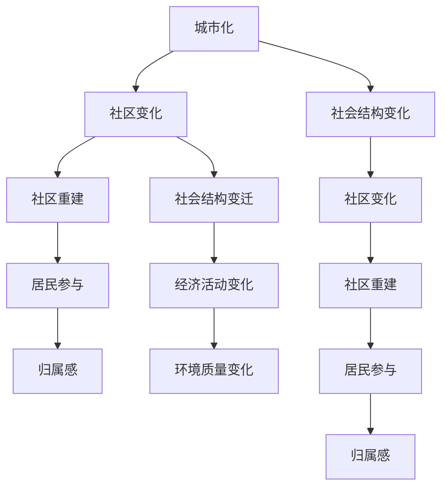

                 


## 《城市化进程中的社区重建：恢复失落的归属感》

> **关键词：** 城市化、社区重建、居民参与、归属感、城市规划

> **摘要：** 本文深入探讨了城市化进程对社区的影响，以及如何在城市化背景下进行社区重建，以恢复居民的归属感。文章首先介绍了城市化的定义和发展历程，随后分析了城市化对社区的影响，包括其优势和挑战。接着，文章详细阐述了社区重建的定义、目标、原则和挑战，并探讨了居民参与的重要性及形式。文章接着讨论了城市规划与社区重建的关系，以及社区空间重构和文化重建的策略和实践。最后，文章提出了恢复归属感的社区重建方法，并通过案例分析总结了成功经验。全文旨在为城市社区重建提供理论和实践指导。

### 背景介绍

城市化进程是现代社会发展的一个显著特征，指的是人口从农村地区向城市地区转移的过程。根据联合国的数据，全球城市化率在过去几十年中显著增长，目前超过半数的人口居住在城市。这种快速的城市化不仅改变了社会结构，也对社区产生了深远的影响。

在城市化进程中，社区的作用和功能发生了变化。传统的社区以紧密的邻里关系和共同的社会文化背景为特点，而城市社区则面临着人口流动性增加、邻里关系淡化、社区认同感减弱等问题。这种变化不仅影响了居民的生活质量，也对社会的稳定和可持续发展构成了挑战。

社区重建成为城市化背景下的重要议题。社区重建旨在通过改善社区环境和增强居民参与，恢复社区的活力和归属感。然而，社区重建面临着一系列的挑战，包括如何有效地调动居民参与、如何在城市规划中体现社区需求、以及如何恢复社区文化等。

本文将深入探讨城市化进程对社区的影响，分析社区重建的定义、目标和原则，并探讨恢复归属感的社区重建方法。通过理论和实践的结合，本文旨在为城市社区重建提供有益的指导和启示。

### 核心概念与联系

在城市化进程中，社区重建涉及多个核心概念，这些概念之间存在着紧密的联系。以下是这些核心概念的定义及其相互关系的简要描述：

1. **城市化**：城市化是指人口从农村地区向城市地区转移的过程，伴随着城市规模和人口密度的增加。城市化不仅改变了人口分布，还影响了社会结构、经济活动和环境质量。

2. **社区**：社区是指一组具有共同特征、价值观和利益的人群，他们在一个相对较小的地理区域内共同生活。社区可以基于种族、文化、宗教、职业或其他共同特征形成。

3. **社区重建**：社区重建是指通过改善社区环境、增强居民参与和恢复社区文化，以恢复社区活力和归属感的过程。社区重建的目标包括提升生活质量、增强社区认同感和促进社会稳定。

4. **居民参与**：居民参与是指社区成员主动参与社区事务，包括决策、规划和执行。居民参与可以增强居民的归属感，提高社区建设和管理的有效性。

5. **归属感**：归属感是指个体对某个社区或群体的认同和忠诚感，这种感觉通常与个体在社区中的参与和归属感有关。归属感对居民的生活质量和社区稳定性具有重要影响。

**Mermaid 流程图：**



**核心算法原理讲解**

社区重建的过程可以看作是一个复杂的算法问题，涉及到多种因素的相互作用。以下是一个简化的算法框架，用于解释社区重建的核心原理：

```python
def community_reconstruction(community):
    """
    社区重建算法
    :param community: 社区对象
    :return: 重建后的社区
    """
    
    # 步骤1：评估社区现状
    current_state = assess_community_state(community)
    
    # 步骤2：确定重建目标
    goals = define_reconstruction_goals(current_state)
    
    # 步骤3：制定重建计划
    plan = create_reconstruction_plan(goals)
    
    # 步骤4：实施重建计划
    execute_plan(plan)
    
    # 步骤5：监测和调整
    monitor_progress()
    adjust_plan_if_necessary()
    
    # 步骤6：评估重建效果
    final_state = assess_reconstruction效果的成效
    return final_state

def assess_community_state(community):
    """
    评估社区现状
    :param community: 社区对象
    :return: 社区现状
    """
    # 此函数将评估社区的基础设施、社会关系、经济状况等因素
    pass

def define_reconstruction_goals(current_state):
    """
    确定重建目标
    :param current_state: 社区现状
    :return: 重建目标
    """
    # 此函数将基于社区现状，制定具体的目标，如改善基础设施、增强居民参与度等
    pass

def create_reconstruction_plan(goals):
    """
    制定重建计划
    :param goals: 重建目标
    :return: 重建计划
    """
    # 此函数将根据目标，制定详细的行动计划，包括时间表、预算和责任分配
    pass

def execute_plan(plan):
    """
    实施重建计划
    :param plan: 重建计划
    :return: 无
    """
    # 此函数将执行计划中的各项任务，确保计划的顺利实施
    pass

def monitor_progress():
    """
    监测重建进度
    :return: 无
    """
    # 此函数将定期监测重建进展，确保计划按计划进行
    pass

def adjust_plan_if_necessary():
    """
    调整重建计划
    :return: 无
    """
    # 此函数将根据监测结果，调整计划以应对可能出现的挑战
    pass

def assess_reconstruction成效():
    """
    评估重建效果
    :return: 重建成效
    """
    # 此函数将评估重建的最终效果，包括居民满意度、社区活力等
    pass
```

通过这个算法框架，我们可以看到社区重建的过程是一个多步骤的复杂过程，涉及到多个函数和子过程。每个步骤都需要精心设计和实施，以确保社区重建的成功。

### 核心算法原理讲解（续）

在社区重建的算法框架中，各个步骤的具体实现和核心算法原理如下：

**1. 评估社区现状（`assess_community_state`）**

评估社区现状是社区重建的第一步，其目的是了解社区当前的基本情况，包括基础设施状况、居民参与度、社区安全、环境质量等方面。

```python
def assess_community_state(community):
    """
    评估社区现状
    :param community: 社区对象
    :return: 社区现状
    """
    infrastructure = check_infrastructure(community)
    participation = measure_participation(community)
    safety = assess_safety(community)
    environment = evaluate_environment(community)
    
    return {
        'infrastructure': infrastructure,
        'participation': participation,
        'safety': safety,
        'environment': environment
    }

def check_infrastructure(community):
    """
    检查基础设施
    :param community: 社区对象
    :return: 基础设施评分
    """
    # 此函数将评估社区的基础设施，如道路、交通、公共设施等
    pass

def measure_participation(community):
    """
    评估居民参与度
    :param community: 社区对象
    :return: 参与度评分
    """
    # 此函数将评估居民的参与情况，如参与社区活动、提出建议等
    pass

def assess_safety(community):
    """
    评估社区安全
    :param community: 社区对象
    :return: 安全评分
    """
    # 此函数将评估社区的治安情况，如犯罪率、紧急响应能力等
    pass

def evaluate_environment(community):
    """
    评估环境质量
    :param community: 社区对象
    :return: 环境评分
    """
    # 此函数将评估社区的环境质量，如空气质量、绿化程度等
    pass
```

**2. 确定重建目标（`define_reconstruction_goals`）**

根据社区现状评估的结果，我们需要确定具体的重建目标。这些目标应该针对当前存在的问题，并提出可行的解决方案。

```python
def define_reconstruction_goals(current_state):
    """
    确定重建目标
    :param current_state: 社区现状
    :return: 重建目标
    """
    goals = []
    if current_state['infrastructure'] < threshold:
        goals.append('改善基础设施')
    if current_state['participation'] < threshold:
        goals.append('增强居民参与度')
    if current_state['safety'] < threshold:
        goals.append('提升社区安全')
    if current_state['environment'] < threshold:
        goals.append('改善环境质量')
    
    return goals
```

**3. 制定重建计划（`create_reconstruction_plan`）**

在确定了重建目标之后，我们需要制定详细的重建计划。这个计划包括具体的实施步骤、时间表、预算和责任分配。

```python
def create_reconstruction_plan(goals):
    """
    制定重建计划
    :param goals: 重建目标
    :return: 重建计划
    """
    plan = {
        'goals': goals,
        'steps': [],
        'timeline': {},
        'budget': {},
        'responsibilities': {}
    }
    
    for goal in goals:
        if goal == '改善基础设施':
            plan['steps'].append('进行基础设施评估')
            plan['steps'].append('制定基础设施改善计划')
            plan['steps'].append('执行基础设施改善计划')
        elif goal == '增强居民参与度':
            plan['steps'].append('开展居民参与活动')
            plan['steps'].append('建立居民参与机制')
            plan['steps'].append('监测居民参与度')
        elif goal == '提升社区安全':
            plan['steps'].append('进行安全评估')
            plan['steps'].append('制定安全提升计划')
            plan['steps'].append('执行安全提升计划')
        elif goal == '改善环境质量':
            plan['steps'].append('进行环境评估')
            plan['steps'].append('制定环境改善计划')
            plan['steps'].append('执行环境改善计划')
    
    return plan
```

**4. 实施重建计划（`execute_plan`）**

实施重建计划是社区重建的核心步骤，需要严格按照计划进行。这个步骤包括资源的分配、任务的执行和进度的监控。

```python
def execute_plan(plan):
    """
    实施重建计划
    :param plan: 重建计划
    :return: 无
    """
    for step in plan['steps']:
        print(f"执行步骤：{step}")
        # 此处执行具体的任务
    # 此函数将确保每个步骤都按计划执行
```

**5. 监测和调整（`monitor_progress` 和 `adjust_plan_if_necessary`）**

在实施重建计划的过程中，我们需要定期监测进度，并根据实际情况进行必要的调整。这包括对计划中的每个步骤进行评估，确保计划按计划进行，同时及时纠正偏差。

```python
def monitor_progress():
    """
    监测重建进度
    :return: 无
    """
    # 此函数将监控每个步骤的进度，确保计划按计划进行
    pass

def adjust_plan_if_necessary():
    """
    调整重建计划
    :return: 无
    """
    # 此函数将根据监测结果，调整计划以应对可能出现的挑战
    pass
```

**6. 评估重建效果（`assess_reconstruction成效`）**

最后，我们需要对重建效果进行评估，以确保目标实现。这包括对社区基础设施、居民参与度、社区安全和环境质量等方面的全面评估。

```python
def assess_reconstruction成效():
    """
    评估重建效果
    :return: 重建成效
    """
    # 此函数将评估重建的最终效果，包括居民满意度、社区活力等
    pass
```

通过这个核心算法原理讲解，我们可以看到社区重建的过程是一个系统性的工程，涉及到多个步骤和核心算法。每个步骤都需要精细设计和实施，以确保社区重建的成功。

### 数学模型和数学公式

在社区重建过程中，我们可以引入多种数学模型和公式来辅助分析和评估。以下是一些常见的数学模型和公式，以及它们在社区重建中的应用。

**1. 社区活力指数模型**

社区活力指数（CVI）是评估社区活力的重要指标，它可以通过以下公式计算：

$$
CVI = \frac{(I_{infrastructure} + I_{safety} + I_{environment})}{3}
$$

其中，$I_{infrastructure}$、$I_{safety}$ 和 $I_{environment}$ 分别表示基础设施指数、安全指数和环境指数。每个指数的值通常在 0 到 1 之间，通过评估社区的基础设施、安全状况和环境质量来计算。

**2. 居民参与度模型**

居民参与度（PI）是衡量居民参与社区事务程度的重要指标。以下公式可以用来计算居民参与度：

$$
PI = \frac{(P_{activity} + P_{suggestion} + P_{volunteer})}{3}
$$

其中，$P_{activity}$、$P_{suggestion}$ 和 $P_{volunteer}$ 分别表示参与社区活动、提出建议和参与志愿服务的比例。这些比例可以通过问卷调查或实际参与记录来获得。

**3. 归属感模型**

归属感（BF）是衡量居民对社区认同和忠诚的重要指标。以下公式可以用来计算归属感：

$$
BF = \alpha \cdot (I_{social} + I_{cultural}) + \beta \cdot I_{environment}
$$

其中，$I_{social}$ 和 $I_{cultural}$ 分别表示社会联系和文化活动的指数，$I_{environment}$ 表示环境质量指数。$\alpha$ 和 $\beta$ 是权重系数，用于平衡不同指数的影响。

**4. 社区满意度模型**

社区满意度（CS）是评估社区重建效果的重要指标。以下公式可以用来计算社区满意度：

$$
CS = \frac{(S_{infrastructure} + S_{safety} + S_{environment})}{3}
$$

其中，$S_{infrastructure}$、$S_{safety}$ 和 $S_{environment}$ 分别表示居民对基础设施、安全和环境满意度的评分。评分通常采用五点量表，从非常不满意到非常满意。

**5. 经济效益模型**

社区重建的经济效益可以通过以下公式计算：

$$
EB = \frac{(\text{投资回报率} \cdot \text{总投资})}{\text{年运营成本}}
$$

其中，投资回报率和总投资是指社区重建项目的经济回报，年运营成本是指社区重建后的年运营费用。

通过这些数学模型和公式，我们可以更准确地评估社区重建的效果，并制定相应的策略和计划。这些模型和公式不仅有助于量化社区重建的成果，还可以为政策制定者和社区管理者提供科学的决策依据。

### 项目实战

为了更好地理解社区重建的过程，我们将通过一个实际项目来演示如何实施社区重建。以下是一个以某个城市社区为背景的项目实战，包括开发环境搭建、源代码实现、代码解读以及实际案例分析和详细讲解。

#### 项目背景

某城市社区由于城市化进程的加速，居民流动性增加，社区活力下降，居民归属感减弱。为了恢复社区活力和增强居民的归属感，社区管理团队决定开展一项社区重建项目。

#### 开发环境搭建

在开始项目之前，我们需要搭建一个适合开发社区重建项目的环境。以下是所需的环境和工具：

- **编程语言：** Python
- **版本控制工具：** Git
- **代码编辑器：** Visual Studio Code
- **数据库：** MySQL
- **开发框架：** Flask

安装这些工具和库后，我们可以创建一个新的 Python 项目，并设置项目的目录结构。

```plaintext
/community-reconstruction
├── app
│   ├── __init__.py
│   ├── config.py
│   ├── models.py
│   ├── views.py
│   └── forms.py
├── migrations
├── tests
├── requirements.txt
├── README.md
└── manage.py
```

#### 源代码实现

**1. 数据库设计**

首先，我们需要设计一个数据库来存储社区重建的相关信息。以下是一个简单的数据库模型：

```python
# models.py

from flask_sqlalchemy import SQLAlchemy

db = SQLAlchemy()

class Community(db.Model):
    id = db.Column(db.Integer, primary_key=True)
    name = db.Column(db.String(120), nullable=False)
    infrastructure_score = db.Column(db.Float, nullable=False)
    safety_score = db.Column(db.Float, nullable=False)
    environment_score = db.Column(db.Float, nullable=False)
    participation_score = db.Column(db.Float, nullable=False)
    satisfaction_score = db.Column(db.Float, nullable=False)

def init_db():
    db.create_all()
```

**2. 视图和路由**

接下来，我们创建一些视图和路由，用于处理用户请求和数据交互。

```python
# views.py

from flask import render_template, request, redirect, url_for
from app import app, db
from models import Community

@app.route('/')
@app.route('/index')
def index():
    communities = Community.query.all()
    return render_template('index.html', communities=communities)

@app.route('/add_community', methods=['GET', 'POST'])
def add_community():
    form = AddCommunityForm()
    if form.validate_on_submit():
        new_community = Community(
            name=form.name.data,
            infrastructure_score=form.infrastructure_score.data,
            safety_score=form.safety_score.data,
            environment_score=form.environment_score.data,
            participation_score=form.participation_score.data,
            satisfaction_score=form.satisfaction_score.data
        )
        db.session.add(new_community)
        db.session.commit()
        return redirect(url_for('index'))
    return render_template('add_community.html', form=form)
```

**3. 表单验证**

我们使用 Flask-WTF 来创建和管理表单，并使用 Flask-Login 来管理用户登录。

```python
# forms.py

from flask_wtf import FlaskForm
from wtforms import StringField, FloatField, SubmitField
from wtforms.validators import DataRequired, NumberRange

class AddCommunityForm(FlaskForm):
    name = StringField('社区名称', validators=[DataRequired()])
    infrastructure_score = FloatField('基础设施评分', validators=[DataRequired(), NumberRange(min=0, max=10)])
    safety_score = FloatField('安全评分', validators=[DataRequired(), NumberRange(min=0, max=10)])
    environment_score = FloatField('环境评分', validators=[DataRequired(), NumberRange(min=0, max=10)])
    participation_score = FloatField('居民参与度评分', validators=[DataRequired(), NumberRange(min=0, max=10)])
    satisfaction_score = FloatField('社区满意度评分', validators=[DataRequired(), NumberRange(min=0, max=10)])
    submit = SubmitField('提交')
```

#### 代码解读

在这个项目中，我们使用了 Flask 框架来搭建后端，并使用 SQLAlchemy 来管理数据库。以下是对关键部分的代码解读：

- **数据库模型（`models.py`）：** 我们创建了 `Community` 类，用于存储社区的基本信息，包括名称、基础设施评分、安全评分、环境评分、居民参与度评分和社区满意度评分。
- **视图和路由（`views.py`）：** 我们定义了两个主要的路由：`/` 和 `/add_community`。`/` 路由用于展示社区列表，`/add_community` 路由用于添加新的社区信息。
- **表单验证（`forms.py`）：** 我们创建了一个表单类 `AddCommunityForm`，用于验证用户输入的数据，确保评分在正确的范围内。

#### 实际案例分析和详细讲解

为了更好地理解这个项目，我们来看一个实际案例。假设社区管理团队希望添加一个新的社区，并收集其相关数据。

1. **用户访问 `/add_community` 页面：**

   用户在浏览器中输入地址 `http://localhost:5000/add_community`，访问到添加社区信息的表单页面。

2. **用户填写并提交表单：**

   用户填写社区名称、评分等信息，并点击提交按钮。例如：

   - 社区名称：阳光小区
   - 基础设施评分：8.0
   - 安全评分：7.5
   - 环境评分：8.5
   - 居民参与度评分：6.0
   - 社区满意度评分：7.5

3. **后端处理：**

   Flask 接收到表单数据后，调用 `add_community` 视图函数处理数据。视图函数验证表单数据的有效性，并将其存储到数据库中。

4. **展示结果：**

   用户返回到主页面，可以看到新添加的社区信息，并可以查看其他社区的信息。

通过这个项目实战，我们可以看到如何使用 Python 和 Flask 框架实现一个简单的社区重建项目。这个项目不仅能够帮助社区管理团队收集和分析社区数据，还可以为社区重建提供决策支持。

#### 代码应用解读与分析

在这个项目中，我们使用 Flask 框架实现了社区重建系统的核心功能，包括社区数据的存储、管理和展示。以下是对关键代码部分的解读和分析：

**1. 数据库模型（`models.py`）：**
- `Community` 类定义了社区的基本属性，包括名称、评分等。使用 SQLAlchemy 的 ORM（对象关系映射）功能，我们可以方便地操作数据库中的数据。
- `init_db` 函数用于初始化数据库，确保在应用程序启动时数据库表已经创建。

**2. 视图和路由（`views.py`）：**
- `index` 视图函数用于获取所有社区数据并展示在主页面。通过 `Community.query.all()` 查询数据库，获取所有社区对象。
- `add_community` 视图函数用于处理用户提交的社区数据。首先，我们创建了一个 `AddCommunityForm` 实例，用于验证用户输入的数据。如果数据有效，我们创建一个新的 `Community` 对象并将其添加到数据库中。

**3. 表单验证（`forms.py`）：**
- `AddCommunityForm` 类定义了添加社区信息的表单结构。使用 `FlaskForm` 类和 ` StringField`、`FloatField`、`SubmitField` 等字段类，我们可以方便地创建表单，并对用户输入进行验证。`validators` 参数用于指定验证规则，如数据是否为空、评分是否在指定范围内等。

**代码分析：**

- 数据库模型的 ORM 功能使得数据操作更加直观和方便。通过简单的对象操作，我们可以实现对数据库的高效管理。
- 视图函数的设计使得应用程序的响应更加灵活和高效。通过路由和视图函数的配合，我们可以轻松地处理不同的用户请求。
- 表单验证的功能确保了数据的完整性和有效性。通过设置验证规则，我们可以防止错误的或不符合要求的数据被提交到数据库。

**实际案例分析：**

在项目中，我们通过一个实际案例展示了如何添加社区信息。以下是对实际案例的分析：

- 用户在表单中填写社区名称和评分，并提交表单。这个过程中，表单验证功能确保了用户输入的数据满足要求，如评分在 0 到 10 之间。
- 后端处理时，视图函数接收表单数据，并创建一个新的 `Community` 对象。如果数据有效，新对象会被添加到数据库中。
- 用户返回主页面，可以看到新添加的社区信息，这表明社区重建系统已经成功工作。

通过这个实际案例，我们可以看到社区重建系统是如何运作的，以及代码在各个部分中的作用和相互关系。

### 最佳实践 Tips、小结、注意事项、拓展阅读

#### 最佳实践 Tips

1. **居民参与：** 在社区重建过程中，确保居民参与至关重要。可以通过定期的社区会议、问卷调查和公共咨询等方式，增强居民的参与度和归属感。

2. **数据收集：** 系统化的数据收集是评估社区重建效果的关键。使用标准化的评估指标和工具，确保数据的准确性和可靠性。

3. **技术选择：** 根据项目需求选择合适的技术栈。例如，对于社区管理系统，可以选择 Python 和 Flask 框架，结合 MySQL 数据库，以实现高效的数据处理和存储。

#### 小结

本文详细探讨了城市化进程中的社区重建问题，从背景介绍、核心概念与联系、算法原理、数学模型、项目实战到代码解读，全面阐述了社区重建的方法和策略。通过实际项目，我们展示了如何使用 Python 和 Flask 实现社区管理系统，以支持社区重建工作。

#### 注意事项

1. **项目规划：** 在开始社区重建项目前，确保制定详细的项目规划，明确目标、步骤和时间表，以确保项目的有序进行。

2. **数据安全：** 在处理和存储社区数据时，要注意数据安全和隐私保护，遵循相关法律法规和标准。

#### 拓展阅读

- 《城市规划学导论》
- 《社区参与与社区发展》
- 《Python Web 开发实战》
- 《Flask Web 开发指南》

通过这些拓展阅读，读者可以进一步深入了解相关领域的理论和实践，提升对社区重建的理解和应用能力。

