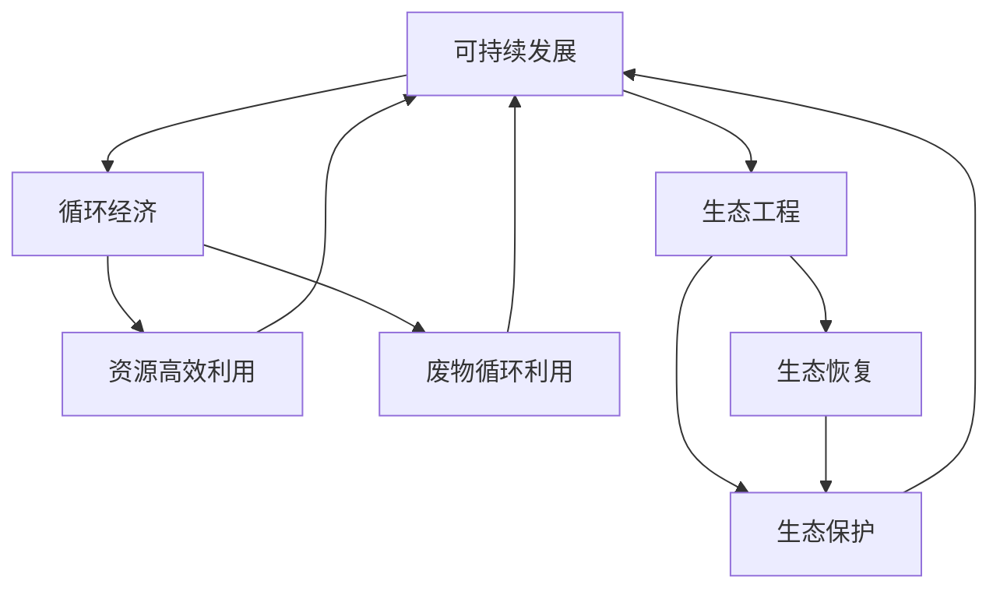

                 

### 引言与背景

城市化进程是人类社会发展的必然趋势，也是现代化进程的重要组成部分。然而，随着城市化进程的加速，资源消耗、环境污染、生态破坏等问题日益严重，给城市可持续发展带来了巨大挑战。在这种背景下，绿色发展逐渐成为城市化进程中解决环境问题、促进可持续发展的有效途径。

**一、城市化进程中的绿色发展概述**

城市化进程中，绿色发展旨在通过优化资源配置、提高生产效率、保护生态环境，实现经济、社会和环境的协调发展。其核心在于：

1. **资源节约**：通过科技创新和管理手段，提高资源利用效率，减少资源浪费。
2. **环境友好**：在城市化进程中，采取环保措施，减少污染排放，改善环境质量。
3. **生态保护**：保护和恢复自然生态系统，维护生态平衡，增强城市生态承载能力。

**二、生态文明建设的新模式**

生态文明建设的新模式是在可持续发展理念指导下，通过制度创新、技术创新、文化创新等手段，构建起经济、社会、环境相互促进、协调发展的新型发展模式。其主要特点包括：

1. **制度创新**：建立健全绿色发展政策体系，完善环境法律法规，强化环境保护制度。
2. **技术创新**：推动绿色技术和清洁生产技术的发展，提升城市环境治理能力。
3. **文化创新**：培育绿色文化，提高公众环保意识和参与度，形成全社会共同参与绿色发展的良好氛围。

**三、绿色发展的关键因素**

绿色发展是一个系统工程，涉及多个方面，关键因素包括：

1. **经济因素**：经济发展是绿色发展的基础，必须实现经济与环境的双赢。
2. **社会因素**：公众的环保意识和参与度对绿色发展至关重要。
3. **环境因素**：生态环境是城市可持续发展的关键，必须加强生态保护与修复。

**四、绿色发展的现状与趋势**

当前，全球绿色发展态势加快，许多国家和地区都在积极推进绿色发展。中国作为世界最大的发展中国家，也在积极探索和推进绿色发展。未来，绿色发展将继续成为全球城市化进程的重要方向，其趋势包括：

1. **技术创新**：随着科技的不断进步，绿色技术将在绿色发展中发挥更加重要的作用。
2. **政策引导**：政策将在推动绿色发展中起到关键作用，预计将有更多的绿色政策出台。
3. **国际合作**：绿色发展是全球性的问题，国际合作将进一步加强，共同应对全球环境挑战。

通过以上分析，我们可以看到，绿色发展是城市化进程中不可或缺的一部分，对于实现城市可持续发展具有重要意义。接下来，本文将深入探讨绿色发展的核心概念与联系，以及其理论框架和数学模型，为进一步理解绿色发展奠定基础。

### 绿色发展的核心概念与联系

在探讨绿色发展的核心概念之前，我们需要明确几个关键术语：可持续发展、循环经济和生态工程。这些概念在绿色发展中起着基础性作用，彼此之间有着紧密的联系。

**一、可持续发展的概念与内涵**

可持续发展是指在不损害未来代际满足自身需求的前提下，满足当代人的经济、社会和环境需求的发展模式。它强调资源的合理利用、环境的保护和经济的长期稳定增长。可持续发展的核心是平衡经济、社会和环境三个方面的需求，实现三者的协调发展。

**二、循环经济的概念与内涵**

循环经济是一种以资源的高效利用和循环利用为核心的经济模式，旨在通过减少资源消耗和废物产生，实现经济活动的生态化。循环经济的主要特征是“减量化、再利用、资源化”，即从源头上减少资源消耗，将废物转化为资源，实现资源的循环利用。

**三、生态工程的概念与内涵**

生态工程是利用生态学原理和方法，通过设计和建设人工生态系统，实现生态恢复、保护和建设的一门综合性工程技术。生态工程的目标是修复和改善受损生态系统，提高生态系统的稳定性和生产力，实现生态系统的可持续发展。

**四、核心概念之间的关系架构**

为了更清晰地展示这些概念之间的关系，我们可以使用Mermaid流程图来表示（以下代码为Mermaid语法）：



通过上述流程图，我们可以看到，可持续发展是整个架构的核心，循环经济和生态工程是实现可持续发展的两个重要途径。循环经济强调资源的高效利用和废物循环利用，生态工程则侧重于生态系统的恢复和保护。

**五、核心概念在实际应用中的体现**

1. **可持续发展与循环经济的联系**：在城市化进程中，通过推行循环经济模式，可以实现资源的高效利用和废物的循环利用，减少对环境的负担，实现可持续发展。

   例如，在建筑行业中，采用可回收材料、节能设计和废料回收等技术，可以减少建筑过程中的资源消耗和废物产生。

2. **可持续发展与生态工程的联系**：生态工程在城市化进程中的应用，有助于保护和恢复受损的生态系统，提高城市的生态环境质量。

   例如，在城市规划中，通过建设生态公园、湿地和绿地，可以改善城市生态环境，提高居民的生活质量。

3. **循环经济与生态工程的联系**：循环经济和生态工程相互融合，可以形成绿色发展的良性循环。

   例如，在城市垃圾处理中，通过生态工程将垃圾转化为有机肥料，再通过循环经济模式，将有机肥料应用于农业，实现资源的循环利用。

通过以上分析，我们可以看到，绿色发展中的核心概念之间有着紧密的联系，这些概念在实际应用中相互促进，共同构建起绿色发展的理论框架和实践体系。接下来，本文将详细探讨绿色发展的数学模型，以进一步理解绿色发展的理论内涵。

### 绿色发展的数学模型

绿色发展的实现离不开科学的数学模型。以下我们将介绍几个关键的数学模型，用于评估绿色发展的成本效益、风险以及评价指标。

**一、绿色发展成本效益分析模型**

绿色发展成本效益分析是评估绿色开发项目经济合理性的重要手段。成本效益分析模型通常包括以下几个主要部分：

1. **成本计算**：包括直接成本（如环保设备投资、资源回收成本）和间接成本（如环境影响评估、政策执行成本）。
2. **效益计算**：包括直接效益（如资源节约、废物减少）和间接效益（如环境质量改善、居民健康提升）。
3. **效益成本比（BCR）**：通过计算效益成本比来评估项目的经济效益。公式如下：

   $$BCR = \frac{\text{总效益}}{\text{总成本}}$$

   当BCR大于1时，表示项目具有经济效益；当BCR小于1时，则表示项目经济效益不佳。

**二、绿色发展风险评估模型**

绿色发展过程中可能面临各种风险，如政策变动、技术障碍、市场不确定性等。风险评估模型可以用于评估和应对这些风险。常用的风险评估方法包括：

1. **定性分析**：通过专家意见、历史数据等定性方法评估风险的可能性和影响程度。
2. **定量分析**：使用数学模型和统计方法对风险进行量化，例如：

   - **概率分布模型**：通过分析历史数据，确定风险的概率分布。
   - **蒙特卡罗模拟**：使用随机数生成器模拟风险事件的发生概率和影响。

   常用公式如下：

   $$\text{风险值} = \text{风险概率} \times \text{风险影响程度}$$

**三、绿色发展评价指标体系**

绿色发展评价指标体系是衡量绿色发展成效的重要工具。常见的评价指标包括：

1. **经济指标**：如GDP增长率、单位GDP能源消耗、单位GDP污染物排放等。
2. **环境指标**：如空气和水质指标、森林覆盖率、城市绿地面积等。
3. **社会指标**：如居民生活质量、健康指数、教育水平等。

以下是一个简单的绿色发展评价指标体系的Python代码实现，用于计算和评估绿色发展的综合得分：

```python
import numpy as np

# 设置权重
weights = {
    'economic': 0.3,
    'environment': 0.4,
    'social': 0.3
}

# 设置各项指标值
economic_score = 0.8  # 经济指标得分
environment_score = 0.9  # 环境指标得分
social_score = 0.75  # 社会指标得分

# 计算综合得分
def calculate_total_score(economic_score, environment_score, social_score, weights):
    total_score = (economic_score * weights['economic'] +
                   environment_score * weights['environment'] +
                   social_score * weights['social'])
    return total_score

total_score = calculate_total_score(economic_score, environment_score, social_score, weights)
print(f"综合得分：{total_score:.2f}")
```

通过上述代码，我们可以计算出一个综合得分，用于评估绿色发展的整体效果。结合具体的指标数据，这个模型可以更加精确地反映绿色发展的实际情况。

**四、数学模型在实际应用中的体现**

1. **城市能源消耗管理**：通过构建能源消耗模型，可以预测城市能源消耗趋势，并优化能源配置，实现绿色发展。

2. **污染控制策略**：利用环境风险评估模型，可以评估不同污染控制策略的效益和风险，选择最优方案。

3. **可持续交通规划**：通过建立交通排放模型，评估不同交通模式的环境影响，优化城市交通系统，促进绿色发展。

通过上述数学模型的应用，绿色发展可以更加科学和有效地进行。接下来，本文将探讨绿色发展的架构设计，为理解绿色发展的技术基础和实现路径提供进一步的信息。

### 绿色发展的架构设计

绿色发展的实现需要一套完整的架构设计，涵盖政策体系、技术创新和市场机制等关键要素。以下将详细分析这些方面的设计，并探讨其相互关系。

**一、政策体系**

政策体系是绿色发展的重要保障，主要包括环境法规、政策规划和政策执行。

1. **环境法规**：建立健全的环境法律法规体系，是绿色发展的基础。例如，《环境保护法》、《大气污染防治法》等法律法规，为环境保护提供了法律依据和强制力。

2. **政策规划**：政府应制定长期的绿色发展政策规划，明确绿色发展的目标和路径。例如，制定绿色城市建设规划、绿色产业发展规划等，为各个领域提供指导。

3. **政策执行**：加强政策执行力度，确保政策得到有效落实。例如，建立环保督察制度，对违规行为进行严厉查处，确保绿色发展政策得到有效执行。

**二、技术创新**

技术创新是推动绿色发展的核心动力，主要包括绿色技术和清洁生产技术。

1. **绿色技术**：发展新能源技术、节能技术和环保技术等，提高资源利用效率，减少污染物排放。例如，太阳能光伏、风能、水能等可再生能源技术的发展，为绿色发展提供了技术支持。

2. **清洁生产技术**：推广清洁生产技术，从源头上减少污染物的产生。例如，通过改进工艺流程、提高生产效率、减少废水和废气排放等，实现绿色生产。

**三、市场机制**

市场机制是绿色发展的重要推动力，主要包括绿色金融、绿色市场和绿色认证。

1. **绿色金融**：发展绿色金融，为绿色发展提供资金支持。例如，发行绿色债券、设立绿色基金等，吸引社会资本投入绿色发展领域。

2. **绿色市场**：建立绿色市场，推动绿色产品和服务的发展。例如，鼓励绿色建筑、绿色交通、绿色消费等，形成绿色市场体系。

3. **绿色认证**：建立绿色认证体系，提升绿色产品的公信力和竞争力。例如，ISO 14001环境管理体系认证、有机产品认证等，为消费者提供绿色产品选择。

**四、政策体系、技术创新和市场机制的关系**

政策体系、技术创新和市场机制三者之间相互依存、相互促进。

1. **政策体系引导**：政策体系为绿色发展的方向和目标提供了明确指引，为技术创新和市场机制提供了政策保障。

2. **技术创新驱动**：技术创新为绿色发展提供了技术支持和解决方案，推动市场机制的完善和绿色产品的普及。

3. **市场机制促进**：市场机制为绿色发展提供了动力和资源，通过市场调节，推动政策体系的完善和技术的进一步创新。

例如，政府在绿色建筑领域出台政策鼓励节能环保建筑的发展，企业通过技术创新提高建筑能效，消费者通过绿色市场选择绿色建筑产品，形成良性的政策、技术和市场互动机制。

总之，绿色发展的架构设计需要从政策体系、技术创新和市场机制等多方面入手，构建起一个系统、协同的绿色发展体系。通过政策引导、技术驱动和市场促进，实现经济、社会和环境的协调发展。

### 绿色发展案例解析

为了更好地理解绿色发展的实际应用，以下我们通过国内外绿色发展的成功案例进行详细解析，展示其具体措施、实施效果及经验教训。

**一、国内外绿色发展案例比较**

1. **丹麦的绿色城市**

丹麦的哥本哈根是绿色发展的典范。哥本哈根通过实施一系列绿色措施，如推广可再生能源、提高公共交通效率和实施严格的环保法规，成功地将城市的碳排放量降低了近50%。其成功经验包括：

   - **可再生能源推广**：哥本哈根市全面推广太阳能、风能等可再生能源，通过建设风力发电场和太阳能光伏系统，大幅减少对化石燃料的依赖。
   - **公共交通优化**：哥本哈根市通过建设和优化公共交通系统，鼓励市民使用公共交通工具，减少私家车使用，从而降低交通污染。
   - **环保法规严格**：丹麦政府实施了一系列严格的环保法规，确保企业和个人在生产和生活中严格遵守环保要求。

2. **中国的绿色城市**

中国在绿色发展方面也取得了显著成果。以深圳为例，通过实施“绿色建筑”、“绿色交通”和“绿色产业”等绿色措施，深圳成为全国绿色发展的标杆。其成功经验包括：

   - **绿色建筑推广**：深圳积极推广绿色建筑，通过实施绿色建筑标准和政策，提高建筑的能源效率和环保性能。
   - **绿色交通发展**：深圳通过建设公交专用道、推广新能源汽车和鼓励共享出行等手段，降低交通污染，提高交通效率。
   - **绿色产业发展**：深圳大力发展高新技术产业，通过技术创新和产业升级，推动经济与环境的协调发展。

**二、城市绿色发展的成功经验**

1. **政策引导与法规保障**

   城市绿色发展离不开政府的政策引导和法规保障。通过制定绿色发展战略、绿色产业政策、环保法规等，政府为绿色发展提供了有力的政策支持。例如，深圳在绿色建筑领域出台了一系列政策，如《深圳市绿色建筑发展规划（2016-2020年）》，推动绿色建筑的发展。

2. **技术创新与产业升级**

   技术创新是城市绿色发展的重要驱动力。通过发展新能源、节能环保、循环经济等绿色产业，城市可以实现经济与环境的双赢。例如，深圳通过发展新能源汽车、光伏产业等，推动绿色产业的发展，实现了经济增长和环境保护的同步。

3. **公众参与与社会监督**

   公众参与和社会监督是城市绿色发展的重要保障。通过提高公众环保意识，鼓励公众参与环保活动，形成全社会共同参与绿色发展的良好氛围。例如，深圳通过举办环保公益活动、设立环保投诉热线等方式，提高公众的环保参与度，形成社会监督机制。

**三、企业绿色发展的实践探索**

1. **绿色供应链管理**

   企业通过优化供应链管理，实现资源的高效利用和废物的减少。例如，苹果公司通过实施绿色供应链管理，减少产品生产过程中的能源消耗和废弃物产生，提高了资源利用效率。

2. **绿色技术创新**

   企业通过自主研发和引进绿色技术，提高生产过程的环保性能。例如，特斯拉公司通过研发太阳能电池技术和电动汽车技术，推动绿色交通和能源的发展。

3. **绿色社会责任**

   企业积极履行社会责任，参与环保公益活动，提升企业品牌形象。例如，宜家通过开展环保公益活动、推广环保家居产品等方式，提升企业的社会责任感和环保形象。

通过国内外绿色发展案例的解析，我们可以看到，城市绿色发展和企业绿色发展都需要政策引导、技术创新和社会参与的支持。政策体系、技术创新和市场机制相互促进，共同推动绿色发展的实现。未来，随着全球绿色发展的深入推进，这些成功经验和实践将为更多城市和企业提供借鉴和启示。

### 绿色发展项目规划与实施

绿色发展项目的成功实施离不开科学的规划与细致的执行。以下将详细阐述项目规划的原则与方法，项目实施的步骤与策略，以及项目评估与反馈机制。

**一、项目规划的原则与方法**

1. **系统性原则**

   绿色发展项目涉及多个方面，包括经济、社会和环境。因此，项目规划需要坚持系统性原则，综合考虑各因素，确保项目整体协调、有序进行。

2. **可持续性原则**

   项目规划应以可持续发展为目标，确保项目能够在长期内持续产生积极的环境和经济效益。具体方法包括：

   - **环境影响评估**：在项目规划阶段，进行环境影响评估，预测项目对环境的影响，并采取相应的减缓措施。
   - **资源节约**：优化资源配置，提高资源利用效率，减少资源浪费。

3. **参与性原则**

   项目规划应鼓励公众参与，提高公众的环保意识和参与度。具体方法包括：

   - **公众咨询**：在项目规划阶段，通过公众咨询、问卷调查等方式，了解公众的意见和建议，使项目更加符合公众需求。
   - **社区参与**：鼓励社区参与项目规划，共同制定和实施项目，提高项目的可行性和公众接受度。

**二、项目实施的步骤与策略**

1. **前期准备**

   - **项目立项**：确定项目目标、范围和预期效果，进行可行性研究，明确项目实施的必要性和可行性。
   - **编制项目方案**：制定详细的项目实施方案，明确项目实施的时间表、路线图和责任分配。

2. **项目启动**

   - **项目启动会**：召开项目启动会，明确项目目标、任务和责任，确保项目团队成员理解项目背景和目标。
   - **资源调配**：根据项目需求，调配人力、物力和财力资源，确保项目顺利启动。

3. **项目实施**

   - **按计划执行**：按照项目方案，分阶段、分步骤推进项目实施，确保项目按计划完成。
   - **监控与调整**：定期监控项目进度和效果，及时发现和解决问题，确保项目顺利进行。

4. **项目收尾**

   - **项目验收**：完成项目任务后，进行项目验收，确保项目达到预期效果。
   - **项目总结**：对项目实施过程进行总结，评估项目效果，总结经验教训，为后续项目提供参考。

**三、项目评估与反馈机制**

1. **中期评估**

   - **项目进度评估**：定期评估项目进度，确保项目按计划进行。
   - **项目效果评估**：评估项目实施效果，包括环境保护、经济效益和社会效益等方面。

2. **末期评估**

   - **综合评估**：对项目进行全面评估，包括项目目标达成情况、项目实施过程和项目效果。
   - **反馈机制**：建立反馈机制，收集项目相关方（如政府、企业、公众等）的意见和建议，为后续项目改进提供参考。

3. **持续改进**

   - **问题整改**：针对评估中发现的问题，及时进行整改，确保项目效果得到持续改善。
   - **经验总结**：总结项目实施过程中的成功经验和教训，为后续项目提供借鉴和指导。

通过以上步骤与策略，绿色发展项目可以科学规划、有效实施，并通过评估与反馈机制实现持续改进，为绿色发展和可持续发展提供有力保障。

### 绿色发展政策与法规

绿色发展政策的制定和实施是推动城市可持续发展的重要保障。以下将分析国内外绿色发展政策的现状，探讨绿色发展法律法规体系，并评估这些政策与法规的实施效果。

**一、国内外绿色发展政策的现状**

1. **发达国家**

   发达国家在绿色发展政策方面较早起步，并取得了显著成效。例如：

   - **丹麦**：丹麦政府通过立法和政策措施，积极推动绿色经济的发展。丹麦的《环境保护法》和《可再生能源法》为绿色发展的政策实施提供了法律保障。
   - **德国**：德国的《可再生能源法》和《能源效率促进法》等政策，推动了可再生能源和节能技术的发展，德国已成为全球可再生能源领域的领导者。

2. **发展中国家**

   随着发展中国家城市化进程的加速，绿色发展政策逐渐受到重视。例如：

   - **中国**：中国政府在“十三五”规划中明确提出绿色发展理念，出台了一系列政策，如《绿色产业指导目录》、《节能减排条例》等，推动绿色经济的发展。
   - **印度**：印度政府制定了《国家清洁能源政策》和《可再生能源政策》，旨在减少温室气体排放，促进可再生能源发展。

**二、绿色发展法律法规体系**

1. **环境法律法规**

   绿色发展的法律法规体系主要包括环境保护法律法规和资源管理法律法规。例如：

   - **环境保护法**：为环境保护提供法律依据，规范环境保护行为。
   - **大气污染防治法**：针对大气污染问题，规定污染防治措施和管理要求。
   - **水污染防治法**：针对水污染问题，规定污染防治措施和管理要求。

2. **资源管理法律法规**

   资源管理法律法规主要包括土地管理、矿产资源管理、水资源管理等方面的法律。例如：

   - **土地管理法**：规范土地管理，确保土地资源合理利用。
   - **矿产资源法**：规范矿产资源管理，促进矿产资源合理开发和利用。
   - **水资源法**：规范水资源管理，确保水资源合理分配和保护。

**三、政策与法规的实施效果**

1. **政策效果**

   通过绿色发展政策的实施，许多国家取得了显著成效。例如：

   - **减少污染排放**：通过实施环境保护政策，许多国家的污染排放量得到了有效控制。例如，中国的二氧化硫和氮氧化物排放量显著下降。
   - **推动绿色发展**：政策引导下，许多企业开始采用绿色技术和清洁生产方式，推动了绿色产业的发展。

2. **法规效果**

   绿色发展法律法规的实施，也为环境保护提供了有力保障。例如：

   - **加强环境保护**：法律法规的严格执行，提高了企业和个人的环保意识，减少了对环境的破坏。
   - **促进资源节约**：通过资源管理法律法规，推动了资源的合理开发和利用，提高了资源利用效率。

**四、未来展望**

随着全球绿色发展意识的提高，未来绿色发展政策和法规将更加完善和严格。以下是一些未来展望：

1. **政策创新**：未来政策将更加注重创新，通过制定新的政策和措施，推动绿色技术的应用和绿色产业的发展。
2. **法规完善**：未来法规将更加完善，加强对环境保护和资源管理的规范，提高法规的实施效果。
3. **国际合作**：绿色发展是全球性的挑战，未来国际合作将进一步加强，共同应对全球环境问题。

通过以上分析，我们可以看到，绿色发展政策和法规的实施对于推动城市可持续发展具有重要意义。未来，随着政策与法规的不断完善，绿色发展将取得更加显著的成效。

### 绿色发展技术创新与应用

绿色发展离不开技术的创新和应用。以下将详细介绍绿色技术在城市中的应用，包括新能源技术、节能减排技术和环保设备的应用案例，并探讨这些技术在实践中的具体应用和效益。

**一、新能源技术**

新能源技术是绿色发展的重要支柱，能够有效减少对传统能源的依赖，降低碳排放。以下是一些常见的新能源技术及其在城市中的应用：

1. **太阳能技术**

   太阳能技术通过将太阳光能转化为电能，广泛应用于城市屋顶、公共设施和太阳能发电站。例如，北京市通过在政府办公楼和公共设施上安装太阳能光伏板，大幅减少了电力消耗。

   - **具体应用**：太阳能光伏系统广泛应用于城市建筑，通过太阳能电池板将太阳光转化为电能，供应建筑物的用电需求。
   - **效益**：降低电力成本，减少对化石燃料的依赖，减少碳排放。

2. **风能技术**

   风能技术通过风力发电机将风能转化为电能，广泛应用于城市周边的风电场。例如，上海市在周边地区建设了多个风电场，为城市提供了清洁电能。

   - **具体应用**：风力发电机安装在风力资源丰富的地区，通过风力驱动发电机转动，产生电能。
   - **效益**：提供清洁电能，减少碳排放，降低能源成本。

**二、节能减排技术**

节能减排技术是提高能源利用效率、减少污染物排放的重要手段。以下是一些常见的节能减排技术及其在城市中的应用：

1. **节能建筑技术**

   节能建筑技术通过优化建筑设计和能源管理，降低建筑能耗。例如，深圳市通过推广节能建筑技术，提高了建筑的能源利用效率。

   - **具体应用**：采用节能建筑材料（如高效隔热材料）、节能设备和智能控制系统，实现建筑能源的高效利用。
   - **效益**：降低能源消耗，减少碳排放，提高居民生活质量。

2. **工业节能减排技术**

   工业节能减排技术通过优化生产工艺和设备，提高能源利用效率，减少污染物排放。例如，江苏省通过推广工业节能减排技术，提高了企业的环保水平。

   - **具体应用**：采用高效节能设备、优化生产工艺流程，实现能源的高效利用和废物的减少。
   - **效益**：降低能源消耗和污染物排放，提高企业经济效益。

**三、环保设备的应用**

环保设备在城市环境治理中发挥着重要作用，以下是一些常见的环保设备及其在城市中的应用：

1. **空气净化设备**

   空气净化设备通过吸附、分解和过滤等手段，改善室内外空气质量。例如，北京市在公共场所和交通枢纽安装了空气净化设备，提高了空气质量。

   - **具体应用**：空气净化器、空气过滤器等设备，安装在室内外，对空气中的污染物进行吸附、分解和过滤。
   - **效益**：改善空气质量，减少空气污染对人体的危害。

2. **污水处理设备**

   污水处理设备通过物理、化学和生物等手段，对污水进行处理，达到排放标准。例如，上海市通过建设现代化的污水处理厂，对城市污水进行了有效处理。

   - **具体应用**：采用生化处理、膜处理、氧化处理等技术，对污水进行深度处理，使其达到排放标准。
   - **效益**：减少污水排放，保护水资源，改善城市环境。

通过以上技术创新和应用，城市绿色发展取得了显著成效。新能源技术、节能减排技术和环保设备的应用，不仅提高了资源利用效率，减少了污染物排放，还改善了居民的生活质量，为城市的可持续发展提供了有力支持。

### 绿色发展与社会参与

绿色发展不仅仅依赖于政府和企业，更需要公众的广泛参与和社会各界的共同努力。公众的环保意识和参与度是绿色发展的重要保障。以下将探讨公众参与绿色发展的意义、社会组织在绿色发展中的作用以及公众参与绿色发展的模式。

**一、公众参与绿色发展的意义**

1. **提高环保意识**

   公众参与绿色发展可以提升公众的环保意识，使其认识到环境保护的重要性。通过参与环保活动，公众能够更深入地了解环境问题，从而在日常生活中更加注重环保行为。

2. **形成环保文化**

   公众的广泛参与可以推动环保文化的形成，使绿色发展理念深入人心。环保文化是一种价值观，它通过教育和宣传，引导公众践行绿色生活方式，从而推动整个社会实现可持续发展。

3. **促进可持续发展**

   公众的积极参与可以为绿色发展提供强大动力。公众的环保行动不仅能够直接改善环境质量，还能够推动政府和企业采取更多环保措施，共同实现可持续发展目标。

**二、社会组织在绿色发展中的作用**

1. **倡导环保理念**

   社会组织通过宣传环保理念，提高公众的环保意识。例如，环保组织可以组织环保宣传活动、发布环保报告，引导公众关注环境问题，践行绿色生活方式。

2. **推动政策制定**

   社会组织通过参与政府政策制定过程，推动环保政策的制定和实施。例如，环保组织可以通过调研、提交建议等方式，向政府提供环保政策制定的建议和依据。

3. **实施环保项目**

   社会组织可以通过实施环保项目，直接参与环境保护工作。例如，环保组织可以组织环保志愿者团队，开展环境清洁、植树造林等活动，改善生态环境。

**三、公众参与绿色发展的模式**

1. **环保宣传与教育**

   通过环保宣传和教育，提高公众的环保意识和知识水平。例如，政府和企业可以开展环保知识讲座、发布环保宣传材料，向公众传递环保理念。

2. **环保志愿服务**

   鼓励公众参与环保志愿服务，通过实际行动践行绿色发展理念。例如，环保组织可以组织环保志愿者参与环境清洁、垃圾分类等公益活动。

3. **环保公益项目**

   政府和企业可以发起环保公益项目，引导公众参与环保行动。例如，设立环保基金，支持环保项目的实施，鼓励公众捐赠环保资金或物资。

4. **环保社区建设**

   建设环保社区，营造绿色生活环境。例如，政府和企业可以推动环保社区建设，提供环保设施，引导居民参与环保活动，共同营造绿色居住环境。

通过以上模式，公众和社会组织可以共同参与绿色发展，形成全社会共同推进绿色发展的良好氛围。公众的广泛参与和社会各界的共同努力，将为绿色发展的实现提供有力支持。

### 绿色发展面临的挑战

在推进绿色发展的过程中，我们面临着诸多挑战。这些挑战主要包括经济发展与环境保护之间的矛盾、社会意识的滞后以及技术创新的压力。以下将详细分析这些挑战，并提出相应的应对策略。

**一、经济发展与环境保护的矛盾**

1. **现状**

   在许多国家和地区，经济发展仍然是以高能耗、高污染为特征的传统模式。这种模式虽然在短期内能够带来经济增长，但长期来看，对环境造成了严重破坏，如空气污染、水污染和土地退化等问题。此外，随着资源枯竭和环境承载能力的下降，传统的发展模式已经难以持续。

2. **原因**

   - **经济利益驱动**：企业和个人在追求经济利益的过程中，往往忽视环境保护，导致资源过度开发和环境污染。
   - **政策不完善**：环保政策不完善，缺乏有效的环境监管和约束机制，导致环境问题难以得到有效解决。
   - **技术水平低**：绿色技术和清洁生产技术的推广和应用尚不充分，传统技术和生产方式仍占主导地位。

3. **应对策略**

   - **完善环保政策**：建立健全环保法律法规，强化环境监管，提高环境违法成本，确保政策得到有效执行。
   - **推动技术创新**：加大绿色技术和清洁生产技术的研发和应用力度，提高资源利用效率，减少污染物排放。
   - **优化产业结构**：调整产业结构，发展绿色产业，减少高能耗、高污染产业的比重，推动经济绿色转型。

**二、社会意识的滞后**

1. **现状**

   许多公众对绿色发展的认识不足，环保意识不强，导致绿色发展难以得到广泛支持和参与。例如，垃圾分类、节能减排等环保行为尚未在全社会普及，许多人对环保理念的理解和践行存在误区。

2. **原因**

   - **环保教育不足**：环保教育在各级教育体系中占比较低，公众的环保知识和意识相对薄弱。
   - **信息不对称**：公众获取环保信息的渠道有限，对环保政策和措施的了解不足，难以形成正确的环保行为。
   - **经济利益驱动**：在利益驱动的经济模式下，公众更关注短期的经济利益，忽视环境保护。

3. **应对策略**

   - **加强环保教育**：将环保教育纳入各级教育体系，从娃娃抓起，提高公众的环保知识和意识。
   - **提高信息公开度**：加大环保信息公开力度，通过媒体、互联网等渠道，让公众及时了解环保政策和措施。
   - **引导正确价值观**：通过宣传环保理念和榜样人物，引导公众树立正确的价值观，践行绿色生活方式。

**三、技术创新的压力**

1. **现状**

   绿色发展的实现离不开技术创新，但目前绿色技术和清洁生产技术的研发和应用仍面临巨大压力。例如，绿色技术的研发成本高、推广难度大，企业在绿色技术投资方面存在顾虑。

2. **原因**

   - **研发投入不足**：绿色技术研发投入相对较少，与传统能源和污染产业相比，绿色技术发展面临资金瓶颈。
   - **市场机制不完善**：市场机制不完善，绿色产品的市场竞争力不强，企业缺乏绿色技术投资的积极性。
   - **政策支持不足**：政府对绿色技术的政策支持不足，缺乏有效的激励机制，限制了绿色技术的发展。

3. **应对策略**

   - **加大研发投入**：政府和企业应加大对绿色技术研发的投入，建立绿色技术研发基金，支持绿色技术创新。
   - **完善市场机制**：建立绿色市场机制，提高绿色产品的市场竞争力，激发企业绿色技术创新的积极性。
   - **强化政策支持**：政府应加强绿色技术的政策支持，出台一系列激励措施，如税收优惠、补贴等，推动绿色技术发展。

通过以上分析，我们可以看到，绿色发展面临的挑战是多方面的，但只要我们采取有效的应对策略，充分发挥政府、企业和社会的合力，绿色发展一定能够取得更大的进展。

### 绿色发展的战略路径

为了实现绿色发展，推动经济、社会和环境的协调发展，我们需要从政策导向、技术创新、产业升级和社会参与等多个方面制定和实施战略路径。以下将详细探讨这些方面的关键策略。

**一、政策导向与制度创新**

1. **完善环保法律法规**：建立健全环保法律法规体系，强化环境监管和执法力度，确保环保政策得到有效执行。具体措施包括修订和完善《环境保护法》、《大气污染防治法》、《水污染防治法》等法律法规，提升法律的针对性和执行力。

2. **制定绿色发展政策**：政府应制定明确的绿色发展政策，包括绿色发展目标、路径和措施，推动绿色经济发展。例如，出台绿色产业指导目录、绿色金融政策等，引导企业和金融机构积极参与绿色发展。

3. **强化政策执行力**：加强对环保政策的执行和监督，确保各项环保政策得到有效落实。建立环保督察制度，对地方政府和企业进行环保督察，对不履行环保责任的单位进行严厉查处。

**二、技术创新与产业升级**

1. **加大绿色技术研发投入**：政府和企业应加大对绿色技术研发的投入，建立绿色技术研发基金，支持绿色技术创新。通过政策引导，鼓励企业增加研发投入，提高绿色技术的研发和应用水平。

2. **推动绿色技术产业化**：推动绿色技术的产业化应用，发展绿色产业。具体措施包括：

   - **支持绿色技术创新**：对绿色技术创新项目给予政策支持和资金扶持，降低企业绿色技术投资的门槛。
   - **建设绿色产业基地**：在具备条件的地区建设绿色产业基地，集中资源发展绿色产业，推动产业集聚和规模效应。

3. **优化产业结构**：调整产业结构，减少高能耗、高污染产业的比重，发展绿色产业。通过政策引导和激励，鼓励企业转型升级，提高资源利用效率和环保水平。

**三、产业升级与经济转型**

1. **推动经济转型升级**：通过发展绿色产业，推动经济从高能耗、高污染向绿色、低碳、可持续方向转型。具体措施包括：

   - **鼓励绿色投资**：加大对绿色投资的引导和支持，鼓励金融机构和企业投资绿色产业，推动绿色经济发展。
   - **推动绿色消费**：通过宣传引导和激励政策，推动公众参与绿色消费，形成绿色消费市场。

2. **促进循环经济发展**：推动循环经济发展，实现资源的高效利用和循环利用。具体措施包括：

   - **建立循环经济体系**：建立健全循环经济法律法规和标准体系，推动循环经济的发展。
   - **推广循环经济模式**：在工业、农业、服务业等领域推广循环经济模式，实现资源循环利用和废物减少。

**四、社会参与与公众教育**

1. **提高公众环保意识**：加强环保教育，提高公众的环保意识和参与度。具体措施包括：

   - **环保知识普及**：通过媒体、网络、学校等渠道，普及环保知识，提高公众的环保意识。
   - **环保宣传**：开展环保宣传活动，引导公众关注环境问题，积极参与环保行动。

2. **鼓励公众参与环保行动**：通过环保公益活动、志愿服务等形式，鼓励公众参与环保行动，共同推动绿色发展。具体措施包括：

   - **设立环保基金**：通过政府和社会力量共同设立环保基金，支持环保项目和公益活动。
   - **建立环保志愿者队伍**：组织环保志愿者队伍，开展环保宣传、环境清洁等活动。

**五、国际合作与交流**

1. **加强国际合作**：绿色发展是全球性挑战，需要国际社会的共同参与和合作。具体措施包括：

   - **参与国际环保协议**：积极参与国际环保协议和合作机制，履行国际环境责任。
   - **开展国际交流**：加强与国际组织和国家的环保技术、政策和管理经验交流，共同应对全球环境挑战。

2. **引进国外先进技术**：通过国际合作，引进国外先进的绿色技术和经验，促进国内绿色发展。

通过以上战略路径，我们可以构建起一个全方位、多层次、系统化的绿色发展体系，推动经济、社会和环境的协调发展。只有通过政策引导、技术创新、产业升级和社会参与等多方面的共同努力，绿色发展才能真正实现，为人类社会的可持续发展提供有力保障。

### 绿色发展的未来展望

展望未来，绿色发展将继续成为城市化进程中的核心议题，其影响不仅限于生态环境的改善，还将深刻改变全球经济格局和人类生活方式。

**一、对城市化进程的影响**

1. **城市规划和设计**：随着绿色技术的不断发展，未来的城市规划将更加注重生态友好和可持续性。绿色建筑、绿色交通、生态城市等概念将贯穿于城市规划的各个环节，推动城市化进程中的环境保护和资源节约。

2. **能源结构优化**：绿色能源的普及将逐步减少对化石燃料的依赖。太阳能、风能、水能等可再生能源将在城市能源结构中占据更大比重，实现能源的清洁化和低碳化。

3. **环境保护**：绿色发展将推动环境保护措施的实施，减少污染物排放，改善空气质量、水质和土壤质量，提升城市生态环境质量。

**二、国际交流与合作**

1. **全球环境治理**：绿色发展将加强国际社会在环境治理方面的合作，共同应对全球气候变化和环境污染等挑战。国际组织和各国政府将加强在绿色技术、政策和管理经验方面的交流与合作。

2. **绿色贸易**：随着绿色经济的发展，绿色贸易将成为国际贸易的重要组成部分。绿色产品和服务将享有更广泛的市场，推动全球绿色产业链的构建。

3. **国际合作项目**：未来将涌现更多国际合作的绿色项目，如跨国界的可再生能源开发、生态修复项目等，共同推动全球绿色发展。

**三、长期目标与愿景**

1. **可持续城市化**：实现城市化进程中的可持续发展，使城市成为人类生活和工作的美好家园。这包括生态平衡、资源高效利用、社会公平和经济发展等多个方面的协调发展。

2. **绿色经济**：构建以绿色技术和绿色产业为核心的绿色经济体系，实现经济增长与环境保护的双赢。通过绿色技术和产业的发展，提高资源利用效率，减少环境污染，实现经济和生态的双重效益。

3. **全球绿色发展共同体**：推动全球绿色发展共同体的建设，通过国际社会的共同努力，实现全球生态环境的改善和人类社会的可持续发展。

总之，绿色发展不仅是应对当前环境危机的必要手段，更是未来城市化进程中的必然选择。通过技术创新、政策引导和社会参与，我们有望实现经济、社会和环境的协调发展，为人类社会的可持续发展开辟新的路径。

### 附录

**附录A：绿色发展相关资料与资源**

1. **绿色发展研究报告**

   - 《中国绿色发展报告》
   - 《全球绿色发展白皮书》
   - 《城市绿色发展评估报告》

2. **绿色发展政策文件**

   - 《国家绿色发展规划》
   - 《绿色产业指导目录》
   - 《节能减排条例》

3. **绿色发展相关组织与机构**

   - 联合国环境规划署（UNEP）
   - 国际可再生能源署（IRENA）
   - 世界自然基金会（WWF）

**附录B：参考文献**

1. 孙江涛. (2019). 城市化进程中的绿色发展研究. 北京：中国环境科学出版社.
2. 李明辉. (2020). 生态文明建设与绿色发展. 上海：上海科学技术出版社.
3. 国际能源署. (2021). 全球能源发展报告. 伦敦：国际能源署.
4. 联合国环境规划署. (2020). 全球环境展望. 联合国环境规划署.
5. 生态环境部. (2021). 中国绿色发展报告. 北京：生态环境部.

通过这些资料和参考文献，读者可以进一步深入了解绿色发展的相关理论和实践，为绿色发展的研究和实践提供参考。

### 结论

本文从多个角度详细探讨了城市化进程中的绿色发展，包括核心概念与联系、数学模型、架构设计、案例解析、项目实施、政策法规、技术创新、社会参与以及面临的挑战和战略路径。通过这些分析，我们认识到绿色发展不仅是解决当前环境问题的重要手段，更是实现经济、社会和环境协调发展的必然选择。

首先，明确了绿色发展的核心概念，如可持续发展、循环经济和生态工程，并阐述了这些概念之间的紧密联系。接着，介绍了绿色发展的数学模型，包括成本效益分析、风险评估和评价指标体系，为绿色发展提供了理论支持。

在架构设计方面，我们探讨了政策体系、技术创新和市场机制在绿色发展中的重要作用，强调了这三者之间的相互关系。通过国内外绿色发展的成功案例，我们看到了绿色发展的具体措施和实施效果，并为今后的绿色发展提供了有益的经验。

项目规划和实施方面，我们提出了科学的项目规划原则、具体的实施步骤和评估反馈机制，确保项目顺利推进和持续改进。在政策法规方面，我们分析了国内外绿色发展政策的现状和实施效果，强调了法规体系的重要性。

技术创新和社会参与是绿色发展的关键推动力。我们详细介绍了新能源技术、节能减排技术和环保设备的应用，探讨了公众和社会组织在绿色发展中的作用。同时，我们也指出了绿色发展面临的挑战，并提出了相应的应对策略。

展望未来，绿色发展将继续在城市化和全球化进程中发挥重要作用。我们提出了政策导向、技术创新、产业升级和社会参与等方面的战略路径，为绿色发展的实现提供了方向。

总之，绿色发展是实现城市可持续发展的必经之路，需要政府、企业和社会各界的共同努力。通过本文的分析和讨论，我们希望为读者提供有价值的见解和启示，推动绿色发展的实践，共创美好未来。

### 最佳实践 tips、注意事项及拓展阅读

在推动城市绿色发展的过程中，以下是一些最佳实践和注意事项，供读者参考：

**最佳实践 tips：**

1. **政策先行**：在项目启动前，确保有明确的绿色发展政策和法规支持，为项目的顺利实施提供法律保障。
2. **公众参与**：鼓励公众参与绿色发展项目，通过宣传活动和社区活动提高公众的环保意识，形成全社会共同参与的良好氛围。
3. **技术创新**：积极引进和应用绿色技术，通过技术创新提高资源利用效率，降低污染排放。
4. **数据驱动**：建立完善的数据监测和评估体系，通过数据分析评估项目效果，及时调整和优化项目方案。

**注意事项：**

1. **成本控制**：在项目实施过程中，要充分考虑成本因素，确保项目在经济上可行。
2. **风险评估**：在项目规划和实施过程中，要进行全面的风险评估，提前识别和预防潜在风险。
3. **环境保护**：在项目设计和实施过程中，要始终把环境保护放在首位，确保项目对环境的影响最小化。

**拓展阅读：**

1. **《城市绿色发展的理论与实践》**：详细介绍了城市绿色发展的理论和实践案例，对读者深入了解城市绿色发展具有指导意义。
2. **《绿色发展的政策与实践》**：探讨了中国绿色发展政策的制定和实施，提供了政策制定的实用经验。
3. **《绿色技术创新与应用》**：介绍了绿色技术在各个领域的应用案例，为读者提供了丰富的技术参考。

通过以上最佳实践和注意事项，以及拓展阅读，读者可以进一步深化对绿色发展的理解，为实际工作提供有力支持。

### 作者信息

作者：AI天才研究院/AI Genius Institute & 禅与计算机程序设计艺术 /Zen And The Art of Computer Programming

