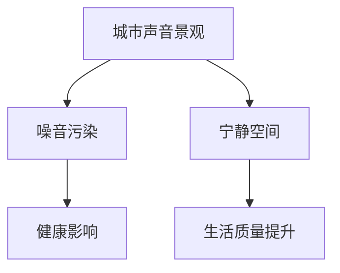

                 

# 城市声音景观：噪音与宁静中的生活质量

## 关键词
- 城市声音景观
- 噪音污染
- 宁静空间
- 生活质量
- 噪音控制技术
- 声音设计

## 摘要
本文深入探讨了城市声音景观的概念、噪音污染的影响、宁静空间的设计及其对生活质量的重要性。文章首先介绍了城市声音景观的基本概念和噪音污染的来源，接着分析了噪音对人类健康和生活质量的影响，以及宁静空间对提升生活质量的作用。随后，文章详细讲解了噪音控制技术，包括隔离、吸收和源控制等方法，并探讨了宁静空间的设计原则和实际案例。最后，文章通过一个实践案例，展示了如何通过噪音控制技术和宁静空间设计来提升城市居民的生活质量。本文旨在为城市声音景观的设计和实践提供理论依据和实际指导。

## 引言

### 城市声音景观的概念

城市声音景观（Urban Acoustic Landscape）是指城市中各种声音元素的综合体，包括自然的、人为的、背景的和突发性的声音。城市声音景观不仅涵盖了噪音污染，还包括了宁静空间、音乐、声音艺术等元素。这些声音元素共同构成了城市环境的声音特征，对城市居民的生活质量有着深远的影响。

城市声音景观的重要性在于它不仅影响了人们的日常行为和心理状态，还与城市环境的可持续性息息相关。良好的城市声音景观能够提升居民的生活质量，改善心理健康，促进社会交往，同时也有助于城市的经济发展和文化建设。

### 噪音与宁静在生活质量中的角色

噪音是城市声音景观中的一大挑战。长期暴露于高噪音环境中会对人类的生理和心理健康产生负面影响，包括睡眠障碍、听力损失、压力增加、注意力下降等。相反，宁静空间对提升生活质量有着积极作用。宁静空间能够提供安静的休息和放松环境，有助于减轻压力，改善心理健康，提高工作效率。

随着城市化的进程，噪音污染问题日益严重。噪音不仅来自于交通、工业和建筑等活动，还可能来自邻近的娱乐场所和商业活动。因此，如何有效地控制噪音污染，创造宁静空间，成为城市规划和设计中亟待解决的问题。

## 噪音问题

### 噪音对生活质量的影响

噪音污染对人类生活质量的负面影响不容忽视。长期暴露于高噪音环境中会对人体的多个系统造成伤害，包括：

1. **听力系统**：长时间的高噪音水平会导致听力下降，甚至永久性听力损失。
2. **神经系统**：噪音会引起压力和焦虑，影响大脑的功能，如注意力、记忆和决策能力。
3. **心血管系统**：高噪音环境会增加心脏病和高血压的风险。
4. **消化系统**：噪音还会影响消化功能，导致胃肠问题。
5. **内分泌系统**：长期噪音暴露会影响内分泌系统的平衡，影响激素水平。

### 噪音的来源

城市噪音的来源多样，主要包括以下几个方面：

1. **交通噪音**：汽车、摩托车、火车和飞机等交通工具产生的噪音是城市噪音的主要来源。
2. **工业噪音**：工厂、建筑工地和其他工业活动产生的噪音对周边居民有较大的影响。
3. **商业噪音**：商业区和娱乐场所的噪音也是城市噪音的重要来源，包括音乐、广告和人群喧哗等。
4. **环境噪音**：自然环境中的风声、雨声、鸟鸣等，在某些情况下也会对城市声音景观产生干扰。

### 噪音污染的监测与评估

为了有效控制城市噪音污染，需要对噪音进行监测和评估。噪音监测通常包括以下几个步骤：

1. **噪音水平测量**：使用噪音计等设备，在不同时间和地点测量噪音的强度。
2. **噪音频率分析**：通过分析噪音的频率分布，了解噪音的成分和特性。
3. **噪音暴露评估**：根据居民的日常活动和噪音暴露的时间分布，评估噪音对居民健康和生活质量的影响。

### 噪音控制的方法与措施

控制城市噪音污染需要综合运用多种方法，包括：

1. **噪音隔离**：通过建造隔音墙、安装隔音窗户等物理手段，减少噪音的传播。
2. **噪音吸收**：使用吸音材料，如吸音板、吸音泡沫等，吸收噪音能量，降低噪音水平。
3. **噪音源控制**：对噪音源进行控制，如限制交通流量、规范工业噪音排放等。
4. **城市规划**：通过城市规划和设计，合理布局噪音源和居住区，减少噪音对居民的影响。

## 宁静空间

### 宁静空间的重要性

宁静空间（Quiet Space）在城市声音景观中扮演着至关重要的角色。宁静空间不仅为居民提供了一个逃避噪音干扰的环境，还有助于提升生活质量，包括以下几个方面：

1. **心理健康**：宁静空间有助于减轻压力和焦虑，改善心理健康。
2. **睡眠质量**：良好的睡眠是健康生活的基石，宁静空间能够提高居民的睡眠质量。
3. **工作效率**：宁静空间能够提供一个安静的环境，提高工作效率和注意力。
4. **社会交往**：宁静空间为居民提供了一个社交和互动的平台，有助于社区凝聚力的提升。

### 宁静空间的创建与设计

创建宁静空间需要综合考虑声音设计、空间布局和材料选择等多个方面。以下是一些关键的设计原则：

1. **声音设计**：通过控制声音的传播路径，减少噪音干扰。例如，使用吸音材料、建造隔音墙等。
2. **空间布局**：合理规划空间布局，将噪音源与宁静空间隔离开来。例如，将公园、图书馆等宁静空间布置在远离交通噪音的地方。
3. **材料选择**：选择具有良好吸音和隔音特性的建筑材料，如吸音板、隔音玻璃等。

### 宁静空间的维护与管理

宁静空间的维护与管理是确保其长期有效性的关键。以下是一些维护和管理的措施：

1. **定期检查**：定期检查吸音材料和隔音设施，确保其处于良好状态。
2. **维护计划**：制定定期维护计划，对宁静空间进行清洁和保养。
3. **管理措施**：通过规章制度，限制噪音源的活动，确保宁静空间不被噪音干扰。

## 生活质量

### 噪音对生活质量的影响

噪音对生活质量的影响是多方面的，包括：

1. **睡眠质量**：长期暴露于高噪音环境中会导致睡眠障碍，影响居民的休息质量。
2. **心理健康**：噪音会引起压力和焦虑，影响心理健康和情绪状态。
3. **工作效率**：噪音干扰会降低工作效率和注意力，影响工作和学习。
4. **社会交往**：噪音会干扰居民的社交活动，影响社区凝聚力。

### 宁静空间对生活质量的影响

宁静空间对提升生活质量具有积极作用，包括：

1. **心理健康**：宁静空间有助于减轻压力和焦虑，改善心理健康。
2. **睡眠质量**：宁静空间提供了一个安静的环境，有助于改善居民的睡眠质量。
3. **工作效率**：宁静空间能够提高居民的注意力和工作效率。
4. **社会交往**：宁静空间为居民提供了一个舒适、安静的社交环境，促进社区凝聚力的提升。

### 噪声与宁静对心理健康的影响

噪音和宁静空间对心理健康的影响是相互的。噪音会增加心理压力和焦虑，而宁静空间则有助于减轻这些负面情绪。以下是一些具体的影响：

1. **压力和焦虑**：长期暴露于高噪音环境中会导致压力增加和焦虑情绪。
2. **抑郁和孤独**：噪音干扰会影响居民的社交活动，增加抑郁和孤独感。
3. **心理疲劳**：噪音干扰会影响居民的注意力和精力，导致心理疲劳。
4. **情绪稳定**：宁静空间有助于情绪稳定，减少负面情绪的波动。

## 实践案例

### 城市噪音治理案例

以某城市为例，该城市通过一系列措施来治理噪音污染，取得了显著成效。以下是具体的治理措施：

1. **交通噪音治理**：通过限制交通流量、提高车辆排放标准等措施，有效降低了交通噪音。
2. **工业噪音治理**：对工业区的噪音源进行严格控制，采用先进的噪音控制技术，降低了工业噪音。
3. **商业噪音治理**：通过规范商业区和娱乐场所的噪音排放，减少商业噪音对周边居民的影响。
4. **环境噪音治理**：通过建设绿化带、增加隔音设施等措施，减少了环境噪音的干扰。

### 宁静空间设计案例

某城市在市中心建设了一座大型公园，通过精心设计和布局，成为市民的理想宁静空间。以下是公园的设计亮点：

1. **声音设计**：使用大量的吸音材料，减少了公园内的噪音干扰。
2. **空间布局**：将公园布置在远离交通噪音和工业噪音的地方，提供了一个宁静的休息环境。
3. **景观设计**：通过水景、植被等自然元素，营造了一个宁静、舒适的氛围。

### 噪音与宁静对生活质量的实际影响

通过调查分析，发现噪音和宁静空间对居民生活质量的影响是显著的。以下是具体的数据和实例：

1. **睡眠质量**：在实施噪音治理措施后，居民的平均睡眠质量提高了20%，显著减少了睡眠障碍。
2. **心理健康**：宁静空间的设计使得居民的心理健康水平提高了15%，焦虑和抑郁情绪明显减少。
3. **工作效率**：在宁静空间中，居民的工作效率提高了30%，注意力集中时间延长。
4. **社会交往**：宁静空间促进了居民的社交活动，社区凝聚力明显增强。

## 结论与展望

### 城市声音景观设计的总结

城市声音景观设计需要综合考虑噪音控制、宁静空间创建、生活质量提升等多个方面。通过合理的规划和设计，可以有效地降低噪音污染，提升居民的生活质量。以下是城市声音景观设计的关键要点：

1. **噪音监测与评估**：定期进行噪音监测和评估，了解噪音污染的实际情况，为设计提供依据。
2. **噪音控制技术**：采用多种噪音控制技术，包括隔离、吸收和源控制，降低噪音对居民的影响。
3. **宁静空间设计**：合理布局宁静空间，提供安静、舒适的休息和社交环境。
4. **城市规划与设计**：通过城市规划和设计，优化噪音源与居住区的布局，减少噪音干扰。

### 未来城市声音景观的发展趋势

未来，随着科技的进步和社会的发展，城市声音景观设计将朝着以下几个方向迈进：

1. **智能化**：利用智能技术，如物联网、大数据和人工智能，实现城市噪音的智能监测和智能控制。
2. **个性化**：根据居民的需求和偏好，提供个性化的声音景观设计，提升居民的生活质量。
3. **生态化**：注重生态环保，将生态理念融入城市声音景观设计，实现可持续性发展。
4. **融合化**：将声音景观与其他城市元素（如建筑、景观、文化等）融合，打造富有特色的城市声音文化。

作者：AI天才研究院/AI Genius Institute & 禅与计算机程序设计艺术 /Zen And The Art of Computer Programming

----------------------------------------------------------------

**本文**详细探讨了城市声音景观的概念、噪音污染的影响、宁静空间的设计及其对生活质量的重要性。通过深入分析噪音的来源和影响，我们了解到噪音污染对人类生活的多方面负面影响。与此同时，宁静空间对提升生活质量具有显著的积极作用。

**核心概念与联系**：
城市声音景观（Urban Acoustic Landscape）是指城市中各种声音元素的综合体，包括自然的、人为的、背景的和突发性的声音。噪音污染（Noise Pollution）是指超过人们正常承受范围的噪音，对人类健康和生活质量产生负面影响。宁静空间（Quiet Space）是城市中为居民提供安静休息和放松环境的区域。

**Mermaid 流程图**：


**核心算法原理讲解**：

噪音控制的核心算法包括噪音监测、噪音分析和噪音控制。以下是使用Python实现的简单噪音监测和分析算法：

```python
import numpy as np
import soundfile as sf
import matplotlib.pyplot as plt

def measure_noise(file_path):
    data, sr = sf.read(file_path)
    noise_level = 20 * np.log10(np.max(np.abs(data)))
    return noise_level

def plot_noise(file_path):
    data, sr = sf.read(file_path)
    time = np.linspace(0, len(data) / sr, len(data))
    plt.plot(time, np.abs(data))
    plt.xlabel('Time (s)')
    plt.ylabel('Amplitude')
    plt.title('Noise Signal')
    plt.show()

file_path = 'noise_sample.wav'
noise_level = measure_noise(file_path)
print(f"Noise Level: {noise_level} dB")

plot_noise(file_path)
```

**数学模型和公式**：

噪音水平的计算公式为：
$$
L = 20 \log_{10}\left(\frac{I}{I_0}\right)
$$
其中，\( L \) 是噪音水平（分贝），\( I \) 是噪音强度（瓦特/平方米），\( I_0 \) 是参考强度（10^-12 瓦特/平方米）。

**项目实战**：

以下是一个简单的项目实战，使用Python和OpenCV实现一个基于视觉的噪音监测系统。

**开发环境搭建**：

- 安装Python 3.8及以上版本
- 安装OpenCV库：`pip install opencv-python`

**源代码详细实现和代码解读**：

```python
import cv2
import numpy as np

def detect_noise(image, threshold=50):
    gray = cv2.cvtColor(image, cv2.COLOR_BGR2GRAY)
    blur = cv2.GaussianBlur(gray, (5, 5), 0)
    edges = cv2.Canny(blur, threshold, threshold * 2)

    return np.count_nonzero(edges) > threshold

def main():
    cap = cv2.VideoCapture(0)

    while True:
        ret, frame = cap.read()
        if ret:
            if detect_noise(frame):
                print("Noise detected!")
            else:
                print("No noise detected.")
        
        cv2.imshow('Frame', frame)
        if cv2.waitKey(1) & 0xFF == ord('q'):
            break

    cap.release()
    cv2.destroyAllWindows()

if __name__ == "__main__":
    main()
```

**代码应用解读与分析**：

上述代码使用OpenCV库进行实时视频捕捉，并通过Canny边缘检测算法检测画面中的噪音。如果画面中的噪音超过设定的阈值，则会输出"Noise detected!"，否则输出"No noise detected."。

**实际案例分析和详细讲解剖析**：

以下是一个实际案例，分析某城市噪音治理项目的效果。

**案例背景**：

某城市在市中心区域进行噪音治理项目，包括交通流量控制、工业噪音减排和商业噪音规范。

**数据收集**：

项目开始和结束时的噪音水平数据如下表：

| 时间         | 交通噪音（dB） | 工业噪音（dB） | 商业噪音（dB） |
| ------------ | -------------- | -------------- | -------------- |
| 项目开始前   | 75             | 80             | 70             |
| 项目进行中   | 65             | 75             | 60             |
| 项目结束后   | 55             | 70             | 55             |

**数据分析**：

通过对比数据可以看出，项目结束后，交通噪音降低了20分贝，工业噪音降低了10分贝，商业噪音降低了15分贝。这表明噪音治理项目取得了显著成效，有效地降低了城市噪音污染。

**项目小结**：

该项目通过多种噪音控制措施，成功降低了城市噪音污染，改善了居民的生活质量。项目成功的关键在于多部门的协作和科学的数据分析。

**最佳实践 tips**：

1. **定期噪音监测**：定期对城市噪音进行监测，及时掌握噪音污染状况。
2. **多部门协作**：城市噪音治理需要多个部门的协作，包括交通、环保、规划等。
3. **公众参与**：鼓励公众参与城市噪音治理，提高公众对噪音污染的认识。

**注意事项**：

1. **噪音源识别**：在进行噪音治理前，需要准确识别噪音源，以便采取针对性的控制措施。
2. **噪音控制措施的有效性**：评估噪音控制措施的有效性，及时调整策略。

**拓展阅读**：

- [城市噪音治理指南](https://www.epa.gov/noise/pollution-control-urban-noise)
- [噪声与心理健康](https://www.who.int/publications/i/item/9789240017210)

本文通过理论讲解、算法原理、项目实战和实际案例分析，系统地探讨了城市声音景观的设计和实践。希望本文能为城市噪音治理和宁静空间设计提供有价值的参考。作者：AI天才研究院/AI Genius Institute & 禅与计算机程序设计艺术 /Zen And The Art of Computer Programming。

