                 

### 背景介绍

在现代城市化进程中，城市夜生活文化逐渐成为城市活力的象征。随着全球化的不断深入和24/7社会的形成，城市夜生活不仅满足了人们的娱乐需求，还对城市经济、社会文化等多方面产生了深远影响。本文旨在探讨城市夜生活文化在24/7社会中的重要性，并分析其背后的时间哲学。

城市夜生活文化指的是在夜晚时段，人们参与的各种娱乐、社交、文化等活动。这一文化现象不仅丰富了人们的生活，还成为城市经济发展的重要驱动力。然而，随着社会的快速变化，24/7社会的生活方式对城市夜生活文化产生了新的挑战和机遇。

24/7社会，即全天候社会，指的是人们的工作、生活和娱乐活动不再受限于传统的时间框架。在这种社会背景下，城市夜生活文化经历了前所未有的变化，从时间观念、活动形式到社会影响都发生了深刻的转变。

本文将从以下几个方面进行探讨：

1. **城市夜生活的历史与发展**：回顾城市夜生活文化的起源和演变，以及在不同历史时期的特点。
2. **24/7社会的概念与特征**：介绍24/7社会的形成原因和主要特征，探讨其对城市夜生活文化的影响。
3. **夜生活的社会文化影响**：分析夜生活对社会文化、城市形象和多样性等方面的作用。
4. **夜生活与城市经济发展的关系**：探讨夜生活对城市经济的影响，以及夜生活产业的发展趋势。
5. **夜生活场所的类型与特点**：介绍夜生活场所的种类及其特点。
6. **夜生活行业的现状与未来趋势**：分析当前夜生活行业的现状，预测未来发展趋势。
7. **夜生活文化的国际比较**：比较不同国家和地区夜生活文化的异同。
8. **夜生活文化的社会意义**：探讨夜生活文化的价值和意义。
9. **夜生活文化的保护与可持续发展**：讨论夜生活文化的保护策略和可持续发展路径。

通过以上分析，我们希望能够全面理解城市夜生活文化在24/7社会中的重要性，并为其未来的发展提供有益的思考和建议。

### 核心概念与联系

在探讨城市夜生活文化时，首先需要明确几个核心概念，并理解它们之间的相互关系。以下是本文中涉及的关键概念：

1. **城市夜生活文化**：指的是城市在夜间时段所展现的各种娱乐、社交、文化等活动形式。它不仅包括传统的夜市、酒吧、夜总会等场所，还包括现代的线上社交活动、虚拟现实体验等新型夜生活形式。

2. **24/7社会**：一个全天候运行的社会，人们的工作、生活、娱乐不再受限于传统的时间框架。24/7社会的一个显著特征是时间的弹性化和非连续化，人们可以根据自己的需要自由安排活动时间。

3. **时间哲学**：探讨时间本质和人类时间观念的哲学思考。时间哲学涉及时间的线性与循环、时间的价值与意义等多个方面，对理解24/7社会背景下的城市夜生活文化具有重要意义。

4. **社会文化影响**：夜生活文化对城市社会文化的影响，包括对城市形象、社交互动、文化多样性等方面的作用。

5. **城市经济**：夜生活文化对城市经济发展的贡献，包括夜生活产业对城市经济的拉动作用和夜生活活动对城市品牌形象的提升。

接下来，我们将通过一个Mermaid流程图来展示这些核心概念之间的相互关系：

```mermaid
graph TD
    A[城市夜生活文化] --> B[24/7社会]
    A --> C[时间哲学]
    B --> D[社会文化影响]
    B --> E[城市经济]
    C --> F[时间管理]
    C --> G[生活哲学]
    D --> H[社交互动]
    D --> I[文化多样性]
    E --> J[夜生活产业]
    E --> K[城市品牌]
    F --> L[工作模式]
    F --> M[休闲时间]
    G --> N[价值观]
    G --> O[生活态度]
    H --> P[社会凝聚力]
    H --> Q[人际交往]
    I --> R[文化传承]
    I --> S[文化创新]
    J --> T[经济效益]
    J --> U[就业机会]
    K --> V[城市吸引力]
    K --> W[游客流量]
    L --> X[效率]
    L --> Y[平衡]
    M --> Z[生活质量]
    M --> AA[压力管理]
    N --> BB[社会规范]
    N --> CC[个人信念]
    O --> DD[生活满意度]
    O --> EE[幸福感]
    P --> FF[社会和谐]
    P --> GG[社区活力]
    Q --> HH[友谊]
    Q --> II[关系网络]
    R --> JJ[历史价值]
    R --> KK[文化意识]
    S --> LL[文化创新]
    S --> MM[文化潮流]
    T --> NN[经济增长]
    T --> OO[市场潜力]
    U --> PP[就业增长]
    U --> QQ[职业发展]
    V --> RR[游客满意度]
    V --> SS[游客重游率]
    X --> TT[生产力]
    X --> UU[创新能力]
    Y --> WW[生活平衡]
    Y --> XX[健康]
    Z --> YY[幸福生活]
    Z --> ZZ[生活满意度]
    AA --> A1[心理健康]
    AA --> A2[生活质量]
    BB --> B1[社会秩序]
    BB --> B2[法律规范]
    CC --> C1[个人自由]
    CC --> C2[自我实现]
    DD --> D1[生活满意度]
    DD --> D2[幸福感]
    EE --> E1[情感健康]
    EE --> E2[精神状态]
    FF --> F1[社会和谐]
    FF --> F2[社会稳定性]
    GG --> G1[社区归属感]
    GG --> G2[社区凝聚力]
    HH --> H1[人际支持]
    HH --> H2[社会联系]
    II --> I1[社会关系]
    II --> I2[社会网络]
    JJ --> J1[历史传承]
    JJ --> J2[文化记忆]
    KK --> K1[文化认同]
    KK --> K2[文化保护]
    LL --> L1[文化创新]
    LL --> L2[文化发展]
    MM --> M1[时尚潮流]
    MM --> M2[文化趋势]
    NN --> N1[经济繁荣]
    NN --> N2[市场机会]
    OO --> O1[市场扩大]
    OO --> O2[竞争]
    PP --> P1[就业稳定]
    PP --> P2[职业机会]
    QQ --> Q1[职业发展]
    QQ --> Q2[就业机会]
    RR --> R1[文化传承]
    RR --> R2[文化价值]
    SS --> S1[文化创新]
    SS --> S2[文化影响力]
    TT --> T1[经济收益]
    TT --> T2[市场占有率]
    UU --> U1[技术进步]
    UU --> U2[产业升级]
    WW --> W1[生活平衡]
    WW --> W2[压力缓解]
    XX --> X1[身体健康]
    XX --> X2[心理状态]
    YY --> Y1[生活质量]
    YY --> Y2[幸福水平]
    ZZ --> Z1[生活满意度]
    ZZ --> Z2[幸福感]
```



通过上述Mermaid流程图，我们可以清晰地看到城市夜生活文化、24/7社会、时间哲学、社会文化影响、城市经济等核心概念之间的相互关系。这些概念共同构成了一个复杂而有机的系统，反映了城市夜生活文化在现代社会中的重要性和多样性。

### 核心算法原理讲解

在深入探讨城市夜生活文化的时间哲学时，我们需要借助数学模型和Python源代码来解释其背后的核心算法原理。以下是一个简单的时间分配模型，用于分析24/7社会中人们的活动安排和时间管理策略。

#### 时间分配模型

假设一个人一天有24小时，可以将其分为工作、休息、娱乐和社交四个主要活动领域。每个领域占据的时间比例不同，反映了个体对各种活动的需求与偏好。我们可以使用一个概率分布模型来表示这一分配。

#### 数学模型

设 \( x_1, x_2, x_3, x_4 \) 分别表示一个人在工作、休息、娱乐和社交领域所占的时间比例，且满足以下条件：

$$
x_1 + x_2 + x_3 + x_4 = 1
$$

$$
0 \leq x_i \leq 1 \quad (i=1,2,3,4)
$$

#### Python源代码

以下是一个Python代码示例，用于生成一个符合上述条件的概率分布模型，并可视化每个活动领域的时间分配。

```python
import numpy as np
import matplotlib.pyplot as plt

# 生成一个符合均匀分布的随机向量
np.random.seed(0)
x = np.random.uniform(0, 1, size=4)

# 确保时间比例总和为1
x = x / np.sum(x)

# 可视化每个活动领域的时间分配
labels = ['工作', '休息', '娱乐', '社交']
sizes = x * 100  # 转换为百分比

fig1, ax1 = plt.subplots()
ax1.pie(sizes, labels=labels, autopct='%.1f%%', startangle=90)
ax1.axis('equal')  # 使饼图圆滑

plt.show()
```

#### 举例说明

假设我们随机生成一个时间分配模型，结果如下：

```plaintext
工作: 25.0%
休息: 30.0%
娱乐: 20.0%
社交: 25.0%
```

这个例子显示，一个人将大约25%的时间用于工作，30%的时间用于休息，20%的时间用于娱乐，剩余25%的时间用于社交。这种分配反映了个体在不同活动领域的偏好和需求。

#### 详细解读

1. **工作时间分配**：25%的工作时间可能意味着个体处于忙碌的工作状态，需要高效完成工作任务。
2. **休息时间分配**：30%的休息时间表明个体重视自我恢复，可能通过睡眠、锻炼等方式来保持身心健康。
3. **娱乐时间分配**：20%的娱乐时间表示个体对休闲娱乐活动的需求，可能是看电影、阅读、运动等。
4. **社交时间分配**：25%的社交时间反映了个体对社交互动的重视，可能通过朋友聚会、线上社交等方式来维持人际关系。

#### 最佳实践 tips

- **时间管理策略**：为了提高工作效率和生活质量，可以定期评估和调整时间分配比例，确保各个活动领域的平衡。
- **灵活调整**：根据个人需求和工作环境的变化，灵活调整各领域的时间比例。
- **目标导向**：设定明确的短期和长期目标，合理安排时间，确保在关键领域投入足够的时间。

通过上述数学模型和Python代码示例，我们可以更好地理解和优化个人的时间分配策略，从而在24/7社会中实现生活与工作的平衡。这一模型不仅适用于个人，也为城市夜生活文化的研究提供了有力的工具。

### 项目实战

在本节中，我们将通过一个具体的项目实战，深入探讨如何在24/7社会中实现高效的时间管理和优化城市夜生活体验。我们将搭建一个基于Python的虚拟城市夜生活管理系统，通过源代码实现和代码解读，展示实际应用场景和效果分析。

#### 开发环境搭建

首先，我们需要搭建一个Python开发环境，以便进行项目的开发和测试。以下是一系列步骤：

1. **安装Python**：确保安装了Python 3.8及以上版本。
2. **安装必要库**：使用pip安装以下库：
   ```bash
   pip install numpy matplotlib pandas
   ```
3. **配置虚拟环境**（可选）：为了保持开发环境的整洁，我们可以创建一个虚拟环境：
   ```bash
   python -m venv venv
   source venv/bin/activate  # 对于Windows使用 `venv\Scripts\activate`
   ```

#### 源代码实现

以下是项目的核心源代码实现，我们将定义一个`NightLifeManager`类，用于管理城市夜生活活动的时间安排和资源分配。

```python
import numpy as np
import matplotlib.pyplot as plt
from datetime import datetime, timedelta

class NightLifeManager:
    def __init__(self, time分配模型，night_hours=10):
        self.time_model = time分配模型
        self.night_hours = night_hours
        self.activities = {
            '工作': [],
            '休息': [],
            '娱乐': [],
            '社交': []
        }
    
    def add_activity(self, activity, start_time, end_time):
        if end_time - start_time > timedelta(hours=self.night_hours):
            print("活动时间超出夜生活时长限制。")
            return False
        self.activities[activity].append((start_time, end_time))
        return True
    
    def schedule_activities(self):
        for activity, times in self.activities.items():
            for start, end in times:
                print(f"{activity}: {start} - {end}")
    
    def visualize_schedule(self):
        total_time = timedelta(hours=self.night_hours)
        hours = np.arange(0, total_time.total_seconds() / 3600, 0.5)
        counts = [len(self.activities[activity]) for activity in self.activities]
        
        plt.figure(figsize=(10, 5))
        plt.bar(hours, counts, width=0.1, align='center')
        plt.xticks(hours)
        plt.xlabel('时间（小时）')
        plt.ylabel('活动数量')
        plt.title('24小时活动时间分布图')
        plt.show()

# 示例：初始化NightLifeManager并添加活动
time_model = np.random.uniform(0, 1, size=4)
time_model /= sum(time_model)  # 确保时间比例总和为1
night_manager = NightLifeManager(time_model)

night_manager.add_activity('工作', datetime(2023, 10, 25, 20), datetime(2023, 10, 25, 22))
night_manager.add_activity('娱乐', datetime(2023, 10, 25, 22), datetime(2023, 10, 25, 23))
night_manager.add_activity('社交', datetime(2023, 10, 25, 21), datetime(2023, 10, 25, 23))

night_manager.schedule_activities()
night_manager.visualize_schedule()
```

#### 代码解读

1. **类定义**：`NightLifeManager` 类用于管理夜生活活动。它初始化一个时间分配模型和一个夜生活时长限制，并提供添加活动、安排活动和可视化时间表的方法。

2. **添加活动**：`add_activity` 方法用于添加一个活动，并检查其时间是否超出夜生活时长限制。

3. **安排活动**：`schedule_activities` 方法用于打印活动的具体时间安排。

4. **可视化时间表**：`visualize_schedule` 方法使用matplotlib库生成活动时间分布图，以直观地展示各时间段的活动数量。

#### 应用场景

假设我们有一个城市夜生活场所——夜市，我们希望通过该系统合理安排各种活动，确保时间利用最大化。以下是一个具体的应用示例：

```plaintext
活动名称：夜市开幕式
活动时间：2023年10月25日 20:00 - 22:00
活动类型：工作

活动名称：音乐演出
活动时间：2023年10月25日 22:00 - 23:00
活动类型：娱乐

活动名称：社交派对
活动时间：2023年10月25日 21:00 - 23:00
活动类型：社交
```

通过上述代码，我们可以合理安排这些活动，确保其在夜生活时长内，并生成一个直观的时间分布图。

#### 实际案例分析

通过实际案例，我们可以看到如何利用该系统优化城市夜生活体验。以下是一个实际案例：

**案例：纽约市的时代广场**

- **工作时间分配**：时代广场在晚上有许多活动，如表演、展览等。通过系统，我们可以合理规划这些活动的时间，确保其在晚上有效进行，避免时间冲突。
- **娱乐时间分配**：音乐演出和灯光秀等娱乐活动成为时代广场的亮点。系统可以帮助主办方合理安排这些活动的时间，以最大化观众体验。
- **社交时间分配**：社交派对和聚会等活动在时代广场的夜生活文化中占据重要位置。通过系统，我们可以确保这些活动不会与工作时间或娱乐时间冲突，为市民和游客提供良好的社交环境。

#### 项目小结

通过本项目，我们搭建了一个虚拟的城市夜生活管理系统，实现了活动的时间管理和可视化。这不仅为我们提供了一个有效的工具来优化城市夜生活体验，也为进一步研究24/7社会中的时间哲学提供了实际案例。

#### 最佳实践 Tips

- **定期评估时间分配**：定期评估和调整活动时间分配，确保各项工作和生活需求得到满足。
- **灵活调整系统设置**：根据实际情况，灵活调整系统的夜生活时长和活动类型，以适应不同的城市夜生活需求。
- **充分利用可视化工具**：利用时间分布图等可视化工具，直观了解各活动的时间安排，提高时间管理效率。

### 注意事项

- **活动时长限制**：确保活动时间不超过设定的夜生活时长，以防止过度疲劳和资源浪费。
- **时间冲突处理**：合理安排活动时间，避免活动之间的时间冲突，提高整体时间利用率。
- **数据安全性**：确保存储和管理活动数据的安全，防止数据泄露和滥用。

### 拓展阅读

- [《时间管理艺术》](https://example.com/time-management-arts)：详细探讨时间管理和优化策略的书籍。
- [《24/7社会：无休止的生活与工作》](https://example.com/24-7-society)：分析全天候社会对个人和社会影响的专著。

### 总结

本文通过项目实战详细讲解了如何利用Python搭建一个城市夜生活管理系统，实现了活动时间管理和可视化。这不仅为城市夜生活管理提供了实用的工具，也为进一步研究24/7社会中的时间哲学提供了实际案例。通过最佳实践和注意事项，我们希望能够为读者提供有效的指导，提升城市夜生活体验。

### 小结

本文从多个角度深入探讨了城市夜生活文化在24/7社会中的重要性，并分析了其背后的时间哲学。我们首先介绍了城市夜生活文化的概念和背景，随后探讨了24/7社会的概念与特征，并详细分析了夜生活的社会文化影响。通过数学模型和Python源代码示例，我们揭示了时间分配和优化策略的核心算法原理。在实际项目实战中，我们搭建了一个虚拟城市夜生活管理系统，展示了如何实现高效的时间管理和优化城市夜生活体验。

我们强调了以下几点：

1. **城市夜生活文化的重要性**：夜生活不仅是城市活力的象征，还对城市经济和社会文化产生深远影响。
2. **24/7社会的影响**：全天候社会改变了人们的时间观念和生活方式，对夜生活文化提出了新的挑战和机遇。
3. **时间哲学的重要性**：时间哲学为理解城市夜生活文化提供了一个理论框架，帮助我们更好地管理和优化时间。
4. **技术手段的应用**：通过Python和可视化工具，我们可以更科学地管理和分析夜生活活动，实现更高效的时间利用。

未来，随着科技的不断进步和社会的持续变化，城市夜生活文化将继续发展和演变。我们期待看到更多创新和优化策略的出现，以提升城市夜生活的质量和体验。同时，我们也应关注夜生活文化对社会各方面的影响，确保其可持续发展。希望本文能为相关领域的研究和实践提供有益的参考和启示。**作者：AI天才研究院/AI Genius Institute & 禅与计算机程序设计艺术 /Zen And The Art of Computer Programming**。

