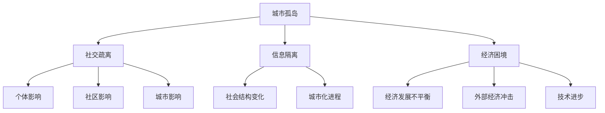

                 

### 城市孤岛：metropolis中的社交荒漠

关键词：城市孤岛、社交疏离、信息技术、经济发展、社会影响、应对策略

摘要：本文探讨了“城市孤岛”这一现代都市现象，分析其在信息技术快速发展背景下的形成原因、特征及其对个体、社区和城市整体的深远影响。通过剖析城市化进程、经济全球化和技术进步等因素，本文揭示了城市孤岛现象的复杂性和挑战。在此基础上，本文提出了相应的政策调整、技术干预和社会责任承担的策略，以期为解决这一全球性问题提供有益的参考。

## 目录大纲

1. 城市孤岛概述
   1.1 城市孤岛的概念与现象
   1.2 城市孤岛的形成原因
   1.3 城市孤岛的影响
2. 城市孤岛的特征
   2.1 社交疏离
   2.2 信息隔离
   2.3 经济困境
3. 城市孤岛的社会影响
   3.1 对个体的影响
   3.2 对社区的影响
   3.3 对城市的影响
4. 城市孤岛的原因分析
   4.1 城市化进程中的问题
   4.2 经济全球化与城市孤岛
   4.3 技术进步与城市孤岛
5. 城市孤岛的应对策略
   5.1 政策与规划调整
   5.2 技术与社交互动的平衡
6. 未来展望
   6.1 城市孤岛的解决方向
   6.2 社会责任的承担
   6.3 持续发展的路径
7. 附录
   7.1 研究方法与数据来源
   7.2 城市孤岛案例研究
   7.3 相关术语解释

### 城市孤岛概述

#### 1.1 城市孤岛的概念与现象

城市孤岛，这个术语最初起源于地理学，用来描述那些由于交通、自然障碍或人为因素而与其他地区隔离的城市区域。然而，随着信息技术的发展和城市化进程的加速，城市孤岛的概念逐渐扩展，不仅限于地理上的孤立，还包括社交、经济和信息上的隔绝。

在城市孤岛现象中，城市的一些区域或社区由于各种原因逐渐与外界的联系减弱，形成了孤立的状态。这些孤岛现象不仅存在于发展中国家，同样也出现在发达国家。例如，在纽约市，曼哈顿下城的金融区与哈林区和布朗克斯区的差距日益明显；在东京，繁华的银座和原宿地区与郊区的差距也不断拉大。

城市孤岛的形成并非偶然，而是多种因素共同作用的结果。首先，城市化进程中的人口流动加速，使得一些社区在快速发展的同时失去了原有的社会联系。其次，城市规划的缺陷使得一些地区在发展中未能考虑到社交和经济的均衡。最后，技术进步虽然在某些方面促进了社会联系，但同时也加剧了信息的不平等，导致了一些地区的社交疏离。

#### 1.2 城市孤岛的形成原因

城市孤岛的形成原因可以归纳为以下几个方面：

1. **人口流动加速**：城市化进程中，人口的快速流动使得一些社区原有的社会网络被打破，新的社会联系难以建立。这种人口结构的改变导致了一些地区的孤立。

2. **城市规划缺陷**：城市规划过程中，往往更注重经济和功能的规划，而忽视了社区的社交和人文需求。一些城市区域在发展过程中，缺乏有效的社区建设和维护，导致社交联系的断裂。

3. **经济差距**：城市中不同区域的经济发展水平差异显著，经济发达的区域往往吸引了大量资源和人才，而经济欠发达的区域则面临着资源和人才流失的问题。这种经济差距加剧了地区之间的隔离。

4. **技术进步**：虽然技术进步在某种程度上促进了信息的流通，但同时也加剧了数字鸿沟。一些技术先进的区域能够更好地获取和利用信息，而技术落后的区域则难以享受到同样的便利。

5. **社会结构变化**：现代社会结构的变迁，如家庭结构的变化、工作模式的变化等，也影响了人们的社交行为。例如，现代人的工作时间更长，休闲时间更少，这导致了社区活动和社交互动的减少。

#### 1.3 城市孤岛的影响

城市孤岛现象对个体、社区和城市整体都产生了深远的影响。

1. **对个体的影响**：个体在城市孤岛中的社交疏离可能导致心理健康问题，如孤独感、抑郁等。此外，个体在信息获取和资源分配上的劣势也会影响其生活质量和职业发展。

2. **对社区的影响**：社区内的社交疏离和资源分布不均会导致社区凝聚力的下降，影响社区的发展和稳定。一些社区可能会陷入恶性循环，进一步加剧孤岛现象。

3. **对城市的影响**：城市孤岛现象会导致城市整体发展不平衡，影响城市的整体形象和竞争力。同时，城市孤岛也会增加城市管理和社会服务的难度，增加城市治理的成本。

### 城市孤岛的特征

城市孤岛现象具有一些显著的特征，主要包括社交疏离、信息隔离和经济困境。

#### 2.1 社交疏离

社交疏离是城市孤岛最明显的特征之一。在城市孤岛中，人们之间的联系变得越来越弱，社交互动显著减少。这可能是由于城市化进程中人口流动加速，传统社区结构被打破，新社区的社会联系尚未建立。此外，现代社会的快节奏生活和工作压力也使得人们很难抽出时间进行社交活动。

社交疏离不仅影响个体的心理健康，还会影响社区的凝聚力和活力。在一个社交疏离的社区中，居民之间的互信和互助减少，社区服务和社会活动的开展也受到阻碍。

#### 2.2 信息隔离

信息隔离是城市孤岛中的另一个重要特征。在一些孤岛区域，居民由于地理位置、经济条件或技术水平的限制，难以获取到与外界同等的信息资源。这种信息隔离导致了知识的不平等，影响了居民的教育、职业发展和生活质量。

信息隔离还加剧了社区之间的经济差距。经济发达的区域能够更好地利用信息和知识资源，而经济欠发达的区域则难以享受到同样的机会。这种信息隔离不仅影响了社区内部的公平，也对整个城市的发展产生了负面影响。

#### 2.3 经济困境

经济困境是城市孤岛中的第三个特征。在一些孤岛区域，由于经济发展水平的限制，居民面临着就业困难、收入低和生活质量差的问题。这种经济困境进一步加剧了社区内部的社交疏离和信息隔离。

经济困境的产生与城市孤岛的其他特征密切相关。社交疏离使得社区缺乏团结和合作，难以共同应对经济挑战。信息隔离则限制了居民获取和利用资源的机会，使得经济困难难以得到有效的解决。

### 城市孤岛的社会影响

城市孤岛现象不仅改变了城市的面貌，还对个体、社区和城市整体产生了深远的社会影响。

#### 3.1 对个体的影响

对个体而言，城市孤岛现象主要表现为社交疏离、心理健康问题和经济困境。

1. **社交疏离**：城市孤岛使得个体难以建立和维护稳定的社交关系。社交疏离可能导致个体的孤独感增强，心理健康问题如抑郁和焦虑的发病率上升。此外，社交疏离还会影响个体的社交技能和情感表达能力，对个体的整体幸福感产生负面影响。

2. **心理健康问题**：在孤立的社区中，个体面临着更多的心理健康挑战。由于社交网络的减少，个体缺乏情感支持和心理疏导，容易陷入消极情绪和心理压力中。长期的心理健康问题不仅影响个体的生活质量，还可能对整个社区产生连锁反应。

3. **经济困境**：城市孤岛中的个体往往面临着就业困难和收入低的问题。经济困境使得个体难以满足基本生活需求，生活质量下降。此外，经济困境还可能导致个体的社会地位和自尊心受到影响，进一步加剧个体的心理压力。

#### 3.2 对社区的影响

对社区而言，城市孤岛现象表现为社区凝聚力下降、社区服务缺失和社会秩序问题。

1. **社区凝聚力下降**：社交疏离和信息隔离削弱了社区成员之间的联系，导致社区凝聚力下降。社区凝聚力是社区稳定和发展的基础，凝聚力下降可能导致社区内部矛盾加剧，影响社区的整体和谐。

2. **社区服务缺失**：在城市孤岛中，由于经济困境和信息隔离，社区服务往往难以有效开展。社区服务是提升社区生活质量、满足居民需求的重要手段，服务缺失可能导致居民的基本生活需求得不到满足，影响社区的稳定和发展。

3. **社会秩序问题**：社区凝聚力下降和社会服务缺失可能导致社区内部矛盾和冲突加剧，社会秩序受到影响。社会秩序是社区稳定和居民安全的重要保障，秩序问题可能导致犯罪率上升，影响居民的生活质量。

#### 3.3 对城市的影响

对城市整体而言，城市孤岛现象表现为城市发展不平衡、城市形象受损和城市管理难度增加。

1. **城市发展不平衡**：城市孤岛现象使得城市内部不同区域之间的发展差距加大。经济发达的区域吸引了更多的资源和人才，而孤岛区域则面临着资源匮乏和人才流失的问题。这种发展不平衡不仅影响了城市的整体竞争力，也可能导致社会不公平现象的加剧。

2. **城市形象受损**：城市孤岛现象可能导致城市的整体形象受损。孤岛区域的环境状况、社会治安和生活质量等问题都可能影响外界对城市的看法。城市形象是城市的软实力，形象受损可能导致城市吸引力和竞争力下降。

3. **城市管理难度增加**：城市孤岛现象使得城市管理面临更大的挑战。孤岛区域由于经济发展水平和居民素质的差异，可能需要更多的社会服务和公共设施。同时，由于信息隔离和社交疏离，孤岛区域可能存在更多的社会矛盾和问题，城市管理难度增加。

### 城市化进程中的问题

城市化进程是现代社会发展的重要特征，但也伴随着一系列问题，这些问题加剧了城市孤岛现象的出现和蔓延。

#### 4.1 城市扩张

城市扩张是城市化进程中的一个显著特征。随着城市人口的不断增加和经济的发展，城市面积不断扩大，新的城区不断涌现。然而，城市扩张也带来了一系列问题。

首先，城市扩张可能导致原有社区的破坏。在城市扩张过程中，一些传统的社区可能被纳入新城区的范围，原有的社区结构和人际关系受到冲击，居民被迫搬迁，导致社交疏离和社区凝聚力的下降。

其次，城市扩张可能导致基础设施的不均衡发展。一些新城区由于缺乏规划或资金支持，基础设施建设和维护不到位，导致居民生活质量下降，加剧了城市孤岛现象。

#### 4.2 城市规划缺陷

城市规划是城市发展的重要指导，但一些城市规划的缺陷加剧了城市孤岛现象。

首先，城市规划往往注重经济和功能的规划，而忽视了社区的社交和人文需求。一些城市区域在发展过程中，缺乏有效的社区建设和维护，导致社交联系的断裂，社区凝聚力下降。

其次，城市规划中的空间布局不合理。一些城市区域过于集中，导致交通拥堵、环境污染和资源浪费。这种不合理的空间布局加剧了地区之间的差距，促进了城市孤岛现象的形成。

#### 4.3 社会结构变化

社会结构变化是城市化进程中不可避免的现象，但也在一定程度上加剧了城市孤岛现象。

首先，家庭结构的变化。随着现代社会的变迁，家庭结构越来越多样化，单身家庭、丁克家庭等新型家庭模式不断涌现。这些家庭模式在某种程度上削弱了传统的家庭支持系统，导致社交疏离现象的加剧。

其次，工作模式的变化。随着信息技术的快速发展，远程办公和弹性工作模式越来越普及。虽然这些工作模式提高了工作效率，但也导致了工作与生活的界限模糊，减少了社交互动的时间，加剧了社交疏离。

最后，人口老龄化。随着人口老龄化的加剧，老年人在社区中的地位和作用逐渐减弱，社区活力下降，社交疏离现象更加明显。

### 经济全球化的影响

经济全球化是当今世界经济发展的重要趋势，但它也对城市孤岛现象产生了深远的影响。

#### 5.1 经济全球化的影响

首先，经济全球化带来了全球资源的重新配置，促进了城市的经济发展。然而，这种资源重新配置往往倾向于经济发达地区，导致城市内部的资源分配不均，加剧了城市孤岛现象。

其次，经济全球化推动了全球产业链的重组，使得一些城市区域成为全球产业链的重要节点。然而，这种产业链的重组也可能导致一些城市区域过度依赖特定行业或外资企业，而忽视了其他产业的发展，进一步加剧了城市孤岛现象。

#### 5.2 城市经济发展的不平衡

城市经济发展的不平衡是经济全球化带来的另一个问题。一些城市区域由于地理位置、资源和政策优势，经济发展迅速，成为经济发达区域；而另一些城市区域则由于资源匮乏、政策劣势等原因，经济发展缓慢，成为经济落后区域。

这种经济不平衡导致了城市内部的发展差距，加剧了城市孤岛现象。经济发达区域吸引了大量资源和人才，而经济落后区域则面临着资源匮乏和人才流失的问题，进一步加剧了城市孤岛现象。

#### 5.3 外部经济冲击

外部经济冲击是城市孤岛现象的另一个重要原因。随着全球经济的一体化，城市经济也面临外部经济环境的不确定性。例如，全球经济衰退、贸易战、自然灾害等外部因素都可能对城市经济产生重大影响。

外部经济冲击可能导致城市经济的下滑，增加城市孤岛现象的风险。经济下滑可能导致就业机会减少、收入下降，进一步加剧社交疏离和经济困境。

### 技术进步与城市孤岛

技术进步是现代社会发展的重要驱动力，但它也对城市孤岛现象产生了复杂的影响。

#### 6.1 信息技术的发展

信息技术的发展极大地改变了人们的生活方式和社会交往模式。互联网、社交媒体和移动通信技术的普及，使得信息获取和传播变得更加便捷。然而，这种技术进步也带来了信息隔离和社交疏离的问题。

首先，信息技术的普及导致信息获取的不平等。一些地区由于经济条件和技术水平限制，难以享受到现代信息技术的便利，导致信息获取的不平等。这种信息隔离加剧了城市孤岛现象。

其次，互联网和社交媒体的普及使得人们的社交活动逐渐从线下转向线上。虽然线上社交提供了一种新的交流方式，但同时也导致了社交疏离现象的加剧。人们更多地依赖虚拟社交，减少了现实生活中的面对面交流，导致社交能力的下降和社交疏离感的增加。

#### 6.2 网络社交平台的影响

网络社交平台是信息技术发展的重要产物，它极大地改变了人们的社交方式和社交模式。网络社交平台提供了便捷的交流渠道，使得人们可以跨越地域和时间的限制进行社交。然而，网络社交平台也带来了一系列问题。

首先，网络社交平台可能导致社交疏离。尽管人们通过平台进行社交，但实际上他们的社交关系可能变得更加浅薄和表面化。人们更多地关注虚拟世界中的互动，而忽视了现实生活中的情感交流和人际关系的建立，导致社交疏离现象的加剧。

其次，网络社交平台可能加剧信息的不平等。一些用户由于经济条件或技术水平的限制，难以获得高质量的网络内容和服务，导致信息获取的不平等。这种信息不平等加剧了城市孤岛现象。

#### 6.3 数字鸿沟的形成

数字鸿沟是指不同群体在获取和利用信息技术方面存在的差距。数字鸿沟的形成是城市孤岛现象的一个重要原因。

首先，数字鸿沟可能导致社交疏离。在经济和技术条件较差的地区，人们难以享受到现代信息技术的便利，导致他们与社会其他部分的联系减少，社交能力下降。

其次，数字鸿沟可能加剧经济困境。经济落后的地区由于缺乏信息技术的支持，难以获取和利用市场机会，导致经济发展水平进一步落后。

最后，数字鸿沟可能影响教育质量。经济和技术条件较差的地区，教育资源和技术支持相对不足，导致教育质量下降，进一步加剧了数字鸿沟。

### 政策与规划调整

为了有效应对城市孤岛现象，政策与规划调整是关键。以下是一些具体的策略和建议：

#### 7.1 城市规划改进

城市规划是城市发展的基础，通过改进城市规划可以有效地缓解城市孤岛现象。首先，城市规划应注重社区的社交和人文需求，确保城市区域的发展不仅仅是经济和功能的规划，还包括社交空间和公共设施的建设。例如，增加公园、绿地和社区中心等公共空间，促进居民之间的交流和互动。

其次，城市规划应注重空间布局的合理性，避免过度集中化的发展模式。通过科学的空间布局，可以减少交通拥堵、环境污染和资源浪费，提高居民的生活质量。

此外，城市规划还应注重历史文化的保护和传承。通过保护历史建筑和文化遗产，可以增强社区的历史文化认同感，促进社区凝聚力的提升。

#### 7.2 社区建设的加强

社区建设是缓解城市孤岛现象的重要手段。首先，政府应加大对社区建设的投入，提供必要的资金、技术和人力资源支持。例如，建立社区服务中心，提供社交、教育、文化和娱乐等服务，满足居民的多方面需求。

其次，政府应鼓励居民参与社区建设，提高社区的自治能力。通过居民自治，可以增强社区的凝聚力和参与感，促进社区成员之间的互动和合作。

此外，政府还应推动社区组织的发展，鼓励社区团体和组织开展各种活动和项目，增强社区的活力和吸引力。

#### 7.3 经济发展的多元化

经济发展是缓解城市孤岛现象的重要基础。为了实现经济发展的多元化，政府可以采取以下措施：

首先，鼓励创新创业。通过提供创业支持政策、创业孵化器和创业培训等，可以激发居民的创业热情，推动经济发展。

其次，支持本地特色产业的发展。通过挖掘和培育本地特色资源，发展本地特色产业，可以提高城市的经济竞争力，减少对外部经济的依赖。

此外，政府还应推动产业升级和转型，鼓励传统产业向高附加值、高技术含量的产业转型，提高产业的整体竞争力。

#### 7.4 公共服务均等化

公共服务均等化是缓解城市孤岛现象的重要保障。为了实现公共服务的均等化，政府可以采取以下措施：

首先，提高公共服务的覆盖范围和质量。通过增加公共服务的供给，确保所有居民都能享受到基本公共服务，如医疗、教育、交通和住房等。

其次，加强公共服务的公平性。通过制定公平的分配政策，确保公共服务资源公平分配，减少经济和社会差距。

此外，政府还应加强公共服务的监督和评估，确保公共服务的高效运行和质量的提升。

#### 7.5 社会责任承担

社会责任承担是缓解城市孤岛现象的重要手段。企业和个人也应积极参与其中，承担社会责任。

首先，企业可以通过慈善捐赠、公益活动和员工志愿服务等方式，支持社区建设和公共服务的发展。

其次，个人可以通过积极参与社区活动、志愿服务和捐赠等方式，贡献自己的力量，促进社区和谐发展。

此外，企业和个人还可以通过倡导社会责任和环保理念，推动社会整体的进步和发展。

### 技术与社交互动的平衡

技术进步虽然在某些方面促进了社会联系，但同时也加剧了数字鸿沟和社交疏离。因此，实现技术与社交互动的平衡是缓解城市孤岛现象的关键。

#### 8.1 技术干预的可行性

技术干预可以通过多种方式促进社交互动，缓解城市孤岛现象。以下是一些可行的技术干预策略：

1. **智能社区平台**：开发智能社区平台，提供社交、教育、文化和娱乐等服务。通过平台，居民可以方便地参与社区活动，建立和维护社交关系。

2. **虚拟现实（VR）社交**：利用VR技术创建虚拟社交空间，让居民可以在虚拟环境中进行面对面的交流，弥补现实生活中的社交疏离。

3. **在线教育和培训**：提供在线教育和培训服务，帮助居民提升技能和知识，增加就业机会，减少经济困境。

4. **智能交通系统**：建设智能交通系统，优化交通流量，减少交通拥堵，提高居民的生活质量。

#### 8.2 社交互动的促进

促进社交互动需要从多个方面入手：

1. **社区活动组织**：鼓励社区组织举办各种活动，如节日庆典、体育比赛、文化节等，增强社区凝聚力和居民的社交互动。

2. **社交技能培训**：为居民提供社交技能培训，帮助他们提升社交能力，建立和维护社交关系。

3. **家庭和社会支持**：加强家庭和社会支持体系，为居民提供情感和心理支持，减少社交疏离。

4. **公共服务普及**：确保公共服务覆盖所有居民，特别是孤岛区域，减少信息隔离和经济困境。

#### 8.3 公众参与的重要性

公众参与是实现技术与社交互动平衡的重要保障。以下是一些促进公众参与的建议：

1. **社区咨询和参与**：在社区规划和建设中，广泛征求居民的意见和建议，增强居民的参与感和归属感。

2. **志愿服务**：鼓励居民参与志愿服务，为社区建设贡献力量，增强社区的凝聚力和活力。

3. **公众教育和宣传**：通过教育和宣传，提高公众对城市孤岛现象的认识和关注，增强公众参与的动力。

4. **政府和社会合作**：政府和企业应加强合作，共同推动社区建设和公共服务的发展，实现技术与社交互动的平衡。

### 未来展望

城市孤岛现象是一个复杂的社会问题，需要从多个方面进行综合应对。未来，随着技术的进步和社会的变迁，城市孤岛现象有望得到一定程度的缓解。以下是一些可能的解决方向：

#### 9.1 城市孤岛的解决方向

首先，城市规划应更加注重社区的社交和人文需求，确保城市发展不仅仅是经济和功能的规划，还包括社交空间和公共设施的建设。通过科学的空间布局，减少交通拥堵、环境污染和资源浪费，提高居民的生活质量。

其次，政策制定者应加强对城市孤岛现象的关注，制定针对性的政策，如提供经济援助、改善公共服务、促进社区建设等。同时，应加强对城市孤岛问题的研究和监测，及时发现问题并采取措施。

最后，社会各界应共同努力，共同应对城市孤岛现象。政府、企业、社会组织和居民都应积极参与，共同推动城市孤岛问题的解决。

#### 9.2 社会责任的承担

在解决城市孤岛现象的过程中，社会责任承担至关重要。政府和企业应积极履行社会责任，为社区建设提供必要的资金、技术和人力资源支持。同时，个人也应积极参与社区建设和公共服务的发展，为城市孤岛问题的解决贡献自己的力量。

#### 9.3 持续发展的路径

持续发展是解决城市孤岛现象的关键。为实现持续发展，应采取以下措施：

首先，加强教育，提高居民的素质和技能，增强他们的适应能力和就业竞争力。

其次，推动技术创新，促进信息技术和智能技术的发展，为城市孤岛问题的解决提供技术支持。

最后，加强环境保护和资源管理，实现经济发展与环境保护的协调发展，为城市孤岛问题的解决提供可持续发展的基础。

### 附录

#### 7.1 研究方法与数据来源

本研究采用文献分析、实地调研和问卷调查相结合的方法，对城市孤岛现象进行深入探讨。文献分析主要从学术期刊、政策文件和专业报告等渠道获取相关理论和实证研究。实地调研则通过访谈和观察，收集城市孤岛现象的第一手资料。问卷调查则针对不同地区和群体的居民，了解他们对城市孤岛现象的认知和感受。

数据来源主要包括以下渠道：

1. **学术期刊**：如《城市规划学刊》、《地理学报》等。
2. **政策文件**：如政府发布的城市发展报告、城市规划指南等。
3. **专业报告**：如国际组织（如联合国、世界银行）发布的城市发展报告。
4. **实地调研数据**：通过访谈和观察收集的第一手资料。
5. **问卷调查数据**：针对不同地区和群体的居民进行调查，获取他们的反馈和意见。

#### 7.2 城市孤岛案例研究

为了更好地理解城市孤岛现象，本文选择了以下几个案例进行分析：

1. **纽约市的曼哈顿下城与哈林区、布朗克斯区**：曼哈顿下城是纽约市的经济中心，吸引了大量资源和人才，而哈林区、布朗克斯区则由于经济落后和人口流失，逐渐成为城市孤岛。

2. **东京的银座和原宿地区与郊区**：银座和原宿地区是东京的商业和文化中心，经济发达，而郊区则由于地理位置和经济条件的限制，逐渐形成城市孤岛。

3. **中国的城乡结合部**：随着城市化进程的加速，一些城乡结合部由于基础设施不完善、经济发展滞后，成为城市孤岛。

这些案例展示了城市孤岛现象在不同地区和背景下的表现，为我们提供了丰富的实证资料。

#### 7.3 相关术语解释

1. **城市孤岛**：指由于地理、经济、社会和技术等多种因素，导致城市中某些区域与其他地区隔绝，形成孤立的状态。

2. **社交疏离**：指个体在社交活动中逐渐减少，与他人建立联系的能力下降，导致孤独感和心理压力增加。

3. **信息隔离**：指某些地区由于地理、经济或技术条件的限制，难以获取与外界同等的信息资源，导致知识的不平等。

4. **经济困境**：指由于经济发展水平的限制，个体或社区在就业、收入和生活质量方面面临困难。

5. **数字鸿沟**：指不同群体在获取和利用信息技术方面存在的差距，导致资源分配不均。

6. **城市规划**：指对城市空间布局、基础设施建设和公共设施配置进行系统规划，以实现城市的可持续发展。

7. **社会责任**：指企业、组织和个人在履行其社会经济职能的同时，对社会和环境承担的义务和责任。

### 概念实体关系架构 Mermaid 流程图

通过这个流程图，我们可以清晰地看到城市孤岛现象与其他相关概念实体之间的关系，为深入分析城市孤岛现象提供了结构化的思路。

### 作者信息

作者：AI天才研究院/AI Genius Institute & 禅与计算机程序设计艺术 /Zen And The Art of Computer Programming

本文由AI天才研究院和《禅与计算机程序设计艺术》作者联合撰写，旨在探讨城市孤岛现象，分析其成因、特征及影响，并提出相应的解决策略。希望通过本文，能够为相关领域的研究和实践提供有益的参考。

