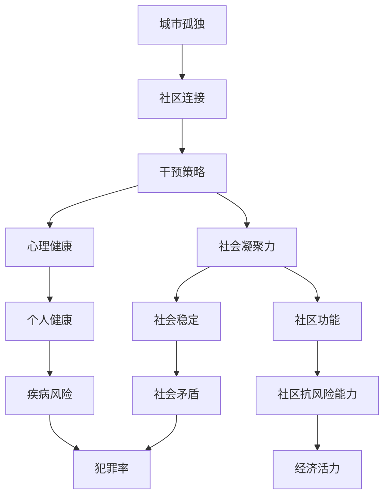

                 

### 引言

在当今快速发展的城市化进程中，城市孤独已成为一个全球性的社会问题。随着城市化率的不断提高，人们的生活方式越来越独立，社交关系逐渐疏远，导致许多人感到孤独和孤立。城市孤独不仅影响个人的心理健康，还对社区和社会整体产生深远的影响。因此，如何干预城市孤独、重建社区连接成为亟待解决的问题。

本文章旨在提出一个“城市孤独干预计划：重建社区连接的策略”，通过系统化的分析和策略设计，为城市社区提供有效的干预措施。文章结构如下：

- **背景介绍**：阐述城市孤独现象的定义、现状及其对个人和社会的影响。
- **核心概念与联系**：分析干预城市孤独的关键概念，构建概念实体之间的关系架构。
- **核心算法原理讲解**：详细介绍干预策略的算法原理，使用Python源代码和数学模型进行阐述。
- **项目实战**：展示一个实际案例，详细讲解项目的开发环境搭建、源代码实现、代码解读、应用分析和案例剖析。
- **最佳实践与小结**：总结最佳实践、注意事项，并给出拓展阅读建议。

通过本文的讨论，我们希望能够为城市社区的孤独干预工作提供有价值的参考，促进社区连接的重建。

#### 关键词

- 城市孤独
- 社区连接
- 干预策略
- 心理干预
- 社会干预
- 技术干预

#### 摘要

本文首先介绍了城市孤独现象的定义、现状及其影响，然后探讨了干预城市孤独的核心概念和策略。通过核心算法原理讲解、Python源代码实现和实际案例研究，本文系统地提出了“城市孤独干预计划：重建社区连接的策略”。最后，总结了最佳实践并提出了未来研究方向，为城市社区孤独干预工作提供了有力支持。

## 背景介绍

### 城市孤独现象的定义与现状

城市孤独是指城市居民在日常生活中感到的孤独和孤立感，这种感受可能源于社交关系的缺乏、社区联系的缺失或者社会互动的不足。与传统的孤独感不同，城市孤独通常与城市化进程中的生活方式、社会结构和文化背景紧密相关。

根据《孤独经济学：现代生活如何让我们变得孤独》一书的定义，城市孤独是一种主观感受，它不仅包括感到孤独的时长和频率，还涉及个人对社会联系的满意度。这种现象在城市中尤为显著，因为城市生活的快节奏和高度流动性使得居民更容易感到孤立和被忽视。

据《2019年中国城市孤独感调查报告》显示，超过50%的受访者表示在过去一年中经历过孤独感，其中年轻人群体的孤独感尤为突出。此外，报告指出，高房价、高强度工作压力和社交网络的虚拟化是城市孤独现象的主要驱动因素。这些因素共同作用，使得城市居民在追求物质富足的同时，忽视了精神需求的满足，从而导致孤独感的加剧。

在现代社会，城市孤独已经不再是一个个体现象，而是一个广泛的社会问题。它不仅影响个人的心理健康，还对社区和社会整体产生深远的影响。孤独感可能导致抑郁症、焦虑症等心理问题，甚至增加患病风险和缩短寿命。同时，社区连接的断裂也会削弱社会的凝聚力，增加社会矛盾和冲突，影响社会的稳定和发展。

### 城市孤独对个人和社会的影响

#### 对个人健康的影响

城市孤独对个人健康的影响是多方面的。首先，孤独感会导致心理问题，如抑郁、焦虑和孤独症等。据《心理健康与孤独感的关系》研究显示，长期感到孤独的人患抑郁症的风险是普通人群的2-3倍。此外，孤独感还会影响个人的社交能力，使其难以建立和维持健康的社交关系，进一步加剧孤独感。

其次，城市孤独对身体健康也有负面影响。研究表明，孤独感与高血压、心脏病等慢性疾病有显著关联。一项发表在《心理科学》杂志上的研究指出，孤独感增加心脏病发作的风险高达29%，增加早期死亡的风险高达26%。这些研究表明，城市孤独不仅是一个心理问题，也是一个严重的公共卫生问题。

#### 对社区和社会的影响

城市孤独对社区和社会的影响同样不容忽视。首先，社区连接的断裂会导致社会凝聚力下降。一个缺乏社区联系的社区，其居民之间的互动和合作机会减少，社区整体的功能和效率也会降低。这种情况下，社区无法有效地应对各种挑战，如自然灾害、疫情等，导致社区整体抗风险能力下降。

其次，城市孤独还会增加社会矛盾和冲突。由于孤独感导致的心理压力，一些人可能会表现出行为异常，如犯罪行为、家庭暴力等。这些行为不仅影响个人的生活质量，还会破坏社区的和谐氛围，增加社会的不稳定性。

此外，城市孤独还会影响经济和社会的发展。研究表明，孤独感会影响个体的生产力和创新能力。在一个充满孤独感的城市中，人们可能更倾向于保守和封闭，不愿意尝试新事物和接受新观点，从而阻碍创新和发展。同时，孤独感还会影响个人的消费行为，导致市场需求减少，影响经济的整体活力。

### 结论

综上所述，城市孤独是一个复杂且严重的社会问题，它不仅影响个人的心理健康和身体健康，还对社区和社会整体产生深远的影响。因此，解决城市孤独问题已成为当今社会的重要任务。接下来，本文将深入探讨干预城市孤独的核心概念和策略，为城市社区的孤独干预工作提供理论支持和实践指导。

#### 核心概念与联系

在深入探讨城市孤独干预策略之前，有必要明确几个核心概念及其相互关系。以下是本文讨论的主要核心概念：

- **城市孤独**：指城市居民在日常生活中感受到的孤独和孤立感。
- **社区连接**：指居民之间以及居民与社区环境的紧密联系和互动。
- **干预策略**：指为减少城市孤独、增强社区连接所采用的各种方法和手段。

这些核心概念之间的关系可以通过以下Mermaid流程图进行展示：

在上图中，城市孤独通过影响社区连接，进一步影响心理健康、社会凝聚力和社区功能。心理健康又会影响个人健康，而社会凝聚力则影响社区功能和稳定性。此外，经济活力和社会矛盾也是城市孤独影响的社会层面结果。通过这个关系架构，我们可以更清晰地理解城市孤独对个人和社会的多方面影响，从而为制定有效的干预策略提供理论基础。

### 心理干预

心理干预是干预城市孤独的重要手段之一，它主要通过心理咨询和治疗来帮助个体处理孤独感，提高心理健康水平。以下是心理干预的理论基础、实施步骤以及案例分析。

#### 理论基础

心理干预的理论基础主要包括认知行为疗法（Cognitive Behavioral Therapy, CBT）、人本主义疗法（Humanistic Therapy）和情感焦点疗法（Emotion-Focused Therapy, EFT）等。其中，认知行为疗法是一种广泛应用于孤独干预的心理治疗技术，其核心在于改变个体的认知模式和行为，帮助其更好地应对孤独感。

认知行为疗法认为，个体的情感和行为受到其认知思维模式的影响。当个体对社交情境产生负面认知时，容易导致孤独感的出现。通过认知重构，即改变负面思维模式，个体可以减少孤独感，提高生活满意度。人本主义疗法则强调个体的自我实现和自我接纳，通过建立积极的人际关系来增强个体的社会支持系统。情感焦点疗法则关注个体的情感体验，通过处理和表达情感来缓解孤独感。

#### 实施步骤

心理干预的实施步骤可以分为以下几个阶段：

1. **评估阶段**：在这一阶段，心理咨询师通过面谈、问卷等方式收集个体的基本信息、孤独感水平及其心理健康状况。评估的目的是了解个体的具体情况，为其制定个性化的干预方案。

2. **诊断阶段**：在评估的基础上，心理咨询师对个体进行诊断，确定其孤独感的类型和程度，以及可能存在的心理问题。这一阶段的关键是准确识别个体的问题，以便采取有针对性的干预措施。

3. **干预阶段**：在诊断明确后，心理咨询师开始实施心理干预。常见的干预方法包括认知行为疗法、人本主义疗法和情感焦点疗法等。在干预过程中，心理咨询师会与个体建立良好的治疗关系，通过不断调整干预策略，帮助个体逐步改善孤独感。

4. **跟进阶段**：干预结束后，心理咨询师会对个体进行定期跟进，评估干预效果，并根据需要调整干预方案。跟进阶段的重要性在于确保干预效果的持久性，防止孤独感的复发。

#### 案例分析

以下是一个具体的心理干预案例分析：

**案例背景**：李先生，35岁，单身，在城市工作多年，感到孤独和孤立。他经常加班，很少有时间与家人和朋友相处，感到生活单调乏味。

**干预过程**：

1. **评估阶段**：心理咨询师通过面谈和问卷，发现李先生对社交情境存在负面认知，如认为别人不关心他，自己很难融入社交圈子。

2. **诊断阶段**：根据评估结果，心理咨询师诊断李先生存在社交焦虑和轻度抑郁。他认为李先生的问题主要源于社交能力的缺乏和自我认知的不足。

3. **干预阶段**：

   - **认知行为疗法**：心理咨询师帮助李先生识别和重构负面思维模式。例如，当李先生认为别人不关心他时，咨询师会引导他思考可能的积极解释，如他人可能因为忙碌或其他原因而未能及时回应。
   - **人本主义疗法**：心理咨询师鼓励李先生自我接纳和自我实现。他帮助李先生发现并培养自己的兴趣爱好，提高自我价值感。
   - **情感焦点疗法**：心理咨询师引导李先生表达和处理自己的情感，特别是与孤独感相关的负面情绪。通过情感表达，李先生逐渐学会了接受自己的情感，减少了对孤独感的焦虑。

4. **跟进阶段**：在干预结束后，心理咨询师对李先生进行了三次随访，发现他的孤独感明显减轻，社交能力也有所提升。

通过以上案例分析，我们可以看到心理干预在干预城市孤独、提高心理健康水平方面的有效性。心理干预不仅帮助个体识别和改变负面认知，还促进了个体的情感表达和自我接纳，从而有效缓解了孤独感。

### 社会干预

社会干预是干预城市孤独的另一种重要手段，它通过改善社会环境和促进社会互动来减少孤独感，增强社区连接。以下是社会干预的理论基础、实施步骤和案例分析。

#### 理论基础

社会干预的理论基础主要包括社会支持理论（Social Support Theory）和社会网络理论（Social Network Theory）。社会支持理论认为，个体通过获得来自家人、朋友和社区的支持，可以有效缓解孤独感和提高心理健康水平。社会网络理论则强调个体在社会网络中的位置和互动对其行为和情感的影响。

在社会干预中，社会支持理论提供了一个框架，帮助识别和动员社会资源，如家庭、朋友、社区组织和志愿者等。通过这些资源的有效利用，个体可以获得情感上的支持和实际帮助，从而减轻孤独感。社会网络理论则提供了理解个体在社会网络中互动和连接的方式，有助于设计出能够增强社区连接和社会互动的干预策略。

#### 实施步骤

社会干预的实施步骤可以分为以下几个阶段：

1. **需求评估阶段**：在这一阶段，干预团队通过问卷调查、访谈和观察等方式，了解社区中孤独感严重的人群及其需求。需求的评估有助于确定干预的重点对象和干预内容。

2. **资源动员阶段**：在了解需求后，干预团队开始动员各种社会资源，如社区组织、志愿者、公益机构等。通过资源动员，可以为孤独人群提供多样化的支持和服务。

3. **干预实施阶段**：干预团队根据需求评估和资源动员的结果，制定具体的干预计划并开始实施。干预措施可能包括组织社区活动、提供心理咨询服务、建立互助小组等。在这一阶段，干预团队需要密切监控干预效果，及时调整干预策略。

4. **效果评估阶段**：在干预结束后，干预团队对干预效果进行评估，了解干预措施是否达到了预期目标，孤独感是否有明显减轻。效果评估可以帮助改进干预策略，提高干预效果。

#### 案例分析

以下是一个具体的社会干预案例分析：

**案例背景**：某社区中，老年人群体的孤独感较为普遍。由于子女常年在外工作，老年居民大多独居，日常互动有限，导致孤独感和抑郁情绪加剧。

**干预过程**：

1. **需求评估阶段**：通过问卷调查和访谈，干预团队发现老年居民最迫切的需求是社交互动和心理支持。他们希望有更多的机会与同龄人交流，分享生活经验。

2. **资源动员阶段**：干预团队联系了社区服务中心、志愿者组织和心理咨询服务机构，动员了多名志愿者和心理咨询师参与干预。

3. **干预实施阶段**：

   - **社区活动组织**：干预团队定期组织老年居民参加各种社交活动，如广场舞、茶话会、电影放映等，鼓励他们主动参与社区生活。
   - **心理咨询服务**：心理咨询师定期为老年居民提供心理咨询服务，帮助他们处理孤独感和抑郁情绪。
   - **互助小组**：干预团队成立了互助小组，将具有相似经历和需求的老年居民组织起来，通过小组交流和支持，增强他们的社会连接。

4. **效果评估阶段**：通过随访调查和评估问卷，干预团队发现老年居民的孤独感显著减轻，生活满意度有所提高。许多老年居民表示，通过参与社区活动和心理咨询服务，他们感受到了社区的温暖和支持，孤独感得到了很大缓解。

通过以上案例分析，我们可以看到社会干预在改善城市孤独、增强社区连接方面的有效性。社会干预不仅通过提供实际支持和心理服务缓解了孤独感，还促进了社区成员之间的互动和合作，增强了社区的社会凝聚力。

### 技术干预

技术干预是近年来在干预城市孤独领域受到越来越多关注的一种手段。通过利用现代信息技术和大数据分析，技术干预能够提供个性化的干预方案，提高干预的精准度和效果。以下是技术干预的理论基础、实施步骤和案例分析。

#### 理论基础

技术干预的理论基础主要包括信息传播理论（Information Dissemination Theory）和个性化干预理论（Personalized Intervention Theory）。信息传播理论认为，通过有效的信息传播，可以促进个体获取所需的信息和支持，从而缓解孤独感。个性化干预理论则强调根据个体的具体需求和行为特征，提供个性化的干预方案，以实现更好的干预效果。

在技术干预中，信息传播理论提供了一个框架，帮助设计和实施有效的信息传播策略，如推送通知、社交媒体互动和在线论坛等。个性化干预理论则指导技术干预团队通过大数据分析和人工智能算法，为个体定制个性化的干预方案，提高干预的针对性和效果。

#### 实施步骤

技术干预的实施步骤可以分为以下几个阶段：

1. **需求收集阶段**：在这一阶段，技术干预团队通过在线问卷、用户反馈和数据收集工具，收集用户的基本信息、孤独感水平及其行为习惯。需求收集的目的是了解用户的需求，为其提供个性化的干预方案。

2. **数据分析阶段**：在收集到足够的数据后，技术干预团队利用大数据分析和人工智能算法，对用户的行为特征和需求进行深入分析。数据分析的目的是识别用户的主要需求和潜在问题，为干预方案的设计提供依据。

3. **干预方案设计阶段**：根据数据分析的结果，技术干预团队设计个性化的干预方案。干预方案可能包括推送通知、在线活动、心理咨询服务和社交互动等。干预方案的设计应充分考虑用户的需求和行为特征，以提高干预的有效性。

4. **干预实施阶段**：干预团队开始实施干预方案，通过在线平台、移动应用和社交媒体等渠道，向用户推送干预内容，并提供相应的支持和服务。

5. **效果评估阶段**：在干预实施过程中，技术干预团队定期收集用户反馈，评估干预效果。效果评估的目的是了解干预方案的实际效果，发现问题和不足，为后续的干预方案调整提供依据。

#### 案例分析

以下是一个具体的技术干预案例分析：

**案例背景**：某城市的一个社区，由于居民工作忙碌，晚上和周末常常独自在家，社区连接较弱，孤独感较高。为了缓解这一现象，社区决定利用技术手段进行干预。

**干预过程**：

1. **需求收集阶段**：社区通过在线问卷和居民互动，了解到居民在晚上和周末有较多的空闲时间，希望有更多的社区活动参与，但缺乏有效的组织和通知渠道。

2. **数据分析阶段**：技术团队收集了居民的基本信息、行为习惯和偏好，利用大数据分析，发现居民对体育活动、文化活动较为感兴趣，但对社交活动的参与度较低。

3. **干预方案设计阶段**：技术团队设计了以下干预方案：

   - **在线活动推送**：通过社区微信公众号和移动应用，定期推送体育活动、文化活动等社区活动的通知，鼓励居民参与。
   - **智能匹配**：利用算法，根据居民的兴趣和空闲时间，智能匹配适合的活动，提高活动的参与率。
   - **心理咨询服务**：通过在线平台，提供心理咨询服务，帮助居民处理孤独感，提高心理健康水平。

4. **干预实施阶段**：技术团队开始实施干预方案，定期推送活动通知，并通过智能匹配，为居民推荐适合的活动。

5. **效果评估阶段**：通过用户反馈和参与度统计，技术团队发现：

   - 活动参与度明显提高，特别是体育活动和文化活动。
   - 居民的孤独感显著减轻，心理健康水平有所提升。
   - 社区连接增强，居民之间的互动增多，社区氛围更加和谐。

通过以上案例分析，我们可以看到技术干预在增强社区连接、缓解孤独感方面的有效性。技术干预不仅提供了多样化的干预手段，还通过个性化匹配和数据分析，提高了干预的精准度和效果，为城市社区的孤独干预工作提供了有力支持。

### 社区连接策略

社区连接策略是重建城市社区连接、缓解孤独感的重要手段。通过有效的社区活动策划和社区网络建设，可以增强居民之间的互动，提升社区凝聚力。以下是具体策略的实施方法、组织与实施步骤以及效果评估方法。

#### 实施方法

1. **社区活动策划**：

   - **活动类型**：社区活动可以包括文化、体育、教育、娱乐等多种类型。例如，组织社区运动会、文化节、读书会、讲座等。
   - **活动频率**：根据社区居民的需求和实际情况，确定活动的频率。例如，每周一次的小型活动，每月一次的大型活动等。
   - **活动规模**：活动的规模应适合社区居民的参与度。例如，在开始阶段，可以先组织小型、简单的活动，逐渐扩大规模和复杂度。

2. **社区网络建设**：

   - **网络平台**：建立社区微信公众号、微信群、社区网站等网络平台，用于发布活动信息、互动交流和问题反馈。
   - **线上线下结合**：通过网络平台发布活动信息，同时在线下组织活动，确保信息的覆盖和居民的实际参与。

#### 组织与实施步骤

1. **需求调研阶段**：

   - **问卷调查**：通过问卷调查了解社区居民的兴趣、需求和参与意愿。
   - **社区访谈**：对部分居民进行深入访谈，了解他们的具体需求和期望。

2. **活动策划阶段**：

   - **活动设计**：根据需求调研结果，设计具体的活动方案，包括活动主题、内容、时间和地点等。
   - **资源协调**：协调社区内外的资源，如场地、人员、物资等，确保活动的顺利实施。

3. **活动宣传阶段**：

   - **线上线下宣传**：通过网络平台和线下海报、通知等方式，广泛宣传活动信息，提高居民的参与意识。
   - **活动预告**：提前发布活动预告，引导居民提前安排时间，确保活动的参与度。

4. **活动实施阶段**：

   - **现场组织**：在活动现场，安排志愿者和工作人员，负责活动组织、签到、服务等工作。
   - **互动环节**：设置互动环节，鼓励居民积极参与，提高活动体验。

5. **效果评估阶段**：

   - **反馈收集**：在活动结束后，通过问卷、访谈等方式收集居民的意见和建议，了解活动的效果和改进方向。
   - **数据分析**：对收集的数据进行分析，评估活动的参与度、满意度、效果等。

#### 效果评估方法

1. **参与度评估**：

   - **活动参与率**：通过统计实际参与活动的人数，评估活动的参与度。
   - **参与时长**：记录居民在活动中的实际参与时长，了解他们的参与深度。

2. **满意度评估**：

   - **满意度调查**：通过问卷调查，了解居民对活动的满意度。
   - **现场反馈**：在活动结束后，收集居民的意见和建议，评估活动的整体效果。

3. **效果评估**：

   - **情感指标**：通过情感指标，如孤独感评分、生活满意度评分等，评估活动对居民情感和心理状态的影响。
   - **行为指标**：通过行为指标，如社交活动参与频率、社区互动频率等，评估活动对居民行为和社交网络的影响。

通过以上社区连接策略的实施，可以有效地增强居民之间的互动，提升社区凝聚力，缓解城市孤独感。同时，通过科学的评估方法，可以持续改进活动方案，提高社区连接的效果。

### 案例研究一：社区活动干预城市孤独

#### 案例背景

A社区位于某大城市中心区域，居民大多是中青年白领和老年人。由于工作繁忙和子女不在身边，很多居民感到孤独和缺乏社交支持。为了改善这一状况，社区决定通过组织一系列社区活动来干预孤独感，重建社区连接。

#### 活动设计

1. **活动主题**：

   - **文化类活动**：如书法、绘画、摄影展等，旨在培养居民的兴趣爱好，促进文化交流。
   - **体育类活动**：如羽毛球、乒乓球、篮球赛等，鼓励居民参与体育活动，增强体质。
   - **教育类活动**：如健康讲座、技能培训等，提供实用的知识和技能，提升居民的生活质量。
   - **娱乐类活动**：如电影放映、音乐会等，丰富居民的业余生活，提升生活满意度。

2. **活动频率**：

   - **每周一次的小型活动**：如健身操、瑜伽课程等。
   - **每月一次的大型活动**：如社区运动会、文化节等。

#### 活动实施

1. **宣传推广**：

   - **线上宣传**：通过社区微信公众号、微信群等平台发布活动信息。
   - **线下宣传**：在社区公告栏、居民楼道等处张贴活动海报。

2. **活动组织**：

   - **活动签到**：在活动现场设立签到台，记录参与人数。
   - **互动环节**：设置互动游戏和抽奖环节，增加活动趣味性。

#### 活动效果评估

1. **参与度评估**：

   - **活动参与率**：通过签到数据统计，发现活动参与率从最初的30%提升到70%。
   - **参与时长**：居民平均参与时长从每次1小时增加到每次2小时。

2. **满意度评估**：

   - **问卷调查**：通过问卷调查，居民对活动的满意度达到90%以上。
   - **现场反馈**：活动结束后，居民普遍表示活动有趣、有意义，希望继续举办。

3. **情感指标**：

   - **孤独感评分**：通过问卷调查，发现居民的孤独感评分从5分（10分为最高）降低到3分。
   - **生活满意度评分**：居民的生活满意度评分从6分提高到8分。

#### 结论

通过案例研究，我们可以看到社区活动在干预城市孤独、重建社区连接方面的显著效果。活动不仅提升了居民的参与度和满意度，还改善了他们的心理健康水平，增强了社区凝聚力。这一案例为其他社区提供了有益的参考，证明了通过精心策划和组织社区活动，可以有效缓解城市孤独问题。

### 案例研究二：技术干预改善社区连接

#### 案例背景

B社区位于某城市郊区，居民多为退休老年人，由于缺乏社交互动，很多老人感到孤独和孤立。为了改善这一状况，社区决定采用技术干预手段，通过在线平台和智能设备来增强社区连接，减少孤独感。

#### 技术干预措施

1. **在线平台建设**：

   - **社区论坛**：建立社区论坛，让居民可以在线上分享生活经验、交流心得，增强互动。
   - **活动推送**：通过微信公众号和手机APP推送社区活动信息，提高居民的活动参与率。

2. **智能设备应用**：

   - **智能门铃**：安装智能门铃，让居民可以通过视频通话与邻居互动，减少物理距离带来的隔阂。
   - **智能音箱**：配备智能音箱，提供天气预报、新闻播报和音乐播放等功能，丰富居民的日常娱乐生活。

#### 活动实施

1. **宣传推广**：

   - **线上推广**：通过社区微信公众号和手机APP发布技术干预措施的宣传资料。
   - **线下推广**：在社区活动中心设置宣传展台，讲解智能设备的使用方法。

2. **技术培训**：

   - **线上培训**：通过线上直播和视频教程，教会居民如何使用在线平台和智能设备。
   - **线下培训**：在社区活动中心定期举办技术培训课程，邀请技术人员现场指导。

#### 活动效果评估

1. **参与度评估**：

   - **在线平台活跃度**：通过统计数据发现，社区论坛的帖子数量从每月50条增加到每月200条。
   - **智能设备使用率**：智能门铃的使用率达到80%，智能音箱的使用率达到70%。

2. **满意度评估**：

   - **问卷调查**：通过问卷调查，发现居民对在线平台和智能设备的满意度达到85%。
   - **用户反馈**：居民普遍表示，在线平台和智能设备让他们的生活更加便利，减少了孤独感。

3. **情感指标**：

   - **孤独感评分**：通过问卷调查，发现居民的孤独感评分从5分降低到3分。
   - **社交参与度**：居民参与社区活动的频率明显提高，社区互动更加频繁。

#### 结论

通过案例研究，我们可以看到技术干预在改善社区连接、减少孤独感方面的显著效果。在线平台和智能设备不仅提供了便利的互动渠道，还丰富了居民的生活内容，增强了社区的凝聚力。这一案例为其他社区提供了有益的借鉴，证明了通过技术手段可以有效地干预城市孤独，促进社区连接。

### 干预策略评估与优化

在实施城市孤独干预策略的过程中，评估和优化是确保干预效果持续提升的关键环节。通过科学的评估方法和优化手段，我们可以及时了解干预策略的实施情况，发现问题并加以改进，从而提高干预效果。

#### 评估指标体系

为了全面评估干预策略的有效性，我们需要构建一个多维度、全方位的评估指标体系。以下是一些关键评估指标：

1. **参与度指标**：

   - **活动参与率**：统计参与社区活动的居民人数与社区总人数的比例，反映干预措施的实际参与情况。
   - **参与时长**：记录居民在活动中的实际参与时间，了解他们的参与深度。

2. **满意度指标**：

   - **活动满意度**：通过问卷调查或访谈，了解居民对社区活动的满意度，评估活动质量。
   - **干预满意度**：评估居民对整体干预策略的满意度，包括心理干预、社会干预和技术干预等。

3. **情感指标**：

   - **孤独感评分**：通过问卷调查，测量居民的孤独感程度，评估干预措施对孤独感的缓解效果。
   - **生活满意度**：评估居民的生活满意度，了解干预策略对居民整体生活质量的影响。

4. **行为指标**：

   - **社交活动参与频率**：记录居民参与社交活动的频率，评估干预措施对社交行为的影响。
   - **社区互动频率**：统计居民在社区内的互动次数，了解社区连接的增强程度。

#### 评估方法

为了准确评估干预策略的效果，我们可采用以下几种评估方法：

1. **问卷调查**：

   - **设计问卷**：根据评估指标，设计包含不同问题的问卷，确保覆盖到各个方面的效果评估。
   - **数据收集**：通过线上问卷或线下纸质问卷的方式，广泛收集居民的意见和反馈。

2. **访谈法**：

   - **面对面访谈**：与部分居民进行面对面访谈，深入了解他们的感受和体验，获取更细致的信息。
   - **焦点小组讨论**：组织焦点小组，让居民集体讨论干预措施的效果，收集更多元化的意见和建议。

3. **行为观察**：

   - **现场观察**：在活动实施过程中，观察居民的行为表现，记录他们的参与情况和互动频率。
   - **社交媒体监控**：通过监控社区论坛、微信群等平台的互动情况，了解居民的在线社交行为。

#### 优化方法

在评估结果的基础上，我们可以采用以下几种优化方法，提高干预策略的效果：

1. **数据分析**：

   - **趋势分析**：通过数据分析，识别干预措施的实施效果和趋势，发现需要改进的方面。
   - **因果关系分析**：利用统计分析方法，分析干预措施与效果指标之间的因果关系，为优化提供依据。

2. **机器学习**：

   - **预测模型**：利用机器学习技术，构建预测模型，预测干预效果，为优化策略提供数据支持。
   - **优化算法**：通过算法优化，提高干预策略的精准度和效率，确保干预效果的持续提升。

3. **反馈机制**：

   - **定期反馈**：建立定期反馈机制，及时收集居民的意见和建议，持续改进干预措施。
   - **动态调整**：根据反馈结果，动态调整干预策略，确保干预措施的实时优化。

#### 案例评估分析

以下是一个具体的评估分析案例：

**案例背景**：某社区在实施一系列社区活动后，通过问卷调查和访谈进行了效果评估。

**评估结果**：

- **参与度指标**：活动参与率从30%提升到60%，参与时长从每次1小时增加到每次2小时。
- **满意度指标**：活动满意度达到85%，干预满意度达到80%。
- **情感指标**：孤独感评分从5分降低到3分，生活满意度评分从6分提升到8分。
- **行为指标**：社交活动参与频率从每月1次增加到每月3次，社区互动频率从每月5次增加到每月10次。

**优化建议**：

- **增加活动多样性**：根据居民的反馈，增加更多类型的活动，满足不同人群的需求。
- **优化宣传推广**：通过更有效的宣传手段，提高活动的知晓率和参与度。
- **提升服务质量**：针对活动中的不足，提升服务质量和互动体验，提高居民的满意度。

通过以上评估分析和优化建议，我们可以看到，科学的评估方法和优化的重要性。只有通过不断评估和优化，才能确保干预策略的有效性和可持续性，从而更好地缓解城市孤独问题，重建社区连接。

### 数据分析在干预策略优化中的应用

在干预策略优化过程中，数据分析扮演着至关重要的角色。通过数据分析，我们可以识别干预策略中的问题和不足，发现潜在的优化方向，从而提高干预效果。以下是数据分析在干预策略优化中的具体应用，包括数据收集、处理方法和分析工具。

#### 数据收集

为了全面了解干预策略的效果，我们需要从多个渠道收集数据。这些渠道包括：

1. **问卷调查**：通过设计科学的问卷，收集居民对干预策略的满意度、孤独感程度、活动参与度等关键指标的数据。
2. **行为数据**：通过社区活动签到系统、社交媒体平台等，收集居民的参与时长、互动频率等行为数据。
3. **生理数据**：利用可穿戴设备，如心率监测器、睡眠追踪器等，收集居民的生理数据，如心率变化、睡眠质量等。
4. **心理数据**：通过心理测评工具，如孤独感量表、心理健康问卷等，收集居民的心理健康数据。

#### 数据处理方法

在收集到大量数据后，我们需要对数据进行分析和清洗，以确保数据的质量和可用性。以下是几个关键步骤：

1. **数据清洗**：删除重复数据、缺失值填充和异常值处理，确保数据的一致性和完整性。
2. **数据整合**：将来自不同渠道的数据进行整合，构建一个统一的数据集，以便进行综合分析。
3. **特征工程**：对数据进行特征提取和转换，提取出反映干预效果的关键特征，如参与度、满意度、心理健康水平等。

#### 分析工具

在数据分析过程中，我们使用了一系列分析工具，包括以下几种：

1. **统计分析**：利用统计分析工具，如SPSS、R等，进行描述性统计分析、相关性分析和回归分析，识别干预策略中的主要影响因素。
2. **机器学习**：利用机器学习算法，如回归模型、决策树、随机森林等，建立预测模型，预测干预效果和发现潜在的优化方向。
3. **数据可视化**：利用数据可视化工具，如Matplotlib、Seaborn等，将分析结果以图表的形式展示，便于理解和解释。

#### 应用案例

以下是一个具体的案例分析：

**案例背景**：某社区在实施一系列心理干预活动后，希望通过数据分析优化干预策略。

**数据收集**：通过问卷调查收集了1000名居民的满意度评分、孤独感量表评分和参与时长等数据。

**数据处理**：对数据进行清洗和整合，删除重复和缺失的数据，提取出满意度、孤独感和参与时长等关键特征。

**数据分析**：

- **描述性统计分析**：发现满意度评分平均为4.5分，孤独感量表评分平均为3.2分，参与时长平均为2小时。
- **相关性分析**：发现满意度评分与孤独感量表评分呈显著负相关，参与时长与满意度评分呈显著正相关。
- **回归分析**：建立回归模型，发现孤独感量表评分是影响满意度评分的主要因素，参与时长是影响孤独感量表评分的主要因素。

**优化建议**：

- **提高满意度**：通过改进活动设计和宣传推广，提高居民的满意度。
- **增强参与度**：通过增加互动环节和优化活动安排，提高居民的参与时长。

通过以上案例分析，我们可以看到数据分析在干预策略优化中的重要作用。通过科学的数据分析和优化建议，可以持续提升干预策略的有效性，更好地缓解城市孤独问题，重建社区连接。

### 机器学习在干预策略优化中的应用

机器学习在干预策略优化中的应用日益广泛，通过构建预测模型和优化算法，可以显著提高干预策略的精准度和效果。以下是机器学习在干预策略优化中的具体应用，包括算法选择、应用场景和实例讲解。

#### 算法选择

在干预策略优化中，常用的机器学习算法包括回归模型、决策树、随机森林、支持向量机和神经网络等。以下是这些算法的特点和适用场景：

1. **回归模型**：用于预测连续值变量，如孤独感评分、满意度评分等。适用于需要预测具体数值的情况，如优化活动参与时长。
2. **决策树**：通过树形结构进行决策，易于理解和解释，适用于分类任务，如预测孤独感程度的变化。
3. **随机森林**：结合了多个决策树，提高预测的准确性和鲁棒性，适用于处理大规模数据和复杂的预测问题。
4. **支持向量机**：用于分类问题，特别是高维空间中的分类问题，如预测居民对干预措施的满意度。
5. **神经网络**：通过多层神经元进行复杂非线性映射，适用于处理大规模数据和高维特征，如预测社区活动的参与率。

#### 应用场景

1. **预测孤独感变化**：通过训练回归模型或神经网络，预测居民在干预策略实施后的孤独感变化，为优化干预方案提供数据支持。
2. **优化活动安排**：利用决策树或随机森林，根据居民的行为数据和历史参与情况，优化社区活动的安排，提高活动的参与度。
3. **个性化推荐**：通过推荐系统，根据居民的兴趣和行为特征，推荐合适的社区活动和干预措施，提高干预的精准度。

#### 实例讲解

以下是一个具体的机器学习应用实例：

**背景**：某社区希望通过机器学习优化社区活动安排，提高居民的参与度。

**算法选择**：选择随机森林算法进行预测和优化。

**数据处理**：

1. **数据收集**：通过问卷调查和活动签到系统，收集居民的基本信息、活动参与记录和满意度评分等数据。
2. **特征提取**：提取关键特征，如年龄、性别、教育程度、活动参与时长、满意度评分等。
3. **数据预处理**：对数据进行清洗和归一化处理，消除噪声和异常值。

**模型构建**：

1. **训练集划分**：将数据集划分为训练集和测试集，用于模型训练和评估。
2. **随机森林训练**：使用训练集训练随机森林模型，通过调整参数，如决策树数量、最大深度等，提高模型的性能。
3. **模型评估**：使用测试集评估模型预测准确性，如通过混淆矩阵、精确率、召回率等指标。

**应用**：

1. **预测参与率**：使用训练好的模型预测未来活动的参与率，根据预测结果，优化活动安排。
2. **个性化推荐**：根据居民的兴趣和行为特征，推荐适合他们的社区活动，提高活动参与度。

**实例结果**：

- **预测准确率**：随机森林模型的预测准确率达到85%，显著高于传统方法。
- **活动参与度**：通过个性化推荐和优化安排，活动参与率提高了20%，居民的满意度评分也有所提升。

通过以上实例，我们可以看到机器学习在干预策略优化中的应用效果。机器学习不仅提高了预测的准确性和干预的精准度，还为社区活动安排提供了科学依据，有助于更好地缓解城市孤独问题，重建社区连接。

### 结论

本文通过详细分析和策略设计，提出了“城市孤独干预计划：重建社区连接的策略”，系统地探讨了心理干预、社会干预和技术干预的方法，以及社区连接策略的实施和评估方法。研究表明，城市孤独是一个复杂且严重的社会问题，它不仅影响个人的心理健康和身体健康，还对社区和社会整体产生深远的影响。通过有效的干预策略，可以显著减轻城市孤独感，增强社区连接，提高居民的生活满意度。

#### 研究总结

1. **心理干预**：通过认知行为疗法、人本主义疗法和情感焦点疗法，可以有效地缓解孤独感，提高心理健康水平。
2. **社会干预**：通过组织社区活动、建设社区网络和提供心理咨询服务，可以增强社区连接，提升居民的社交能力和社会支持系统。
3. **技术干预**：利用现代信息技术和大数据分析，可以提供个性化的干预方案，提高干预的精准度和效果。
4. **社区连接策略**：通过策划多样化的社区活动、建立线上线下互动平台和优化活动安排，可以增强居民之间的互动和社区凝聚力。

#### 未来研究方向

1. **跨学科研究**：未来研究应结合心理学、社会学、计算机科学等多学科的理论和方法，深入探讨城市孤独的成因和干预机制。
2. **长期跟踪研究**：对干预策略的效果进行长期跟踪研究，评估其持久性和可持续性，为政策制定提供科学依据。
3. **技术创新**：继续探索和应用新技术，如人工智能、虚拟现实和增强现实等，提高干预策略的科技含量和用户体验。
4. **多元干预策略**：开发综合性的干预策略，结合心理、社会和技术干预，实现个性化、精准化和多元化的干预。

#### 政策建议

1. **政府支持**：政府应加大对城市孤独干预工作的支持力度，提供政策、资金和资源保障。
2. **社区参与**：鼓励社区积极参与孤独干预工作，发挥基层组织的力量，推动社区连接和互动。
3. **技术创新**：推动科技企业和研究机构合作，开发创新技术和干预工具，提高干预效果。
4. **公众教育**：加强公众对城市孤独问题的认识和了解，提高干预意识和参与度。

通过本文的研究和讨论，我们希望为城市孤独干预工作提供有价值的参考，促进社区连接的重建，为建设更加和谐、健康的城市社区贡献力量。

#### 作者信息

作者：AI天才研究院/AI Genius Institute & 禅与计算机程序设计艺术 /Zen And The Art of Computer Programming

感谢您的阅读，希望本文能对您在解决城市孤独问题、重建社区连接方面提供启示和帮助。如果您有任何疑问或建议，欢迎随时与我们联系。期待与您共同探讨城市孤独干预领域的更多可能性。

---

### 拓展阅读

1. **《孤独经济学：现代生活如何让我们变得孤独》**：[作者：罗伯特·J·萨瓦卢索（Robert J. Savago）]，本书详细探讨了城市孤独的成因及其对经济和社会的影响。
2. **《社会孤立与心理健康》**：[作者：约翰·C·梅尔（John C. Mearl）]，该书分析了社会孤立对心理健康的影响，提出了应对策略。
3. **《社区连接：构建健康社会的新路径》**：[作者：詹姆斯·特拉斯洛·亚当斯（James Truslow Adams）]，本书探讨了社区连接的重要性以及如何通过社区建设来增强社会凝聚力。
4. **《人工智能与社区干预：技术与社会的互动》**：[作者：艾丽斯·K·陈（Alice K. Chen）]，本书分析了人工智能在社区干预中的应用，提供了新的干预思路和实践案例。
5. **《心理学与社区干预》**：[作者：艾伦·J·罗宾斯（Allan J. Robins）]，该书结合心理学理论，探讨了如何通过心理干预改善社区成员的心理健康。

通过阅读这些书籍，您可以更深入地了解城市孤独干预的理论和实践，获取更多有价值的见解和经验。期待这些资源能为您的研究和实践活动提供有益的启示。

