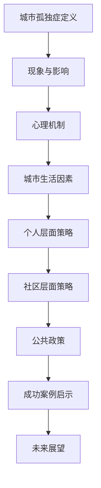

                 

### 《城市孤独症：重建都市生活中的意义连接》

#### 关键词
- 城市孤独症
- 都市生活
- 社会连接
- 心理健康
- 公共政策

#### 摘要
本文深入探讨了“城市孤独症”这一现代社会现象。随着城市化进程的加速，越来越多的人在城市生活中感受到了孤独和意义的缺失。文章首先定义了城市孤独症，分析了其背后的心理机制和社会影响。接着，探讨了城市生活因素、个人应对策略、社区层面策略及公共政策在缓解城市孤独症中的作用。通过国内外成功案例，文章提供了实际可行的解决方案，并对未来城市孤独症的研究和应对提出了展望。

---

### 第一部分：城市孤独症的概念与影响

#### 第1章：城市孤独症的定义与现象

#### 1.1 城市孤独症的基本概念

##### 1.1.1 城市孤独症的定义
城市孤独症，又称为都市孤独症，指的是在城市环境中，个体由于社交隔离、工作压力、生活环境等因素，产生的持续、深刻的孤独感和社会隔离感。

##### 1.1.2 城市孤独症的类型与症状
城市孤独症主要分为以下几类：
- **表面社交型孤独症**：表面上参与社交活动，但内心感到孤独。
- **社交隔离型孤独症**：由于工作、生活环境等原因，缺乏有效的社交机会。
- **虚拟社交型孤独症**：过度依赖虚拟社交平台，而忽视了现实生活中的人际关系。

主要症状包括：
- **情感孤立**：感到被社会排斥，与他人疏远。
- **社交恐惧**：对社交活动感到焦虑和恐惧。
- **精神疲惫**：长时间处于高压力、快节奏的生活中，导致身心疲惫。

#### 1.2 城市孤独症的社会现象

##### 1.2.1 城市化进程与孤独症的关系
随着城市化进程的加速，城市人口密度增加，工作压力增大，导致孤独症现象日益严重。城市化进程不仅改变了人们的生活方式，也影响了人们的心理状态。

##### 1.2.2 城市孤独症的社会影响
城市孤独症对个体和社会都会产生深远影响。对个体而言，可能导致心理健康问题，如抑郁、焦虑等。对社会而言，可能导致社会凝聚力下降，社区氛围恶化。

#### 1.3 城市孤独症的心理机制

##### 1.3.1 城市生活的心理挑战
城市生活的高压环境、快速节奏、高密度人口等因素，给人们的心理带来了巨大的挑战。这些挑战使得个体更容易产生孤独感。

##### 1.3.2 社交网络的利与弊
社交网络在一定程度上缓解了城市孤独症，但同时也带来了新的问题。过度依赖社交网络可能导致现实生活中的社交技能退化，加剧孤独感。

---

### 第二部分：城市孤独症的原因分析

#### 第2章：城市生活因素与孤独症

#### 2.1 高压工作环境

##### 2.1.1 工作压力与孤独症的关系
工作压力是城市孤独症的一个重要原因。高强度的工作环境可能导致个体缺乏足够的社交时间，增加孤独感。

##### 2.1.2 工作时间与社交时间的平衡
在城市生活中，如何平衡工作时间与社交时间，成为缓解孤独症的关键。合理的作息安排和高质量的社交活动，有助于减轻工作压力，提高生活质量。

#### 2.2 高密度人口与社交隔离

##### 2.2.1 城市人口密度的影响
高密度人口增加了社交机会，但同时也可能导致社交隔离。在城市中，人们往往因为工作忙碌、居住环境拥挤等原因，缺乏深层次的社交互动。

##### 2.2.2 社交隔离与孤独症的联系
社交隔离会导致个体感到孤立，增加孤独感。在城市中，社交隔离现象较为普遍，需要采取有效的策略来缓解这一问题。

#### 2.3 数字化时代的孤岛现象

##### 2.3.1 数字化对人际关系的影响
数字化时代，互联网和社交媒体的普及，改变了人们的社交方式。虽然数字化带来了更多的社交机会，但也导致了现实社交的减少。

##### 2.3.2 社交网络中的孤独症
过度依赖社交网络，可能导致个体在现实生活中的社交技能退化，加剧孤独感。因此，如何平衡虚拟社交与现实社交，成为缓解城市孤独症的重要课题。

---

### 第三部分：应对城市孤独症的策略

#### 第3章：个人层面的应对策略

#### 3.1 增强自我认知

##### 3.1.1 自我认知的重要性
自我认知是指个体对自己内心世界的认知和理解。增强自我认知，有助于个体更好地应对孤独感。

##### 3.1.2 提升自我认知的方法
- **心理辅导**：通过专业心理辅导，帮助个体深入了解自己，提升自我认知。
- **自我反思**：通过日常的反思和记录，不断深化对自己内心世界的认识。

#### 3.2 提升社交技能

##### 3.2.1 社交技能的定义与类型
社交技能是指个体在社交过程中，如何与他人沟通、互动的能力。根据社交的场合和目的，社交技能可以分为多种类型。

##### 3.2.2 提升社交技能的实践方法
- **参与社交活动**：通过参加各种社交活动，如聚会、社团等，提升自己的社交技能。
- **学习社交技巧**：通过学习社交技巧，如倾听、表达、沟通等，提高自己的社交能力。

#### 3.3 心理调适

##### 3.3.1 心理调适的重要性
心理调适是指个体在面对压力和挑战时，如何调整自己的心态和行为。良好的心理调适能力，有助于减轻孤独感。

##### 3.3.2 心理调适的方法与实践
- **放松训练**：通过深呼吸、冥想等放松训练，缓解压力，减轻孤独感。
- **积极心态**：培养积极的心态，看待生活中的挑战和困难。

---

### 第四部分：社区层面的应对策略

#### 第4章：社区建设的角色

##### 4.1 社区建设的概念与目标
社区建设是指通过改善社区环境、丰富社区活动、促进社区互动等手段，提高居民的生活质量和幸福感。

##### 4.1.1 社区在应对城市孤独症中的作用
社区是城市生活的重要组成部分，对于缓解城市孤独症具有重要作用。通过社区建设，可以增强居民的社交互动，提高社区凝聚力，从而减轻孤独感。

#### 4.2 社区互动与联系

##### 4.2.1 社区互动的形式与内容
社区互动包括线上和线下多种形式，如社区活动、志愿服务、邻里交流等。这些互动有助于增强居民的社交联系，缓解孤独感。

##### 4.2.2 增强社区互动的方法
- **定期举办活动**：通过定期举办各类活动，如文化节、运动会、讲座等，吸引居民参与，促进社区互动。
- **建立邻里关系**：通过邻里互助、共享资源等方式，建立和加强邻里关系，增强社区凝聚力。

#### 4.3 社区资源的整合与利用

##### 4.3.1 社区资源的种类与来源
社区资源包括公共设施、人力资源、文化资源等。这些资源是社区建设的重要基础。

##### 4.3.2 社区资源的整合与利用策略
- **资源整合**：通过整合各类资源，提高资源利用效率，为社区建设提供有力支持。
- **资源共享**：鼓励居民之间共享资源，如共享停车场、共享厨房等，提高资源利用率。

---

### 第五部分：公共政策与政策建议

#### 第5章：公共政策的作用

##### 5.1 公共政策的作用
公共政策在应对城市孤独症中具有重要作用。通过制定和实施相关政策，可以为城市孤独症提供有效的解决方案。

##### 5.1.1 公共政策对城市孤独症的影响
公共政策可以影响城市生活的各个方面，如城市规划、社区建设、教育等。通过优化这些方面，可以缓解城市孤独症。

##### 5.1.2 公共政策的目标与原则
公共政策的目标是提高居民的生活质量和幸福感，缓解城市孤独症。其原则包括公平性、效率性和可持续性。

#### 5.2 公共政策的具体建议

##### 5.2.1 城市规划与公共空间的优化
- **优化公共空间设计**：通过改善公共空间的设计，提高公共空间的舒适性和实用性，吸引居民参与。
- **增加公共设施投入**：增加对公共设施的投入，如图书馆、公园、健身房等，为居民提供更多的社交机会。

##### 5.2.2 社区支持服务的提供
- **提供心理咨询服务**：为居民提供免费或低收费的心理咨询服务，帮助居民应对孤独感。
- **设立社区活动中心**：设立社区活动中心，组织各类社区活动，增强居民之间的互动。

##### 5.2.3 教育与宣传策略
- **加强教育宣传**：通过学校、社区等渠道，加强对城市孤独症的认识和预防教育。
- **推广社交技能培训**：组织社交技能培训课程，提高居民的社交能力，减轻孤独感。

---

### 第六部分：成功案例与启示

#### 第6章：成功案例与启示

##### 6.1 国内外成功案例介绍
- **国外成功案例**：例如瑞典的“社区支持网络计划”，通过建立社区支持网络，提高了居民的生活质量和幸福感。
- **国内成功案例**：例如杭州的“邻里节”活动，通过举办各类社区活动，增强了居民之间的互动和联系。

##### 6.2 案例启示与借鉴
成功案例为我们提供了宝贵的经验和启示。通过借鉴这些案例，我们可以更好地应对城市孤独症，提高城市生活的质量。

---

### 第七部分：未来展望与持续关注

#### 第7章：未来展望与持续关注

##### 7.1 城市孤独症研究的趋势
随着城市化进程的加快，城市孤独症问题将日益凸显。未来研究将更加关注城市孤独症的预防和治疗，探索新的干预策略。

##### 7.1.1 研究领域的扩展
未来研究将扩展到心理学、社会学、公共卫生等领域，从多角度分析城市孤独症的原因和影响。

##### 7.1.2 新技术的应用
新技术，如人工智能、大数据等，将为城市孤独症的研究和干预提供新的工具和方法。

##### 7.2 持续关注的重要性
城市孤独症是一个长期且严重的社会问题，需要社会各界的持续关注和共同努力。

##### 7.2.1 城市孤独症问题的长期影响
城市孤独症不仅影响个体的心理健康，还可能对整个社会产生负面影响。因此，持续关注和解决城市孤独症问题至关重要。

##### 7.2.2 社会各界持续关注的意义
只有社会各界共同努力，才能有效预防和缓解城市孤独症，提高城市生活的质量。

##### 7.3 未来发展展望
未来，我们将继续关注城市孤独症问题，探索新的解决方案。通过持续的研究和实践，我们有望找到更加有效的应对策略，为城市居民创造更美好的生活。

---

### 附录

#### 附录A：参考文献
- 瑞典“社区支持网络计划”：描述了该计划的具体实施方法和效果。
- 杭州邻里节：介绍了杭州邻里节的活动内容和对居民生活的影响。

#### 附录B：相关书籍
- 《孤独的城市：都市生活的心理挑战与应对策略》
- 《社交网络心理学：虚拟社交与现实生活的平衡》

#### 附录C：网络资源
- 城市孤独症研究基金会：提供了大量关于城市孤独症的研究资料。
- 心理健康网：提供了关于心理健康和孤独症的相关信息。

### Mermaid 流程图

### 数学模型与公式

#### 社交网络中的孤独感程度计算模型

$$
孤独感程度 = f(\text{社交网络使用时间}, \text{社交互动质量}, \text{个人需求满足度})
$$

其中，$f$ 为非线性函数，$\text{社交网络使用时间}$、$\text{社交互动质量}$、$\text{个人需求满足度}$均为影响孤独感程度的因素。

- 社交网络使用时间：反映个人在社交网络上的投入程度，时间越长，孤独感可能越强。
- 社交互动质量：衡量社交互动的有用性和互动深度，质量越高，孤独感越低。
- 个人需求满足度：描述个人需求在社交互动中是否得到满足，满足度越高，孤独感越低。

---

### 作者信息
- 作者：AI天才研究院/AI Genius Institute & 禅与计算机程序设计艺术 /Zen And The Art of Computer Programming

---

#### 文章小结
本文从多个角度探讨了城市孤独症这一现代社会现象，分析了其背后的原因和影响，并提出了个人、社区和公共政策层面的应对策略。通过国内外成功案例，本文提供了实际可行的解决方案，并对未来城市孤独症的研究和应对提出了展望。希望本文能够引起社会各界对城市孤独症问题的关注，共同为建设更美好的城市生活而努力。

