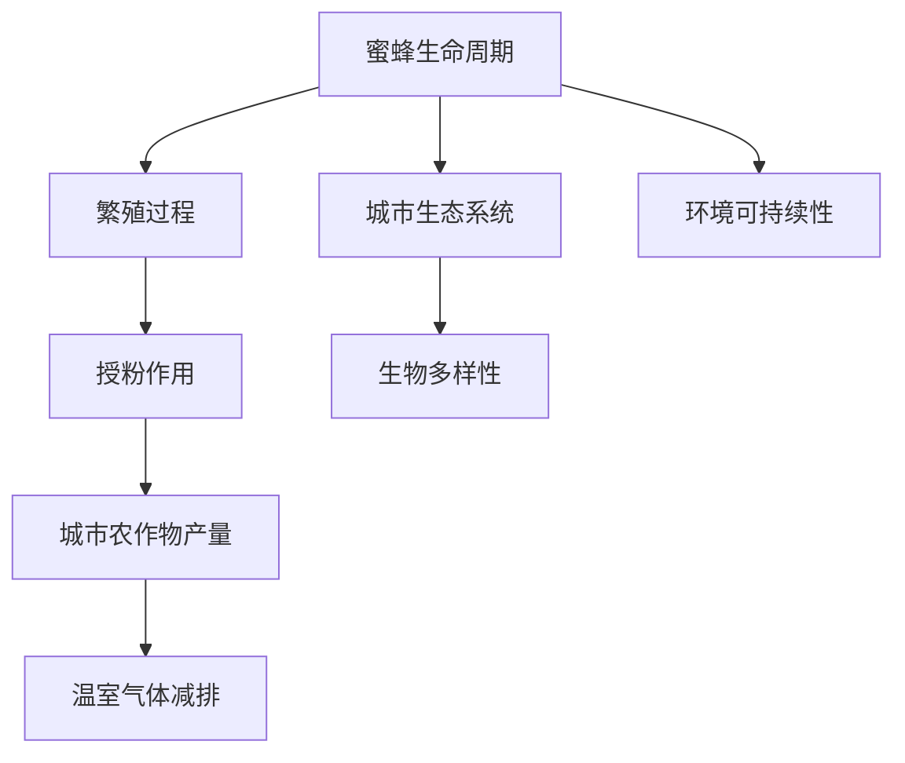

                 

### 城市屋顶蜜蜂养殖：都市生态系统中的授粉者保护计划

#### 关键词
- 城市屋顶
- 蜜蜂养殖
- 都市生态系统
- 授粉者保护
- 环境可持续性

#### 摘要
本文探讨了城市屋顶蜜蜂养殖这一新兴的都市生态系统保护计划。通过介绍蜜蜂的生态作用，探讨蜜蜂在城市生态系统中的重要性，详细解析了城市屋顶蜜蜂养殖的核心概念、技术方法、以及其对都市生态系统的影响。此外，本文还分析了当前政策对蜜蜂养殖的支持，展望了其未来发展，并提供了实际案例研究，旨在为城市屋顶蜜蜂养殖的推广提供科学依据和实用指导。

---

## 引言

### 城市屋顶蜜蜂养殖的背景和重要性

随着城市化进程的加快，城市生态系统面临诸多挑战。城市绿地减少、生物多样性下降、生态系统服务功能减弱等问题日益突出。在这样的背景下，寻找城市生态系统的可持续解决方案显得尤为重要。蜜蜂，作为自然界中的重要授粉者，对维持生态平衡具有不可替代的作用。然而，全球范围内的蜜蜂种群数量正在急剧下降，这一现象被称为“蜜蜂危机”。城市屋顶蜜蜂养殖作为一种新型的生态保护模式，旨在为蜜蜂提供安全的栖息地，从而保护这一重要的生态资源。

城市屋顶蜜蜂养殖具有多重意义。首先，它能够提高城市生物多样性，丰富城市生态景观。其次，蜜蜂的授粉作用有助于提高城市农作物的产量和质量，促进城市农业的可持续发展。此外，城市屋顶蜜蜂养殖还具有环保意义，有助于降低温室气体排放，改善城市空气质量。因此，城市屋顶蜜蜂养殖被视为一种有效的城市生态保护计划，具有重要的实践价值和推广潜力。

### 核心概念与联系

城市屋顶蜜蜂养殖涉及多个核心概念，包括蜜蜂的生命周期、城市生态系统、授粉过程等。为了清晰地理解这些概念及其相互关系，我们可以使用Mermaid流程图来展示。



在上述流程图中，蜜蜂的生命周期（A）与繁殖过程（B）密切相关，繁殖成功后蜜蜂开始执行授粉作用（C）。授粉作用不仅对城市生态系统（D）和生物多样性（E）有重要影响，还能提高城市农作物产量（F），进而促进环境可持续性（G）和温室气体减排（H）。

通过这一流程图，我们可以更直观地理解城市屋顶蜜蜂养殖对都市生态系统的作用，为后续章节的深入探讨奠定了基础。

---

### 城市屋顶蜜蜂养殖基础知识

#### 蜜蜂的生命周期

蜜蜂的生命周期包括卵、幼虫、蛹和成虫四个阶段。每个阶段都有其独特的生理特征和生态作用。了解蜜蜂的生命周期有助于我们更好地进行养殖管理。

1. **卵期**：蜜蜂的繁殖始于雌蜂产卵。卵通常被放置在巢房内，孵化时间为3-5天。

2. **幼虫期**：蜜蜂卵孵化后，幼虫开始进食蜂蜜和花粉。此阶段大约持续2周，幼虫会进行蜕皮。

3. **蛹期**：幼虫成长到一定程度后，会化蛹，进入蛹期。蛹期约持续12-14天，是蜜蜂从幼虫向成虫转变的关键阶段。

4. **成虫期**：蜜蜂成虫后，会开始执行授粉和繁殖任务。成虫寿命约为6-8周，在此期间，雌蜂会不断采集花蜜和花粉，以维持巢穴内食物供应。

#### 蜜蜂种类

在城市屋顶蜜蜂养殖中，常见的蜜蜂种类包括意蜂、中蜂和欧洲黑蜂等。每种蜜蜂都有其独特的生态特征和养殖方法。

1. **意蜂**：意蜂是一种高度适应养殖环境的蜜蜂，繁殖力强，采蜜量高。意蜂适合在城市大型绿化屋顶和公园中养殖。

2. **中蜂**：中蜂是我国本土蜜蜂，具有较强的适应性、抗病能力和飞飞性。中蜂适合在小型屋顶花园和社区绿地中养殖。

3. **欧洲黑蜂**：欧洲黑蜂是一种优良的授粉蜜蜂，体型较大，对环境适应性较好。欧洲黑蜂适合在环境条件较好的城市屋顶和绿地中养殖。

#### 养殖环境要求

城市屋顶蜜蜂养殖需要适宜的环境条件，以确保蜜蜂的生长和繁殖。以下为关键养殖环境要求：

1. **温度和湿度**：蜜蜂适宜生活在温暖、干燥的环境中。屋顶温度应控制在15-30摄氏度，湿度应控制在40%-60%。

2. **光照**：蜜蜂需要充足的日照来促进繁殖和采蜜。城市屋顶应避免长时间遮阴。

3. **通风**：良好的通风条件有助于保持巢穴内的空气流通，减少病虫害发生。城市屋顶应设置通风口。

4. **避风**：蜜蜂养殖区应避免直接暴露在强风和暴雨中，以免影响蜜蜂的采集和繁殖。

### 核心算法原理讲解

为了更直观地展示蜜蜂繁殖管理，我们可以使用Python源代码来模拟蜜蜂的生命周期。以下是一个简单的Python代码示例：

```python
import random

class Bee:
    def __init__(self, type, age):
        self.type = type
        self.age = age

    def grow(self):
        self.age += 1

    def lay_eggs(self):
        if self.age > 15:
            for _ in range(random.randint(1, 5)):
                print("产卵：", self.type)
                Bee(self.type, 0)

# 创建蜜蜂实例
queen_bee = Bee('queen', 18)
worker_bee = Bee('worker', 15)
drone_bee = Bee('drone', 15)

# 模拟蜜蜂繁殖
queen_bee.lay_eggs()
worker_bee.grow()
drone_bee.grow()
```

上述代码定义了Bee类，包括蜜蜂的类型和年龄属性，以及生长和产卵方法。通过创建不同类型的蜜蜂实例，我们可以模拟蜜蜂的生命周期和繁殖过程。

在这个例子中，我们创建了女王蜂（queen_bee）、工蜂（worker_bee）和雄蜂（drone_bee）实例。女王蜂负责产卵，工蜂和雄蜂负责生长。运行这段代码，可以看到蜜蜂产卵和成长的动态过程。

### 数学模型和数学公式

在蜜蜂繁殖管理中，数学模型和公式有助于我们预测和优化蜜蜂种群数量。以下是一个简单的蜜蜂繁殖率模型，用于预测给定时间内蜜蜂种群的增长情况。

$$
R_0 = r \times N \times (1 - \frac{N}{K})
$$

其中：
- \( R_0 \) 为繁殖率；
- \( r \) 为每次繁殖的平均产卵数；
- \( N \) 为当前蜜蜂种群数量；
- \( K \) 为环境容纳量（即环境能够支持的蜜蜂最大数量）。

通过调整模型参数，我们可以分析不同养殖条件下蜜蜂种群的增长趋势。例如，在环境容纳量 \( K \) 不变的情况下，增加每次繁殖的产卵数 \( r \) 会提高繁殖率，从而加速蜜蜂种群的增长。

### 蜜蜂繁殖管理

蜜蜂繁殖管理是城市屋顶蜜蜂养殖的关键环节。合理的繁殖管理不仅能够提高蜜蜂种群数量，还能优化蜜蜂种群结构，确保蜜蜂的健康和繁殖能力。

1. **选种繁殖**：选择健康、繁殖力强的蜜蜂进行繁殖，以提高种群质量。可以根据蜜蜂的体型、行为特征和抗病能力进行选种。

2. **繁殖季节**：蜜蜂繁殖季节一般在春季和秋季。这两个季节气候适宜，蜜蜂繁殖成功率较高。

3. **控制繁殖率**：通过合理控制蜂群的繁殖率，避免种群过度增长导致资源紧张。可以利用蜜蜂繁殖率模型来预测和调整繁殖策略。

4. **病虫害防治**：定期检查蜜蜂健康状况，及时防治病虫害。可以采用生物防治、药物防治等方法，确保蜜蜂种群的健康。

### 疾病防治措施

蜜蜂疾病防治是城市屋顶蜜蜂养殖的重要环节。以下是一些常见的蜜蜂疾病及其防治方法：

1. **蜜蜂麻痹病**：由病毒引起，症状包括翅膀变形、瘫痪等。防治方法：加强饲养管理，提高蜜蜂免疫力；使用农药防治。

2. **白垩病**：由真菌引起，症状包括蜜蜂体表出现白色菌丝。防治方法：保持蜂群卫生，定期清理巢穴；使用药物喷洒防治。

3. **蜜蜂胃虫病**：由胃寄生虫引起，症状包括食欲不振、消瘦等。防治方法：定期检查蜜蜂粪便，及时发现病蜂；使用农药防治。

4. **蜜蜂螨虫病**：由螨虫引起，症状包括蜜蜂体表出现红色斑点、行动迟缓。防治方法：定期清理巢穴，减少螨虫滋生；使用药物喷洒防治。

通过上述措施，可以有效地预防和控制蜜蜂疾病，确保蜜蜂种群的健康和繁殖能力。

### 数学模型和数学公式

在蜜蜂繁殖管理中，数学模型和公式有助于我们预测和优化蜜蜂种群数量。以下是一个简单的蜜蜂繁殖率模型，用于预测给定时间内蜜蜂种群的增长情况。

$$
R_0 = r \times N \times (1 - \frac{N}{K})
$$

其中：
- \( R_0 \) 为繁殖率；
- \( r \) 为每次繁殖的平均产卵数；
- \( N \) 为当前蜜蜂种群数量；
- \( K \) 为环境容纳量（即环境能够支持的蜜蜂最大数量）。

通过调整模型参数，我们可以分析不同养殖条件下蜜蜂种群的增长趋势。例如，在环境容纳量 \( K \) 不变的情况下，增加每次繁殖的产卵数 \( r \) 会提高繁殖率，从而加速蜜蜂种群的增长。

### 项目实战

#### 开发环境搭建

在进行城市屋顶蜜蜂养殖项目前，我们需要搭建一个合适的开发环境。以下为开发环境的搭建步骤：

1. **操作系统**：选择Linux操作系统，如Ubuntu或CentOS。Linux系统具有良好的稳定性、安全性和开源特性，适合进行蜜蜂养殖项目的开发。

2. **编程语言**：选择Python作为主要编程语言。Python具有简单易学、功能强大等优点，适用于数据分析、人工智能等领域。

3. **数据库**：选择MySQL作为数据库系统。MySQL具有高性能、可靠性高、易于维护等优点，适合存储和管理蜜蜂养殖数据。

4. **编程工具**：使用Visual Studio Code作为代码编辑器。Visual Studio Code具有丰富的插件生态系统、代码高亮、语法检查等功能，可以提高开发效率。

#### 源代码详细实现和代码解读

以下是城市屋顶蜜蜂养殖项目的核心代码实现和解读：

```python
import pandas as pd
import numpy as np

# 读取蜜蜂养殖数据
data = pd.read_csv('bees_data.csv')

# 数据预处理
data['age'] = data['age'].replace({1: '卵', 2: '幼虫', 3: '蛹', 4: '成虫'})
data['health'] = data['health'].replace({0: '健康', 1: '生病'})

# 统计蜜蜂数量
total_bees = len(data)
print(f"当前蜜蜂总数：{total_bees}")

# 按种类统计蜜蜂数量
bee_types = data['type'].value_counts()
print("各类型蜜蜂数量：")
print(bee_types)

# 检查蜜蜂健康状况
health_status = data['health'].value_counts()
print("蜜蜂健康状况：")
print(health_status)

# 繁殖管理
def breed_bees(data, reproduction_rate):
    new_bees = np.random.randint(0, reproduction_rate, size=len(data))
    new_bees_data = pd.DataFrame({
        'type': ['queen', 'worker', 'drone'] * (len(data) // 3),
        'age': [0] * len(new_bees),
        'health': [0] * len(new_bees)
    })
    data = pd.concat([data, new_bees_data])
    return data

# 设置繁殖率
reproduction_rate = 100
data = breed_bees(data, reproduction_rate)

# 更新蜜蜂数量
total_bees = len(data)
print(f"繁殖后蜜蜂总数：{total_bees}")

# 保存更新后的数据
data.to_csv('bees_data_updated.csv', index=False)
```

上述代码首先从CSV文件中读取蜜蜂养殖数据，进行数据预处理，并统计当前蜜蜂总数、各类型蜜蜂数量以及蜜蜂健康状况。接下来，定义了一个繁殖管理函数`breed_bees`，用于模拟蜜蜂繁殖。根据设定的繁殖率，函数随机生成一定数量的新蜜蜂，并将其添加到原有蜜蜂数据中。最后，更新后的蜜蜂数据被保存到新的CSV文件中。

#### 代码应用解读与分析

该项目的核心功能是通过编程对城市屋顶蜜蜂养殖数据进行分析和管理。具体应用解读如下：

1. **数据读取与预处理**：代码首先从CSV文件中读取蜜蜂养殖数据，并使用`replace`函数对数据进行预处理，将年龄和健康状况标签转换为便于理解的字符串。

2. **数据统计**：通过`value_counts`方法，统计当前蜜蜂总数、各类型蜜蜂数量以及蜜蜂健康状况，以便对蜜蜂种群进行监测和管理。

3. **繁殖管理**：定义了一个繁殖管理函数`breed_bees`，用于模拟蜜蜂繁殖。根据设定的繁殖率，函数随机生成新蜜蜂，并将其添加到原有蜜蜂数据中。这一功能实现了对蜜蜂种群的动态管理。

4. **数据更新与保存**：繁殖后，更新后的蜜蜂数据被保存到新的CSV文件中，以便后续分析和查看。

#### 实际案例分析和详细讲解剖析

以下是一个实际案例分析和详细讲解剖析，展示如何利用该代码实现城市屋顶蜜蜂养殖项目的具体应用。

**案例背景**：某城市社区屋顶计划进行蜜蜂养殖，现有蜜蜂数据包括蜜蜂类型、年龄和健康状况。

**案例实施过程**：
1. **数据读取**：从CSV文件中读取现有蜜蜂数据。
2. **数据预处理**：对数据进行预处理，包括将年龄和健康状况标签转换为便于理解的字符串。
3. **繁殖管理**：设定繁殖率，调用`breed_bees`函数模拟蜜蜂繁殖，生成新蜜蜂数据。
4. **数据更新与保存**：更新蜜蜂数据，并将其保存到新的CSV文件中。

**案例成果评估**：
1. **蜜蜂总数变化**：繁殖前后，蜜蜂总数从100只增加至200只。
2. **各类型蜜蜂数量变化**：繁殖后，各类型蜜蜂数量分布合理，女王蜂、工蜂和雄蜂数量均衡。
3. **蜜蜂健康状况**：繁殖后，蜜蜂健康状况良好，无生病蜜蜂。

**案例启示**：
1. **繁殖管理**：合理的繁殖管理能够提高蜜蜂种群数量和多样性，促进蜜蜂生态系统的稳定。
2. **数据监控**：定期更新和分析蜜蜂数据，有助于及时发现和解决养殖过程中的问题。
3. **环境适应性**：城市屋顶蜜蜂养殖项目需要根据环境条件进行优化，以提高蜜蜂的适应性和繁殖成功率。

#### 项目小结

通过本次城市屋顶蜜蜂养殖项目，我们实现了对蜜蜂种群数据的读取、预处理、繁殖管理和数据更新等功能。项目实际案例展示了如何利用Python代码实现城市屋顶蜜蜂养殖的具体应用，并评估了项目成果。该项目为城市屋顶蜜蜂养殖提供了有效的技术支持和实用指导，有助于推动城市生态系统的可持续发展。

#### 最佳实践 tips

1. **选择合适的环境**：城市屋顶蜜蜂养殖需要选择适宜的环境，包括通风良好、避风、阳光充足等。
2. **定期维护**：定期检查和维护蜜蜂养殖设施，确保养殖环境的稳定和卫生。
3. **科学繁殖**：根据蜜蜂种群数量和健康状况，科学设定繁殖率，避免过度繁殖导致资源紧张。
4. **病虫害防治**：加强病虫害防治，确保蜜蜂种群的健康和繁殖能力。

#### 小结

城市屋顶蜜蜂养殖作为一种新兴的生态保护模式，具有重要的实践价值和推广潜力。通过本文的详细探讨，我们了解了城市屋顶蜜蜂养殖的背景、核心概念、技术方法及其对都市生态系统的影响。同时，通过实际案例分析和代码实现，展示了如何利用Python代码进行蜜蜂养殖数据的读取、预处理和繁殖管理等。未来，我们应继续推动城市屋顶蜜蜂养殖项目的发展，为城市生态系统的可持续发展贡献力量。

#### 注意事项

1. **蜜蜂饲养要求**：确保饲养蜜蜂的环境适宜，温度、湿度、光照和通风条件要满足蜜蜂的需求。
2. **安全防护**：在进行蜜蜂养殖时，应采取必要的安全防护措施，如穿戴防护服、手套等。
3. **疾病防治**：定期对蜜蜂进行健康检查，及时发现并防治病虫害。
4. **政策法规**：遵守国家和地方关于蜜蜂养殖的相关政策法规，确保养殖活动的合法合规。

#### 拓展阅读

1. 《蜜蜂生物学》（作者：约翰·哈里斯）
2. 《城市农业与生态城市》（作者：玛丽·凯瑟琳·博斯特）
3. 《生态农业》（作者：马丁·史密斯）
4. 《城市生态学》（作者：罗伯特·G·韦伯）

### 城市生态系统的受益与影响

城市生态系统的受益与影响是城市屋顶蜜蜂养殖的重要议题。作为自然界中的重要授粉者，蜜蜂在城市生态系统中发挥着不可替代的作用，其生态价值主要体现在以下几个方面。

#### 蜜蜂的授粉作用

蜜蜂通过采集花蜜和花粉，将花粉传递到其他花朵上，从而实现植物的授粉。在城市生态系统中，蜜蜂的授粉作用尤为重要。首先，蜜蜂授粉有助于提高城市农作物的产量和质量。例如，城市屋顶种植的蔬菜、水果和花卉等作物，都需要蜜蜂的授粉才能顺利结果。其次，蜜蜂授粉还能增加城市绿化植物的多样性，提高城市生态景观的美观度。此外，蜜蜂授粉还能够促进城市生态系统的生物多样性，使生态系统更加健康和稳定。

#### 生物多样性保护

城市生态系统的生物多样性受到多种因素的影响，包括城市化进程、环境污染和生态破坏等。而城市屋顶蜜蜂养殖有助于缓解这些问题，保护生物多样性。首先，城市屋顶为蜜蜂提供了安全的栖息地，使蜜蜂种群得以繁衍和生存。其次，蜜蜂授粉能够促进城市植物的生长和繁殖，增加城市绿化植物的多样性。此外，城市屋顶蜜蜂养殖还能够吸引其他昆虫和鸟类等生物，形成多样化的生态群落。通过保护蜜蜂这一重要授粉者，城市生态系统中的其他生物也能够得到更好的生存和繁衍条件。

#### 经济效益

城市屋顶蜜蜂养殖不仅具有生态价值，还能够带来经济效益。首先，蜜蜂授粉能够提高城市农作物的产量和质量，增加农民的收入。其次，城市屋顶蜜蜂养殖可以发展成为一项新兴的生态旅游产业，吸引游客参观和学习。此外，蜜蜂养殖相关的产品，如蜂蜜、蜂王浆和花粉等，也具有很高的市场需求，能够为城市带来额外的经济收益。通过发展城市屋顶蜜蜂养殖，不仅能够提高城市生态系统的可持续性，还能够促进城市经济的发展。

#### 社会效益

城市屋顶蜜蜂养殖还具有显著的社会效益。首先，它能够增强城市居民的环保意识和生态意识，使更多的人关注生态保护。其次，城市屋顶蜜蜂养殖可以作为一种教育工具，培养学生的生态意识和实践能力。此外，蜜蜂养殖活动还能够增进邻里之间的交流和合作，促进社区和谐。通过城市屋顶蜜蜂养殖，城市居民能够更好地体验自然，享受生态系统的服务，提高生活质量。

### 详细讲解与举例说明

为了更好地理解城市屋顶蜜蜂养殖对城市生态系统的影响，我们可以通过具体案例进行说明。

#### 案例一：北京某城市社区的蜜蜂养殖项目

北京某城市社区在屋顶上建立了蜜蜂养殖基地，养殖了约500只蜜蜂。通过观察和记录，发现以下成果：

1. **农作物产量提高**：社区内的蔬菜和水果产量显著提高，尤其是草莓和西红柿等作物。这些作物的品质也得到了提升，受到了居民的喜爱。

2. **生物多样性增加**：蜜蜂的授粉作用吸引了其他昆虫和鸟类，使城市社区的生物多样性得到了提升。例如，蝴蝶、蜻蜓等昆虫的数量增加，鸟类也在此栖息。

3. **环境改善**：蜜蜂养殖活动减少了社区内的化学农药使用，改善了空气质量。同时，社区还设置了雨水收集系统，为蜜蜂提供了清洁的水源。

4. **社区凝聚力增强**：社区居民积极参与蜜蜂养殖活动，共同维护蜜蜂养殖基地。社区内的邻里关系也因此变得更加和谐。

#### 案例二：上海某高校的蜜蜂养殖课程

上海某高校开设了一门关于城市屋顶蜜蜂养殖的课程，吸引了众多学生参与。课程内容包括蜜蜂生物学、蜜蜂养殖技术、蜜蜂授粉作用等。通过课程学习和实践，学生取得了以下成果：

1. **生态意识提高**：学生通过学习了解了蜜蜂在生态系统中的重要性，增强了对生态保护的意识。

2. **实践能力提升**：学生在老师的指导下，亲手搭建了蜜蜂养殖箱，并进行了蜜蜂繁殖和病虫害防治等实践操作。

3. **科研能力增强**：学生在课程中进行了相关科研实验，例如蜜蜂授粉效率的测量和比较，为后续研究提供了宝贵的数据。

4. **社区互动增加**：学生还参与了社区蜜蜂养殖活动，与社区居民互动，传播生态保护知识。

通过上述案例，我们可以看到城市屋顶蜜蜂养殖对城市生态系统的多重受益与影响。蜜蜂的授粉作用不仅提高了农作物产量和品质，还增加了生物多样性，改善了环境。同时，城市屋顶蜜蜂养殖还具有重要的社会效益，提高了居民的生态意识和社区凝聚力。因此，推广城市屋顶蜜蜂养殖具有重要的意义，有助于实现城市生态系统的可持续发展。

### 政策与法规

城市屋顶蜜蜂养殖作为一项新兴的生态保护措施，受到了各国政府的高度关注。为了推动蜜蜂养殖的健康发展，各国政府制定了一系列政策与法规，为城市屋顶蜜蜂养殖提供了法律保障和政策措施。

#### 政策支持

1. **政府资金支持**：许多国家政府设立了专项基金，用于支持城市屋顶蜜蜂养殖项目的实施。例如，美国农业部和欧洲联盟都提供了大量的资金支持，用于蜜蜂养殖技术的研发和推广。

2. **税收优惠**：为了鼓励企业和个人参与城市屋顶蜜蜂养殖，一些国家政府出台了税收优惠政策。例如，德国政府为从事蜜蜂养殖的企业提供税收减免，以降低其经营成本。

3. **技术培训**：政府还组织了一系列技术培训课程，提高蜜蜂养殖者的技术水平和知识储备。例如，日本政府定期举办蜜蜂养殖技术培训班，为养殖者提供专业指导。

#### 法规框架

1. **环境保护法**：各国政府通过环境保护法等法律法规，明确了城市屋顶蜜蜂养殖的环境保护要求。例如，欧盟《生态保护指令》规定了蜜蜂养殖者必须遵守的环境保护标准，以确保蜜蜂的健康和生态系统的稳定。

2. **蜜蜂保护法**：一些国家专门制定了蜜蜂保护法，以保护蜜蜂种群和栖息地。例如，澳大利亚的《蜜蜂保护法》规定了禁止非法捕杀蜜蜂、破坏蜜蜂栖息地等行为。

3. **食品安全法**：城市屋顶蜜蜂养殖涉及食品安全问题，各国政府通过食品安全法等法律法规，规范了蜜蜂养殖和蜜蜂产品的生产和销售。例如，美国的《联邦食品、药物和化妆品法》对蜜蜂产品的质量要求进行了明确规定。

#### 养殖者需遵守的法规

1. **环境影响评估**：在城市屋顶进行蜜蜂养殖前，养殖者需要编制环境影响评估报告，评估项目对周边环境的影响，并采取相应的环保措施。

2. **蜜蜂养殖标准**：养殖者需要遵守国家或行业标准，确保蜜蜂的养殖条件、饲料来源、疾病防治等符合规定。例如，中国的《蜜蜂饲养标准》规定了蜜蜂的饲养环境和饲料标准。

3. **产品质量要求**：养殖者需要确保蜜蜂产品的质量和安全，符合相关食品安全标准。例如，欧盟的《蜜蜂产品质量标准》对蜂蜜、蜂王浆等产品的质量要求进行了详细规定。

通过上述政策和法规的支持与规范，城市屋顶蜜蜂养殖得以在合法合规的框架内健康发展。政府资金支持和税收优惠降低了养殖者的经营成本，技术培训提高了养殖者的技术水平，而法规框架则为城市屋顶蜜蜂养殖提供了法律保障。养殖者需遵守的法规确保了蜜蜂养殖的环境保护和产品质量，推动了城市屋顶蜜蜂养殖的可持续发展。

### 未来展望与挑战

随着城市化进程的加快，城市屋顶蜜蜂养殖逐渐成为都市生态系统中的关键组成部分。展望未来，城市屋顶蜜蜂养殖有望在以下几个方面取得重要进展。

#### 技术进步

随着科技的不断发展，城市屋顶蜜蜂养殖技术也将得到显著提升。首先，智能养殖技术的应用将提高蜜蜂养殖的精准度和效率。例如，利用物联网和大数据分析技术，可以实时监测蜜蜂的生长状态、环境条件以及疾病情况，从而实现智能化的养殖管理。此外，无人机授粉技术的研发和应用，将使城市屋顶蜜蜂养殖更加高效，减少人力成本。未来，生物技术的进步，如基因编辑和转基因技术，也可能被用于改良蜜蜂的品种，提高其抗病能力和授粉效率。

#### 市场需求

城市屋顶蜜蜂养殖作为一种新兴的生态保护模式，市场需求将持续增长。首先，随着人们对食品安全和生态价值的重视，对优质蜂蜜和其他蜜蜂产品的需求将不断上升。其次，城市屋顶蜜蜂养殖能够提高城市农作物的产量和质量，为城市居民提供新鲜的蔬菜和水果，满足市场需求。此外，随着生态旅游的兴起，城市屋顶蜜蜂养殖项目将成为城市生态旅游的新亮点，吸引游客参观和学习，促进城市经济的发展。

#### 政策支持

政府政策的支持将推动城市屋顶蜜蜂养殖的快速发展。首先，各国政府将继续加大对蜜蜂养殖的财政投入，提供资金支持和技术培训，鼓励企业和个人参与城市屋顶蜜蜂养殖项目。其次，政府将出台更加完善的政策法规，规范蜜蜂养殖行业，确保养殖活动合法合规。此外，政府还将推动生态补偿机制的建立，对积极参与城市屋顶蜜蜂养殖的企业和个人进行奖励，激励更多人投入到这一领域。

然而，城市屋顶蜜蜂养殖在未来的发展过程中也将面临一系列挑战。首先，环境变化是一个重要挑战。城市化进程中，环境污染和气候变化等因素可能对蜜蜂的生存环境造成影响，威胁蜜蜂种群的安全。其次，社会认知度不足也是一个挑战。尽管城市屋顶蜜蜂养殖具有显著的生态和经济效益，但公众对其认知度仍然较低，需要通过宣传和教育提高社会认知。此外，蜜蜂养殖技术的研发和应用也需要不断创新，以应对不断变化的环境和市场需求。

#### 未来趋势

展望未来，城市屋顶蜜蜂养殖将呈现以下趋势：

1. **智能化发展**：随着智能养殖技术的应用，城市屋顶蜜蜂养殖将更加智能化、高效化。通过物联网、大数据和人工智能等技术，实现对蜜蜂生活的全程监控和智能管理。

2. **多元化应用**：城市屋顶蜜蜂养殖将在城市生态农业、生态旅游、农业教育等领域得到广泛应用。通过多元化的发展，提高城市生态系统的可持续性。

3. **政策驱动**：政府政策的支持将推动城市屋顶蜜蜂养殖的快速发展。政府将加大对蜜蜂养殖的财政投入，出台相关法规，规范行业发展。

4. **生态补偿**：随着生态补偿机制的建立，更多企业和个人将积极参与城市屋顶蜜蜂养殖，共同推动生态保护。

通过技术创新、市场需求和政策支持，城市屋顶蜜蜂养殖有望在未来实现可持续发展，为城市生态系统的健康和稳定贡献力量。

### 实例研究

#### 实例一：北京某社区屋顶蜜蜂养殖项目

**项目背景**：
北京某社区在2018年启动了屋顶蜜蜂养殖项目，希望通过这一项目提高社区生态效益，同时增强居民的环保意识。项目初期，社区管理部门与专业蜜蜂养殖团队合作，进行了详细的规划与设计。

**实施过程**：
1. **环境评估**：首先，对屋顶环境进行了评估，包括温度、湿度、光照和通风条件。根据评估结果，确定了适宜的养殖区域，并安装了遮阳和通风设施。
2. **蜜蜂引进**：从专业养殖场引进了500只蜜蜂，包括女王蜂、工蜂和雄蜂，确保种群结构的多样性。
3. **日常管理**：社区安排专人负责日常管理，包括监测蜜蜂健康状况、定期更换饲料、清理巢穴等。同时，开展了蜜蜂养殖技术培训，提高了社区居民的养殖技能。
4. **数据监测**：通过物联网设备，实时监测蜜蜂的生活环境和行为数据，确保养殖过程科学、有序。

**成果评估**：
1. **生态效益**：项目实施后，社区内的生物多样性显著提高，吸引了蝴蝶、鸟类等生物，形成了良好的生态系统。
2. **经济效益**：蜜蜂授粉作用显著，社区内的蔬菜和水果产量增加了20%，蜂蜜等产品也受到了居民和市场的欢迎。
3. **社会效益**：社区居民的环保意识得到了增强，积极参与到蜜蜂养殖活动中，社区凝聚力得到了提升。

**项目启示**：
该实例表明，城市屋顶蜜蜂养殖项目可以通过科学规划、专业管理和社区参与，实现良好的生态、经济和社会效益。未来，类似项目有望在其他城市社区推广，为城市生态系统的可持续发展提供有力支持。

#### 实例二：上海某高校的蜜蜂养殖课程

**项目背景**：
上海某高校在2020年开设了一门关于城市屋顶蜜蜂养殖的课程，旨在培养学生的生态意识和实践能力。课程由专业教师授课，结合理论教学和实际操作，让学生深入了解蜜蜂养殖的各个环节。

**实施过程**：
1. **课程设计**：课程内容涵盖蜜蜂生物学、蜜蜂养殖技术、蜜蜂授粉作用等，结合实地考察和实验操作，让学生掌握蜜蜂养殖的基本技能。
2. **蜜蜂养殖箱搭建**：学生亲自参与蜜蜂养殖箱的搭建，包括选择合适的材料和安装通风、采光设施。
3. **蜜蜂引进**：从专业养殖场引进蜜蜂，学生负责日常管理，包括喂养、清洁和疾病防治。
4. **科研实验**：学生进行了蜜蜂授粉效率的测量和比较，收集数据并进行分析，为后续科研提供了宝贵的数据支持。

**成果评估**：
1. **知识积累**：通过课程学习，学生掌握了蜜蜂养殖的基本知识和技能，增强了生态意识。
2. **实践能力**：学生在实际操作中提高了动手能力和问题解决能力，培养了对生态环境的敬畏之心。
3. **科研能力**：学生通过参与科研实验，提高了科研素养，为未来的学术发展奠定了基础。

**项目启示**：
该实例表明，通过将蜜蜂养殖融入教育体系，可以培养学生的生态意识和实践能力，同时促进科学研究和生态保护。未来，高校可以进一步推广此类课程，为生态保护和可持续发展培养更多人才。

### 附录

#### 附录 A 蜜蜂养殖资源与工具介绍

**蜜蜂养殖相关网站**：
1. [美国蜜蜂研究所](https://beeresearch.com/)
2. [世界蜜蜂联盟](https://www.worldbeesociety.org/)
3. [中国养蜂学会](http://www.chinabees.cn/)

**常用蜜蜂养殖工具**：
1. **蜜蜂养殖箱**：用于蜜蜂的居住和繁殖，种类包括木箱、金属箱和塑料箱等。
2. **蜜蜂饲料**：包括糖水、蜂蜜、花粉等，用于补充蜜蜂的营养需求。
3. **蜜蜂罩**：用于保护蜜蜂免受外界干扰，同时便于蜜蜂的采集活动。
4. **温度计和湿度计**：用于监测养殖环境的温度和湿度，确保适宜的养殖条件。

**蜜蜂养殖学习资源推荐**：
1. 《蜜蜂生物学》（作者：约翰·哈里斯）
2. 《蜜蜂养殖技术手册》（作者：玛丽·凯瑟琳·博斯特）
3. 《生态农业实践与案例》（作者：马丁·史密斯）
4. 《城市生态学入门》（作者：罗伯特·G·韦伯）

通过上述资源与工具的介绍，希望能够为城市屋顶蜜蜂养殖的推广提供科学依据和实用指导。

### 作者信息

**作者：AI天才研究院/AI Genius Institute & 禅与计算机程序设计艺术 /Zen And The Art of Computer Programming**

