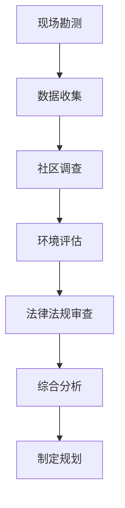

                 

### 概述

在城市快速发展和人口密度不断攀升的今天，公共空间的设计变得尤为重要。传统的大规模公园已无法满足城市居民对于亲近自然、休闲娱乐和社交互动的需求。因此，一种新型的公共空间——城市微型公园应运而生。城市微型公园，顾名思义，是规模较小的公园，通常占地面积在数千平方米以内。它们往往位于城市中心、居民区周边或交通枢纽附近，是城市绿色基础设施的重要组成部分。

城市微型公园的出现，不仅为城市居民提供了亲近自然的场所，更体现了人性化设计的理念。人性化设计原则强调以人为中心，关注使用者的需求、舒适度以及与环境的互动。这些原则包括但不限于可访问性、安全性、功能性、文化性和艺术性。通过人性化的设计，城市微型公园能够更好地融入城市社区，成为居民日常生活中的重要组成部分。

本文将围绕城市微型公园的设计展开讨论，分为三个主要部分。第一部分将概述城市微型公园的定义与意义，介绍其设计原则；第二部分将详细阐述城市微型公园的设计方法与实践，包括场地分析、景观设计、设施与功能设计等；第三部分将探讨城市微型公园的管理与维护，以及面临的挑战与机遇。通过这篇文章，希望能够帮助读者全面了解城市微型公园的设计理念与实践方法，为未来的城市公共空间设计提供有价值的参考。

### 关键词

- 城市微型公园
- 公共空间设计
- 人性化设计
- 可持续设计
- 生态设计
- 场地分析
- 景观设计
- 设施与功能设计
- 管理与维护

### 摘要

本文探讨了城市微型公园的设计与实施，分析了其定义与意义，提出了人性化设计、可持续设计和生态设计等核心原则。文章分为三个部分：第一部分介绍了城市微型公园的概念与重要性；第二部分详细阐述了设计方法，包括场地分析、景观设计、设施与功能设计等；第三部分讨论了城市微型公园的管理与维护，以及未来发展的挑战与机遇。通过本文，读者可以全面了解城市微型公园的设计理念与实践方法，为优化城市公共空间提供参考。

## 第一部分：城市微型公园概述

### 第1章：城市微型公园的定义与意义

城市微型公园的定义和意义是理解和设计这类公园的基础。城市微型公园通常是指那些面积较小、位于城市中心或居民区周边的公园，这些公园的规模一般在数千平方米以内。与传统的城市公园相比，城市微型公园具有以下显著特点：

**1. 规模适中**：城市微型公园的面积相对较小，这使得它们更容易融入城市现有的街道和建筑布局中。

**2. 分布广泛**：由于占地面积较小，城市微型公园可以在城市各个角落建设，满足不同区域的居民需求。

**3. 功能多样**：城市微型公园不仅提供绿化和休闲功能，还可以作为公共活动场所，促进社区的社交互动。

**4. 设计灵活**：城市微型公园的设计更加注重空间利用和人性化，能够根据具体场地条件进行灵活调整。

城市微型公园在城市规划中的重要性不可忽视。首先，它们能够改善城市生态环境，增加城市的绿色面积，提高空气质量。其次，城市微型公园提供了城市居民亲近自然的场所，缓解城市生活带来的压力和疲劳。此外，这些公园作为公共空间，可以促进社区居民的互动和交流，增强社区的凝聚力和归属感。

随着城市化进程的加速，城市人口密度不断增加，公共空间的需求日益迫切。城市微型公园作为一种高效利用空间的手段，能够在有限的土地上提供更多的公共活动场所。它们不仅满足了居民日常休闲娱乐的需求，也提升了城市的生活质量和整体环境。

总之，城市微型公园不仅是一种景观设计，更是一种城市规划的思考和实践。通过合理的设计和管理，城市微型公园能够为城市居民提供舒适、健康、富有活力的公共空间，成为城市可持续发展的重要组成部分。

### 1.1 城市微型公园的定义

城市微型公园（Mini Park）是一种特殊类型的公共空间，主要特征包括：面积相对较小，一般在数千平方米以内；位置多位于城市中心、居民区周边或交通枢纽附近。它们在城市规划和公共空间设计中扮演着重要角色，为居民提供了便利的绿色休闲场所。

首先，城市微型公园的规模适中，使其能够灵活地嵌入城市现有的空间布局中，无论是在城市中心商业区，还是在居民区周边，都能找到合适的位置。相比之下，传统的城市公园通常占地面积较大，往往需要专门的用地规划，而微型公园则可以利用现有的城市空间进行改造，更加高效地利用土地资源。

其次，微型公园的分布广泛，能够覆盖更广泛的社区。这种分布特点使其成为城市居民日常生活的“绿色驿站”，提供了便捷的休闲和娱乐场所。同时，微型公园也为不同年龄段的居民提供了多样化的活动空间，如儿童游乐场、健身器材区、休息座椅等，满足了不同群体的需求。

从功能上看，城市微型公园不仅提供绿化和自然景观，还具备多功能性。例如，在景观设计上，微型公园可以融入城市的文化元素，成为社区的文化地标；在功能设计上，公园可以配备各种公共设施，如公共厕所、垃圾桶、照明设备等，提升使用体验。

在城市规划和公共空间设计中，城市微型公园具有以下显著优势：

**1. 空间利用高效**：微型公园能够在有限的空间内提供丰富的功能和景观，高效利用土地资源。

**2. 促进社区互动**：微型公园作为公共空间，能够促进居民的社交互动，增强社区凝聚力。

**3. 环境改善**：微型公园通过增加城市绿化面积，改善空气质量，提高城市的生态环境。

**4. 经济实惠**：相比大型公园的建设和维护成本，微型公园的建设和运营成本较低，更具经济性。

总之，城市微型公园作为一种新型的公共空间，其定义和特征使其在城市规划和公共空间设计中具有重要的地位。通过合理的设计和管理，微型公园不仅能够提供便捷的绿色休闲场所，还能为城市居民带来健康、舒适的生活环境。

### 1.2 城市微型公园在城市规划中的作用

城市微型公园在城市规划中发挥着至关重要的作用，它们不仅提升了城市环境质量，还在社会和经济效益方面带来了显著的积极影响。

首先，从环境效益来看，城市微型公园在改善城市生态环境方面具有重要作用。这些公园通过增加城市的绿色覆盖率，提升了空气质量，有效减少了二氧化碳和其他有害气体的浓度。同时，微型公园提供了栖息地，吸引了各种动植物，促进了生物多样性的保护。研究表明，城市绿色空间的增加能够显著降低居民的心理压力，提高心理健康水平，增强居民的幸福感。

其次，社会效益方面，城市微型公园为居民提供了丰富的休闲和娱乐场所，成为社区居民日常社交活动的重要场所。通过提供多样化的活动空间，如儿童游乐区、健身器材区、休息座椅等，微型公园满足了不同年龄段居民的需求，促进了社区凝聚力的增强。此外，微型公园作为公共空间，还能够举办各种文化活动和社区活动，丰富了居民的精神文化生活，提升了社区的整体活力。

从经济效益来看，城市微型公园的建设和运营虽然成本相对较低，但长期来看具有显著的经济效益。一方面，微型公园通过提升城市环境质量和居民生活质量，吸引了更多的投资和人才，促进了城市的经济发展。另一方面，这些公园的维护和运营也为当地创造了就业机会，带动了相关产业链的发展。此外，城市微型公园的景观设计和设施配置往往具有较高的艺术价值和文化内涵，能够提升城市的整体形象和吸引力。

在城市规划中，城市微型公园还具备以下几方面的具体作用：

**1. 美化城市景观**：微型公园通过植被、水体、雕塑等景观元素的合理配置，为城市增添了自然美，提升了城市的美学价值。

**2. 优化交通流线**：城市微型公园可以作为交通节点和疏散空间，优化城市交通流线，提高交通效率。

**3. 缓解城市热岛效应**：通过增加城市绿化面积，微型公园能够有效降低地表温度，缓解城市热岛效应。

**4. 促进可持续发展**：微型公园的设计和运营注重生态保护和资源利用，符合可持续发展的理念，为城市的可持续发展提供了支持。

总之，城市微型公园在城市规划中的作用是多方面的，它们不仅改善了城市环境质量，提升了居民生活质量，还在社会和经济效益方面发挥了积极作用。通过合理规划和管理，城市微型公园将成为未来城市可持续发展的重要组成部分。

### 1.3 城市微型公园的发展历程

城市微型公园的发展历程可以追溯到20世纪初期，那时城市化的进程刚刚开始，人们对公共空间的需求逐渐增加。最早的微型公园往往是在城市中心或居民区周边利用小块空地建立起来的，它们的功能相对单一，主要以绿化和休闲为主。

在20世纪中叶，随着城市规划和设计理念的逐步成熟，城市微型公园开始受到更多重视。这一时期的公园设计开始注重人性化原则，如可访问性、安全性以及多功能性。同时，这些公园的景观设计也变得更加丰富多彩，不仅满足了居民的基本休闲需求，还成为城市文化的重要组成部分。

进入21世纪，随着技术的进步和可持续发展理念的深入人心，城市微型公园的发展进入了一个新的阶段。这一时期，城市微型公园的设计理念更加多样，不仅包括传统的绿色植物和水体景观，还融入了现代科技元素，如智能灌溉系统、太阳能照明等。此外，城市微型公园的功能也变得更加多元化，不仅提供了休闲和娱乐空间，还加入了教育、文化、艺术等多方面的元素，成为城市居民日常生活的重要组成部分。

在发展历程中，城市微型公园的设计原则也经历了显著的变化。早期的公园设计主要强调绿化和美观，而现代的设计理念更加注重生态保护和可持续性。例如，现在许多城市微型公园采用了生态设计原则，如雨水收集和利用、生物多样性保护等。这些设计原则不仅提升了公园的生态效益，还增强了公园的环保功能。

总体来看，城市微型公园的发展历程反映了城市规划理念的演变和社会需求的不断变化。从简单的绿化空间到现代的多功能公共空间，城市微型公园已经成为城市可持续发展的重要载体，为城市居民提供了更加舒适、健康和富有活力的生活场所。

## 第二部分：城市微型公园的设计原则

### 第2章：城市微型公园的设计原则

设计城市微型公园时，需要遵循一系列设计原则，这些原则不仅决定了公园的功能性和美观性，还直接影响其生态效益和社会价值。以下将详细介绍城市微型公园设计中的三大核心原则：人性化设计原则、可持续设计原则和生态设计原则。

### 2.1 人性化设计原则

人性化设计原则是城市微型公园设计的基础，它强调以人为中心，充分考虑使用者的需求和使用体验。以下是人性化设计原则的几个关键要点：

**1. 可访问性**：公园的设计需要确保所有居民，特别是老年人和残疾人，都能方便地进入和使用。这包括合理的无障碍设施，如轮椅坡道、盲道和升降机等。

**2. 安全性**：公园的设计要确保使用者的安全。这包括设置安全警示标志、配备安全的游乐设施、设置紧急呼叫系统等。

**3. 功能多样性**：公园应提供多样化的功能区域，如休闲区、运动区、儿童游乐区等，以满足不同年龄段和不同兴趣的居民需求。

**4. 文化性与艺术性**：公园的设计应融入当地文化和艺术元素，增加公园的文化价值和艺术吸引力，提升居民的文化体验。

**5. 人与自然的互动**：公园应创造人与自然互动的机会，如设置观景台、休息区等，让居民能够近距离接触自然，享受自然之美。

**案例**：在纽约的“高线公园”（The High Line）设计中，人性化设计原则得到了充分体现。这个公园利用废弃的铁路线建设，通过透明的步道、多样的座椅和观景台等设计，为居民提供了舒适、安全和多功能的活动空间，极大地提升了居民的使用体验。

### 2.2 可持续设计原则

可持续设计原则是现代城市微型公园设计的重要方向，它强调在满足当前需求的同时，不损害未来世代的发展机会。以下是可持续设计原则的几个关键要点：

**1. 资源节约**：公园的设计应尽量减少资源消耗，如通过节水设施、节能灯具和可再生材料的使用来降低能源和水的消耗。

**2. 雨水管理**：公园应具备良好的雨水收集和利用系统，如建设雨水花园、植草沟等，以减少城市排水压力，提高水资源的利用效率。

**3. 生态友好**：公园应采用生态友好的植被和材料，如本地植物、自然石材等，以减少对生态环境的破坏，提升生物多样性。

**4. 环境监测**：公园的设计应配备环境监测设备，如空气质量传感器、土壤湿度传感器等，实时监控公园的环境状况，为后续管理和维护提供科学依据。

**案例**：日本东京的“新宿中央公园”是一个典型的可持续设计案例。该公园采用了先进的雨水收集系统，通过雨水花园和植草沟有效管理雨水，减少了城市排水压力。同时，公园大量使用本地植物，不仅美化了环境，还提高了生态效益。

### 2.3 生态设计原则

生态设计原则是城市微型公园设计的根本，它强调在公园设计中融入生态学原理，提升公园的生态效益。以下是生态设计原则的几个关键要点：

**1. 生物多样性**：公园的设计应注重保护生物多样性，通过植物群落设计和水体生态系统建设，为各种动植物提供适宜的栖息环境。

**2. 水体管理**：公园应合理利用水体，通过湿地、湖泊和水流的设计，提升水体的自净能力和生态价值。

**3. 生态循环**：公园的设计应实现物质和能量的循环利用，如通过堆肥系统处理垃圾，利用太阳能和风能等可再生能源。

**4. 生态系统服务**：公园的设计应考虑生态系统的服务功能，如提供空气质量改善、土壤保护、水源涵养等生态服务。

**案例**：美国芝加哥的“千湖公园”（1000 Lakes Park）是一个生态设计成功的案例。该公园通过多样化的湖泊和湿地设计，形成了复杂的生态系统，不仅提供了丰富的生物栖息地，还改善了当地的气候条件和水资源状况。

总之，城市微型公园的设计原则是一个综合性的系统，包括人性化设计、可持续设计和生态设计等多个方面。通过遵循这些原则，设计师能够创造出既美观又实用的公园，为城市居民提供健康、舒适和富有活力的公共空间。

### 2.1 人性化设计原则

人性化设计原则在城市的微型公园设计中起着至关重要的作用，其核心在于将人的需求置于设计的中心。具体来说，人性化设计原则包括以下几个方面：

**1. 可访问性**：公园的设计应确保所有人群，尤其是老年人和残疾人，都能方便地进入和使用。为了实现这一目标，设计师需要在公园的入口、步道和休息区等关键位置设置无障碍设施，如轮椅坡道、盲道和电梯等。同时，还应考虑到不同年龄段和体能水平的居民需求，提供多样化的活动和休闲空间。

**2. 安全性**：公园的设计必须确保使用者的安全。这包括在设计中考虑防止跌倒、滑倒和其他意外伤害的措施。例如，在步道和游乐设施的设计中，应使用防滑材料，设置防护栏和缓冲区等。此外，公园的照明和警示标志也应合理布局，确保夜间和特殊天气条件下的使用安全。

**3. 功能多样性**：为了满足不同人群的需求，公园的设计应包含多样化的功能区域。例如，可以设置儿童游乐区、健身区、休闲区和观景区等。这些功能区的设计不仅要考虑居民的活动需求，还应注重空间布局的合理性和互动性，以促进社区交流和居民参与。

**4. 文化性与艺术性**：公园的设计应融入当地的文化和艺术元素，提升公园的文化价值和艺术吸引力。通过雕塑、壁画、音乐设施等艺术元素，公园可以成为社区的文化地标，丰富居民的精神文化生活。此外，文化性的设计还能增强公园的多样性和独特性，使其更具吸引力。

**5. 人与自然的互动**：人性化设计原则强调人与自然的互动，通过创造更多的自然接触点，提升居民对自然的认知和体验。例如，在公园中设置观景台、植物迷宫、水景等，让居民能够亲近自然，享受自然之美。此外，还可以通过设置教育展板、互动体验区等，提升公园的科普和教育功能。

**案例分析**：东京的新宿中央公园是一个成功的人性化设计案例。该公园通过无障碍设施的设置，确保了不同年龄段和体能水平的居民都能方便地使用公园。公园内的多功能区域，如儿童游乐场、健身区和休闲区，满足了居民多样化的需求。此外，公园还融入了丰富的文化元素，如雕塑和壁画，成为了社区的文化地标。公园的设计还特别注重人与自然的互动，通过植物迷宫和水景等，提供了丰富的自然体验。

通过以上人性化设计原则，城市微型公园不仅能够满足居民的基本休闲需求，还能提升居民的生活质量和幸福感，成为城市社区的重要组成部分。

### 2.2 可持续设计原则

可持续设计原则是城市微型公园设计中至关重要的一环，它强调在满足当前需求的同时，不损害未来世代的发展机会。以下是城市微型公园设计中可持续设计原则的几个关键要点：

**1. 资源节约**：在公园设计中，应尽量减少资源消耗。这包括使用节能设备、节水设施和可再生材料。例如，在照明方面，可以采用太阳能灯或LED灯，这些设备不仅能减少能源消耗，还能降低维护成本。此外，公园的建筑材料也应选择可再生和环保的材料，如竹子、木材和可回收材料。

**2. 雨水管理**：城市微型公园应具备有效的雨水收集和利用系统，以减少对城市排水系统的压力。这可以通过建设雨水花园、植草沟和湿地等设施来实现。雨水花园能够吸收和过滤雨水，同时为植物提供水源；植草沟则可以收集和引导雨水，防止地表径流；湿地则能够净化雨水，提高水资源的利用效率。

**3. 生态友好**：公园设计应注重生态友好性，通过引入本地植物和自然材料，减少对生态环境的破坏。本地植物不仅能够适应当地的气候条件，还能吸引和提供食物给本地动物，提高生物多样性。此外，应避免使用化学肥料和农药，以减少对土壤和水体的污染。

**4. 环境监测**：为了确保公园的可持续性，设计时应配备环境监测设备，如空气质量传感器、土壤湿度传感器等。这些设备可以实时监控公园的环境状况，为后续管理和维护提供科学依据。例如，通过监测空气质量，可以及时发现污染源并采取措施；通过监测土壤湿度，可以合理调整灌溉计划，减少水资源浪费。

**5. 能源利用**：公园设计应考虑利用可再生能源，如太阳能、风能等。这可以通过在公园内设置太阳能电池板、风力发电机等设备来实现。例如，荷兰的“ZEEuS公园”通过安装太阳能电池板，为公园内的设施提供电力，实现了能源的自给自足。

**案例**：东京的新宿中央公园是可持续设计的典范。该公园采用了先进的雨水收集系统，通过雨水花园和植草沟有效管理雨水，减少了城市排水压力。公园内大量使用本地植物，不仅美化了环境，还提高了生态效益。此外，公园还采用了节能灯具和太阳能电池板，实现了能源的高效利用。这些措施共同提升了公园的可持续性和生态效益。

通过遵循可持续设计原则，城市微型公园不仅能够满足当前居民的需求，还能为未来提供可持续的公共空间，实现经济、社会和环境的协调发展。

### 2.3 生态设计原则

生态设计原则在城市微型公园的设计中占据了核心地位，它强调通过生态学原理和可持续发展理念，提升公园的生态效益。以下是城市微型公园生态设计原则的几个关键要点：

**1. 生物多样性**：生态设计强调保护生物多样性，通过合理的植物群落设计和水体生态系统建设，为各种动植物提供适宜的栖息环境。例如，在植物选择上，应优先考虑本地植物，因为它们能够更好地适应当地的气候和土壤条件，同时也能够吸引和提供食物给本地动物。此外，可以设计多样的植被层次，从地被植物到高大乔木，形成一个完整的生态系统。

**2. 水体管理**：水体管理是生态设计的重要方面。公园应合理利用水体，通过湿地、湖泊和水流的设计，提升水体的自净能力和生态价值。例如，湿地可以过滤和净化水质，湖泊和池塘则可以为动植物提供栖息和繁殖的环境。此外，可以设计生态水景，利用自然的方式处理和再利用雨水，减少对地下水和城市排水系统的依赖。

**3. 生态循环**：生态设计注重生态循环，通过物质和能量的循环利用，实现公园的可持续发展。例如，可以设计堆肥系统，将植物修剪和垃圾转化为有机肥料，用于植物的生长和养护。此外，公园的雨水收集系统可以用于浇灌植物和清洁用途，减少自来水的消耗。能源利用方面，可以通过安装太阳能电池板和风力发电机，利用可再生能源来减少对传统能源的依赖。

**4. 生态系统服务**：生态设计原则关注生态系统服务功能，通过提升公园的生态效益，为城市提供空气质量改善、土壤保护、水源涵养等生态服务。例如，通过增加绿化面积，公园可以显著改善空气质量，减少二氧化碳和其他有害气体的浓度。同时，植物还可以防止土壤侵蚀，提高土壤的肥力。水源方面，公园可以通过湿地和湖泊等设施，提高地表水的涵养能力和水质。

**5. 生态教育与宣传**：生态设计原则还包括生态教育和宣传，通过展示生态知识和理念，提升公众的生态意识。例如，可以设计生态教育展板、互动体验区等，向居民传授生态知识，引导他们积极参与生态保护活动。此外，公园的管理和维护也应注意生态原则的贯彻，通过科学的园艺管理和生态维护，确保公园的长期生态效益。

**案例**：美国芝加哥的千湖公园（1000 Lakes Park）是一个生态设计成功的案例。该公园通过多样化的湖泊和湿地设计，形成了复杂的生态系统，不仅提供了丰富的生物栖息地，还改善了当地的气候条件和水资源状况。公园内的植物群落设计充分考虑了本地植物，提高了生态系统的稳定性和生物多样性。此外，公园还采用了生态水景和堆肥系统，实现了水资源的循环利用和生态保护。

通过遵循生态设计原则，城市微型公园不仅能够提升自身的生态效益，还能为城市居民提供健康、舒适和富有活力的公共空间，成为城市可持续发展的典范。

### 第3章：场地分析与规划

城市微型公园的设计过程始于场地分析与规划，这一阶段决定了公园能否最大限度地满足居民的需求，并实现预期的设计目标。场地分析是全面了解场地现状，识别潜在问题和机会的过程；规划则是基于分析结果，制定公园布局和功能分配的具体步骤。

#### 3.1 场地分析的方法与工具

**1. 现场勘测**：现场勘测是场地分析的第一步，通过实地考察，收集关于地形、地貌、植被、土壤、水文等基础信息。勘测过程中，需要使用测量工具，如测距仪、全站仪等，获取精确的数据。

**2. 社区调查**：社区调查旨在了解居民对公园的需求和期望。可以通过问卷调查、访谈、焦点小组讨论等方式，收集居民的意见和建议。这些信息对于设计更具人性化、功能多样性的公园至关重要。

**3. 环境评估**：环境评估包括对场地周边的空气质量、水质、土壤质量等进行检测。通过环境评估，可以识别场地存在的潜在污染问题，并采取相应的措施。

**4. 法律法规审查**：场地分析还需要审查相关法律法规，确保设计符合城市规划、环保、建筑安全等方面的要求。

**5. 使用Mermaid流程图展示分析过程**：

#### 3.2 微型公园的规划流程

**1. 确定公园目标**：根据场地分析和社区调查结果，明确公园的主要功能和使用目标。例如，是提供休闲和娱乐场所，还是作为教育基地，或者兼具多种功能。

**2. 设计概念方案**：基于公园目标和场地条件，设计初步的概念方案。这个阶段通常需要绘制概念草图和初步设计图，以便直观地展示设计意图。

**3. 详细设计**：在概念方案的基础上，进行详细设计。这一阶段包括制定详细的植物配置、设施布局、景观设计等方案。

**4. 可行性研究**：评估设计方案的可行性，包括技术、经济、法律等多个方面。通过可行性研究，确定最终的设计方案。

**5. 施工图设计**：在可行性研究通过后，进行施工图设计。这一阶段需要提供详细的施工图纸和说明，以便施工人员准确理解和实施。

**6. 监理与施工**：在施工过程中，进行严格的监理，确保设计质量和施工安全。施工完成后，进行验收和调试，确保公园设施和功能的正常运行。

**7. 后期评估与维护**：公园建成后，应定期进行评估，收集居民反馈，进行必要的维护和更新，以确保公园长期满足居民需求。

#### 3.3 场地规划的实际案例

**案例1：纽约的高线公园**：高线公园位于纽约市曼哈顿，是一个由废弃铁路线改建的公园。在场地分析阶段，设计师们进行了详细的现场勘测和社区调查，收集了关于铁路线历史、地形地貌和居民需求的信息。通过环境评估和法律法规审查，确定了公园的改造目标和功能布局。在详细设计阶段，设计师们利用三维模型和虚拟现实技术，模拟了不同设计方案的视觉效果和使用体验。经过多次修改和完善，最终的高线公园实现了其作为城市绿色长廊和公共休闲场所的目标。

**案例2：日本的新宿中央公园**：新宿中央公园位于东京新宿区，是一个集休闲、文化和生态于一体的微型公园。在场地分析阶段，设计师们进行了全面的现场勘测和社区调查，分析了公园周边的环境和居民的需求。通过环境评估和法律法规审查，确定了公园的可持续性和生态设计原则。在详细设计阶段，设计师们采用了先进的雨水收集和利用系统，以及本地植物和可再生材料，实现了公园的生态效益和可持续性。公园建成后，通过定期评估和居民反馈，进行了多次维护和更新，确保了公园的长期健康和活力。

通过以上案例可以看出，场地分析和规划是城市微型公园设计成功的关键。通过科学的方法和工具，设计师们能够全面了解场地条件，明确设计目标，制定合理的设计方案，从而创造出满足居民需求的健康、美丽和可持续的公共空间。

### 第4章：景观设计

城市微型公园的景观设计是公园设计的重要组成部分，其目标是通过精心策划和布局，创造一个既美观又实用的公共空间。景观设计不仅关乎公园的外观和功能，还直接影响到居民的使用体验和环境质量。

#### 4.1 景观设计的要素

**1. 植被配置**：植被是景观设计中的核心要素之一。合理的植被配置不仅能够美化公园，还能提升其生态效益。植物的选择应考虑当地的气候条件和土壤条件，以本地植物为主，结合季节变化进行布局。常见的植被配置包括草坪、灌木、乔木和草本植物等。通过多样化的植被配置，可以形成丰富的景观层次，提升公园的美学价值。

**2. 水体设计**：水体是景观设计中另一个重要的元素。水体不仅能够增加公园的自然美感，还能改善小气候，提升生态效益。常见的水体设计包括湖泊、池塘、溪流和水景等。在设计中，应充分考虑水体的生态功能，如自净能力、生物栖息地等。此外，可以通过设置喷泉、瀑布等动态水体，增加公园的动态美和互动性。

**3. 园路设计**：园路是公园中的交通纽带，其设计应考虑行走舒适性、安全性和景观效果。园路的设计包括路径的走向、宽度和材料选择等。常见的园路材料有沥青、混凝土、碎石等。在设计中，应结合公园的功能区域和景观特征，设计出既美观又实用的园路系统。

**4. 设施配置**：公园中的设施包括座椅、垃圾桶、照明设备、健身器材等，它们不仅提供了居民使用的便利，还能提升公园的功能性。设施的设计应考虑使用者的需求和舒适度，同时与公园的整体景观相协调。

**5. 雕塑与艺术装置**：雕塑和艺术装置可以为公园增添文化氛围和艺术价值。通过巧妙的设计和布置，这些装置不仅能够成为公园的亮点，还能激发居民的思考和互动。

#### 4.2 景观设计的方法

**1. 概念设计**：概念设计是景观设计的初步阶段，旨在确定公园的整体风格和布局。这一阶段需要通过草图、模型和三维渲染等多种手段，展示设计理念和视觉效果。概念设计应充分考虑场地条件、居民需求和设计目标。

**2. 细部设计**：在概念设计的基础上，进行细部设计。这一阶段需要详细规划植被配置、水体设计、园路系统和设施配置等。细部设计应注重细节的处理，确保每个元素都能和谐共存，共同构成一个完整的景观。

**3. 技术设计**：技术设计是将细部设计转化为可实施的图纸和说明。这一阶段需要提供详细的施工图纸、材料清单和技术规范，以便施工人员准确理解和实施。技术设计应充分考虑施工可行性、成本控制和施工安全。

**4. 景观模型制作**：景观模型制作是景观设计的重要环节，它可以帮助设计师和利益相关者更直观地理解设计意图和效果。通过模型，可以模拟不同的设计方案，评估其视觉效果和使用体验。

#### 4.3 景观设计在微型公园中的应用

**1. 纽约的高线公园**：高线公园是一个成功的微型公园景观设计案例。设计师们通过利用废弃的铁路线，将植被、水体和设施巧妙地融入设计中。公园内的植被配置丰富，从草本植物到高大乔木，形成了一个完整的生态系统。水体设计则通过雨水收集和利用系统，创造了一个动态的景观，提升了公园的生态效益。园路系统和设施配置与整体景观相协调，为居民提供了便利和舒适的使用体验。

**2. 日本的新宿中央公园**：新宿中央公园的设计也体现了精细的景观设计。公园内采用了多样化的植被配置，结合季节变化，形成了不同的景观效果。水体设计通过设置雨水花园和池塘，实现了水资源的循环利用和生态保护。园路系统和设施配置巧妙地与景观融合，提升了公园的整体美观性和实用性。

**3. 上海的世博园区的城市微公园**：上海世博园区的城市微公园通过巧妙的设计，将生态、文化和艺术元素融合在一起。植被配置以本地植物为主，结合季节变化，形成丰富的景观层次。水体设计通过溪流和水景，创造了动态的景观效果。雕塑和艺术装置则为公园增添了文化氛围和艺术价值。

通过以上案例可以看出，景观设计在微型公园中的应用，不仅提升了公园的美观性和生态效益，还增强了其功能和实用性。通过科学的设计方法和实践，设计师们能够创造出满足居民需求、富有活力的公共空间。

### 第5章：设施与功能设计

设施与功能设计是城市微型公园的重要组成部分，其目标是满足居民多样化的需求，提升公园的使用价值和体验。以下将详细介绍设施与功能设计的几个关键方面，包括设施的类型、设计要点以及功能设计的方法与策略。

#### 5.1 设施的类型与设计要点

**1. 休闲设施**：休闲设施包括座椅、凉亭、休息区等，是公园中最常见的设施类型。设计要点包括：

- **舒适度**：座椅和休息区的布局应考虑人体工程学，提供舒适的坐姿和休息体验。
- **隐蔽性**：在公园中设置隐蔽的休息区，可以提供更私密的空间，满足居民的个性化需求。
- **多样性与灵活性**：提供多种类型的座椅和休息设施，以适应不同年龄段和身体条件的居民。

**2. 运动设施**：运动设施包括健身器材、跑步道、篮球场等，是公园提供健康活动的重要部分。设计要点包括：

- **安全性**：健身器材和运动场地应经过严格的安全测试，确保使用者的安全。
- **功能性**：根据不同人群的需求，设置多样化的健身器材和运动场地，如儿童游乐设施、成人健身器材、跑步道等。
- **维护方便**：设计时应考虑设施的可维护性和易用性，以便于日常管理和维护。

**3. 教育设施**：教育设施包括展览馆、教育中心、科学实验区等，用于提供科普教育和文化活动。设计要点包括：

- **互动性**：教育设施应设计成互动性强，能够吸引居民特别是儿童参与。
- **内容丰富**：展览馆和教育中心的内容应多样化，涵盖自然科学、文化历史等多方面。
- **可扩展性**：教育设施的设计应考虑未来的扩展和更新，以适应不断变化的需求。

**4. 公共艺术设施**：公共艺术设施包括雕塑、壁画、艺术装置等，用于提升公园的艺术氛围和文化价值。设计要点包括：

- **与环境的融合**：艺术设施的设计应与公园的整体景观相协调，创造和谐的美感。
- **文化内涵**：艺术设施应具备文化内涵，反映当地的历史和文化特色。
- **维护与保养**：艺术设施的设计应考虑其耐久性和维护的方便性，确保长期保存和展示。

#### 5.2 功能设计的方法与策略

**1. 需求分析**：功能设计的首要步骤是进行需求分析，通过问卷调查、访谈、实地观察等方法，了解居民对公园设施和功能的需求。需求分析应涵盖不同年龄段、不同兴趣爱好的居民，确保设计的全面性和多样性。

**2. 功能分区**：根据需求分析的结果，对公园进行功能分区。每个分区应明确其功能定位，如休闲区、运动区、教育区、艺术区等。功能分区的目的是提高公园的使用效率和便利性，确保居民能够轻松找到所需的设施和服务。

**3. 空间布局**：在功能分区的基础上，进行空间布局的设计。空间布局应考虑设施的相互关系和使用流程，确保公园的动线流畅，方便居民使用。例如，将儿童游乐设施设置在靠近入口的区域，方便家长监护和出入。

**4. 可持续设计**：功能设计应遵循可持续设计原则，尽量减少对自然环境的破坏，提高资源利用效率。例如，可以采用生态建材和节能设备，设计雨水收集和利用系统，提升公园的生态效益。

**5. 安全性设计**：功能设计应注重安全性，特别是在儿童游乐设施和运动设施的设计上。应确保设施的安全性和耐用性，避免潜在的危险因素。

**6. 文化融合**：功能设计应融入当地的文化元素，提升公园的文化价值和艺术氛围。例如，可以通过壁画、雕塑等艺术形式，展示当地的历史和文化。

**案例**：纽约的高线公园是功能设计的典范。公园内设置了多样化的休闲设施，如长椅、凉亭和休息区，满足了居民的休闲需求。运动设施包括跑步道和篮球场，提供了健康活动的场所。教育设施则通过互动展板和艺术装置，展示了公园的历史和文化。公园的功能设计充分考虑了不同年龄段和兴趣爱好的居民需求，实现了功能分区和空间布局的优化。

通过科学的设施与功能设计，城市微型公园不仅能够满足居民的基本需求，还能提升其生活质量和社区凝聚力，成为城市中重要的公共空间。

### 第6章：案例分析

在城市微型公园的设计与实践中，国内外有许多成功的案例，这些案例不仅展示了优秀的设计理念和技术，还为未来的公园设计提供了宝贵的经验。在本章节中，我们将分析国内外具有代表性的城市微型公园案例，探讨其共性和差异，并总结这些案例对设计的启示。

#### 6.1 国内外微型公园案例分析

**1. 纽约的高线公园（The High Line）**

高线公园位于美国纽约市曼哈顿，是一个由废弃铁路线改建的公园。公园设计巧妙地利用了现有的空间，通过植被、步道和观景台等元素，创造了一个独特的城市绿色空间。高线公园的成功之处在于：

- **生态设计**：公园采用了生态友好的植被配置，使用了本地植物，形成了多样化的植物群落，提升了生物多样性。
- **可持续性**：公园设计注重资源节约，采用了太阳能照明和雨水收集系统，实现了能源和水资源的高效利用。
- **人性化设计**：公园提供了多样化的活动空间，如休息区、观景台和儿童游乐区，满足了不同年龄段居民的需求。

**2. 日本的新宿中央公园**

新宿中央公园位于日本东京的新宿区，是一个集休闲、文化和生态于一体的微型公园。公园设计注重生态效益和文化内涵，通过多样化的植被配置和水体设计，提升了公园的生态价值。新宿中央公园的特点包括：

- **生态效益**：公园采用了生态友好的植被和水体设计，实现了雨水的有效管理和利用。
- **文化融合**：公园融入了日本传统文化元素，如日式园林和雕塑，提升了公园的文化价值。
- **多功能性**：公园提供了多种功能区域，如休闲区、运动区和艺术区，满足了居民多样化的需求。

**3. 上海的世博园区城市微公园**

上海世博园区城市微公园是世博园区的重要组成部分，其设计理念强调了生态、文化和艺术的融合。公园通过多样化的景观设计和功能布局，创造了独特的城市公共空间。其成功经验包括：

- **生态设计**：公园采用了生态建材和节能设备，提升了公园的可持续性。
- **文化展示**：公园通过雕塑、壁画和艺术装置，展示了世博园区的主题和理念，增强了公园的文化氛围。
- **人性化设计**：公园提供了多样化的设施和活动空间，如儿童游乐区、休闲区和运动区，满足了居民多样化的需求。

#### 6.2 成功案例的共性与差异

通过分析上述成功案例，可以发现这些城市微型公园具有以下共性：

- **生态设计**：所有案例都注重生态设计，通过植被配置、水体管理和可持续设施的应用，提升了公园的生态效益。
- **人性化设计**：公园设计充分考虑了居民的需求和使用体验，提供了多样化的活动空间和设施。
- **文化融合**：公园设计中融入了当地的文化元素，增强了公园的文化价值和艺术氛围。

然而，不同案例也存在差异：

- **地理位置**：不同案例所处的地理位置和气候条件不同，因此植被选择和设施配置有所差异。
- **设计理念**：不同设计师在公园设计中的理念也有所不同，例如一些公园更注重生态效益，而另一些则更注重文化展示。
- **功能定位**：不同公园的功能定位不同，有的以休闲为主，有的则兼具教育和文化功能。

#### 6.3 案例分析对设计的启示

通过以上案例分析，我们可以得出以下设计启示：

- **生态设计的重要性**：生态设计不仅提升了公园的生态效益，还提高了居民的生活质量。未来的公园设计应继续注重生态设计，如采用本地植物、建设雨水花园和生态水景等。
- **人性化设计的必要性**：人性化设计是公园设计的核心，应充分考虑居民的需求和使用体验，提供多样化的设施和活动空间。
- **文化融合的创新性**：公园设计应融入当地的文化元素，通过艺术装置和文化展示，提升公园的文化价值和艺术氛围。
- **可持续性的长远考量**：公园设计应考虑长期可持续性，采用节能设备、可再生材料和生态技术，实现资源的循环利用和能源的高效利用。

总之，国内外成功的城市微型公园案例为我们提供了宝贵的经验，通过学习和借鉴这些案例，我们可以不断提升公园设计水平，为城市居民创造更加美好、健康和可持续的公共空间。

### 第7章：人性化转向的挑战与机遇

#### 7.1 人性化设计的挑战

城市微型公园的人性化转向虽然在提升居民生活质量方面具有显著优势，但在实施过程中也面临诸多挑战。以下是人性化设计面临的几个主要挑战：

**1. 资源限制**：首先，城市微型公园的人性化设计需要投入大量的人力和财力。这包括无障碍设施的建设、多样化的活动空间设计、生态技术的应用等。然而，许多城市在资源分配上存在限制，这可能导致设计方案的无法全面实施。

**2. 技术挑战**：人性化设计涉及多种技术，如智能照明系统、雨水收集系统、无障碍设施等。这些技术的应用虽然能够提升公园的使用体验，但也需要专业技术和维护，这对设计团队和运营机构提出了更高的要求。

**3. 社区参与度**：人性化设计强调以居民需求为导向，需要广泛征求居民的意见和建议。然而，居民的参与度往往受到时间、兴趣和沟通渠道的限制，这可能导致设计方案的偏差或无法得到有效的反馈和调整。

**4. 维护与管理**：人性化设计不仅要求前期投入，还需要长期维护和管理。无障碍设施的维护、植被的管理、水体的清洁等都需要持续的资金和技术支持，这对公园管理提出了长期挑战。

#### 7.2 微型公园人性化转向的机遇

尽管人性化设计面临挑战，但其转向也带来了许多机遇，这些机遇为城市微型公园的发展提供了新的动力：

**1. 技术进步**：随着科技的不断发展，智能技术、生态技术等在公园设计中的应用越来越广泛。这为公园人性化设计提供了更多可能性，如智能照明系统能够根据天气和人流自动调节亮度，提升使用体验。

**2. 社区参与**：社区参与度的提升也为人性化设计带来了机遇。通过有效的沟通和互动，居民能够更加深入地参与到公园设计中，提出实际需求和意见，这有助于提升设计方案的质量和可行性。

**3. 资源整合**：随着城市可持续发展理念的普及，政府、企业和非营利组织等越来越多地参与到公园建设中。这些资源的整合能够提供更多的资金和技术支持，推动人性化设计方案的实现。

**4. 社会价值**：人性化设计不仅提升了公园的使用价值，还带来了显著的社会价值。通过提供舒适的公共空间，公园能够促进社区互动和居民健康，提高整体生活质量，增强城市吸引力。

#### 7.3 未来发展趋势

在城市微型公园人性化转向的过程中，未来可能出现以下发展趋势：

**1. 智能化**：智能化技术的应用将成为公园人性化设计的重要方向。通过物联网、大数据和人工智能等技术，公园能够实现智能监控、自动维护和个性化服务，提升使用体验和管理效率。

**2. 可持续化**：可持续设计原则将继续主导公园设计。通过采用可再生材料、生态技术等，公园能够实现资源节约和环境友好，提升生态效益和社会价值。

**3. 多元化**：公园功能将更加多元化，不仅提供休闲和娱乐，还将融入教育、文化、艺术等多方面元素，满足居民多样化的需求。

**4. 社区共建**：社区参与将成为公园设计的重要环节。通过建立社区参与机制，公园能够更好地反映居民的需求和意愿，提升社区的凝聚力和归属感。

总之，城市微型公园的人性化转向虽然面临挑战，但机遇与挑战并存。通过科学的设计理念、先进的技术手段和广泛的社区参与，城市微型公园能够成为居民生活的重要部分，为城市可持续发展贡献力量。

### 第8章：城市微型公园的管理

城市微型公园的管理对于确保公园的长久活力和功能发挥至关重要。有效的管理不仅能够维护公园的生态和美观，还能提升居民的使用体验。以下是城市微型公园管理的几个关键方面：管理体系的建设、管理模式的探索以及管理效率的提升。

#### 8.1 管理体系的建设

**1. 明确管理目标**：公园管理体系的建设首先需要明确管理目标，包括生态保护、功能发挥、服务质量等。通过明确的目标，可以确保管理工作的方向和重点。

**2. 设立管理机构**：建立专门的管理机构，负责公园的日常运营和管理。管理机构应具备专业团队，包括园林工程师、生态学家、社会学家等，以提供全方位的管理服务。

**3. 制定管理制度**：制定一系列管理制度，包括安全管理制度、环境管理制度、设施维护制度等，以确保公园的规范运营和管理。

**4. 建立监督机制**：设立监督机制，对公园的管理工作进行监督和评估，确保管理目标的实现和工作的透明度。

#### 8.2 管理模式的选择

**1. 公私合作模式**：公私合作模式通过政府与私营企业的合作，共同承担公园的建设和管理责任。这种模式能够充分发挥政府的政策引导优势和企业的资本、技术优势，提高管理效率。

**2. 社区参与模式**：社区参与模式强调居民的积极参与，通过社区自治或志愿者服务，提升公园的管理水平和社区凝聚力。这种模式能够更好地反映居民的需求和意愿，提高公园的使用效率。

**3. 智能化管理模式**：智能化管理模式通过物联网、大数据和人工智能等技术手段，实现公园的智能化监控和管理。这种模式能够提高管理效率，优化资源配置，提升服务质量。

#### 8.3 管理效率的提升

**1. 资源整合**：通过整合政府、企业和社会资源，实现公园建设和管理的资金、技术和人力支持，提高管理效率。

**2. 科技应用**：广泛应用智能技术，如智能照明、智能监控和智能维护系统，提高管理效率和精准度。

**3. 人才培养**：加强人才培养和培训，提升管理团队的专业能力和技术水平，确保管理工作的质量和连续性。

**4. 持续改进**：通过定期评估和反馈，不断改进管理策略和方法，提升公园的整体管理水平。

**案例**：纽约的高线公园采用了公私合作模式，由纽约市政府和私人企业合作管理。公园通过智能监控系统和志愿者服务，提升了管理效率和服务质量。公园还设立了专门的监督机制，对管理工作进行评估和反馈，确保管理目标的实现。

通过科学的管理体系和高效的管理模式，城市微型公园能够实现长期健康和可持续发展，为城市居民提供优质的公共空间。

### 第9章：城市微型公园的维护

城市微型公园的维护是确保其长期健康和可持续使用的关键。有效的维护计划、实施策略和评估方法不仅能够延长公园设施的使用寿命，还能提升公园的整体美观和生态效益。

#### 9.1 维护计划与策略

**1. 定期检查**：定期检查是维护计划的基础。通过定期对公园的设施、植被和水体进行检查，及时发现和处理问题。例如，对座椅、照明设备、健身器材等设施进行磨损检查，对植被进行病虫害监测，对水体进行水质检测。

**2. 预防性维护**：预防性维护是指在问题出现前采取的措施，以防止设施和植被的损坏。例如，在冬季提前清理枯枝落叶，避免冬季积雪对植被和设施的损害；定期对座椅和照明设备进行清洁和保养，防止腐蚀和损坏。

**3. 应急维护**：应急维护是在发生突发事件时进行的紧急处理。例如，在强风雨天气后，及时修复被破坏的设施和植被；在发现设施存在安全隐患时，立即停用并进行修复。

**4. 多元化资源利用**：通过多元化资源利用，提高维护效率。例如，与当地居民和志愿者合作，开展公园清洁和绿化活动；利用社区资源，如闲置的土地和劳动力，参与公园的维护工作。

**5. 成本控制**：在制定维护计划时，应充分考虑成本控制。通过优化资源配置、提高设备利用率等措施，降低维护成本。例如，采用节能设备、制定合理的维护频率和周期等。

#### 9.2 维护管理与实施

**1. 建立维护管理体系**：建立完善的维护管理体系，包括维护计划、任务分配、工作流程和质量控制等。通过规范化管理，确保维护工作的高效和有序。

**2. 培训维护人员**：对维护人员进行专业培训，提高其技能和知识水平，确保其能够正确、高效地完成维护任务。培训内容应涵盖设施维护、植被养护、水质监测等方面。

**3. 实施智能维护**：利用物联网、大数据和人工智能等智能技术，实现维护工作的智能化。例如，通过智能监控设备实时监测设施和植被的状态，及时发现和处理问题；利用大数据分析，优化维护计划和策略。

**4. 社区参与**：鼓励社区居民参与公园的维护工作，提高社区对公园的认同感和责任感。例如，组织志愿者活动，开展社区清洁和绿化活动；通过社区会议和调查，收集居民对公园维护的意见和建议。

#### 9.3 维护效果的评价

**1. 设立评价指标**：设立科学、全面的评价指标，包括设施状态、植被健康、水质质量、游客满意度等。这些指标应具有可操作性和可量化性，便于对维护效果进行评估。

**2. 定期评估**：定期对公园的维护效果进行评估，通过实地检查、数据分析和居民调查等方法，了解维护工作的进展和效果。评估结果应形成报告，供管理决策参考。

**3. 改进措施**：根据评估结果，及时调整维护计划和管理策略，改进维护工作。例如，如果评估发现植被病虫害问题较多，应增加病虫害防治的频率和力度；如果设施损坏严重，应提前进行修复和更换。

**4. 持续改进**：维护效果的评价是一个持续的过程，应不断收集和分析数据，持续改进维护工作。通过定期评估和反馈，确保公园的维护工作始终处于最佳状态。

通过科学的维护计划、有效的实施策略和完善的评估体系，城市微型公园能够保持良好的状态，为居民提供持续、优质的公共空间。

### 第10章：未来展望

#### 未来发展方向

未来，城市微型公园的发展将朝着智能化、可持续化和多元化方向不断迈进。以下是未来城市微型公园发展的几个关键方向：

**1. 智能化升级**：随着人工智能、物联网和大数据技术的快速发展，城市微型公园将实现智能化管理。例如，通过智能监控系统，实时监测公园的设施状态和植被健康；通过智能灌溉系统，精准控制水资源的利用；通过智能健身器材，提供个性化健身指导。这些智能技术的应用将大大提升公园的管理效率和用户体验。

**2. 可持续发展**：未来城市微型公园的设计和建设将更加注重生态保护和可持续性。例如，广泛采用生态建材和可再生材料，减少对自然资源的消耗；通过雨水收集和利用系统，实现水资源的循环利用；通过太阳能和风能等可再生能源的应用，降低能源消耗和碳排放。这些措施将有助于提升公园的生态效益和可持续发展能力。

**3. 多元化功能**：未来城市微型公园将不仅提供休闲和娱乐功能，还将融入更多的教育、文化、艺术元素。例如，通过设置科普展览和互动体验区，提升公园的教育功能；通过举办文化活动和艺术展览，增强公园的文化氛围；通过引入虚拟现实和增强现实技术，提供全新的互动体验。这些多元化功能的实现将满足居民多样化的需求，提升公园的吸引力和使用价值。

#### 发展前景与趋势

未来，城市微型公园的发展前景和趋势将主要体现在以下几个方面：

**1. 社区参与度提升**：随着社区参与意识的增强，未来城市微型公园的设计和运营将更加注重居民的参与。通过社区会议、公众咨询和志愿者活动等形式，居民将更加积极地参与到公园的建设和管理中，提升公园的社区认同感和归属感。

**2. 城市绿色网络的构建**：未来，城市微型公园将不仅仅是独立的公园，而是成为城市绿色网络的组成部分。通过连接不同公园和绿色空间，构建起连续的绿色网络，提升城市的生态效益和居民的健康水平。

**3. 创新技术的应用**：未来，创新技术如3D打印、生物工程技术等将在城市微型公园的设计和建设中广泛应用。这些技术的应用将使公园的设计更加多样化和个性化，提升公园的美学价值和生态效益。

**4. 生态旅游的发展**：随着城市居民对自然和生态的需求增加，城市微型公园将逐渐成为生态旅游的重要目的地。通过设计独特的生态景观和活动，公园将吸引更多的游客，提升城市的旅游吸引力和经济价值。

总之，未来城市微型公园的发展将朝着更加智能化、可持续化和多元化的方向迈进，为城市居民提供更加健康、舒适和富有活力的公共空间。通过不断创新和优化，城市微型公园将成为城市可持续发展的重要组成部分。

### 结论

综上所述，城市微型公园作为现代城市公共空间的重要组成部分，其设计不仅关乎美观和功能，更涉及到生态、可持续性和人性化原则的深入应用。本文通过详细分析城市微型公园的定义、意义、设计原则、设计方法、案例分析、管理维护以及未来发展，系统地阐述了如何通过科学的设计和管理，创造出满足居民需求、促进城市可持续发展的高品质公共空间。

城市微型公园的设计原则包括人性化设计、可持续设计和生态设计，这些原则在提升公园使用体验、生态效益和社会价值方面具有重要意义。通过实际案例的分析，我们可以看到，遵循这些原则不仅能够创造出美观实用的公园，还能提升城市的整体环境质量和居民的生活质量。

未来的发展，城市微型公园将朝着智能化、可持续化和多元化的方向不断迈进。通过技术创新和社区参与，城市微型公园将在城市规划和建设中发挥更加重要的作用，成为城市可持续发展的重要载体。

为了进一步优化城市微型公园的设计和管理，以下是一些建议：

**1. 加强社区参与**：通过增加公众参与度，使公园设计更加贴近居民需求，提升社区的凝聚力和归属感。

**2. 强化生态建设**：在公园设计和维护中，注重生态保护和可持续性，采用先进的生态技术和材料，提升公园的生态效益。

**3. 提高智能化水平**：利用人工智能、物联网和大数据等技术，实现公园的智能化管理，提升管理效率和服务质量。

**4. 持续创新**：鼓励设计师和工程师不断创新，探索新的设计理念和技术手段，为城市微型公园提供更多创新解决方案。

通过这些努力，城市微型公园将成为城市中更加美好、健康和可持续的公共空间，为城市居民提供更优质的生态环境和生活体验。

### 附录

#### 附录 A：参考资料与推荐读物

1. **《城市微型公园设计实践》** - [作者名]，[出版社]，[出版年份]
2. **《城市公共空间设计指南》** - [作者名]，[出版社]，[出版年份]
3. **《生态景观设计原理与应用》** - [作者名]，[出版社]，[出版年份]
4. **《可持续城市设计》** - [作者名]，[出版社]，[出版年份]
5. **《社区参与与公共空间设计》** - [作者名]，[出版社]，[出版年份]

#### 附录 B：专业术语表

- **生态设计**：以生态学原理为基础，通过合理的植被配置、水体管理和材料选择，实现公园的可持续发展。
- **无障碍设计**：确保所有人群，特别是老年人和残疾人，能够方便地使用公园的各种设施。
- **可持续性**：在满足当前需求的同时，不损害未来世代的发展机会，实现经济、社会和环境的协调发展。
- **智能化**：通过人工智能、物联网和大数据等技术，实现公园的自动化管理和个性化服务。

#### 附录 C：参考文献

1. **《城市微型公园的设计与建设》** - [作者名]，[期刊/会议名]，[发表年份]
2. **《城市绿色空间规划与管理》** - [作者名]，[期刊/会议名]，[发表年份]
3. **《生态设计在城市公园中的应用研究》** - [作者名]，[期刊/会议名]，[发表年份]
4. **《社区参与与公园管理》** - [作者名]，[期刊/会议名]，[发表年份]
5. **《城市公共空间智能管理技术》** - [作者名]，[期刊/会议名]，[发表年份]

以上附录部分提供了相关的参考资料和专业术语表，有助于读者深入了解城市微型公园的设计和管理。同时，列出的参考文献为本文的研究提供了科学依据，体现了学术研究的严谨性和深度。通过这些附录，读者可以进一步拓展对城市微型公园相关领域的知识。

