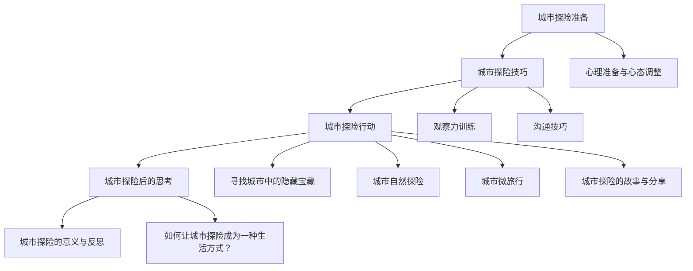

                 

# 城市微型探险：重新发现日常生活中的冒险

> 关键词：城市探险，日常冒险，生活发现，观察力，沟通技巧，个人成长，社区互动

> 摘要：本文探讨了如何在繁忙的都市生活中，通过进行微型探险活动，重新发现日常生活的乐趣和冒险。从准备工作、技巧学习到探险行动，再到分享和反思，本文提供了一个全面的城市探险指南，帮助读者提升观察力、沟通能力，增强个人成长和社会互动，让生活充满活力。

## 引言

在快速发展的现代社会，我们的生活节奏不断加快，很多人似乎忘记了如何放松和享受生活。城市探险作为一种重新发现日常生活乐趣的方式，正逐渐受到人们的青睐。那么，为什么我们需要城市微型探险呢？

### 1. 为什么我们需要城市微型探险？

城市微型探险不仅仅是为了寻找新的景点或体验，更是为了在日常生活中寻找冒险和乐趣。它能够帮助我们在繁忙的生活中放松心情，提升观察力和思考力，增强社交能力，甚至可以促进我们的个人成长。

#### 1.1 城市微型探险的定义和意义

城市微型探险，指的是在日常生活中，通过探索周围的环境、与人沟通、体验不同的文化活动等方式，来发现和体验生活中的小确幸和小冒险。它具有以下几个方面的意义：

- **重新发现日常生活**：通过城市探险，我们可以重新发现我们熟悉的街区、公园、博物馆等，让生活变得更有趣。
- **提升观察力和思考力**：在城市探险中，我们需要不断观察周围的环境和人物，思考他们的行为和动机，这有助于提升我们的观察力和思考力。
- **增强社交能力**：与陌生人沟通、参加社区活动等，可以帮助我们更好地与他人交流和互动，增强社交能力。
- **促进个人成长**：通过城市探险，我们可以不断学习新知识、体验新事物，从而促进个人成长。

## 第一部分：城市探险准备

### 第1章：城市探险者手册

#### 1.1 探险前的准备工作

在进行城市探险之前，准备工作至关重要。以下是一些探险前的准备工作：

##### 1.1.1 如何选择探险地点？

- **根据兴趣选择**：根据你的兴趣和爱好，选择你感兴趣的地区或景点进行探险。
- **考虑时间因素**：选择一个适合你时间安排的地点，避免过度疲劳。
- **了解当地信息**：了解目的地的历史、文化、特色等信息，有助于更好地进行探险。

##### 1.1.2 准备探险装备

根据探险地点和活动类型，准备相应的装备。例如，如果要去公园探险，可能需要带上相机、望远镜、背包等；如果要去艺术馆探险，可能需要带上笔记本、纸笔等。

##### 1.1.3 探险前的安全提示

- **了解天气情况**：在探险前，了解目的地的天气情况，做好相应的防护措施。
- **注意个人安全**：遵守公共秩序，注意交通安全，保持警觉。
- **保持通讯畅通**：确保手机电量充足，与他人保持通讯畅通。

#### 1.2 心理准备与心态调整

##### 1.2.1 探险者应有的心态

- **开放心态**：保持开放的心态，愿意接受新鲜事物和不同的观点。
- **乐观心态**：无论遇到什么困难，都要保持乐观的心态，相信自己能够克服。
- **好奇心**：保持好奇心，对周围的事物保持好奇和探索的心态。

##### 1.2.2 遇到困难时的应对策略

- **冷静分析**：遇到困难时，首先要保持冷静，分析问题的原因和解决方法。
- **灵活应变**：根据实际情况，灵活调整计划和策略。
- **寻求帮助**：如果实在无法解决问题，可以寻求他人的帮助。

##### 1.2.3 如何保持探险的热情？

- **设定目标**：为自己设定一个清晰的探险目标，有助于保持探险的热情。
- **记录经历**：将探险的经历记录下来，与他人分享，增加成就感。
- **不断学习**：通过学习新的知识、技能，提升自己的探险能力，保持探险的热情。

### 第2章：城市探险技巧

#### 2.1 观察力训练

##### 2.1.1 观察环境的方法

- **全方位观察**：不仅要观察眼前的事物，还要观察周围的环境和背景。
- **细节观察**：关注事物的细节，如颜色、形状、纹理等。
- **比较观察**：通过比较不同事物之间的差异，提高观察力。

##### 2.1.2 观察人物的行为举止

- **观察表情和动作**：通过观察人物的表情和动作，了解他们的情绪和意图。
- **倾听语言和非语言信息**：注意人物的语言表达和身体语言，了解他们的真实想法。
- **观察环境与人物的关系**：分析人物与环境的关系，理解他们的行为动机。

##### 2.1.3 观察力的提升练习

- **日常练习**：在日常生活中，多观察周围的事物和人物，练习提高观察力。
- **专业培训**：参加专业的观察力培训课程，系统学习观察技巧。
- **案例研究**：通过研究典型案例，分析观察力的应用和效果。

#### 2.2 沟通技巧

##### 2.2.1 如何与陌生人沟通？

- **尊重对方**：尊重对方的观点和感受，建立良好的沟通基础。
- **主动表达**：主动发起沟通，表达自己的想法和感受。
- **倾听对方**：倾听对方的意见和反馈，了解他们的需求和期望。
- **保持真诚**：保持真诚的态度，与他人建立信任关系。

##### 2.2.2 有效沟通的技巧

- **清晰表达**：用简洁明了的语言表达自己的观点，避免模糊和混淆。
- **积极倾听**：倾听对方的意见，理解他们的需求和期望。
- **反馈与确认**：及时给予反馈，确认对方是否理解自己的观点。
- **沟通环境**：选择合适的沟通环境，避免外界干扰。

##### 2.2.3 非语言沟通的重要性

- **肢体语言**：肢体语言可以传达情感和态度，影响沟通效果。
- **面部表情**：面部表情可以表达情感和态度，增强沟通效果。
- **声音语调**：声音语调可以传达情感和态度，增强沟通效果。
- **环境因素**：环境因素可以影响沟通效果，如噪音、光线等。

## 第二部分：城市探险行动

### 第3章：寻找城市中的隐藏宝藏

#### 3.1 探索城市的历史角落

##### 3.1.1 城市历史与探险故事

城市的历史角落往往隐藏着许多有趣的故事。通过探索这些角落，我们可以了解城市的历史和文化，感受历史的魅力。

- **历史建筑**：探索城市的历史建筑，了解它们背后的故事。
- **历史文化街区**：走进历史文化街区，感受当地的文化氛围。

##### 3.1.2 寻找历史建筑的隐藏秘密

历史建筑中往往隐藏着许多秘密。通过仔细观察和深入研究，我们可以发现这些秘密，了解建筑的历史和文化价值。

- **建筑结构**：研究建筑的结构和设计，了解其历史背景。
- **雕刻和装饰**：观察建筑上的雕刻和装饰，了解其象征意义。

##### 3.1.3 历史街区的探险路线设计

设计一条适合自己兴趣和历史背景的探险路线，可以让探险更加有趣和有意义。

- **制定路线**：根据兴趣和历史背景，制定探险路线。
- **景点选择**：选择具有代表性的历史景点进行探险。

#### 3.2 探索城市的艺术氛围

##### 3.2.1 艺术馆、博物馆的探险

艺术馆和博物馆是探索城市艺术氛围的重要场所。通过参观这些场所，我们可以欣赏到各种艺术作品，了解艺术的发展历程。

- **艺术品欣赏**：欣赏各种艺术品，感受艺术的魅力。
- **艺术展览**：参加艺术展览，了解最新的艺术趋势。

##### 3.2.2 街头艺术的发现

街头艺术是城市艺术氛围的重要组成部分。通过发现和欣赏街头艺术，我们可以感受到城市的活力和创造力。

- **街头艺术家**：了解街头艺术家的创作过程和艺术理念。
- **街头艺术作品**：欣赏各种街头艺术作品，感受其独特的艺术风格。

##### 3.2.3 艺术探险的灵感来源

艺术探险可以激发我们的创意和灵感。在探险过程中，我们可以从各种艺术作品中获得灵感，提升自己的艺术素养。

- **艺术作品分析**：分析艺术作品的主题、形式和技巧，提升艺术鉴赏能力。
- **创意实践**：将艺术灵感应用到实际创作中，提升自己的艺术创作能力。

### 第4章：城市自然探险

#### 4.1 城市公园的探险

城市公园是城市自然探险的理想场所。通过在公园探险，我们可以欣赏自然风光，感受大自然的魅力。

##### 4.1.1 公园的植物与动物观察

公园是植物和动物的栖息地。通过观察公园中的植物和动物，我们可以了解它们的生存环境和生态关系。

- **植物观察**：观察公园中的植物，了解它们的特点和生长环境。
- **动物观察**：观察公园中的动物，了解它们的习性和生存状态。

##### 4.1.2 公园探险的游戏设计

公园探险可以结合游戏设计，增加探险的趣味性和互动性。

- **寻宝游戏**：设计寻宝游戏，让探险过程更加有趣。
- **探险任务**：设计探险任务，提升探险的挑战性和成就感。

##### 4.1.3 公园探险的安全指南

在进行公园探险时，安全是最重要的。以下是一些公园探险的安全指南：

- **遵守公园规定**：遵守公园的规定，保护环境。
- **注意交通安全**：注意交通安全，避免发生意外。
- **保持通讯畅通**：确保手机电量充足，与他人保持通讯畅通。

#### 4.2 城市河流与湖泊的探险

城市河流与湖泊是城市自然探险的重要场所。通过在河流与湖泊探险，我们可以欣赏自然风光，感受大自然的力量。

##### 4.2.1 河流的历史与文化

河流是城市的重要自然资源，也是城市文化的重要组成部分。通过了解河流的历史和文化，我们可以更好地了解城市的过去和现在。

- **河流历史**：了解河流的形成、变迁和历史。
- **河流文化**：了解河流对城市文化的影响和象征意义。

##### 4.2.2 湖泊的自然景观探险

湖泊是自然景观的重要组成部分。通过湖泊探险，我们可以欣赏湖泊的自然美景，了解湖泊的生态价值。

- **湖泊美景**：欣赏湖泊的自然美景，感受大自然的魅力。
- **湖泊生态**：了解湖泊的生态系统和生物多样性。

##### 4.2.3 河流与湖泊探险的注意事项

在进行河流与湖泊探险时，我们需要注意以下事项：

- **安全第一**：确保自己的安全，避免发生意外。
- **保护环境**：保护环境，不要破坏湖泊和河流的生态环境。
- **尊重他人**：尊重他人的权益，遵守公共秩序。

### 第5章：城市微旅行

#### 5.1 城市微旅行的定义

城市微旅行是指在城市中进行的短途旅行，通常不超过一天。这种旅行方式可以让人们在工作之余，短暂逃离喧嚣，享受宁静和放松。

##### 5.1.1 微旅行的特点

- **短途旅行**：旅行时间较短，通常不超过一天。
- **城市景点**：旅行目的地通常是城市内的景点或文化区域。
- **灵活安排**：可以根据自己的兴趣和需求，自由安排旅行路线和时间。

##### 5.1.2 如何规划一次微旅行？

规划一次成功的微旅行需要考虑以下几点：

- **目的地选择**：根据个人兴趣和需求，选择合适的旅行目的地。
- **行程安排**：合理安排旅行时间，确保行程紧凑且有趣。
- **交通方式**：选择合适的交通方式，如公共交通、自行车等。
- **住宿选择**：选择合适的住宿地点，如青年旅社、民宿等。

##### 5.1.3 微旅行的最佳时间与季节

微旅行的最佳时间与季节取决于目的地和个人的兴趣。以下是一些常见的微旅行时间和季节建议：

- **春季**：春季是赏花的好时节，适合进行城市微旅行。
- **秋季**：秋季气候宜人，景色美丽，适合进行户外探险。
- **周末**：周末是进行微旅行的最佳时间，可以充分利用假期。

#### 5.2 城市微旅行的目的地选择

城市微旅行的目的地选择应该根据自己的兴趣和需求来决定。以下是一些常见的微旅行目的地选择：

- **历史文化遗产**：如历史博物馆、古迹遗址等。
- **自然风光**：如公园、湖泊、山区等。
- **艺术文化**：如美术馆、艺术展览、文化街区等。
- **美食探索**：如美食街、特色餐厅等。

#### 5.2.1 城市的历史文化遗产

城市的历史文化遗产是城市的重要财富，通过微旅行可以深入了解城市的历史和文化。

- **历史文化遗址**：如古代城堡、庙宇、宫殿等。
- **历史博物馆**：如历史博物馆、民俗博物馆等。
- **文化街区**：如旧城区、历史街区等。

#### 5.2.2 城市的自然风光

城市的自然风光是城市微旅行的绝佳选择，可以让人感受到大自然的魅力。

- **公园**：如城市公园、国家森林公园等。
- **湖泊**：如城市湖泊、自然湖泊等。
- **山区**：如城市周边的山区、山脉等。

#### 5.2.3 城市的艺术与文化活动

城市微旅行可以选择参加各种艺术和文化活动，体验城市的艺术氛围和文化魅力。

- **艺术展览**：如美术馆展览、艺术展览等。
- **音乐会**：如音乐会、剧场表演等。
- **文化节**：如文化节、民间活动等。

### 第6章：城市探险的故事与分享

#### 6.1 城市探险者的故事

城市探险者有着各种各样的故事。以下是一些城市探险者的故事：

- **热爱冒险的年轻人**：一个热爱冒险的年轻人，通过城市探险发现了自己的兴趣和激情。
- **退休后的新生活**：一位退休老人，通过城市探险重新找到了生活的乐趣和意义。
- **旅行爱好者的日常**：一位旅行爱好者，将城市探险作为自己旅行的一部分，记录下精彩的瞬间。

#### 6.1.1 城市探险者的成长历程

城市探险者的成长历程通常是一个不断学习和成长的过程。以下是一些城市探险者的成长历程：

- **从兴趣到热爱**：一开始对城市探险感兴趣，逐渐发展成为热爱。
- **从新手到专家**：通过不断的实践和学习，从新手逐渐成长为专家。
- **从个人到团队**：组建自己的城市探险团队，共同探索城市的美景和秘密。

#### 6.1.2 城市探险者的探险经历

城市探险者有着各种各样的探险经历。以下是一些城市探险者的探险经历：

- **历史建筑的探寻**：探索城市的历史建筑，发现隐藏的秘密。
- **自然风光的欣赏**：欣赏城市的自然风光，感受大自然的魅力。
- **街头艺术的发现**：发现城市的街头艺术，体验艺术的力量。

#### 6.1.3 城市探险者的建议与心得

城市探险者根据自己的经验和心得，给出以下建议：

- **保持好奇心**：保持好奇心，对周围的事物保持好奇和探索的心态。
- **做好准备工作**：做好探险前的准备工作，确保探险的安全和顺利。
- **记录探险经历**：记录探险的经历和感受，与他人分享，增加成就感。
- **不断学习**：不断学习新的知识、技能，提升自己的探险能力。

#### 6.2 分享你的城市探险故事

每个人都可以成为城市探险者，分享自己的探险故事。以下是一些建议：

- **记录探险经历**：记录你的探险经历，包括探险地点、时间、感受等。
- **拍照留念**：拍摄探险过程中的照片，记录下美好的瞬间。
- **撰写心得**：撰写探险心得，分享你的感受和体会。
- **分享平台**：选择合适的平台，如博客、社交媒体等，分享你的探险故事。

#### 6.2.1 如何记录你的探险故事？

记录探险故事可以通过以下几种方式：

- **日记**：每天记录探险的经历和感受，积累成一本探险日记。
- **博客**：在博客上撰写探险故事，分享给更多的人。
- **短视频**：拍摄探险过程中的短视频，记录下精彩的瞬间。
- **照片墙**：制作探险照片墙，展示你的探险足迹。

#### 6.2.2 如何与他人分享你的探险故事？

与他人分享你的探险故事可以通过以下几种方式：

- **社交媒体**：在社交媒体上发布探险故事，吸引更多的关注和互动。
- **线上活动**：参加线上探险活动，分享你的探险心得和体会。
- **线下聚会**：组织线下聚会，与朋友分享探险故事。
- **演讲比赛**：参加演讲比赛，分享你的探险故事。

#### 6.2.3 城市探险社区的平台介绍

城市探险社区是一个分享和交流探险故事的平台。以下是一些常见的城市探险社区平台：

- **微信公众号**：如“城市探险家”、“微旅行日记”等。
- **微博**：如“城市探险者”、“微旅行”等。
- **知乎**：如“城市探险”、“微旅行”等。
- **豆瓣小组**：如“城市探险小组”、“微旅行小组”等。

## 第三部分：城市探险后的思考

### 第7章：城市探险的意义与反思

城市探险不仅是一种娱乐和休闲活动，更是一种有意义的生活方式和思考方式。通过城市探险，我们可以从以下几个方面获得收获：

#### 7.1 城市探险对个人的影响

城市探险可以带来以下几个方面的个人影响：

- **提升观察力和思考力**：在城市探险中，我们需要不断观察周围的环境和人物，思考他们的行为和动机，这有助于提升我们的观察力和思考力。
- **增强社交能力**：与陌生人沟通、参加社区活动等，可以帮助我们更好地与他人交流和互动，增强社交能力。
- **促进个人成长**：通过城市探险，我们可以不断学习新知识、体验新事物，从而促进个人成长。

#### 7.2 城市探险对社会的影响

城市探险不仅对个人有益，对社会也有积极的影响：

- **促进城市文化的发展**：城市探险可以帮助人们更好地了解和传承城市的文化遗产，促进城市文化的发展。
- **推动城市旅游业的发展**：城市探险吸引了更多的游客和游客，推动了城市旅游业的发展。
- **提升城市居民的生活满意度**：城市探险为城市居民提供了更多的娱乐和休闲选择，提升了他们的生活满意度。

### 第8章：如何让城市探险成为一种生活方式？

要让城市探险成为一种生活方式，我们需要做到以下几点：

#### 8.1 城市探险计划的长期规划

- **制定探险计划**：根据自己的兴趣和时间，制定长期的城市探险计划。
- **设定探险目标**：为自己设定一个清晰的城市探险目标，有助于保持探险的热情。
- **合理安排时间**：合理安排时间，确保探险计划的实施。

#### 8.2 保持探险的热情与动力

- **记录探险经历**：将探险的经历记录下来，与他人分享，增加成就感。
- **不断学习新知识**：通过学习新的知识、技能，提升自己的探险能力，保持探险的热情。
- **参加探险活动**：参加城市探险活动，与其他探险者交流，共同成长。

#### 8.3 将城市探险融入日常生活

- **日常探险**：将城市探险融入到日常生活中，如周末微旅行、下班后的街头探险等。
- **家庭探险**：与家人一起进行城市探险，增加亲子互动。
- **社区互动**：参加社区组织的探险活动，促进社区互动。

#### 8.4 城市探险的可持续发展

- **环保意识**：在城市探险中，注重环保，不破坏自然环境。
- **社区参与**：积极参与社区活动，为社区的发展做出贡献。
- **知识传承**：将城市探险的经验和知识传承给下一代，培养更多的城市探险者。

## 结语

城市微型探险不仅是一种娱乐和休闲方式，更是一种生活态度和思考方式。通过城市探险，我们可以重新发现日常生活的乐趣和冒险，提升自己的观察力、沟通能力和个人成长，促进城市文化的发展和城市旅游业的发展。让我们一起来尝试城市探险，让生活充满活力和乐趣！

## 附录

### 1. 城市探险资源推荐

#### 1.1 探险工具与装备推荐

- **相机**：记录探险过程中的精彩瞬间。
- **笔记本**：记录探险心得和感受。
- **背包**：携带探险所需的装备和物品。
- **充电宝**：确保手机和相机等电子设备的电量。

#### 1.2 城市探险指南书籍推荐

- 《城市探险手册》
- 《城市微旅行指南》
- 《城市自然探险手册》
- 《城市历史与文化之旅》

#### 1.3 城市探险应用与网站推荐

- **城市探险应用**：如“城市探险家”、“微旅行”等。
- **城市探险网站**：如“城市探险者”、“微旅行日记”等。
- **社交媒体平台**：如“微信公众号”、“微博”等，关注相关公众号和博主，获取最新的城市探险资讯。

---

**作者：AI天才研究院/AI Genius Institute & 禅与计算机程序设计艺术 /Zen And The Art of Computer Programming**

---

本文基于以下Mermaid流程图，展示城市探险核心概念原理和概念实体之间的关系架构：

本文通过对城市探险的全面解析，为读者提供了一个详细的指南，帮助大家更好地享受城市探险带来的乐趣和成长。希望这篇文章能激发你对城市探险的热情，让你的生活更加丰富多彩！

