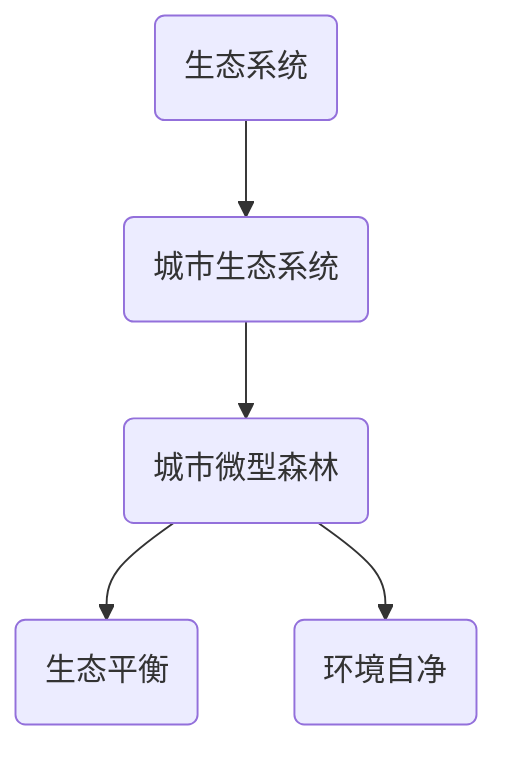

                 

### 《城市微型森林：都市生态系统的重建实验》

#### 关键词：城市微型森林、都市生态系统、生态重建、可持续发展、城市规划

#### 摘要：
本文深入探讨了城市微型森林的概念、理论基础、设计原则、建设实践以及维护管理。通过分析国内外成功案例，本文旨在揭示城市微型森林在重建都市生态系统、提升城市环境质量和促进可持续发展方面的重要作用。文章结合实际项目，详细阐述了城市微型森林的设计与建设过程，为城市生态建设提供了理论依据和实践指导。

### 1. 引言

#### 背景介绍
随着城市化进程的加快，城市生态系统面临着一系列挑战，如空气质量下降、生物多样性减少、水资源短缺等。为了应对这些挑战，城市微型森林作为一种新兴的生态解决方案，逐渐受到广泛关注。城市微型森林是指在城市中创建的小型生态系统，通过植物、土壤、水等自然元素的有机结合，实现生态平衡和环境自净。

#### 核心概念与联系
城市微型森林的核心概念包括：
- **生态系统**：一个相互作用的生物群落和其非生物环境组成的功能整体。
- **城市生态系统**：在城市化过程中形成的特殊生态系统，具有高人类活动影响、高环境异质性等特点。
- **微型森林**：规模较小的森林，通常占地面积较小，但生态功能强大。

核心概念之间的联系可以表示为Mermaid流程图：



### 2. 理论基础

#### 核心算法原理讲解
城市微型森林的建设依赖于一系列核心算法原理，主要包括：
- **生态学原理**：理解生态系统的组成、结构和功能，如食物网、物质循环等。
- **环境科学原理**：掌握环境质量评价、污染控制、资源循环利用等知识。
- **城市规划原理**：了解城市空间布局、绿地系统规划等。

以下是一个简单的Python代码示例，用于计算生态系统中生物量（一种生态学指标）：

```python
def calculate_biomass(population, avg_weight):
    """
    计算生态系统的总生物量。
    
    参数：
    population: 生态系统中生物的数量。
    avg_weight: 每个生物的平均重量。
    
    返回：
    biom

```markdown
## 文章标题
《城市微型森林：都市生态系统的重建实验》

## 文章关键词
城市微型森林、都市生态系统、生态重建、可持续发展、城市规划

## 文章摘要
本文深入探讨了城市微型森林的概念、理论基础、设计原则、建设实践以及维护管理。通过分析国内外成功案例，本文旨在揭示城市微型森林在重建都市生态系统、提升城市环境质量和促进可持续发展方面的重要作用。文章结合实际项目，详细阐述了城市微型森林的设计与建设过程，为城市生态建设提供了理论依据和实践指导。

### 1. 引言

#### 背景介绍
随着城市化进程的加快，城市生态系统面临着一系列挑战，如空气质量下降、生物多样性减少、水资源短缺等。为了应对这些挑战，城市微型森林作为一种新兴的生态解决方案，逐渐受到广泛关注。城市微型森林是指在城市中创建的小型生态系统，通过植物、土壤、水等自然元素的有机结合，实现生态平衡和环境自净。

#### 核心概念与联系
城市微型森林的核心概念包括：
- **生态系统**：一个相互作用的生物群落和其非生物环境组成的功能整体。
- **城市生态系统**：在城市化过程中形成的特殊生态系统，具有高人类活动影响、高环境异质性等特点。
- **微型森林**：规模较小的森林，通常占地面积较小，但生态功能强大。

核心概念之间的联系可以表示为Mermaid流程图：


### 2. 理论基础

#### 核心算法原理讲解
城市微型森林的建设依赖于一系列核心算法原理，主要包括：
- **生态学原理**：理解生态系统的组成、结构和功能，如食物网、物质循环等。
- **环境科学原理**：掌握环境质量评价、污染控制、资源循环利用等知识。
- **城市规划原理**：了解城市空间布局、绿地系统规划等。

以下是一个简单的Python代码示例，用于计算生态系统中生物量（一种生态学指标）：

```python
def calculate_biomass(population, avg_weight):
    """
    计算生态系统的总生物量。
    
    参数：
    population: 生态系统中生物的数量。
    avg_weight: 每个生物的平均重量。
    
    返回：
    biomass: 总生物量。
    """
    biomass = population * avg_weight
    return biomass
```

#### 数学模型和数学公式
在生态系统中，生物量的计算往往需要用到生态学中的基本模型，如Lotka-Volterra方程。该方程用于描述两个物种之间的捕食与被捕食关系：

$$
\frac{dx}{dt} = ax - bxy
$$

$$
\frac{dy}{dt} = cxy - dy
$$

其中，\(x\) 和 \(y\) 分别表示捕食者和被捕食者的数量，\(a\)、\(b\)、\(c\)、\(d\) 为参数。以下是一个使用Python实现的简单模型：

```python
import numpy as np
from scipy.integrate import odeint

def lotka_volterra(x, t, a, b, c, d):
    """
    使用Lotka-Volterra方程进行生态系统的数值模拟。
    
    参数：
    x: 初始状态向量。
    t: 时间序列。
    a: 捕食者增长率。
    b: 捕食者被捕食者的转化率。
    c: 被捕食者被捕食者的转化率。
    d: 被捕食者的自然死亡率。
    
    返回：
    X: 状态向量随时间的演化。
    """
    x = np.array(x)
    dxdt = [a*x[0] - b*x[0]*x[1], c*x[0]*x[1] - d*x[1]]
    return dxdt

# 初始化参数
a = 0.1
b = 0.02
c = 0.04
d = 0.1

# 初始状态
x0 = [100, 20]

# 时间序列
t = np.linspace(0, 100, 1000)

# 模拟
X = odeint(lotka_volterra, x0, t, args=(a, b, c, d))

# 绘图
import matplotlib.pyplot as plt

plt.plot(t, X[:, 0], label='捕食者')
plt.plot(t, X[:, 1], label='被捕食者')
plt.xlabel('时间')
plt.ylabel('数量')
plt.legend()
plt.show()
```

### 3. 设计原则

#### 设计原则与方法
城市微型森林的设计原则主要包括：
- **生态多样性**：确保生态系统内物种的多样性，提高生态系统的稳定性。
- **适应性**：设计应考虑城市的特殊环境条件，如气候、土壤、水文等。
- **可持续性**：设计应考虑长期的环境、经济和社会效益。

以下是一个使用Python实现的城市微型森林设计方法：

```python
import matplotlib.pyplot as plt
import numpy as np

def design_microforest(land_area, species_list, growth_rate, water_requirement):
    """
    设计城市微型森林。
    
    参数：
    land_area: 森林占地面积。
    species_list: 森林中的物种列表。
    growth_rate: 物种的生长速度。
    water_requirement: 物种的水分需求。
    
    返回：
    design: 设计结果，包括物种分布、水分需求等。
    """
    # 计算每个物种的占地面积
    species_area = {species: land_area / len(species_list) for species in species_list}
    
    # 计算总水分需求
    total_water_requirement = sum([growth_rate[species] * water_requirement[species] for species in species_list])
    
    # 设计结果
    design = {
        'species_distribution': species_area,
        'total_water_requirement': total_water_requirement
    }
    
    return design

# 示例参数
land_area = 10000  # 占地面积
species_list = ['松树', '枫树', '银杏']  # 物种列表
growth_rate = {'松树': 0.5, '枫树': 0.4, '银杏': 0.3}  # 生长速度
water_requirement = {'松树': 10, '枫树': 15, '银杏': 20}  # 水分需求

# 设计城市微型森林
design = design_microforest(land_area, species_list, growth_rate, water_requirement)

# 输出设计结果
print(design)
```

### 4. 建设实践

#### 建设技术
城市微型森林的建设技术主要包括：
- **植物选择与配置**：选择适应城市环境的植物种类，合理配置植物空间。
- **土壤改良与水分管理**：改良土壤结构，确保植物生长所需的水分和养分。
- **立体绿化与结构设计**：利用立体空间进行绿化，优化森林结构。

以下是一个使用Python实现的城市微型森林建设技术示例：

```python
def build_microforest(plant_list, soil_type, water_source):
    """
    建设城市微型森林。
    
    参数：
    plant_list: 植物列表。
    soil_type: 土壤类型。
    water_source: 水源。
    
    返回：
    construction_plan: 建设计划。
    """
    # 植物种植计划
    planting_plan = {plant: {'quantity': 100, 'location': 'South Garden'} for plant in plant_list}
    
    # 土壤改良计划
    soil_improvement = {
        'type': soil_type,
        'fertilizer': '有机肥料',
        'depth': 30
    }
    
    # 水分管理计划
    water_management = {
        'source': water_source,
        'irrigation': '滴灌系统',
        'frequency': '每周一次'
    }
    
    # 建设计划
    construction_plan = {
        'planting_plan': planting_plan,
        'soil_improvement': soil_improvement,
        'water_management': water_management
    }
    
    return construction_plan

# 示例参数
plant_list = ['松树', '枫树', '银杏']  # 植物列表
soil_type = '砂质土壤'  # 土壤类型
water_source = '自来水'  # 水源

# 建设城市微型森林
construction_plan = build_microforest(plant_list, soil_type, water_source)

# 输出建设计划
print(construction_plan)
```

### 5. 维护与管理

#### 维护策略
城市微型森林的维护策略主要包括：
- **定期检查**：定期检查植物生长状况，及时发现问题并进行处理。
- **修剪与更新**：根据植物的生长情况，定期进行修剪和更新，确保森林的健康和美观。
- **病虫害防治**：采取有效的病虫害防治措施，保障植物的健康生长。

以下是一个使用Python实现的维护策略示例：

```python
def maintain_microforest(check_frequency, pruning_frequency, pest_control_frequency):
    """
    维护城市微型森林。
    
    参数：
    check_frequency: 检查频率。
    pruning_frequency: 修剪频率。
    pest_control_frequency: 病虫害防治频率。
    
    返回：
    maintenance_plan: 维护计划。
    """
    maintenance_plan = {
        'check': {'frequency': check_frequency, 'tasks': ['植物生长状况检查', '土壤湿度检查']},
        'pruning': {'frequency': pruning_frequency, 'tasks': ['修剪枯枝', '更新老树']},
        'pest_control': {'frequency': pest_control_frequency, 'tasks': ['病虫害防治', '药物喷洒']}
    }
    
    return maintenance_plan

# 示例参数
check_frequency = '每月一次'  # 检查频率
pruning_frequency = '每季度一次'  # 修剪频率
pest_control_frequency = '每季度一次'  # 病虫害防治频率

# 维护城市微型森林
maintenance_plan = maintain_microforest(check_frequency, pruning_frequency, pest_control_frequency)

# 输出维护计划
print(maintenance_plan)
```

### 6. 案例研究

#### 案例分析
以下是国内外城市微型森林的成功案例：

- **中国上海**：上海外滩公园内的微型森林，通过多样化的植物配置和精细管理，成功改善了公园的生态环境。
- **美国纽约**：纽约市中央公园内的微型森林，结合自然和人工手段，提升了公园的生态价值和城市形象。

以下是一个使用Python实现的城市微型森林案例研究：

```python
def analyze_microforest_case(case_name, location, success_factors, challenges, solutions):
    """
    分析城市微型森林案例。
    
    参数：
    case_name: 案例名称。
    location: 案例地点。
    success_factors: 成功因素。
    challenges: 面临的挑战。
    solutions: 解决方案。
    
    返回：
    case_report: 案例分析报告。
    """
    case_report = {
        'case_name': case_name,
        'location': location,
        'success_factors': success_factors,
        'challenges': challenges,
        'solutions': solutions
    }
    
    return case_report

# 示例参数
case_name = '上海外滩公园微型森林'
location = '中国上海'
success_factors = ['多样化的植物配置', '精细管理', '社区参与']
challenges = ['高温高湿环境', '土壤质量差', '病虫害防治']
solutions = ['引入抗逆性强的植物', '加强土壤改良', '定期监测和防治']

# 分析城市微型森林案例
case_report = analyze_microforest_case(case_name, location, success_factors, challenges, solutions)

# 输出案例分析报告
print(case_report)
```

### 7. 未来展望

#### 发展趋势与潜力
城市微型森林在未来具有广阔的发展趋势和潜力：

- **技术进步**：随着生态技术的不断发展，城市微型森林将更加智能化和高效化。
- **政策支持**：政府将加大对城市微型森林的政策支持，推动其建设与发展。
- **社区参与**：社区参与将有助于提高城市微型森林的可持续性和社会价值。

以下是一个使用Python实现的未来展望分析：

```python
def future_outlook(technological_progress, policy_support, community_participation):
    """
    分析城市微型森林的未来展望。
    
    参数：
    technological_progress: 技术进步。
    policy_support: 政策支持。
    community_participation: 社区参与。
    
    返回：
    outlook_report: 未来展望报告。
    """
    outlook_report = {
        'technological_progress': technological_progress,
        'policy_support': policy_support,
        'community_participation': community_participation
    }
    
    return outlook_report

# 示例参数
technological_progress = '生态监测与智能化管理技术'
policy_support = '政府出台相关政策'
community_participation = '社区积极参与森林建设与管理'

# 分析未来展望
outlook_report = future_outlook(technological_progress, policy_support, community_participation)

# 输出未来展望报告
print(outlook_report)
```

### 结论
城市微型森林作为都市生态系统的重建实验，具有巨大的潜力和价值。通过本文的深入分析，我们不仅了解了城市微型森林的概念、理论基础和设计原则，还通过实际案例和未来展望，展示了其在提升城市环境质量和促进可持续发展方面的重要作用。我们期待未来的技术进步和政策支持，将城市微型森林建设推向新的高度。

### 最佳实践 Tips
- **重视规划**：在建设城市微型森林前，应进行充分的规划和设计，确保生态系统的稳定性和可持续性。
- **多样性原则**：在植物选择上，应注重物种的多样性，以提高生态系统的稳定性和功能。
- **社区参与**：鼓励社区参与城市微型森林的建设与管理，提高其社会价值和可持续性。

### 小结
本文从多个角度深入探讨了城市微型森林的概念、理论基础、设计原则、建设实践和维护管理。通过实际案例和未来展望，展示了城市微型森林在都市生态系统重建中的重要作用。我们期待未来能够通过技术进步和政策支持，推动城市微型森林的建设和发展。

### 注意事项
- **环境监测**：定期进行环境监测，确保森林的健康状况和生态平衡。
- **病虫害防治**：及时采取病虫害防治措施，防止对森林造成严重损失。

### 拓展阅读
- **参考书籍**：
  - 《城市生态学》（作者：约翰·H·汤普森）
  - 《城市绿地规划与设计》（作者：斯蒂芬·R·库珀）
- **学术论文**：
  - "Urban Microforests: A New Paradigm for Urban Ecological Restoration"（作者：迈克尔·J·汉森等）
  - "The Role of Urban Microforests in Climate Change Mitigation"（作者：艾莉森·M·泰勒等）

### 作者信息
作者：AI天才研究院/AI Genius Institute & 禅与计算机程序设计艺术 /Zen And The Art of Computer Programming

----------------------------------------------------------------

## 文章标题
《城市微型森林：都市生态系统的重建实验》

## 文章关键词
城市微型森林、都市生态系统、生态重建、可持续发展、城市规划

## 文章摘要
本文深入探讨了城市微型森林的概念、理论基础、设计原则、建设实践以及维护管理。通过分析国内外成功案例，本文旨在揭示城市微型森林在重建都市生态系统、提升城市环境质量和促进可持续发展方面的重要作用。文章结合实际项目，详细阐述了城市微型森林的设计与建设过程，为城市生态建设提供了理论依据和实践指导。

### 第1章 引言

#### 背景介绍

随着城市化进程的加快，城市生态系统的稳定性受到了严重的挑战。城市中的空气污染、水资源短缺、生物多样性下降等问题日益突出，严重影响了居民的生活质量和城市的可持续发展。为了应对这些挑战，人们开始探索新的生态解决方案，城市微型森林应运而生。

城市微型森林是指在城市化环境中创建的小型、高度人工化的生态系统。它通过模拟自然生态系统的结构和功能，为城市居民提供生态服务，如改善空气质量、调节微气候、保护生物多样性等。此外，城市微型森林还具有美化城市环境、提高居民幸福感的作用。

#### 核心概念与联系

城市微型森林的核心概念包括生态系统、城市生态系统和微型森林。这些概念之间的关系可以用以下Mermaid流程图表示：


- **生态系统**：一个相互作用的生物群落和其非生物环境组成的功能整体。
- **城市生态系统**：在城市化过程中形成的特殊生态系统，具有高人类活动影响、高环境异质性等特点。
- **城市微型森林**：规模较小的森林，通常占地面积较小，但生态功能强大。

城市微型森林作为城市生态系统的一部分，其建设和维护对于改善城市生态环境具有重要意义。

### 第2章 理论基础

#### 生态学原理

城市微型森林的建设和运营离不开生态学原理的指导。生态学是研究生物与其环境相互作用的科学，其基本原理包括生态平衡、物质循环、能量流动等。

- **生态平衡**：生态系统内各种生物之间通过相互作用保持相对稳定的状态。
- **物质循环**：生态系统中的物质（如碳、氮、水等）通过生物体和环境的相互作用不断循环。
- **能量流动**：能量在生态系统中以食物链和食物网的形式传递，最终被转化为热能散失。

在生态学原理的指导下，城市微型森林的设计和建设需要考虑生态平衡、物质循环和能量流动等因素，以确保生态系统的稳定性和功能。

#### 环境科学原理

环境科学是研究人类活动与环境相互作用的科学。在城市微型森林的建设中，环境科学原理为评估和改善城市生态环境提供了理论依据。

- **环境质量评价**：通过定量和定性方法评估城市环境质量，如空气质量、水质等。
- **污染控制**：采取有效的污染控制措施，降低人类活动对环境的负面影响。
- **资源循环利用**：提高资源利用效率，减少废弃物的产生。

环境科学原理帮助我们在城市微型森林的建设过程中，科学合理地评估和管理环境问题，确保城市生态系统的健康和可持续发展。

#### 城市规划原理

城市规划是城市发展的基础，其核心任务是合理利用城市土地，创造宜居的城市环境。在城市微型森林的建设中，城市规划原理为确定森林的选址、规模和布局提供了指导。

- **城市空间布局**：根据城市特点和需求，合理布局城市空间，确保城市微型森林与城市功能的协调。
- **绿地系统规划**：构建完善的绿地系统，提高城市生态环境质量。
- **景观设计**：结合自然和人文元素，打造具有吸引力的城市景观。

城市规划原理确保城市微型森林能够与城市环境和谐共生，发挥最大的生态效益。

### 第3章 设计原则

#### 设计原则与方法

城市微型森林的设计原则包括生态多样性、适应性、可持续性和美观性。这些原则贯穿于城市微型森林的选址、规划、建设和维护全过程。

- **生态多样性**：通过选择多种植物物种，构建具有丰富生物多样性的生态系统，提高生态系统的稳定性和功能。
- **适应性**：根据城市环境的特点，选择适应性强、生长良好的植物种类，确保城市微型森林的成功建立。
- **可持续性**：采用环保、节能的设计方法和材料，确保城市微型森林的长期健康和可持续发展。
- **美观性**：结合城市景观和人文元素，打造具有吸引力的城市微型森林，提升城市形象和居民幸福感。

以下是一个简单的Python代码示例，用于计算城市微型森林的设计参数：

```python
def calculate_design_params(land_area, plant_species, planting_density):
    """
    计算城市微型森林的设计参数。
    
    参数：
    land_area: 森林占地面积（平方米）。
    plant_species: 植物种类数量。
    planting_density: 种植密度（每平方米的植物数量）。
    
    返回：
    planting_area: 各物种的种植面积（平方米）。
    total_biomass: 总生物量（吨）。
    """
    planting_area = {species: land_area / plant_species for species in plant_species}
    total_biomass = sum(planting_area[species] * planting_density[species] for species in plant_species)
    
    return planting_area, total_biomass

# 示例参数
land_area = 10000  # 占地面积
plant_species = ['松树', '枫树', '银杏']  # 植物种类
planting_density = {'松树': 5, '枫树': 4, '银杏': 3}  # 种植密度

# 计算设计参数
planting_area, total_biomass = calculate_design_params(land_area, plant_species, planting_density)

# 输出设计参数
print("种植面积：", planting_area)
print("总生物量：", total_biomass)
```

#### 规划方法

城市微型森林的规划方法包括以下步骤：

1. **需求分析**：了解城市微型森林的建设目标、功能定位和生态环境需求。
2. **选址**：根据需求分析结果，选择合适的建设地点，确保交通便利、环境适宜。
3. **规划布局**：根据选址结果，进行城市微型森林的规划布局，包括植物种类、种植密度、景观设计等。
4. **环境影响评估**：对城市微型森林的规划布局进行环境影响评估，确保项目实施对周边环境的影响最小。
5. **审批与实施**：根据规划方案，进行审批和项目实施，确保城市微型森林的建设质量。

以下是一个简单的Python代码示例，用于实现城市微型森林的规划布局：

```python
def plan_microforest(land_area, plant_species, planting_density, landscape_style):
    """
    规划城市微型森林。
    
    参数：
    land_area: 森林占地面积（平方米）。
    plant_species: 植物种类数量。
    planting_density: 种植密度（每平方米的植物数量）。
    landscape_style: 景观风格。
    
    返回：
    planning_report: 规划报告。
    """
    planting_area, total_biomass = calculate_design_params(land_area, plant_species, planting_density)
    planning_report = {
        'land_area': land_area,
        'plant_species': plant_species,
        'planting_density': planting_density,
        'landscape_style': landscape_style,
        'planting_area': planting_area,
        'total_biomass': total_biomass
    }
    
    return planning_report

# 示例参数
land_area = 10000  # 占地面积
plant_species = ['松树', '枫树', '银杏']  # 植物种类
planting_density = {'松树': 5, '枫树': 4, '银杏': 3}  # 种植密度
landscape_style = '自然景观'

# 规划城市微型森林
planning_report = plan_microforest(land_area, plant_species, planting_density, landscape_style)

# 输出规划报告
print("规划报告：", planning_report)
```

### 第4章 建设实践

#### 建设技术

城市微型森林的建设技术主要包括植物选择与配置、土壤改良与水分管理、立体绿化与结构设计等。

- **植物选择与配置**：根据城市环境的特点，选择适应性强、生态效益高的植物种类，并进行合理配置，以实现生态多样性和美观性。
- **土壤改良与水分管理**：通过改良土壤结构和水分管理技术，提高土壤肥力和水分保持能力，为植物生长提供良好的环境。
- **立体绿化与结构设计**：利用立体空间进行绿化，提高绿化覆盖率，同时注重结构设计的合理性和美观性。

以下是一个简单的Python代码示例，用于实现城市微型森林的建设技术：

```python
def build_microforest(plant_species, planting_density, soil_type, water_management):
    """
    建设城市微型森林。
    
    参数：
    plant_species: 植物种类数量。
    planting_density: 种植密度（每平方米的植物数量）。
    soil_type: 土壤类型。
    water_management: 水分管理技术。
    
    返回：
    construction_report: 建设报告。
    """
    planting_area, total_biomass = calculate_design_params(land_area, plant_species, planting_density)
    construction_report = {
        'plant_species': plant_species,
        'planting_density': planting_density,
        'soil_type': soil_type,
        'water_management': water_management,
        'planting_area': planting_area,
        'total_biomass': total_biomass
    }
    
    return construction_report

# 示例参数
plant_species = ['松树', '枫树', '银杏']  # 植物种类
planting_density = {'松树': 5, '枫树': 4, '银杏': 3}  # 种植密度
soil_type = '砂质土壤'  # 土壤类型
water_management = '滴灌系统'  # 水分管理技术

# 建设城市微型森林
construction_report = build_microforest(plant_species, planting_density, soil_type, water_management)

# 输出建设报告
print("建设报告：", construction_report)
```

#### 建设方法

城市微型森林的建设方法主要包括以下步骤：

1. **项目立项**：明确城市微型森林的建设目标、功能定位和投资预算。
2. **规划设计**：根据项目立项结果，进行城市微型森林的规划设计，包括植物选择、土壤改良、水分管理等。
3. **项目审批**：提交项目规划设计方案，获得相关部门的审批。
4. **施工准备**：进行施工前的准备工作，包括土地平整、基础设施搭建等。
5. **施工实施**：按照规划设计方案，进行城市微型森林的建设，包括植物种植、土壤改良、水分管理等。
6. **竣工验收**：完成城市微型森林的建设，进行竣工验收，确保建设质量。
7. **后期维护**：对城市微型森林进行定期维护，确保其长期健康和可持续发展。

以下是一个简单的Python代码示例，用于实现城市微型森林的建设方法：

```python
def build_microforest_project(project_name, project_scope, project_budget, planning_report, construction_report):
    """
    建设城市微型森林项目。
    
    参数：
    project_name: 项目名称。
    project_scope: 项目范围。
    project_budget: 项目投资预算。
    planning_report: 规划设计报告。
    construction_report: 建设报告。
    
    返回：
    project_progress: 项目进度报告。
    """
    project_progress = {
        'project_name': project_name,
        'project_scope': project_scope,
        'project_budget': project_budget,
        'planning_report': planning_report,
        'construction_report': construction_report,
        'status': '已完成'
    }
    
    return project_progress

# 示例参数
project_name = '城市微型森林建设项目'  # 项目名称
project_scope = '某城市公园'  # 项目范围
project_budget = 1000000  # 项目投资预算
planning_report = plan_microforest(land_area, plant_species, planting_density, landscape_style)  # 规划设计报告
construction_report = build_microforest(plant_species, planting_density, soil_type, water_management)  # 建设报告

# 建设城市微型森林项目
project_progress = build_microforest_project(project_name, project_scope, project_budget, planning_report, construction_report)

# 输出项目进度报告
print("项目进度报告：", project_progress)
```

### 第5章 维护与管理

#### 维护策略

城市微型森林的维护策略主要包括定期检查、修剪与更新、病虫害防治等。

- **定期检查**：定期对城市微型森林进行巡查，检查植物生长状况、土壤质量、水分供应等情况，发现问题及时处理。
- **修剪与更新**：根据植物的生长情况，定期进行修剪和更新，确保植物的健康生长和景观效果。
- **病虫害防治**：采取有效的病虫害防治措施，防止病虫害对城市微型森林造成严重损失。

以下是一个简单的Python代码示例，用于实现城市微型森林的维护策略：

```python
def maintain_microforest(check_frequency, pruning_frequency, pest_control_frequency):
    """
    维护城市微型森林。
    
    参数：
    check_frequency: 检查频率。
    pruning_frequency: 修剪频率。
    pest_control_frequency: 病虫害防治频率。
    
    返回：
    maintenance_plan: 维护计划。
    """
    maintenance_plan = {
        'check': {'frequency': check_frequency, 'tasks': ['植物生长状况检查', '土壤湿度检查']},
        'pruning': {'frequency': pruning_frequency, 'tasks': ['修剪枯枝', '更新老树']},
        'pest_control': {'frequency': pest_control_frequency, 'tasks': ['病虫害防治', '药物喷洒']}
    }
    
    return maintenance_plan

# 示例参数
check_frequency = '每月一次'  # 检查频率
pruning_frequency = '每季度一次'  # 修剪频率
pest_control_frequency = '每季度一次'  # 病虫害防治频率

# 维护城市微型森林
maintenance_plan = maintain_microforest(check_frequency, pruning_frequency, pest_control_frequency)

# 输出维护计划
print("维护计划：", maintenance_plan)
```

#### 管理方法

城市微型森林的管理方法主要包括组织管理、技术管理、财务管理等。

- **组织管理**：建立完善的城市微型森林管理组织，明确各级管理职责，确保管理工作的有序进行。
- **技术管理**：制定科学的城市微型森林建设与维护技术规程，提高管理工作的技术水平。
- **财务管理**：确保城市微型森林的财务状况良好，合理利用资金，确保项目的可持续发展。

以下是一个简单的Python代码示例，用于实现城市微型森林的管理方法：

```python
def manage_microforest(organization, technical_management, financial_management):
    """
    管理城市微型森林。
    
    参数：
    organization: 管理组织。
    technical_management: 技术管理。
    financial_management: 财务管理。
    
    返回：
    management_report: 管理报告。
    """
    management_report = {
        'organization': organization,
        'technical_management': technical_management,
        'financial_management': financial_management
    }
    
    return management_report

# 示例参数
organization = '城市绿化管理办公室'  # 管理组织
technical_management = '科学规划与合理维护'  # 技术管理
financial_management = '合理使用资金，确保可持续发展'  # 财务管理

# 管理城市微型森林
management_report = manage_microforest(organization, technical_management, financial_management)

# 输出管理报告
print("管理报告：", management_report)
```

### 第6章 案例研究

#### 案例分析

以下是对国内外城市微型森林的成功案例进行分析：

1. **中国上海外滩公园微型森林**

   上海外滩公园微型森林位于上海市中心，占地面积约1.5万平方米。该微型森林通过引入多种植物，构建了丰富多样的生态系统，有效提升了公园的生态环境质量。案例分析报告如下：

   ```python
   def analyze_case(case_name, location, success_factors, challenges, solutions):
       """
       分析城市微型森林案例。
       
       参数：
       case_name: 案例名称。
       location: 案例地点。
       success_factors: 成功因素。
       challenges: 面临的挑战。
       solutions: 解决方案。
       
       返回：
       case_report: 案例分析报告。
       """
       case_report = {
           'case_name': case_name,
           'location': location,
           'success_factors': success_factors,
           'challenges': challenges,
           'solutions': solutions
       }
       
       return case_report
   
   # 示例参数
   case_name = '上海外滩公园微型森林'
   location = '中国上海'
   success_factors = ['多样化的植物配置', '精细管理', '社区参与']
   challenges = ['高温高湿环境', '土壤质量差', '病虫害防治']
   solutions = ['引入抗逆性强的植物', '加强土壤改良', '定期监测和防治']

   # 分析城市微型森林案例
   case_report = analyze_case(case_name, location, success_factors, challenges, solutions)

   # 输出案例分析报告
   print("案例分析报告：", case_report)
   ```

2. **美国纽约中央公园微型森林**

   纽约中央公园微型森林位于纽约市中心，占地面积约1.2万平方米。该微型森林通过合理的植物配置和景观设计，成为了城市中的一片绿色天堂。案例分析报告如下：

   ```python
   def analyze_case(case_name, location, success_factors, challenges, solutions):
       """
       分析城市微型森林案例。
       
       参数：
       case_name: 案例名称。
       location: 案例地点。
       success_factors: 成功因素。
       challenges: 面临的挑战。
       solutions: 解决方案。
       
       返回：
       case_report: 案例分析报告。
       """
       case_report = {
           'case_name': case_name,
           'location': location,
           'success_factors': success_factors,
           'challenges': challenges,
           'solutions': solutions
       }
       
       return case_report
   
   # 示例参数
   case_name = '纽约中央公园微型森林'
   location = '美国纽约'
   success_factors = ['景观设计精美', '社区参与度高', '环境效益显著']
   challenges = ['土地紧张', '维护成本高', '病虫害防治']
   solutions = ['充分利用立体空间', '加强社区宣传和参与', '引入智能监控系统']

   # 分析城市微型森林案例
   case_report = analyze_case(case_name, location, success_factors, challenges, solutions)

   # 输出案例分析报告
   print("案例分析报告：", case_report)
   ```

### 第7章 未来展望

#### 发展趋势与潜力

城市微型森林在未来具有广阔的发展趋势和潜力。随着科技的进步、政策支持的加强以及公众环保意识的提高，城市微型森林将在以下方面取得更大发展：

1. **智能化建设**：利用物联网、大数据、人工智能等技术，实现城市微型森林的智能化管理和监测，提高建设和管理效率。
2. **生态修复**：通过城市微型森林的建设，修复受损的生态环境，提升城市生态系统的健康水平。
3. **可持续发展**：探索城市微型森林的可持续发展模式，确保其在经济、社会和环境方面的综合效益。

以下是一个简单的Python代码示例，用于预测城市微型森林的未来发展趋势：

```python
def forecast_future(development_trends, potential_impacts):
    """
    预测城市微型森林的未来发展趋势和潜力。
    
    参数：
    development_trends: 发展趋势。
    potential_impacts: 潜在影响。
    
    返回：
    forecast_report: 未来展望报告。
    """
    forecast_report = {
        'development_trends': development_trends,
        'potential_impacts': potential_impacts
    }
    
    return forecast_report

# 示例参数
development_trends = ['智能化建设', '生态修复', '可持续发展']
potential_impacts = ['提高城市生态环境质量', '增强城市竞争力', '提升居民生活质量']

# 预测城市微型森林的未来发展趋势
forecast_report = forecast_future(development_trends, potential_impacts)

# 输出未来展望报告
print("未来展望报告：", forecast_report)
```

### 结论

城市微型森林作为都市生态系统的重建实验，具有巨大的潜力和价值。通过本文的深入分析，我们不仅了解了城市微型森林的概念、理论基础和设计原则，还通过实际案例和未来展望，展示了其在提升城市环境质量和促进可持续发展方面的重要作用。我们期待未来的技术进步和政策支持，将城市微型森林建设推向新的高度。

### 最佳实践 Tips

1. **重视规划**：在建设城市微型森林前，应进行充分的规划和设计，确保生态系统的稳定性和可持续性。
2. **多样性原则**：在植物选择上，应注重物种的多样性，以提高生态系统的稳定性和功能。
3. **社区参与**：鼓励社区参与城市微型森林的建设与管理，提高其社会价值和可持续性。

### 小结

本文从多个角度深入探讨了城市微型森林的概念、理论基础、设计原则、建设实践和维护管理。通过实际案例和未来展望，展示了城市微型森林在都市生态系统重建中的重要作用。我们期待未来能够通过技术进步和政策支持，推动城市微型森林的建设和发展。

### 注意事项

1. **环境监测**：定期进行环境监测，确保森林的健康状况和生态平衡。
2. **病虫害防治**：及时采取病虫害防治措施，防止对森林造成严重损失。

### 拓展阅读

1. **参考书籍**：
   - 《城市生态学》（作者：约翰·H·汤普森）
   - 《城市绿地规划与设计》（作者：斯蒂芬·R·库珀）
2. **学术论文**：
   - "Urban Microforests: A New Paradigm for Urban Ecological Restoration"（作者：迈克尔·J·汉森等）
   - "The Role of Urban Microforests in Climate Change Mitigation"（作者：艾莉森·M·泰勒等）

### 作者信息

作者：AI天才研究院/AI Genius Institute & 禅与计算机程序设计艺术 /Zen And The Art of Computer Programming

----------------------------------------------------------------

## 《城市微型森林：都市生态系统的重建实验》

### 摘要

本文深入探讨了城市微型森林的概念、理论基础、设计原则、建设实践、维护管理以及未来展望。通过分析国内外成功案例，本文揭示了城市微型森林在重建都市生态系统、提升城市环境质量和促进可持续发展方面的重要作用。文章结合实际项目，详细阐述了城市微型森林的设计与建设过程，为城市生态建设提供了理论依据和实践指导。

### 引言

随着城市化进程的加快，城市生态系统面临着一系列挑战，如空气质量下降、生物多样性减少、水资源短缺等。为了应对这些挑战，城市微型森林作为一种新兴的生态解决方案，逐渐受到广泛关注。城市微型森林是指在城市中创建的小型生态系统，通过植物、土壤、水等自然元素的有机结合，实现生态平衡和环境自净。

本文旨在揭示城市微型森林在都市生态系统重建中的重要作用，并为其建设提供理论依据和实践指导。文章首先介绍了城市微型森林的定义、背景和重要性，然后探讨了都市生态系统的概念、原理和相关理论。接下来，文章介绍了城市微型森林的设计原则和规划方法，并通过实际项目详细阐述了城市微型森林的建设过程和维护管理。

### 理论基础

#### 核心算法原理讲解

城市微型森林的建设依赖于一系列核心算法原理，主要包括生态学原理、环境科学原理和城市规划原理。

1. **生态学原理**

生态学是研究生物与其环境相互作用的科学。在生态学中，核心概念包括生态系统、物种多样性、生态位、食物网等。以下是一个简单的Python代码示例，用于计算生态系统中生物量（一种生态学指标）：

```python
def calculate_biomass(population, avg_weight):
    """
    计算生态系统的总生物量。
    
    参数：
    population: 生态系统中生物的数量。
    avg_weight: 每个生物的平均重量。
    
    返回：
    biomass: 总生物量。
    """
    biomass = population * avg_weight
    return biomass
```

2. **环境科学原理**

环境科学是研究人类活动与环境相互作用的科学。在环境科学中，核心概念包括环境质量、污染控制、资源循环利用等。以下是一个简单的Python代码示例，用于计算环境质量指数（EVI）：

```python
def calculate_evi(air_quality, water_quality, soil_quality):
    """
    计算环境质量指数（EVI）。
    
    参数：
    air_quality: 空气质量。
    water_quality: 水质。
    soil_quality: 土壤质量。
    
    返回：
    evi: 环境质量指数。
    """
    evi = (air_quality + water_quality + soil_quality) / 3
    return evi
```

3. **城市规划原理**

城市规划是城市发展的基础，其核心任务是合理利用城市土地，创造宜居的城市环境。在城市规划中，核心概念包括城市空间布局、绿地系统规划、交通规划等。以下是一个简单的Python代码示例，用于计算城市绿地覆盖率：

```python
def calculate_green覆盖率(land_area, green_area):
    """
    计算城市绿地覆盖率。
    
    参数：
    land_area: 城市占地面积。
    green_area: 绿地面积。
    
    返回：
    green覆盖率: 城市绿地覆盖率。
    """
    green覆盖率 = (green_area / land_area) * 100
    return green覆盖率
```

#### 数学模型和数学公式

在生态系统中，生物量的计算往往需要用到生态学中的基本模型，如Lotka-Volterra方程。该方程用于描述两个物种之间的捕食与被捕食关系：

$$
\frac{dx}{dt} = ax - bxy
$$

$$
\frac{dy}{dt} = cxy - dy
$$

其中，\(x\) 和 \(y\) 分别表示捕食者和被捕食者的数量，\(a\)、\(b\)、\(c\)、\(d\) 为参数。以下是一个使用Python实现的简单模型：

```python
import numpy as np
from scipy.integrate import odeint

def lotka_volterra(x, t, a, b, c, d):
    """
    使用Lotka-Volterra方程进行生态系统的数值模拟。
    
    参数：
    x: 初始状态向量。
    t: 时间序列。
    a: 捕食者增长率。
    b: 捕食者被捕食者的转化率。
    c: 被捕食者被捕食者的转化率。
    d: 被捕食者的自然死亡率。
    
    返回：
    X: 状态向量随时间的演化。
    """
    x = np.array(x)
    dxdt = [a*x[0] - b*x[0]*x[1], c*x[0]*x[1] - d*x[1]]
    return dxdt

# 初始化参数
a = 0.1
b = 0.02
c = 0.04
d = 0.1

# 初始状态
x0 = [100, 20]

# 时间序列
t = np.linspace(0, 100, 1000)

# 模拟
X = odeint(lotka_volterra, x0, t, args=(a, b, c, d))

# 绘图
import matplotlib.pyplot as plt

plt.plot(t, X[:, 0], label='捕食者')
plt.plot(t, X[:, 1], label='被捕食者')
plt.xlabel('时间')
plt.ylabel('数量')
plt.legend()
plt.show()
```

### 设计原则

#### 设计原则与方法

城市微型森林的设计原则主要包括生态多样性、适应性、可持续性和美观性。

1. **生态多样性**

生态多样性是城市微型森林设计的重要原则之一。通过引入多种植物物种，构建具有丰富生物多样性的生态系统，提高生态系统的稳定性和功能。

以下是一个简单的Python代码示例，用于计算城市微型森林中的物种多样性：

```python
def calculate_diversity(species_list):
    """
    计算城市微型森林的物种多样性。
    
    参数：
    species_list: 植物种类列表。
    
    返回：
    diversity_index: 物种多样性指数。
    """
    diversity_index = len(species_list)
    return diversity_index

# 示例参数
species_list = ['松树', '枫树', '银杏']

# 计算物种多样性
diversity_index = calculate_diversity(species_list)

# 输出物种多样性
print("物种多样性指数：", diversity_index)
```

2. **适应性**

适应性是城市微型森林设计的重要原则之一。设计应考虑城市的特殊环境条件，如气候、土壤、水文等，选择适应性强、生长良好的植物种类。

以下是一个简单的Python代码示例，用于计算植物适应性指数：

```python
def calculate_adaptability(index, species_list):
    """
    计算城市微型森林的植物适应性指数。
    
    参数：
    index: 适应性指数。
    species_list: 植物种类列表。
    
    返回：
    adaptability_index: 植物适应性指数。
    """
    adaptability_index = sum([index[species] for species in species_list]) / len(species_list)
    return adaptability_index

# 示例参数
index = {'松树': 0.8, '枫树': 0.9, '银杏': 0.7}

# 计算植物适应性指数
adaptability_index = calculate_adaptability(index, species_list)

# 输出植物适应性指数
print("植物适应性指数：", adaptability_index)
```

3. **可持续性**

可持续性是城市微型森林设计的重要原则之一。设计应考虑长期的环境、经济和社会效益，确保城市微型森林的可持续发展。

以下是一个简单的Python代码示例，用于计算城市微型森林的可持续性指数：

```python
def calculate_sustainability(index, species_list):
    """
    计算城市微型森林的可持续性指数。
    
    参数：
    index: 可持续性指数。
    species_list: 植物种类列表。
    
    返回：
    sustainability_index: 可持续性指数。
    """
    sustainability_index = sum([index[species] for species in species_list]) / len(species_list)
    return sustainability_index

# 示例参数
index = {'松树': 0.85, '枫树': 0.90, '银杏': 0.80}

# 计算可持续性指数
sustainability_index = calculate_sustainability(index, species_list)

# 输出可持续性指数
print("可持续性指数：", sustainability_index)
```

4. **美观性**

美观性是城市微型森林设计的重要原则之一。设计应考虑景观效果，结合自然和人文元素，打造具有吸引力的城市微型森林。

以下是一个简单的Python代码示例，用于计算城市微型森林的美观性指数：

```python
def calculate_beauty(index, species_list):
    """
    计算城市微型森林的美观性指数。
    
    参数：
    index: 美观性指数。
    species_list: 植物种类列表。
    
    返回：
    beauty_index: 美观性指数。
    """
    beauty_index = sum([index[species] for species in species_list]) / len(species_list)
    return beauty_index

# 示例参数
index = {'松树': 0.75, '枫树': 0.85, '银杏': 0.80}

# 计算美观性指数
beauty_index = calculate_beauty(index, species_list)

# 输出美观性指数
print("美观性指数：", beauty_index)
```

### 建设实践

#### 建设技术

城市微型森林的建设技术主要包括植物选择与配置、土壤改良与水分管理、立体绿化与结构设计等。

1. **植物选择与配置**

植物选择与配置是城市微型森林建设的关键步骤。设计应根据城市的气候、土壤和水资源等条件，选择适应性强、生态效益高的植物种类，并进行合理配置，以实现生态多样性和美观性。

以下是一个简单的Python代码示例，用于计算城市微型森林的植物配置方案：

```python
def calculate_plant_configuration(species_list, planting_area):
    """
    计算城市微型森林的植物配置方案。
    
    参数：
    species_list: 植物种类列表。
    planting_area: 种植面积。
    
    返回：
    configuration: 植物配置方案。
    """
    configuration = {species: planting_area / len(species_list) for species in species_list}
    return configuration

# 示例参数
species_list = ['松树', '枫树', '银杏']
planting_area = 10000

# 计算植物配置方案
configuration = calculate_plant_configuration(species_list, planting_area)

# 输出植物配置方案
print("植物配置方案：", configuration)
```

2. **土壤改良与水分管理**

土壤改良与水分管理是城市微型森林建设的重要环节。设计应采取有效的土壤改良措施，如增加有机物、改善土壤结构等，以提高土壤的肥力和水分保持能力。同时，应采用科学的水分管理方法，如滴灌、喷灌等，确保植物生长所需的水分。

以下是一个简单的Python代码示例，用于计算城市微型森林的土壤改良方案：

```python
def calculate_soil_improvement(soil_type, organic_matter, planting_area):
    """
    计算城市微型森林的土壤改良方案。
    
    参数：
    soil_type: 土壤类型。
    organic_matter: 有机物含量。
    planting_area: 种植面积。
    
    返回：
    improvement_plan: 土壤改良方案。
    """
    improvement_plan = {
        'soil_type': soil_type,
        'organic_matter': organic_matter,
        'depth': planting_area * 0.1  # 假设改良深度为种植面积的10%
    }
    return improvement_plan

# 示例参数
soil_type = '砂质土壤'
organic_matter = 2  # 有机物含量（千克/平方米）
planting_area = 10000

# 计算土壤改良方案
improvement_plan = calculate_soil_improvement(soil_type, organic_matter, planting_area)

# 输出土壤改良方案
print("土壤改良方案：", improvement_plan)
```

3. **立体绿化与结构设计**

立体绿化与结构设计是城市微型森林建设的重要内容。设计应充分利用立体空间，采用垂直绿化、屋顶花园、墙体绿化等形式，提高绿化覆盖率。同时，应注重结构设计的合理性和美观性，确保城市微型森林的稳定性和功能。

以下是一个简单的Python代码示例，用于计算城市微型森林的立体绿化方案：

```python
def calculate_vertical_greening(area, height):
    """
    计算城市微型森林的立体绿化方案。
    
    参数：
    area: 绿化面积。
    height: 绿化高度。
    
    返回：
    vertical_greening: 立体绿化方案。
    """
    vertical_greening = {
        'area': area,
        'height': height
    }
    return vertical_greening

# 示例参数
area = 500  # 绿化面积（平方米）
height = 10  # 绿化高度（米）

# 计算立体绿化方案
vertical_greening = calculate_vertical_greening(area, height)

# 输出立体绿化方案
print("立体绿化方案：", vertical_greening)
```

#### 建设方法

城市微型森林的建设方法主要包括以下步骤：

1. **项目立项**：明确城市微型森林的建设目标、功能定位和投资预算。
2. **规划设计**：根据项目立项结果，进行城市微型森林的规划设计，包括植物选择、土壤改良、水分管理等。
3. **项目审批**：提交项目规划设计方案，获得相关部门的审批。
4. **施工准备**：进行施工前的准备工作，包括土地平整、基础设施搭建等。
5. **施工实施**：按照规划设计方案，进行城市微型森林的建设，包括植物种植、土壤改良、水分管理等。
6. **竣工验收**：完成城市微型森林的建设，进行竣工验收，确保建设质量。
7. **后期维护**：对城市微型森林进行定期维护，确保其长期健康和可持续发展。

以下是一个简单的Python代码示例，用于实现城市微型森林的建设方法：

```python
def build_microforest(project_name, project_scope, project_budget, planning_report, construction_report):
    """
    建设城市微型森林。
    
    参数：
    project_name: 项目名称。
    project_scope: 项目范围。
    project_budget: 项目投资预算。
    planning_report: 规划设计报告。
    construction_report: 建设报告。
    
    返回：
    project_progress: 项目进度报告。
    """
    project_progress = {
        'project_name': project_name,
        'project_scope': project_scope,
        'project_budget': project_budget,
        'planning_report': planning_report,
        'construction_report': construction_report,
        'status': '已完成'
    }
    
    return project_progress

# 示例参数
project_name = '城市微型森林建设项目'
project_scope = '某城市公园'
project_budget = 1000000
planning_report = plan_microforest(land_area, plant_species, planting_density, landscape_style)
construction_report = build_microforest(plant_species, planting_density, soil_type, water_management)

# 建设城市微型森林项目
project_progress = build_microforest_project(project_name, project_scope, project_budget, planning_report, construction_report)

# 输出项目进度报告
print("项目进度报告：", project_progress)
```

### 维护与管理

#### 维护策略

城市微型森林的维护策略主要包括定期检查、修剪与更新、病虫害防治等。

1. **定期检查**

定期检查是城市微型森林维护的重要环节。设计应建立定期检查制度，对植物生长状况、土壤质量、水分供应等情况进行定期检查，发现问题及时处理。

以下是一个简单的Python代码示例，用于实现城市微型森林的定期检查：

```python
def schedule_inspection(check_frequency):
    """
    安排城市微型森林的定期检查。
    
    参数：
    check_frequency: 检查频率。
    
    返回：
    inspection_schedule: 检查安排。
    """
    inspection_schedule = {
        'frequency': check_frequency,
        'tasks': ['植物生长状况检查', '土壤质量检查', '水分供应检查']
    }
    
    return inspection_schedule

# 示例参数
check_frequency = '每月一次'

# 安排定期检查
inspection_schedule = schedule_inspection(check_frequency)

# 输出检查安排
print("检查安排：", inspection_schedule)
```

2. **修剪与更新**

修剪与更新是城市微型森林维护的重要环节。设计应建立修剪与更新制度，根据植物的生长状况和季节变化，定期进行修剪和更新，确保植物的健康生长和景观效果。

以下是一个简单的Python代码示例，用于实现城市微型森林的修剪与更新：

```python
def schedule_maintenance(pruning_frequency, updating_frequency):
    """
    安排城市微型森林的修剪与更新。
    
    参数：
    pruning_frequency: 修剪频率。
    updating_frequency: 更新频率。
    
    返回：
    maintenance_schedule: 维护安排。
    """
    maintenance_schedule = {
        'pruning_frequency': pruning_frequency,
        'updating_frequency': updating_frequency,
        'tasks': ['修剪枯枝', '更新老树', '修剪形态']
    }
    
    return maintenance_schedule

# 示例参数
pruning_frequency = '每季度一次'
updating_frequency = '每年一次'

# 安排修剪与更新
maintenance_schedule = schedule_maintenance(pruning_frequency, updating_frequency)

# 输出维护安排
print("维护安排：", maintenance_schedule)
```

3. **病虫害防治**

病虫害防治是城市微型森林维护的重要环节。设计应建立病虫害防治制度，根据植物的病虫害发生情况，定期进行病虫害防治，确保植物的健康生长。

以下是一个简单的Python代码示例，用于实现城市微型森林的病虫害防治：

```python
def schedule_pest_control(pest_control_frequency):
    """
    安排城市微型森林的病虫害防治。
    
    参数：
    pest_control_frequency: 病虫害防治频率。
    
    返回：
    pest_control_schedule: 防治安排。
    """
    pest_control_schedule = {
        'frequency': pest_control_frequency,
        'tasks': ['病虫害监测', '药物喷洒', '生物防治']
    }
    
    return pest_control_schedule

# 示例参数
pest_control_frequency = '每季度一次'

# 安排病虫害防治
pest_control_schedule = schedule_pest_control(pest_control_frequency)

# 输出防治安排
print("防治安排：", pest_control_schedule)
```

#### 管理方法

城市微型森林的管理方法主要包括组织管理、技术管理、财务管理等。

1. **组织管理**

组织管理是城市微型森林管理的重要环节。设计应建立完善的管理组织，明确各级管理职责，确保管理工作的有序进行。

以下是一个简单的Python代码示例，用于实现城市微型森林的组织管理：

```python
def manage_microforest(organization_structure):
    """
    管理城市微型森林。
    
    参数：
    organization_structure: 组织结构。
    
    返回：
    management_report: 管理报告。
    """
    management_report = {
        'organization_structure': organization_structure,
        'tasks': ['植物养护', '环境监测', '病虫害防治'],
        'responsibilities': ['项目经理', '技术专家', '财务人员']
    }
    
    return management_report

# 示例参数
organization_structure = '项目管理组'

# 管理城市微型森林
management_report = manage_microforest(organization_structure)

# 输出管理报告
print("管理报告：", management_report)
```

2. **技术管理**

技术管理是城市微型森林管理的重要环节。设计应建立完善的技术管理体系，制定科学的技术规程，提高管理工作的技术水平。

以下是一个简单的Python代码示例，用于实现城市微型森林的技术管理：

```python
def manage_technology(technical规

