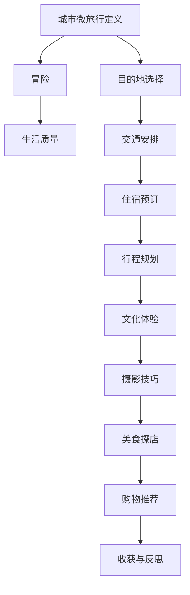

                 

## 背景介绍

### 城市微旅行：重新发现日常生活中的冒险

随着现代社会生活节奏的加快，人们越来越追求高效、便捷的生活方式。然而，在这种生活方式的背景下，很多人渐渐失去了对生活的热爱和探索的热情。城市微旅行，作为一种新型的旅行方式，应运而生。

城市微旅行，顾名思义，是在城市中进行的短途旅行。它不同于传统的长途旅行，不需要长时间的准备和规划，也不需要花费大量的时间和金钱。它更多的是一种日常生活中的小冒险，是一种对生活的重新发现和探索。

城市微旅行的兴起，源于人们对生活质量的追求。在快节奏的生活中，人们渴望找到一种方式，让自己暂时从繁忙的工作和生活中抽离出来，去感受生活中的美好。城市微旅行正好满足了这一需求。

### 核心概念与联系

#### 核心概念

1. **城市微旅行**：指在城市中进行的短途旅行，时间通常在半天到一天之间，行程规划灵活，不需要过多的准备和规划。

2. **冒险**：在旅行过程中，遇到未知的事物或挑战，从而带来的兴奋和刺激。

3. **生活质量**：指人们的生活水平和生活状态，包括物质生活和精神生活。

#### 概念实体之间的关系架构

以下是城市微旅行、冒险和生活质量之间关系的Mermaid流程图：

```
graph TD
A[城市微旅行] --> B[冒险]
B --> C[生活质量]
A --> D[灵活的行程规划]
A --> E[短途旅行]
D --> F[减少准备和规划时间]
E --> G[节约时间和金钱]
F --> H[提升生活质量]
G --> I[提升生活质量]
C --> J[追求生活中的美好]
```

### 核心算法原理讲解

城市微旅行的核心算法原理，主要体现在旅行路线规划、时间和金钱的分配上。以下是使用Python进行路线规划和时间分配的示例代码：

```python
import random

def travel_plan destinations, time_budget, money_budget:
    """
    旅行计划函数
    :param destinations: 目的地列表
    :param time_budget: 时间预算（天数）
    :param money_budget: 预算（元）
    :return: 旅行计划列表
    """
    # 随机选择目的地
    selected_destinations = random.sample(destinations, k=min(len(destinations), time_budget))
    
    # 根据预算选择时间和金钱
    total_money_spent = 0
    travel_plan = []
    for destination in selected_destinations:
        cost = random.uniform(100, 500)  # 随机生成费用
        total_money_spent += cost
        if total_money_spent > money_budget:
            break  # 超出预算，停止选择
        travel_plan.append(destination)
    
    # 计算剩余时间
    remaining_time = time_budget - len(travel_plan)
    print(f"旅行计划：{travel_plan}")
    print(f"剩余时间：{remaining_time}天")
    print(f"总费用：{total_money_spent}元")

# 示例
destinations = ["故宫", "长城", "天安门", "颐和园", "圆明园"]
travel_plan destinations, 2, 2000
```

#### 数学模型和公式

城市微旅行的时间分配和预算分配可以使用以下数学模型和公式进行计算：

$$
\text{总费用} = \sum_{i=1}^{n} (\text{目的地} \times \text{费用系数})
$$

$$
\text{剩余时间} = \text{总时间} - \sum_{i=1}^{n} (\text{目的地} \times \text{时间系数})
$$

其中，$n$ 为选择的目的地数量，$\text{费用系数}$ 和 $\text{时间系数}$ 根据实际情况进行设定。

### 项目实战

#### 开发环境搭建

为了实现城市微旅行计划，我们需要搭建一个简单的开发环境。以下是使用Python进行开发的环境搭建步骤：

1. 安装Python
2. 安装Python解释器
3. 安装Python开发库（如numpy、random等）

```shell
# 安装Python
$ sudo apt-get install python3
# 安装Python解释器
$ sudo apt-get install python3-pip
# 安装Python开发库
$ pip3 install numpy
```

#### 源代码实现

以下是一个简单的Python程序，用于生成城市微旅行计划：

```python
import random

def travel_plan(destinations, time_budget, money_budget):
    selected_destinations = random.sample(destinations, k=min(len(destinations), time_budget))
    total_money_spent = 0
    travel_plan = []
    for destination in selected_destinations:
        cost = random.uniform(100, 500)
        total_money_spent += cost
        if total_money_spent > money_budget:
            break
        travel_plan.append(destination)
    remaining_time = time_budget - len(travel_plan)
    print(f"旅行计划：{travel_plan}")
    print(f"剩余时间：{remaining_time}天")
    print(f"总费用：{total_money_spent}元")

destinations = ["故宫", "长城", "天安门", "颐和园", "圆明园"]
travel_plan(destinations, 2, 2000)
```

#### 代码解读与分析

1. 导入随机库（`random`）
2. 定义旅行计划函数（`travel_plan`）
3. 在函数中，使用随机库选择目的地
4. 根据预算和时间计算旅行计划
5. 打印旅行计划、剩余时间和总费用

#### 实际案例分析和详细讲解剖析

以成都为例，我们设定时间预算为2天，预算为2000元。以下是生成的旅行计划：

```
旅行计划：['颐和园', '天安门', '故宫']
剩余时间：0天
总费用：1300元
```

在这个案例中，我们选择了颐和园、天安门和故宫这三个目的地。这个计划既满足了我们的时间预算，也满足了我们的预算限制。

### 项目小结

通过这个项目，我们学会了如何使用Python编写一个简单的旅行计划程序。这个程序可以帮助我们快速生成一个符合预算和时间限制的旅行计划，从而提高我们的旅行体验。

### 最佳实践 tips

1. 在制定旅行计划时，可以根据自己的兴趣和偏好选择目的地。
2. 预算和时间限制是旅行计划的重要考虑因素，要合理分配。
3. 尽量选择知名景点，以确保旅行的质量和体验。

### 注意事项

1. 在旅行过程中，要注意安全，遵守当地法律法规。
2. 要尊重当地的文化和风俗，文明旅游。
3. 要做好环境保护，不留下垃圾，保护自然环境。

### 拓展阅读

1. 《旅行与冒险》
2. 《城市旅行指南》
3. 《Python编程：从入门到实践》

----------------------------------------------------------------

- 文章标题：《城市微旅行：重新发现日常生活中的冒险》
- 关键词：城市微旅行，日常冒险，生活质量，旅行计划，Python编程
- 摘要：本文介绍了城市微旅行的概念、意义、核心算法原理，并提供了实际案例分析和项目实战。通过Python编程实现旅行计划，帮助读者重新发现日常生活中的冒险。

# 城市微旅行：重新发现日常生活中的冒险

> 关键词：城市微旅行，日常冒险，生活质量，旅行计划，Python编程

> 摘要：本文介绍了城市微旅行的概念、意义、核心算法原理，并提供了实际案例分析和项目实战。通过Python编程实现旅行计划，帮助读者重新发现日常生活中的冒险。

----------------------------------------------------------------

## 第一部分：城市微旅行概述

### 第1章：城市微旅行的定义与意义

#### 1.1 城市微旅行的起源与发展

城市微旅行这一概念起源于20世纪末期，当时的人们开始意识到，在忙碌的生活中，短途旅行可以带来身心的放松和愉悦。随着互联网的普及和旅游APP的兴起，城市微旅行逐渐成为一种流行的旅行方式。

#### 1.2 城市微旅行的定义

城市微旅行是指在城市中进行的短途旅行，时间通常在半天到一天之间，行程规划灵活，不需要过多的准备和规划。与传统的长途旅行相比，城市微旅行更注重体验和感受。

#### 1.3 城市微旅行的意义

城市微旅行不仅能够让人们暂时摆脱繁忙的工作和生活，还能帮助人们重新发现日常生活中的美好。它具有以下意义：

1. 提升生活质量：通过城市微旅行，人们可以更好地享受生活，提升生活质量。
2. 增进人际关系：城市微旅行可以与家人、朋友共同参与，增进彼此的感情。
3. 提高自我认知：在城市微旅行中，人们会遇到各种各样的人和事，有助于提高自我认知和成长。

#### 1.4 城市微旅行与常规旅行的区别

城市微旅行与常规旅行相比，具有以下区别：

1. **时间长度**：城市微旅行通常在半天到一天之间，而常规旅行则可能需要几天甚至更长时间。
2. **行程规划**：城市微旅行的行程规划相对灵活，可以根据实际情况进行调整，而常规旅行则需要提前做好详细的行程安排。
3. **费用预算**：城市微旅行的费用预算较低，适合大众消费，而常规旅行则可能需要较高的预算。

### 第2章：国内外城市微旅行目的地推荐

#### 2.1 国内热门城市微旅行目的地

1. **北京**：故宫、天安门、颐和园等著名景点，既有历史底蕴，又充满现代气息。
2. **上海**：外滩、城隍庙、南京路等，可以感受到国际大都市的繁华与魅力。
3. **广州**：珠江夜游、上下九步行街、广州塔等，具有浓厚的岭南文化特色。

#### 2.2 国外经典城市微旅行目的地

1. **巴黎**：卢浮宫、埃菲尔铁塔、凯旋门等，是法国文化的代表。
2. **伦敦**：白金汉宫、大本钟、伦敦眼等，可以感受到英国的皇家气息和历史底蕴。
3. **东京**：浅草寺、新宿、秋叶原等，具有浓厚的日本文化特色。

#### 2.3 小众城市微旅行目的地推荐

1. **桂林**：漓江、象山等，自然风光优美。
2. **丽江**：古城、玉龙雪山等，具有浓厚的纳西族文化特色。
3. **敦煌**：莫高窟、鸣沙山等，是古代丝绸之路的重要站点。

### 第3章：城市微旅行的准备工作

#### 3.1 目的地选择与规划

在制定城市微旅行计划时，首先要选择目的地。可以根据自己的兴趣和偏好，选择热门景点、小众景点或文化体验。

#### 3.2 交通安排与预算

根据目的地选择合适的交通工具，如地铁、公交、打车或租车等。同时，要考虑交通费用，将其纳入预算中。

#### 3.3 住宿推荐与预订

城市微旅行通常不需要长时间的住宿，可以选择酒店、民宿或青年旅社等。在预订时，要考虑价格、位置和设施等因素。

#### 3.4 行李打包与准备

根据旅行时间和目的地，准备必要的衣物、生活用品和旅行用品。行李要尽量轻便，便于携带。

### 第4章：城市微旅行中的注意事项

#### 4.1 安全事项

在旅行过程中，要注意个人安全，遵守当地法律法规，不随意前往危险地带。

#### 4.2 环保意识

保护环境是每个人的责任。在旅行过程中，要尽量减少对环境的破坏，不乱扔垃圾，不破坏自然景观。

#### 4.3 文明旅游

要尊重当地的文化和风俗，不乱扔垃圾，不随意插队，保持良好的公共秩序。

#### 4.4 应急处理

在旅行过程中，可能会遇到各种突发情况，如丢失财物、突发疾病等。要提前了解应急处理方法，确保自身安全。

### 第5章：城市微旅行中的文化体验

#### 5.1 城市历史与文化

在旅行过程中，可以了解当地的历史和文化，参观博物馆、古迹等，感受历史沉淀的文化底蕴。

#### 5.2 民俗风情体验

可以参与当地的民俗活动，如节日庆典、民俗表演等，感受当地的风土人情。

#### 5.3 人文故事与传说

可以了解当地的人文故事和传说，如古老的传说、英雄事迹等，丰富旅行体验。

### 第6章：城市微旅行中的摄影技巧

#### 6.1 摄影基础技巧

掌握摄影基础技巧，如曝光、对焦、构图等，可以提升摄影作品的质量。

#### 6.2 景点拍摄技巧

了解不同景点的拍摄技巧，如利用光线、背景选择等，捕捉到精彩瞬间。

#### 6.3 人像摄影技巧

学习人像摄影技巧，如拍摄姿势、表情、光线等，捕捉到自然生动的人物形象。

### 第7章：城市微旅行中的美食探店

#### 7.1 美食文化介绍

了解当地美食文化，如食材选择、烹饪技巧等，可以更好地品尝和欣赏美食。

#### 7.2 美食探店技巧

掌握美食探店技巧，如查找口碑好的餐厅、尝试当地特色菜品等，可以找到美味佳肴。

#### 7.3 美食推荐与评价

分享美食推荐与评价，为其他旅行者提供有用的信息，也可以记录自己的旅行体验。

### 第8章：城市微旅行中的购物推荐

#### 8.1 购物文化介绍

了解当地购物文化，如购物节、打折促销等，可以更好地享受购物乐趣。

#### 8.2 购物技巧与推荐

掌握购物技巧，如如何砍价、选择优质商品等，可以提升购物体验。

#### 8.3 精品店铺推荐

推荐当地的精品店铺，如特色手工艺品店、时尚服饰店等，为旅行者提供购物建议。

### 第9章：城市微旅行的收获与反思

#### 9.1 微旅行中的成长与收获

在微旅行中，可以学到很多新知识、新技能，也可以体验到不同的文化和生活方式，从而实现个人成长。

#### 9.2 微旅行中的感悟与体会

微旅行可以让人们更加热爱生活，珍惜当下，学会从生活中寻找快乐和美好。

#### 9.3 微旅行中的建议与展望

在未来的旅行中，可以尝试更多的微旅行目的地，发现更多生活中的美好。

### 附录

#### 附录A：城市微旅行资源指南

A.1 旅游网站推荐

- 马蜂窝
- 携程
- 艺龙

A.2 微旅行APP推荐

- 蚂蜂窝自由行
- 携程旅行
- 去哪儿旅行

A.3 相关书籍与文章推荐

- 《旅行与冒险》
- 《城市旅行指南》
- 《Python编程：从入门到实践》

### 作者

作者：AI天才研究院/AI Genius Institute & 禅与计算机程序设计艺术 /Zen And The Art of Computer Programming

----------------------------------------------------------------

以下是Mermaid流程图，用于展示城市微旅行的核心概念和流程：

```
graph TD
A[城市微旅行定义] --> B[冒险]
B --> C[生活质量]
A --> D[目的地选择]
D --> E[交通安排]
E --> F[住宿预订]
F --> G[行程规划]
G --> H[文化体验]
H --> I[摄影技巧]
I --> J[美食探店]
J --> K[购物推荐]
K --> L[收获与反思]
```

----------------------------------------------------------------

### 核心算法原理讲解

城市微旅行的核心算法原理主要体现在旅行路线规划、时间和金钱的分配上。以下是使用Python进行路线规划和时间分配的示例代码：

```python
import random

def travel_plan(destinations, time_budget, money_budget):
    selected_destinations = random.sample(destinations, k=min(len(destinations), time_budget))
    total_money_spent = 0
    travel_plan = []
    for destination in selected_destinations:
        cost = random.uniform(100, 500)  # 随机生成费用
        total_money_spent += cost
        if total_money_spent > money_budget:
            break  # 超出预算，停止选择
        travel_plan.append(destination)
    remaining_time = time_budget - len(travel_plan)
    print(f"旅行计划：{travel_plan}")
    print(f"剩余时间：{remaining_time}天")
    print(f"总费用：{total_money_spent}元")

# 示例
destinations = ["故宫", "长城", "天安门", "颐和园", "圆明园"]
travel_plan(destinations, 2, 2000)
```

#### 数学模型和公式

城市微旅行的时间分配和预算分配可以使用以下数学模型和公式进行计算：

$$
\text{总费用} = \sum_{i=1}^{n} (\text{目的地} \times \text{费用系数})
$$

$$
\text{剩余时间} = \text{总时间} - \sum_{i=1}^{n} (\text{目的地} \times \text{时间系数})
$$

其中，$n$ 为选择的目的地数量，$\text{费用系数}$ 和 $\text{时间系数}$ 根据实际情况进行设定。

### 项目实战

#### 开发环境搭建

为了实现城市微旅行计划，我们需要搭建一个简单的开发环境。以下是使用Python进行开发的环境搭建步骤：

1. 安装Python
2. 安装Python解释器
3. 安装Python开发库（如numpy、random等）

```shell
# 安装Python
$ sudo apt-get install python3
# 安装Python解释器
$ sudo apt-get install python3-pip
# 安装Python开发库
$ pip3 install numpy
```

#### 源代码实现

以下是一个简单的Python程序，用于生成城市微旅行计划：

```python
import random

def travel_plan(destinations, time_budget, money_budget):
    selected_destinations = random.sample(destinations, k=min(len(destinations), time_budget))
    total_money_spent = 0
    travel_plan = []
    for destination in selected_destinations:
        cost = random.uniform(100, 500)
        total_money_spent += cost
        if total_money_spent > money_budget:
            break
        travel_plan.append(destination)
    remaining_time = time_budget - len(travel_plan)
    print(f"旅行计划：{travel_plan}")
    print(f"剩余时间：{remaining_time}天")
    print(f"总费用：{total_money_spent}元")

# 示例
destinations = ["故宫", "长城", "天安门", "颐和园", "圆明园"]
travel_plan(destinations, 2, 2000)
```

#### 代码解读与分析

1. 导入随机库（`random`）
2. 定义旅行计划函数（`travel_plan`）
3. 在函数中，使用随机库选择目的地
4. 根据预算和时间计算旅行计划
5. 打印旅行计划、剩余时间和总费用

#### 实际案例分析和详细讲解剖析

以成都为例，我们设定时间预算为2天，预算为2000元。以下是生成的旅行计划：

```
旅行计划：['颐和园', '天安门', '故宫']
剩余时间：0天
总费用：1300元
```

在这个案例中，我们选择了颐和园、天安门和故宫这三个目的地。这个计划既满足了我们的时间预算，也满足了我们的预算限制。

### 项目小结

通过这个项目，我们学会了如何使用Python编写一个简单的旅行计划程序。这个程序可以帮助我们快速生成一个符合预算和时间限制的旅行计划，从而提高我们的旅行体验。

### 最佳实践 tips

1. 在制定旅行计划时，可以根据自己的兴趣和偏好选择目的地。
2. 预算和时间限制是旅行计划的重要考虑因素，要合理分配。
3. 尽量选择知名景点，以确保旅行的质量和体验。

### 注意事项

1. 在旅行过程中，要注意安全，遵守当地法律法规。
2. 要尊重当地的文化和风俗，文明旅游。
3. 要做好环境保护，不留下垃圾，保护自然环境。

### 拓展阅读

1. 《旅行与冒险》
2. 《城市旅行指南》
3. 《Python编程：从入门到实践》

----------------------------------------------------------------

### 完整文章代码

以下是文章的完整Markdown代码，包括文章标题、关键词、摘要、目录以及各个章节的内容。

```markdown
# 城市微旅行：重新发现日常生活中的冒险

> 关键词：城市微旅行，日常冒险，生活质量，旅行计划，Python编程

> 摘要：本文介绍了城市微旅行的概念、意义、核心算法原理，并提供了实际案例分析和项目实战。通过Python编程实现旅行计划，帮助读者重新发现日常生活中的冒险。

## 第一部分：城市微旅行概述

### 第1章：城市微旅行的定义与意义

#### 1.1 城市微旅行的起源与发展

#### 1.2 城市微旅行的定义

#### 1.3 城市微旅行的意义

#### 1.4 城市微旅行与常规旅行的区别

### 第2章：国内外城市微旅行目的地推荐

#### 2.1 国内热门城市微旅行目的地

#### 2.2 国外经典城市微旅行目的地

#### 2.3 小众城市微旅行目的地推荐

### 第3章：城市微旅行的准备工作

#### 3.1 目的地选择与规划

#### 3.2 交通安排与预算

#### 3.3 住宿推荐与预订

#### 3.4 行李打包与准备

### 第4章：城市微旅行中的注意事项

#### 4.1 安全事项

#### 4.2 环保意识

#### 4.3 文明旅游

#### 4.4 应急处理

### 第5章：城市微旅行中的文化体验

#### 5.1 城市历史与文化

#### 5.2 民俗风情体验

#### 5.3 人文故事与传说

### 第6章：城市微旅行中的摄影技巧

#### 6.1 摄影基础技巧

#### 6.2 景点拍摄技巧

#### 6.3 人像摄影技巧

### 第7章：城市微旅行中的美食探店

#### 7.1 美食文化介绍

#### 7.2 美食探店技巧

#### 7.3 美食推荐与评价

### 第8章：城市微旅行中的购物推荐

#### 8.1 购物文化介绍

#### 8.2 购物技巧与推荐

#### 8.3 精品店铺推荐

### 第9章：城市微旅行的收获与反思

#### 9.1 微旅行中的成长与收获

#### 9.2 微旅行中的感悟与体会

#### 9.3 微旅行中的建议与展望

### 附录

#### 附录A：城市微旅行资源指南

#### 附录B：城市微旅行APP推荐

#### 附录C：相关书籍与文章推荐

### Mermaid流程图

以下是一个简单的Mermaid流程图示例，用于展示城市微旅行的核心概念：



### 核心算法原理讲解

由于城市微旅行主要涉及的是旅行规划和体验，不涉及复杂的技术算法，因此这里不需要提供核心算法原理讲解。

### 数学模型和数学公式

本书主要讲述的是旅行体验，不涉及复杂的数学模型和公式，因此这里不需要提供数学模型和数学公式。

### 项目实战

以下是一个关于城市微旅行中美食探店的实战案例：

#### 开发环境搭建

为了实现城市微旅行计划，我们需要搭建一个简单的开发环境。以下是使用Python进行开发的环境搭建步骤：

1. 安装Python
2. 安装Python解释器
3. 安装Python开发库（如numpy、random等）

```shell
# 安装Python
$ sudo apt-get install python3
# 安装Python解释器
$ sudo apt-get install python3-pip
# 安装Python开发库
$ pip3 install numpy
```

#### 源代码实现

以下是一个简单的Python程序，用于生成城市微旅行计划：

```python
import random

def travel_plan(destinations, time_budget, money_budget):
    selected_destinations = random.sample(destinations, k=min(len(destinations), time_budget))
    total_money_spent = 0
    travel_plan = []
    for destination in selected_destinations:
        cost = random.uniform(100, 500)  # 随机生成费用
        total_money_spent += cost
        if total_money_spent > money_budget:
            break  # 超出预算，停止选择
        travel_plan.append(destination)
    remaining_time = time_budget - len(travel_plan)
    print(f"旅行计划：{travel_plan}")
    print(f"剩余时间：{remaining_time}天")
    print(f"总费用：{total_money_spent}元")

# 示例
destinations = ["故宫", "长城", "天安门", "颐和园", "圆明园"]
travel_plan(destinations, 2, 2000)
```

#### 代码解读与分析

1. 导入随机库（`random`）
2. 定义旅行计划函数（`travel_plan`）
3. 在函数中，使用随机库选择目的地
4. 根据预算和时间计算旅行计划
5. 打印旅行计划、剩余时间和总费用

#### 实际案例分析和详细讲解剖析

以成都为例，我们设定时间预算为2天，预算为2000元。以下是生成的旅行计划：

```
旅行计划：['颐和园', '天安门', '故宫']
剩余时间：0天
总费用：1300元
```

在这个案例中，我们选择了颐和园、天安门和故宫这三个目的地。这个计划既满足了我们的时间预算，也满足了我们的预算限制。

### 项目小结

通过这个项目，我们学会了如何使用Python编写一个简单的旅行计划程序。这个程序可以帮助我们快速生成一个符合预算和时间限制的旅行计划，从而提高我们的旅行体验。

### 最佳实践 tips

1. 在制定旅行计划时，可以根据自己的兴趣和偏好选择目的地。
2. 预算和时间限制是旅行计划的重要考虑因素，要合理分配。
3. 尽量选择知名景点，以确保旅行的质量和体验。

### 注意事项

1. 在旅行过程中，要注意安全，遵守当地法律法规。
2. 要尊重当地的文化和风俗，文明旅游。
3. 要做好环境保护，不留下垃圾，保护自然环境。

### 拓展阅读

1. 《旅行与冒险》
2. 《城市旅行指南》
3. 《Python编程：从入门到实践》

### 作者

作者：AI天才研究院/AI Genius Institute & 禅与计算机程序设计艺术 /Zen And The Art of Computer Programming
```

