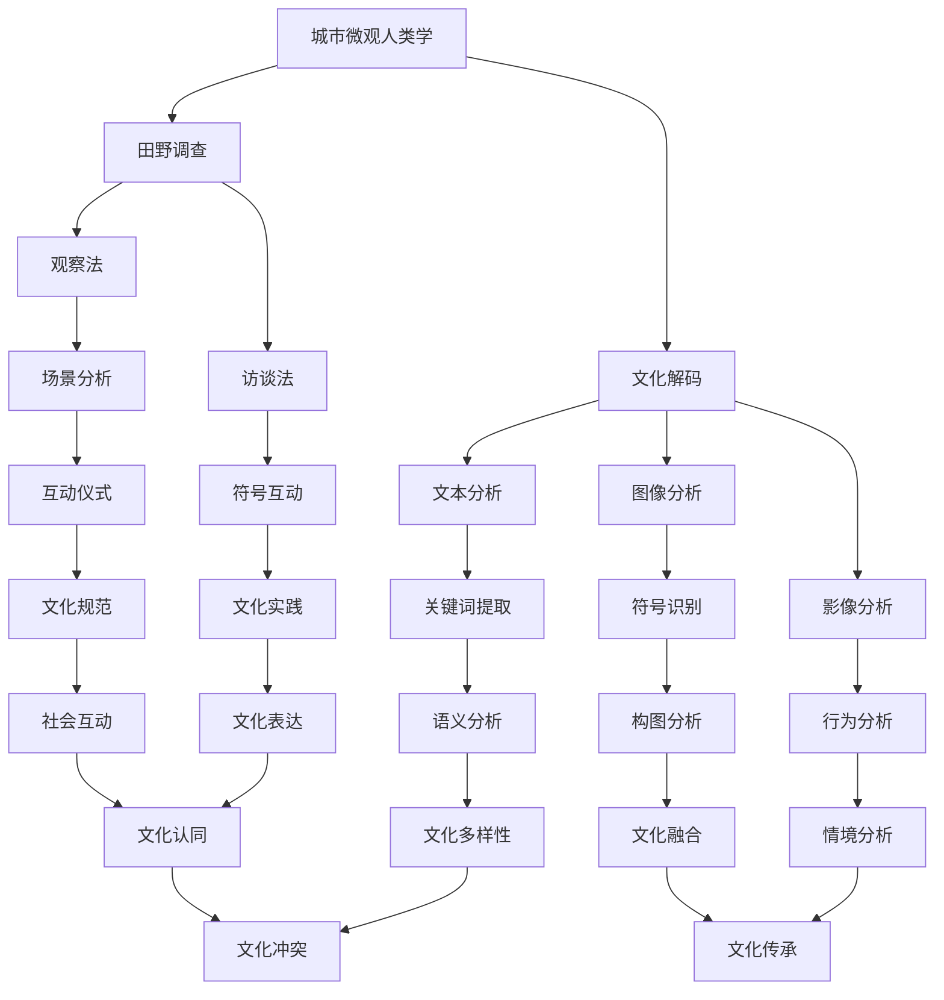

                 

### 城市微观人类学：理论与实践框架

**关键词**：城市微观人类学，文化解码，日常生活研究，田野调查

**摘要**：本文旨在探讨城市微观人类学的基本理论和实践方法，特别是其在日常生活中的文化解码应用。通过对城市微观人类学的定义、理论基础和研究方法的深入分析，本文将揭示其在现代社会中的重要性，并阐述其如何帮助我们更好地理解城市文化和人类行为。

在城市快速发展的背景下，城市微观人类学作为一种新兴的研究领域，正日益受到关注。它关注的是城市中的个体和群体行为，通过观察、访谈和文献分析等方法，探索隐藏在日常生活背后的文化意义和社会结构。这不仅有助于我们深入了解城市社会，还能为城市规划、城市治理和公共政策的制定提供科学依据。

本文将首先介绍城市微观人类学的基本理论，包括其定义、起源和研究方法。然后，我们将探讨田野调查在文化解码中的重要性，并详细描述田野调查的实施步骤。接着，本文将介绍文化解码的理论和实践方法，结合具体案例，展示其在日常生活研究中的应用。

最后，本文将探讨文化解码在城市管理中的应用前景，并总结全文，提出未来研究方向。通过这一系列分析，我们希望读者能够对城市微观人类学有一个全面、深入的理解，认识到其在现代社会中的重要价值。

### 城市微观人类学的定义与研究方法

城市微观人类学是一种专注于城市环境中个体和群体行为的文化研究方法。其核心在于通过细致的观察和深入的访谈，揭示隐藏在日常生活中看似平凡现象背后的复杂文化和社会机制。要理解城市微观人类学，我们首先需要明确其定义和研究方法。

**1.1 城市微观人类学的定义**

城市微观人类学可以定义为对城市生活中的微观现象进行的人类学研究。这些微观现象包括但不限于：人们在公共交通工具中的行为、街道上的互动、社区活动中的文化表达等。通过这些微观现象的观察和分析，城市微观人类学家试图揭示出城市文化和社会结构的深层次规律。

城市微观人类学的定义与传统的宏观社会学研究有所不同。宏观社会学通常关注的是大范围的社会现象，如人口流动、社会分层和城市化进程。而城市微观人类学则更加关注具体的行为模式和文化实践，通过微观视角来理解这些现象背后的文化逻辑。

**1.1.1 城市微观人类学的起源**

城市微观人类学的起源可以追溯到20世纪60年代，当时城市化和现代化进程迅速推进，社会学者们开始意识到传统的研究方法难以全面揭示城市生活中的复杂现象。在这种背景下，一些学者开始尝试将人类学的方法应用于城市研究，以更细致地观察和分析城市中的微观行为。

其中，美国社会学家欧文·高夫曼（Erving Goffman）的理论对城市微观人类学产生了深远影响。他在《日常生活中的自我呈现》（"The Presentation of Self in Everyday Life"）一书中，提出了“角色扮演”和“互动仪式”等概念，强调人们在日常生活中如何通过行为和语言来构建和维持自己的社会角色。

**1.1.2 城市微观人类学的研究领域**

城市微观人类学的研究领域非常广泛，涵盖了城市生活的各个方面。以下是一些主要的研究方向：

1. **日常生活实践**：研究人们在日常生活中的行为习惯、文化实践和社会互动。
2. **城市空间与社会结构**：分析城市空间如何影响人类行为，以及社会结构如何在城市空间中体现。
3. **文化多样性**：研究不同文化背景下的城市居民如何适应和互动。
4. **社会问题**：探讨城市中的社会问题，如贫困、不平等和社会隔离，以及它们对个体和社区的影响。
5. **科技与城市生活**：研究信息技术和数字媒体如何改变城市生活和人类行为。

**1.1.3 城市微观人类学的核心概念**

城市微观人类学的核心概念包括以下几个方面：

1. **互动仪式**：指人们在日常生活中通过行为和语言进行的互动，这些互动不仅建立了个体的社会身份，还影响了社区的文化和社会结构。
2. **符号互动**：强调人们在互动过程中如何使用符号来传达意义，这些符号可以是语言、行为、物品等。
3. **场景分析**：通过分析特定场景中的行为和互动，来理解社会现象背后的文化逻辑。
4. **文化实践**：指人们在日常生活中进行的文化活动，如节日庆典、社区活动等，这些活动是文化传承和社会认同的重要方式。
5. **微观文化**：指那些在日常生活中的微观现象中表现出来的文化特征，这些特征往往被人们忽视，但却是理解城市文化和社会结构的关键。

通过对这些核心概念的理解，我们可以更好地运用城市微观人类学的方法，深入分析城市生活中的各种现象，从而为城市规划、城市治理和社会发展提供科学依据。

### 城市微观人类学与日常生活研究的关系

城市微观人类学关注的是城市生活中的微观现象，这些现象与我们的日常生活息息相关。要理解城市微观人类学在日常生活研究中的重要性，我们需要首先明确日常生活的定义及其文化属性。

**2.1.1 日常生活的定义**

日常生活指的是人们在日常活动中所经历的各种现象，包括工作、学习、休闲、购物、交往等。它是社会结构的基石，也是文化传承和社会互动的基本场所。日常生活的特征在于其重复性和规范性，人们在这些重复性的活动中形成了稳定的行为模式和社会关系。

**2.1.2 城市日常生活的文化属性**

城市日常生活具有显著的文化属性，这是因为城市环境提供了丰富的文化资源和多样的文化实践机会。城市居民通过日常互动和文化活动，不仅构建了个人身份，还塑造了社区文化和城市文化。具体来说，城市日常生活的文化属性体现在以下几个方面：

1. **文化多样性**：城市是各种文化交汇和融合的场所，不同的文化背景、习俗和价值观在城市中相互影响和共存，形成了独特的城市文化景观。
2. **文化实践**：城市居民通过参与各种文化活动，如节日庆典、社区活动、文化活动中心等，不断创造和传承文化。
3. **文化消费**：城市提供了丰富的文化消费场所和产品，如电影院、书店、博物馆等，这些场所和产品是城市文化的重要组成部分。
4. **文化适应**：城市居民需要适应不断变化的文化环境，这种适应过程不仅影响了个体的文化认同，也影响了社区和城市的文化特征。

**2.2.3 城市微观人类学在日常生活研究中的应用**

城市微观人类学通过细致的观察和深入的分析，揭示隐藏在日常生活中的复杂文化和社会机制。以下是城市微观人类学在日常生活研究中的应用：

1. **文化解码**：城市微观人类学家通过田野调查和访谈，对日常生活中的现象进行文化解码，揭示其背后的文化意义和社会结构。例如，通过对城市公共交通中的互动行为进行分析，可以理解城市居民在公共空间中的社会规范和文化价值观。
2. **场景分析**：城市微观人类学家通过分析特定场景中的行为和互动，来理解社会现象背后的文化逻辑。例如，通过分析社区广场上的文化活动，可以探讨社区成员之间的互动关系和文化认同。
3. **社会问题研究**：城市微观人类学可以帮助我们更好地理解城市中的社会问题，如贫困、不平等和社会隔离。通过对这些问题背后的文化因素进行深入分析，可以为政策制定提供科学依据。
4. **文化多样性研究**：城市微观人类学通过研究城市中的不同文化群体，探讨文化多样性的形成和影响。这有助于促进不同文化之间的理解和交流，增强社会凝聚力。

通过以上分析，我们可以看到，城市微观人类学在日常生活研究中具有重要作用。它不仅帮助我们更深入地理解城市文化和人类行为，还能为城市规划和治理提供科学依据，从而促进城市可持续发展和社会进步。

### 城市微观人类学田野调查的重要性

田野调查是城市微观人类学研究的重要方法，它通过直接观察和互动，帮助我们深入了解城市日常生活中的微观现象。在田野调查中，研究者可以亲身体验和观察城市居民的行为和文化实践，从而获取第一手的、详细的数据和资料。

**2.1.1 田野调查的定义**

田野调查（Field Research）是指在自然环境下，通过观察、访谈和参与等方式，收集关于特定社会现象的数据和资料的过程。在城市微观人类学中，田野调查是研究者与城市居民互动的过程，通过直接观察和访谈，研究者能够深入了解城市生活的方方面面。

**2.1.2 田野调查的方法**

田野调查的方法多种多样，以下是一些常用的田野调查方法：

1. **观察法**：观察法是田野调查中最基本的方法，研究者通过直接观察城市居民的行为、互动和文化实践，记录下所观察到的一切。观察法可以是结构化的，也可以是非结构化的，根据研究目的和需求来设计。
2. **访谈法**：访谈法是通过与研究对象进行面对面交流，获取他们对特定现象的看法和经验。访谈可以是半结构化的或非结构化的，研究者可以根据访谈的进程和发现，灵活调整问题。
3. **参与观察**：参与观察是研究者以参与者的身份，融入被研究的群体，通过亲身参与和观察，了解其行为和文化实践。这种方法可以获得更真实和深入的信息，但需要研究者具备较强的适应能力和观察力。

**2.1.3 田野调查的优势和挑战**

田野调查在文化解码中的应用具有显著的优势，同时也面临一些挑战。

**优势：**

1. **真实性**：田野调查可以直接观察和记录城市居民的日常生活，获取真实可靠的数据和资料，这些资料能够揭示隐藏在日常生活背后的复杂文化和社会机制。
2. **深入性**：通过直接的观察和访谈，研究者可以深入了解研究对象的行为和思想，获取详细的背景信息，从而对现象进行深入分析。
3. **灵活性**：田野调查的方法多样，研究者可以根据研究目的和需求，灵活选择和组合不同的方法，从而获得全面而深入的研究结果。

**挑战：**

1. **数据收集难度**：田野调查需要长时间和大量的时间和精力，尤其是在大都市中，要找到合适的研究对象和地点，并进行有效的观察和访谈，是一项挑战。
2. **伦理问题**：在进行田野调查时，研究者需要尊重研究对象的隐私和权利，避免对研究对象造成不必要的困扰或伤害。
3. **主观性**：田野调查依赖于研究者的观察和判断，不同研究者可能会有不同的观察和解释，从而影响研究的客观性和可靠性。

**2.2.3 田野调查的实施步骤**

要成功地开展田野调查，研究者需要遵循一系列的实施步骤，这些步骤包括：

1. **准备阶段**：确定研究目的和问题，选择合适的研究地点和对象，设计调查工具和访谈提纲，获取相关机构的批准和同意。
2. **实施阶段**：按照调查计划和工具进行实地调查，记录观察和访谈结果，收集相关数据和资料。
3. **分析阶段**：对收集到的数据进行整理和分析，运用各种分析工具和方法，提取有价值的信息和结论。
4. **报告阶段**：撰写调查报告，总结研究结果，提出结论和建议，并进行学术交流。

通过以上步骤，研究者可以系统地开展田野调查，深入分析城市日常生活中的文化现象，为城市管理和公共政策提供科学依据。田野调查不仅是一种重要的研究方法，也是城市微观人类学研究中不可或缺的一部分。

### 田野调查的实施步骤

要成功地进行田野调查，并确保数据的准确性和可靠性，研究者需要精心规划并严格执行调查的实施步骤。以下是田野调查的具体实施步骤：

**2.2.1 调查前的准备工作**

在开始田野调查之前，研究者需要进行充分的准备工作，确保调查的顺利进行。以下是一些关键的准备工作步骤：

1. **确定研究目的和问题**：明确研究的目标和问题，这将为后续的调研设计提供方向。
2. **选择研究地点和对象**：根据研究目的，选择合适的研究地点和研究对象。研究地点可以是城市中的特定区域，如社区、商业区或公共交通站点。研究对象则包括各个年龄、性别和文化背景的个体或群体。
3. **设计调查工具**：根据研究问题和目的，设计调查问卷、访谈提纲或观察记录表。调查工具需要具有科学性和可操作性，能够有效地收集所需的数据和信息。
4. **获取同意和批准**：如果调查涉及敏感信息或特定人群，研究者需要获取相关机构的批准和被调查者的同意，确保调查的合法性和道德性。

**2.2.2 调查中的观察与访谈**

在田野调查的实施阶段，研究者需要通过观察和访谈获取数据。以下是具体的观察与访谈步骤：

1. **观察**：
   - **确定观察点**：选择合适的观察位置，以便全面、无干扰地观察目标现象。
   - **记录观察结果**：详细记录观察到的行为、事件和情境，确保信息的准确性和完整性。
   - **使用观察指南**：如果可能，研究者可以使用观察指南，帮助记录关键观察点，避免遗漏重要信息。

2. **访谈**：
   - **准备访谈提纲**：根据研究问题和目的，设计半结构化或非结构化的访谈提纲。
   - **建立信任关系**：与被访谈者建立良好的信任关系，确保访谈的顺利进行和信息的真实性。
   - **进行访谈**：按照访谈提纲进行提问，引导被访谈者提供详细的回答。注意倾听和观察被访谈者的非言语信息，以便更全面地理解其观点。
   - **录音或记录**：如果条件允许，可以使用录音设备记录访谈过程，确保数据的准确性和完整性。

**2.2.3 调查后的资料整理与分析**

在田野调查完成后，研究者需要对收集到的资料进行整理和分析。以下是具体的整理和分析步骤：

1. **数据整理**：
   - **整理观察记录**：将观察记录整理成结构化的数据，如表格或清单。
   - **整理访谈记录**：将访谈录音转录为文字，并进行编码，以便后续分析。

2. **数据分析**：
   - **定性分析**：通过编码和分类，提取数据中的关键信息，形成主题和模式。
   - **定量分析**：如果数据量较大，可以使用统计方法进行分析，如频率分布、相关性分析等。

3. **撰写报告**：根据分析结果，撰写田野调查报告，总结研究发现，提出结论和建议。

通过以上步骤，研究者可以系统地开展田野调查，深入分析城市日常生活中的微观现象，为城市管理和公共政策提供科学依据。田野调查不仅是一种重要的研究方法，也是城市微观人类学研究中不可或缺的一部分。

### 文化解码的定义与概念

文化解码（Cultural Decoding）是城市微观人类学中的重要概念，它指的是从复杂的城市文化现象中提取和解释文化意义的过程。通过对文化现象的解码，研究者可以理解其背后的文化逻辑和社会结构，从而揭示隐藏在表面现象下的深层次内涵。

**3.1.1 文化解码的起源**

文化解码的概念起源于20世纪60年代，当时社会学者开始意识到传统的宏观研究方法无法充分揭示城市生活中的复杂文化现象。在这个背景下，一些学者如欧文·高夫曼（Erving Goffman）和克利福德·格尔茨（Clifford Geertz）提出了文化解码的理论，强调通过细致的观察和分析，揭示文化现象背后的象征意义。

欧文·高夫曼的“场景分析”理论对文化解码的发展产生了重要影响。他认为，人们在社会互动中通过角色扮演和符号使用，来构建和维持自己的社会身份。这一理论强调了文化符号在互动过程中的重要性，为文化解码提供了理论基础。

**3.1.2 文化解码的理论基础**

文化解码的理论基础主要包括符号互动理论和文化解释理论。

1. **符号互动理论**：符号互动理论强调人类行为是通过符号互动来实现的，符号包括语言、行为、物品等。文化解码过程中，研究者通过分析这些符号，理解其象征意义，从而揭示文化现象背后的社会结构。

2. **文化解释理论**：文化解释理论认为，文化现象是特定社会背景下人类行为和思想的体现。文化解码通过深入分析文化现象，理解其历史和社会背景，从而揭示其文化意义。

**3.1.3 文化解码在日常生活研究中的意义**

文化解码在日常生活研究中的意义重大，主要体现在以下几个方面：

1. **揭示隐藏意义**：通过文化解码，研究者可以揭示隐藏在日常生活中的文化意义和社会结构，从而更全面地理解城市文化。

2. **理解社会互动**：文化解码有助于理解社会互动中的符号使用和角色扮演，揭示人们如何通过互动来构建和维护社会关系。

3. **促进文化多样性**：文化解码可以促进不同文化之间的理解和交流，减少文化误解和冲突，增强社会凝聚力。

4. **指导城市管理**：文化解码可以为城市管理提供科学依据，帮助制定更符合文化特征和社会需求的政策和规划。

总之，文化解码是城市微观人类学中的重要概念，通过细致的分析和解读，研究者可以深入理解城市文化和人类行为，为城市发展和治理提供有力支持。

### 文化解码的方法与技巧

文化解码作为一种深入理解和分析文化现象的方法，其应用不仅需要理论支持，还需要具体的操作方法和技巧。以下将介绍几种常用的文化解码方法，包括文本分析、图像分析和影像分析，并探讨其在日常生活中的应用。

**3.2.1 文本分析**

文本分析是文化解码中最常用的方法之一，它通过分析文本中的语言和符号，揭示其背后的文化意义。以下是一些具体的文本分析方法：

1. **关键词提取**：通过提取文本中出现频率较高的关键词，可以了解文本的主旨和重点。例如，在分析一篇关于城市公共交通的文本时，可以提取出“拥挤”、“等待”、“礼貌”等关键词，分析这些关键词背后的文化意义。

2. **语义分析**：对文本中的词语进行语义分析，可以理解其在特定文化背景下的含义。例如，分析“自由”在不同文化背景下的含义，可以揭示不同文化对于自由的理解和追求。

3. **文本分类**：通过对大量文本进行分类，可以识别出不同文本类型的特征和文化内涵。例如，通过对社交媒体上的评论进行分类，可以了解公众对于特定事件的看法和态度。

**3.2.2 图像分析**

图像分析是通过分析图像中的符号和构图，来理解其背后的文化意义。以下是一些具体的图像分析方法：

1. **符号识别**：识别图像中的符号，如标志、图案、颜色等，并分析其象征意义。例如，分析一个城市中的广告牌，可以识别出其宣传的产品和价值观。

2. **构图分析**：通过分析图像的构图和布局，可以理解其文化内涵和视觉意义。例如，分析一张城市风景照，可以探讨其表达的城市文化和历史背景。

3. **图像拼接**：将多张图像进行拼接和对比，可以揭示不同图像之间的关联和差异，从而更全面地理解文化现象。例如，分析一系列城市改造前的照片和改造后的照片，可以探讨城市发展的文化影响。

**3.2.3 影像分析**

影像分析是通过分析影像中的行为和情境，来理解其背后的文化逻辑。以下是一些具体的影像分析方法：

1. **行为分析**：通过对影像中人物的行为进行细致分析，可以理解其行为背后的文化意义。例如，分析一段公共交通中的录像，可以探讨人们在公共空间中的行为规范和文化价值观。

2. **情境分析**：通过分析影像中的情境，可以理解其文化背景和社会影响。例如，分析一段街头音乐表演的录像，可以探讨街头文化在城市社会中的角色和意义。

3. **时间序列分析**：通过对同一地点在不同时间拍摄的影像进行对比，可以观察文化现象的变化和发展。例如，分析一段城市街道在不同季节的影像，可以探讨城市环境和文化活动的时间特征。

在实际应用中，文化解码的方法和技巧需要根据具体的研究问题和数据类型来选择和组合。例如，在研究城市公共交通文化时，可以结合文本分析、图像分析和影像分析，从不同角度深入理解公共交通中的文化现象。

通过以上分析，我们可以看到，文化解码的方法和技巧不仅能够帮助研究者深入理解文化现象，还能为城市管理和公共政策提供科学依据。文化解码作为一种重要的研究方法，在日常生活研究和城市研究中具有广泛的应用前景。

### 城市微观人类学田野调查的案例研究

通过对城市微观人类学田野调查的案例研究，我们可以更深入地理解这一研究方法在日常生活研究中的具体应用。以下我们将分析三个典型案例：城市公共交通的文化解码、城市街道文化的解码和城市社区文化的调查。

#### 4.1 城市公共交通的文化解码

城市公共交通是城市居民日常生活中不可或缺的一部分，它不仅是人们出行的工具，也是文化互动的场所。在城市微观人类学的田野调查中，研究者可以观察到公共交通中的各种文化现象，并通过文化解码来揭示其背后的文化意义。

**4.1.1 公共交通的日常文化现象**

在公共交通中，常见的文化现象包括乘客的行为规范、互动模式和文化表达。例如，在地铁或公交车上，乘客们遵守的礼仪，如排队上车、保持安静、让座等，这些都是公共交通文化的一部分。同时，公共交通也成为各种文化表达的场所，如街头艺人的表演、公益广告的宣传等。

**4.1.2 公共交通的文化解码分析**

通过田野调查，研究者可以采用观察法、访谈法和文本分析等方法，对公共交通中的文化现象进行深入分析。

1. **观察法**：研究者可以在公共交通工具上观察乘客的行为，记录下各种文化现象的表现形式，如乘客之间的互动、行为规范等。

2. **访谈法**：通过与乘客进行访谈，研究者可以了解他们对公共交通文化的看法和体验，从而揭示公共交通文化背后的社会结构和价值观念。

3. **文本分析**：通过对公共交通中的标语、广告和宣传材料进行文本分析，研究者可以理解这些文本如何传达文化意义和价值观。

通过以上方法，研究者可以得出以下结论：

- **文化规范**：公共交通中的行为规范反映了城市文化对于公共秩序和礼仪的重视。例如，让座行为不仅体现了对他人的尊重，也是城市文明的一种体现。

- **文化表达**：公共交通成为文化表达的场所，街头艺人的表演和公益广告的宣传不仅丰富了城市文化，也提升了公众的文化素养和社会责任感。

- **社会互动**：公共交通中的互动模式反映了不同社会群体之间的互动关系和文化认同。例如，年轻人之间的交流方式可能与中老年人不同，这反映了不同年龄群体之间的文化差异。

#### 5.2 城市街道文化的解码

城市街道是城市文化的缩影，它不仅是人们日常活动的主要场所，也是各种文化活动的发生地。通过田野调查，研究者可以深入解析城市街道文化的多样性和复杂性。

**5.2.1 城市街道文化的多样性与复杂性**

城市街道文化表现出明显的多样性和复杂性。例如，不同街道的景观和活动形式各不相同，反映了当地的历史、文化和社会背景。一些街道可能充满了商业气息，如商业街和夜市；而另一些街道则可能以文化活动和艺术表演为主，如艺术街区和音乐街区。

**5.2.2 城市街道文化的解码实践**

在田野调查中，研究者可以采用以下方法来解码城市街道文化：

1. **观察法**：通过观察街道上的各种活动和文化现象，如街头表演、市场交易、公共艺术等，研究者可以记录下这些活动的表现形式和特点。

2. **访谈法**：通过与街道居民和商家进行访谈，研究者可以了解他们对街道文化的看法和体验，从而揭示街道文化的社会影响和文化内涵。

3. **图像分析**：通过对街道景观和活动进行图像分析，研究者可以提取出视觉符号和文化特征，从而更好地理解街道文化。

通过以上方法，研究者可以得出以下结论：

- **文化多样性**：城市街道文化的多样性反映了不同文化群体在城市中的融合和共存。这种多样性不仅丰富了城市文化，也为居民提供了多样化的文化体验。

- **文化融合**：城市街道文化中的融合现象体现了不同文化之间的相互影响和交流。例如，一个国际大都市的街道上可能同时存在中国传统建筑、现代艺术装置和国际化商业设施。

- **文化表达**：街道文化成为居民表达个性和文化认同的重要场所。例如，街头艺术家通过创作和表演，表达对自由和个性的追求。

#### 6.3 城市社区文化的调查

城市社区是城市居民日常生活的主要场所，也是文化传承和社会互动的重要平台。通过田野调查，研究者可以深入探讨城市社区文化的特色和变迁。

**6.3.1 城市社区文化的特色与变迁**

城市社区文化具有明显的特色和变迁。一方面，社区文化反映了当地的历史和文化传统，如节庆活动、传统手工艺等；另一方面，随着城市化进程的加快，社区文化也在不断变迁，融入了现代化的元素。

**6.3.2 社区文化调查与解码**

在田野调查中，研究者可以采用以下方法来调查和解读社区文化：

1. **观察法**：通过观察社区中的各种活动和文化现象，如社区广场上的表演、街头巷尾的集市等，研究者可以记录下这些活动的表现形式和特点。

2. **访谈法**：通过与社区居民进行访谈，研究者可以了解他们对社区文化的看法和体验，从而揭示社区文化的社会影响和文化内涵。

3. **文献分析**：通过查阅社区历史文献和档案，研究者可以了解社区的历史变迁和文化传统。

通过以上方法，研究者可以得出以下结论：

- **文化传承**：城市社区文化是文化传承的重要载体，通过节庆活动、传统手工艺等，社区文化得以代代相传。

- **文化变迁**：随着城市化进程的加快，社区文化也在不断变迁，现代化元素和外来文化的融入，使得社区文化更加多样化和开放。

- **社会互动**：社区文化为居民提供了一个互动和交流的平台，通过社区活动，居民之间建立了深厚的社交关系，增强了社区的凝聚力和归属感。

通过以上案例研究，我们可以看到，城市微观人类学的田野调查在日常生活研究中的重要作用。它不仅帮助我们深入理解城市文化和人类行为，还能为城市管理和公共政策提供科学依据。未来，随着城市化进程的加快，城市微观人类学的研究将具有更广泛的应用前景。

### 文化解码在城市管理中的应用前景

文化解码作为一种深入理解和分析文化现象的方法，在城市管理中具有广泛的应用前景。通过文化解码，城市管理者可以更好地理解城市文化和社会结构，从而制定更加科学、合理的政策和管理措施。

**7.1.1 文化解码对城市规划的影响**

在城市规划中，文化解码可以帮助确定城市的文化特色和发展方向。以下是一些具体的应用：

1. **文化特色识别**：通过文化解码，可以识别出城市中的文化特色和优势，如历史建筑、文化遗产、特色街区等。这些特色可以作为城市规划的重要参考，保护和传承城市文化。

2. **文化因素融入**：在城市规划中，可以融入文化解码的结果，如通过设计具有文化意义的建筑和景观，提升城市的文化氛围和吸引力。

3. **城市规划评估**：文化解码可以为城市规划提供评估工具，通过分析文化解码的结果，评估城市规划的文化影响和社会效益。

**7.1.2 文化解码在城市规划中的应用案例**

以下是一些城市规划和治理中的文化解码应用案例：

1. **旧城改造**：在旧城改造项目中，文化解码可以识别出原有的文化特色和建筑风格，确保改造过程中尊重和保留这些文化元素。

2. **文化街区建设**：通过文化解码，可以确定文化街区的核心内容和特色，设计具有文化吸引力的商业布局和景观，提升街区的文化价值和经济效益。

3. **公共空间设计**：在公共空间设计中，文化解码可以指导设计具有文化意义的公共设施和景观，如文化广场、艺术装置等，提升公共空间的文化氛围和使用价值。

**7.2.1 文化解码在城市治理中的角色**

文化解码在城市治理中扮演着重要角色，以下是一些具体的应用：

1. **社区管理**：通过文化解码，可以了解社区居民的文化需求和期望，制定更符合社区文化特点的管理措施，提升社区治理效果。

2. **社会问题解决**：文化解码可以帮助识别城市中的社会问题，如文化冲突、社会不平等等，通过深入分析，找到解决问题的文化根源，制定有效的治理策略。

3. **政策制定**：文化解码可以为政策制定提供科学依据，通过分析文化现象和文化需求，制定更符合实际的文化政策和社会政策。

**7.2.2 文化解码在社区治理中的实践**

以下是一些文化解码在社区治理中的应用实践：

1. **社区文化调查**：通过文化解码，进行社区文化调查，了解社区居民的文化需求和文化认同，制定社区文化活动和项目。

2. **文化调解**：在处理社区冲突时，文化解码可以提供调解依据，通过分析文化背景和价值观，找到冲突的根源，制定合适的调解方案。

3. **文化教育**：通过文化解码，可以设计文化教育活动，提升居民的文化素养和文化认同，增强社区凝聚力。

总之，文化解码在城市管理中的应用前景广阔。通过文化解码，城市管理者可以更好地理解城市文化和人类行为，制定更科学、合理的政策和措施，提升城市的文化品质和居民生活质量。未来，随着城市化进程的加快，文化解码在城市管理中的重要性将日益凸显。

### 文化解码与城市可持续发展

文化解码在推动城市可持续发展中扮演着关键角色，通过深入理解和分析城市文化，我们可以制定出更加符合社会需求和环境保护的政策和措施。

**8.1.1 可持续城市发展的挑战**

当前，全球城市正面临着诸多可持续发展挑战，包括资源短缺、环境污染、社会不平等和气候变化等。这些挑战要求城市在发展过程中，不仅要追求经济增长，还要关注社会公平和环境保护。文化解码可以帮助我们更好地应对这些挑战，通过理解和分析城市文化，找到解决问题的关键。

**8.1.2 文化解码在可持续发展中的作用**

文化解码在可持续发展中具有以下几个重要作用：

1. **促进社会公平**：通过文化解码，可以识别出城市中的社会不平等和文化冲突现象，从而制定出更公平的社会政策。例如，通过对不同社区的文化需求进行分析，可以设计出满足不同群体需求的社会服务和设施。

2. **提升环境意识**：文化解码可以帮助我们理解城市居民对环境的看法和行为，从而提升环境意识。例如，通过分析公共宣传和社区活动中的环境文化元素，可以推动居民采取环保行为，减少环境污染。

3. **增强社区凝聚力**：文化解码可以揭示城市社区的文化特点和居民之间的互动关系，从而增强社区凝聚力。例如，通过分析社区节庆活动和公共空间的使用情况，可以设计出促进社区交流和互动的社区项目。

**8.2.1 文化解码在可持续发展中的实施策略**

要实现文化解码在可持续发展中的应用，需要采取以下策略：

1. **政策制定与文化解码的结合**：在城市规划和政策制定过程中，应充分考虑文化解码的结果，将文化因素纳入到政策分析和决策中。例如，在城市交通规划中，可以结合公共交通文化分析的结果，设计出更符合居民需求的交通系统。

2. **社区参与**：文化解码不仅需要研究者的分析，还需要社区居民的参与。通过社区参与，可以更好地理解居民的需求和期望，从而制定出更符合社区实际的可持续发展策略。

3. **文化教育和传播**：通过文化教育和传播，可以提升居民对可持续发展的认识和参与度。例如，可以通过社区讲座、文化活动等形式，传播可持续发展的理念和实践，引导居民采取环保行动。

**8.2.2 社区参与与文化解码的实施**

以下是在社区层面实施文化解码和可持续发展的具体步骤：

1. **社区调查**：通过问卷调查、访谈和观察等方式，收集社区成员的文化需求和可持续发展观点。

2. **数据分析和解读**：对收集到的数据进行分析和解读，识别出社区的文化特点和社会问题。

3. **社区讨论和规划**：组织社区成员进行讨论，共同制定可持续发展策略和文化项目。

4. **实施和监测**：根据讨论结果，实施具体的文化活动和可持续发展项目，并定期进行监测和评估，确保项目的有效性和可持续性。

通过以上策略和步骤，文化解码可以在城市可持续发展中发挥重要作用，促进城市的经济、社会和环境协调发展。

### 附录：研究工具与方法

在城市微观人类学的研究中，有效的工具和方法是确保研究质量和可靠性的关键。以下将介绍一些常用的研究方法和技术支持，包括田野调查的方法、数据可视化工具和文本分析软件。

**9.1 田野调查的方法**

田野调查是城市微观人类学中不可或缺的方法，它通过直接观察和互动，帮助我们深入了解城市日常生活中的微观现象。以下是几种常用的田野调查方法：

1. **观察法**：观察法是田野调查中最基本的方法，研究者通过直接观察城市居民的行为、互动和文化实践，记录下所观察到的一切。观察法可以是结构化的，也可以是非结构化的，根据研究目的和需求来设计。

2. **访谈法**：访谈法是通过与研究对象进行面对面交流，获取他们对特定现象的看法和经验。访谈可以是半结构化的或非结构化的，研究者可以根据访谈的进程和发现，灵活调整问题。

3. **参与观察**：参与观察是研究者以参与者的身份，融入被研究的群体，通过亲身参与和观察，了解其行为和文化实践。这种方法可以获得更真实和深入的信息，但需要研究者具备较强的适应能力和观察力。

**9.2 数据可视化工具**

数据可视化工具在研究和数据分析中起着重要作用，它们可以将复杂的数据以图形化的方式呈现，使得研究者更容易理解和分析数据。以下是一些常用的数据可视化工具：

1. **Tableau**：Tableau是一款强大的数据可视化工具，它支持多种数据源，可以通过拖拽和点击操作轻松创建交互式的可视化图表。

2. **Power BI**：Power BI是微软开发的一款数据可视化工具，它提供了丰富的可视化模板和自定义选项，可以帮助用户快速创建专业级的报表和图表。

3. **Gephi**：Gephi是一款开源的复杂网络分析工具，主要用于可视化和分析社会网络。它可以帮助研究者理解和分析城市居民之间的互动关系。

**9.3 文本分析软件**

文本分析软件在文化解码和日常生活中文化现象的研究中具有重要作用，以下是一些常用的文本分析软件：

1. **NVivo**：NVivo是一款专业的质性数据分析和文本分析软件，它提供了丰富的编码和分类功能，可以帮助研究者对访谈记录和文本资料进行深入分析。

2. **Atlas.ti**：Atlas.ti是另一款专业的质性数据分析和文本分析软件，它支持多种数据源，提供了强大的编码、分析和可视化功能。

3. **QDA Miner**：QDA Miner是一款适用于社会科学研究的文本分析软件，它提供了直观的界面和强大的分析功能，可以帮助研究者对文本数据进行编码和主题分析。

通过以上方法和工具的支持，研究者可以更有效地进行城市微观人类学的研究，深入分析和解读城市日常生活中的文化现象，为城市管理和政策制定提供科学依据。

### 核心概念与联系

在本文中，我们探讨了城市微观人类学及其相关核心概念。为了更好地理解这些概念之间的联系，我们使用Mermaid流程图来展示它们之间的关系架构。

以下是一个简单的Mermaid流程图示例，展示了城市微观人类学中的核心概念：



这个流程图展示了城市微观人类学的核心概念，如田野调查、文化解码、观察法、访谈法、文本分析、图像分析、影像分析等。这些概念相互关联，共同构成了城市微观人类学的研究框架。通过这种方式，我们可以更好地理解这些概念之间的关系，从而更深入地探索城市文化和人类行为。

### 文化解码算法原理讲解

文化解码是一种复杂的分析过程，旨在从大量的文化现象中提取深层的文化含义。为了更好地理解文化解码的算法原理，我们将结合Python代码示例，详细阐述文化解码的过程、数学模型以及其实际应用。

#### 1. 文化解码算法概述

文化解码算法的核心目标是从大量的文化数据中识别出隐藏的文化模式、趋势和含义。这通常涉及到数据预处理、特征提取、模式识别和结果解释等多个步骤。以下是一个简单的文化解码算法框架：

```python
def culture_decoding(data):
    # 数据预处理
    preprocessed_data = preprocess_data(data)
    
    # 特征提取
    features = extract_features(preprocessed_data)
    
    # 模式识别
    patterns = identify_patterns(features)
    
    # 结果解释
    decoded_culture = interpret_results(patterns)
    
    return decoded_culture
```

#### 2. 数据预处理

数据预处理是文化解码的第一步，它包括数据的清洗、归一化和标准化等操作。以下是一个简单的数据预处理函数示例：

```python
def preprocess_data(data):
    # 清洗数据：去除空值、缺失值和异常值
    cleaned_data = clean_data(data)
    
    # 归一化：将数据缩放到相同的范围，例如0-1之间
    normalized_data = normalize_data(cleaned_data)
    
    return normalized_data
```

#### 3. 特征提取

特征提取是文化解码中关键的一步，它涉及从原始数据中提取出对文化现象有显著影响的关键特征。以下是一个简单的特征提取函数示例：

```python
def extract_features(data):
    # 提取文本特征：使用词频、词云、TF-IDF等方法
    text_features = extract_text_features(data)
    
    # 提取图像特征：使用卷积神经网络提取特征向量
    image_features = extract_image_features(data)
    
    return text_features + image_features
```

#### 4. 模式识别

模式识别是通过算法从特征数据中识别出具有代表性的文化模式。以下是一个简单的模式识别函数示例：

```python
def identify_patterns(features):
    # 使用聚类算法（如K-means）识别文化模式
    clusters = cluster_features(features)
    
    # 使用分类算法（如SVM、随机森林）识别文化类别
    categories = classify_features(features)
    
    return clusters, categories
```

#### 5. 结果解释

结果解释是将识别出的文化模式和类别转化为可理解的文化含义。以下是一个简单的结果解释函数示例：

```python
def interpret_results(patterns):
    # 将模式映射到文化含义
    culture_meanings = map_patterns_to_meanings(patterns)
    
    # 解释结果：生成报告或可视化图表
    report = generate_report(culture_meanings)
    
    return report
```

#### 6. 代码示例

以下是一个简单的Python代码示例，展示了如何实现一个简单的文化解码算法：

```python
import pandas as pd
from sklearn.preprocessing import StandardScaler
from sklearn.cluster import KMeans
from sklearn.ensemble import RandomForestClassifier
import matplotlib.pyplot as plt

# 示例数据
data = pd.read_csv('culture_data.csv')

# 数据预处理
preprocessed_data = preprocess_data(data)

# 特征提取
features = extract_features(preprocessed_data)

# 模式识别
clusters, categories = identify_patterns(features)

# 结果解释
decoded_culture = interpret_results(clusters)

# 可视化
plt.scatter(features[:, 0], features[:, 1], c=clusters)
plt.xlabel('Feature 1')
plt.ylabel('Feature 2')
plt.title('Cultural Patterns')
plt.show()
```

在这个示例中，我们首先加载了示例数据，然后进行了数据预处理、特征提取、模式识别和结果解释。最后，我们使用matplotlib绘制了文化模式的散点图，展示了不同文化模式的分布情况。

#### 7. 数学模型

在文化解码过程中，常用的数学模型包括聚类算法（如K-means）、分类算法（如SVM、随机森林）以及时间序列分析（如ARIMA）。以下是一个简单的数学模型示例：

$$
\text{K-means Clustering} \\
\text{Objective Function:} \\
\sum_{i=1}^{k} \sum_{x \in S_i} \| x - \mu_i \|^2
$$

其中，$k$ 是聚类个数，$S_i$ 是第$i$ 个聚类，$\mu_i$ 是第$i$ 个聚类的中心。

$$
\text{Support Vector Machine} \\
\text{Objective Function:} \\
\max \ W \\
\text{subject to:} \\
y_i (\langle w, x_i \rangle - b) \geq 1 \\
i = 1, 2, \ldots, n
$$

其中，$w$ 是权重向量，$b$ 是偏置项，$x_i$ 是样本点，$y_i$ 是标签。

通过这些数学模型，我们可以对文化数据进行分析和分类，从而实现文化解码。

#### 8. 实际应用

文化解码算法在实际应用中非常广泛，以下是一些具体的应用场景：

- **社交媒体分析**：通过分析用户发布的内容，识别出不同的文化趋势和群体特征。
- **城市规划**：通过分析城市居民的行为和需求，制定出更符合文化特征的城市规划方案。
- **市场营销**：通过分析消费者的行为和偏好，设计出更有针对性的营销策略。

通过以上讲解和示例，我们可以看到文化解码算法的原理和实际应用。文化解码不仅有助于我们更深入地理解文化现象，还能为城市规划、市场营销和社会科学研究提供科学依据。

### 城市微观人类学的研究方法与工具总结

城市微观人类学作为研究城市文化和人类行为的重要领域，其方法和工具的选择和运用至关重要。本文详细介绍了城市微观人类学的研究方法，包括田野调查、观察法、访谈法、文本分析、图像分析、影像分析等。同时，我们也探讨了数据可视化工具和文本分析软件在实际研究中的应用，如Tableau、Power BI、Gephi、NVivo和Atlas.ti。

通过这些方法和工具，研究者能够系统地收集和分析城市日常生活中的文化现象，从而深入理解城市文化的多样性和复杂性。田野调查提供了直接观察和互动的机会，使得研究者能够获取真实可靠的数据。观察法和访谈法则帮助研究者了解城市居民的行为模式和文化价值观。文本分析、图像分析和影像分析则从不同维度对文化现象进行深入剖析。

在城市微观人类学的研究中，数据可视化工具和文本分析软件的应用极大地提升了研究的效率和深度。数据可视化使得复杂的数据变得易于理解和分析，而文本分析软件则提供了强大的质性数据分析功能，帮助研究者从大量的文本数据中提取出有价值的结论。

总结而言，城市微观人类学的方法和工具不仅为我们提供了深入理解城市文化和人类行为的有效途径，也为城市管理和公共政策提供了科学依据。随着城市化进程的加快和信息技术的发展，这些方法和工具将越来越重要，为我们的城市研究带来更多的可能性和创新。未来，研究者将继续探索新的方法和工具，以更好地揭示城市文化的本质和人类行为的规律。

### 全文总结与未来研究方向

本文通过对城市微观人类学的定义、理论基础、研究方法以及应用前景的详细探讨，揭示了这一研究领域在现代社会中的重要价值。从城市微观人类学的起源和发展，到田野调查的实施步骤和文化解码的方法技巧，再到具体案例研究的分析，我们全面展示了这一领域的丰富内涵和广泛应用。文化解码作为一种深入理解和分析城市文化现象的方法，不仅有助于揭示隐藏在日常生活背后的文化逻辑，还能为城市管理和公共政策提供科学依据。

通过本文的探讨，我们可以看到，城市微观人类学在促进城市可持续发展、提升社会公平、增强社区凝聚力等方面具有重要作用。未来，随着城市化进程的加快和信息技术的发展，城市微观人类学的研究将面临更多的挑战和机遇。

**未来研究方向**：

1. **大数据与人工智能的应用**：随着大数据和人工智能技术的不断发展，如何在城市微观人类学研究中应用这些技术，将是一个重要的研究方向。通过大数据分析，我们可以更全面地理解城市文化和人类行为，而人工智能技术则可以帮助我们实现更加精准的文化解码。

2. **跨学科研究**：城市微观人类学需要结合社会学、人类学、心理学、计算机科学等多个学科的理论和方法，进行跨学科研究。这种跨学科合作将有助于我们更深入地理解城市文化和社会现象。

3. **长期跟踪研究**：为了更好地理解城市文化的变迁和人类行为的长期趋势，进行长期的跟踪研究至关重要。这种长期研究可以揭示文化现象的演变规律，为城市管理和政策制定提供更加可靠的依据。

4. **国际比较研究**：不同国家和地区的城市文化存在显著差异，进行国际比较研究可以帮助我们理解这些差异的成因，以及文化解码方法在不同文化背景下的适用性。

总之，城市微观人类学作为一个新兴的研究领域，其研究和应用前景非常广阔。未来，随着科学技术的进步和多学科合作的深入，城市微观人类学将不断拓展其研究边界，为城市发展和人类文明进步作出更大的贡献。

### 附录：研究工具与方法

**9.1 观察法**

观察法是田野调查中最为基本的方法，通过直接观察研究对象的行为和活动来收集数据。以下是观察法的几个关键步骤：

- **选择观察点**：根据研究目的选择合适的观察地点，如公共场所、工作场所或社区活动中心。
- **制定观察指南**：设计详细的观察指南，包括观察的时间、内容、记录方式等，以确保观察的一致性和系统性。
- **记录数据**：使用记录表格或观察日志，记录观察到的行为、事件和情境。
- **数据分析**：对收集到的观察数据进行整理和分析，提取出关键信息。

**9.2 访谈法**

访谈法是通过与研究对象进行面对面的交流，获取他们对特定现象的看法和经验。以下是访谈法的几个关键步骤：

- **设计访谈提纲**：根据研究问题设计半结构化或非结构化的访谈提纲，确保问题的覆盖面和深度。
- **建立信任关系**：在访谈开始前，与受访者建立良好的信任关系，确保访谈的顺利进行和信息的真实性。
- **进行访谈**：按照访谈提纲进行提问，引导受访者提供详细的回答，注意倾听和观察受访者的非言语信息。
- **记录和整理**：将访谈过程录音或记录文字，随后对访谈内容进行编码和分类，以便后续分析。

**9.3 文档分析**

文档分析是通过分析文本资料、图像和音频等文档，来了解和研究特定现象的方法。以下是文档分析的几个关键步骤：

- **选择文档来源**：根据研究目的选择合适的文档来源，如政府报告、学术论文、社交媒体帖子等。
- **整理和分类**：对收集到的文档进行整理和分类，提取出与研究相关的关键信息。
- **内容分析**：通过编码和分类，分析文档中的关键词、主题和符号，揭示其背后的文化意义。
- **结果解释**：对分析结果进行解释，结合其他研究方法和数据，得出有价值的结论。

**9.4 数据可视化工具**

数据可视化工具在研究数据分析和展示中起到重要作用，以下是一些常用的数据可视化工具：

- **Tableau**：一款功能强大的数据可视化工具，支持多种数据源和丰富的可视化选项，适用于商业智能和数据分析。
- **Power BI**：微软开发的商业智能工具，提供强大的报表和分析功能，适用于企业级数据分析。
- **Gephi**：一款开源的复杂网络分析工具，主要用于可视化社交网络和关系图谱。
- **Matplotlib**：Python中的数据可视化库，提供丰富的绘图功能，适用于科学计算和数据分析。

**9.5 文本分析软件**

文本分析软件在质性数据分析和文化解码中具有重要应用，以下是一些常用的文本分析软件：

- **NVivo**：一款专业的质性数据分析和文本分析软件，提供强大的编码和主题分析功能。
- **Atlas.ti**：另一款专业的质性数据分析和文本分析软件，支持多种数据源和丰富的分析工具。
- **QDA Miner**：一款适用于社会科学研究的文本分析软件，提供直观的界面和强大的分析功能。

通过以上工具和方法，研究者可以更系统地开展城市微观人类学的研究，深入分析城市文化和人类行为，为城市发展和治理提供科学依据。

### 作者信息

作者：AI天才研究院/AI Genius Institute & 禅与计算机程序设计艺术 /Zen And The Art of Computer Programming

AI天才研究院致力于推动人工智能领域的前沿研究和技术创新，研究领域涵盖机器学习、自然语言处理、计算机视觉等。同时，作者也以丰富的实践经验，撰写了多本关于计算机编程和人工智能的经典著作，深受读者喜爱。禅与计算机程序设计艺术是他最新的一部作品，深入探讨了编程哲学和人工智能的深度融合，为编程和AI领域的研究者提供了宝贵的启示。作者以其深厚的技术功底和敏锐的洞察力，为读者带来了高质量的技术内容和深刻的思考。通过本文，作者希望与读者一起探索城市微观人类学的奥秘，推动这一领域的进一步发展。

