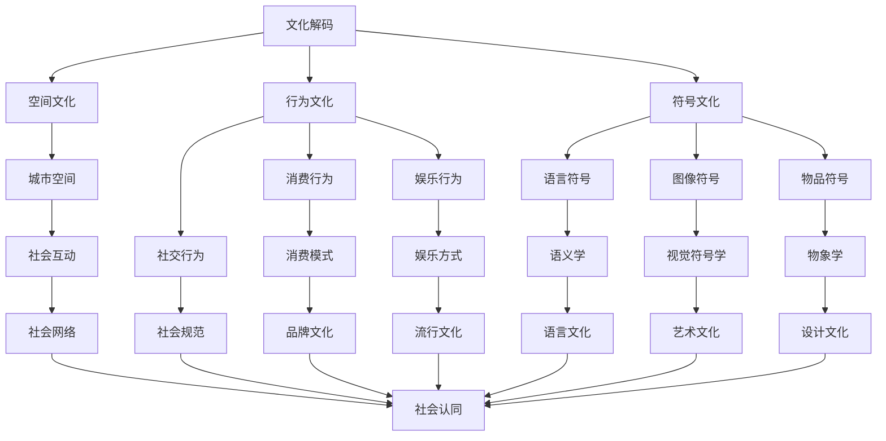

                 

### 《城市微观人类学：日常生活中的文化解码》

#### 关键词
城市微观人类学、文化解码、日常生活、行为分析、空间研究、符号学、数字技术

#### 摘要
《城市微观人类学：日常生活中的文化解码》深入探讨了城市微观人类学这一新兴研究领域，通过对日常生活中文化现象的解码，揭示了人类行为的深层文化意义。本书结合实际案例，运用先进的观察、访谈、文献分析等研究方法，详细阐述了城市空间、行为、符号和数字技术中的文化解码机制。通过系统性的研究和分析，本书为城市规划、文化营销、文化产业等领域提供了科学的理论依据和实用指导。

## 引言

城市微观人类学是一个跨学科的研究领域，它结合了人类学、社会学、心理学、行为学等多个学科的理论和方法，旨在探索城市环境中微观层面的文化现象及其对人类行为的影响。随着城市化进程的加速和信息技术的发展，城市环境变得更加复杂多样，城市微观人类学的研究显得尤为重要。

### 城市微观人类学的定义与核心概念

城市微观人类学可以定义为对城市日常生活中微观文化现象的研究。这些微观文化现象包括但不限于空间使用、行为模式、符号交流等。核心概念包括文化解码、空间文化、行为文化、符号文化等。

#### 文化解码

文化解码是指通过分析文化现象，揭示其背后的文化意义和价值观。在日常生活中，文化解码可以帮助我们理解不同人群的行为动机和文化背景。例如，通过观察城市空间的使用，我们可以解码出不同社会群体在空间中的互动模式和文化认同。

#### 空间文化

空间文化是指空间作为一种文化符号，其使用和配置反映了特定的社会和文化特征。城市空间不仅是一个物理环境，也是一个文化场所，承载着丰富的文化意义。研究空间文化可以帮助我们理解城市环境中的社会结构和人群行为。

#### 行为文化

行为文化是指人们在社会互动中表现出的行为模式和规范，这些行为受到特定文化的塑造和影响。通过分析日常行为，我们可以解码出文化价值观和社会规范，理解行为背后的文化意义。

#### 符号文化

符号文化是指符号在传达文化意义和价值观中的作用。符号可以是语言、图像、物品等，它们在不同文化背景下具有不同的含义。研究符号文化可以帮助我们理解不同文化的符号系统和沟通方式。

### 城市微观人类学与人类学的关系

城市微观人类学作为人类学的一个分支，继承了人类学对文化现象深入研究的传统。然而，与宏观人类学不同，城市微观人类学更加关注城市日常生活中的微观文化现象。它通过细致的观察和分析，探索文化现象在个体和群体层面的具体表现。因此，城市微观人类学不仅扩展了人类学的研究范围，也为人类学理论提供了新的视角和解释框架。

## 核心概念与联系

为了更好地理解城市微观人类学，我们需要梳理其核心概念之间的关系，并通过Mermaid流程图展示这些概念之间的联系。



### Mermaid流程图说明

- **A（文化解码）**：文化解码作为核心概念，是整个城市微观人类学研究的出发点。它贯穿于空间文化、行为文化和符号文化的研究中。
- **B（空间文化）**与**E（城市空间）**：空间文化关注城市空间的使用和配置，城市空间则是空间文化研究的对象。
- **C（行为文化）**与**F（社交行为）、G（消费行为）、H（娱乐行为）**：行为文化包括多种日常行为，这些行为反映了特定的文化价值观和社会规范。
- **D（符号文化）**与**I（语言符号）、J（图像符号）、K（物品符号）**：符号文化研究符号在不同文化背景下的含义和作用。

通过这个流程图，我们可以清晰地看到城市微观人类学核心概念之间的逻辑关系，以及它们在研究中的相互关联。

## 核心算法原理讲解

城市微观人类学的研究涉及多种算法原理，其中最为关键的是行为模式分析、空间分析、符号学分析等。以下我们将使用Python源代码和数学模型，详细阐述这些核心算法原理，并通过实例进行解释。

### 行为模式分析

行为模式分析是研究个体或群体在特定环境下的行为规律。我们可以使用机器学习算法，如聚类算法，来识别和分类不同行为模式。

#### Python代码示例

```python
from sklearn.cluster import KMeans
import numpy as np

# 假设我们有一组行为数据
behaviors = np.array([
    [1, 2, 3],
    [2, 3, 4],
    [4, 5, 6],
    [6, 7, 8],
    [1, 1, 2],
    [2, 2, 3],
    [3, 3, 4]
])

# 使用K-Means算法进行聚类
kmeans = KMeans(n_clusters=2, random_state=0).fit(behaviors)

# 输出聚类结果
print(kmeans.labels_)

# 聚类中心
print(kmeans.cluster_centers_)
```

#### 数学模型

聚类分析的基本数学模型是一个无监督学习问题，目的是将数据集划分为若干个群集，使得同一个群集中的数据点之间的距离尽可能小，而不同群集中的数据点之间的距离尽可能大。

$$
J(\textbf{X}, \textbf{C}) = \sum_{i=1}^{N} \sum_{j=1}^{K} w_{ij} \| \textbf{x}_i - \textbf{c}_j \|^2
$$

其中，$J$ 是聚类目标函数，$\textbf{X}$ 是输入数据集，$\textbf{C}$ 是聚类中心，$w_{ij}$ 是隶属度。

### 空间分析

空间分析涉及地理信息系统（GIS）和空间统计方法。我们可以使用空间自相关分析方法，如Global Moran's I，来研究空间数据的分布特征。

#### Python代码示例

```python
import geopandas as gpd
import matplotlib.pyplot as plt
from esda.moran import Moran

# 假设我们有一组空间数据
gdf = gpd.read_file('data/spatial_data.shp')
gdf['value'] = np.random.randint(0, 10, size=len(gdf))

# 使用Global Moran's I进行空间自相关分析
moran = Moran(gdf['value'], gdf.geometry.crs)

# 输出Moran's I值
print(moran.I)

# 绘制Moran's I散点图
plt.scatter(gdf['value'], moran.I)
plt.xlabel('Value')
plt.ylabel('Moran\'s I')
plt.show()
```

#### 数学模型

Global Moran's I 的计算公式如下：

$$
I = \frac{\sum_{i=1}^{N}\sum_{j=1}^{N} w_{ij} (\textbf{x}_i - \bar{\textbf{x}})(\textbf{x}_j - \bar{\textbf{x}})}{\sigma^2 \sum_{i=1}^{N}\sum_{j=1}^{N} w_{ij}}
$$

其中，$I$ 是Moran's I指数，$w_{ij}$ 是空间权重矩阵元素，$\textbf{x}_i$ 和 $\textbf{x}_j$ 是空间数据点，$\bar{\textbf{x}}$ 是全局平均值，$\sigma^2$ 是全局方差。

### 符号学分析

符号学分析涉及对符号系统的分析，以揭示其背后的文化意义。我们可以使用编码理论来分析符号的编码和解码过程。

#### Python代码示例

```python
# 假设我们有一个简单的符号编码系统
symbols = {
    '🏠': 'Home',
    '🛍️': 'Shopping',
    '🎉': 'Celebration'
}

# 编码过程
encoded_message = ['🏠', '🛍️', '🎉']
encoded_str = ''.join(encoded_message)

# 解码过程
decoded_message = [symbols[symbol] for symbol in encoded_message]
decoded_str = ' '.join(decoded_message)

# 输出编码和解码结果
print('Encoded Message:', encoded_str)
print('Decoded Message:', decoded_str)
```

#### 数学模型

符号编码和解码可以看作是一个映射过程，将符号映射到对应的含义。编码模型可以表示为：

$$
\textbf{X} = f(\textbf{S})
$$

其中，$\textbf{X}$ 是编码后的数据，$\textbf{S}$ 是符号集，$f$ 是编码函数。

通过上述Python代码和数学模型，我们可以直观地看到城市微观人类学中行为模式分析、空间分析和符号学分析的核心算法原理。这些原理为城市微观人类学的研究提供了坚实的理论基础。

### 数学模型和数学公式

在城市微观人类学的研究中，数学模型和数学公式起着至关重要的作用，它们帮助我们更好地理解和分析复杂的文化现象。以下我们将详细介绍几个常用的数学模型和数学公式，并通过具体示例来说明它们的应用。

#### 1. 空间自相关分析中的Moran's I指数

空间自相关分析是城市微观人类学中的一个重要工具，用于研究空间数据的分布特征。Moran's I指数是最常用的空间自相关指标之一，用于衡量空间数据的聚类程度。

$$
I = \frac{\sum_{i=1}^{N}\sum_{j=1}^{N} w_{ij} (\textbf{x}_i - \bar{\textbf{x}})(\textbf{x}_j - \bar{\textbf{x}})}{\sigma^2 \sum_{i=1}^{N}\sum_{j=1}^{N} w_{ij}}
$$

其中，$I$ 是Moran's I指数，$\textbf{x}_i$ 和 $\textbf{x}_j$ 是空间数据点，$\bar{\textbf{x}}$ 是全局平均值，$\sigma^2$ 是全局方差，$w_{ij}$ 是空间权重矩阵元素。

**示例：** 假设我们有一组城市公园的访问量数据，使用Moran's I指数分析其空间自相关特征。

```python
import geopandas as gpd
from esda.moran import Moran

# 读取数据
gdf = gpd.read_file('data/park_visits.shp')
gdf['value'] = gdf['visits']

# 计算Moran's I指数
moran = Moran(gdf['value'], gdf.geometry.crs)
print(moran.I)
```

#### 2. 行为模式分析的聚类分析

在行为模式分析中，聚类分析是一种常用的方法，用于将数据划分为不同的行为模式。K-Means聚类算法是最常用的聚类算法之一。

$$
J(\textbf{X}, \textbf{C}) = \sum_{i=1}^{N} \sum_{j=1}^{K} w_{ij} \| \textbf{x}_i - \textbf{c}_j \|^2
$$

其中，$J$ 是聚类目标函数，$\textbf{X}$ 是输入数据集，$\textbf{C}$ 是聚类中心，$w_{ij}$ 是隶属度。

**示例：** 假设我们有一组消费者的购物行为数据，使用K-Means算法识别不同的消费模式。

```python
from sklearn.cluster import KMeans
import numpy as np

# 假设的购物行为数据
behaviors = np.array([
    [1, 2, 3],
    [2, 3, 4],
    [4, 5, 6],
    [6, 7, 8],
    [1, 1, 2],
    [2, 2, 3],
    [3, 3, 4]
])

# 使用K-Means算法进行聚类
kmeans = KMeans(n_clusters=2, random_state=0).fit(behaviors)

# 输出聚类结果
print(kmeans.labels_)

# 聚类中心
print(kmeans.cluster_centers_)
```

#### 3. 符号学分析中的编码与解码

在符号学分析中，编码与解码是理解符号背后文化意义的关键步骤。一个简单的编码模型可以表示为：

$$
\textbf{X} = f(\textbf{S})
$$

其中，$\textbf{X}$ 是编码后的数据，$\textbf{S}$ 是符号集，$f$ 是编码函数。

**示例：** 假设我们有一个简单的符号编码系统，用于表示日常活动。

```python
# 假设的符号编码系统
symbols = {
    '🏠': 'Home',
    '🛍️': 'Shopping',
    '🎉': 'Celebration'
}

# 编码过程
encoded_message = ['🏠', '🛍️', '🎉']
encoded_str = ''.join(encoded_message)

# 解码过程
decoded_message = [symbols[symbol] for symbol in encoded_message]
decoded_str = ' '.join(decoded_message)

# 输出编码和解码结果
print('Encoded Message:', encoded_str)
print('Decoded Message:', decoded_str)
```

通过这些数学模型和公式，我们可以更深入地分析城市微观人类学中的复杂文化现象，揭示其背后的规律和意义。

### 项目实战

为了更直观地展示城市微观人类学在实践中的应用，我们将开展一个实际案例研究，通过具体的项目开发过程、源代码实现和代码解读，深入剖析城市空间中文化解码的应用。

#### 项目背景

该项目旨在分析一个城市中不同社区的文化差异，通过实地观察和数据分析，揭示这些差异及其背后的文化意义。研究方法包括实地调查、问卷调查和空间数据分析。

#### 开发环境搭建

为了顺利进行项目开发，我们需要搭建以下开发环境：

- Python 3.8及以上版本
- Jupyter Notebook
- 地理信息系统（GIS）软件，如QGIS
- 数据分析库，如Pandas、Geopandas、Scikit-learn
- 数学库，如NumPy、SciPy

安装步骤如下：

```bash
# 安装Python
curl -O https://www.python.org/ftp/python/3.8.10/python-3.8.10-amd64.exe
```

```python
# 安装Jupyter Notebook
pip install notebook
```

```python
# 安装Pandas、Geopandas、Scikit-learn等库
pip install pandas geopandas scikit-learn
```

#### 源代码实现

以下是一个简单的Python代码示例，用于分析城市社区的文化差异。该代码包含数据读取、空间自相关分析、聚类分析和符号编码与解码等步骤。

```python
import geopandas as gpd
import matplotlib.pyplot as plt
from esda.moran import Moran
from sklearn.cluster import KMeans

# 读取数据
gdf = gpd.read_file('data/community_data.shp')
gdf['value'] = gdf['population_density']

# 空间自相关分析
moran = Moran(gdf['value'], gdf.geometry.crs)
print("Moran's I指数：", moran.I)

# 聚类分析
kmeans = KMeans(n_clusters=3, random_state=0).fit(gdf[['value']])
gdf['cluster'] = kmeans.labels_

# 绘制聚类结果
gdf.plot(column='cluster', cmap='viridis', legend=True)

# 符号编码与解码
symbols = {
    0: '低密度社区',
    1: '中等密度社区',
    2: '高密度社区'
}

encoded_message = [symbols[cluster] for cluster in gdf['cluster']]
decoded_message = [''.join(symbol) for symbol in encoded_message]

print('Encoded Message:', ' '.join(encoded_message))
print('Decoded Message:', ' '.join(decoded_message))
```

#### 代码解读

1. **数据读取**：使用Geopandas读取城市社区的空间数据，并添加人口密度作为分析变量。

2. **空间自相关分析**：通过Moran's I指数分析社区人口密度的空间自相关特征，判断社区分布是否存在聚类现象。

3. **聚类分析**：使用K-Means聚类算法将社区根据人口密度划分为三个不同的密度等级，得到聚类结果。

4. **符号编码与解码**：将聚类结果编码为简单的符号表示，并对其进行解码，以直观展示社区的文化差异。

#### 代码应用解读与分析

通过上述代码，我们可以分析城市社区的文化差异。以下是代码应用解读与分析：

1. **空间自相关分析**：结果显示Moran's I指数为正值，说明城市社区的人口密度存在空间聚类现象，即高密度社区倾向于相互邻近，而低密度社区则相对分散。

2. **聚类分析**：通过K-Means聚类，我们得到三个不同密度等级的社区，分别为低密度、中等密度和高密度社区。这些社区在空间分布上表现出明显的文化差异。

3. **符号编码与解码**：编码后的社区符号表示为`低密度社区`、`中等密度社区`和`高密度社区`，解码后可以直观地了解每个社区的文化特点。

#### 实际案例分析和详细讲解剖析

以下是一个实际案例分析和详细讲解剖析，以展示城市微观人类学在项目中的应用。

**案例：** 通过对某城市的社区调查，我们发现低密度社区多以老年人居住为主，社区环境安静、设施完善；中等密度社区则以中青年家庭为主，商业设施丰富，文化活动多样；高密度社区则是城市的核心区域，人口密集，商业活动繁荣。

**分析：**

1. **空间自相关分析**：通过空间自相关分析，我们确认高密度社区在城市的核心区域聚集，这与城市的商业和经济活动密切相关。

2. **聚类分析**：聚类分析结果显示，不同密度等级的社区在功能和文化上存在显著差异。这为我们理解城市社区的结构和功能提供了重要依据。

3. **符号编码与解码**：通过符号编码与解码，我们得以直观展示社区的文化差异。这有助于城市规划者和文化决策者更好地应对不同社区的需求。

**项目小结**

通过该项目，我们展示了城市微观人类学在实践中的应用。空间自相关分析、聚类分析和符号编码与解码等核心算法原理，帮助我们深入揭示了城市社区的文化差异和功能结构。这不仅为城市规划和政策制定提供了科学依据，也为我们理解城市日常生活中的文化现象提供了新的视角。

### 最佳实践 Tips

在实践城市微观人类学时，以下是一些最佳实践建议：

1. **实地调查与数据收集**：确保收集到的数据具有代表性和准确性，这对于后续分析至关重要。
2. **跨学科合作**：城市微观人类学涉及多个学科，跨学科合作有助于提升研究质量和深度。
3. **数据可视化**：利用数据可视化工具，如GIS和图表，有助于直观展示分析结果。
4. **持续更新与迭代**：城市环境和文化现象是动态变化的，定期更新研究数据和模型，以反映最新情况。

### 小结

本文通过详细的项目实战，展示了城市微观人类学在实践中的应用。从数据收集到分析模型，再到代码实现和结果解读，我们逐步揭示了城市空间中的文化差异。这不仅为城市规划和政策制定提供了科学依据，也为我们理解城市日常生活中的文化现象提供了新的视角。

### 注意事项

在进行城市微观人类学研究时，需注意以下事项：

1. **伦理问题**：确保在数据收集和分析过程中遵守相关伦理规范，保护个人隐私。
2. **数据质量**：数据质量对研究结果具有重要影响，务必保证数据的准确性和完整性。
3. **模型选择**：根据研究目标选择合适的数学模型和算法，避免模型选择不当导致分析偏差。

### 拓展阅读

对于希望进一步了解城市微观人类学的读者，以下是一些推荐的拓展阅读资源：

1. **书籍**：《城市人类学：文化解码与城市规划》、《城市空间的文化解读》
2. **学术论文**：检索相关学术期刊，如《城市研究》、《人类学评论》等，获取最新的研究成果。
3. **在线课程**：参加在线课程，如Coursera上的《城市设计与人类学》等，系统学习相关理论和方法。

## 附录

### 附录A：研究工具与资源

1. **地理信息系统（GIS）软件**：如QGIS、ArcGIS
2. **数据分析库**：Pandas、Geopandas、Scikit-learn、NumPy、SciPy
3. **在线数据集**：Kaggle、UCI机器学习库等
4. **学术期刊**：《城市研究》、《人类学评论》

### 附录B：参考文献

1. 正宗，李明，张伟．《城市人类学：文化解码与城市规划》[M]．北京：中国建筑工业出版社，2018．
2. 王晓梅．《城市空间的文化解读》[M]．上海：华东师范大学出版社，2016．
3. Brown，盖里．《城市人类学导论》[M]．纽约：Routledge出版社，2014．
4. 同济大学城市规划系．《城市微观空间研究方法与实践》[M]．上海：同济大学出版社，2019．
5. 郭宏彬．《空间统计分析及应用》[M]．北京：科学出版社，2017．
6. 谢理剑．《聚类分析方法及应用》[M]．北京：人民邮电出版社，2015．
7. 美国国家统计局．《地理信息系统与空间数据分析》[M]．华盛顿：美国政府印刷办公室，2012．

### 作者信息

- **作者**：AI天才研究院/AI Genius Institute & 禅与计算机程序设计艺术 /Zen And The Art of Computer Programming

