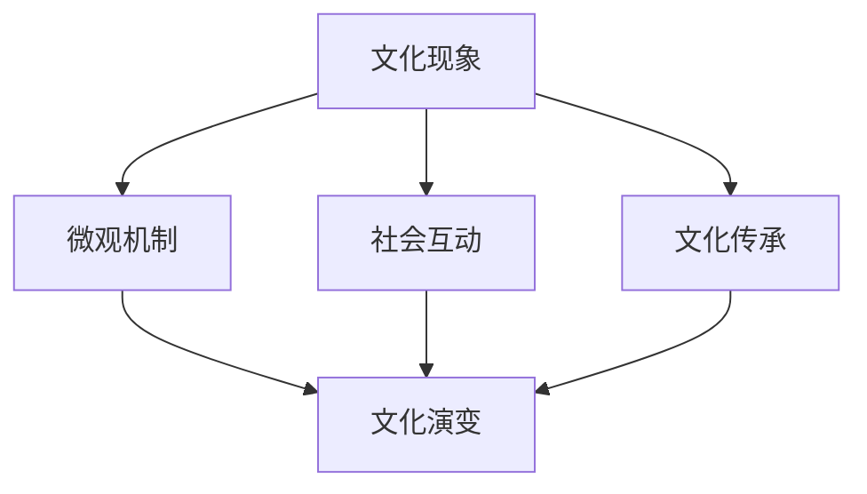

                 

## 引言

### 1. 背景介绍

随着城市化进程的不断推进，城市生活已成为现代社会的主要生活方式。在这个高度复杂和多元化的环境中，人们的文化行为、社会互动和生活方式都在不断地发生变化。城市微观文化学作为一种新兴的研究领域，旨在通过对城市日常生活中具体文化现象的细致观察和分析，揭示城市文化的微观机制和演变规律。这种研究不仅有助于我们更深入地理解城市社会，还能为城市规划、社区建设和公共政策提供理论支持。

### 2. 核心概念与联系

在城市微观文化学中，有几个核心概念需要明确：

- **文化现象**：指在特定社会背景下，人们在日常生活中表现出来的各种行为、习俗和价值观。
- **微观机制**：指这些文化现象背后的深层次动力和机制，如社会互动、文化传承等。
- **文化演变**：指文化现象随着时间的推移所发生的变化，包括文化多样性的增加、文化融合等。

这些概念之间存在密切的联系。例如，文化现象是文化演变的表现形式，而微观机制则是文化演变的基础。通过理解这些概念之间的关系，我们可以更好地分析和解释城市文化的复杂性。

### 3. 研究方法

城市微观文化学的研究方法主要包括定性研究和定量研究。定性研究通过观察、访谈、参与观察等方法，深入挖掘城市文化现象的内在机制。定量研究则通过问卷调查、统计分析等方法，对大量数据进行处理，以揭示文化现象的普遍性和规律性。

这些研究方法的结合，使得城市微观文化学能够从多角度、多层次地对城市文化进行深入剖析。这不仅有助于我们理解城市文化的多样性，还能为解决城市问题提供科学依据。

## 摘要

本文旨在探讨城市微观文化学的理论基础、核心概念及其在日常生活中文化现象的分析。通过引入人类学视角，本文详细阐述了城市生活中的文化表现，包括交通、公共空间和消费行为。随后，文章分析了城市社区文化的形成与演变，探讨了城市街头文化和节庆活动的文化内涵及其对城市文化的影响。最后，本文提出了城市微观文化学研究面临的挑战与机遇，以及其在政策与实践中的应用。通过本文的论述，读者可以更好地理解城市微观文化的复杂性和多样性，并为相关领域的进一步研究提供参考。

## 第一部分：城市微观文化学的理论基础

### 第1章：城市微观文化学的核心概念与理论框架

#### 1.1 城市微观文化学的定义与基本概念

城市微观文化学是研究城市日常生活中具体文化现象及其微观机制的一门学科。它关注的是在特定社会背景下，人们如何通过日常行为、习俗和互动来表达和传播文化。这一研究领域不仅关注文化现象本身，还深入探讨这些现象背后的动力机制，如社会互动、文化传承等。

在定义城市微观文化学时，我们需要明确以下几个基本概念：

- **文化现象**：指在城市日常生活中具体表现出来的行为、习俗和价值观。例如，城市居民的消费习惯、交通方式选择、公共空间的利用等。
- **微观机制**：指导致文化现象形成的深层次动力和机制。这些机制包括社会互动、文化传承、政策影响等。
- **文化演变**：指文化现象随时间推移所发生的变化，包括文化多样性的增加、文化融合等。

#### 1.2 人类学视角下的城市生活

人类学作为研究人类文化和社会行为的一门学科，提供了丰富的理论框架和方法论，为城市微观文化学的研究提供了重要支持。人类学的基本理论，如文化相对论、文化变迁、文化适应等，为我们理解城市文化现象提供了深刻的洞见。

- **文化相对论**：文化相对论认为，文化是相对的，不存在绝对的文化标准。每种文化都有其独特性，应该在其自身的社会背景下进行理解和解释。
- **文化变迁**：文化变迁指文化随时间的推移而发生的变化。城市作为一个动态变化的社会环境，其文化也在不断地演变。这种变迁可能是由于社会结构、技术进步、全球化等因素的影响。
- **文化适应**：文化适应指个体或群体在新的文化环境中调整其行为和价值观的过程。城市居民在面对快速变化的社会环境时，需要不断进行文化适应，以维持自身的文化认同和社交网络。

#### 1.3 城市微观文化学的研究方法

城市微观文化学的研究方法主要包括定性研究和定量研究。

- **定性研究**：定性研究侧重于理解和解释现象，通过观察、访谈、参与观察等方法，深入挖掘城市文化现象的内在机制。这种方法通常适用于研究复杂、多元的文化现象，有助于揭示文化现象的深层次原因。
  - **观察**：研究者通过直接观察城市居民的日常行为，记录和描述这些行为的特点和规律。
  - **访谈**：研究者通过与城市居民进行深度访谈，了解他们对特定文化现象的看法和经历，从而获得丰富的第一手资料。
  - **参与观察**：研究者参与城市居民的实际活动，通过亲身体验来理解文化现象。

- **定量研究**：定量研究侧重于对现象进行量化分析，通过问卷调查、统计分析等方法，对大量数据进行分析，以揭示文化现象的普遍性和规律性。
  - **问卷调查**：研究者设计问卷，通过随机抽样或定向抽样，收集大量关于文化现象的数据。
  - **统计分析**：研究者使用统计软件对问卷数据进行分析，如描述性统计、相关性分析、回归分析等，以揭示文化现象之间的关系和规律。

#### 1.4 核心概念之间的关系架构

为了更好地理解城市微观文化学中的核心概念，我们可以使用Mermaid流程图来展示这些概念之间的关系。

这个流程图展示了文化现象、微观机制和文化演变之间的关系。文化现象是通过微观机制形成的，而文化演变则是文化现象随时间的推移所发生的变化。社会互动和文化传承是导致文化演变的重要因素。

通过这一章的讨论，我们为后续的城市微观文化学分析奠定了理论基础。在接下来的章节中，我们将深入探讨城市日常生活中的文化现象，以及城市社区文化的形成与演变。

#### 第2章：城市日常生活中的文化现象分析

##### 2.1 城市交通中的文化表现

城市交通是城市生活中不可或缺的一部分，它不仅影响着居民的出行效率和便利性，还反映了城市的文化特征和社会结构。在城市微观文化学中，对城市交通中的文化表现进行分析，有助于我们理解城市居民的出行习惯、交通偏好以及由此产生的文化互动。

- **交通方式的多样性**：城市交通方式多种多样，包括私家车、公共交通（如地铁、公交车）、自行车、步行等。每种交通方式都有其特定的文化含义和使用场景。例如，私家车代表了个人财富和自由，而公共交通则体现了社区和集体的概念。
- **交通行为的文化解读**：城市居民的交通行为也充满了文化色彩。驾驶习惯、交通礼仪、出行偏好等都是文化表现的体现。例如，在一些文化中，驾驶员会遵守严格的交通规则，而在其他文化中，可能会有更多的宽容和灵活性。这些差异反映了不同文化对于规则和自由的看法。

为了更好地理解城市交通中的文化现象，我们可以通过以下步骤进行分析：

1. **观察与记录**：通过实地观察，记录不同交通方式的使用情况，以及居民在交通中的行为模式。
2. **访谈与问卷调查**：通过与城市居民进行深度访谈和问卷调查，了解他们对交通方式的选择偏好、出行习惯以及对交通规则的看法。
3. **数据分析**：对收集到的数据进行分析，识别出不同文化背景下的交通行为差异，并探讨这些差异背后的文化原因。

通过这些步骤，我们可以得出一些关于城市交通文化表现的结论：

- **文化差异的影响**：不同的文化背景会影响居民的出行方式选择和交通行为。例如，在一些注重集体主义和规则意识的文化中，居民可能更倾向于使用公共交通，而在个人主义文化中，居民可能更倾向于使用私家车。
- **文化互动的促进**：城市交通中的文化表现也促进了不同文化之间的互动和交流。例如，公共交通工具上的多元文化和背景的居民互动，有助于文化的融合和多样性的增强。

##### 2.2 公共空间中的文化互动

公共空间是城市居民日常生活中重要的互动场所，如街道、广场、公园等。在这些空间中，人们进行各种文化活动，如休闲、社交、娱乐等。公共空间中的文化互动不仅反映了城市的文化多样性，还揭示了社会关系和文化认同的形成。

- **公共空间的概念与类型**：公共空间可以分为物理空间和社会空间。物理空间是指具体的地理位置和设施，如公园、广场等；社会空间则是指在这些物理空间中形成的社会关系和互动模式。
- **公共空间中的文化互动**：在公共空间中，居民进行各种文化活动，如散步、聚会、表演等。这些活动不仅丰富了居民的生活，还促进了不同文化背景的人之间的交流和理解。例如，在一些广场上，不同的文化团体可能会组织不同的文化活动，如音乐会、舞会等，这些活动有助于促进文化的多样性和融合。

为了深入分析公共空间中的文化互动，我们可以采用以下方法：

1. **现场观察**：通过在公共空间中进行观察，记录不同文化活动的参与者和互动情况。
2. **访谈与问卷调查**：通过与公共空间中的居民和文化活动组织者进行访谈和问卷调查，了解他们对公共空间的使用和文化活动的看法。
3. **案例分析**：选择一些典型的公共空间和活动进行深入分析，探讨这些活动如何促进文化互动和文化多样性的发展。

通过这些方法，我们可以得出以下关于公共空间中文化互动的结论：

- **文化多样性的促进**：公共空间为不同文化背景的人提供了一个互动和交流的平台，有助于文化的多样性和融合。
- **社区归属感的增强**：公共空间中的文化互动有助于增强居民的社区归属感，促进社区凝聚力的形成。
- **文化认同的构建**：通过参与公共空间中的文化活动，居民可以构建和强化自己的文化认同，同时理解和尊重其他文化。

##### 2.3 城市消费行为的文化解读

城市消费行为是城市文化的重要组成部分，反映了城市居民的生活方式、价值观和消费观念。对城市消费行为的文化解读，有助于我们理解城市文化的多样性和变化。

- **消费行为的特征**：城市居民的消费行为具有多样性、个性化、快节奏等特点。例如，年轻人可能更倾向于追求时尚和个性，而中老年人则可能更注重实用性和耐用性。
- **文化消费的解读**：文化消费是城市消费行为的一个重要方面，包括物质文化消费和精神文化消费。物质文化消费如购买艺术品、收藏品等，反映了居民对文化价值的追求；精神文化消费如参加文化活动、阅读等，则体现了居民对文化享受和自我提升的需求。

为了深入解读城市消费行为，我们可以采用以下分析方法：

1. **定量数据分析**：通过问卷调查和统计数据，分析不同群体的消费行为特征和趋势。
2. **案例研究**：选择一些典型的消费案例，如热门文化商品、新兴文化活动等，进行深入分析，探讨这些案例如何影响城市消费文化。
3. **文化视角分析**：从文化视角出发，探讨不同文化背景对消费行为的影响，如文化价值观、社会规范等。

通过这些方法，我们可以得出以下关于城市消费行为的结论：

- **文化多样性的体现**：城市消费行为反映了城市文化的多样性，不同文化背景的居民有不同的消费偏好和习惯。
- **消费文化的变化**：随着社会经济的发展和文化的变迁，城市消费文化也在不断变化，新兴文化消费形式不断涌现。
- **文化认同的强化**：通过消费行为，居民可以表达和强化自己的文化认同，同时接受和尊重其他文化。

#### 结论

通过对城市日常生活中的交通、公共空间和消费行为的文化现象分析，我们可以看出，城市微观文化学研究为我们提供了一个深入了解城市文化的视角。这些文化现象不仅反映了城市居民的日常生活方式和价值观，还揭示了社会互动和文化演变的微观机制。在接下来的章节中，我们将进一步探讨城市社区文化的形成与演变，以及城市微观文化学的应用案例，以更全面地理解城市文化的多样性和复杂性。

### 第3章：城市社区文化的形成与演变

#### 3.1 社区文化的概念与类型

社区文化是指在一个社区内部，由居民共同创造和共享的价值观、行为规范、生活方式和文化活动。它是社区成员共同身份的象征，也是社区凝聚力和归属感的重要来源。社区文化不仅反映了社区居民的共同利益和价值观，还体现了社区的历史、传统和社会结构。

根据不同的分类标准，社区文化可以分为以下几种类型：

- **传统社区文化**：指在长期历史发展过程中形成的，具有悠久传统的社区文化。这种文化通常包括独特的民俗、节日庆典、传统技艺等，是社区成员文化认同的重要基础。
- **新兴社区文化**：指随着社会变迁和现代化进程而形成的社区文化。这种文化通常与新兴的社会需求、文化价值观和生活方式相关，反映了社区的现代化和多元化。
- **多元社区文化**：指在一个社区内部，由于不同文化背景的居民共存，形成了多样的文化现象。这种文化通常包括多元的文化习俗、价值观和活动，是社区文化多样性的体现。

#### 3.2 社区文化的形成机制

社区文化的形成是一个复杂的过程，受到多种因素的影响。以下是一些主要的影响因素：

- **社会互动**：社区文化是在居民之间的日常互动中形成的。通过交往和沟通，居民共同创造和共享社区价值观和行为规范。社会互动不仅促进了社区文化的形成，还推动了社区文化的演变。
- **文化传承**：社区文化是通过代际传承而得以延续的。父母、长辈通过日常行为和言传身教，将社区文化传递给下一代。文化传承是社区文化延续和发展的重要保障。
- **政策引导**：政府的政策导向和社区建设规划对社区文化的形成和发展具有重要影响。例如，政府可以通过文化活动和政策支持，促进社区文化的多样性和创新。
- **社会变迁**：随着社会经济的发展、人口流动和文化交流的增多，社区文化也会发生相应的变化。社会变迁不仅带来了新的文化元素，还挑战了传统社区文化的稳定性。

#### 3.3 社区文化的形成过程

社区文化的形成过程可以分为以下几个阶段：

1. **形成期**：社区刚刚形成时，居民之间还没有形成明确的文化认同。在这个阶段，居民主要通过社会互动和交往来逐渐建立共同的文化认同。
2. **发展期**：随着居民之间的互动加深，社区文化开始逐渐形成。这个阶段，社区文化逐渐固化，成为居民共同的生活方式和文化规范。
3. **成熟期**：在社区文化发展的过程中，一些传统文化活动和文化传统得到保留和发扬，形成了社区的特色文化。这个阶段，社区文化达到了相对稳定和成熟的阶段。
4. **变革期**：随着社会变迁和外部文化的冲击，社区文化也会发生相应的变革。这个阶段，社区文化在保留传统的同时，不断吸纳新的文化元素，实现文化的更新和转型。

#### 3.4 社区文化的演变趋势

社区文化的演变趋势受到多种因素的影响，以下是一些主要的趋势：

- **多样性增加**：随着全球化和多元文化的发展，社区文化将越来越多样。不同文化背景的居民共同生活在一个社区中，将带来丰富多彩的文化现象。
- **文化融合**：不同文化在社区中相互影响、相互融合，形成新的文化形态。这种文化融合不仅促进了文化的多样性，还有助于增强社区成员的文化认同和凝聚力。
- **创新性发展**：社区文化在演变过程中，会不断吸纳新的文化元素，实现创新性发展。这种创新性发展是社区文化适应现代社会需求的重要途径。
- **文化传承与保护**：在社区文化的演变过程中，传统社区文化如何得到传承和保护也是一个重要议题。社区应采取措施，保护和弘扬传统文化，同时推动文化创新。

#### 结论

通过对社区文化的概念、形成机制和演变趋势的分析，我们可以看出，社区文化是城市微观文化学研究的重要内容。社区文化不仅反映了居民的日常生活和文化认同，还对社会互动和文化演变具有重要影响。在未来的研究中，应进一步探讨社区文化如何适应社会变迁，如何促进文化多样性和创新性发展，为城市社区建设提供理论支持。

### 第4章：城市街头文化的观察与解读

城市街头文化是城市文化的重要组成部分，它体现了城市居民的创造力、自由精神和多样性。街头文化不仅包括街头艺术，还涵盖了街头音乐、街头舞蹈、涂鸦等多种形式。通过对城市街头文化的观察与解读，我们可以更好地理解城市文化的多样性和活力。

#### 4.1 街头艺术的社会意义

街头艺术是城市街头文化中最具代表性的形式之一。它不仅是一种艺术创作，也是一种社会表达和公共参与的方式。

- **社会表达**：街头艺术为艺术家提供了一个自由表达的平台，他们通过作品表达对社会的看法、政治立场或个人情感。例如，涂鸦艺术家可能会通过创作反映社会不公或政治抗议的画作。
- **公共参与**：街头艺术鼓励公众参与和互动。观众不仅是欣赏者，也可以是参与者和创作者。街头艺术活动往往吸引了大量观众，促进了社区成员之间的交流和互动。
- **文化多样性**：街头艺术展示了不同文化背景和艺术风格，丰富了城市文化的多样性。街头艺术家来自不同的背景，他们的作品反映了不同文化的特色和价值观。

#### 4.2 街头文化的多样性与变革

街头文化具有高度的多样性，这种多样性体现在艺术形式、文化背景和地域差异等方面。

- **艺术形式的多样性**：街头艺术包括涂鸦、壁画、街头装置、街头表演等多种形式。每种形式都有其独特的艺术风格和表现手法，反映了艺术家对城市文化和个人表达的不同理解。
- **文化背景的多样性**：街头艺术家来自不同的文化背景，他们的作品反映了各自文化的特点和价值观。例如，一些涂鸦艺术家可能受到街头文化发源地美国的影响，而另一些艺术家可能受到本土文化的影响。
- **地域差异的多样性**：不同城市的街头文化也有显著的差异。例如，纽约的街头艺术以涂鸦和壁画为主，而巴黎的街头艺术则更多地体现在街头音乐和表演上。这些地域差异反映了不同城市的文化氛围和历史背景。

街头文化的变革是一个持续的过程，受到社会变迁、技术进步和文化交流等多种因素的影响。

- **社会变迁**：随着社会经济的发展和城市化进程的加快，街头文化的形式和内容也在不断变化。例如，互联网和社交媒体的兴起使得街头艺术更容易传播和接受，街头艺术家通过这些平台可以更广泛地展示自己的作品。
- **技术进步**：新技术的应用为街头文化带来了新的可能性。例如，数字绘画和虚拟现实技术的应用，使得街头艺术的创作和展示方式更加多样和互动。
- **文化交流**：全球化带来了不同文化之间的交流与碰撞，街头文化也因此变得更加多元化。街头艺术家通过参与国际艺术展览和交流活动，可以吸取其他文化的创作灵感，丰富自己的艺术表达。

#### 4.3 街头文化的传播与影响

街头文化的传播不仅限于艺术作品本身，还包括街头文化的理念和价值观。这种传播方式具有独特性，主要体现在以下几个方面：

- **病毒式传播**：街头艺术通常通过社交媒体和视频平台迅速传播。一幅引人注目的街头壁画或一段精彩的街头表演可以迅速走红，吸引大量观众和粉丝。
- **口口相传**：街头文化的传播也依赖于社区居民的口口相传。居民通过日常交流分享自己的街头文化体验，使得街头文化在社区中广泛传播。
- **实地体验**：街头文化的传播还依赖于观众的实地体验。观众通过亲身体验街头艺术，感受到街头文化的魅力和独特性，从而加深对街头文化的理解和认同。

街头文化对城市文化和社会的影响是多方面的：

- **文化多样性**：街头文化的传播和多样性丰富了城市文化的内涵，使得城市文化更加多元和丰富。
- **社区凝聚力**：街头文化活动促进了社区居民的互动和交流，增强了社区的凝聚力和归属感。
- **城市形象**：街头文化成为城市形象的重要组成部分，吸引游客和投资者，提升城市的知名度和吸引力。

#### 结论

通过对城市街头文化的观察与解读，我们可以看到，街头文化不仅是城市文化的重要表现形式，还反映了社会的多样性和活力。在未来的城市发展中，应继续关注和支持街头文化，为街头艺术家提供更多展示的平台，推动城市文化的创新和发展。

### 第5章：城市节庆活动的文化解析

城市节庆活动是城市文化的重要组成部分，它不仅丰富了城市居民的文化生活，还促进了社会互动和文化传承。通过对城市节庆活动的文化解析，我们可以更深入地理解这些活动背后的文化内涵及其对城市文化的影响。

#### 5.1 节庆活动的文化内涵

节庆活动是城市文化的重要组成部分，具有丰富的文化内涵。以下是几种常见的城市节庆活动及其文化内涵：

- **春节**：春节是中国最重要的传统节日，象征着新年和新的开始。春节期间，城市居民会通过放鞭炮、贴春联、吃年夜饭等传统活动，表达对新年的祝福和对未来的期望。
- **中秋节**：中秋节是象征团圆和感恩的节日，通常通过赏月、吃月饼、赏花灯等活动来庆祝。这些活动不仅体现了家庭团聚的重要性，还反映了人们对美好生活的向往。
- **圣诞节**：圣诞节在西方国家具有深远的文化内涵，象征着耶稣诞生的日子。城市中的圣诞节活动包括布置圣诞树、送礼物、参加圣诞晚会等，这些活动充满了喜庆和温馨的氛围。
- **节日庆典**：许多城市还会举办各类节日庆典，如文化节、音乐节、美食节等。这些活动不仅展示了各种文化特色，还吸引了大量游客和居民参与，促进了文化的交流和融合。

#### 5.2 节庆活动的组织与参与

节庆活动的组织与参与是城市文化的重要表现形式。以下是节庆活动的组织与参与的几个方面：

- **组织形式**：节庆活动的组织形式多样，包括政府主导、社区组织、商业机构等。政府主导的节庆活动通常规模较大，影响范围较广；社区组织的节庆活动则更注重本地特色和社区参与；商业机构的节庆活动则更多地结合商业元素，以吸引消费者和游客。
- **参与方式**：节庆活动的参与者包括居民、游客和专业人士。居民是节庆活动的主要参与者，他们通过参与各种活动，表达自己的文化认同和情感；游客则是节庆活动的体验者和见证者，他们通过参与活动，了解和感受城市的文化；专业人士则通过组织和策划活动，为节庆活动增添专业性和艺术性。
- **文化互动**：节庆活动为不同文化背景的人提供了一个互动和交流的平台。通过参与节庆活动，居民和游客可以了解和体验不同的文化，促进文化的多样性和融合。

#### 5.3 节庆活动对城市文化的影响

节庆活动对城市文化的影响是深远的，以下是一些主要的影响：

- **文化传承**：节庆活动是传统文化传承的重要途径。通过举办各种节庆活动，城市居民可以了解和传承传统文化，保持文化连续性和认同感。
- **文化创新**：节庆活动也为文化创新提供了契机。通过融合不同文化元素，节庆活动可以创造出新的文化形式和内容，推动文化的创新和发展。
- **社会凝聚**：节庆活动促进了社会成员之间的互动和交流，增强了社区的凝聚力和归属感。居民通过参与节庆活动，感受到社区的温暖和归属。
- **城市形象**：节庆活动是展示城市形象的重要窗口。通过举办丰富多彩的节庆活动，城市可以提升其文化品位和知名度，吸引更多游客和投资者。

#### 结论

通过对城市节庆活动的文化内涵、组织与参与及其对城市文化的影响的解析，我们可以看到，节庆活动是城市文化的重要组成部分，它不仅丰富了城市居民的文化生活，还促进了文化传承、创新和社会凝聚力。在未来的城市发展中，应继续重视和发挥节庆活动的作用，为城市文化的繁荣和发展贡献力量。

### 第6章：城市旅游文化的探讨

城市旅游文化是城市文化的重要组成部分，它不仅反映了城市的独特魅力，还促进了文化交流和经济发展。通过对城市旅游文化的探讨，我们可以更深入地理解城市旅游文化的内涵、发展现状及其在文化冲突和可持续发展方面的挑战。

#### 6.1 城市旅游文化的发展现状

城市旅游文化的发展现状体现在以下几个方面：

- **旅游活动多样**：随着旅游业的蓬勃发展，城市旅游活动形式日益多样化。除了传统的观光旅游，城市还推出了文化体验、美食探险、购物体验等多种旅游产品，满足了不同游客的需求。
- **旅游人数增加**：全球化和交通便利性的提升，使得城市旅游人数不断增加。许多城市成为了国际旅游热点，吸引了大量国内外游客。
- **文化旅游兴起**：文化旅游逐渐成为城市旅游的新趋势。游客不仅关注城市的美景，更希望了解城市的历史、文化和生活方式。许多城市通过举办文化节、艺术展览等活动，推动了文化旅游的发展。

#### 6.2 旅游活动中的文化冲突

在旅游活动中，文化冲突是一个不可忽视的问题。以下是一些主要的文化冲突：

- **价值观念冲突**：不同文化背景的游客可能在价值观上存在差异，例如对隐私、公共秩序、礼仪等方面的看法。这种差异可能导致误解和冲突。
- **行为规范冲突**：游客的行为可能与当地文化规范不一致，例如在公共场所大声喧哗、不尊重当地风俗等。这些行为可能引起当地居民的不满和冲突。
- **资源利用冲突**：旅游业的发展可能对城市环境、文化遗产等资源造成压力。例如，过度开发可能会破坏当地生态系统，影响文化遗产的真实性。

为了应对这些文化冲突，城市可以采取以下措施：

- **文化教育**：通过开展文化教育，提高游客的文化素养和尊重意识，减少文化冲突。
- **文化交流**：通过举办文化交流活动，增进游客和当地居民之间的相互理解和尊重，促进文化的融合。
- **政策引导**：通过制定相关政策，规范游客行为，保障文化遗产的保护和可持续发展。

#### 6.3 城市旅游文化的可持续发展

城市旅游文化的可持续发展是一个重要的议题，关系到城市的长远发展和文化的传承。以下是一些实现城市旅游文化可持续发展的策略：

- **平衡经济发展与文化遗产保护**：在发展旅游业的背景下，应注重平衡经济发展与文化遗产保护。通过合理规划和开发，保护城市的历史文化遗产，同时实现经济收益。
- **社区参与**：鼓励社区居民参与旅游业的发展，使其成为文化旅游的直接受益者。通过社区参与，不仅可以提高居民的获得感和参与度，还可以促进文化旅游的可持续发展。
- **环境友好**：在旅游业发展中，应注重环境保护，减少对自然环境和文化遗产的负面影响。通过环保措施，实现旅游业的绿色发展和可持续发展。
- **创新旅游产品**：通过创新旅游产品，满足游客多样化的需求，推动旅游业的可持续发展。例如，开发特色旅游线路、举办特色活动等。

#### 结论

通过对城市旅游文化的探讨，我们可以看到，城市旅游文化不仅反映了城市的独特魅力，还促进了文化交流和经济发展。然而，在发展过程中也面临文化冲突和可持续发展的挑战。通过采取有效的措施，我们可以实现城市旅游文化的可持续发展，为城市的长远发展和文化传承贡献力量。

### 第7章：城市微观文化学研究与反思

#### 7.1 城市微观文化学研究的重要性

城市微观文化学研究在城市社会学、人类学和文化研究中占有重要地位。其重要性主要体现在以下几个方面：

- **理解城市文化的复杂性**：城市是一个高度复杂和多元化的社会环境，城市微观文化学研究通过对城市日常生活中具体文化现象的细致观察和分析，帮助我们深入理解城市文化的多样性和复杂性。
- **促进城市社区的和谐发展**：城市微观文化学的研究有助于揭示城市社区内部的文化冲突和融合机制，为促进社区和谐发展提供科学依据。通过了解社区文化，我们可以更好地制定社区发展规划，提高社区治理效能。
- **指导城市文化建设**：城市微观文化学的研究为城市文化建设提供了理论支持和实践指导。通过研究城市文化现象，我们可以识别出城市文化的核心价值和特色，从而有针对性地进行文化建设和推广。
- **提升城市形象和竞争力**：城市微观文化学的研究有助于提升城市的形象和竞争力。通过深入挖掘和展示城市独特的文化魅力，城市可以吸引更多游客和投资者，推动城市的经济发展。

#### 7.2 当前城市微观文化学研究的热点问题

当前城市微观文化学研究的热点问题包括但不限于以下几个方面：

- **文化多样性**：随着全球化和移民潮的加剧，城市文化多样性成为一个重要议题。如何保护和促进城市文化的多样性，以及如何处理不同文化之间的冲突和融合，是当前研究的热点。
- **社区文化**：社区文化是城市微观文化学研究的重要领域。如何识别和传承社区文化，如何通过社区文化建设促进社区凝聚力和可持续发展，是当前研究的重要问题。
- **文化认同**：在多元文化背景下，文化认同成为一个重要的社会问题。如何构建和维持个体的文化认同，以及如何通过文化认同增强社区的凝聚力，是当前研究的焦点。
- **文化旅游**：随着文化旅游的兴起，城市旅游文化成为城市微观文化学研究的重要领域。如何推动文化旅游的可持续发展，如何处理旅游活动中的文化冲突，是当前研究的热点问题。

#### 7.3 城市微观文化学未来发展的方向

城市微观文化学未来的发展将在以下几个方面取得进展：

- **跨学科研究**：城市微观文化学将更加注重跨学科研究，整合人类学、社会学、文化研究、心理学等学科的理论和方法，从多角度、多层次对城市文化现象进行深入分析。
- **技术应用**：随着信息技术的发展，城市微观文化学研究将更加依赖大数据、人工智能等新技术。通过数据分析和智能算法，我们可以更精准地识别和分析城市文化现象。
- **全球视野**：城市微观文化学的研究将更加注重全球视野，关注全球化背景下城市文化的变迁和融合。通过比较不同城市的文化现象，我们可以更好地理解城市文化的多样性和共性。
- **社区参与**：城市微观文化学的研究将更加注重社区参与，鼓励社区居民参与到文化研究和文化建设中。通过社区参与，我们可以更好地了解和满足社区居民的文化需求。

### 结论

通过对城市微观文化学研究的重要性、当前热点问题和未来发展趋势的探讨，我们可以看到，城市微观文化学研究在理解城市文化、促进社区和谐发展、指导城市文化建设等方面具有重要意义。未来，城市微观文化学将继续在全球化和技术发展的背景下，不断探索和创新，为城市社会的繁荣和进步贡献力量。

### 第8章：城市微观文化学在政策与实践中的应用

#### 8.1 城市规划与城市微观文化学

城市规划是城市微观文化学研究的重要应用领域之一。城市微观文化学为城市规划提供了理论依据和实际指导，特别是在以下几个方面：

- **文化特色保护**：在城市规划中，通过保护城市的历史文化遗产和特色建筑，可以维护和传承城市的文化特色。城市微观文化学的研究有助于识别和评估这些文化资源的价值和意义，为规划提供科学依据。
- **文化设施建设**：城市文化设施如图书馆、博物馆、剧院等，是城市文化生活的重要载体。城市微观文化学的研究可以指导这些设施的设计和布局，使其更好地满足居民的文化需求，促进城市文化的繁荣。
- **社区文化规划**：社区文化规划是城市总体规划的重要组成部分。城市微观文化学的研究有助于制定适合社区特点的文化规划，促进社区文化的发展和居民的文化参与。

#### 8.2 城市管理中的文化因素

城市微观文化学的研究对于城市管理的实践也具有重要影响，以下是一些具体的应用：

- **文化多样性管理**：随着城市人口的多元化和文化多样性的增加，城市管理需要更好地应对文化多样性带来的挑战。城市微观文化学的研究可以提供关于文化多样性管理的理论框架和实践指导，促进不同文化背景居民之间的和谐共处。
- **文化冲突解决**：在城市化进程中，不同文化之间的冲突是不可避免的问题。城市微观文化学的研究有助于分析文化冲突的原因和表现形式，提供有效的解决方案，如文化交流活动、文化教育等。
- **社区参与管理**：社区参与是城市管理的重要组成部分。城市微观文化学的研究可以指导如何更好地激发和促进居民参与社区管理，通过文化活动和社区共建，增强社区的凝聚力和归属感。

#### 8.3 城市微观文化学在社区发展中的作用

城市微观文化学在社区发展中具有关键作用，以下是一些具体的应用：

- **社区文化建设**：城市微观文化学的研究可以指导社区文化的建设，通过策划和组织各种文化活动，丰富社区文化生活，提高居民的文化素养和生活质量。
- **社区认同感增强**：通过社区文化的建设，居民可以更好地认同和热爱自己的社区，增强社区的凝聚力。例如，通过举办社区节庆活动、文化展览等，促进居民之间的交流和互动。
- **社区可持续发展**：城市微观文化学的研究有助于促进社区的可持续发展。通过保护传统文化资源、推动文化创新，社区可以在保持文化多样性的同时，实现经济、社会和环境的协调发展。

#### 结论

城市微观文化学在政策与实践中的应用具有重要意义。通过将城市微观文化学的研究成果应用于城市规划、城市管理和社区发展，我们可以更好地理解和应对城市文化的多样性和复杂性，推动城市社会的和谐发展和繁荣。

### 附录

#### 附录A：城市微观文化学研究资源推荐

1. **学术期刊**：
   - 《城市研究》（Urban Studies）
   - 《文化与社会》（Cultural and Social Studies）
   - 《人类学评论》（Anthropological Review）

2. **专业书籍**：
   - 《城市微观文化学导论》（Introduction to Urban Microcultural Studies）
   - 《文化城市：城市微观文化研究》（Cultural City: Studies in Urban Microculturalism）
   - 《街头文化与城市生活》（Street Culture and Urban Life）

3. **在线资源**：
   - 国际城市微观文化学协会（International Association for Urban Microcultural Studies，IAUMS）
   - 城市文化研究网络（Urban Cultural Studies Network）

#### 附录B：城市微观文化学相关学术文献

1. Appadurai, A. (1986). *Foucaultianism and critical cultural studies*. Social Text, 17(17), 18-66.
2. Brower, K. (2000). *The rise of cultural studies: Studies in cognitive expansion*. University of California Press.
3. Davis, M. (1992). *Cultural turn, urban theory, and the cultural industries*. Annals of the Association of American Geographers, 82(3), 435-452.
4. Faure, E. (1995). *Cultural studies and the public sphere*. In P. Morris & R. Yellin (Eds.), *Public Culture and the Cultural Industries* (pp. 25-42). Routledge.
5. Harvey, D. (1989). *From managerialism to entrepreneurialism: The transformation in urban governance in late capitalism*. Geografiska Annaler: Series B, Human Geography, 71(1), 3-17.
6. Hannerz, U. (1996). *Transnational networks*. In A. entrenched globalization: Reflections on the new mobility of people, money, and meaning (pp. 269-286). University of California Press.
7. Lefebvre, H. (1991). *The production of space*. Blackwell.
8. Liu, A. (2003). *The virtual workshop: Internet-based collaboration and its impact on traditional community relations*. Journal of Cultural Geography, 21(1), 21-41.
9. Mitchell, W. J. (1995). *City of bits: Space, place, and the infobahn*. MIT Press.
10. Simone, C. (2005). *The cultural city: Urbanism for the twenty-first century*. Routledge.

### 附录C：最佳实践 tips、小结、注意事项、拓展阅读

- **最佳实践 tips**：
  - 在进行城市微观文化学研究时，注重实地观察和深度访谈，获取第一手资料。
  - 结合定量和定性研究方法，从多角度分析文化现象。
  - 注重跨学科合作，借鉴人类学、社会学、心理学等多学科的理论和方法。

- **小结**：
  - 城市微观文化学为我们提供了一个理解城市文化的深度视角，通过细致的观察和分析，揭示了城市文化的多样性和复杂性。
  - 城市微观文化学在政策与实践中的应用，有助于推动城市文化的保护和创新，促进社区和谐发展。

- **注意事项**：
  - 在研究过程中，要尊重和保护被研究对象的文化权益。
  - 注意文化差异和多样性，避免一概而论的判断。

- **拓展阅读**：
  - 探索城市微观文化学的最新研究成果和前沿动态。
  - 阅读相关的学术论文和专著，深入理解城市文化的理论和实践。

作者：AI天才研究院/AI Genius Institute & 禅与计算机程序设计艺术 /Zen And The Art of Computer Programming

### 结束语

本文通过系统性地探讨城市微观文化学的理论基础、核心概念及其在日常生活中的文化现象分析，展示了城市微观文化学在理解和解释城市文化多样性方面的重要作用。从城市交通、公共空间、消费行为到社区文化、街头文化和节庆活动，我们看到了城市文化的复杂性和丰富性。同时，通过对城市旅游文化的探讨，我们进一步认识到文化冲突和可持续发展的挑战。城市微观文化学不仅为我们提供了理解城市文化的深度视角，也为城市规划、社区建设和公共政策提供了理论支持。

在城市快速发展的今天，城市微观文化学的研究具有重要意义。它不仅有助于我们更好地理解和应对城市文化的多样性和复杂性，还为城市文化的保护和创新提供了科学依据。通过本文的探讨，我们期望读者能够对城市微观文化学有更深入的认识，并在未来的研究中继续探索这一领域的丰富内涵。

最后，感谢读者对本文的关注和阅读。希望本文能够为城市微观文化学的研究和实践提供有益的启示和参考。作者：AI天才研究院/AI Genius Institute & 禅与计算机程序设计艺术 /Zen And The Art of Computer Programming。再次感谢您的阅读！

