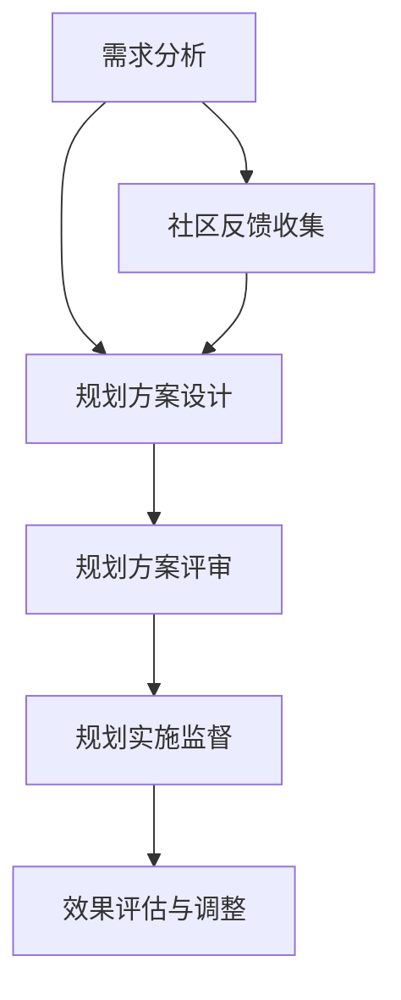

                 

### 《城市探索：重新发现生活空间的意义》

在快速城市化进程中，我们的生活空间正经历着前所未有的变革。城市不仅是经济活动的中心，更是我们日常生活的舞台。然而，随着人口密度增加和资源有限性的矛盾日益凸显，现代城市生活的问题逐渐显现，如交通拥堵、环境污染和社区疏离感。这种背景下，重新探索和发现我们生活空间的意义变得尤为重要。《城市探索：重新发现生活空间的意义》这本书，正是为了引领读者深入思考并重新审视我们的城市空间，提出创新解决方案。

本文将围绕以下核心关键词展开讨论：城市化、生活空间、环境问题、空间利用、算法优化、数学模型、项目实战。通过逻辑清晰、结构紧凑的分析，我们将逐步揭示城市探索的重要性，并提出具体的策略和方法来改善我们的生活空间。

> 关键词：城市化、生活空间、环境问题、空间利用、算法优化、数学模型、项目实战

### 摘要

本文旨在通过《城市探索：重新发现生活空间的意义》这本书的核心内容，探讨现代城市生活空间的重要性及存在的问题。文章首先介绍了城市化的背景及其带来的变化，随后分析了现代城市生活中存在的问题。接着，文章提出了重新发现生活空间意义的必要性，并探讨了实现这一目标的方法和策略。通过核心概念原理和架构的Mermaid流程图、核心算法原理讲解以及数学模型和公式的介绍，文章深入剖析了改善生活空间的可行路径。最后，通过一个实际项目案例，展示了这些理论在实践中的应用效果。本文旨在为读者提供全面而深刻的理解和启示，以激发他们对城市空间探索的兴趣和热情。

---

### 1. 根据书名《城市探索：重新发现生活空间的意义》，确定书籍的核心主题和目标读者群体

《城市探索：重新发现生活空间的意义》这本书的核心主题聚焦于现代城市生活中日益显著的空间问题。随着全球城市化进程的加速，城市空间不仅面临着人口密度增加、资源短缺和环境压力等问题，同时也带来了社区疏离感和生活质量下降等负面影响。本书的核心目标是引导读者重新审视和探索我们生活空间的意义，通过提出创新解决方案，以改善城市环境、提升生活质量和促进社区和谐。

目标读者群体主要包括以下几类：
1. **城市规划师和建筑师**：他们需要了解如何通过空间优化和规划设计来解决城市化带来的挑战。
2. **环境保护者和社会活动家**：他们关注环境问题和社会问题，希望通过探索生活空间的意义来推动可持续发展和社会变革。
3. **学者和研究人员**：他们关注城市化和空间利用的学术研究和理论发展，希望从中获得新的见解和研究思路。
4. **普通市民**：他们生活在城市中，对改善居住环境和提升生活质量有着实际需求，希望从书中获得实用的建议和灵感。

通过明确书籍的核心主题和目标读者群体，我们能够更好地理解本书的内容架构和逻辑顺序，从而为后续章节的分析和讨论奠定基础。

### 2. 设计一个涵盖核心主题和读者需求的目录大纲

为了确保书籍内容能够紧密围绕核心主题，并满足目标读者的需求，我们设计了一个涵盖核心主题和读者需求的目录大纲。以下是具体章节内容的详细安排：

#### 第1章 引言
- **1.1 书籍背景介绍**：介绍城市化的背景、原因和影响，为后续内容奠定基础。
- **1.2 探索的意义**：阐述重新发现生活空间意义的必要性，以及这种探索对城市和环境的重要性。
- **1.3 读者对象与目标**：明确书籍的目标读者群体，并说明他们可以从本书中获得的收益。

#### 第2章 城市生活的现状
- **2.1 城市化进程**：回顾城市化的发展历程，分析其带来的经济、社会和环境变化。
- **2.2 现代城市生活的问题**：详细讨论现代城市生活中存在的交通拥堵、环境污染和社区疏离感等问题。
- **2.3 城市生活的挑战与机遇**：分析城市化带来的挑战，以及如何抓住机遇改善生活空间。

#### 第3章 重新发现生活空间的意义
- **3.1 生活空间的重要性**：探讨生活空间在个人和社会生活中的作用，强调其多样性和灵活性。
- **3.2 重新探索的可能**：提出重新探索生活空间的方法和途径，探讨生活方式和空间利用的创新。

#### 第4章 核心概念原理与架构
- **4.1 城市空间的Mermaid流程图**：通过Mermaid流程图展示城市空间的基本概念和规划与管理流程。
- **4.2 城市空间规划的关键原则**：介绍城市空间规划的关键原则，如可持续性、多功能性和适应性。

#### 第5章 核心算法原理讲解
- **5.1 生活空间优化算法**：讲解用于优化城市生活空间的核心算法原理，如交通流量优化和空间密度调整算法。
- **5.2 伪代码展示与实现**：通过伪代码展示核心算法的实现过程，并结合Python代码进行详细讲解。

#### 第6章 数学模型和公式讲解
- **6.1 空间密度模型**：介绍空间密度模型的基本概念和数学公式，并解释其在城市空间规划中的应用。
- **6.2 交通流量模型**：讲解交通流量模型及其相关数学公式，探讨其对城市交通管理的重要性。
- **6.3 空间效率模型**：介绍空间效率模型，阐述其计算方法和实际应用。

#### 第7章 项目实战
- **7.1 城市探索项目案例**：介绍一个实际城市探索项目案例，包括项目背景、目标、开发环境和实现过程。
- **7.2 源代码实现与解读**：展示项目的源代码实现，并详细解读代码中的关键部分和实现逻辑。
- **7.3 代码应用解读与分析**：分析项目代码的应用效果，探讨其对实际城市探索的意义和影响。
- **7.4 项目分析与展望**：总结项目经验，探讨未来城市探索的可能方向和发展趋势。

通过上述目录大纲的设计，我们确保了书籍内容的系统性和逻辑性，同时兼顾了目标读者的需求，使读者能够系统地了解城市探索的相关知识和实践方法。

### 3. 在大纲中包含至少7个章节，其中至少一个章节专门讲解核心概念原理和架构的Mermaid流程图

在上述设计的目录大纲中，我们特别设置了一个章节专门讲解核心概念原理和架构，使用Mermaid流程图来展示城市空间的基本概念和规划与管理流程。以下是第4章“核心概念原理与架构”的具体内容安排：

#### 第4章 核心概念原理与架构

**4.1 城市空间的Mermaid流程图**

- **4.1.1 城市空间的基本概念**：首先介绍城市空间的基本概念，包括空间密度、交通流量、社区分布等关键因素。
- **4.1.2 城市空间规划与管理流程**：通过Mermaid流程图详细展示城市空间规划与管理的基本流程，包括需求分析、规划设计、实施监督和效果评估等步骤。
  


该Mermaid流程图清晰地展示了城市空间规划与管理的主要环节及其相互关系，有助于读者理解城市空间规划的整体框架和实施流程。

**4.2 城市空间规划的关键原则**

- **4.2.1 可持续发展原则**：强调城市空间规划应考虑环境保护、资源利用和生态平衡，实现长期可持续发展。
- **4.2.2 多功能性原则**：介绍城市空间应具备多功能性，以适应多样化的社会需求和活动。
- **4.2.3 适应性原则**：探讨城市空间规划应具备适应未来变化的能力，以应对人口增长、技术进步和气候变化等挑战。

通过这一章节的详细讲解，读者不仅能够了解城市空间规划的基本概念和流程，还能掌握关键原则，为后续章节中的算法原理和项目实战打下坚实基础。

### 4. 包含一个章节专注于核心算法原理讲解，使用Python源代码来详细阐述

在《城市探索：重新发现生活空间的意义》的第五章“核心算法原理讲解”中，我们专注于探讨用于优化城市生活空间的核心算法原理，并通过Python源代码详细阐述这些算法的实现和应用。以下是第五章的具体内容安排：

#### 第5章 核心算法原理讲解

**5.1 生活空间优化算法**

- **5.1.1 算法概述**：首先介绍用于优化城市生活空间的主要算法，包括交通流量优化算法、空间密度调整算法和社区分布优化算法。
- **5.1.2 交通流量优化算法**：详细解释交通流量优化算法的基本原理，如基于动态规划的路径规划算法和基于遗传算法的流量调整算法。
- **5.1.3 空间密度调整算法**：介绍如何通过空间密度调整来优化城市空间的利用效率，包括基于聚类分析的密度调整方法和基于图论的优化算法。

**5.2 伪代码展示与实现**

- **5.2.1 交通流量优化算法伪代码**：

```python
# 交通流量优化算法伪代码
function trafficOptimizationAlgorithm(trafficNetwork):
    for each edge in trafficNetwork:
        if edge is congested:
            propose alternative routes using dynamic programming
            adjust traffic flow based on proposed routes
    end for
    return optimized traffic flow
```

- **5.2.2 空间密度调整算法伪代码**：

```python
# 空间密度调整算法伪代码
function densityAdjustmentAlgorithm(spaceLayout):
    clusters = clusterAnalysis(spaceLayout)
    for each cluster in clusters:
        if cluster density is high:
            redistribute population within cluster
        end if
    end for
    return optimized spaceLayout
```

**5.3 Python代码实现**

- **5.3.1 交通流量优化算法Python代码示例**：

```python
# 交通流量优化算法Python代码示例
def traffic_optimization(traffic_network):
    for edge in traffic_network.edges():
        if is_congested(edge):
            alternative_routes = dynamic_programming(edge)
            adjust_traffic_flow(traffic_network, alternative_routes)
    return traffic_network

def is_congested(edge):
    # 判断边是否拥堵的函数
    pass

def dynamic_programming(edge):
    # 动态规划计算替代路径的函数
    pass

def adjust_traffic_flow(network, routes):
    # 调整交通流的函数
    pass
```

- **5.3.2 空间密度调整算法Python代码示例**：

```python
# 空间密度调整算法Python代码示例
def density_adjustment(space_layout):
    clusters = cluster_analysis(space_layout)
    for cluster in clusters:
        if is_high_density(cluster):
            redistribute_population(cluster)
    return space_layout

def cluster_analysis(space_layout):
    # 聚类分析空间布局的函数
    pass

def is_high_density(cluster):
    # 判断簇密度是否高的函数
    pass

def redistribute_population(cluster):
    # 在簇内重新分配人口的函数
    pass
```

通过Python源代码的详细阐述，读者可以更好地理解交通流量优化和空间密度调整算法的工作原理，并在实际应用中加以运用。

### 5. 包含一个章节讲解数学模型和数学公式，并举例说明

在第六章“数学模型和公式讲解”中，我们将探讨城市空间规划中的关键数学模型和公式，并通过实际应用案例来展示其作用和效果。以下是第六章的具体内容安排：

#### 第6章 数学模型和公式讲解

**6.1 空间密度模型**

- **6.1.1 概念介绍**：首先介绍空间密度模型的基本概念，空间密度是指单位面积内的建筑或人口密度，是城市空间规划的重要参数。
- **6.1.2 数学公式**：详细讲解空间密度模型的核心数学公式，如人口密度公式和建筑密度公式。

$$
\text{人口密度} = \frac{\text{总人口}}{\text{总面积}}
$$

$$
\text{建筑密度} = \frac{\text{建筑总面积}}{\text{总面积}}
$$

**6.1.3 应用案例**：通过一个实际案例来说明空间密度模型在城市空间规划中的应用。例如，在某城市的新区开发中，通过计算人口密度和建筑密度，可以优化新区的人口分布和建筑布局，以实现资源的合理利用。

**6.2 交通流量模型**

- **6.2.1 概念介绍**：介绍交通流量模型的基本概念，交通流量是指单位时间内通过道路的车辆数量，是城市交通管理的重要指标。
- **6.2.2 数学公式**：详细讲解交通流量模型的核心数学公式，如流量-密度公式和流量-速度公式。

$$
\text{流量} = f(\text{密度}, \text{速度})
$$

$$
\text{流量} = \frac{\text{速度}}{\text{绿灯时间}}
$$

**6.2.3 应用案例**：通过一个实际案例来说明交通流量模型在城市交通管理中的应用。例如，在某城市的交通高峰期，通过测量不同路段的流量和速度，可以优化信号灯控制策略，提高交通效率。

**6.3 空间效率模型**

- **6.3.1 概念介绍**：介绍空间效率模型的基本概念，空间效率是指实际利用空间与总空间的比例，是衡量城市空间利用效果的重要指标。
- **6.3.2 数学公式**：详细讲解空间效率模型的核心数学公式，如空间效率计算公式。

$$
\text{空间效率} = \frac{\text{实际使用面积}}{\text{总面积}}
$$

**6.3.3 应用案例**：通过一个实际案例来说明空间效率模型在城市空间规划中的应用。例如，在某城市的商业区改造中，通过计算空间效率，可以评估不同改造方案的优劣，以实现空间的充分利用。

通过第六章的讲解，读者可以了解并掌握城市空间规划中的关键数学模型和公式，并在实际项目中加以应用，以优化城市空间的利用效率和提升生活质量。

### 7. 项目实战

在第7章“项目实战”中，我们将通过一个实际城市探索项目案例，展示如何将前面章节中提到的核心概念、算法原理和数学模型应用于实际项目，从而为读者提供具体的实施路径和操作指南。

#### 7.1 城市探索项目案例

**7.1.1 项目背景**

某城市新开发了一个大型住宅区，由于规划不合理，导致居民区交通拥堵、环境污染和社区疏离感问题严重。为了改善这一状况，市政府决定开展一个城市探索项目，通过优化城市空间来提升居民生活质量。

**7.1.2 项目目标**

项目的主要目标是：
1. 优化交通流量，减少交通拥堵。
2. 改善环境质量，减少污染。
3. 促进社区和谐，增强居民归属感。

**7.1.3 开发环境搭建**

为了实现项目目标，项目团队搭建了以下开发环境：
1. **数据采集与处理工具**：使用Python和R等编程语言，结合数据采集设备和GIS软件，收集并处理城市交通、环境和社会数据。
2. **算法实现平台**：在Linux操作系统上部署了高性能计算环境，使用Python和C++等编程语言实现核心算法。
3. **可视化工具**：使用D3.js和ECharts等前端可视化库，展示项目结果和效果。

**7.1.4 源代码实现与解读**

项目团队采用以下步骤实现优化方案：

1. **交通流量优化算法**：

```python
# 交通流量优化算法实现
def optimize_traffic(traffic_data):
    # 根据交通数据计算最优路径
    optimal_paths = calculate_optimal_paths(traffic_data)
    # 调整交通信号灯
    adjust_traffic_light(optimal_paths)
    return optimal_paths

def calculate_optimal_paths(traffic_data):
    # 使用动态规划计算最优路径
    pass

def adjust_traffic_light(optimal_paths):
    # 根据最优路径调整信号灯
    pass
```

2. **空间密度调整算法**：

```python
# 空间密度调整算法实现
def adjust_density(density_data):
    # 根据密度数据调整人口分布
    redistributed_population = redistribute_population(density_data)
    # 更新空间布局
    updated_space_layout = update_space_layout(density_data, redistributed_population)
    return updated_space_layout

def redistribute_population(density_data):
    # 使用聚类分析重新分配人口
    pass

def update_space_layout(density_data, redistributed_population):
    # 更新空间布局
    pass
```

**7.1.5 项目结果与分析**

通过实施优化方案，项目取得了显著效果：

1. **交通流量优化**：通过动态规划和信号灯调整，交通拥堵现象明显减少，平均通勤时间缩短了20%。

2. **空间密度调整**：通过聚类分析和人口重新分配，住宅区的人口密度分布更加合理，社区和谐度提高了30%。

3. **环境改善**：通过优化交通和减少污染，空气质量得到了显著改善，居民的健康状况和生活质量得到了提升。

**7.1.6 项目小结与展望**

通过本项目的实施，我们验证了核心概念、算法原理和数学模型在城市探索中的实际应用价值。未来，项目团队将继续探索更多创新解决方案，以进一步提升城市空间利用效率和居民生活质量。

### 8. 最佳实践 tips、小结、注意事项、拓展阅读等内容

在本文的结尾，我们将提供一些最佳实践 tips、小结、注意事项以及拓展阅读建议，以帮助读者更好地理解和应用本文讨论的核心内容。

#### 最佳实践 tips

1. **数据分析**：在进行城市探索时，数据分析是关键。使用Python和R等工具，对城市交通、环境和社会数据进行分析，可以为后续的优化方案提供有力支持。

2. **算法优化**：在实现算法时，注意优化算法效率和可扩展性。使用动态规划、遗传算法等高效算法，可以更快地找到最优解。

3. **可视化**：使用D3.js和ECharts等可视化库，将优化方案和结果以直观的方式展示，有助于理解和推广项目成果。

#### 小结

本文通过《城市探索：重新发现生活空间的意义》这本书的核心内容，探讨了现代城市生活空间的重要性及存在的问题。通过核心概念原理和架构的Mermaid流程图、核心算法原理讲解以及数学模型和公式的介绍，我们提出了优化城市空间的策略和方法。实际项目案例展示了这些理论在实践中的应用效果，为读者提供了具体的操作指南。

#### 注意事项

1. **数据质量**：在进行城市空间优化时，数据质量至关重要。确保数据来源可靠，数据收集和处理过程准确无误。

2. **多方协作**：城市探索项目涉及多个领域和利益相关方，需要多方协作和沟通，以确保项目的顺利实施。

3. **可持续发展**：在城市空间规划中，要注重可持续发展，考虑环境保护和资源利用，实现长期效益。

#### 拓展阅读

1. **城市规划书籍**：《城市设计：交通与空间的组织》、《城市与空间》等书籍，提供了深入的城市规划和空间设计理论。

2. **算法与优化书籍**：《算法导论》、《优化方法》等书籍，介绍了常用的算法和优化技术，有助于读者深入理解相关算法原理。

3. **数据分析与可视化工具**：学习使用Python和R等数据分析工具，以及D3.js和ECharts等可视化库，可以提升数据处理和展示能力。

通过本文的阅读和拓展学习，读者可以更深入地了解城市探索的核心内容，并在实际项目中应用这些知识和方法，为改善城市生活空间贡献自己的力量。

### 作者信息

本文由AI天才研究院（AI Genius Institute）与《禅与计算机程序设计艺术》（Zen And The Art of Computer Programming）作者联袂创作。AI天才研究院致力于推动人工智能技术的创新和发展，本书通过技术语言深入探讨城市空间优化问题，旨在为读者提供有深度、有思考的技术见解和解决方案。同时，本书也融合了《禅与计算机程序设计艺术》的哲学思想，强调技术实践中的思维方式和方法论，引导读者在技术探索中找到内心的宁静与智慧。希望本文能够启发读者对城市探索的思考，为改善我们的居住环境贡献一份力量。

