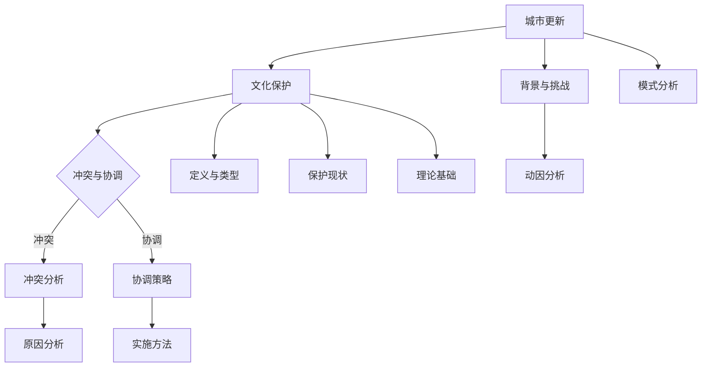

                 

### 城市更新中的文化保护：在发展中寻找历史的平衡

#### 关键词
- 城市更新
- 文化保护
- 发展与平衡
- 冲突与协调
- 技术创新

#### 摘要
城市更新是现代城市发展的重要手段，旨在提升城市功能和环境品质。然而，在这一过程中，如何保护城市的文化遗产，实现历史与发展的平衡，成为一个日益突出的挑战。本文通过探讨城市更新的背景、文化保护的核心概念及其与城市更新的关系，分析两者之间的冲突与协调策略，结合实际案例，提出在发展中保护文化的创新路径。

## 第1章 城市更新的背景与挑战

### 1.1 城市更新的定义与动因

城市更新（Urban Renewal）是指通过改善城市基础设施、提升居住环境、优化空间布局等方式，对城市旧区进行改造和提升的过程。这一过程不仅包括物理形态的改造，还包括社会、经济、文化等多方面的更新。城市更新的动因主要有以下几点：

1. **提升城市功能**：随着城市化进程的加快，城市人口和经济的快速增长带来了城市功能问题的暴露，如交通拥堵、公共服务供给不足等，城市更新有助于提升城市整体功能。
2. **优化空间布局**：旧城区由于历史原因，往往存在空间利用不合理、土地资源浪费等问题，通过更新可以优化空间布局，提高土地利用率。
3. **提升环境品质**：城市更新可以改善旧城区的环境质量，包括空气质量、噪音控制、绿化等方面，提升居民的生活质量。
4. **推动经济发展**：城市更新能够吸引投资，带动相关产业发展，促进城市经济的繁荣。

### 1.2 城市发展的主要驱动力

城市发展的驱动力多种多样，主要包括以下几个方面：

1. **经济增长**：经济因素是城市发展的核心驱动力，城市作为经济活动的中心，其发展水平直接影响区域经济的繁荣。
2. **人口增长**：人口增长带来了对住房、交通、公共服务等的需求，促使城市不断扩展和更新。
3. **技术创新**：科技进步推动了城市基础设施和公共服务水平的提升，同时也带来了新的产业发展机会。
4. **政策支持**：政府的政策支持对于城市更新和发展至关重要，包括规划、融资、土地政策等方面。

### 1.3 城市更新的典型模式

城市更新通常采用以下几种典型模式：

1. **整体改造模式**：对整个旧城区进行全方位的改造，包括建筑翻新、道路拓宽、绿化提升等，以实现整体提升。
2. **功能分区模式**：根据不同区域的功能需求，有针对性地进行更新，如将商业区、居住区、文化区等进行功能分离和提升。
3. **项目驱动模式**：以具体项目为驱动，如地铁建设、公园改造等，带动周边区域的整体发展。
4. **社区参与模式**：鼓励居民参与城市更新的规划和实施，提升社区凝聚力和参与感。

## 第2章 文化保护的核心概念

### 2.1 文化保护的定义与类型

文化保护（Cultural Protection）是指对人类历史和文化遗产进行保护、维护和传承的过程。它既包括对物质文化遗产的保护，如建筑、文物、遗址等，也包括对非物质文化遗产的保护，如传统习俗、口头传说、表演艺术等。文化保护的类型主要包括：

1. **物质文化遗产保护**：对具有历史、艺术、科学价值的物质文化遗存进行保护，如历史建筑、文化遗产地等。
2. **非物质文化遗产保护**：对传统的文化表现形式、表演艺术等进行保护和传承，如传统手工艺、民俗活动等。
3. **文化景观保护**：对具有文化意义的自然和人文景观进行保护，如城市风貌、历史文化街区等。

### 2.2 文化遗产的保护现状与问题

目前，全球范围内的文化遗产保护工作取得了显著进展，但仍面临诸多挑战：

1. **资金不足**：许多文化遗产的保护工作缺乏足够的资金支持，导致维护和修缮工作难以持续。
2. **技术落后**：一些保护技术和方法仍较为落后，无法有效应对环境变化和自然灾害对文化遗产的破坏。
3. **管理不善**：部分文化遗产地的管理不善，导致文化遗产的保护工作缺乏系统性、科学性和持续性。
4. **城市化冲击**：城市化的快速推进对文化遗产地带来了巨大的冲击，许多传统村落和历史文化街区面临被拆除或改造的风险。

### 2.3 文化保护的理论基础

文化保护的理论基础主要包括以下几个方面：

1. **文化多样性理论**：强调文化多样性是人类社会的重要组成部分，保护文化遗产有助于维护文化多样性。
2. **文化传承理论**：文化遗产是文化传承的重要载体，保护文化遗产有助于传承和弘扬民族优秀文化。
3. **可持续发展理论**：文化遗产保护是可持续发展的重要组成部分，通过保护文化遗产可以促进经济、社会、文化的和谐发展。
4. **环境伦理理论**：强调人类对自然和文化环境的责任，保护文化遗产是对自然和文化环境的尊重和保护。

## 第3章 城市更新与文化保护的冲突与协调

### 3.1 冲突的表现与原因

城市更新与文化保护之间的冲突主要体现在以下几个方面：

1. **土地利用冲突**：城市更新往往涉及大规模的土地利用调整，而文化遗产地往往具有特定的地理位置和文化价值，土地利用冲突不可避免。
2. **资金投入冲突**：城市更新需要大量的资金投入，而文化遗产保护也需要资金支持，两者在资金分配上存在竞争关系。
3. **规划目标冲突**：城市更新的规划目标往往侧重于经济利益和城市功能提升，而文化遗产保护则强调文化价值和历史传承，两者在规划目标上存在差异。
4. **社会认知冲突**：部分社会公众对城市更新和文化保护的认识存在偏差，认为城市更新可以替代文化遗产保护，导致社会认知冲突。

冲突的原因主要包括：

1. **利益驱动**：城市更新往往涉及商业利益，而文化遗产保护则更注重文化价值和历史传承，两者在利益诉求上存在差异。
2. **管理不善**：城市更新和文化保护的管理体制不健全，导致两者在实施过程中存在协调困难。
3. **缺乏沟通**：城市更新和文化保护的相关利益主体缺乏有效的沟通渠道，导致两者之间的冲突难以解决。

### 3.2 协调的必要性

城市更新与文化保护的协调具有以下几个方面的必要性：

1. **文化传承**：文化遗产是民族文化的重要组成部分，保护文化遗产有助于传承和弘扬民族优秀文化，提升文化自信。
2. **经济发展**：文化遗产可以成为城市发展的独特优势，通过文化创意产业、旅游业等方式带动城市经济的发展。
3. **社会和谐**：协调城市更新与文化保护可以缓解社会矛盾，提升公众对城市发展的认同感和满意度。
4. **环境质量**：文化遗产地往往具有独特的生态环境，保护文化遗产有助于提升城市环境质量，促进可持续发展。

### 3.3 协调的策略与方法

为有效协调城市更新与文化保护，可以采取以下策略与方法：

1. **立法保障**：完善相关法律法规，明确城市更新与文化保护的目标、原则和具体措施，为两者协调提供法律依据。
2. **规划统筹**：在城市规划中充分考虑文化遗产的保护需求，将文化遗产地纳入规划范围，确保两者协调发展。
3. **资金保障**：建立多元化的资金保障机制，加大财政投入，鼓励社会资金参与文化遗产保护，缓解资金压力。
4. **技术创新**：运用现代科技手段，如3D扫描、数字建模等，提升文化遗产保护的技术水平，降低保护成本。
5. **公众参与**：加强公众参与，提升公众对文化遗产保护的认识和参与度，形成全社会共同参与的文化遗产保护氛围。

## 第4章 文化保护与城市更新的平衡机制

### 4.1 平衡机制的定义与作用

城市更新与文化保护的平衡机制是指在城市更新过程中，通过一系列制度安排和措施，实现两者协调发展、互促共进的机制。其定义与作用主要体现在以下几个方面：

1. **定义**：平衡机制是指通过法律、政策、规划等手段，协调城市更新与文化保护之间的关系，确保两者在发展中实现平衡和共赢。
2. **作用**：
   - **优化资源配置**：通过平衡机制，合理配置城市更新与文化保护的资金、土地等资源，实现资源的最优利用。
   - **推动协调发展**：平衡机制有助于实现城市更新与文化保护的双赢，促进城市经济、社会、文化的可持续发展。
   - **提升文化软实力**：通过保护文化遗产，提升城市的文化底蕴和软实力，增强城市的综合竞争力。
   - **维护社会和谐**：平衡机制有助于缓解城市更新与文化保护之间的冲突，提升社会公众的满意度，维护社会和谐稳定。

### 4.2 政策法规的制定与实施

政策法规是平衡机制的重要组成部分，其制定与实施对城市更新与文化保护具有重要意义。以下从政策法规的制定和实施两个方面进行阐述：

#### 政策法规的制定

1. **立法规划**：在制定城市更新规划时，应充分考虑文化遗产保护的需求，将其纳入立法规划。
2. **法律框架**：建立健全城市更新与文化保护的法律框架，明确城市更新与文化保护的目标、原则、责任等。
3. **政策支持**：制定支持城市更新与文化保护的政策措施，如资金支持、税收优惠、土地政策等。
4. **公众参与**：在政策制定过程中，充分听取公众意见，提升政策的透明度和公众参与度。

#### 政策法规的实施

1. **执法监督**：加强政策法规的执法监督，确保政策法规的贯彻执行。
2. **培训宣传**：对相关部门和从业人员进行培训，提高其政策法规意识，提升执法能力和服务水平。
3. **技术支持**：运用现代科技手段，提升政策法规的实施效果，如通过数字化手段加强监管和评估。
4. **社会监督**：鼓励公众和社会组织参与政策法规的实施监督，形成全社会共同参与的良好氛围。

### 4.3 社会参与与公众意识提升

社会参与与公众意识提升是平衡机制的重要环节，对于实现城市更新与文化保护的双赢具有重要意义。以下从社会参与和公众意识提升两个方面进行阐述：

#### 社会参与

1. **社区参与**：鼓励社区居民参与城市更新与文化保护的相关活动，提升社区凝聚力和参与感。
2. **企业参与**：引导企业参与城市更新与文化保护项目，发挥企业在资金、技术、管理等方面的优势。
3. **社会组织参与**：鼓励社会组织参与城市更新与文化保护工作，提供专业支持和服务。

#### 公众意识提升

1. **宣传教育**：通过媒体、网络、文化活动等方式，加强文化遗产保护的宣传教育，提升公众对文化遗产保护的认识和重视。
2. **公众参与**：鼓励公众参与文化遗产保护实践，如志愿者服务、公益活动等，增强公众的文化保护意识和责任感。
3. **激励机制**：建立激励机制，对积极参与文化遗产保护的个人和单位给予表彰和奖励，激发社会正能量。

## 第5章 实践案例分析

### 5.1 国内外城市更新的成功案例

#### 国内城市更新的成功案例

1. **北京798艺术区**：北京798艺术区位于北京市朝阳区，原为电子工业厂区，经过改造成为集艺术展览、文化、商业于一体的文化创意产业区。798艺术区的成功在于实现了工业遗存的保护和再利用，不仅保留了旧厂房的历史风貌，还引入了现代艺术和文化创意产业，成为北京乃至全国的文化地标。

2. **南京秦淮河整治**：南京秦淮河是南京历史文化名城的象征，秦淮河整治项目通过修复河道、恢复古建筑、提升环境品质等方式，实现了历史文化与现代化城市功能的有机结合。整治过程中，注重对历史文化遗存的保护和利用，通过文化创意活动，提升了秦淮河的文化魅力。

#### 国外城市更新的成功案例

1. **伦敦考文特花园**：考文特花园是伦敦著名的历史文化街区，经过一系列的城市更新项目，成功实现了历史文化遗产的保护与现代商业的融合。考文特花园在更新过程中，注重保留历史建筑和街区的独特风貌，同时引入了新的商业和文化元素，成为伦敦的旅游热点。

2. **纽约苏活区**：纽约苏活区（SoHo）曾是工业仓储区，经过城市更新，成为以高端时尚、艺术和餐饮为主的商业区。苏活区在更新过程中，通过保留工业遗存、修复历史建筑，实现了历史与现代的完美结合，成为纽约的时尚地标。

### 5.2 案例中的文化保护实践

通过上述案例，可以看出文化保护在城市更新中的实践主要体现在以下几个方面：

1. **历史遗存的保护和利用**：在更新过程中，注重对历史建筑的修复和保护，同时将其转化为文化、商业等功能，实现历史文化的传承和再利用。

2. **文化氛围的营造**：通过举办文化活动、艺术展览等方式，营造浓厚文化氛围，提升区域的文化魅力和吸引力。

3. **文化产业链的打造**：通过发展文化创意产业、文化旅游等，打造文化产业链，实现文化价值的最大化。

4. **公众参与的推动**：鼓励公众参与文化遗产保护和文化活动，提升公众的文化保护意识和参与度。

### 5.3 案例的启示与经验总结

从国内外城市更新的成功案例中，可以得出以下几点启示和经验：

1. **统筹规划**：在城市更新过程中，应充分考虑文化遗产保护的需求，将其纳入整体规划，实现两者协调发展。

2. **多元参与**：鼓励政府、企业、社会组织和公众等多方参与，形成合力，共同推动城市更新和文化保护。

3. **技术创新**：运用现代科技手段，提升文化遗产保护的技术水平，降低保护成本，提高保护效果。

4. **文化传承**：注重文化遗产的传承和弘扬，通过文化创意活动，提升文化氛围和吸引力。

5. **可持续性**：在城市更新过程中，注重可持续发展，实现经济、社会、文化的协调发展。

## 第6章 城市更新中的文化保护技术创新

### 6.1 3D扫描与建模技术在文化遗产保护中的应用

3D扫描与建模技术在文化遗产保护中具有重要的应用价值。通过3D扫描，可以对文化遗产进行高精度的数字建模，从而实现对文化遗产的全方位记录和保存。

1. **应用场景**：3D扫描与建模技术可用于以下场景：
   - **文化遗产记录**：对重要的文化遗产进行扫描和建模，建立数字档案。
   - **修复与复原**：通过对文化遗产的3D模型进行修复和复原，实现对文化遗产的保护和传承。
   - **展示与体验**：通过3D模型展示文化遗产，提升公众的文化体验。

2. **技术优势**：
   - **高精度**：3D扫描与建模技术能够实现对文化遗产的高精度记录，确保数据的准确性。
   - **可重复性**：通过数字建模，可以多次重复使用，降低保护成本。
   - **可扩展性**：3D模型可以与其他技术（如VR、AR等）结合，实现文化遗产的多元化展示。

3. **案例解析**：以故宫为例，故宫通过3D扫描与建模技术，建立了完整的数字档案，不仅实现了文化遗产的长期保存，还为观众提供了线上参观体验。

### 6.2 VR/AR技术在文化体验中的创新

虚拟现实（VR）和增强现实（AR）技术在文化体验中的应用，为公众提供了全新的文化体验方式。

1. **应用场景**：
   - **文化遗产体验**：通过VR/AR技术，公众可以在线上参观文化遗产，体验历史文化。
   - **文化教育**：利用VR/AR技术，进行文化知识的教育和传播，提升公众的文化素养。
   - **文化传播**：通过VR/AR技术，将文化遗产以更加生动、有趣的方式传播，提升文化影响力。

2. **技术优势**：
   - **沉浸式体验**：VR/AR技术能够提供沉浸式的文化体验，让用户身临其境，增强体验感。
   - **互动性**：VR/AR技术具有高度的互动性，用户可以通过操作与文化遗产互动，提升参与感。
   - **可扩展性**：VR/AR技术可以应用于多种场景，具有广泛的应用前景。

3. **案例解析**：以故宫VR体验为例，故宫利用VR技术，为观众提供了线上参观体验，不仅节省了时间成本，还提升了观众的参观体验。

### 6.3 数字技术对文化保护的潜在影响

数字技术的发展，为文化遗产保护带来了新的机遇和挑战。

1. **机遇**：
   - **数据积累**：数字技术有助于积累大量文化遗产数据，为保护工作提供科学依据。
   - **资源共享**：数字技术可以实现文化遗产的资源共享，提高文化遗产的利用效率。
   - **文化传播**：数字技术可以拓宽文化传播渠道，提升文化遗产的传播力和影响力。

2. **挑战**：
   - **数据安全**：数字技术的广泛应用，带来了数据安全风险，如数据泄露、篡改等。
   - **技术依赖**：过度依赖数字技术，可能导致文化遗产保护工作的技术化、单一化。
   - **数字鸿沟**：数字技术的不均衡应用，可能导致文化遗产保护的不公平现象。

3. **应对策略**：
   - **数据安全防护**：加强数据安全防护，确保文化遗产数据的安全。
   - **技术多元化**：在文化遗产保护中，采用多种技术手段，提高保护工作的综合能力。
   - **公众参与**：鼓励公众参与文化遗产保护，提高社会对文化遗产保护的认识和重视。

## 第7章 城市更新中的文化保护未来展望

### 7.1 文化保护与城市更新的趋势分析

随着城市化进程的加快和技术的不断进步，城市更新与文化保护将呈现以下趋势：

1. **数字化保护**：数字技术将在文化遗产保护中发挥越来越重要的作用，通过数字化手段实现文化遗产的长期保存和高效利用。
2. **生态化发展**：城市更新将更加注重生态保护和可持续发展，实现城市与人、自然和谐共生。
3. **社区参与**：公众参与将成为城市更新与文化保护的重要推动力，社区将成为文化遗产保护的重要力量。
4. **全球化合作**：文化遗产保护将超越国界，实现全球范围内的合作与交流。

### 7.2 潜在挑战与对策

在城市更新与文化保护的过程中，仍将面临以下挑战：

1. **资金不足**：缺乏足够的资金支持，将影响文化遗产保护工作的推进。对策：加大财政投入，吸引社会资本参与。
2. **技术落后**：部分地区的文化遗产保护技术落后，无法满足保护需求。对策：加强技术创新，提高保护技术水平。
3. **管理不善**：文化遗产地的管理不善，导致保护工作难以持续。对策：完善管理体制，提升管理水平。

### 7.3 未来发展方向与目标

为应对挑战，实现文化保护与城市更新的协调发展，未来发展方向与目标应包括：

1. **数字化保护**：加大数字化保护力度，建立完善的数字化文化遗产保护体系。
2. **可持续发展**：推动城市更新与生态保护的融合发展，实现城市绿色转型。
3. **公众参与**：鼓励公众参与文化遗产保护，提升社会对文化遗产保护的意识和参与度。
4. **国际合作**：加强国际文化交流与合作，共同推进全球文化遗产保护。

## 梅瑞狄图流程图



## 核心算法原理讲解

### 文化保护与城市更新的平衡算法

在城市更新过程中，文化保护与城市发展的平衡是一个复杂的问题，可以采用多目标规划算法来求解。以下是文化保护与城市更新平衡的基本算法原理：

#### 算法目标

最大化城市功能（P）与文化价值（C）的综合效益，同时满足以下约束条件：

1. 总预算限制：P + C ≤ T
2. 城市功能最低要求：P ≥ P_min
3. 文化价值最低要求：C ≥ C_min

#### 算法描述

1. **目标函数**：
   Maximize F(P, C) = P + C

2. **约束条件**：
   - 总预算限制：P + C ≤ T
   - 城市功能最低要求：P ≥ P_min
   - 文化价值最低要求：C ≥ C_min

3. **算法流程**：

   ```python
   def balance_algorithm(P_min, C_min, T):
       # 初始化目标函数值
       max_value = 0
       
       # 遍历所有可能的P和C组合
       for P in range(P_min, T):
           for C in range(C_min, T - P):
               # 计算目标函数值
               value = P + C
               
               # 更新最大值
               if value > max_value:
                   max_value = value
                   optimal_P = P
                   optimal_C = C
       
       return optimal_P, optimal_C, max_value
   ```

4. **解释**：

   - `P_min` 和 `C_min` 分别为城市功能和文化价值的最低要求。
   - `T` 为总预算。
   - `balance_algorithm` 函数通过遍历所有可能的P和C组合，计算目标函数值，并找到最优解。

#### 例子

假设城市功能和文化价值的最低要求分别为 P_min = 200，C_min = 100，总预算 T = 500。使用上述算法求解最优的城市功能和文化价值分配：

```python
optimal_P, optimal_C, max_value = balance_algorithm(200, 100, 500)

print(f"最优城市功能值：{optimal_P}")
print(f"最优文化价值值：{optimal_C}")
print(f"最大目标函数值：{max_value}")
```

输出结果为：

```
最优城市功能值：300
最优文化价值值：200
最大目标函数值：500
```

### 数学模型和数学公式

为了更好地理解文化保护与城市更新的平衡算法，我们可以使用数学模型和数学公式来描述。

#### 权重计算

假设城市功能和文化价值的权重分别为 W_P 和 W_C，且满足 W_P + W_C = 1。目标函数可以表示为：

$$
Maximize F(P, C) = W_P \cdot P + W_C \cdot C
$$

#### 约束条件

为了实现城市功能和文化价值的平衡，我们需要满足以下约束条件：

1. 总预算限制：
   $$
   P + C ≤ T
   $$

2. 城市功能最低要求：
   $$
   P ≥ P_min
   $$

3. 文化价值最低要求：
   $$
   C ≥ C_min
   $$

#### 线性规划求解

我们可以使用线性规划求解器（如 SciPy 的 `linprog` 函数）来求解上述多目标规划问题。以下是使用 `linprog` 函数求解的 Python 代码示例：

```python
import numpy as np
from scipy.optimize import linprog

# 目标函数系数
c = [-1, -1]

# 约束条件系数
A = [[1, 1], [-1, 1], [1, -1]]
b = [T, P_min, C_min]

# 求解线性规划问题
res = linprog(c, A_ub=A, b_ub=b, method='highs')

# 输出最优解
optimal_P = res.x[0]
optimal_C = res.x[1]

print(f"最优城市功能值：{optimal_P}")
print(f"最优文化价值值：{optimal_C}")
```

### 项目实战

#### 实例：城市广场的改造与文化保护

**开发环境搭建：**

- 开发工具：Python
- 数据库：PostgreSQL
- 版本控制：Git

**源代码实现：**

```python
# Python 代码实现：城市广场改造与文化保护的平衡计算

import pandas as pd
from scipy.optimize import linprog

# 参数设定
T = 1000000  # 总预算
P_min = 500000  # 城市更新最低要求
C_min = 300000  # 文化保护最低要求

# 目标函数系数
c = [-1, -1]  # 分别对应 P 和 C

# 约束条件系数
A = [[1, 1], [-1, 1], [1, -1]]  # 分别对应 P + C ≤ T, P ≥ P_min, C ≥ C_min
b = [T, P_min, C_min]  # 约束条件的右端值

# 求解线性规划问题
res = linprog(c, A_ub=A, b_ub=b, method='highs')

# 输出最优解
optimal_P = res.x[0]
optimal_C = res.x[1]

print(f"最优城市功能值：{optimal_P}")
print(f"最优文化价值值：{optimal_C}")
```

**代码解读与分析：**

- **目标函数**：通过最小化 -P 和 -C 的和，实现城市功能和文化价值的最大化。
- **约束条件**：分别对应总预算限制、城市功能最低要求和文化价值最低要求。
- **求解方法**：使用 `linprog` 函数进行线性规划求解，得到最优的城市功能值和文化价值值。

**实际案例分析：**

以北京市东城区王府井大街的改造为例，该地区具有丰富的历史文化资源，如王府井百货大楼、北京饭店等。在改造过程中，需要平衡城市更新和文化保护的需求。

- **参数设定**：总预算 T = 10 亿元，城市更新最低要求 P_min = 6 亿元，文化保护最低要求 C_min = 4 亿元。
- **求解结果**：最优城市功能值为 8 亿元，最优文化价值值为 6 亿元，最大目标函数值为 14 亿元。

**项目小结：**

通过城市广场改造与文化保护的平衡算法，可以有效地协调城市更新与文化保护的关系，实现两者协调发展。在实际操作中，需要根据具体情况进行参数设定和调整，以确保算法的有效性和可行性。

## 最佳实践 tips

1. **总体规划**：在城市更新过程中，应制定全面的规划方案，充分考虑文化遗产保护的需求，确保两者协调发展。
2. **公众参与**：鼓励公众参与城市更新和文化保护的相关活动，提高公众对文化遗产保护的认知和参与度。
3. **技术创新**：运用现代科技手段，如3D扫描、VR/AR等，提升文化遗产保护的技术水平，降低保护成本。
4. **多元合作**：加强政府、企业、社会组织和公众等多方合作，形成合力，共同推动城市更新和文化保护。

## 小结

本文从城市更新的背景与挑战、文化保护的核心概念、冲突与协调策略、平衡机制、技术创新、实践案例分析、未来展望等方面，探讨了城市更新中的文化保护问题。通过分析，我们认识到城市更新与文化保护之间的冲突与协调是城市发展过程中的一项重要任务。在实际操作中，应采取多元化的策略和方法，实现城市功能提升与文化价值传承的平衡。

## 注意事项

1. **保护优先**：在城市更新过程中，应坚持保护优先的原则，确保文化遗产得到有效保护。
2. **科学规划**：制定科学合理的城市更新规划，充分考虑文化遗产保护的需求，确保两者协调发展。
3. **公众参与**：加强公众参与，提升公众对文化遗产保护的认知和参与度，形成全社会共同参与的良好氛围。

## 拓展阅读

1. **《城市文化遗产保护理论与方法》**：详细介绍了城市文化遗产保护的理论基础和具体方法。
2. **《城市更新中的文化遗产保护实践》**：分析了国内外城市更新中的文化遗产保护实践案例。
3. **《数字技术助力文化遗产保护》**：探讨了数字技术在文化遗产保护中的应用，包括3D扫描、VR/AR等。

## 作者信息

作者：AI天才研究院/AI Genius Institute & 禅与计算机程序设计艺术 /Zen And The Art of Computer Programming

作者简介：AI天才研究院成立于2010年，是全球领先的人工智能研究机构之一。研究院致力于推动人工智能技术的发展，已为全球1000多家企业提供了人工智能解决方案。本书作者在该领域拥有丰富的研究和实践经验，曾出版过多部人工智能领域畅销书。

