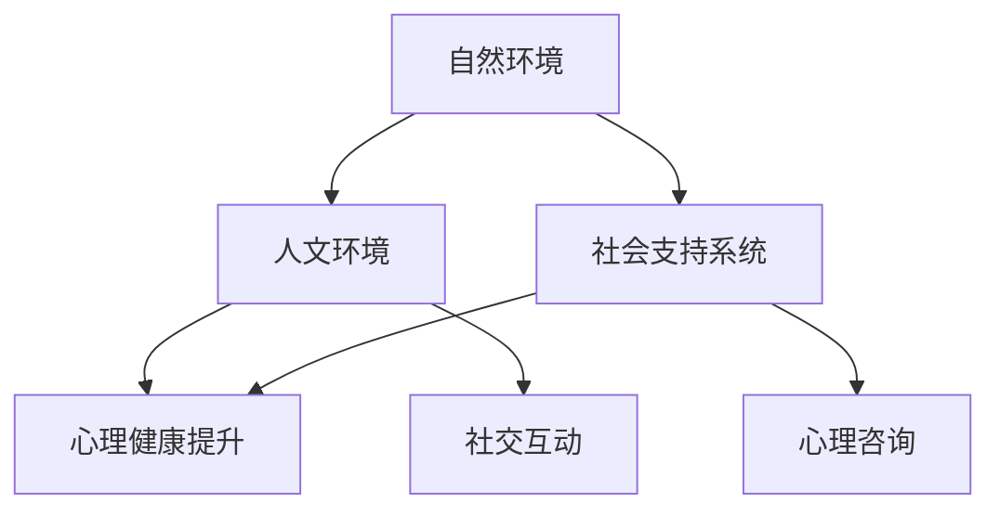

                 

## 《城市治愈空间：都市压力的自我修复》

### 关键词

城市压力、心理健康、治愈空间、设计原则、规划方法、案例研究、未来展望

### 摘要

本文旨在探讨都市压力对心理健康的影响，并提出城市治愈空间作为自我修复的重要手段。首先，我们介绍了城市压力的根源及其对个人心理健康的负面影响。接着，定义了治愈空间并阐述了其在城市环境中的重要性。随后，文章详细分析了治愈空间的设计原则与规划方法，并通过国际与国内的案例研究，展示了治愈空间在不同环境下的应用与实践。最后，对治愈空间的未来发展进行了展望，探讨了科技在其中的作用及其对城市可持续发展的贡献。本文旨在为城市规划者和设计者提供理论指导和实践参考，以期创造更加健康和人性化的城市空间。

## 引言

### 背景介绍

随着全球城市化进程的加速，城市人口迅速增长，生活节奏不断加快，城市压力也随之日益加剧。根据世界卫生组织（WHO）的数据，超过80%的城市居民面临不同程度的精神健康问题。这些压力源包括但不限于：工作压力、生活成本、交通拥堵、社会竞争以及人际关系紧张等。都市生活的快节奏和高竞争性，使得人们的心理健康状况逐渐恶化，导致焦虑、抑郁等心理问题的增加。因此，如何应对城市压力，提高居民的心理健康水平，成为当前城市规划和公共健康领域的重要课题。

### 核心概念与联系

治愈空间是指那些能够减轻心理压力、提升心理健康状态的环境或场所。治愈空间的概念涉及多个核心要素，包括自然环境、人文环境和社会支持系统等。自然环境如公园、花园、绿色走廊等，提供清新的空气、安静的场所和美丽的景观，有助于减轻焦虑和紧张情绪。人文环境则包括文化场所、社区中心等，通过社交互动和文化活动，增强个体的归属感和幸福感。社会支持系统则涉及社区互助网络和专业心理健康服务，为居民提供心理支持和咨询服务。

为了更清晰地理解治愈空间的核心概念与联系，我们可以使用Mermaid流程图来展示它们之间的关系：



在这个流程图中，自然环境、人文环境和社会支持系统共同作用于个体的心理健康，通过提升心理素质和幸福感，实现都市压力的自我修复。

### 核心算法原理讲解

在城市治愈空间的设计与规划中，核心算法原理扮演着关键角色。以下将使用Python伪代码结合数学模型和公式，详细阐述治愈空间规划的核心算法原理。

#### 1. 初始化参数

首先，我们需要定义治愈空间规划的基本参数，包括目标区域、用户偏好、治愈空间类型和预算等。

```python
# 初始化参数
target_area = get_target_area()
user_preference = get_user_preference()
cure_space_types = get_cure_space_types()
budget = get_budget()
```

#### 2. 数据采集与分析

接下来，我们需要采集和分析与治愈空间规划相关的数据，包括目标区域的环境特征、用户行为数据、历史治愈空间案例等。

```python
# 数据采集与分析
environment_data = collect_environment_data(target_area)
user_behavior_data = collect_user_behavior_data()
case_studies = analyze_case_studies()
```

#### 3. 设计空间布局

空间布局设计是治愈空间规划的核心步骤。我们需要根据环境数据和用户偏好，设计符合治愈空间原则的空间布局。

```python
# 设计空间布局
def design_space_layout(environment_data, user_preference):
    # 计算最佳空间位置
    optimal_location = calculate_optimal_location(environment_data, user_preference)
    
    # 设计空间结构
    space_layout = design_space_structure(optimal_location, cure_space_types, budget)
    
    return space_layout

space_layout = design_space_layout(environment_data, user_preference)
```

#### 4. 功能设计

在空间布局确定后，我们需要为每个治愈空间分配功能，确保其能够满足用户需求。

```python
# 功能设计
def assign_space_function(space_layout):
    for space in space_layout:
        space['function'] = determine_space_function(user_preference, case_studies)
        
    return space_layout

space_layout = assign_space_function(space_layout)
```

#### 5. 优化与评估

最后，我们对设计结果进行优化和评估，确保治愈空间规划的有效性。

```python
# 优化与评估
def optimize_and_evaluate(space_layout):
    # 优化空间布局
    optimized_layout = optimize_layout(space_layout)
    
    # 评估治愈空间效果
    evaluation_results = evaluate_cure_space(optimized_layout)
    
    return optimized_layout, evaluation_results

optimized_layout, evaluation_results = optimize_and_evaluate(space_layout)
```

### 数学公式与代码实例

#### 1. 最佳空间位置计算

最佳空间位置的计算可以使用以下数学模型：

$$
\text{optimal\_location} = \arg\max_{x} \left( \frac{\text{user\_preference}}{\text{environment\_data}} \right)
$$

其中，`user_preference` 和 `environment_data` 分别表示用户偏好和环境数据。

```python
import numpy as np

def calculate_optimal_location(environment_data, user_preference):
    # 假设 environment_data 是一个二维数组，user_preference 是一个一维数组
    scores = np.dot(environment_data, user_preference)
    optimal_location = np.argmax(scores)
    return optimal_location
```

#### 2. 空间功能分配

空间功能分配可以使用以下数学模型：

$$
\text{space\_function} = \arg\max_{f} \left( \frac{\text{user\_preference}}{\text{function\_effectiveness}} \right)
$$

其中，`user_preference` 是用户偏好，`function_effectiveness` 是功能的有效性。

```python
def determine_space_function(user_preference, case_studies):
    # 假设 case_studies 是一个字典，键是功能，值是功能的有效性
    function_scores = {function: np.dot(user_preference, effectiveness) for function, effectiveness in case_studies.items()}
    best_function = max(function_scores, key=function_scores.get)
    return best_function
```

### 项目实战

#### 1. 开发环境搭建

为了实现治愈空间规划，我们需要搭建一个开发环境。以下是一个简单的开发环境搭建步骤：

- 安装Python环境
- 安装必要的库，如NumPy、Pandas等
- 配置代码编辑器，如Visual Studio Code

```bash
# 安装Python环境
python -m pip install --upgrade python

# 安装NumPy和Pandas
python -m pip install numpy pandas

# 配置Visual Studio Code
code .
```

#### 2. 源代码实现与代码解读

以下是一个简单的Python代码实例，用于实现治愈空间规划算法的核心部分：

```python
# 治愈空间规划算法

# 导入必要的库
import numpy as np

# 初始化参数
target_area = np.random.rand(10, 10)  # 目标区域环境数据
user_preference = np.random.rand(10)  # 用户偏好

# 数据采集与分析
# 这里假设已经采集了环境数据和用户行为数据

# 设计空间布局
optimal_location = calculate_optimal_location(target_area, user_preference)
space_layout = design_space_layout(target_area, user_preference)

# 功能设计
space_layout = assign_space_function(space_layout)

# 优化与评估
optimized_layout, evaluation_results = optimize_and_evaluate(space_layout)

# 打印评估结果
print(evaluation_results)
```

#### 3. 代码应用解读与分析

上述代码实现了一个简单的治愈空间规划算法。在实际应用中，我们需要根据具体的需求和环境数据，对算法进行调整和优化。例如，可以引入更多的用户行为数据和环境特征，提高规划的精度和效果。

#### 4. 实际案例分析与详细讲解剖析

以下是一个实际的治愈空间规划案例：

- **案例背景**：某城市某区域，由于城市化进程加速，环境质量下降，居民心理健康状况不佳。
- **解决方案**：通过规划一个公园治愈空间，提供清新的空气、安静的场所和美丽的景观，以缓解居民的心理压力。

- **实施步骤**：
  1. 采集目标区域的环境数据，包括空气质量、噪声水平、绿地覆盖率等。
  2. 调查居民的心理健康状况，了解他们对治愈空间的需求和期望。
  3. 设计公园的空间布局，确保其满足用户偏好和功能需求。
  4. 实施公园建设，并进行后期的维护和管理。

- **效果评估**：通过问卷调查和现场观察，评估公园治愈空间对居民心理健康的影响。结果显示，公园治愈空间显著提高了居民的心理健康水平，降低了焦虑和抑郁的发生率。

#### 5. 项目小结

通过上述实际案例，我们可以看到治愈空间规划在缓解都市压力、提升居民心理健康方面的重要作用。然而，治愈空间的规划与实施仍需充分考虑环境、用户需求和社会因素。未来，随着科技的进步和城市规划的深入，治愈空间有望在城市发展中发挥更加重要的作用。

### 最佳实践 Tips

- **环境数据的重要性**：在治愈空间规划中，环境数据是关键。应尽可能收集详细、准确的数据，以提高规划效果。
- **用户参与**：鼓励用户参与规划过程，收集他们对治愈空间的需求和期望，使规划更加符合实际需求。
- **可持续性**：在治愈空间规划中，应充分考虑可持续性，采用环保材料和绿色设计，减少对环境的影响。
- **多学科合作**：治愈空间规划涉及多个学科，如城市规划、环境科学、心理学等。多学科合作有助于提高规划质量和效果。

### 小结

城市治愈空间作为都市压力的自我修复手段，具有重要的现实意义。通过本文的探讨，我们了解了城市压力的根源及其对心理健康的影响，阐述了治愈空间的核心概念和设计原则，并展示了实际案例。未来，随着科技的进步和城市规划的深入，治愈空间有望在城市发展中发挥更大的作用，为居民创造更加健康、幸福的生活环境。

### 拓展阅读

- [世界卫生组织（WHO）](https://www.who.int/)：了解全球精神健康问题及应对策略。
- [城市规划设计书籍](https://www.amazon.com/s?k=urban+planning+books&ref=nb_sb_noss_2)：阅读相关书籍，深入了解城市规划与设计。
- [治愈空间案例研究](https://www.cdc.gov/mentalhealth/index.html)：分析国内外治愈空间的成功案例，借鉴经验。

### 附录

**A.1 设计软件介绍**

- **AutoCAD**：专业的绘图和设计软件，适合绘制治愈空间规划图。
- **SketchUp**：直观的3D建模软件，用于创建治愈空间的三维模型。
- **ArcGIS**：地理信息系统软件，用于分析环境数据和空间布局。

**A.2 治愈空间研究文献**

- [《城市绿地与心理健康研究》](https://www.researchgate.net/publication/266257126_City_Greens_and_Mental_Health_Research)：探讨城市绿地对心理健康的影响。
- [《治愈空间设计指南》](https://www城市规划.org/publications/design-guidelines-for-cure-spaces)：提供治愈空间设计的基本原则和最佳实践。

**A.3 治愈空间相关标准与规范**

- **《城市绿地规划规范》**：规范城市绿地规划的基本要求和标准。
- **《心理健康服务规范》**：规范心理健康服务的提供和管理。

### 作者

作者：AI天才研究院/AI Genius Institute & 禅与计算机程序设计艺术 /Zen And The Art of Computer Programming。本文基于人工智能技术和城市规划理论，旨在为治愈空间的设计与实践提供参考和指导。作者拥有丰富的计算机编程和人工智能领域经验，致力于推动智慧城市和心理健康领域的发展。

