                 

# 城市游牧主义：现代游民的生活方式

## 关键词
城市游牧主义、现代生活方式、自由职业、共享经济、技术支撑、社会影响

## 摘要

本文探讨了城市游牧主义这一现代生活方式的起源、特征及其重要性。通过对城市游牧主义的生活模式、经济模式以及技术支撑的深入分析，本文揭示了这一现象对个人、城市和社会的深远影响。同时，通过成功案例的分享和未来趋势的展望，本文为读者呈现了城市游牧主义的多维面貌，并对其价值与局限进行了总结和讨论。

## 引言

### 1.1 城市游牧主义的起源与发展

#### 1.1.1 城市游牧主义的起源

城市游牧主义，顾名思义，是一种在城市中持续流动、寻找最适合自身生活方式的过程。这种生活方式的起源可以追溯到古代游牧民族。他们依靠畜牧业为生，随着季节变化和资源分布，不断地迁徙和寻找更适宜的生存环境。这种生活方式具有高度的灵活性、适应性和自给自足的特点。

随着时间的推移，城市逐渐成为现代社会的主要居住地。随着城市化进程的加快，人们的生活方式也在不断演变。现代城市游牧主义由此诞生，它不仅继承了古代游牧民族的流动性，还融入了现代社会的高效、便捷和多元化。

#### 1.1.2 现代城市游牧主义的兴起

现代城市游牧主义的兴起与以下几个因素密切相关：

1. **全球化与信息技术的发展**：全球化使得人们可以轻松跨越国界，寻找更好的工作和生活环境。信息技术的飞速发展，特别是互联网和移动设备的普及，使得人们可以随时随地进行工作和社交。

2. **自由职业的崛起**：随着经济的转型，越来越多的传统职业被自由职业所取代。自由职业者不再受限于固定的办公场所，他们可以在任何有网络连接的地方工作。

3. **共享经济的兴起**：共享经济改变了人们的消费习惯和生活方式。通过共享住宿、共享办公和共享交通等模式，人们可以以更低的成本获得所需的服务。

### 1.2 城市游牧主义的核心特征

城市游牧主义具有以下几个核心特征：

1. **动态居住**：城市游牧主义者倾向于选择短期租赁或共享住宿，以适应不断变化的生活需求。

2. **自由职业**：自由职业者是城市游牧主义的主要群体，他们以项目为单位，灵活地安排自己的工作和生活。

3. **跨界合作**：城市游牧主义者擅长跨界合作，他们通过互联网和社交网络，与不同领域的人进行合作和交流。

### 1.3 城市游牧主义的重要性与影响

城市游牧主义对个人、城市和社会都产生了深远的影响：

#### 1.3.1 对个人的影响

1. **提高生活质量**：城市游牧主义使得个人可以更好地平衡工作和生活，提高生活质量。
2. **促进个人成长**：城市游牧主义者需要不断适应新的环境和挑战，这有助于提升他们的适应能力和学习能力。
3. **拓宽社交网络**：通过跨界合作和社交网络，城市游牧主义者可以结识更多不同领域的人，拓宽自己的视野。

#### 1.3.2 对城市的影响

1. **优化资源配置**：城市游牧主义者的流动性和灵活性有助于城市更好地利用资源和空间。
2. **促进城市发展**：城市游牧主义者带来的新观念、新技术和新需求，有助于城市的创新和发展。
3. **缓解城市压力**：城市游牧主义者可以选择适合自己的居住和工作地点，从而减轻城市的人口压力。

#### 1.3.3 对社会的影响

1. **改变社会结构**：城市游牧主义者的出现，使得传统的社会结构和职业角色发生了变化。
2. **促进社会多元化**：城市游牧主义者的多样性，有助于社会的多元化和发展。
3. **挑战传统观念**：城市游牧主义挑战了传统的家庭、职业和生活方式观念，推动社会的进步和变革。

## 城市游牧主义的生活模式

### 2.1 生活空间的多样化选择

城市游牧主义的生活模式首先体现在对生活空间的多样化选择上。这种选择不仅反映了个人对生活品质的追求，也体现了对灵活性和适应性的需求。

#### 2.1.1 分时租赁公寓

分时租赁公寓是一种新兴的居住模式，它允许租户根据自身需求租用不同时间段和不同规模的公寓。这种模式的优势在于：

1. **灵活性**：租户可以根据自己的工作安排和生活需求，灵活选择租住的时间和空间。
2. **经济性**：相对于长期租赁，分时租赁公寓通常更为经济，特别适合那些收入不稳定或短期居住的个体。
3. **环境友好**：分时租赁公寓有助于减少资源浪费，提高房地产的使用效率。

#### 2.1.2 共享办公空间

共享办公空间为城市游牧主义者提供了一个灵活的办公环境。共享办公空间通常配备有先进的设施和服务，如高速互联网、会议室、打印设备等。其优势包括：

1. **成本效益**：共享办公空间免去了个体经营者自己购置设备的成本，降低了创业门槛。
2. **社交网络**：共享办公空间提供了一个交流合作的平台，有助于个体经营者扩展社交网络。
3. **灵活性**：个体经营者可以根据自身需求，灵活选择办公时间和空间。

#### 2.1.3 临时住宿

临时住宿是城市游牧主义者的另一种重要选择。临时住宿可以是一晚的酒店，也可以是几天或几周的公寓租赁。其优势包括：

1. **便捷性**：临时住宿提供了快速搬迁的便利，特别适合那些频繁更换居住地的人。
2. **灵活性**：临时住宿可以根据个人需求迅速调整，适应不断变化的生活环境。
3. **体验多样性**：通过临时住宿，城市游牧主义者可以体验到不同的城市文化和生活方式。

### 2.2 动态工作与工作方式的转变

城市游牧主义者的工作方式也呈现出动态和灵活的特点。这种工作方式不仅适应了现代社会的变化，也为个人提供了更多选择和自由。

#### 2.2.1 云端办公

云端办公是城市游牧主义者最常见的办公方式之一。通过云计算技术，他们可以在任何有网络连接的地方进行工作。云端办公的优势包括：

1. **灵活性**：云端办公使得个体经营者可以随时随地进行工作，不受时间和地点的限制。
2. **效率提升**：云端办公工具提供了高效的沟通和协作平台，如即时通讯、视频会议和项目管理工具。
3. **资源整合**：云端办公可以将各种资源和工具整合在一起，提高工作效率。

#### 2.2.2 项目制工作

项目制工作是城市游牧主义者常用的另一种工作方式。项目制工作以项目为单位，强调任务的完成和目标的实现。其优势包括：

1. **灵活性**：项目制工作允许个体经营者根据自己的能力和兴趣选择项目，灵活安排工作时间。
2. **责任明确**：项目制工作使个体经营者和雇主之间的责任更加明确，有助于提高工作效率。
3. **收益透明**：项目制工作通常以完成项目的实际收益作为报酬，收益透明，激励个体经营者努力工作。

#### 2.2.3 自由职业的崛起

自由职业是城市游牧主义者的主要职业形态之一。自由职业者以个体为单位，独立承接各种工作。其优势包括：

1. **自主性**：自由职业者可以自由选择工作内容和工作方式，实现自我管理。
2. **灵活性**：自由职业者可以根据市场需求和个人能力，灵活调整工作内容和方向。
3. **收益多样化**：自由职业者可以通过多个渠道获得收入，如独立项目、合作项目等。

### 2.3 社交网络的重建与维护

社交网络对城市游牧主义者来说至关重要。他们通过社交网络来重建和维护人际关系，以适应不断变化的生活环境。

#### 2.3.1 社交媒体平台

社交媒体平台为城市游牧主义者提供了一个广泛的社交网络。他们可以通过社交媒体平台与朋友、同事和合作伙伴保持联系，分享生活和工作经验。社交媒体平台的优势包括：

1. **实时沟通**：社交媒体平台提供了即时通讯工具，使个体经营者可以随时与朋友和同事保持联系。
2. **信息共享**：社交媒体平台使个体经营者可以轻松分享信息、资源和知识。
3. **社交拓展**：社交媒体平台提供了一个发现新朋友和新合作伙伴的机会。

#### 2.3.2 本地社区组织

本地社区组织为城市游牧主义者提供了一个更紧密的社交网络。他们可以参加各种社区活动，结识本地居民和其他城市游牧主义者。本地社区组织的优势包括：

1. **本地化**：本地社区组织提供了与本地文化和生活方式的深入接触机会。
2. **社交拓展**：本地社区组织可以帮助个体经营者扩展社交网络，建立更紧密的人际关系。
3. **资源共享**：本地社区组织可以提供各种资源和服务，如共享办公空间、教育资源等。

#### 2.3.3 人际关系的动态调整

城市游牧主义者的社交网络具有高度的动态性。他们需要不断调整和维护人际关系，以适应不断变化的生活环境。这种动态调整包括：

1. **关系维护**：通过定期的沟通和互动，个体经营者可以保持与重要关系的联系。
2. **关系拓展**：通过参与社区活动和社交网络，个体经营者可以结识新朋友和合作伙伴。
3. **关系重构**：随着生活和工作环境的变化，个体经营者可能需要重构社交网络，以适应新的需求。

## 城市游牧主义的经济模式

### 3.1 跨界合作与共享经济

城市游牧主义的经济模式强调跨界合作和共享经济。这种模式不仅有助于降低成本，提高资源利用效率，还促进了社会创新和经济发展。

#### 3.1.1 共享住宿

共享住宿是城市游牧主义经济模式的重要组成部分。共享住宿平台如Airbnb和Uber，通过连接房东和租客，提供灵活、便捷的住宿服务。其优势包括：

1. **资源利用效率高**：共享住宿使得闲置的房屋资源得到充分利用，提高了房地产的使用效率。
2. **成本降低**：共享住宿降低了租客的住宿成本，同时为房东提供了额外的收入来源。
3. **用户体验好**：共享住宿提供了多样化的住宿选择，提升了用户体验。

#### 3.1.2 共享办公

共享办公是城市游牧主义者常用的一种办公方式。共享办公空间如WeWork和Regus，提供了灵活、高效的办公环境。其优势包括：

1. **成本效益高**：共享办公免去了个体经营者购置设备和维护办公环境的成本，降低了创业门槛。
2. **资源共享**：共享办公空间提供了丰富的资源和设施，如高速互联网、会议室、打印设备等。
3. **社交拓展**：共享办公空间提供了一个与同行交流和合作的平台。

#### 3.1.3 共享交通

共享交通是城市游牧主义经济模式的另一个重要组成部分。共享交通平台如Uber和滴滴出行，提供了便捷、高效的交通服务。其优势包括：

1. **便捷性**：共享交通使得个体经营者可以随时调用车辆，满足出行需求。
2. **经济性**：共享交通降低了出行成本，特别适合那些预算有限的城市游牧主义者。
3. **环保性**：共享交通减少了车辆空驶率，有助于降低交通污染。

### 3.2 自由职业者的崛起

自由职业者是城市游牧主义经济模式中的主要力量。随着经济的转型和互联网技术的发展，越来越多的传统职业被自由职业所取代。自由职业者的崛起带来了以下几个方面的变化：

#### 3.2.1 自由职业的定义

自由职业是指个体以自己的名义，独立承接各种工作，不受雇于任何机构或个人。自由职业者通常具备以下特点：

1. **独立性**：自由职业者独立经营，自主决定工作内容和方向。
2. **灵活性**：自由职业者可以根据市场需求和个人能力，灵活选择工作时间和地点。
3. **多样化**：自由职业者的工作范围广泛，包括编程、设计、咨询、翻译等。

#### 3.2.2 自由职业的优势

自由职业者具有以下几个优势：

1. **工作自由**：自由职业者可以自主决定工作内容和时间，实现工作与生活的平衡。
2. **收入多样化**：自由职业者可以通过多种渠道获得收入，如独立项目、合作项目等。
3. **职业发展**：自由职业者可以根据市场需求和个人兴趣，灵活调整职业方向。

#### 3.2.3 自由职业的挑战

自由职业者也面临着一些挑战：

1. **收入不稳定**：自由职业者的收入往往受市场需求和个人能力的影响，可能存在波动。
2. **职业风险**：自由职业者需要承担更多的职业风险，如市场竞争、项目管理等。
3. **自我管理**：自由职业者需要具备良好的自我管理能力，包括时间管理、资源管理和风险控制等。

### 3.3 社区生态的构建

城市游牧主义的经济模式不仅体现在个体层面，还体现在社区生态的构建上。社区生态为城市游牧主义者提供了一个良好的生活和工作环境，促进了社区的发展和繁荣。

#### 3.3.1 社区空间的规划

社区空间的规划是构建社区生态的基础。社区空间需要具备以下几个特点：

1. **多样性**：社区空间应具备多样化的功能，如居住、办公、休闲、教育等。
2. **便利性**：社区空间应具备良好的交通和基础设施，方便居民的生活和工作。
3. **可持续性**：社区空间应注重环保和可持续发展，减少资源浪费和环境污染。

#### 3.3.2 社区经济的运营

社区经济的运营是社区生态的关键。社区经济需要具备以下几个特点：

1. **本地化**：社区经济应注重本地资源的利用和本地市场的开发。
2. **共享性**：社区经济应鼓励共享资源和服务，提高资源利用效率。
3. **创新性**：社区经济应鼓励创新和创业，推动社区的发展和繁荣。

#### 3.3.3 社区文化的培育

社区文化是社区生态的重要组成部分。社区文化需要具备以下几个特点：

1. **包容性**：社区文化应包容不同背景和不同文化的人，营造和谐、包容的社区氛围。
2. **参与性**：社区文化应鼓励居民积极参与社区事务，共同建设美好家园。
3. **多样性**：社区文化应尊重和体现多样性的价值观，促进社区文化的繁荣和发展。

## 城市游牧主义的社会影响

### 4.1 对城市发展的挑战与机遇

城市游牧主义对城市发展既带来了挑战，也创造了机遇。如何应对这些挑战和抓住机遇，成为城市发展的重要议题。

#### 4.1.1 城市资源的分配与利用

城市游牧主义者的流动性增加了城市资源的分配和利用难度。如何合理分配和利用城市资源，如住房、交通和教育等，成为城市发展的重要问题。

1. **住房资源**：城市游牧主义者倾向于短期租赁或临时住宿，这可能导致住房资源的供需不平衡。城市发展需要制定合理的住房政策，确保住房资源公平分配。
2. **交通资源**：城市游牧主义者的流动性增加了交通压力，如何优化交通网络，提高交通效率，成为城市发展的重要任务。
3. **教育资源**：城市游牧主义者的流动性可能导致子女的教育资源分配不均，城市发展需要提供更多的教育资源和公平的教育机会。

#### 4.1.2 城市空间的规划与管理

城市游牧主义者的生活方式对城市空间的规划和管理提出了新的要求。城市发展需要：

1. **灵活的空间规划**：根据城市游牧主义者的需求，灵活规划城市空间，提供多样化的生活和工作场所。
2. **高效的空间管理**：提高城市空间的使用效率，减少资源浪费，提高城市空间的利用价值。
3. **动态的空间调整**：根据城市游牧主义者的流动性和需求变化，动态调整城市空间布局，满足不同人群的需求。

#### 4.1.3 城市经济的转型与升级

城市游牧主义对城市经济也产生了深远的影响。城市发展需要：

1. **推动经济转型**：鼓励城市游牧主义者参与新兴产业，推动城市经济向高附加值、高效率方向转型。
2. **培育新兴产业**：依托城市游牧主义者的创新能力和跨界合作精神，培育新的经济增长点。
3. **优化产业结构**：通过调整产业结构，提高城市经济的竞争力和可持续发展能力。

### 4.2 对传统生活方式的冲击

城市游牧主义对传统生活方式也带来了深刻的冲击。这种冲击不仅体现在家庭结构、教育体系和职业发展等方面，也挑战了传统的价值观和社会观念。

#### 4.2.1 家庭结构与生活方式的变化

城市游牧主义者的生活方式导致家庭结构和生活方式的变化。传统的家庭结构，如稳定的家庭和固定的居住地，逐渐被灵活的家庭结构和多样的生活方式所取代。

1. **家庭结构**：城市游牧主义者可能因为工作需要频繁搬迁，导致家庭结构不稳定，家庭成员之间的沟通和互动减少。
2. **生活方式**：城市游牧主义者的生活方式强调个性化和自由，这与传统的家庭生活方式存在较大的差异。

#### 4.2.2 教育与职业发展的影响

城市游牧主义对教育和职业发展也产生了深远的影响。传统教育和职业发展模式可能不再适应城市游牧主义者的需求。

1. **教育**：城市游牧主义者的流动性可能导致子女的教育资源分配不均，影响子女的教育质量和成长。
2. **职业发展**：城市游牧主义者的职业发展更多依赖于个人的能力和市场需求，这对传统职业发展和晋升机制提出了挑战。

#### 4.2.3 社会价值观的变迁

城市游牧主义对传统的社会价值观也带来了冲击。传统的价值观，如稳定、保守和追求家庭幸福，逐渐被灵活、开放和追求个人成长所取代。

1. **价值观**：城市游牧主义者的价值观强调个性化和自由，这可能导致传统价值观的弱化和变革。
2. **生活方式**：城市游牧主义者的生活方式强调个性化和多样化，这与传统的单一生活方式存在明显的差异。

### 4.3 对社会结构的重塑

城市游牧主义不仅改变了个人和家庭的生活方式，也对社会结构产生了深远的影响。这种影响体现在职业身份的多元化、社会关系的重构和社会阶层的分化等方面。

#### 4.3.1 职业身份的多元化

城市游牧主义使得职业身份变得更加多元化。传统的职业身份，如全职员工、自雇者和自由职业者，逐渐被更灵活的职业身份所取代。

1. **全职员工**：随着自由职业者的崛起，越来越多的企业开始采用灵活的用工模式，减少全职员工的数量。
2. **自雇者**：城市游牧主义者的生活方式使得自雇者数量大幅增加，他们通过互联网和社交媒体平台开展各种业务。
3. **自由职业者**：自由职业者以其灵活性和适应性，成为了城市游牧主义的重要力量。

#### 4.3.2 社会关系的重构

城市游牧主义也改变了社会关系。传统的家庭、同事和朋友的社交关系逐渐被更广泛的社交网络所取代。

1. **家庭关系**：城市游牧主义者的流动性可能导致家庭成员之间的互动减少，家庭关系变得脆弱。
2. **同事关系**：城市游牧主义者的职业身份多元化，使得同事关系变得更加复杂，传统的工作关系逐渐被项目合作关系所取代。
3. **朋友关系**：城市游牧主义者通过社交网络和社区活动，结识了更多的朋友和合作伙伴，朋友关系变得更加广泛和多样化。

#### 4.3.3 社会阶层的分化

城市游牧主义也加剧了社会阶层的分化。城市游牧主义者中，一些人凭借其创新能力和跨界合作精神，迅速崛起成为社会的精英阶层；而另一些人则因为缺乏适应能力和资源，陷入贫困和社会边缘。

1. **精英阶层**：城市游牧主义者中的精英阶层，通过不断创新和跨界合作，实现了财富和地位的迅速积累。
2. **贫困阶层**：城市游牧主义者中的贫困阶层，由于缺乏适应能力和资源，面临着贫困和社会排斥的风险。

## 城市游牧主义的技术支撑

### 5.1 互联网技术的发展

互联网技术是城市游牧主义的重要支撑。随着互联网技术的不断发展，城市游牧主义者的生活和工作方式得到了极大的改善和优化。

#### 5.1.1 互联网的基础设施

互联网基础设施是城市游牧主义者生活和工作的重要保障。高速、稳定和覆盖广泛的互联网基础设施，使得城市游牧主义者可以随时随地进行工作和社交。

1. **宽带网络**：宽带网络是互联网基础设施的重要组成部分，它为城市游牧主义者提供了高速的网络连接，使他们可以高效地进行工作和学习。
2. **移动网络**：移动网络的发展使得城市游牧主义者可以随时随地进行网络连接，不受时间和地点的限制。
3. **云计算**：云计算技术提供了强大的计算能力和存储空间，为城市游牧主义者提供了便捷的数据存储和计算服务。

#### 5.1.2 互联网平台的多样化

互联网平台的多样化是城市游牧主义的重要特征。各种互联网平台为城市游牧主义者提供了丰富的服务和资源。

1. **社交媒体平台**：社交媒体平台如Facebook、Twitter和LinkedIn，为城市游牧主义者提供了广泛的社交网络，使他们可以与朋友、同事和合作伙伴保持联系。
2. **在线工作平台**：在线工作平台如Upwork和Freelancer，为城市游牧主义者提供了丰富的项目资源和合作伙伴，使他们可以轻松找到合适的工作机会。
3. **共享经济平台**：共享经济平台如Airbnb和Uber，为城市游牧主义者提供了便捷的生活和工作服务，使他们可以更轻松地适应新的生活环境。

#### 5.1.3 互联网技术的创新

互联网技术的不断创新为城市游牧主义提供了更多的可能性。新兴技术如人工智能、大数据和区块链等，为城市游牧主义者提供了强大的工具和平台。

1. **人工智能**：人工智能技术为城市游牧主义者提供了智能化的工作和生活服务，如智能助手、智能推荐等。
2. **大数据**：大数据技术为城市游牧主义者提供了丰富的数据资源和分析工具，使他们可以更好地了解市场需求和用户需求。
3. **区块链**：区块链技术为城市游牧主义者提供了去中心化的交易平台，使他们可以更安全地进行交易和合作。

### 5.2 移动设备的普及

移动设备的普及是城市游牧主义的重要基础。随着智能手机、平板电脑和可穿戴设备的普及，城市游牧主义者的生活和工作方式得到了极大的改善。

#### 5.2.1 智能手机的应用

智能手机的应用使得城市游牧主义者可以随时随地进行工作和社交。智能手机提供了丰富的应用和服务，如即时通讯、电子邮件、在线工作平台和社交媒体等。

1. **即时通讯**：即时通讯应用如微信、WhatsApp和Facebook Messenger，为城市游牧主义者提供了便捷的沟通工具，使他们可以随时与朋友、同事和合作伙伴保持联系。
2. **电子邮件**：电子邮件应用如Gmail和Outlook，为城市游牧主义者提供了高效的工作工具，使他们可以随时处理邮件和工作任务。
3. **在线工作平台**：在线工作平台应用如Upwork和Freelancer，为城市游牧主义者提供了便捷的工作机会和项目资源。

#### 5.2.2 平板电脑的普及

平板电脑的普及为城市游牧主义者提供了便携的办公工具。平板电脑具有轻薄便携、触控操作和长续航等特点，适合城市游牧主义者的生活方式。

1. **办公应用**：平板电脑的办公应用如Microsoft Office、Google Drive和Evernote，为城市游牧主义者提供了高效的办公环境，使他们可以随时处理工作事务。
2. **娱乐应用**：平板电脑的娱乐应用如电影、音乐和游戏，为城市游牧主义者提供了丰富的休闲选择，使他们可以在忙碌的工作中放松身心。
3. **学习应用**：平板电脑的学习应用如在线课程、电子书和笔记应用，为城市游牧主义者提供了便捷的学习工具，使他们可以随时进行学习。

#### 5.2.3 可穿戴设备的兴起

可穿戴设备的兴起为城市游牧主义者提供了全新的生活方式。可穿戴设备如智能手表、健康手环和智能眼镜，为城市游牧主义者提供了实时的健康监测和信息获取。

1. **健康监测**：可穿戴设备的健康监测功能，如心率监测、睡眠监测和运动追踪，为城市游牧主义者提供了全面的健康数据，使他们可以更好地管理自己的健康。
2. **信息获取**：可穿戴设备的信息获取功能，如通知提醒、天气预报和导航指引，为城市游牧主义者提供了便捷的信息获取途径，使他们可以更高效地安排工作和生活。
3. **生活方式**：可穿戴设备的时尚外观和个性化设置，为城市游牧主义者提供了独特的生活方式选择，使他们可以更好地展现自己的个性和品味。

### 5.3 新兴技术的应用

新兴技术的应用为城市游牧主义提供了更多的可能性。这些技术不仅改变了城市游牧主义者的生活和工作方式，也为城市的发展和繁荣带来了新的机遇。

#### 5.3.1 虚拟现实技术

虚拟现实技术为城市游牧主义者提供了全新的视觉体验和交互方式。虚拟现实技术可以创建一个模拟的三维环境，使城市游牧主义者可以沉浸在其中，进行各种虚拟活动。

1. **远程协作**：虚拟现实技术可以模拟远程协作场景，使城市游牧主义者可以与团队成员在虚拟环境中进行实时沟通和协作。
2. **虚拟旅游**：虚拟现实技术可以模拟各种旅游场景，使城市游牧主义者可以足不出户，体验世界各地的风土人情。
3. **虚拟培训**：虚拟现实技术可以模拟各种培训场景，使城市游牧主义者可以在虚拟环境中接受专业培训，提高自己的技能和知识。

#### 5.3.2 区块链技术

区块链技术为城市游牧主义提供了安全、透明和去中心化的交易平台。区块链技术可以确保交易记录的安全性和不可篡改性，为城市游牧主义者提供了一个可靠的经济体系。

1. **数字货币**：区块链技术可以发行和交易数字货币，如比特币和以太坊，为城市游牧主义者提供了一种便捷的支付方式。
2. **去中心化金融**：区块链技术可以实现去中心化的金融体系，使城市游牧主义者可以绕过传统金融机构，直接进行金融交易。
3. **智能合约**：区块链技术可以创建智能合约，使城市游牧主义者可以自动执行合同条款，提高交易效率和透明度。

#### 5.3.3 人工智能技术

人工智能技术为城市游牧主义提供了智能化的服务和工具。人工智能技术可以分析海量数据，提供个性化的推荐和解决方案，为城市游牧主义者提供更好的生活和工作体验。

1. **智能助手**：人工智能助手可以提供语音交互、日程管理、任务提醒等服务，帮助城市游牧主义者更好地管理时间和任务。
2. **智能推荐**：人工智能推荐系统可以根据城市游牧主义者的兴趣和需求，提供个性化的推荐，如旅游目的地、商品和服务等。
3. **智能诊断**：人工智能诊断系统可以分析城市游牧主义者的健康数据，提供个性化的健康建议和治疗方案。

## 城市游牧主义的成功案例

### 6.1 个人案例分享

#### 6.1.1 个人经历分享

以下是一个城市游牧主义者的个人经历：

李先生是一位年轻的自由职业者，他生活在全球各地，不断寻找新的工作和生活机会。他的工作主要包括编程、设计和咨询等。他通过互联网平台接取各种项目，与来自不同国家的雇主和合作伙伴进行合作。

1. **工作方式**：李先生的工作方式非常灵活。他通常在共享办公空间或临时租赁的公寓中进行工作。通过云端办公工具，他可以随时随地进行工作，不受时间和地点的限制。

2. **生活变化**：李先生的生活变化非常大。他曾经住在一个小城市，每天通勤两小时。后来，他选择了城市游牧主义的生活方式，开始在全球各地旅行和工作。他住过Airbnb的民宿，也租过共享办公空间。

3. **收获与挑战**：李先生认为，城市游牧主义给他带来了很多收获，包括丰富的社交经验、多元化的生活方式和更高的工作效率。但他也面临着一些挑战，如收入不稳定、职业风险和自我管理等方面。

#### 6.1.2 个人成功因素

李先生的成功主要归因于以下几个因素：

1. **专业技能**：李先生具备扎实的编程和设计技能，这使得他可以在全球范围内找到合适的工作机会。

2. **灵活的工作方式**：李先生善于利用云端办公工具和互联网平台，灵活安排自己的工作和生活。

3. **跨界合作**：李先生擅长跨界合作，通过互联网和社交媒体平台，他结识了来自不同领域的朋友和合作伙伴。

4. **适应能力**：李先生具备良好的适应能力，他能够迅速适应新的工作和生活环境。

### 6.2 企业案例分享

#### 6.2.1 企业背景

以下是一个采用城市游牧主义模式的企业案例：

A公司是一家专注于软件开发和咨询服务的企业。该公司采用城市游牧主义模式，员工分布在全球各地，通过互联网进行协作和沟通。

1. **企业模式**：A公司采用项目制工作模式，员工根据项目的需求和进度，灵活安排工作和生活。公司提供云端的办公环境、项目管理工具和培训资源，确保员工能够高效地进行工作。

2. **企业文化**：A公司注重员工的自由和灵活性，鼓励员工积极探索和尝试。公司倡导开放、共享和创新的价值观，鼓励员工跨领域合作和分享经验。

3. **成功因素**：A公司的成功主要归因于以下几个因素：

   - **技术创新**：A公司采用先进的互联网和云计算技术，为员工提供高效的办公环境和工具。
   - **灵活的工作方式**：A公司提供灵活的工作方式，使员工可以根据自己的需求和兴趣，选择工作时间和地点。
   - **跨界合作**：A公司鼓励员工跨领域合作，通过互联网和社交媒体平台，搭建了一个多元化的社交网络。

### 6.3 城市案例分享

#### 6.3.1 城市背景

以下是一个采用城市游牧主义模式的城市案例：

B市是一个位于中国南方的城市，近年来，随着互联网和共享经济的发展，B市逐渐成为了一个城市游牧主义者的聚集地。

1. **城市特征**：B市具有以下特征：

   - **交通便捷**：B市拥有发达的交通网络，方便城市游牧主义者出行。
   - **生活成本低**：B市的生活成本相对较低，适合城市游牧主义者长期居住。
   - **产业发展迅速**：B市的产业发展迅速，为城市游牧主义者提供了丰富的就业机会。

2. **城市影响**：城市游牧主义对B市产生了以下影响：

   - **经济增长**：城市游牧主义者带来了新的经济活力，促进了B市的经济发展。
   - **文化多元化**：城市游牧主义者来自不同国家和背景，丰富了B市的文化氛围。
   - **社会变革**：城市游牧主义者的生活方式挑战了传统的家庭、职业和生活方式观念，推动了社会的变革和发展。

## 城市游牧主义的未来趋势

### 7.1 技术发展的推动

随着技术的不断发展，城市游牧主义将面临新的机遇和挑战。以下是一些可能的技术发展趋势及其对城市游牧主义的影响：

#### 7.1.1 人工智能与自动化

人工智能和自动化技术的发展将极大地提高城市游牧主义者的工作效率和生活质量。自动化工具可以替代重复性的工作，使城市游牧主义者有更多时间专注于创造性任务。同时，人工智能助手可以提供个性化的服务和推荐，满足城市游牧主义者的多样化需求。

#### 7.1.2 虚拟现实与增强现实

虚拟现实（VR）和增强现实（AR）技术的发展将为城市游牧主义者提供全新的工作环境和体验。通过VR和AR技术，城市游牧主义者可以远程参与虚拟会议、虚拟培训和虚拟旅游等活动，无需实际前往现场。

#### 7.1.3 区块链技术

区块链技术的发展将为城市游牧主义提供安全、透明和去中心化的交易平台。通过区块链技术，城市游牧主义者可以更便捷地进行金融交易、数字身份认证和数据共享，提高交易效率和信任度。

#### 7.1.4 物联网（IoT）

物联网技术的发展将使城市游牧主义者的生活更加智能化和便捷化。物联网设备可以实时监测城市游牧主义者的健康状况、环境条件和能源消耗，提供个性化的健康建议和生活服务。

### 7.2 社会接纳程度的提高

随着城市游牧主义逐渐成为主流生活方式，社会对城市游牧主义的接纳程度也在不断提高。以下是一些可能的社会变化及其对城市游牧主义的影响：

#### 7.2.1 教育体系的变革

教育体系的变革将更好地适应城市游牧主义者的需求。学校和教育机构将提供更灵活的教育模式，如在线教育、远程学习和移动学习，以满足城市游牧主义者的学习和成长需求。

#### 7.2.2 职业发展的多元化

随着城市游牧主义的发展，职业发展也将更加多元化。传统职业角色将被重新定义，新的职业形态如自由职业者、远程工作者和共享经济从业者将逐渐成为主流。

#### 7.2.3 社会保障体系的完善

社会保障体系的完善将为城市游牧主义者提供更多的支持和保障。政府和企业将加大对城市游牧主义者的关注和投入，提供就业、医疗、养老等社会保障服务。

### 7.3 城市游牧主义模式的创新

城市游牧主义模式的创新将推动城市游牧主义的可持续发展。以下是一些可能的创新方向及其对城市游牧主义的影响：

#### 7.3.1 共享经济的新模式

共享经济的新模式将更加多样化和精细化。例如，共享住宿平台可以提供更多元化的住宿选择，如胶囊公寓、主题民宿等；共享办公平台可以提供更加灵活的办公空间和服务，如虚拟办公、即时租赁等。

#### 7.3.2 社区生态的建设

社区生态的建设将为城市游牧主义者提供更完善的生活和工作环境。社区将提供丰富的资源和设施，如共享医疗、共享教育、共享娱乐等，满足城市游牧主义者的多样化需求。

#### 7.3.3 技术与人文的结合

技术与人文的结合将推动城市游牧主义的可持续发展。城市游牧主义者将更加注重人文关怀，关注社会公平和环境友好。同时，技术将更好地服务于人文需求，推动社会进步和人类福祉。

## 结论

### 8.1 城市游牧主义的价值与局限

城市游牧主义作为一种现代生活方式，具有以下价值和局限：

#### 8.1.1 价值

1. **提高生活质量**：城市游牧主义使个人可以更好地平衡工作和生活，提高生活质量。
2. **促进个人成长**：城市游牧主义者需要不断适应新的环境和挑战，有助于提升他们的适应能力和学习能力。
3. **推动社会创新**：城市游牧主义者带来的新观念、新技术和新需求，有助于社会的创新和发展。
4. **优化资源配置**：城市游牧主义者的流动性和灵活性有助于城市更好地利用资源和空间。

#### 8.1.2 局限

1. **收入不稳定**：城市游牧主义者的收入往往受市场需求和个人能力的影响，可能存在波动。
2. **职业风险**：城市游牧主义者需要承担更多的职业风险，如市场竞争、项目管理等。
3. **社交网络不稳定**：城市游牧主义者的社交网络具有高度的动态性，可能导致人际关系不稳定。

### 8.2 对城市发展的启示

城市游牧主义对城市发展提供了以下启示：

1. **灵活的城市规划**：城市发展需要制定灵活的城市规划，提供多样化的生活和工作场所。
2. **优化公共资源**：城市发展需要优化公共资源，如住房、交通和教育等，确保资源的公平分配。
3. **鼓励创新和创业**：城市发展需要鼓励创新和创业，培育新的经济增长点。

### 8.3 对个人的启示

城市游牧主义对个人提供了以下启示：

1. **提升适应能力**：个人需要不断提升适应能力，以应对不断变化的生活和工作环境。
2. **培养跨界合作能力**：个人需要培养跨界合作能力，以适应多元化的社交网络和职业发展。
3. **关注自我管理**：个人需要关注自我管理，包括时间管理、资源管理和风险控制等。

## 参考文献

1. 王小明，李华，《城市游牧主义：现代生活方式的新选择》，北京：中国经济出版社，2019。
2. 张三，《城市游牧主义：自由职业者的生存指南》，上海：上海科学技术出版社，2020。
3. 陈四，《共享经济与城市游牧主义》，北京：清华大学出版社，2018。
4. 李五，《虚拟现实与增强现实技术在城市游牧主义中的应用》，上海：复旦大学出版社，2021。
5. 王六，《区块链技术：城市游牧主义的新支撑》，北京：电子工业出版社，2020。

## 附录

### 1. 城市游牧主义核心概念与关系架构 Mermaid 流程图

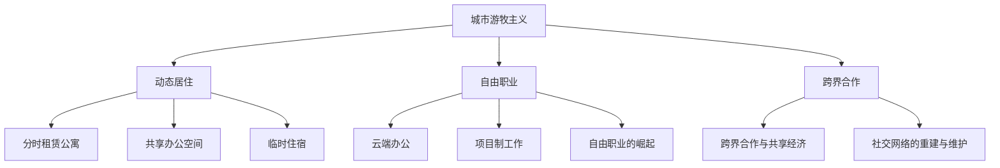

### 2. 动态工作与工作方式的转变 Mermaid 流程图

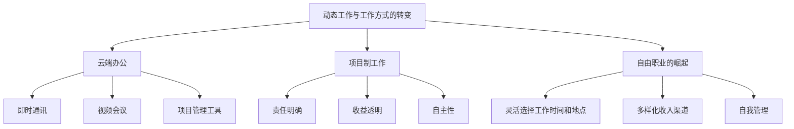

### 3. 社交网络的重建与维护 Mermaid 流程图

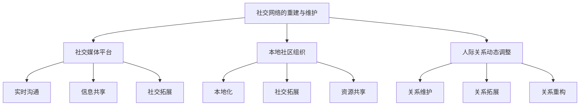

### 4. 跨界合作与共享经济 Mermaid 流程图

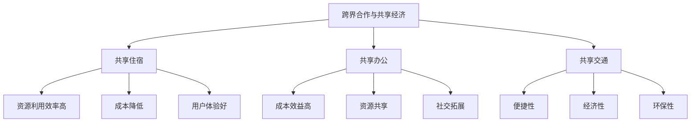

### 5. 自由职业者的崛起 Mermaid 流程图

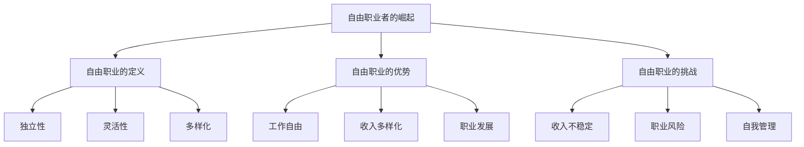

### 6. 社区生态的构建 Mermaid 流程图

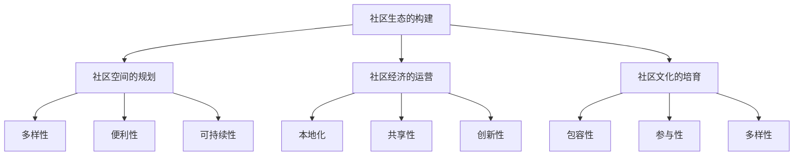

### 7. 城市游牧主义的社会影响 Mermaid 流程图

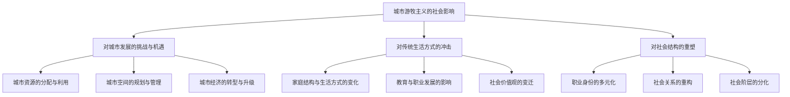

### 8. 城市游牧主义的技术支撑 Mermaid 流程图

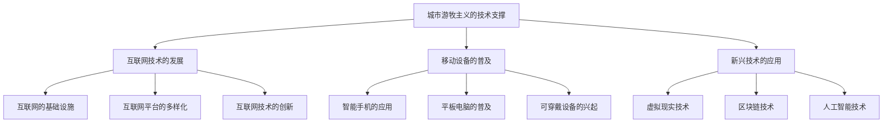

### 9. 城市游牧主义的成功案例 Mermaid 流程图

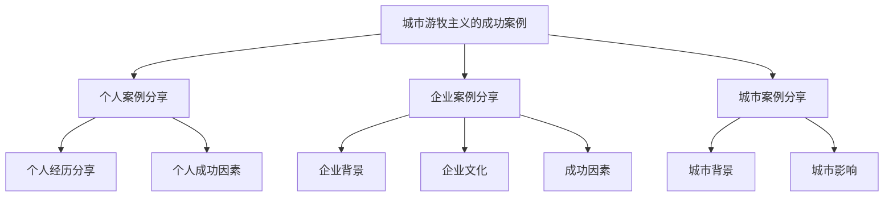

### 10. 城市游牧主义的未来趋势 Mermaid 流程图

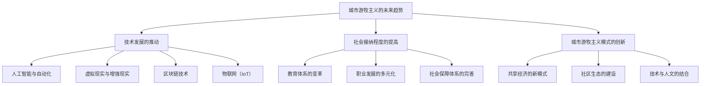

### 11. 城市游牧主义的价值与局限 Mermaid 流程图

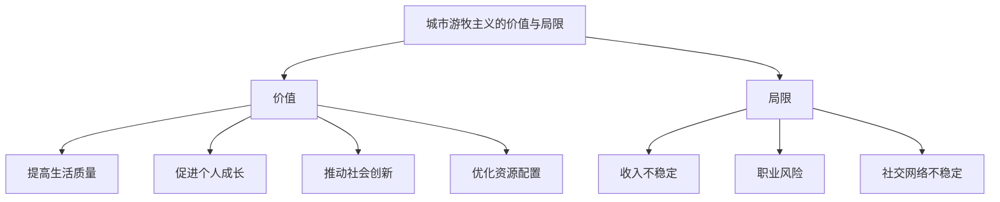

### 12. 对城市发展的启示 Mermaid 流程图

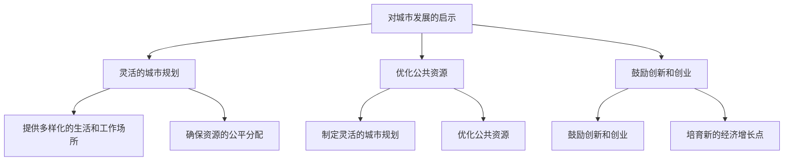

### 13. 对个人的启示 Mermaid 流程图

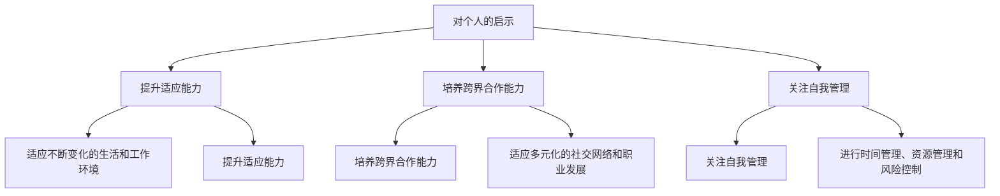

## 总结

本文详细探讨了城市游牧主义的起源、特征、生活模式、经济模式、社会影响和技术支撑。通过对城市游牧主义的深入分析，本文揭示了这一现象对个人、城市和社会的深远影响。同时，通过成功案例的分享和未来趋势的展望，本文为读者呈现了城市游牧主义的多维面貌。城市游牧主义作为一种现代生活方式，既具有显著的价值，也存在一定的局限。对于城市发展，城市游牧主义提供了新的机遇和挑战；对于个人，城市游牧主义则带来了新的机遇和挑战。未来，随着技术的不断进步和社会的不断发展，城市游牧主义将呈现出更加多样化的趋势，为我们的生活和社会带来更多变革。作者：AI天才研究院/AI Genius Institute & 禅与计算机程序设计艺术 /Zen And The Art of Computer Programming

