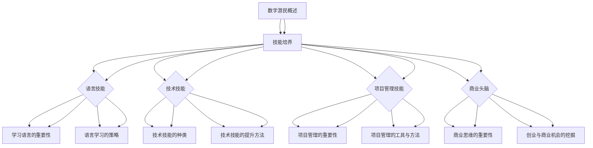

                 

### 文章标题

《城市游牧生存指南：数字游民的实用技巧》

### 关键词

- 数字游民
- 城市游牧
- 远程工作
- 技能培养
- 生活规划
- 职业发展

### 摘要

本文旨在为数字游民提供一份全面的城市游牧生存指南。文章首先介绍了数字游民的定义、背景和生活方式，探讨了其优势与挑战。接着，文章详细分析了数字游民所需培养的技能，包括语言、技术、项目管理和商业头脑。随后，文章提出了数字游民的生活规划策略，包括工作空间选择、时间管理、财务规划和健康管理。文章还探讨了数字游民的旅行攻略和社群交流，以及职业发展路径和成功案例。最后，文章展望了数字游民的未来发展趋势，并提出了可持续发展的建议。

## 城市游牧生存指南：数字游民的实用技巧

在当今这个数字化时代，远程工作和数字游民的生活方式逐渐成为可能。越来越多的人选择不再受限于地理空间，而是通过互联网在全球范围内寻找工作机会和生活方式的平衡点。城市游牧生存指南，旨在帮助这些数字游民更好地适应并享受这种新型生活方式。本文将围绕数字游民的实用技巧展开，分为以下几个主要部分：

1. **数字游民概述**：介绍数字游民的定义、背景及其与传统游牧者的区别。
2. **数字游民技能培养**：分析数字游民需要培养的关键技能，包括语言、技术、项目管理和商业头脑。
3. **数字游民生活规划**：探讨数字游民如何规划工作空间、时间管理、财务规划和健康管理。
4. **数字游民旅行攻略**：分享旅行中需要注意的事项，以及如何选择目的地和准备旅行。
5. **数字游民社群与交流**：介绍数字游民社群的意义和加入方式，以及参与线上和线下活动的建议。
6. **数字游民职业发展**：分析数字游民的适合职业类型、自我营销策略和职业规划。
7. **数字游民成功案例分析**：探讨数字游民成功的关键要素及其面临的挑战和应对策略。
8. **数字游民的未来展望**：展望数字游民的发展趋势，探讨其对社会和经济的影响以及可持续发展路径。

通过这些内容，我们希望能够为数字游民提供实用的指导，帮助他们更好地实现城市游牧生活。

## 第1章：数字游民概述

### 1.1 数字游民的定义与背景

数字游民（Digital Nomad）一词源于“数字”（Digital）和“游牧”（Nomad）的组合，指的是那些通过互联网在全球范围内工作，不受传统办公地点限制的人群。他们通常通过远程办公、自由职业或自由职业者联盟等方式实现工作和生活的灵活性。

数字游民的生活方式起源于20世纪90年代互联网的兴起。随着宽带网络的普及和移动设备的进步，人们开始能够方便地进行远程工作。特别是2008年全球金融危机之后，远程工作和远程团队协作工具如雨后春笋般涌现，使得数字游民的生活方式变得更加可行和普及。

数字游民与传统游牧者的区别主要在于，传统游牧者通常依赖于自然资源进行生存，如游牧民族通过牧牛、放羊等方式生活；而数字游民则依靠数字化技能和互联网连接，通过远程工作赚取收入。传统游牧者可能一年四季都生活在野外，而数字游民则可能在一个城市停留数月，甚至更长时间，然后迁移到另一个城市或国家。

### 1.2 数字游民的兴起与发展

数字游民的兴起离不开几个关键因素：

1. **技术进步**：互联网的普及和移动设备的不断升级，使得远程办公变得更加方便和高效。例如，云计算技术使得个人和企业能够随时随地访问数据和应用程序。

2. **远程工作趋势**：越来越多的公司开始采用远程工作模式，这为数字游民提供了更多的就业机会。许多企业发现，远程工作不仅提高了员工的工作效率，还降低了办公场所的运营成本。

3. **全球化的推动**：全球化使得国际旅行变得更加容易和频繁。人们可以更加轻松地访问其他国家和地区，享受不同的文化、气候和生活方式。

4. **创业精神的兴起**：自由职业和创业机会的增加，使得更多人有机会成为数字游民。他们通过自主创业或加入自由职业平台，实现经济独立和职业自由。

### 1.3 数字游民的生活方式

数字游民的生活状态可以描述为“工作生活一体化”。他们在全球范围内的不同城市和国家居住，通常在一个地方工作几天或几周，然后搬迁到另一个地方。这种生活方式有以下特点：

1. **灵活性**：数字游民可以根据自己的兴趣、工作需求和预算自由选择居住地，享受不同的文化和生活体验。

2. **工作与生活的平衡**：由于工作和生活空间的高度融合，数字游民需要特别注重时间管理和工作效率，以确保工作和生活的平衡。

3. **社交互动**：数字游民通常通过网络和社群保持联系，他们可以通过线上会议、社交媒体和线下的聚会与来自世界各地的同事和同行交流。

4. **经济成本**：数字游民的生活成本可能会因居住地的不同而有所差异，但通常他们在选择居住地时，会考虑成本效益，以实现最大的经济回报。

### 1.4 数字游民的优势与挑战

#### 1.4.1 优势

1. **工作灵活性**：数字游民可以根据自己的时间表工作，享受更大的自由度。

2. **生活多样化**：他们有机会探索不同的文化、环境和生活方式。

3. **全球视野**：数字游民能够接触到不同国家和地区的人和事，拓宽视野。

4. **职业发展**：远程工作和自由职业为数字游民提供了更多的职业发展机会。

#### 1.4.2 挑战

1. **时间管理**：由于工作与生活的界限模糊，数字游民需要特别注重时间管理，以避免工作侵占生活时间。

2. **社交孤立**：长期的远程工作和独居生活可能会导致社交孤立感。

3. **生活成本波动**：在不同城市和国家生活，生活成本可能会波动，需要良好的财务管理能力。

4. **文化适应**：适应新的文化环境和生活方式可能需要时间和努力。

综上所述，数字游民的生活方式虽然充满魅力和机遇，但也需要面对一定的挑战。通过有效的技能培养和生活规划，数字游民可以更好地实现工作与生活的平衡，享受这种独特的生活方式。

### 1.5 小结

数字游民作为一种新兴的生活方式，通过互联网技术和全球化趋势，实现了工作与生活的灵活性和多样性。了解数字游民的定义、背景、生活方式和面临的挑战，是踏上数字游民之旅的第一步。在接下来的章节中，我们将深入探讨数字游民所需培养的技能和生活规划策略，帮助您更好地适应并享受这种生活方式。

## 第2章：数字游民技能培养

成为成功的数字游民，不仅需要灵活的工作和生活态度，还需要具备一系列关键技能。这些技能将帮助数字游民在各种环境中保持高效、持续地工作，并提升职业竞争力。以下是数字游民需要培养的几项重要技能：

### 2.1 语言技能

#### 2.1.1 学习语言的重要性

对于数字游民来说，掌握一门或多门外语尤为重要。首先，语言技能可以拓宽职业机会。许多国际项目和自由职业工作需要良好的语言沟通能力，特别是在跨国团队协作和远程工作中。此外，良好的语言能力有助于数字游民更好地融入当地社区，体验不同的文化，提升生活质量。

#### 2.1.2 语言学习的策略

1. **目标明确**：确定自己学习语言的目的，是用于工作、旅行还是生活交流。

2. **持续学习**：利用日常碎片时间进行语言学习，如听外语广播、看外语视频和阅读外语文章。

3. **实践应用**：尝试与外国朋友进行语言交流，参加线上或线下的语言学习小组，提高实际应用能力。

4. **技术工具**：利用在线语言学习平台和应用程序，如Duolingo、Rosetta Stone和HelloTalk，提高学习效果。

5. **沉浸式学习**：如果可能，选择到语言环境中居住一段时间，如参加语言交换项目或实习。

### 2.2 技术技能

#### 2.2.1 技术技能的种类

数字游民需要掌握多种技术技能，以适应不同的工作需求。以下是一些常见的技术技能：

1. **编程技能**：编程是数字游民的核心技能之一。熟练掌握至少一种编程语言，如Python、JavaScript或Ruby，可以帮助游民在自由职业市场中获得更多机会。

2. **远程协作工具**：掌握常用的远程协作工具，如Slack、Trello、GitHub和Zoom，是数字游民必备的技能。这些工具能帮助团队高效沟通和协作。

3. **项目管理**：良好的项目管理技能有助于数字游民有效地管理自己的项目和团队，确保按时完成任务。

4. **数据分析和处理**：数据分析技能在许多行业都非常受欢迎，掌握数据分析和处理工具，如Excel、SQL和Python中的Pandas库，将大大提高工作效率。

5. **网络安全**：由于大部分工作都是在线进行的，数字游民需要具备网络安全意识，以保护个人数据和隐私。

#### 2.2.2 技术技能的提升方法

1. **在线课程**：参加在线编程课程和认证项目，如Coursera、edX和Udemy，系统地提升技术技能。

2. **实践项目**：通过参与开源项目、个人项目和自由职业工作，将所学技能应用到实际场景中。

3. **交流社群**：加入技术社群和论坛，与其他开发者交流经验，分享学习资源。

4. **工具学习**：熟悉并掌握多种技术工具，提高工作效率。

### 2.3 项目管理技能

#### 2.3.1 项目管理的重要性

对于数字游民来说，项目管理技能至关重要。有效的项目管理不仅能够帮助游民更好地安排和跟踪工作进度，还能提升工作效率和客户满意度。以下是一些项目管理的重要方面：

1. **目标设定**：明确项目目标，确保项目朝着正确的方向前进。

2. **任务分解**：将大项目分解为小任务，便于管理和追踪进度。

3. **时间规划**：合理分配时间，确保每个任务都能按时完成。

4. **资源管理**：有效利用可用资源，如人力资源、技术工具和时间。

5. **风险管理**：识别潜在风险，制定应对策略，降低项目失败的可能性。

#### 2.3.2 项目管理的工具与方法

1. **项目管理工具**：使用Trello、Asana、Jira等项目管理工具，便于团队协作和任务追踪。

2. **敏捷方法**：采用敏捷开发方法，如Scrum或Kanban，灵活应对项目变化。

3. **定期回顾**：定期回顾项目进展，识别问题并调整策略。

4. **沟通与协作**：确保团队成员之间的沟通畅通，提高项目效率。

### 2.4 商业头脑

#### 2.4.1 商业思维的重要性

商业头脑对于数字游民的成功至关重要。良好的商业思维可以帮助游民识别和抓住商业机会，制定有效的营销策略，提升个人品牌价值。以下是一些关键点：

1. **市场洞察**：了解目标市场的需求和趋势，制定有针对性的商业策略。

2. **财务规划**：合理规划个人和项目财务，确保经济稳健。

3. **品牌建设**：通过社交媒体、个人网站和在线平台，建立和提升个人品牌。

4. **营销策略**：掌握数字营销工具和方法，如SEO、SEM和社交媒体营销。

5. **风险评估**：在商业决策过程中，进行风险评估，降低潜在风险。

#### 2.4.2 创业与商业机会的挖掘

1. **市场调研**：通过市场调研，了解潜在客户的需求和痛点。

2. **创新思维**：培养创新思维，寻找独特的解决方案和商业模式。

3. **合作伙伴关系**：建立和维护良好的合作伙伴关系，共同开发和推广产品或服务。

4. **网络拓展**：通过参加行业会议、社群活动和在线论坛，拓展人脉网络。

综上所述，数字游民需要不断学习和提升多方面的技能，以应对不断变化的工作和生活环境。通过掌握语言技能、技术技能、项目管理技能和商业头脑，数字游民可以更好地实现职业目标，享受自由、多样化的生活。

### 2.5 小结

数字游民的技能培养是成功实现城市游牧生活的基础。掌握语言技能、技术技能、项目管理技能和商业头脑，不仅能够提升职业竞争力，还能帮助数字游民更好地适应全球化和远程工作趋势。通过不断学习和实践，数字游民可以在全球范围内实现工作与生活的完美平衡。

## 第3章：数字游民生活规划

成功的数字游民不仅需要具备出色的技能，还需要精心的生活规划。有效的规划可以帮助他们更好地管理时间和资源，确保工作与生活的平衡，同时保持高效和满足感。以下是数字游民生活规划的重要方面：

### 3.1 工作空间选择

#### 3.1.1 家庭办公

家庭办公是许多数字游民的常见选择。它具有灵活性高、成本低的优点，但同时也带来一定的挑战。以下是一些家庭办公的优缺点：

**优点**：
1. **灵活性**：可以根据自己的时间和需求灵活安排工作。
2. **成本低**：无需支付额外的租金或通勤费用。
3. **舒适度高**：可以创造一个适合自己的工作环境。

**缺点**：
1. **干扰多**：家庭环境中可能存在家人、宠物等干扰因素。
2. **界限模糊**：工作与生活界限不清晰，可能导致工作侵占个人时间。

**建议**：
1. **设立独立工作区**：将工作区域与生活区域明确划分，避免干扰。
2. **制定工作计划**：制定详细的工作计划和时间表，提高工作效率。
3. **使用时间管理工具**：利用Trello、Asana等工具帮助跟踪和管理任务。

#### 3.1.2 公共空间

公共空间如咖啡馆、图书馆和共享工作空间，为数字游民提供了另一个选择。以下是一些公共空间的优缺点：

**优点**：
1. **社交机会**：可以结识新朋友，扩展社交网络。
2. **环境多样**：不同空间提供不同的工作氛围，有助于激发创造力。
3. **激励因素**：与他人共同工作，可以增加动力和责任感。

**缺点**：
1. **成本较高**：可能需要支付租金或会员费。
2. **隐私问题**：公共空间可能缺乏隐私，不适合敏感工作。
3. **依赖网络**：需要稳定的Wi-Fi连接。

**建议**：
1. **选择合适的公共空间**：根据工作需求和个人喜好，选择最适合自己的公共空间。
2. **充分利用免费资源**：如公共图书馆和免费的共享工作空间。
3. **备好移动设备**：确保有便携的笔记本电脑或其他设备，以便在任何地方都能工作。

### 3.2 时间管理

#### 3.2.1 时间管理的重要性

时间管理是数字游民成功的关键因素之一。由于工作和生活高度融合，数字游民需要特别注重时间管理，以避免工作侵占生活时间，保持高效和满足感。以下是一些时间管理的技巧：

**技巧**：
1. **设定明确目标**：明确自己的工作目标和生活目标，确保时间投入有明确的方向。
2. **优先级排序**：根据任务的重要性和紧急程度，对任务进行优先级排序，确保优先处理重要任务。
3. **每日规划**：制定每日的工作计划，包括具体的任务和时间安排，避免时间浪费。
4. **使用时间管理工具**：利用Trello、Asana、Google Calendar等工具帮助跟踪和管理任务。
5. **定期回顾**：定期回顾时间使用情况，调整计划，提高效率。

### 3.2.2 时间管理的技巧

**技巧**：
1. **番茄工作法**：将工作时间分为25分钟的工作周期，每个周期后休息5分钟。这种方法有助于保持专注，提高工作效率。
2. **避免多任务处理**：专注于一项任务，直到完成，避免同时处理多个任务，以提高效率。
3. **设定工作时间**：为工作设定固定的时间，例如早上9点到下午5点，以帮助建立工作习惯。
4. **学会说“不”**：合理拒绝不必要的任务和邀请，确保自己的时间和精力专注于重要的事务。

### 3.3 财务规划

#### 3.3.1 收入来源

对于数字游民来说，稳定的收入来源是维持生活质量和实现目标的关键。以下是一些常见的收入来源：

1. **自由职业**：通过自由职业平台（如Upwork、Freelancer）接受短期或长期项目。
2. **远程工作**：加入远程工作团队，成为公司的一名远程员工。
3. **创业**：创立自己的公司或启动个人项目。
4. **投资**：利用互联网进行投资，如股票、加密货币或房地产。
5. **教育和培训**：通过在线课程或培训项目传授知识和技能。

#### 3.3.2 预算与储蓄

**预算与储蓄**是财务规划的重要方面。以下是一些策略：

1. **制定预算**：制定详细的家庭预算，包括日常开支、储蓄和投资计划。
2. **收入多元化**：确保收入来源多样化，减少对单一收入来源的依赖。
3. **定期储蓄**：每月设定储蓄目标，确保有足够的应急资金和长期储蓄。
4. **投资未来**：将一部分收入用于投资，以实现财务增长。
5. **监控支出**：定期检查支出记录，确保在预算范围内消费。

### 3.4 健康管理

#### 3.4.1 身体健康

保持身体健康是数字游民生活规划的重要部分。以下是一些建议：

1. **定期锻炼**：每天安排一定时间进行锻炼，如跑步、游泳或健身房训练。
2. **健康饮食**：保持均衡的饮食，多吃蔬菜、水果和全谷物，减少高糖、高脂肪食物的摄入。
3. **充足睡眠**：保持充足的睡眠时间，确保身体和大脑得到充分休息。
4. **心理健康**：定期进行心理健康检查，学习应对压力和孤独感的策略。

#### 3.4.2 心理健康

心理健康是数字游民面临的另一个重要挑战。以下是一些建议：

1. **建立社交网络**：通过线上和线下活动，建立和维护社交关系。
2. **学会放松**：定期进行冥想、瑜伽或其他放松活动，减轻压力。
3. **心理咨询**：如果感到情绪低落或孤独，寻求专业的心理咨询帮助。
4. **定期旅行**：旅行可以带来新的体验和视角，有助于提升心理健康。

### 3.5 小结

数字游民的生活规划是成功实现游牧生活方式的关键。通过选择合适的工作空间、有效的时间管理、合理的财务规划和注重健康管理，数字游民可以更好地适应这种生活方式，实现工作与生活的平衡。在接下来的章节中，我们将探讨数字游民的旅行攻略和社群交流，帮助您进一步提升生活质量。

## 第4章：数字游民旅行攻略

对于数字游民来说，旅行不仅仅是放松和探索的机会，更是生活的一部分。通过旅行，他们可以体验到不同的文化和生活方式，拓展视野，同时为工作提供新的灵感。以下是一些旅行攻略，帮助数字游民在旅行中更好地安排和享受旅程。

### 4.1 目的地选择

#### 4.1.1 选择目的地的考虑因素

在选择旅行目的地时，数字游民需要考虑多个因素，以确保旅行既有趣又实用。以下是一些关键考虑因素：

1. **生活成本**：不同地区的房价、餐饮、交通和日常开销都有很大差异。选择生活成本较低的地区，可以帮助数字游民更好地控制预算。

2. **工作环境**：考虑当地的互联网连接速度、公共空间和工作场所的选择，以确保工作不受干扰。

3. **文化体验**：选择具有独特文化和历史背景的目的地，可以带来丰富的生活体验。

4. **天气条件**：选择适宜的天气条件，避免极端气候影响工作和生活。

5. **语言环境**：如果英语不是主要语言，选择一个英语普及率较高的目的地，有助于更好地融入当地社会。

6. **旅行预算**：根据个人预算，合理安排旅行计划，确保在预算范围内实现旅行目标。

#### 4.1.2 不同地区的生活成本比较

以下是一些常见目的地的平均生活成本：

- **东南亚**：如泰国、越南和菲律宾，生活成本相对较低，适合预算有限的数字游民。
- **欧洲**：如捷克、匈牙利和波兰，生活成本适中，文化氛围浓厚，适合寻求文化体验的数字游民。
- **南美**：如阿根廷、巴西和哥伦比亚，生活成本较低，自然风光优美，适合喜欢户外探险的数字游民。
- **北美**：如加拿大和美国，生活成本较高，但提供丰富的职业机会和文化活动。

### 4.2 旅行准备

#### 4.2.1 行李打包

行李打包是旅行准备的重要环节。以下是一些打包建议：

1. **轻装上阵**：尽量减少行李重量，携带轻便但实用的物品。
2. **多功能衣物**：选择适合多种场合的衣物，如轻便的外套、多功能的运动鞋和可以变装的衣物。
3. **急救包**：携带常用的药品、创可贴、消毒剂等急救用品。
4. **便携式设备**：确保携带笔记本电脑、移动电源、充电器和其他必要的电子设备。
5. **旅行文件**：包括护照、签证、身份证、机票和保险文件，确保随身携带。

#### 4.2.2 签证与入境手续

不同国家的签证政策各不相同，数字游民在旅行前需要了解并准备相应的签证和入境手续。以下是一些建议：

1. **提前查询**：访问各国大使馆或领事馆的官方网站，了解签证要求和办理流程。
2. **准备材料**：确保准备好所有必要的文件，如护照、签证申请表、照片、工作证明等。
3. **了解入境政策**：了解目的国的入境政策，包括核酸检测、健康证明和隔离要求。
4. **购买旅行保险**：购买涵盖旅行期间可能发生的意外和医疗支出的旅行保险。

### 4.3 旅行中注意事项

#### 4.3.1 安全防范

旅行中安全至关重要。以下是一些安全防范建议：

1. **保持警惕**：注意周围环境，避免随意透露个人信息。
2. **贵重物品保管**：将贵重物品存放在酒店保险箱中，避免随身携带大量现金和珠宝。
3. **使用公共Wi-Fi时注意安全**：避免在公共Wi-Fi环境下进行敏感交易，使用VPN保护网络安全。
4. **了解紧急联系方式**：保存当地紧急联系电话，如警察局、医院和领事馆。

#### 4.3.2 文明礼仪

文明礼仪不仅有助于提升个人形象，还能促进与当地人的友好交往。以下是一些建议：

1. **尊重当地文化**：了解并尊重当地的风俗习惯和宗教信仰。
2. **礼貌待人**：使用礼貌用语，如“请”和“谢谢”，展现良好的礼貌习惯。
3. **环保意识**：在旅行中注意保护环境，避免随意丢弃垃圾，尽量减少对自然环境的破坏。
4. **遵守当地法律**：了解并遵守目的国的法律法规，避免违法行为。

### 4.4 小结

旅行是数字游民生活的重要组成部分，通过精心选择目的地、做好旅行准备和注意旅行中的安全与礼仪，数字游民可以更好地享受旅行的乐趣，同时保持工作和生活的平衡。在旅行中，他们不仅可以拓展视野，还能为未来的生活和工作积累宝贵的经验和资源。在下一章节中，我们将探讨数字游民社群与交流的重要性。

## 第5章：数字游民社群与交流

在数字游民的生活方式中，社群和交流扮演着至关重要的角色。通过加入合适的社群和积极参与交流，数字游民不仅能够拓展人脉、获取资源，还能获得情感支持和职业发展的机会。

### 5.1 数字游民社群的意义

数字游民社群是一个由志同道合的人组成的网络，他们共享相似的价值观和生活方式。以下是一些社群对数字游民的重要意义：

#### 5.1.1 社群的互助与支持

数字游民常常面临孤独感和不确定性，加入社群可以提供情感上的支持和实际帮助。社群成员可以分享生活经验和解决方案，帮助解决工作和生活中的难题。例如，在寻找住宿、了解当地法律和文化、处理突发情况时，社群成员的互助可以大大减轻个人的压力。

#### 5.1.2 社群的学习与成长

社群提供了一个学习和成长的环境。通过参与社群活动、听取专家讲座和工作坊，数字游民可以不断更新知识和技能，提升个人能力。社群还提供了展示才华和获取反馈的机会，帮助数字游民更好地发展自己的职业。

#### 5.1.3 社群的资源共享

数字游民社群可以共享资源，如住宿信息、工作机会和旅行指南。这种资源共享不仅降低了生活成本，还提高了工作效率。例如，一些社群会提供廉价的住宿选项或推荐可靠的服务提供商，这些信息对数字游民来说非常宝贵。

### 5.2 加入数字游民社群

数字游民社群种类繁多，以下是一些常见的社群类型和加入途径：

#### 5.2.1 社群的类型

1. **线上社群**：如Facebook群组、LinkedIn群组和Reddit论坛。这些平台上的社群覆盖了各种主题和地区，便于数字游民找到与自己兴趣相投的群体。
   
2. **线下社群**：如城市游牧者聚会（Digital Nomads Meetup）和远程工作研讨会。这些活动通常在咖啡馆、共享工作空间和城市公园等地举行，为数字游民提供了面对面交流的机会。

3. **专业社群**：如远程工作协会（Remote Work Association）和自由职业者联盟（Freelancers Union）。这些社群专注于特定行业或领域，为成员提供了专业发展和职业拓展的平台。

#### 5.2.2 加入社群的途径

1. **社交媒体**：通过Facebook、LinkedIn和Twitter等社交媒体平台搜索和加入相关社群。
   
2. **在线论坛**：访问Reddit、Quora和Stack Overflow等在线论坛，加入讨论和提问。

3. **专业组织**：加入远程工作协会、自由职业者联盟等专业组织，获取更专业的资源和机会。

4. **线下活动**：参加数字游牧者聚会和远程工作研讨会，结识新朋友，拓展人脉。

### 5.3 数字游民交流活动

数字游民交流活动包括线上和线下两种形式，以下是一些常见的活动：

#### 5.3.1 线上活动

1. **网络研讨会**：通过Zoom、Microsoft Teams等平台，专家和行业领导者分享经验和最佳实践。

2. **在线论坛**：如LinkedIn的远程工作群组和Reddit的Digital Nomads论坛，提供实时交流和讨论。

3. **虚拟咖啡会**：通过Zoom或Google Meet等工具，社群成员进行一对一或小团体的虚拟交流。

#### 5.3.2 线下活动

1. **城市游牧者聚会**：定期在咖啡馆、公园和共享工作空间举行，成员可以交流经验、分享资源和拓展人脉。

2. **远程工作研讨会**：集中讨论远程工作的话题，如时间管理、团队合作和技术工具使用。

3. **社交活动**：如户外运动、聚餐和旅游活动，帮助数字游民放松身心，建立深厚的友谊。

### 5.4 小结

数字游民社群和交流是他们成功的关键因素之一。通过加入合适的社群和积极参与交流，数字游民可以获得情感支持、专业资源和职业发展的机会。在社群中，他们不仅能够学习和成长，还能拓展人脉，为未来的工作和生活打下坚实的基础。

## 第6章：数字游民职业发展

数字游民的职业生涯与传统职场有显著不同，他们通常依靠远程工作和自由职业来维持生活。这种职业模式为他们提供了更多的灵活性和自主权，但也带来了独特的挑战。在这一章节中，我们将探讨数字游民适合的职业类型、自我营销策略以及职业规划的重要性。

### 6.1 职业选择

对于数字游民来说，选择适合的职业类型至关重要。以下是一些适合数字游民的职业类型及其特点：

#### 6.1.1 自由职业者

自由职业者是数字游民最常见的职业类型之一。自由职业者包括编程人员、设计师、作家、市场营销专家等。自由职业者通常通过在线平台接受项目，自主安排工作时间和地点，具有很高的灵活性和独立性。

**优点**：
- **工作灵活性**：可以根据个人兴趣和需求选择项目和工作时间。
- **自主决策**：可以自主选择客户和项目，控制职业发展方向。

**缺点**：
- **收入波动**：项目收入可能不稳定，需要良好的财务管理能力。
- **自我驱动**：需要较高的自律性和自我管理能力。

#### 6.1.2 远程员工

远程员工是传统公司中的远程工作者，他们通常通过远程协作工具与团队保持联系。远程员工可以是程序员、项目经理、设计师、客户支持专家等。

**优点**：
- **稳定收入**：通常有稳定的工资和福利待遇。
- **职业安全感**：作为公司的一部分，职业安全感相对较高。

**缺点**：
- **工作压力**：需要遵守公司规定和项目进度，可能会带来一定的压力。
- **工作边界不清晰**：由于工作和生活界限模糊，可能需要更好地管理时间。

#### 6.1.3 创业者

创业者是那些拥有自己的公司或项目的人。创业者通常需要具备较强的商业头脑、市场洞察力和项目管理能力。

**优点**：
- **自主控制**：可以完全掌控自己的业务方向和生活方式。
- **商业机会**：有机会创造新的产品或服务，实现财务自由。

**缺点**：
- **高风险**：创业失败的可能性较高，需要承担较高的风险。
- **时间投入**：需要投入大量时间和精力，可能会牺牲个人生活和休闲时间。

### 6.2 自我营销

在数字游民的职业生涯中，自我营销至关重要。以下是一些有效的自我营销策略：

#### 6.2.1 个人品牌的打造

1. **专业网站**：建立自己的个人网站，展示专业技能、作品集和客户评价。
2. **社交媒体**：利用LinkedIn、Twitter、Instagram等平台展示个人形象和专业能力。
3. **内容创作**：撰写博客文章、发布视频和播客，分享专业知识和经验。

#### 6.2.2 网络营销

1. **搜索引擎优化（SEO）**：通过优化网站内容和社交媒体帖子，提高在搜索引擎中的排名。
2. **社交媒体广告**：利用Facebook、Google Ads等平台进行精准营销。
3. **合作伙伴关系**：与其他品牌或个人合作，扩大影响力。

#### 6.2.3 网络推广

1. **参与社群**：加入相关社群和论坛，积极参与讨论，提升个人知名度。
2. **线下活动**：参加行业会议、研讨会和社交活动，结识潜在客户和合作伙伴。
3. **口碑营销**：通过提供高质量的服务和作品，赢得客户的推荐和好评。

### 6.3 职业规划

职业规划对于数字游民的成功至关重要。以下是一些职业规划的建议：

#### 6.3.1 职业目标的设定

1. **短期目标**：设定1-2年内可以实现的目标，如增加客户数量、提升收入等。
2. **长期目标**：设定3-5年内可以实现的目标，如成为某一领域的专家、创业等。

#### 6.3.2 职业发展的路径

1. **技能提升**：持续学习新技能，提升自己的竞争力。
2. **市场调研**：了解市场需求和趋势，调整职业发展方向。
3. **拓展人脉**：通过参加活动、参与社群和合作，扩大人脉网络。

#### 6.3.3 职业发展路径

1. **自由职业者** -> **独立顾问** -> **专家**：逐步提升专业水平，成为某一领域的专家。
2. **远程员工** -> **项目经理** -> **团队领导**：通过积累经验，逐步晋升为团队领导。
3. **创业者** -> **公司CEO** -> **行业领袖**：通过创业和管理公司，成为行业领导者。

### 6.4 小结

数字游民的职业发展需要灵活的策略和持续的努力。通过选择适合自己的职业类型、有效的自我营销和精心的职业规划，数字游民可以在全球范围内实现职业目标，享受自由、多样化的生活。在职业发展的过程中，持续学习和不断提升自身能力是至关重要的。

## 第7章：数字游民成功案例分析

数字游民的成功故事为这一生活方式提供了现实的榜样和启示。以下我们将分析几位成功数字游民的案例，探讨他们成功的关键要素以及面临的挑战和应对策略。

### 7.1 数字游民的成功要素

#### 案例1：Alexandra Wallace

**背景**：Alexandra Wallace是一位数字游民作家，她在25岁时辞去了传统的工作，成为了一名全职作家和旅行者。

**成功要素**：
1. **自我驱动和自律**：Alexandra通过设定严格的工作计划和目标，保持了高效的工作状态。她每天早上6点起床，进行两个小时的写作。
2. **技能多样化**：她不仅擅长写作，还掌握了多种编辑工具和社交媒体营销技能，这使她能够在自由职业市场中保持竞争力。
3. **财务管理**：Alexandra通过合理安排预算和储蓄，确保了经济上的稳定性。她每个月都会设立储蓄目标，并严格遵循。

**挑战和应对策略**：
- **孤独感**：为了克服孤独感，Alexandra定期参加线上和线下的聚会，加入了多个数字游民社群。
- **时间管理**：通过使用时间管理工具，如Trello和Google Calendar，Alexandra确保自己的时间得到有效利用。

#### 案例2：David Heinemeier Hansson

**背景**：David Heinemeier Hansson是Basecamp的联合创始人，他通过远程工作模式实现了全球范围内的职业成功。

**成功要素**：
1. **创新思维**：David在开发Basecamp过程中，提出了“敏捷开发”的理念，这一方法在全球范围内得到了广泛应用。
2. **品牌建设**：通过在博客和社交媒体上分享Basecamp的开发过程和理念，David成功建立了个人和公司品牌。
3. **团队合作**：David重视团队协作，通过远程协作工具和定期会议，保持了团队的紧密联系。

**挑战和应对策略**：
- **文化差异**：由于团队成员来自不同国家，David通过制定明确的沟通规则和团队文化，确保了团队的凝聚力。
- **技术依赖**：为了降低技术风险，David不断投资于技术基础设施，确保远程工作的稳定性。

#### 案例3：Erica Douglas

**背景**：Erica Douglas是一名自由职业者，她在多个领域拥有丰富的经验，如编程、UI设计和营销。

**成功要素**：
1. **持续学习**：Erica通过在线课程和自学，不断更新自己的技能，保持了竞争力。
2. **客户关系**：她建立了良好的客户关系，通过提供高质量的服务和及时响应，赢得了客户的信任和好评。
3. **网络拓展**：Erica积极参与行业活动和社群，通过建立人脉网络，获得了更多的工作机会。

**挑战和应对策略**：
- **工作压力**：为了应对工作压力，Erica设置了合理的工作时间，并定期进行放松和休息。
- **项目管理**：通过使用项目管理工具，如Trello和Asana，Erica确保了项目进度的有效跟踪和任务的按时完成。

### 7.2 成功经验的总结

通过以上案例分析，我们可以总结出数字游民成功的关键要素：

1. **自我驱动和自律**：自我驱动和自律是数字游民成功的基础，他们需要具备自我管理和自我激励的能力。
2. **技能多样化**：在数字化时代，技能多样化是数字游民保持竞争力的关键。通过掌握多种技能，他们可以在多个领域找到工作机会。
3. **财务管理**：良好的财务管理能力有助于数字游民确保经济上的稳定和自由。
4. **持续学习**：持续学习是数字游民适应快速变化的工作环境的重要手段。
5. **客户关系**：建立良好的客户关系是自由职业者成功的关键，通过提供高质量的服务和建立信任，他们可以获得更多的机会。
6. **网络拓展**：通过积极参与社群和拓展人脉网络，数字游民可以获取更多的资源和机会。

### 7.3 挑战与应对策略

数字游民在追求成功的过程中，不可避免地会面临各种挑战。以下是一些常见的挑战和相应的应对策略：

1. **孤独感**：为了应对孤独感，数字游民可以通过加入社群、定期参加聚会和活动来建立社交网络。
2. **时间管理**：通过使用时间管理工具和设定明确的工作计划，数字游民可以更好地管理时间，避免工作侵占生活时间。
3. **项目管理**：通过使用项目管理工具和制定详细的任务清单，数字游民可以确保项目的顺利进行。
4. **文化适应**：为了适应不同的文化环境，数字游民可以通过了解当地的文化和风俗，尊重并融入当地社区。
5. **技术依赖**：为了降低技术依赖的风险，数字游民应该投资于稳定的技术基础设施，并备份重要数据。

综上所述，数字游民的成功离不开自我驱动、技能多样化、良好的财务管理、持续学习、客户关系和社交网络。通过应对各种挑战，数字游民可以不断提升自己，实现职业和生活的平衡。

### 7.4 小结

数字游民的成功故事展示了这一生活方式的多样性和可能性。通过借鉴成功案例的经验，数字游民可以更好地规划自己的职业和生活方式，实现工作与生活的平衡。在未来的旅程中，数字游民需要保持自我驱动、不断学习，并灵活应对各种挑战，从而在数字游民的道路上不断前行。

## 附录：数字游民资源指南

### 附录 A：数字游民资源指南

#### A.1 教育资源

**在线课程平台**：
- **Coursera**：提供全球知名大学和机构的在线课程，涵盖计算机科学、商业管理、数据科学等多个领域。
- **Udemy**：提供广泛的专业课程，包括编程、设计、营销等。
- **edX**：由哈佛大学和麻省理工学院创办，提供高质量的免费和付费在线课程。
- **Khan Academy**：提供免费的在线教育资源，涵盖数学、科学等多个学科。

**语言学习平台**：
- **Duolingo**：免费的语言学习应用，适合初学者。
- **Rosetta Stone**：提供系统化的语言学习课程。
- **HelloTalk**：一个语言交换平台，通过与母语者交流学习新语言。

#### A.2 职业资源

**自由职业平台**：
- **Upwork**：全球最大的自由职业者平台之一。
- **Freelancer**：提供广泛的自由职业工作机会。
- **Fiverr**：提供各种创意服务和自由职业项目。

**远程工作机会**：
- **Remote.co**：提供全球远程工作机会。
- **We Work Remotely**：专注于远程工作的职位发布平台。
- **FlexJobs**：提供经过验证的远程和灵活工作机会。

**职业发展工具**：
- **LinkedIn**：建立职业网络，发现职业机会。
- **GitHub**：展示个人项目和技术技能。
- **Behance**：展示创意作品。

#### A.3 旅行资源

**旅行规划工具**：
- **Skyscanner**：比较全球机票价格。
- **Airbnb**：预订住宿。
- **TripAdvisor**：提供旅行评价和预订服务。
- **Hostelworld**：预订青年旅舍。

**旅行保险**：
- **World Nomads**：提供涵盖旅行意外、医疗和紧急救援的旅行保险。
- **Insure My Trip**：提供多种旅行保险选项。

**旅行指南**：
- **Lonely Planet**：提供详细的旅行指南和目的地信息。
- **Rick Steves’ Europe**：提供欧洲旅行的详细指南。

#### A.4 社群资源

**数字游民社群**：
- **Nomad List**：提供适合数字游民居住的城市信息。
- **Digital Nomads Forum**：一个关于数字游民的讨论论坛。
- **Remote Year**：提供一年的远程工作旅行项目。

**专业社群**：
- **Digital Nomads Network**：一个全球性的数字游民社群。
- **We Work Remotely**：不仅提供远程工作机会，还组织相关的活动和社群。

这些资源为数字游民提供了丰富的教育、职业和旅行支持，帮助他们更好地适应数字游民的生活方式，实现工作与生活的平衡。

## 第8章：数字游民的未来展望

数字游民作为一种新兴的生活方式，正日益受到全球范围内的关注和认可。随着互联网技术的不断进步和远程工作模式的普及，数字游民的生存和发展空间也在不断扩大。在这一章节中，我们将探讨数字游民的现状、发展趋势及其对社会和经济的影响，并展望数字游民的未来发展。

### 8.1 数字游民趋势分析

#### 8.1.1 社会影响

数字游民的生活方式对社会带来了深远的影响：

1. **文化交流**：数字游民通过在全球范围内的流动，促进了不同文化之间的交流和融合。他们不仅了解了当地的文化和习俗，还传播了自身的文化和价值观。

2. **社区建设**：数字游民社群的兴起，不仅为个人提供了支持和资源，还促进了社区的建设。通过线上和线下的活动，数字游民能够结识新朋友，建立深厚的社交网络。

3. **生活方式的改变**：数字游民的兴起，推动了人们对工作与生活平衡的追求。越来越多的人开始重新定义工作和生活的关系，追求更加自由和有意义的生活方式。

#### 8.1.2 经济影响

数字游民对经济的影响也是显著的：

1. **劳动力市场的变革**：远程工作模式使得企业能够招聘来自全球的员工，这打破了地域的限制，提高了劳动力的灵活性和多样性。

2. **创业机会的增加**：数字游民的生活方式鼓励了更多的人尝试自主创业。通过互联网，创业者可以轻松地接触到全球市场，实现商业梦想。

3. **经济增长**：数字游民的消费行为也促进了当地经济的发展。他们在旅行和居住地消费，为当地市场带来了新的活力。

### 8.2 数字游民的可持续发展

数字游民的可持续发展需要考虑以下几个方面：

#### 8.2.1 环境影响

1. **节能减排**：数字游民通常使用电子设备进行远程工作，这减少了通勤和办公室的能源消耗。然而，电子设备的废弃和电子垃圾的处理仍是一个挑战。

2. **生态旅游**：数字游民可以通过选择生态旅游目的地，减少对自然环境的破坏，同时支持可持续发展项目。

3. **绿色生活**：数字游民可以采用绿色生活理念，如使用公共交通工具、减少一次性用品的使用，降低碳足迹。

#### 8.2.2 社会责任

1. **社区参与**：数字游民可以积极参与当地社区的活动，支持公益事业，促进社区发展。

2. **文化保护**：数字游民在旅行和居住地，应尊重和保护当地的文化和习俗，避免文化冲突。

3. **知识分享**：数字游民可以通过在线平台分享自己的知识和经验，帮助其他人实现职业发展和生活改善。

### 8.3 数字游民的未来发展

#### 8.3.1 技术进步的推动

随着技术的不断进步，数字游民的生存和发展空间将进一步扩大：

1. **5G技术的普及**：5G技术将提供更快的网络速度和更低的延迟，这将极大地提升远程工作的效率和体验。

2. **人工智能和机器学习**：人工智能和机器学习技术将在数字游民的工作中发挥更大的作用，帮助自动化和优化任务。

3. **虚拟现实和增强现实**：虚拟现实和增强现实技术将使数字游民能够更加真实地体验不同文化和环境，促进文化交流和互动。

#### 8.3.2 政策环境的变迁

政策环境的变化也将对数字游民的未来发展产生重要影响：

1. **远程工作立法**：越来越多的国家和地区开始出台远程工作相关的法律法规，为数字游民提供更加稳定和保障的工作环境。

2. **税收政策**：各国政府可能会调整税收政策，以适应数字游民的生活方式，例如提供税收优惠或简化税务申报程序。

3. **签证政策**：为了吸引数字游民，一些国家可能会放宽签证政策，提供更多的工作和居住机会。

### 8.4 小结

数字游民的未来充满机遇和挑战。随着技术的进步和政策环境的优化，数字游民的生活方式将得到进一步的普及和发展。然而，他们也需要面对可持续发展的挑战，如环境保护和社会责任。通过不断学习和适应，数字游民可以在未来实现更加自由、多样和有意义的生活。

### 总结与展望

数字游民作为一种新型的生活方式，正在全球范围内迅速发展。他们通过互联网和远程工作，实现了工作与生活的平衡，拓展了视野，提升了生活质量。本文从数字游民的定义、技能培养、生活规划、职业发展、旅行攻略、社群交流以及成功案例分析等方面，全面介绍了数字游民的生活方式及其面临的挑战。展望未来，数字游民将继续受到技术进步和政策环境变化的推动，实现更加自由和多样化的生活方式。希望本文能为那些有意成为数字游民的人提供实用的指导和启示。

## Mermaid 流程图

### 作者信息

**作者：**AI天才研究院/AI Genius Institute & 禅与计算机程序设计艺术 /Zen And The Art of Computer Programming

