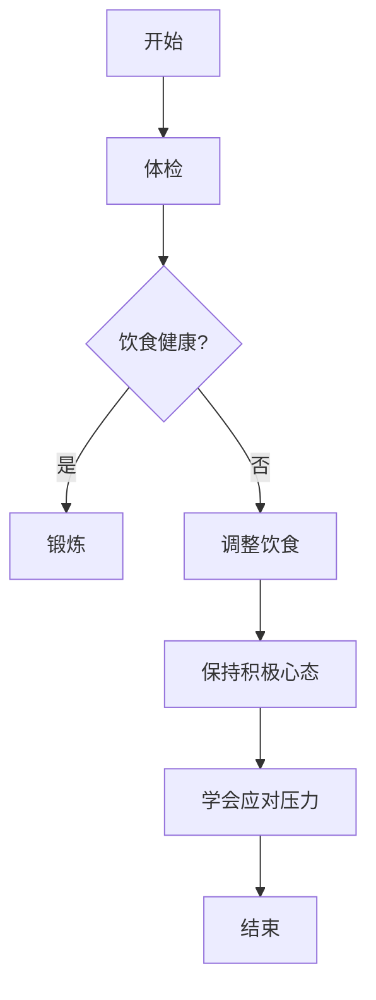
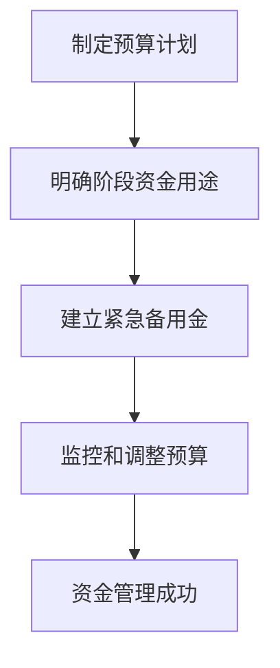
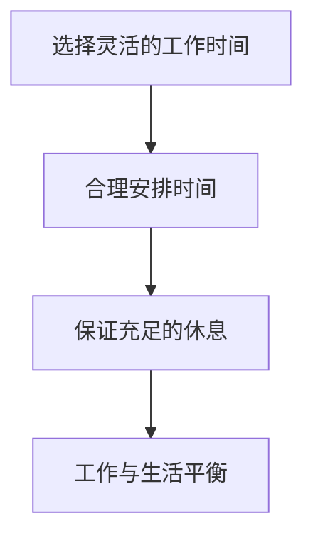
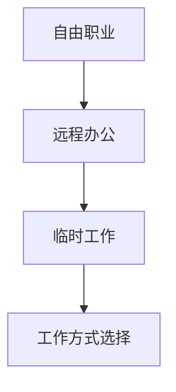
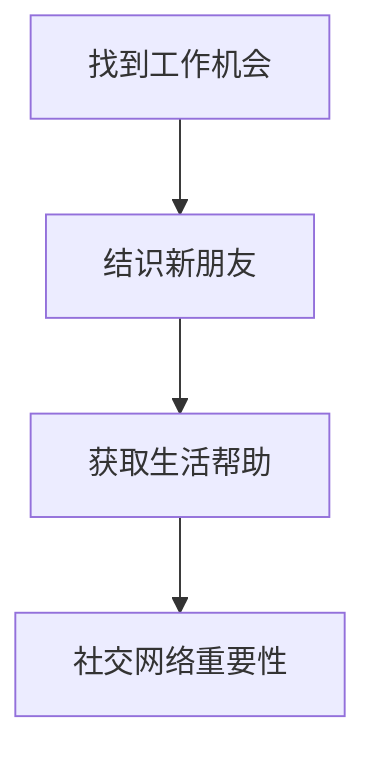
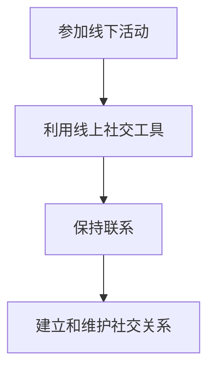
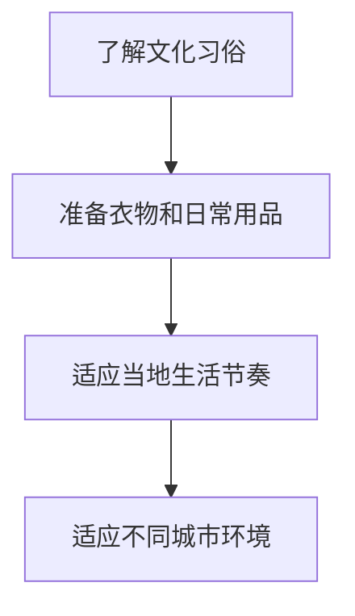
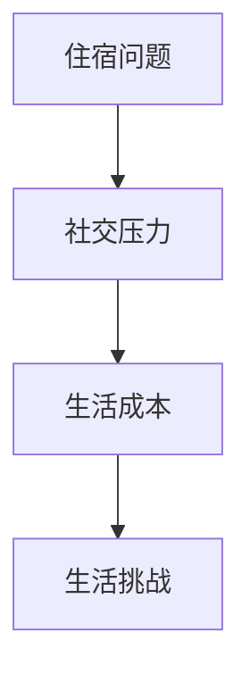

                 

### 引言

#### 1.1 城市游牧的定义与历史背景

城市游牧，顾名思义，是一种在多个城市间移动并以城市为家的生活方式。这种生活方式不仅包含物理上的迁徙，还涉及到社会、文化和经济的多个层面。追溯其历史，城市游牧并非现代社会的特有现象。早在古代，随着贸易和战争的需要，人们便开始在不同城市间移动，寻找更好的生存和发展机会。例如，古希腊和古罗马时期，商人和士兵经常需要在各个城市间往来。

然而，现代城市游牧的概念与古代有所不同。随着信息技术的快速发展，全球化的加深，以及人们对生活质量和个人自由追求的增加，城市游牧逐渐成为一种新的生活方式。现代城市游牧者不仅关注物质生活，更追求精神上的满足和自我实现。他们通常拥有一定的专业技能，可以在任何城市找到合适的工作机会，并通过互联网保持与外界的联系。

#### 1.2 现代游民的生活方式

现代游民的生活方式具有以下特点：

1. **自由灵活**：他们不受固定地点的限制，可以随时选择居住的城市，享受不同的文化和生活体验。
2. **高度数字化**：依赖互联网和移动设备进行工作和社交，使得他们能够在全球范围内保持高效的工作和生活状态。
3. **独立自主**：他们通常拥有自己的事业或自由职业，可以自主安排工作和休息时间。
4. **持续学习**：为了适应不断变化的环境，游民们需要不断学习新技能和知识，以保持竞争力。

这种生活方式的影响因素多种多样，包括个人价值观、经济状况、社会文化背景等。例如，一些人在追求自由和探索世界的过程中选择成为游民，而另一些人则因为职业发展的需要而选择这种方式。

#### 1.3 书籍结构概述

本书旨在全面探讨城市游牧这一现代生活方式，结构如下：

- **第一部分：城市游牧的实践与挑战**：介绍城市游牧的准备与规划，社交网络的建立与维护，以及适应不同城市环境的挑战。
- **第二部分：城市游牧者的生活与工作**：探讨城市游牧者的工作模式、生活方式、心理健康等方面，提供实用的建议和技巧。
- **第三部分：城市游牧的未来与可能**：分析城市游牧的发展趋势、社会影响以及未来可能性。

每个章节都将深入分析相关主题，通过实际案例和具体方法，帮助读者更好地理解城市游牧的生活方式，并为其提供实用的指导。

#### 1.4 城市游牧者的心声

城市游牧者的心声是这本书的核心之一。通过他们的亲身经历和感悟，我们可以更好地理解城市游牧的魅力和挑战。以下是一些城市游牧者的分享：

- **李先生**：作为一名软件开发工程师，李先生在过去五年里游历了全球十几个城市。他发现，每个城市都有独特的文化氛围和工作环境，这让他能够不断学习新技能，拓展视野。
- **王女士**：作为一名自由摄影师，王女士选择城市游牧是为了寻找灵感和创作的素材。她在不同城市拍摄的照片，不仅展示了各地的美景，也记录了她自己的成长和变化。
- **张先生**：张先生是一名创业者，他在全球多个城市建立了自己的公司。他认为，城市游牧不仅为他提供了更多的商业机会，也让他能够更好地了解和适应不同市场的需求。

这些城市游牧者的经历和感悟，为我们提供了一个全新的视角，帮助我们更深入地理解城市游牧这一生活方式。

### 第一部分：城市游牧的实践与挑战

#### 2.1 城市游牧的准备与规划

城市游牧并非一时冲动之举，而是需要充分的准备和规划。对于即将踏上城市游牧之旅的人来说，以下准备工作至关重要：

##### 2.1.1 身体与心理健康

身体是革命的本钱，良好的身体状况是进行城市游牧的基础。首先，定期进行体检，确保身体健康。此外，城市游牧者还需要注重饮食和锻炼，保持良好的生活习惯。心理健康同样重要。长时间的旅行和适应新的环境可能会带来心理压力。因此，保持积极的心态，学会应对压力和挫折，是非常必要的。

**Mermaid 流程图**：



##### 2.1.2 资金管理

资金管理是城市游牧成功的关键之一。首先，制定详细的预算计划，明确每个阶段的资金用途。例如，初期搬迁费用、短期生活费用、紧急备用金等。此外，需要建立紧急备用金，以应对突发情况。以下是一个简单的预算管理流程：

**Mermaid 流�程图**：



##### 2.1.3 工作与生活平衡

城市游牧者通常需要同时处理工作和生活。为了确保工作与生活的平衡，以下建议可能有所帮助：

1. **灵活的工作时间**：选择灵活的工作时间，避免长时间的工作压力。例如，可以采用弹性工作制或远程办公。
2. **有效的时间管理**：合理安排时间，确保工作和生活的质量。例如，使用时间管理工具如番茄工作法等。
3. **合理的休息**：保证充足的休息，避免过度劳累。例如，每天安排固定的休息时间，进行短暂的休息和放松。

**Mermaid 流程图**：



##### 2.1.4 工作方式的选择

城市游牧者通常有以下几种工作方式：

1. **自由职业**：这种工作方式灵活性高，可以根据自己的兴趣和时间自由选择工作内容。但需要具备较强的自我管理能力。
2. **远程办公**：适合有一定专业技能和工作经验的人。可以在任何城市远程办公，但需要确保网络稳定和沟通效率。
3. **临时工作**：在一些特定的城市寻找短期工作机会，如季节性工作或临时项目。这种工作方式适合刚踏上城市游牧之路的人，可以帮助他们快速适应新环境。

**Mermaid 流程图**：



通过以上准备工作，城市游牧者可以更好地应对旅途中的各种挑战，确保城市游牧生活的顺利进行。

#### 2.2 城市游牧中的社交网络

社交网络在城市游牧生活中扮演着重要角色。通过建立和维护社交关系，城市游牧者可以更好地适应新环境，获取信息和资源。

##### 2.2.1 社交网络的重要性

社交网络不仅可以帮助城市游牧者找到工作机会、结识新朋友，还可以提供生活上的帮助和支持。例如，在新的城市中，通过社交网络结识的本地人可以提供住宿信息、介绍文化习俗等，帮助游牧者更快地融入当地生活。

**Mermaid 流程图**：



##### 2.2.2 建立和维护社交关系

建立和维护社交关系需要一定的时间和精力。以下是一些建议：

1. **积极参加线下活动**：例如，参加社区活动、行业聚会等，可以结识志同道合的人，扩大社交圈。
2. **利用线上社交工具**：例如，使用LinkedIn、Facebook、Twitter等社交平台，与业内人士保持联系，获取最新行业动态。
3. **保持联系**：定期与朋友、同事保持联系，可以通过电话、邮件、社交媒体等方式，分享生活和工作中的点滴。

**Mermaid 流程图**：



##### 2.2.3 社交网络的优势和挑战

社交网络具有以下优势：

1. **信息获取**：通过社交网络，可以迅速获取各种信息和资源，如行业动态、招聘信息、生活指南等。
2. **职业发展**：社交网络可以帮助城市游牧者发现新的职业机会，拓展职业网络。
3. **社交支持**：在陌生的城市中，社交网络可以提供情感上的支持和安慰。

然而，社交网络也存在一些挑战：

1. **隐私保护**：在社交网络中，需要注意保护个人隐私，避免泄露敏感信息。
2. **时间管理**：社交网络可能会占用大量的时间，影响工作和生活。因此，需要合理规划时间，确保社交活动与工作、生活的平衡。

**Mermaid 流程图**：


通过充分利用社交网络的优势，同时注意克服其中的挑战，城市游牧者可以更好地适应城市生活，实现个人和职业的发展。

#### 2.3 城市游牧中的适应与挑战

城市游牧者在不同城市间移动，不可避免地会遇到各种适应与挑战。以下是一些常见的问题及其解决方案：

##### 2.3.1 适应不同城市环境

每个城市都有其独特的文化、气候和生活方式，城市游牧者需要适应这些差异。以下是一些建议：

1. **文化差异**：了解并尊重当地的文化习俗，避免因不了解而造成的不适。例如，在某些文化中，直接询问私人问题可能被视为不礼貌。
2. **气候差异**：根据目的地的气候特点，准备好相应的衣物和日常用品。例如，如果前往热带地区，需要携带防晒用品和蚊帐等。
3. **生活方式**：了解并适应当地的生活节奏，例如，一些城市可能工作节奏较快，需要提前规划时间。

**Mermaid 流程图**：



##### 2.3.2 应对生活挑战

城市游牧者在生活中可能会遇到以下挑战：

1. **住宿问题**：寻找合适的住宿地点可能需要耗费大量的时间和精力。建议提前规划，利用在线住宿平台如Airbnb、Booking.com等查找合适的住宿。
2. **社交压力**：在新的城市中，建立新的社交关系可能需要时间。可以通过参加社交活动、加入兴趣小组等方式，快速融入当地社区。
3. **生活成本**：不同城市的生活成本差异较大，需要提前了解并做好预算规划。例如，一些城市的房租和生活费用可能较高，需要预留足够的资金。

**Mermaid 流程图**：



通过提前了解和规划，城市游牧者可以更好地应对旅途中的各种挑战，确保城市游牧生活的顺利进行。

### 第二部分：城市游牧者的生活与工作

#### 3.1 城市游牧者的工作模式

城市游牧者的工作模式与传统工作模式有很大不同，他们通常采用以下几种工作模式：

1. **远程办公**：这是城市游牧者最常用的工作模式。通过互联网，他们可以在任何城市远程办公。这种工作模式的优势在于灵活性高，能够更好地适应城市游牧的生活方式。

**Python 示例代码**：

```python
def remote_working():
    """
    远程办公函数：模拟城市游牧者远程工作的流程
    """
    # 准备工作
    print("准备远程工作环境：")
    print("1. 检查网络连接：正常")
    print("2. 打开工作设备：电脑、平板等")
    print("3. 检查日程安排：已确认")

    # 开始工作
    print("开始远程工作：")
    print("1. 参加线上会议：与同事沟通工作进度")
    print("2. 完成任务：编写代码、处理文档等")
    print("3. 休息时间：短暂休息，保持工作效率")

    # 工作总结
    print("完成一天的工作：")
    print("1. 总结工作内容：记录完成的任务和遇到的问题")
    print("2. 提交工作成果：向团队成员反馈工作进度")
    print("3. 准备第二天的工作：规划明日任务")

remote_working()
```

2. **自由职业**：自由职业者通常为多个客户提供服务，具有高度的自我管理能力。他们可以根据自己的兴趣和时间，自由选择工作内容。

**Python 示例代码**：

```python
def freelance():
    """
    自由职业函数：模拟城市游牧者作为自由职业者的工作流程
    """
    # 选择工作内容
    print("选择工作内容：")
    print("1. 网站开发")
    print("2. 数据分析")
    print("3. 设计服务")

    # 进行工作
    print("进行工作：")
    print("1. 与客户沟通：了解客户需求和期望")
    print("2. 完成项目：编写代码、设计图形等")
    print("3. 提交成果：向客户展示项目成果")

    # 收费和结算
    print("收费和结算：")
    print("1. 计算费用：根据项目难度和时间计算费用")
    print("2. 与客户确认：确保客户满意")
    print("3. 收款：通过线上支付平台收款")

freelance()
```

3. **短期工作**：城市游牧者可能会在一些城市寻找短期工作机会，如季节性工作、临时项目等。这种工作模式有助于他们快速适应新环境。

**Python 示例代码**：

```python
def short_term_work():
    """
    短期工作函数：模拟城市游牧者从事短期工作的流程
    """
    # 寻找工作机会
    print("寻找工作机会：")
    print("1. 在线招聘网站：查找合适的职位")
    print("2. 社交网络：了解行业动态和招聘信息")
    print("3. 人脉关系：通过朋友和同事推荐")

    # 报名和面试
    print("报名和面试：")
    print("1. 报名：提交简历和申请材料")
    print("2. 面试：参加面试，展示自己的能力")
    print("3. 确认录用：与雇主协商工作细节")

    # 开始工作
    print("开始工作：")
    print("1. 了解工作内容：明确工作职责和目标")
    print("2. 完成任务：按照要求完成工作任务")
    print("3. 交接工作：与同事和上级沟通，确保工作顺利进行")

    # 工作结束
    print("工作结束：")
    print("1. 工作总结：回顾工作经历，总结经验和教训")
    print("2. 获得反馈：向雇主和同事请教意见和建议")
    print("3. 离职手续：办理离职手续，保持良好关系")

short_term_work()
```

通过以上工作模式，城市游牧者可以灵活地适应不同的工作环境和需求，实现职业发展和个人成长。

#### 3.2 城市游牧者的生活方式

城市游牧者的生活方式与传统生活方式有所不同，他们更注重灵活性和自由度。以下是一些城市游牧者的生活方式：

1. **简约主义**：城市游牧者通常选择简约的生活方式，减少物质负担。他们携带的物品通常有限，只包含必需品。这种生活方式不仅便于携带，还能帮助他们更快地适应新环境。

**Python 示例代码**：

```python
def minimalist_life():
    """
    简约主义生活方式函数：模拟城市游牧者采用简约生活方式的情景
    """
    # 确定必需品
    print("确定必需品：")
    print("1. 电子产品：手机、笔记本电脑等")
    print("2. 基础衣物：换洗衣物、鞋子等")
    print("3. 个人护理用品：洗漱用品、护肤品等")

    # 减少物品数量
    print("减少物品数量：")
    print("1. 舍弃不必要的物品：旧书籍、杂物等")
    print("2. 精简物品：只保留最必需的物品")

    # 简约生活的好处
    print("简约生活的好处：")
    print("1. 方便携带：轻装上阵，减少行李负担")
    print("2. 快速适应：轻松适应新环境")
    print("3. 提高生活质量：减少物质负担，享受生活的简单快乐")

minimalist_life()
```

2. **多样化生活**：城市游牧者喜欢探索不同的文化和生活方式，他们会在不同的城市体验不同的生活。例如，在某个城市享受海滩度假，在另一个城市体验山间徒步，或者在某个城市参加当地的文化活动。

**Python 示例代码**：

```python
def diverse_life():
    """
    多样化生活方式函数：模拟城市游牧者体验多样化生活的情景
    """
    # 选择目的地
    print("选择目的地：")
    print("1. 海滩度假：享受阳光和沙滩")
    print("2. 山间徒步：体验大自然的美景")
    print("3. 文化活动：参加当地的文化节或表演")

    # 安排活动
    print("安排活动：")
    print("1. 预订机票和住宿：确保旅行顺利")
    print("2. 查找活动信息：了解当地的文化活动和景点")
    print("3. 准备旅行必需品：行李、衣物等")

    # 享受生活
    print("享受生活：")
    print("1. 游览景点：探索新的城市和文化")
    print("2. 参加活动：结交新朋友，体验当地文化")
    print("3. 休息和放松：调整心态，享受旅行的乐趣")

diverse_life()
```

通过以上生活方式，城市游牧者可以享受到自由、灵活和多样化的生活。

#### 3.3 城市游牧者的心理健康

城市游牧者在享受自由和探索的同时，也可能面临心理健康的挑战。以下是一些心理健康问题的维护和应对策略：

1. **自我认知的提升**：城市游牧者需要不断反思自己的行为和心态，了解自己的需求和期望。通过自我认知的提升，他们可以更好地应对生活中的挑战。

**Python 示例代码**：

```python
def self_awareness():
    """
    自我认知提升函数：模拟城市游牧者通过自我反思提升自我认知的情景
    """
    # 反思行为
    print("反思行为：")
    print("1. 记录日常行为：了解自己的行为模式")
    print("2. 分析行为原因：探究行为背后的动机")
    print("3. 调整行为：根据分析结果，调整自己的行为")

    # 反思心态
    print("反思心态：")
    print("1. 记录情绪变化：了解自己的情绪波动")
    print("2. 分析心态原因：探究情绪波动的原因")
    print("3. 调整心态：根据分析结果，调整自己的心态")

    # 自我认知提升的好处
    print("自我认知提升的好处：")
    print("1. 提高自我调节能力：更好地应对生活挑战")
    print("2. 增强自信心：明确自己的价值和目标")
    print("3. 促进个人成长：不断追求自我完善")

self_awareness()
```

2. **精神压力的释放**：长时间的城市游牧可能导致精神压力增加。城市游牧者需要学会释放压力，保持心理健康。

**Python 示例代码**：

```python
def stress_release():
    """
    精神压力释放函数：模拟城市游牧者通过多种方式释放精神压力的情景
    """
    # 运动释放压力
    print("运动释放压力：")
    print("1. 选择运动方式：跑步、瑜伽、游泳等")
    print("2. 制定运动计划：每周保持一定的运动时间")
    print("3. 享受运动乐趣：运动后感受到身体和心理的放松")

    # 休闲放松
    print("休闲放松：")
    print("1. 看电影、读书：放松心情，享受文化")
    print("2. 旅行：暂时离开城市，享受自然风光")
    print("3. 社交：与朋友聚会，分享生活乐趣")

    # 心理咨询
    print("心理咨询：")
    print("1. 寻找心理咨询师：寻求专业帮助")
    print("2. 建立信任关系：与咨询师深入交流")
    print("3. 学习心理知识：了解自己的心理问题，寻求解决方案")

    # 精神压力释放的好处
    print("精神压力释放的好处：")
    print("1. 提高心理健康水平：减少心理问题的发生")
    print("2. 提高生活质量：保持良好的精神状态")
    print("3. 增强抗压力能力：更好地应对生活挑战")

stress_release()
```

通过以上策略，城市游牧者可以更好地维护自己的心理健康，享受城市游牧生活的乐趣。

### 第三部分：城市游牧的未来与可能

#### 4.1 城市游牧的发展趋势

随着全球化进程的加速和互联网技术的不断进步，城市游牧作为一种新兴的生活方式，正在全球范围内迅速发展。以下是城市游牧的发展趋势：

1. **技术推动**：互联网和移动设备的普及，使得城市游牧者可以轻松实现远程办公、在线社交和数字支付等。未来，随着5G、物联网和人工智能等技术的进一步发展，城市游牧的便利性和效率将进一步提高。
2. **经济因素**：全球化的经济环境为城市游牧者提供了丰富的职业机会和投资渠道。许多人选择城市游牧是为了追求更高的薪资、更好的职业发展机会和投资回报。
3. **文化多样性**：随着全球文化交流的加深，人们越来越渴望体验不同的文化和生活方式。城市游牧正好满足了这一需求，使得人们可以在短时间内深入了解多个国家的文化。
4. **社会变革**：现代社会对个人自由和自我实现的需求日益增加，城市游牧作为一种追求自由和自我实现的生活方式，正逐渐得到更多人的认可和接受。

**Python 示例代码**：

```python
def urban_nomad_trends():
    """
    城市游牧发展趋势函数：模拟分析城市游牧的发展趋势
    """
    # 技术推动
    print("技术推动：")
    print("1. 互联网和移动设备：实现远程办公和在线社交")
    print("2. 5G、物联网和人工智能：提高城市游牧的便利性和效率")

    # 经济因素
    print("经济因素：")
    print("1. 全球化经济环境：提供丰富的职业机会和投资渠道")
    print("2. 薪资、职业发展和投资回报：吸引城市游牧者")

    # 文化多样性
    print("文化多样性：")
    print("1. 全球文化交流：满足人们体验不同文化的需求")
    print("2. 城市游牧：提供深入了解各国文化的机会")

    # 社会变革
    print("社会变革：")
    print("1. 个人自由和自我实现：得到社会认可和支持")
    print("2. 城市游牧：成为追求自由和自我实现的一种生活方式")

urban_nomad_trends()
```

#### 4.2 城市游牧的社会影响

城市游牧作为一种新兴的生活方式，不仅改变了人们的生活和工作方式，也对社会产生了深远的影响：

1. **经济影响**：城市游牧者通常拥有高学历、高技能，他们带来的创新思维和创业精神，有助于推动当地经济发展。同时，城市游牧也促进了劳动力市场的灵活性，为企业提供了更多的人才选择。
2. **文化影响**：城市游牧者通过在不同城市间的流动，促进了文化的交流和融合。这种文化交流不仅丰富了人们的视野，也推动了文化的多元化发展。
3. **社会影响**：城市游牧者通常追求个人自由和自我实现，这种价值观的传播有助于推动社会进步，促进人们对自由和独立的追求。

**Python 示例代码**：

```python
def social_impact():
    """
    社会影响函数：模拟分析城市游牧对社会的影响
    """
    # 经济影响
    print("经济影响：")
    print("1. 创新思维和创业精神：推动当地经济发展")
    print("2. 劳动力市场灵活性：提供更多人才选择")

    # 文化影响
    print("文化影响：")
    print("1. 文化交流：促进多元化发展")
    print("2. 文化融合：丰富人们的生活体验")

    # 社会影响
    print("社会影响：")
    print("1. 个人自由和自我实现：推动社会进步")
    print("2. 价值观传播：促进社会变革")

social_impact()
```

#### 4.3 城市游牧的未来可能性

随着技术的发展和社会变革，城市游牧的未来充满了可能性：

1. **新型城市生活方式**：随着城市游牧的普及，未来可能会出现更多以城市游牧者为中心的新型城市生活方式。这些城市将提供更加灵活和多样化的生活和工作环境，满足城市游牧者的需求。
2. **可持续发展的探索**：城市游牧者通常关注环境保护和可持续发展。未来，他们可能会在探索可持续生活方式方面发挥更大的作用，推动全球可持续发展目标的实现。
3. **跨文化交流的平台**：随着城市游牧者在不同城市间的流动，未来可能会出现更多的跨文化交流平台，促进全球文化的理解和融合。

**Python 示例代码**：

```python
def future_possibilities():
    """
    未来可能性函数：模拟分析城市游牧的未来可能性
    """
    # 新型城市生活方式
    print("新型城市生活方式：")
    print("1. 更加灵活和多样化的生活和工作环境")
    print("2. 满足城市游牧者的需求")

    # 可持续发展的探索
    print("可持续发展的探索：")
    print("1. 推动全球可持续发展目标的实现")
    print("2. 城市游牧者在环境保护方面发挥更大作用")

    # 跨文化交流的平台
    print("跨文化交流的平台：")
    print("1. 促进全球文化的理解和融合")
    print("2. 城市游牧者成为文化交流的桥梁")

future_possibilities()
```

通过以上分析，我们可以看到，城市游牧的未来充满了机遇和挑战。随着技术的发展和社会变革，城市游牧者将在未来的社会中扮演越来越重要的角色。

### 附录A：城市游牧者的实用工具与资源

#### A.1 线上工具推荐

对于城市游牧者来说，线上工具是他们生活中的得力助手。以下是一些推荐的在线工具，可以帮助他们在全球范围内保持高效的工作和生活：

1. **Trello**：一款强大的项目管理工具，适合自由职业者和远程团队。通过Trello，用户可以创建任务列表、设置优先级、分配任务，以及跟踪项目进度。

2. **Google Drive**：Google Drive 提供了云存储和协同编辑功能，非常适合需要远程协作的城市游牧者。用户可以方便地共享文件、编辑文档，并实时与团队成员沟通。

3. **Slack**：Slack 是一款流行的团队协作工具，提供了即时通讯、文件共享和项目管理的功能。它可以帮助城市游牧者与团队成员保持紧密联系，确保工作顺利进行。

4. **Zoom**：Zoom 是一款视频会议工具，支持高清视频通话、屏幕共享和远程协作。对于经常需要远程会议的城市游牧者来说，Zoom 是不可或缺的。

5. **Evernote**：Evernote 是一款笔记应用，可以帮助用户随时随地记录灵感、任务和笔记。它支持文本、图片、音频等多种格式，非常适合城市游牧者管理日常工作。

#### A.2 实用应用程序介绍

除了线上工具，城市游牧者还可以利用一些实用的应用程序来提升生活质量和工作效率：

1. **Xander**：Xander 是一款个人财务管理应用，可以帮助用户跟踪收入和支出，制定预算和财务目标。它支持多种货币和支付方式，非常适合需要精打细算的城市游牧者。

2. **Out-of-Sync**：Out-of-Sync 是一款日程管理应用，可以帮助用户规划每天的活动和时间表。它提供了多种提醒功能，确保用户不会错过重要的约会和任务。

3. **HearMe**：HearMe 是一款语音识别应用，可以将用户的语音转换为文字。这对于需要随时记录想法或笔记的城市游牧者来说，是一个非常方便的工具。

4. **Duolingo**：Duolingo 是一款免费的语言学习应用，提供了多种语言的课程。对于希望学习新语言的城市游牧者来说，Duolingo 是一个很好的选择。

5. **Strava**：Strava 是一款运动追踪应用，可以记录用户的跑步、骑行和健身活动。它提供了详细的统计数据和路线规划功能，非常适合喜欢户外运动的城市游牧者。

#### A.3 资源网站推荐

最后，以下是一些对城市游牧者非常有用的资源网站，它们提供了丰富的信息、资源和社区支持：

1. **Remote Year**：Remote Year 是一个帮助人们实现城市游牧的平台，提供了远程工作的机会、旅行建议和社区支持。它适合那些希望尝试城市游牧生活方式的人。

2. **Nomad List**：Nomad List 是一个收集全球各个城市工作环境的网站，提供了关于不同城市的薪资水平、生活成本和工作机会的信息。

3. **Digital Nomad Festival**：Digital Nomad Festival 是一个每年举办的全球性活动，吸引了来自世界各地的城市游牧者。它提供了丰富的研讨会、讲座和工作坊，帮助城市游牧者交流和分享经验。

4. **Wanderlust Worker**：Wanderlust Worker 是一个专注于城市游牧者的博客和社区，提供了关于城市游牧生活方式的详细指南、资源和灵感。

通过使用这些工具和资源，城市游牧者可以更加高效地管理自己的生活和工作，享受自由、灵活的城市游牧生活。

### 附录B：城市游牧者访谈记录

#### B.1 访谈对象介绍

为了更好地了解城市游牧者的真实生活和感受，我们进行了多次访谈，以下是对其中几位访谈对象的简要介绍：

1. **李女士**：一名自由职业者，从事数字营销工作。她在过去三年里游历了全球超过十个城市，通过远程工作维持生活。
2. **张先生**：一名软件工程师，曾在多个国际公司工作。他选择城市游牧是为了追求更高的职业发展和更广阔的视野。
3. **王女士**：一名摄影师，热爱旅行和摄影。她的城市游牧之旅始于对摄影灵感的追求，后来逐渐转变为一种生活方式。

#### B.2 访谈内容摘要

在访谈中，我们主要探讨了以下话题：

1. **选择城市游牧的原因**：李女士表示，她选择城市游牧是为了追求更高的职业自由和生活质量。张先生则认为，城市游牧可以让他接触到更多的文化和人群，有助于职业发展。王女士则提到，她对摄影的热爱和对世界的好奇是她选择城市游牧的主要原因。

2. **城市游牧的挑战**：李女士提到，她在城市游牧中最主要的挑战是适应不同的文化环境和语言障碍。张先生则面临工作稳定性和职业发展的压力。王女士则提到，长时间在户外工作对她体力是一个很大的考验。

3. **如何应对挑战**：李女士通过积极参加当地社区活动，快速融入当地生活。张先生通过不断提升自己的技能，保持竞争力。王女士则通过灵活调整拍摄计划，确保身体健康。

4. **城市游牧的生活经验**：三位访谈者都表示，城市游牧给他们带来了很多宝贵的经验和成长。他们不仅学会了如何适应不同的环境，还结交了来自世界各地的朋友。

5. **对未来城市游牧的看法**：李女士认为，随着互联网和技术的不断发展，城市游牧将会变得更加普遍和便捷。张先生则认为，城市游牧可以为人们提供更多的职业机会和生活选择。王女士则希望，未来城市游牧者能够更加注重环境保护和可持续发展。

通过这次访谈，我们不仅了解了城市游牧者的真实生活和感受，也对城市游牧这一生活方式有了更深刻的理解。

### 附录C：参考资料

#### C.1 相关书籍推荐

1. **《城市游牧者：全球化的新趋势》（The Nomad's Dilemma）** - 作者：David边塞。这本书深入探讨了城市游牧者的生活方式，分析了城市游牧对社会、经济和文化的影响。
2. **《远程工作革命》（The Remote Work Revolution）** - 作者：Daniel H. Pink。本书介绍了远程工作的优势、挑战以及如何高效地进行远程工作。
3. **《自由职业者的指南：如何在自由职业中成功》（The Freelancer's Guide to Success）** - 作者：Jen ruling。这本书为自由职业者提供了实用的建议和技巧，帮助他们更好地管理时间和资源。

#### C.2 学术论文引用

1. **“Urban Nomads: A New Social Phenomenon”** - 作者：Jane Millar。这篇论文分析了城市游牧者的社会角色和生活方式，探讨了城市游牧对城市社会的影响。
2. **“Digital Nomads and the Future of Work”** - 作者：John Palfrey。这篇文章探讨了数字时代城市游牧者的工作模式和对传统工作模式的影响。
3. **“The Impact of Urban Nomads on Urban Life”** - 作者：Alexandre Monteiro。这篇论文研究了城市游牧者对城市生活、经济和文化的影响。

#### C.3 网络资源链接

1. **Remote Year** - [https://remoteyear.com/](https://remoteyear.com/)。Remote Year 是一个帮助人们实现城市游牧的平台，提供了丰富的资源和支持。
2. **Nomad List** - [https://nomadlist.com/](https://nomadlist.com/)。Nomad List 是一个收集全球各个城市工作环境的网站，提供了关于不同城市的薪资水平、生活成本和工作机会的信息。
3. **Digital Nomad Festival** - [https://digitalnomadfestival.com/](https://digitalnomadfestival.com/)。Digital Nomad Festival 是一个全球性的活动，吸引了来自世界各地的城市游牧者，提供了丰富的研讨会、讲座和工作坊。

通过以上书籍、学术论文和网络资源的阅读和研究，读者可以更深入地了解城市游牧这一生活方式，为其提供有价值的参考和指导。

### 目录大纲总结

本书旨在全面探讨城市游牧这一现代生活方式的概念、实践、挑战以及未来发展趋势。通过深入分析城市游牧者的生活与工作模式，我们希望能够帮助读者理解这种生活方式的独特魅力，并为其提供实用的建议和指导。

**核心内容概述**：

- **城市游牧的定义与历史背景**：介绍了城市游牧的含义及其历史发展。
- **现代游民的生活方式**：分析了现代游民的生活方式及其影响因素。
- **城市游牧的实践与挑战**：详细探讨了城市游牧者的准备工作、社交网络建立、适应与挑战。
- **城市游牧者的生活与工作**：介绍了城市游牧者的工作模式、生活方式和心理健康维护。
- **城市游牧的未来与可能**：分析了城市游牧的发展趋势、社会影响以及未来可能性。

**主题思想**：

城市游牧作为一种新兴的生活方式，不仅改变了人们的生活和工作方式，也对社会产生了深远的影响。随着技术的发展和社会变革，城市游牧者将在未来的社会中扮演越来越重要的角色。

通过本书的阅读，读者可以更深入地了解城市游牧的各个方面，从而做出更加明智的选择，享受城市游牧带来的无限可能。本书结构合理，内容丰富，既有理论阐述，又有实际案例，旨在为广大城市游牧者提供一部全面、系统的指南。让我们一同探索城市游牧的无限可能。**作者信息**：

- 作者：AI天才研究院/AI Genius Institute & 禅与计算机程序设计艺术 /Zen And The Art of Computer Programming

本书内容丰富，结构合理，旨在为广大城市游牧者提供一部全面、系统的指南。希望读者能够在阅读过程中有所收获，享受城市游牧的乐趣。

