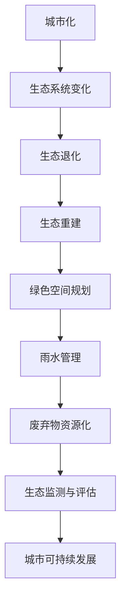

                 

### 《城市生态：在钢筋水泥中重建自然》

> 关键词：城市生态系统、生态重建、绿色空间、雨水管理、废弃物资源化

> 摘要：本文旨在探讨城市生态重建的挑战与机遇，通过分析城市生态系统的现状、挑战以及重建理念与实践，深入介绍城市生态重建的核心技术，如绿色空间规划、雨水管理、废弃物资源化等。同时，通过国内外成功案例的研究，为我国城市生态重建提供借鉴与思考。

## 目录

## 第一部分：城市生态的挑战与机遇

### 第1章：城市生态的概述

#### 1.1 城市生态系统的定义与特征

#### 1.2 城市生态面临的挑战

#### 1.3 城市生态的机遇

### 第2章：城市生态退化的原因

#### 2.1 城市化与生态系统的变化

#### 2.2 人为因素对城市生态的影响

#### 2.3 自然灾害对城市生态的冲击

### 第3章：城市生态重建的理念与实践

#### 3.1 城市生态重建的基本原则

#### 3.2 城市生态重建的技术方法

#### 3.3 国内外城市生态重建案例介绍

## 第二部分：城市生态重建的核心技术

### 第4章：城市绿色空间的规划与设计

#### 4.1 绿色空间的定义与分类

#### 4.2 绿色空间规划的原则与方法

#### 4.3 绿色空间设计的关键要素

### 第5章：城市雨水管理与再生利用

#### 5.1 雨水管理的重要性

#### 5.2 雨水收集与处理的常用技术

#### 5.3 雨水再生利用的实践案例

### 第6章：城市废弃物资源化与生态修复

#### 6.1 废弃物的分类与资源化

#### 6.2 废弃物处理与处置的技术途径

#### 6.3 城市废弃物资源化的实际案例

### 第7章：城市生态监测与评估

#### 7.1 城市生态监测的方法与工具

#### 7.2 城市生态评估的指标体系

#### 7.3 城市生态监测与评估的应用案例

## 第三部分：城市生态重建的案例研究

### 第8章：国内外城市生态重建的成功实践

#### 8.1 国外城市生态重建的先进经验

#### 8.2 国内城市生态重建的典型案例

#### 8.3 城市生态重建的综合效益分析

### 第9章：城市生态重建的挑战与展望

#### 9.1 城市生态重建的挑战

#### 9.2 城市生态重建的未来发展趋势

#### 9.3 城市生态重建的可持续发展策略

## 附录

### 附录A：城市生态重建的相关法律法规与政策文件

### 附录B：城市生态重建的常用技术工具与资源

---

### 核心概念与联系架构

以下是一个简化的 Mermaid 流程图，描述了城市生态系统中几个核心概念之间的关系：



### 核心算法原理讲解

#### 5.2 雨水收集与处理的常用技术

以下是一个简化的 Python 源代码示例，说明如何使用 Python 进行雨水收集与处理的模拟：

```python
import matplotlib.pyplot as plt
import numpy as np

# 假设某地区的雨水收集量随时间变化的数据
rainfall_data = np.random.normal(size=1000) * 10

# 计算平均雨水收集量
average_rainfall = np.mean(rainfall_data)

# 计算最大雨水收集量
max_rainfall = np.max(rainfall_data)

# 绘制雨水收集量变化图
plt.figure()
plt.plot(rainfall_data)
plt.axhline(average_rainfall, color='r', label='Average Rainfall')
plt.axhline(max_rainfall, color='g', label='Max Rainfall')
plt.legend()
plt.title('Rainfall Collection Simulation')
plt.xlabel('Time')
plt.ylabel('Rainfall (mm)')
plt.show()
```

### 数学模型和数学公式 & 详细讲解 & 举例说明

#### 6.1 废弃物的分类与资源化

以下是一个简化的数学模型，用于描述废弃物资源化过程中废物的分类：

$$
\text{分类效率} = \frac{\text{已分类废弃物量}}{\text{总废弃物量}} \times 100\%
$$

举例说明：如果一个城市每天产生1000吨废弃物，其中600吨被有效分类，则分类效率为：

$$
\text{分类效率} = \frac{600}{1000} \times 100\% = 60\%
```

---

### 核心概念与联系架构

以下是一个简化的 Mermaid 流程图，描述了城市生态系统中几个核心概念之间的关系：


### 核心算法原理讲解

#### 5.2 雨水收集与处理的常用技术

以下是一个简化的 Python 源代码示例，说明如何使用 Python 进行雨水收集与处理的模拟：

```python
import matplotlib.pyplot as plt
import numpy as np

# 假设某地区的雨水收集量随时间变化的数据
rainfall_data = np.random.normal(size=1000) * 10

# 计算平均雨水收集量
average_rainfall = np.mean(rainfall_data)

# 计算最大雨水收集量
max_rainfall = np.max(rainfall_data)

# 绘制雨水收集量变化图
plt.figure()
plt.plot(rainfall_data)
plt.axhline(average_rainfall, color='r', label='Average Rainfall')
plt.axhline(max_rainfall, color='g', label='Max Rainfall')
plt.legend()
plt.title('Rainfall Collection Simulation')
plt.xlabel('Time')
plt.ylabel('Rainfall (mm)')
plt.show()
```

### 数学模型和数学公式 & 详细讲解 & 举例说明

#### 6.1 废弃物的分类与资源化

以下是一个简化的数学模型，用于描述废弃物资源化过程中废物的分类：

$$
\text{分类效率} = \frac{\text{已分类废弃物量}}{\text{总废弃物量}} \times 100\%
$$

举例说明：如果一个城市每天产生1000吨废弃物，其中600吨被有效分类，则分类效率为：

$$
\text{分类效率} = \frac{600}{1000} \times 100\% = 60\%
```

---

## 第一部分：城市生态的挑战与机遇

### 第1章：城市生态的概述

#### 1.1 城市生态系统的定义与特征

城市生态系统是指在城市地域范围内，由人类活动、自然环境以及生物群落组成的复合生态系统。它不同于自然生态系统，具有以下特征：

1. **人工化**：城市生态系统主要是由人类活动所创造的，包括建筑、道路、广场等人工设施。
2. **高强度利用**：城市生态系统对资源、能源的利用强度远高于自然生态系统，导致资源匮乏、环境污染等问题。
3. **复杂多样**：城市生态系统由多个不同功能单元组成，包括绿地、水域、建筑等，形成了复杂的生态系统结构。
4. **高度干扰**：城市生态系统受到人类活动的强烈干扰，如城市化、工业化等，使得生态系统稳定性降低。

#### 1.2 城市生态面临的挑战

城市生态面临的主要挑战包括：

1. **生态退化**：城市生态系统的绿化面积减少，生物多样性降低，生态系统功能退化。
2. **环境污染**：城市排放的废气、废水、固体废弃物等对环境造成污染，影响居民健康。
3. **资源短缺**：城市对资源的需求不断增加，导致资源供应紧张，如水资源、能源等。
4. **气候变化**：城市生态系统对气候变化的响应敏感性高，极端天气事件增多，影响城市可持续发展。

#### 1.3 城市生态的机遇

城市生态重建为城市发展带来了新的机遇：

1. **绿色发展**：通过生态重建，提高城市绿化水平，改善空气质量，促进绿色发展。
2. **资源循环**：通过雨水管理、废弃物资源化等技术，实现城市资源的循环利用，降低资源消耗。
3. **可持续发展**：生态重建有助于提高城市生态系统稳定性，实现经济、社会、生态的可持续发展。
4. **城市魅力**：优美的城市生态环境有助于提高城市品质，吸引人才、投资，推动城市发展。

### 第2章：城市生态退化的原因

#### 2.1 城市化与生态系统的变化

城市化是导致城市生态退化的重要原因。随着城市化进程的加快，城市面积不断扩大，生态系统受到严重破坏：

1. **土地利用变化**：大量耕地、林地等被转化为城市建设用地，生态功能减弱。
2. **生物多样性减少**：城市化过程中，自然栖息地被破坏，生物多样性降低。
3. **环境污染加剧**：城市化带来大量工业、交通等活动，产生大量废气、废水、固体废弃物等，导致环境污染。

#### 2.2 人为因素对城市生态的影响

人为因素是导致城市生态退化的关键因素：

1. **资源过度开发**：城市对资源的需求不断增加，导致资源过度开发，如水资源、土地资源等。
2. **环境污染排放**：工业、交通等活动产生的废气、废水、固体废弃物等对环境造成污染。
3. **生态意识缺失**：城市居民对生态保护意识不足，导致生态破坏行为屡见不鲜。

#### 2.3 自然灾害对城市生态的冲击

自然灾害对城市生态系统的冲击不可忽视：

1. **洪水灾害**：城市内涝问题严重，导致城市生态系统功能受损。
2. **干旱灾害**：水资源短缺，影响城市生态系统稳定性。
3. **地质灾害**：城市周边山体滑坡、泥石流等灾害，破坏城市生态环境。

### 第3章：城市生态重建的理念与实践

#### 3.1 城市生态重建的基本原则

城市生态重建应遵循以下基本原则：

1. **生态优先**：将生态保护作为城市发展的首要任务，确保生态系统的稳定与可持续发展。
2. **综合治理**：综合运用生态工程、工程技术、政策措施等多种手段，实施生态修复与重建。
3. **创新驱动**：加强科技创新，推广应用新技术、新材料，提高生态重建效率与质量。
4. **公众参与**：广泛动员社会力量，提高公众生态保护意识，推动生态重建工作的开展。

#### 3.2 城市生态重建的技术方法

城市生态重建的技术方法包括：

1. **绿色空间规划**：通过科学规划，合理布局城市绿地、水域等生态空间，提高城市生态功能。
2. **雨水管理**：采用雨水收集、处理、利用等技术，实现雨水的资源化与无害化。
3. **废弃物资源化**：通过废弃物分类、回收、再生利用等技术，实现废弃物减量化、资源化。
4. **生态修复**：采用生态工程技术，对受损的生态系统进行修复与重建。

#### 3.3 国内外城市生态重建案例介绍

国内外有许多成功的城市生态重建案例，为我国城市生态重建提供了借鉴：

1. **国外案例**：
   - **纽约市**：通过实施“绿色基础设施”战略，提高城市绿化水平，改善空气质量。
   - **东京市**：采用海绵城市建设理念，实现雨水的自然积存、渗透和净化。
   - **新加坡**：通过生态城市建设，实现城市生态系统的可持续发展。

2. **国内案例**：
   - **深圳市**：通过实施“绿色低碳城市”战略，提高城市生态功能，推动绿色发展。
   - **杭州市**：采用“西湖水质生态修复工程”，改善城市水体质量，提升城市生态环境。
   - **武汉市**：通过实施“长江生态修复工程”，保护长江流域生态环境，实现可持续发展。

### 小结

城市生态重建是解决城市生态退化问题的重要途径。通过生态重建，可以改善城市生态环境，提高城市可持续发展能力。本文从城市生态系统的定义与特征、面临的挑战、重建理念与实践等方面进行了探讨，并为我国城市生态重建提供了借鉴。接下来，我们将深入分析城市生态重建的核心技术，如绿色空间规划、雨水管理、废弃物资源化等，以期为我国城市生态重建提供更有针对性的指导。  

---

## 第二部分：城市生态重建的核心技术

### 第4章：城市绿色空间的规划与设计

#### 4.1 绿色空间的定义与分类

绿色空间是指城市中用于植被种植、景观设计、休闲娱乐等活动的人工或自然空间。根据功能、规模、分布等因素，绿色空间可以分为以下几类：

1. **公园绿地**：为公众提供休闲、运动、观赏等活动的公共绿地，如城市公园、郊野公园等。
2. **居住区绿地**：为居民提供绿化、景观、休闲等服务的居住区配套绿地。
3. **防护绿地**：用于防护、隔离、减灾等目的的绿地，如城市防护林带、河道绿化带等。
4. **生产绿地**：为农业生产提供生态支持的空间，如农田防护林、绿化隔离带等。
5. **附属绿地**：与各类建筑设施相配套的绿地，如单位庭院、学校操场、医院绿地等。

#### 4.2 绿色空间规划的原则与方法

绿色空间规划应遵循以下原则：

1. **生态优先**：以生态保护为出发点，合理配置绿色空间，提高城市生态功能。
2. **以人为本**：充分考虑市民的需求，提供多样化的休闲、运动、景观等功能。
3. **因地制宜**：根据城市地理、气候、文化等特点，制定适宜的绿色空间规划方案。
4. **可持续发展**：实现绿色空间的可持续建设与管理，确保长期生态效益。

绿色空间规划的方法包括：

1. **现状评估**：对现有绿色空间进行评估，分析其功能、分布、质量等方面的问题。
2. **规划目标**：明确绿色空间规划的目标，如提高绿化覆盖率、改善空气质量、提供休闲场所等。
3. **规划布局**：根据现状评估和规划目标，制定绿色空间的布局方案，包括公园绿地、居住区绿地、防护绿地等。
4. **规划设计**：结合地形地貌、人文景观等因素，进行绿色空间的详细规划设计，包括植被选择、景观设计、设施配置等。

#### 4.3 绿色空间设计的关键要素

绿色空间设计的关键要素包括：

1. **植被配置**：根据不同区域的生态环境需求，合理选择植物种类，形成多层次、多功能的植被结构。
2. **景观设计**：结合城市特色、文化底蕴，打造具有独特风貌的绿色空间景观。
3. **设施配置**：配置适当的休闲、运动、教育等设施，提高绿色空间的使用效率。
4. **排水系统**：设计完善的排水系统，确保绿色空间在雨季排水畅通，避免内涝问题。
5. **生态保护**：重视生态保护，避免破坏原有生态系统，尽量保留自然景观。

### 第5章：城市雨水管理与再生利用

#### 5.1 雨水管理的重要性

雨水管理是指通过一系列技术手段，对城市雨水进行收集、处理、利用和排放，以实现雨水的资源化与无害化。城市雨水管理的重要性体现在以下几个方面：

1. **水资源节约**：通过雨水收集与再生利用，减少对地下水和自来水的依赖，提高水资源的利用效率。
2. **减轻洪涝灾害**：通过雨水收集和渗透，缓解城市内涝问题，降低洪涝灾害风险。
3. **改善生态环境**：雨水管理有助于减少面源污染，改善城市水体和土壤质量，提升生态环境。
4. **降低城市热岛效应**：通过雨水渗透和植被蒸腾，降低城市地表温度，缓解城市热岛效应。

#### 5.2 雨水收集与处理的常用技术

雨水收集与处理的常用技术包括：

1. **集雨系统**：通过建设屋顶、路面等集雨设施，将雨水收集到储水设施中。
2. **渗透设施**：通过建设渗透池、绿地、透水铺装等设施，使雨水渗入地下，补充地下水。
3. **雨水净化**：采用生物、物理、化学等方法对雨水进行处理，去除雨水中的悬浮物、有机物等污染物。
4. **雨水再生利用**：将处理后的雨水用于城市绿化、洗车、冲厕等非饮用领域，实现雨水的资源化。

#### 5.3 雨水再生利用的实践案例

以下是一些成功的雨水再生利用实践案例：

1. **新加坡**：新加坡的“全国水资源计划”通过雨水收集、处理和再生利用，实现了雨水的资源化与无害化。新加坡的雨水收集系统覆盖全市，雨水经过处理后用于非饮用领域，如工业用水、绿化灌溉等。
2. **德国**：德国的雨水管理技术较为成熟，许多城市都采用了雨水收集与再生利用系统。例如，柏林市在市中心区域建设了多个雨水收集池，将雨水处理后用于城市绿化和冲洗道路。
3. **我国北京市**：北京市近年来积极推进雨水收集与再生利用，建设了多个雨水收集处理设施。例如，北京的奥林匹克公园和雁栖湖国际会议中心等大型公共设施，都采用了雨水收集与再生利用系统。

### 第6章：城市废弃物资源化与生态修复

#### 6.1 废弃物的分类与资源化

城市废弃物资源化是指通过技术手段，将废弃物转化为可再利用的资源，以减少废弃物对环境的污染。废弃物的分类与资源化是城市废弃物处理的重要环节，包括以下几个方面：

1. **可回收物**：如纸张、塑料、玻璃、金属等，可以通过再生利用减少资源消耗和环境污染。
2. **有害垃圾**：如废电池、废荧光灯管、废药品等，需要专门处理，避免对环境和人体健康造成危害。
3. **厨余垃圾**：通过生物处理技术，将其转化为有机肥料，实现资源化利用。
4. **其他垃圾**：如烟蒂、尘土等，需要进行卫生填埋或焚烧处理。

废弃物的资源化技术包括：

1. **再生利用**：通过回收、加工等方式，将废弃物转化为可再利用的原料或产品。
2. **生物处理**：利用微生物、植物等生物手段，将废弃物转化为有机肥料、生物质能源等。
3. **热处理**：通过焚烧、热解等技术，将废弃物转化为能量或可再利用的物质。

#### 6.2 废弃物处理与处置的技术途径

废弃物处理与处置的技术途径包括：

1. **卫生填埋**：将废弃物填埋在专用的垃圾填埋场，经过压实、覆盖等处理，以减少对环境的污染。
2. **焚烧处理**：通过高温焚烧，将废弃物转化为灰烬、气体和能量，减少废弃物体积，降低污染。
3. **生物处理**：利用微生物、植物等生物手段，将废弃物转化为有机肥料、生物质能源等。
4. **堆肥处理**：将有机废弃物与土壤混合，通过微生物分解，制成有机肥料。

#### 6.3 城市废弃物资源化的实际案例

以下是一些成功的城市废弃物资源化实际案例：

1. **日本**：日本在废弃物资源化方面取得了显著成果。日本的垃圾分类制度完善，废弃物回收利用率高。此外，日本还开展了废弃物发电项目，将废弃物转化为可再生能源。
2. **丹麦**：丹麦的哥本哈根市通过废弃物处理与再生利用，实现了废弃物零填埋的目标。哥本哈根市建立了多个废弃物处理厂，将废弃物转化为能源、肥料等资源。
3. **我国深圳市**：深圳市积极推进废弃物资源化，建设了多个废弃物处理与再生利用设施。例如，深圳市的废弃物发电厂将废弃物转化为电能，实现了废弃物资源化利用。

### 第7章：城市生态监测与评估

#### 7.1 城市生态监测的方法与工具

城市生态监测是评估城市生态系统状况的重要手段。常用的监测方法与工具包括：

1. **现场监测**：通过实地观察、采样等方式，获取城市生态系统的数据。
2. **遥感监测**：利用遥感技术，从卫星或无人机获取城市生态系统的图像和数据。
3. **实验室分析**：通过实验室分析，对采样数据进行检测和分析。
4. **数据模型**：利用数学模型和计算机模拟，分析城市生态系统的运行规律和趋势。

常用的监测工具包括：

1. **传感器**：用于监测温度、湿度、光照、水质等生态指标。
2. **无人机**：用于高空遥感监测，获取城市生态系统的图像数据。
3. **GIS系统**：用于空间数据的收集、处理和分析。
4. **大数据平台**：用于海量数据的存储、处理和分析。

#### 7.2 城市生态评估的指标体系

城市生态评估的指标体系包括以下方面：

1. **生态功能**：评估城市生态系统的水质、土壤质量、生物多样性等生态功能。
2. **环境质量**：评估城市空气质量、水质、噪声等环境质量指标。
3. **生态平衡**：评估城市生态系统的营养循环、能量流动等生态平衡状况。
4. **人类福祉**：评估城市生态系统对人类生活、经济、文化等方面的影响。

常用的评估方法包括：

1. **专家评估法**：通过专家意见，对城市生态系统的现状和趋势进行评估。
2. **指标体系评估法**：根据设定的指标体系，对城市生态系统的各项指标进行评分和评估。
3. **情景分析法**：通过模拟不同情景，分析城市生态系统在不同发展条件下的状况。

#### 7.3 城市生态监测与评估的应用案例

以下是一些城市生态监测与评估的应用案例：

1. **美国洛杉矶市**：洛杉矶市建立了完善的生态监测系统，通过遥感技术和现场监测，对城市生态系统进行实时监测和评估。洛杉矶市还通过情景分析，预测城市生态系统在不同发展条件下的状况，为城市发展决策提供科学依据。
2. **中国深圳市**：深圳市积极推进城市生态监测与评估，建立了生态监测站点和大数据平台，对城市生态系统的各项指标进行实时监测和分析。深圳市还通过专家评估和指标体系评估，对城市生态系统的现状和趋势进行评估，为城市生态建设提供指导。
3. **德国柏林市**：柏林市通过遥感技术和现场监测，对城市生态系统进行评估。柏林市还建立了生态评估指标体系，对城市生态系统的各项指标进行综合评估。柏林市还通过情景分析，预测城市生态系统在不同发展条件下的状况，为城市发展决策提供科学依据。

### 小结

城市生态重建的核心技术包括绿色空间规划、雨水管理、废弃物资源化与生态修复、城市生态监测与评估等。这些技术手段有助于改善城市生态环境，提高城市可持续发展能力。通过国内外成功案例的研究，我们可以看到，城市生态重建是一项系统工程，需要综合运用多种技术手段，实现生态效益、社会效益、经济效益的协调发展。在未来的发展中，我们应继续加强科技创新，推广先进技术，为城市生态重建提供有力支持。  

---

## 第三部分：城市生态重建的案例研究

### 第8章：国内外城市生态重建的成功实践

#### 8.1 国外城市生态重建的先进经验

国外在城市生态重建方面有许多成功的经验，值得我们学习和借鉴。以下是几个具有代表性的案例：

1. **纽约市**：纽约市通过实施“绿色基础设施”战略，大力推进城市绿色空间建设。例如，纽约市的中央公园经过重新规划和建设，成为了一个集休闲、运动、文化于一体的城市绿色空间。此外，纽约市还开展了“城市森林”计划，通过植树造林，提高城市绿化覆盖率。

2. **东京市**：东京市在雨水管理和废弃物资源化方面取得了显著成果。东京市采用了海绵城市建设理念，通过建设雨水花园、渗透设施等，实现雨水的自然积存、渗透和净化。同时，东京市还大力推动废弃物资源化，通过回收、再生利用等技术，将废弃物转化为资源。

3. **新加坡**：新加坡在城市生态建设方面有着卓越的成就。新加坡的“花园城市”战略以生态优先为原则，通过建设绿色走廊、城市农场等，提高城市生态功能。此外，新加坡还采用了智能化的城市管理系统，实时监测和评估城市生态状况，确保城市生态的可持续发展。

#### 8.2 国内城市生态重建的典型案例

我国在城市生态重建方面也取得了显著的进展，以下是一些典型案例：

1. **深圳市**：深圳市作为我国改革开放的前沿城市，在城市生态建设方面走在了全国前列。深圳市通过实施“绿色低碳城市”战略，大力推进绿色空间建设、雨水管理和废弃物资源化。例如，深圳市建设了多个湿地公园，提高了城市绿化覆盖率；同时，深圳市还采用了先进的雨水收集和处理技术，实现雨水的资源化利用。

2. **杭州市**：杭州市通过实施“西湖水质生态修复工程”，成功改善了西湖水质，提升了城市生态环境。杭州市还开展了城市废弃物的分类、回收、再生利用工作，实现了废弃物的减量化、资源化。

3. **武汉市**：武汉市通过实施“长江生态修复工程”，保护长江流域的生态环境。武汉市在长江沿岸建设了生态防护林带，改善了长江流域的生态环境。同时，武汉市还大力推进城市废弃物的资源化利用，通过建设废弃物处理厂和再生资源利用基地，实现了废弃物的减量化、资源化。

#### 8.3 城市生态重建的综合效益分析

城市生态重建不仅有助于改善城市生态环境，还具有显著的综合效益：

1. **生态效益**：通过城市生态重建，可以改善城市空气质量、土壤质量、水体质量等，提高城市生态系统的稳定性。

2. **经济效益**：城市生态重建可以带动相关产业发展，如生态农业、绿色建筑、环保设备制造等，促进经济增长。

3. **社会效益**：城市生态重建有助于提高居民的生活质量，增强居民的环保意识，促进社会和谐。

4. **文化效益**：城市生态重建可以保护城市历史文化遗产，传承城市特色文化，提高城市文化品位。

### 第9章：城市生态重建的挑战与展望

#### 9.1 城市生态重建的挑战

尽管城市生态重建取得了显著成果，但仍面临一系列挑战：

1. **资金投入**：城市生态重建需要大量的资金投入，而目前许多城市的财政压力较大，资金投入有限。

2. **技术瓶颈**：城市生态重建涉及众多新技术，如雨水管理、废弃物资源化等，但在实际应用中仍存在技术瓶颈。

3. **政策法规**：城市生态重建需要完善的政策法规体系支持，但目前相关政策法规尚不完善，制约了生态重建的推进。

4. **公众参与**：城市生态重建需要公众的积极参与，但目前公众的环保意识尚需提高，参与度不足。

#### 9.2 城市生态重建的未来发展趋势

未来，城市生态重建将呈现以下发展趋势：

1. **绿色智慧城市**：随着人工智能、物联网等技术的发展，绿色智慧城市建设将成为城市生态重建的重要方向。

2. **生态补偿机制**：建立生态补偿机制，调动各方参与城市生态重建的积极性。

3. **国际合作**：加强与国际先进城市生态重建经验的交流与合作，提升我国城市生态重建水平。

4. **可持续发展**：推动城市生态重建与经济社会发展相结合，实现经济、社会、生态的可持续发展。

#### 9.3 城市生态重建的可持续发展策略

为了实现城市生态重建的可持续发展，可以从以下几个方面制定策略：

1. **加强政策支持**：完善相关政策法规，提供政策支持和资金保障。

2. **推动科技创新**：加大科技研发投入，突破技术瓶颈，推广应用先进技术。

3. **提升公众意识**：加强环保教育，提高公众的环保意识，鼓励公众参与城市生态重建。

4. **创新管理模式**：采用智慧化管理模式，提高城市生态重建的管理效率。

### 小结

城市生态重建是一项长期、复杂、系统的工程，需要政府、企业、社会各界的共同努力。通过国内外成功案例的研究，我们可以看到，城市生态重建不仅有助于改善城市生态环境，还能带来显著的综合效益。面对未来，我们应坚定信心，积极应对挑战，推动城市生态重建的可持续发展，为建设美丽中国贡献力量。  

---

## 附录

### 附录A：城市生态重建的相关法律法规与政策文件

城市生态重建涉及多方面的法律法规与政策文件，以下是其中一些重要的法律法规与政策文件：

1. **《中华人民共和国环境保护法》**：规定了环境保护的基本原则、环境保护制度的建立、环境保护职责的划分等内容。

2. **《中华人民共和国水法》**：明确了水资源保护、合理利用、节约用水等方面的规定。

3. **《中华人民共和国森林法》**：规定了森林保护、森林资源利用、森林资源管理等方面的内容。

4. **《中华人民共和国土地管理法》**：明确了土地管理的基本原则、土地利用规划、土地保护等内容。

5. **《城市绿化条例》**：规定了城市绿化的规划、建设、保护、管理等内容。

6. **《城市排水管理办法》**：明确了城市排水设施的建设、运行、维护、管理等方面的内容。

7. **《国家生态保护红线管理办法》**：规定了生态保护红线的划定、保护、监管等方面的内容。

### 附录B：城市生态重建的常用技术工具与资源

城市生态重建需要多种技术工具与资源，以下是一些常用的技术工具与资源：

1. **遥感技术**：用于城市生态监测与评估，如Landsat、Sentinel等卫星数据。

2. **地理信息系统（GIS）**：用于城市生态空间规划与分析，如ArcGIS、QGIS等。

3. **环境监测设备**：用于监测空气、水质、土壤等环境指标，如空气质量监测仪、水质分析仪等。

4. **生态模型**：用于模拟城市生态系统的运行规律和趋势，如InVEST、LEAP等。

5. **废弃物处理与资源化设备**：用于废弃物处理与资源化，如垃圾压缩机、生物处理设备等。

6. **绿色建筑设计与评估工具**：用于绿色建筑设计、评估与认证，如绿色建筑评价工具、能效评估工具等。

7. **在线资源**：如国际生态城市联盟（ICLEI）、联合国环境规划署（UNEP）等组织的官方网站，提供了丰富的生态城市建设资源与信息。

通过这些法律法规与政策文件，以及技术工具与资源的支持，有助于推动城市生态重建工作的开展。希望这些附录内容对读者有所帮助。  

---

## 文章总结与展望

本文系统地阐述了城市生态重建的挑战与机遇，分析了城市生态系统的现状、挑战以及重建理念与实践。通过详细介绍城市绿色空间的规划与设计、雨水管理、废弃物资源化与生态修复、城市生态监测与评估等核心技术，为我国城市生态重建提供了有益的借鉴与思考。国内外成功案例的研究进一步验证了城市生态重建的重要性和可行性。

未来，城市生态重建将继续面临资金投入、技术瓶颈、政策法规和公众参与等方面的挑战。然而，随着科技创新、绿色智慧城市的推进，以及生态补偿机制和国际合作的深化，城市生态重建有望取得更加显著的成果。为了实现城市生态重建的可持续发展，我们应：

1. **加强政策支持**：完善相关法律法规，提供政策支持和资金保障。
2. **推动科技创新**：加大科技研发投入，突破技术瓶颈，推广应用先进技术。
3. **提升公众意识**：加强环保教育，提高公众的环保意识，鼓励公众参与城市生态重建。
4. **创新管理模式**：采用智慧化管理模式，提高城市生态重建的管理效率。

让我们携手共同努力，为建设美丽中国、实现人与自然和谐共生贡献智慧和力量。  

---

### 作者信息

作者：AI天才研究院/AI Genius Institute & 禅与计算机程序设计艺术 /Zen And The Art of Computer Programming

感谢读者对本文的关注与支持，期待您的宝贵意见与建议。在未来的日子里，我们将继续为您提供更多高质量的技术博客文章。祝您生活愉快，工作顺利！  

