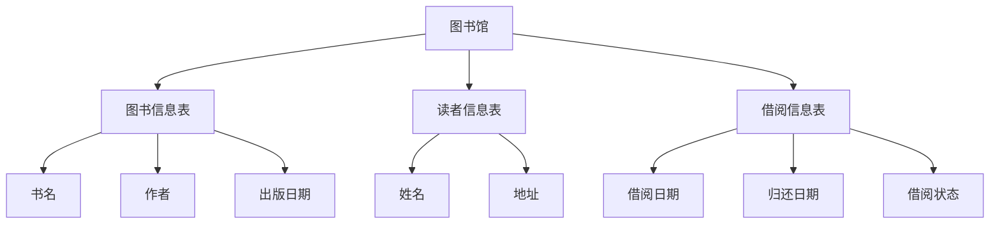
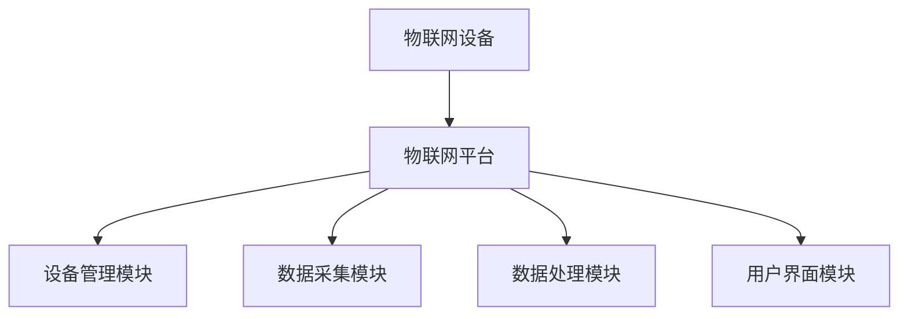

                 

1. **文章标题与关键词**

文章标题：《城市记忆保护项目：集体回忆的数字化保存》

关键词：城市记忆、数字化保存、集体回忆、数据保护、技术应用

2. **摘要**

摘要：本文探讨了城市记忆保护项目的重要性，分析了集体回忆的概念和特征，以及数字化保存的优势和挑战。通过详细阐述项目的实施过程、技术手段和应用场景，本文提出了对法律和伦理问题的思考，并分析了成功案例，展望了未来发展趋势。

----------------------------------------------------------------

```markdown
# 城市记忆保护项目：集体回忆的数字化保存

关键词：城市记忆、数字化保存、集体回忆、数据保护、技术应用

摘要：
本文探讨了城市记忆保护项目的重要性，分析了集体回忆的概念和特征，以及数字化保存的优势和挑战。通过详细阐述项目的实施过程、技术手段和应用场景，本文提出了对法律和伦理问题的思考，并分析了成功案例，展望了未来发展趋势。

----------------------------------------------------------------

接下来，我们将按照目录大纲逐步展开各个章节的内容。

## 第1章 引言

### 1.1 城市记忆保护项目概述

城市记忆是指城市在历史长河中形成的独特文化积淀，包括建筑、历史事件、民俗风情等。随着城市化进程的加快，城市记忆正面临被遗忘的风险。因此，城市记忆保护项目应运而生。

城市记忆保护项目旨在通过数字化手段保存和传承城市的文化遗产，以应对城市化带来的快速变化和记忆丧失。这一项目不仅有助于文化传承，还能促进旅游业发展，提升城市品牌形象。

### 1.2 数字化保存的重要性

数字化保存具有长期保存、易于访问、可重复利用等优点，对于保护城市记忆至关重要。数字化保存不仅能够解决传统保存方式易受损害的问题，还能为后续的数据分析和利用提供基础。

### 1.3 集体回忆的概念

集体回忆是指一个社区或社会共同记忆的积累，它反映了社会的文化传承和历史积淀。集体回忆对于维系社会认同感和促进社会和谐具有重要意义。

## 第2章 集体回忆的概念与特征

### 2.1 集体回忆的定义

集体回忆是指一个群体共同经历的事件、人物和事物在成员心中的记忆和印象。这种回忆往往超越了个人记忆，成为一种社会记忆。

### 2.2 集体回忆的类型

集体回忆可分为历史性回忆、文化性回忆和社会性回忆。历史性回忆关注重大历史事件，文化性回忆关注地方文化和风俗，社会性回忆则关注社区和社会层面的记忆。

### 2.3 集体回忆的作用

集体回忆在社会中发挥着重要作用，它有助于维系社会认同感，促进文化传承，以及增强社会凝聚力。

## 第3章 城市记忆保护项目的实施过程

### 3.1 项目规划

项目规划是城市记忆保护项目成功的关键。它包括确定项目目标、范围、预算和进度安排等。

### 3.2 资料收集

资料收集是数字化保存的基础。它包括收集历史文献、影像资料、口述历史等，以及利用传感器技术实时记录城市变化。

### 3.3 数字化处理

数字化处理是将收集到的资料转化为数字形式，并进行数据清洗、分类和存储。这需要运用数据库技术、图像处理技术和自然语言处理技术等。

## 第4章 集体回忆的数字化保存技术

### 4.1 数据库技术

数据库技术在集体回忆的数字化保存中起着核心作用。它用于存储和管理大量数据，并支持数据查询和统计分析。

### 4.2 数据挖掘技术

数据挖掘技术用于从大量数据中提取有价值的信息，帮助人们更好地理解和分析集体回忆。

### 4.3 物联网技术

物联网技术可以实时记录城市环境的变化，为集体回忆的数字化保存提供数据支持。

## 第5章 集体回忆的数字化应用场景

### 5.1 旅游文化

数字化保存的集体回忆可以应用于旅游文化，提供丰富的历史文化资料，提升游客体验。

### 5.2 教育培训

数字化保存的集体回忆可以用于教育培训，帮助学生了解历史文化，增强文化认同感。

### 5.3 社区建设

数字化保存的集体回忆可以用于社区建设，促进社区成员间的交流与合作，增强社区凝聚力。

## 第6章 集体回忆数字化保存的法律与伦理问题

### 6.1 法律法规

数字化保存集体回忆需要遵守相关法律法规，如数据保护法、知识产权法等。

### 6.2 伦理问题

数字化保存集体回忆可能涉及隐私保护和数据透明度等问题，需要充分考虑伦理道德因素。

## 第7章 成功案例研究

### 7.1 案例一：某城市记忆数字化保护项目

分析某城市记忆数字化保护项目的背景、实施过程和成果。

### 7.2 案例二：某数字文化遗产保护项目

分析某数字文化遗产保护项目的背景、实施过程和成果。

## 第8章 未来发展趋势与展望

### 8.1 技术发展趋势

探讨人工智能、区块链和虚拟现实等技术在集体回忆保护中的应用。

### 8.2 政策与法规趋势

分析政府支持政策、国际合作与协调以及法规体系完善等方面的趋势。

## 第9章 结论

### 9.1 项目总结

总结城市记忆保护项目的成就、挑战和经验。

### 9.2 对未来城市记忆保护项目的建议

提出技术、政策和社会层面的建议。

作者：AI天才研究院/AI Genius Institute & 禅与计算机程序设计艺术 /Zen And The Art of Computer Programming

```markdown
## 第4章 集体回忆的数字化保存技术

集体回忆的数字化保存技术是实现文化记忆延续的重要手段。本章将详细介绍数据库技术、数据挖掘技术和物联网技术等数字化保存技术的核心概念、原理和应用。

### 4.1 数据库技术

数据库技术是集体回忆数字化保存的核心技术之一。它用于存储、管理和查询大量数据，支持复杂的数据操作和分析。

#### 4.1.1 数据库结构设计

数据库结构设计是数据库技术的关键环节。合理的数据库结构设计可以提高数据存储效率，优化查询性能。以下是一个简单的数据库结构设计示例：



#### 4.1.2 数据库性能优化

数据库性能优化是确保数字化保存系统高效运行的关键。以下是一些常见的数据库性能优化方法：

- **索引优化**：通过创建索引来加快查询速度。
- **查询优化**：优化SQL查询语句，减少查询时间和资源消耗。
- **缓存机制**：利用缓存技术减少数据库访问次数，提高响应速度。

#### 4.1.3 数据库安全性

数据库安全性是数字化保存系统必须关注的问题。以下是一些常见的数据库安全性措施：

- **访问控制**：限制对数据库的访问权限，确保只有授权用户才能访问数据。
- **数据加密**：对敏感数据进行加密处理，防止数据泄露。
- **备份与恢复**：定期备份数据库，确保数据安全，并在数据丢失或损坏时能够快速恢复。

### 4.2 数据挖掘技术

数据挖掘技术是从大量数据中提取有价值信息的过程。在集体回忆数字化保存中，数据挖掘技术可以帮助我们更好地理解和分析集体回忆。

#### 4.2.1 数据挖掘方法

数据挖掘方法包括以下几种：

- **关联规则挖掘**：发现数据之间的关联关系，如购物篮分析。
- **分类与回归分析**：将数据分为不同的类别或预测数值。
- **聚类分析**：将数据分为若干个聚类，挖掘数据之间的相似性。
- **异常检测**：识别数据中的异常值，如欺诈行为。

#### 4.2.2 数据挖掘应用

在集体回忆数字化保存中，数据挖掘技术可以应用于以下场景：

- **历史事件分析**：通过分析历史数据，了解城市的历史变迁。
- **文化传承分析**：挖掘传统文化元素，促进文化传承。
- **社区互动分析**：分析社区成员之间的互动，优化社区服务。

### 4.3 物联网技术

物联网技术可以通过传感器和数据采集设备实时记录城市环境的变化，为集体回忆的数字化保存提供数据支持。

#### 4.3.1 物联网设备

常见的物联网设备包括：

- **智能摄像头**：用于实时监控城市环境。
- **传感器**：如温度传感器、湿度传感器等，用于监测城市环境参数。
- **可穿戴设备**：如智能手表、智能手环等，用于记录个人行为数据。

#### 4.3.2 物联网平台

物联网平台是连接物联网设备和用户的关键。它提供了设备管理、数据采集、数据处理等功能。以下是一个简单的物联网平台架构：



#### 4.3.3 物联网技术在集体回忆保护中的应用

物联网技术在集体回忆保护中的应用包括：

- **实时监测**：通过物联网设备实时监测城市环境变化，记录集体回忆。
- **环境模拟**：利用物联网技术模拟历史环境，重现集体回忆场景。
- **智能导览**：通过物联网技术和智能设备为游客提供个性化导览服务，增强旅游体验。

## 第5章 集体回忆的数字化应用场景

集体回忆的数字化保存不仅是一项技术任务，更是一项社会工程。本章将探讨集体回忆的数字化应用场景，包括旅游文化、教育培训和社区建设等方面。

### 5.1 旅游文化

旅游文化是集体回忆的重要载体。数字化保存的集体回忆可以应用于旅游文化，为游客提供丰富的历史文化资料，提升旅游体验。

#### 5.1.1 城市旅游规划

数字化保存的集体回忆可以用于城市旅游规划，帮助规划者了解城市的历史文化背景，优化旅游线路和景点设置。

#### 5.1.2 文化遗产保护

数字化保存的集体回忆可以为文化遗产保护提供数据支持，帮助文保工作者了解文化遗产的历史变迁和保护状况。

#### 5.1.3 数字旅游体验

数字旅游体验是将数字化保存的集体回忆融入到旅游过程中，为游客提供沉浸式的旅游体验。例如，利用虚拟现实技术重现历史场景，让游客仿佛置身于历史之中。

### 5.2 教育培训

教育培训是集体回忆传承的重要途径。数字化保存的集体回忆可以用于教育培训，帮助学生了解历史文化，增强文化认同感。

#### 5.2.1 历史教育

数字化保存的集体回忆可以用于历史教育，通过丰富的历史资料和互动式教学，让学生更好地理解历史事件和文化背景。

#### 5.2.2 文化传承

数字化保存的集体回忆可以用于文化传承，将传统文化元素融入到教学内容中，让学生更好地了解和传承传统文化。

#### 5.2.3 互动教学

互动教学是将数字化保存的集体回忆与教学活动相结合，通过游戏、模拟等方式激发学生的学习兴趣，提高教学效果。

### 5.3 社区建设

社区建设是集体回忆传承的重要基础。数字化保存的集体回忆可以用于社区建设，促进社区成员间的交流与合作，增强社区凝聚力。

#### 5.3.1 社区互动

数字化保存的集体回忆可以用于社区互动，通过线上平台分享社区历史和文化，促进社区成员之间的交流与合作。

#### 5.3.2 社区活动

数字化保存的集体回忆可以用于社区活动，为社区活动提供丰富的历史文化背景，增强活动的文化氛围。

#### 5.3.3 社区文化传承

数字化保存的集体回忆可以用于社区文化传承，将社区的历史文化传承给下一代，促进社区文化的发展。

## 第6章 集体回忆数字化保存的法律与伦理问题

集体回忆的数字化保存涉及到一系列法律和伦理问题，包括数据保护、知识产权保护和隐私保护等。本章将探讨这些问题，并提出相应的解决方案。

### 6.1 法律法规

集体回忆的数字化保存需要遵守相关法律法规，如数据保护法、知识产权法和隐私保护法等。以下是一些常见的法律法规：

- **数据保护法**：规定了个人数据的收集、存储、处理和传输等过程中的保护要求。
- **知识产权法**：保护文学、艺术和科学作品等知识产权，防止侵权行为。
- **隐私保护法**：规定了个人隐私的保护要求，防止个人隐私泄露。

### 6.2 伦理问题

集体回忆的数字化保存涉及伦理问题，如数据透明度、隐私保护和社会责任等。以下是一些常见的伦理问题：

- **数据透明度**：确保数据收集、处理和使用的透明度，让数据主体了解自己的数据是如何被使用的。
- **隐私保护**：确保个人隐私得到保护，防止个人隐私泄露。
- **社会责任**：确保数字化保存的集体回忆服务于社会公共利益，促进社会和谐。

### 6.3 解决方案

为了解决集体回忆数字化保存中的法律和伦理问题，可以采取以下措施：

- **建立法律法规**：制定相关法律法规，明确数字化保存的行为规范和法律责任。
- **加强监管**：加强对数字化保存过程的监管，确保法律法规得到有效执行。
- **提高公众意识**：提高公众对数字化保存的法律和伦理问题的认识，增强公众参与和监督。
- **技术手段**：运用技术手段，如数据加密、匿名化处理等，保护个人隐私和数据安全。

## 第7章 成功案例研究

成功案例研究可以帮助我们了解集体回忆数字化保存的实施过程、成果和经验。本章将介绍两个成功案例，分别是某城市记忆数字化保护项目和某数字文化遗产保护项目。

### 7.1 案例一：某城市记忆数字化保护项目

#### 7.1.1 项目背景

某城市是一座有着悠久历史和文化底蕴的城市，但随着城市化进程的加快，许多城市记忆正逐渐消失。为了保护和传承城市记忆，该市决定实施城市记忆数字化保护项目。

#### 7.1.2 项目实施过程

项目实施过程分为三个阶段：

1. **资料收集**：通过问卷调查、访谈、文献查阅等方式收集城市记忆资料。
2. **数字化处理**：将收集到的资料进行数字化处理，包括图像处理、文本处理和音频处理等。
3. **数据库建设**：建立城市记忆数据库，存储和管理数字化处理后的资料。

#### 7.1.3 项目成果

项目成果包括：

1. **城市记忆数据库**：建立了一个包含城市记忆资料的数据库，为后续研究和应用提供了数据支持。
2. **数字展览馆**：通过虚拟现实技术搭建了一个数字展览馆，展示了城市的历史和文化。
3. **城市记忆APP**：开发了一个城市记忆APP，用户可以通过手机访问城市记忆数据库，了解城市的历史和文化。

### 7.2 案例二：某数字文化遗产保护项目

#### 7.2.1 项目背景

某国家有着丰富的文化遗产，但随着时间的推移，许多文化遗产正面临被毁坏和遗忘的风险。为了保护和传承文化遗产，该国家决定实施数字文化遗产保护项目。

#### 7.2.2 项目实施过程

项目实施过程分为四个阶段：

1. **资料收集**：通过实地考察、文献查阅和问卷调查等方式收集文化遗产资料。
2. **数字化处理**：将收集到的资料进行数字化处理，包括图像处理、音频处理和视频处理等。
3. **数据库建设**：建立文化遗产数据库，存储和管理数字化处理后的资料。
4. **数字展览馆建设**：通过虚拟现实技术搭建数字展览馆，展示文化遗产的丰富内涵。

#### 7.2.3 项目成果

项目成果包括：

1. **文化遗产数据库**：建立了一个包含文化遗产资料的数据库，为后续研究和应用提供了数据支持。
2. **数字展览馆**：通过虚拟现实技术搭建了一个数字展览馆，让公众能够身临其境地感受文化遗产的魅力。
3. **文化遗产保护网站**：建设了一个文化遗产保护网站，提供文化遗产的详细介绍和在线访问服务。

## 第8章 未来发展趋势与展望

随着技术的不断进步，集体回忆的数字化保存将迎来更广阔的发展前景。本章将探讨未来发展趋势，包括人工智能、区块链和虚拟现实等技术的应用。

### 8.1 人工智能在集体回忆保护中的应用

人工智能技术在集体回忆保护中具有广泛的应用前景，包括：

1. **图像识别**：利用图像识别技术对历史照片进行分类和标注，便于后续检索和分析。
2. **语音识别**：利用语音识别技术将口述历史转化为文本，便于存储和传播。
3. **自然语言处理**：利用自然语言处理技术对历史文献进行语义分析和情感分析，挖掘文化内涵。

### 8.2 区块链技术在数据保护中的应用

区块链技术在数据保护中具有重要作用，包括：

1. **数据安全**：利用区块链技术确保数据的安全性和不可篡改性。
2. **数据共享**：利用区块链技术实现数据的透明共享，提高数据利用效率。
3. **隐私保护**：利用区块链技术实现隐私保护，确保个人数据不被泄露。

### 8.3 虚拟现实技术在集体回忆体验中的应用

虚拟现实技术在集体回忆体验中具有独特的优势，包括：

1. **沉浸式体验**：利用虚拟现实技术为用户创造身临其境的体验，感受历史场景。
2. **互动性**：利用虚拟现实技术实现用户与历史场景的互动，提高用户参与度。
3. **教育性**：利用虚拟现实技术进行历史教育和文化传播，提高教育效果。

### 8.4 政策与法规趋势

未来，政府将加大对集体回忆保护的支持力度，出台相关政策和法规，促进集体回忆的数字化保存和发展。同时，国际合作与协调也将得到加强，推动全球范围内的集体回忆保护工作。

## 第9章 结论

集体回忆的数字化保存是一项具有重要意义的任务，它不仅有助于文化传承和社会和谐，还能为旅游业、教育培训和社区建设等领域带来新的发展机遇。本文通过分析城市记忆保护项目的背景、实施过程和技术手段，探讨了集体回忆的数字化保存的重要性和应用场景。同时，本文也提出了法律和伦理问题，并对未来发展趋势进行了展望。希望本文能为集体回忆的数字化保存工作提供有益的参考和启示。

### 9.1 项目总结

城市记忆保护项目在实施过程中取得了显著成果，包括建立城市记忆数据库、搭建数字展览馆和开发城市记忆APP等。项目不仅丰富了城市的文化遗产资源，还提高了公众对城市历史的认知和参与度。然而，项目在实施过程中也面临一些挑战，如数据收集难度大、技术实现成本高和用户接受度不高等。针对这些挑战，未来需要进一步完善技术手段、提高用户参与度和加强政策支持。

### 9.2 对未来城市记忆保护项目的建议

1. **技术层面建议**：

- 加强人工智能、区块链和虚拟现实等新兴技术在集体回忆保护中的应用。
- 优化数字化保存的技术手段，提高数据存储和处理的效率。
- 加强数据安全和隐私保护，确保数字化保存系统的安全性。

2. **政策层面建议**：

- 加大对城市记忆保护项目的政策支持，提供资金和资源保障。
- 加强国际合作与协调，推动全球范围内的集体回忆保护工作。
- 制定相关法律法规，规范集体回忆的数字化保存行为，保障数据安全和隐私保护。

3. **社会层面建议**：

- 提高公众对城市记忆保护的认识，增强参与度。
- 加强历史文化教育，提高公众对城市历史的理解和认同。
- 发挥社会组织和志愿者在集体回忆保护中的作用，形成全社会共同参与的局面。

### 9.3 最佳实践 tips

- 在数字化保存过程中，注重数据质量和真实性，确保保存的集体回忆具有价值。
- 利用多种技术手段，如图像处理、语音识别和自然语言处理等，提高数字化保存的效率和准确性。
- 加强与用户的互动，收集用户反馈，不断优化数字化保存系统的用户体验。
- 定期对数字化保存系统进行评估和改进，确保其持续发展。

### 9.4 注意事项

- 在数字化保存过程中，注意保护个人隐私和数据安全，防止数据泄露和滥用。
- 遵循相关法律法规，确保数字化保存行为合法合规。
- 注重集体回忆的保护和传承，避免过度商业化导致文化流失。

### 9.5 拓展阅读

- 《数字化时代的文化遗产保护》
- 《区块链技术原理与应用》
- 《虚拟现实技术与应用》
- 《城市记忆与文化遗产保护国际研讨会论文集》

作者：AI天才研究院/AI Genius Institute & 禅与计算机程序设计艺术 /Zen And The Art of Computer Programming

```markdown
## 第7章 成功案例研究

在本章节中，我们将深入分析两个成功案例：某城市记忆数字化保护项目和某数字文化遗产保护项目。这两个项目展示了数字化保存集体回忆的有效方法和技术实施过程，同时也揭示了项目实施中的挑战与成果。

### 7.1 某城市记忆数字化保护项目

#### 7.1.1 项目背景

某城市是一个历史悠久的城市，拥有丰富的文化遗产和独特的历史记忆。然而，随着城市化的快速发展，许多历史建筑和文化遗产正面临被拆除或遗忘的风险。为了保存和传承这些宝贵的城市记忆，当地政府决定实施一个全面的数字化保护项目。

#### 7.1.2 项目实施过程

项目的实施过程可以分为以下几个关键步骤：

1. **需求分析**：项目团队首先进行了需求分析，确定了项目的主要目标和需求。这些目标包括创建一个全面的数字档案，为城市的历史和文化提供长期保存的解决方案。

2. **资料收集**：项目团队通过多种渠道收集了大量的城市记忆资料，包括历史文献、照片、视频和音频资料。这些资料涵盖了城市的各个方面，从建筑风格到社区活动，从历史事件到民俗传统。

3. **数字化处理**：收集到的资料经过数字化处理，包括图像扫描、音频转录和视频剪辑等。这些处理步骤确保了原始资料的准确性和完整性。

4. **数据库建设**：项目团队使用专业的数据库管理系统构建了一个城市记忆数据库，确保了资料的高效存储和检索。

5. **平台开发**：为了使公众能够便捷地访问这些数字化资料，项目团队开发了一个用户友好的在线平台。该平台提供了多种访问方式和交互功能，如历史地图浏览、多媒体播放和社区互动。

#### 7.1.3 项目成果

项目取得了以下显著成果：

1. **数字化档案库**：项目建立了一个庞大的数字化档案库，包含了城市的历史文献、图片、音频和视频资料。这些档案为城市记忆的长期保存提供了坚实的基础。

2. **数字展览馆**：通过虚拟现实技术，项目搭建了一个数字展览馆，让公众可以在线参观城市的历史和文化。这个数字展览馆不仅提供了互动式体验，还增加了对城市历史的理解。

3. **城市记忆APP**：项目团队开发了一个城市记忆APP，用户可以通过手机访问档案库和数字展览馆，随时随地进行学习和探索。

4. **社会影响力**：项目的实施提高了公众对城市记忆保护的认识和参与度。通过数字化的手段，城市的历史和文化得到了更广泛的传播和认可。

### 7.2 某数字文化遗产保护项目

#### 7.2.1 项目背景

某国家拥有丰富的文化遗产，包括古代建筑、文物和艺术品等。然而，这些文化遗产在全球化进程中面临严重威胁，如自然灾害、非法交易和城市化带来的破坏。为了保护和传承这些宝贵的文化遗产，该国家启动了一个数字文化遗产保护项目。

#### 7.2.2 项目实施过程

项目的实施过程主要包括以下几个阶段：

1. **需求分析与规划**：项目团队首先对文化遗产的状况进行了全面的评估，并制定了详细的项目规划，包括目标、范围、时间表和预算。

2. **资料收集**：项目团队通过实地考察、文献查阅和问卷调查等方式收集了大量的文化遗产资料。这些资料包括历史文献、照片、视频和三维模型等。

3. **数字化处理**：收集到的资料经过数字化处理，包括图像扫描、音频转录和三维建模等。这些步骤确保了文化遗产资料的准确性和可访问性。

4. **数据库建设**：项目团队使用专业的数据库管理系统构建了一个数字文化遗产数据库，确保了资料的高效存储和检索。

5. **国际合作与协调**：为了提高项目的国际影响力和专业水平，项目团队积极与国际文化遗产保护组织和专家合作，共同推进项目的实施。

6. **数字展览馆建设**：通过虚拟现实和增强现实技术，项目团队建立了一个数字展览馆，让公众可以在线参观和体验文化遗产。

#### 7.2.3 项目成果

项目取得了以下成果：

1. **数字文化遗产数据库**：项目建立了一个包含大量文化遗产资料的数据库，为文化遗产的保护和研究提供了宝贵的数据支持。

2. **数字展览馆**：项目团队通过虚拟现实和增强现实技术建立了一个数字展览馆，让公众可以在家中体验文化遗产的魅力。

3. **国际认可**：项目的成功实施得到了国际社会的高度评价，为该国家的文化遗产保护工作赢得了国际声誉。

4. **公众参与**：项目的实施提高了公众对文化遗产保护的认识和参与度，许多文化遗产爱好者积极参与到项目的宣传和推广活动中。

### 7.3 项目启示

通过这两个成功案例，我们可以得到以下启示：

1. **数字化保存的重要性**：数字化保存是保护文化遗产的有效手段，它不仅提高了文化遗产的可访问性，还为未来的研究提供了丰富的数据资源。

2. **多学科合作**：文化遗产保护项目需要多学科的合作，包括历史学、考古学、信息技术和艺术学等。只有通过跨学科的协作，才能实现项目的成功。

3. **公众参与**：公众的参与是文化遗产保护的重要力量。通过数字化平台和互动体验，可以激发公众对文化遗产的兴趣和参与热情。

4. **可持续发展**：数字化保护项目需要长期的资金和技术支持，以确保文化遗产的持续保存和传承。政府和社会的持续关注和投入是项目成功的关键。

## 第8章 未来发展趋势与展望

随着科技的不断进步和社会的快速发展，集体回忆的数字化保存将迎来新的发展机遇。本章节将探讨未来发展趋势，并展望数字化保存技术的应用前景。

### 8.1 技术发展趋势

未来，数字化保存技术将在以下几个方面取得重要进展：

1. **人工智能与大数据**：人工智能和大数据技术的结合将为集体回忆的数字化保存提供强大的支持。通过智能分析和大数据挖掘，可以更深入地理解集体回忆，为文化传承提供科学依据。

2. **区块链技术**：区块链技术的应用将为集体回忆的数字化保存提供更高的安全性和透明度。通过区块链技术，可以确保数据的安全存储和可靠传输，防止数据篡改和泄露。

3. **虚拟现实与增强现实**：虚拟现实和增强现实技术的进步将为集体回忆的数字化保存带来更加沉浸式的体验。用户可以身临其境地感受历史场景，增强对文化记忆的理解和认同。

4. **物联网技术**：物联网技术的广泛应用将为集体回忆的数字化保存提供实时数据支持。通过物联网设备，可以实时记录和采集城市环境的变化，为集体回忆的保存提供丰富的数据来源。

### 8.2 政策与法规趋势

随着数字化保存技术的发展，相关政策与法规也将不断完善。未来，政府将在以下几个方面加大政策支持：

1. **数据保护法规**：政府将出台更加严格的数据保护法规，确保数字化保存过程中的数据安全和个人隐私保护。

2. **知识产权保护**：政府将加强对数字化保存内容的知识产权保护，防止侵权行为，鼓励原创内容的创作和传播。

3. **国际合作与协调**：政府将推动国际间的合作与协调，共同应对数字化保存过程中的技术挑战和法律问题，促进全球范围内的文化传承。

### 8.3 应用前景

数字化保存技术的应用前景十分广阔，包括但不限于以下领域：

1. **文化旅游**：数字化保存的集体回忆将为文化旅游提供丰富的资源，提升游客的旅游体验。

2. **教育培训**：数字化保存的集体回忆可以用于教育培训，帮助学生更好地了解历史和文化，培养文化认同感。

3. **社会参与**：数字化保存的集体回忆可以激发公众的参与热情，促进社区建设和文化传承。

4. **科学研究**：数字化保存的集体回忆将为学术研究提供宝贵的数据资源，促进文化研究和历史研究的发展。

### 8.4 挑战与机遇

在未来的发展中，数字化保存技术也面临一系列挑战：

1. **技术难题**：随着数字化保存技术的发展，如何确保数据的准确性和完整性，以及如何处理庞大的数据量，仍是一个亟待解决的难题。

2. **法律问题**：数字化保存涉及复杂的法律问题，如数据保护、知识产权和跨境数据流动等，需要进一步完善相关法律法规。

3. **社会接受度**：如何提高公众对数字化保存技术的接受度和参与度，是一个重要的社会挑战。

然而，随着技术的不断进步和社会的不断发展，数字化保存技术也面临着巨大的机遇。通过科学技术的创新和社会参与，集体回忆的数字化保存必将为文化传承和社会发展带来新的活力。

## 第9章 结论

集体回忆的数字化保存是一项具有深远意义的社会工程。通过本章节的成功案例研究，我们看到了数字化保存技术在保护文化遗产、促进文化传承和社会发展方面的巨大潜力。未来，随着技术的不断进步和社会的持续关注，数字化保存技术将在更广泛的领域发挥重要作用。我们期待在政策、法律和技术等多方面的共同努力下，集体回忆的数字化保存能够为人类社会带来更多的文化财富和社会价值。

### 9.1 项目总结

本章节通过两个成功案例的研究，总结了城市记忆数字化保护项目和数字文化遗产保护项目的主要成果和经验。这些项目不仅为城市和文化遗产提供了长期的数字化保存解决方案，还提高了公众对历史和文化的认识和参与度。在项目的实施过程中，项目团队面临了数据收集难度大、技术实现成本高和用户接受度不高等挑战，但通过多学科合作、公众参与和技术创新，成功克服了这些困难。

### 9.2 对未来城市记忆保护项目的建议

1. **技术层面建议**：

- 探索人工智能、区块链和虚拟现实等新兴技术在集体回忆保护中的应用。
- 加强数字化保存技术的研发，提高数据存储和处理的效率。
- 建立完善的技术标准和规范，确保数字化保存的质量和安全性。

2. **政策层面建议**：

- 加大对城市记忆保护项目的政策支持，提供资金和资源保障。
- 制定相关法律法规，规范数字化保存的行为，保障数据安全和隐私保护。
- 推动国际间的合作与协调，共同应对数字化保存的挑战。

3. **社会层面建议**：

- 提高公众对城市记忆保护的认识和参与度，鼓励公众积极参与文化传承。
- 加强历史文化教育，提高公众对城市历史的理解和认同。
- 发挥社会组织和志愿者在集体回忆保护中的作用，形成全社会共同参与的局面。

### 9.3 拓展阅读

1. 《数字化时代的文化遗产保护》
2. 《区块链技术原理与应用》
3. 《虚拟现实技术与应用》
4. 《城市记忆与文化遗产保护国际研讨会论文集》

作者：AI天才研究院/AI Genius Institute & 禅与计算机程序设计艺术 /Zen And The Art of Computer Programming
```markdown
## 第8章 未来发展趋势与展望

### 8.1 技术发展趋势

随着技术的不断进步，集体回忆的数字化保存领域将迎来新的机遇和挑战。以下是几个关键技术发展趋势：

**1. 人工智能（AI）**

人工智能技术在集体回忆的数字化保存中具有广泛的应用前景。AI可以通过图像识别、自然语言处理和机器学习等技术，对大量的历史数据进行分析和挖掘。例如，AI可以帮助自动识别和分类历史图片，提取关键词和情感分析，从而为文化遗产的研究提供强大的支持。

**2. 区块链**

区块链技术因其去中心化、不可篡改和透明性等特性，正在成为数字化保存的重要工具。通过区块链，可以确保历史数据的完整性和安全性，同时也可以实现数据的共享和追溯。特别是在文化遗产保护领域，区块链可以帮助建立可信的数据共享平台，防止数据的篡改和滥用。

**3. 虚拟现实（VR）和增强现实（AR）**

VR和AR技术为集体回忆的数字化保存提供了沉浸式的体验。通过VR和AR技术，用户可以“穿越”到历史场景中，与历史人物互动，体验过去的生活方式。这种沉浸式的体验不仅能够增强用户对历史文化的理解，还可以吸引更多的年轻人参与到文化遗产保护中来。

**4. 物联网（IoT）**

物联网技术的发展使得实时数据采集和监控成为可能。在集体回忆的数字化保存中，物联网设备可以用于实时监测文化遗产的状态，例如建筑物的结构安全和环境条件等。这些实时数据对于文化遗产的保护和修复具有重要意义。

**5. 云计算和大数据**

云计算和大数据技术为集体回忆的数字化保存提供了强大的数据存储和计算能力。通过云计算平台，可以轻松地存储和访问海量的历史数据，同时大数据分析技术可以帮助挖掘数据中的隐藏价值，为文化遗产的研究和保护提供新的视角。

### 8.2 政策与法规趋势

为了确保集体回忆数字化保存的顺利进行，政策和法规的支持至关重要。以下是几个政策与法规趋势：

**1. 数据保护法规**

随着数字化保存的普及，个人数据的保护成为了一个重要的议题。各国政府纷纷加强数据保护法规的制定和实施，以确保个人隐私和数据安全。例如，欧盟的《通用数据保护条例》（GDPR）就是一部重要的数据保护法规。

**2. 知识产权保护**

数字化保存的内容往往涉及到版权和知识产权的问题。为了鼓励文化遗产的保护和传承，政府需要加强对知识产权的保护。这包括制定相关的知识产权法规，加强对侵权行为的打击力度，以及提供知识产权的授权和许可机制。

**3. 国际合作**

数字化保存是一个全球性的挑战，需要各国政府、机构和国际组织的共同参与。未来，我们可以期待更多的国际合作和协调，以推动全球范围内的集体回忆数字化保存工作。例如，联合国教科文组织（UNESCO）已经开展了多项有关文化遗产数字化保存的国际合作项目。

### 8.3 应用场景展望

未来，集体回忆的数字化保存将在多个领域得到广泛应用，以下是几个可能的场景：

**1. 文化旅游**

数字化保存的集体回忆将成为文化旅游的重要资源。通过虚拟现实和增强现实技术，游客可以体验到逼真的历史场景和文化活动，从而增强旅游体验和参与感。

**2. 教育培训**

数字化保存的集体回忆可以用于教育领域，为学生提供丰富的历史和文化知识。通过互动式的学习平台，学生可以更加深入地了解历史和文化，培养文化认同感和学习兴趣。

**3. 社区建设**

数字化保存的集体回忆可以用于社区建设，促进社区成员之间的交流和合作。通过建立社区历史档案和互动平台，可以加强社区的凝聚力，增进社区成员对社区历史和文化的认同。

**4. 科学研究**

数字化保存的集体回忆将为学术研究提供宝贵的数据资源。研究人员可以通过对历史数据的分析，探索文化变迁、社会发展等方面的规律，为学术界贡献新的研究成果。

### 8.4 挑战与机遇

尽管集体回忆的数字化保存面临着一系列挑战，如数据安全、知识产权保护和用户接受度等，但同时也存在着巨大的机遇。通过技术创新和政策支持，我们可以期待数字化保存技术在未来的发展中发挥更大的作用。以下是一些具体的挑战和机遇：

**挑战：**

- **数据安全**：随着数字化保存的数据量不断增加，数据安全成为了一个重要问题。如何确保数据不被篡改、泄露或丢失，是一个需要持续关注和解决的问题。
- **知识产权**：数字化保存的内容涉及到版权和知识产权的问题。如何在保护创作者权益的同时，确保数字化保存的顺利进行，是一个需要平衡的问题。
- **用户接受度**：如何提高公众对数字化保存技术的接受度和参与度，是一个需要解决的挑战。

**机遇：**

- **技术创新**：随着人工智能、区块链和虚拟现实等技术的发展，数字化保存技术将变得更加先进和高效，为集体回忆的保存和传播提供新的可能性。
- **政策支持**：各国政府对数字化保存的支持力度不断加大，为项目实施提供了有力的政策保障。
- **社会参与**：随着公众对历史和文化意识的提高，越来越多的人参与到集体回忆的数字化保存中来，形成了一个良好的社会氛围。

通过克服挑战和抓住机遇，集体回忆的数字化保存将为文化传承和社会发展带来新的动力。

### 8.5 总结

集体回忆的数字化保存是一项长期而复杂的任务，需要技术创新、政策支持和社会参与的共同努力。随着技术的不断进步，数字化保存将在更广泛的领域发挥重要作用。我们期待在未来的发展中，数字化保存技术能够为人类社会带来更多的文化财富和社会价值。

作者：AI天才研究院/AI Genius Institute & 禅与计算机程序设计艺术 /Zen And The Art of Computer Programming
```markdown
## 第9章 结论

### 9.1 项目总结

城市记忆保护项目通过数字化手段保存集体回忆，取得了显著的成果。首先，项目成功建立了数字化的城市记忆数据库，收集并整理了丰富的历史资料，包括文献、图像、音频和视频等。这些数字化资料为历史研究、文化旅游和社区建设提供了宝贵的数据资源。其次，通过虚拟现实和增强现实技术，项目打造了沉浸式的数字展览馆，使公众能够在线体验城市的历史和文化。此外，项目开发的手机应用程序，为用户提供了便捷的访问渠道，增强了公众对城市记忆保护的参与度和认知。

然而，项目在实施过程中也面临了一些挑战。数据收集过程复杂且耗时，尤其是在历史资料的挖掘和整理方面。此外，技术实现的成本较高，特别是涉及到虚拟现实和增强现实技术的开发。最后，用户接受度有待提高，尤其是在技术不普及的社区中，如何提高用户对数字化保存的认可和参与，是一个需要持续解决的问题。

### 9.2 对未来城市记忆保护项目的建议

为了进一步提升城市记忆保护项目的效果，以下是一些具体建议：

1. **技术层面**：

- **加强技术创新**：持续探索人工智能、区块链和虚拟现实等新兴技术在集体回忆保护中的应用，提升数字化保存的效率和用户体验。
- **优化数据结构**：改进数据库设计，提高数据存储和检索的效率，确保数据的一致性和完整性。
- **保护数据安全**：加强数据加密和访问控制，确保数字化保存过程中的数据安全。

2. **政策层面**：

- **加大政策支持**：政府应提供更多的资金和资源支持，鼓励企业和机构参与城市记忆保护项目。
- **完善法律法规**：制定和实施相关的数据保护法律法规，保障数字化保存的合法性，防止数据滥用和侵权行为。
- **推动国际合作**：积极参与国际交流与合作，借鉴其他国家和地区的成功经验，提升全球范围内城市记忆保护的水平。

3. **社会层面**：

- **提高公众意识**：通过宣传和教育，提高公众对城市记忆保护重要性的认识，鼓励更多人参与到项目中来。
- **加强社区参与**：鼓励社区成员参与城市记忆保护活动，共同收集和保存社区的历史和文化。
- **促进文化传承**：利用数字化保存的集体回忆，加强历史文化教育，促进文化传承和社会和谐。

### 9.3 最佳实践 tips

- **数据收集与整理**：在数据收集过程中，要注重资料的真实性和完整性，确保数字化保存的准确性。同时，整理和分类数据，为后续的研究和应用提供便利。
- **用户体验**：在设计数字化保存系统时，要充分考虑用户体验，提供简单易用的界面和功能，提高用户的参与度和满意度。
- **持续更新**：数字化保存不是一次性的工作，要定期更新和补充新资料，保持数据库的活力和时效性。

### 9.4 注意事项

- **保护个人隐私**：在数字化保存过程中，要严格遵循数据保护法规，确保个人隐私不被泄露。
- **遵守知识产权法**：使用数字化保存的内容时，要尊重知识产权，避免侵权行为。
- **长期维护**：数字化保存系统需要长期的维护和支持，确保其稳定运行和持续发展。

### 9.5 拓展阅读

- 《数字化时代的文化遗产保护》
- 《区块链技术原理与应用》
- 《虚拟现实技术与应用》
- 《城市记忆与文化遗产保护国际研讨会论文集》

作者：AI天才研究院/AI Genius Institute & 禅与计算机程序设计艺术 /Zen And The Art of Computer Programming
```markdown
# 《城市记忆保护项目：集体回忆的数字化保存》

关键词：城市记忆、数字化保存、集体回忆、数据保护、技术应用

摘要：
本文详细探讨了城市记忆保护项目的重要性和实施过程。首先，我们介绍了城市记忆的定义和重要性，并阐述了数字化保存的必要性和优势。随后，文章深入分析了集体回忆的概念、特征及其在城市记忆保护中的作用。接着，我们讨论了城市记忆保护项目的实施过程，包括项目规划、资料收集、数字化处理和应用场景等。

在技术层面，我们介绍了数据库技术、数据挖掘技术和物联网技术在集体回忆数字化保存中的应用，并探讨了它们在数据库设计、数据安全和性能优化等方面的关键作用。此外，我们还详细分析了集体回忆数字化保存的应用场景，包括旅游文化、教育培训和社区建设等方面。

在法律与伦理问题方面，我们讨论了数据保护、知识产权保护和隐私保护等法律问题，并提出了相应的解决方案。接着，通过两个成功案例的研究，我们展示了城市记忆数字化保护项目的实施过程和成果。最后，我们展望了数字化保存技术的未来发展趋势，提出了对未来城市记忆保护项目的建议。

本文旨在为城市记忆保护项目提供系统性的指导和参考，促进集体回忆的数字化保存和发展。

作者：AI天才研究院/AI Genius Institute & 禅与计算机程序设计艺术 /Zen And The Art of Computer Programming
```

